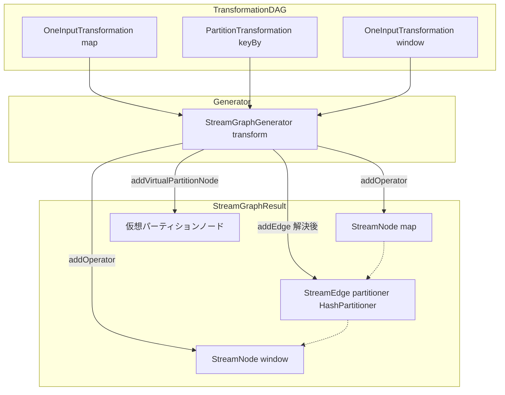

# 第7章 StreamGraph の構築

> **本章で読むソース**
>
> - [`StreamGraphGenerator.java`](https://github.com/apache/flink/blob/release-2.3.0/flink-runtime/src/main/java/org/apache/flink/streaming/api/graph/StreamGraphGenerator.java)
> - [`StreamGraph.java`](https://github.com/apache/flink/blob/release-2.3.0/flink-runtime/src/main/java/org/apache/flink/streaming/api/graph/StreamGraph.java)
> - [`StreamNode.java`](https://github.com/apache/flink/blob/release-2.3.0/flink-runtime/src/main/java/org/apache/flink/streaming/api/graph/StreamNode.java)
> - [`StreamEdge.java`](https://github.com/apache/flink/blob/release-2.3.0/flink-runtime/src/main/java/org/apache/flink/streaming/api/graph/StreamEdge.java)
> - [`PartitionTransformationTranslator.java`](https://github.com/apache/flink/blob/release-2.3.0/flink-runtime/src/main/java/org/apache/flink/streaming/runtime/translators/PartitionTransformationTranslator.java)
> - [`AbstractOneInputTransformationTranslator.java`](https://github.com/apache/flink/blob/release-2.3.0/flink-runtime/src/main/java/org/apache/flink/streaming/runtime/translators/AbstractOneInputTransformationTranslator.java)

## この章の狙い

第6章では、ユーザープログラムが `Transformation` の木として組み立てられる過程を見た。
この `Transformation` の木は、まだ演算子（operator）と入力の依存関係を表すだけで、パーティショナやシャッフルの方式といった実行時の性質を持たない。
本章では、この木を辿って **StreamGraph** を構築する `StreamGraphGenerator` を読み、演算子がどのように `StreamNode` に、依存関係がどのように `StreamPartitioner` を持つ `StreamEdge` になるかを追う。

## 前提

**StreamGraph** は、`DataStream` API が組み立てる最初の内部表現であり、ユーザーが記述した演算子と、その間のデータ交換方法をそのまま保持するグラフである。
**StreamNode** は StreamGraph 上の一つの演算子を表す頂点であり、**StreamEdge** はその間を結ぶ辺である。
StreamGraph は API 段階の論理表現にすぎず、複数の演算子を一つのタスクにまとめるオペレーターチェインの最適化は、次段の JobGraph への変換（第8章）で行われる。

## Transformation の木を辿る StreamGraphGenerator

`StreamGraphGenerator` は、`Transformation` の集合から StreamGraph を組み立てるクラスである。
クラス冒頭のコメントは、変換の進め方を次のように説明する。

[`StreamGraphGenerator.java` L107-L132](https://github.com/apache/flink/blob/release-2.3.0/flink-runtime/src/main/java/org/apache/flink/streaming/api/graph/StreamGraphGenerator.java#L107-L132)

```java
/**
 * A generator that generates a {@link StreamGraph} from a graph of {@link Transformation}s.
 *
 * <p>This traverses the tree of {@code Transformations} starting from the sinks. At each
 * transformation we recursively transform the inputs, then create a node in the {@code StreamGraph}
 * and add edges from the input Nodes to our newly created node. The transformation methods return
 * the IDs of the nodes in the StreamGraph that represent the input transformation. Several IDs can
 * be returned to be able to deal with feedback transformations and unions.
 *
 * <p>Partitioning, split/select and union don't create actual nodes in the {@code StreamGraph}. For
 * these, we create a virtual node in the {@code StreamGraph} that holds the specific property, i.e.
 * partitioning, selector and so on. When an edge is created from a virtual node to a downstream
 * node the {@code StreamGraph} resolved the id of the original node and creates an edge in the
 * graph with the desired property. For example, if you have this graph:
 *
 * <pre>
 *     Map-1 -&gt; HashPartition-2 -&gt; Map-3
 * </pre>
 *
 * <p>where the numbers represent transformation IDs. We first recurse all the way down. {@code
 * Map-1} is transformed, i.e. we create a {@code StreamNode} with ID 1. Then we transform the
 * {@code HashPartition}, for this, we create virtual node of ID 4 that holds the property {@code
 * HashPartition}. This transformation returns the ID 4. Then we transform the {@code Map-3}. We add
 * the edge {@code 4 -> 3}. The {@code StreamGraph} resolved the actual node with ID 1 and creates
 * and edge {@code 1 -> 3} with the property HashPartition.
 */
```

このコメントには、本章で扱う二つの論点がすでに書かれている。
一つは、走査が **Sink 側から入力方向へ再帰的に遡る**ことである。
もう一つは、パーティショニングや split/select、union といった一部の `Transformation` は StreamGraph 上に実体の `StreamNode` を作らず、**仮想ノード**として扱われることである。

走査のエントリーポイントは `generate()` である。

[`StreamGraphGenerator.java` L253-L303](https://github.com/apache/flink/blob/release-2.3.0/flink-runtime/src/main/java/org/apache/flink/streaming/api/graph/StreamGraphGenerator.java#L253-L266)

```java
    public StreamGraph generate() {
        streamGraph =
                new StreamGraph(
                        configuration, executionConfig, checkpointConfig, savepointRestoreSettings);
        shouldExecuteInBatchMode = shouldExecuteInBatchMode();
        configureStreamGraph(streamGraph);

        alreadyTransformed = new IdentityHashMap<>();

        for (Transformation<?> transformation : transformations) {
            transform(transformation);
        }
        streamGraph.setSlotSharingGroupResource(slotSharingGroupResources);

        setFineGrainedGlobalStreamExchangeMode(streamGraph);
        // ... (中略) ...
    }
```

`transformations` フィールドには、`StreamExecutionEnvironment` に登録された Sink 相当の `Transformation`（第6章参照）が入っている。
`generate()` はこの Sink の集合を起点に `transform()` を呼び、そこから入力方向へ再帰的に辿ることで、木全体を StreamGraph に変換する。

`transform()` 自体は次のように、変換済みかどうかの確認と、種類ごとの `TransformationTranslator` への委譲だけを行う薄いディスパッチャである。

[`StreamGraphGenerator.java` L457-L529](https://github.com/apache/flink/blob/release-2.3.0/flink-runtime/src/main/java/org/apache/flink/streaming/api/graph/StreamGraphGenerator.java#L463-L520)

```java
    private Collection<Integer> transform(Transformation<?> transform) {
        if (alreadyTransformed.containsKey(transform)) {
            return alreadyTransformed.get(transform);
        }

        LOG.debug("Transforming " + transform);
        // ... (中略) ...

        @SuppressWarnings("unchecked")
        final TransformationTranslator<?, Transformation<?>> translator =
                (TransformationTranslator<?, Transformation<?>>)
                        translatorMap.get(transform.getClass());

        Collection<Integer> transformedIds;
        if (translator != null) {
            transformedIds = translate(translator, transform);
        } else {
            transformedIds = legacyTransform(transform);
        }

        // need this check because the iterate transformation adds itself before
        // transforming the feedback edges
        if (!alreadyTransformed.containsKey(transform)) {
            alreadyTransformed.put(transform, transformedIds);
        }

        return transformedIds;
    }
```

`alreadyTransformed` は `Transformation` から、その変換結果である StreamGraph 上のノード ID 集合へのマップである。
同じ `Transformation` インスタンスが複数の下流から参照される場合（fan-out や union）でも、最初の呼び出し時に一度だけ変換され、以降は `alreadyTransformed` から結果が引かれる。
`translatorMap` は `Transformation` の実クラスと `TransformationTranslator` を対応づける静的マップであり、`OneInputTransformation` なら `OneInputTransformationTranslator`、`PartitionTransformation` なら `PartitionTransformationTranslator` というように、種別ごとに変換処理が分離されている。

`translate()` は入力側を先に `transform()` して StreamGraph 上のノード ID を確定させ、そのうえで対応する `TransformationTranslator` を呼び出す。

[`StreamGraphGenerator.java` L589-L618](https://github.com/apache/flink/blob/release-2.3.0/flink-runtime/src/main/java/org/apache/flink/streaming/api/graph/StreamGraphGenerator.java#L589-L618)

```java
    private Collection<Integer> translate(
            final TransformationTranslator<?, Transformation<?>> translator,
            final Transformation<?> transform) {
        checkNotNull(translator);
        checkNotNull(transform);

        final List<Collection<Integer>> allInputIds = getParentInputIds(transform.getInputs());

        // the recursive call might have already transformed this
        if (alreadyTransformed.containsKey(transform)) {
            return alreadyTransformed.get(transform);
        }

        final String slotSharingGroup =
                determineSlotSharingGroup(
                        transform.getSlotSharingGroup().isPresent()
                                ? transform.getSlotSharingGroup().get().getName()
                                : null,
                        allInputIds.stream()
                                .flatMap(Collection::stream)
                                .collect(Collectors.toList()));

        final TransformationTranslator.Context context =
                new ContextImpl(
                        this, streamGraph, slotSharingGroup, configuration, transformations);

        return shouldExecuteInBatchMode
                ? translator.translateForBatch(transform, context)
                : translator.translateForStreaming(transform, context);
    }
```

`getParentInputIds()` の内部で入力の `Transformation` を再帰的に `transform()` することで、木全体を Sink から入力方向へ深さ優先で辿る形になる。
ストリーミングモードとバッチモードで `translateForStreaming` / `translateForBatch` を呼び分けている点は、第1章で触れた `RuntimeExecutionMode` の統一実行の具体的な現れであり、演算子の実装自体を分岐させることなくシャッフルの方式だけを切り替える設計になっている。

## StreamNode と StreamEdge を実際に追加する Translator

演算子を持つ `Transformation`（`OneInputTransformation` など）の Translator は、`StreamGraph` に対して `addOperator()` と `addEdge()` を呼び、実体の `StreamNode` と `StreamEdge` を作る。
`OneInputTransformationTranslator` の基底クラスである `AbstractOneInputTransformationTranslator` の実装を見る。

[`AbstractOneInputTransformationTranslator.java` L47-L96](https://github.com/apache/flink/blob/release-2.3.0/flink-runtime/src/main/java/org/apache/flink/streaming/runtime/translators/AbstractOneInputTransformationTranslator.java#L64-L94)

```java
        streamGraph.addOperator(
                transformationId,
                slotSharingGroup,
                transformation.getCoLocationGroupKey(),
                operatorFactory,
                inputType,
                transformation.getOutputType(),
                transformation.getName());
        streamGraph.setAttribute(transformationId, transformation.getAttribute());
        // ... (中略) ...
        streamGraph.setParallelism(
                transformationId, parallelism, transformation.isParallelismConfigured());
        streamGraph.setMaxParallelism(transformationId, transformation.getMaxParallelism());

        final List<Transformation<?>> parentTransformations = transformation.getInputs();
        // ... (中略) ...

        for (Integer inputId : context.getStreamNodeIds(parentTransformations.get(0))) {
            streamGraph.addEdge(inputId, transformationId, 0);
        }
```

`addOperator()` は内部で `addNode()` を呼び、`StreamNode` を1個生成して StreamGraph に登録する。

[`StreamGraph.java` L724-L749](https://github.com/apache/flink/blob/release-2.3.0/flink-runtime/src/main/java/org/apache/flink/streaming/api/graph/StreamGraph.java#L724-L749)

```java
    protected StreamNode addNode(
            Integer vertexID,
            @Nullable String slotSharingGroup,
            @Nullable String coLocationGroup,
            Class<? extends TaskInvokable> vertexClass,
            @Nullable StreamOperatorFactory<?> operatorFactory,
            String operatorName) {

        if (streamNodes.containsKey(vertexID)) {
            throw new RuntimeException("Duplicate vertexID " + vertexID);
        }

        StreamNode vertex =
                new StreamNode(
                        vertexID,
                        slotSharingGroup,
                        coLocationGroup,
                        operatorFactory,
                        operatorName,
                        vertexClass);

        streamNodes.put(vertexID, vertex);
        isEmpty = false;

        return vertex;
    }
```

`StreamNode` は演算子1個ぶんの性質、並列度、スロット共有グループ、入出力のシリアライザ、実行を担う `TaskInvokable` の実クラス（`OneInputStreamTask` など）といった情報を保持する頂点である。

[`StreamNode.java` L55-L92](https://github.com/apache/flink/blob/release-2.3.0/flink-runtime/src/main/java/org/apache/flink/streaming/api/graph/StreamNode.java#L61-L90)

```java
public class StreamNode implements Serializable {

    private final int id;
    private int parallelism;
    // ... (中略) ...
    private @Nullable String slotSharingGroup;
    private @Nullable String coLocationGroup;
    // ... (中略) ...
    private @Nullable transient StreamOperatorFactory<?> operatorFactory;
    private TypeSerializer<?>[] typeSerializersIn = new TypeSerializer[0];
    private TypeSerializer<?> typeSerializerOut;

    private List<StreamEdge> inEdges = new ArrayList<StreamEdge>();
    private List<StreamEdge> outEdges = new ArrayList<StreamEdge>();

    private final Class<? extends TaskInvokable> jobVertexClass;
```

`inEdges` と `outEdges` を `StreamNode` 自身が保持しているため、StreamGraph 全体を隣接リストとして辿るのに、別途グラフ構造を持つ必要がない。

## 仮想ノードによる partition と side output の表現

`map` や `filter` のような演算子を持つ `Transformation` と異なり、`PartitionTransformation`（`keyBy` や `rebalance` などが生成する）や `SideOutputTransformation`、`SelectTransformation` は、それ自体が処理を行う演算子を持たない。
これらは StreamGraph 上に実体の `StreamNode` を作らず、代わりに **仮想ノード**として扱われる。

`PartitionTransformationTranslator` は、入力側のノード ID をそのまま使い回し、`addVirtualPartitionNode()` で新しい仮想 ID にパーティショナと交換モードを結びつけて返す。

[`PartitionTransformationTranslator.java` L82-L88](https://github.com/apache/flink/blob/release-2.3.0/flink-runtime/src/main/java/org/apache/flink/streaming/runtime/translators/PartitionTransformationTranslator.java#L82-L88)

```java
        for (Integer inputId : context.getStreamNodeIds(input)) {
            final int virtualId = Transformation.getNewNodeId();
            streamGraph.addVirtualPartitionNode(
                    inputId, virtualId, transformation.getPartitioner(), exchangeMode);
            resultIds.add(virtualId);
        }
        return resultIds;
```

`addVirtualPartitionNode()` は、仮想 ID をキーに「元のノード ID、パーティショナ、交換モード」の組を `virtualPartitionNodes` マップへ登録するだけで、`StreamNode` は一切生成しない。

[`StreamGraph.java` L789-L812](https://github.com/apache/flink/blob/release-2.3.0/flink-runtime/src/main/java/org/apache/flink/streaming/api/graph/StreamGraph.java#L800-L812)

```java
    public void addVirtualPartitionNode(
            Integer originalId,
            Integer virtualId,
            StreamPartitioner<?> partitioner,
            StreamExchangeMode exchangeMode) {

        if (virtualPartitionNodes.containsKey(virtualId)) {
            throw new IllegalStateException(
                    "Already has virtual partition node with id " + virtualId);
        }

        virtualPartitionNodes.put(virtualId, new Tuple3<>(originalId, partitioner, exchangeMode));
    }
```

side output も同様に、`virtualSideOutputNodes` マップへ「元のノード ID、`OutputTag`」の組を登録するだけの `addVirtualSideOutputNode()` を持つ。
仮想ノードの実体は StreamGraph 内部の2個のマップにすぎず、`StreamNode` の集合には現れない。

仮想ノードから実際に `StreamEdge` が張られるのは、下流側が `addEdge()` を呼んだときである。
`addEdgeInternal()` は、上流 ID が `virtualSideOutputNodes` や `virtualPartitionNodes` に含まれているかを調べ、含まれていれば元のノード ID へ付け替えたうえで、パーティショナや `OutputTag` を引き継いで再帰する。

[`StreamGraph.java` L848-L899](https://github.com/apache/flink/blob/release-2.3.0/flink-runtime/src/main/java/org/apache/flink/streaming/api/graph/StreamGraph.java#L858-L898)

```java
        if (virtualSideOutputNodes.containsKey(upStreamVertexID)) {
            int virtualId = upStreamVertexID;
            upStreamVertexID = virtualSideOutputNodes.get(virtualId).f0;
            if (outputTag == null) {
                outputTag = virtualSideOutputNodes.get(virtualId).f1;
            }
            addEdgeInternal(
                    upStreamVertexID, downStreamVertexID, typeNumber, partitioner, null,
                    outputTag, exchangeMode, intermediateDataSetId);
        } else if (virtualPartitionNodes.containsKey(upStreamVertexID)) {
            int virtualId = upStreamVertexID;
            upStreamVertexID = virtualPartitionNodes.get(virtualId).f0;
            if (partitioner == null) {
                partitioner = virtualPartitionNodes.get(virtualId).f1;
            }
            exchangeMode = virtualPartitionNodes.get(virtualId).f2;
            addEdgeInternal(
                    upStreamVertexID, downStreamVertexID, typeNumber, partitioner, outputNames,
                    outputTag, exchangeMode, intermediateDataSetId);
        } else {
            createActualEdge(
                    upStreamVertexID, downStreamVertexID, typeNumber, partitioner, outputTag,
                    exchangeMode, intermediateDataSetId);
        }
```

仮想ノードのチェインは複数段になりうる。
たとえば `keyBy` の直後に `getSideOutput` が続く場合、仮想パーティションノードのさらに先に仮想 side output ノードが積まれる形になるが、`addEdgeInternal()` の再帰呼び出しがこれを1段ずつ剥がし、最終的に `createActualEdge()` へ到達したときには実体の `StreamNode` 同士の ID とパーティショナが確定している。
仮想ノードを実ノードと同じ ID 空間で扱い、`addEdge()` の呼び出し側からは仮想かどうかを意識させずに済ませている点が、`StreamGraphGenerator` クラス冒頭のコメントが「virtual node」と呼んでいる設計の骨子である。

## パーティショナの自動決定と shuffle モード

`createActualEdge()` は、`StreamEdge` を生成する直前に、パーティショナが未指定の場合の既定値を決めている。

[`StreamGraph.java` L901-L946](https://github.com/apache/flink/blob/release-2.3.0/flink-runtime/src/main/java/org/apache/flink/streaming/api/graph/StreamGraph.java#L909-L942)

```java
        StreamNode upstreamNode = getStreamNode(upStreamVertexID);
        StreamNode downstreamNode = getStreamNode(downStreamVertexID);

        // If no partitioner was specified and the parallelism of upstream and downstream
        // operator matches use forward partitioning, use rebalance otherwise.
        if (partitioner == null
                && upstreamNode.getParallelism() == downstreamNode.getParallelism()) {
            partitioner =
                    dynamic ? new ForwardForUnspecifiedPartitioner<>() : new ForwardPartitioner<>();
        } else if (partitioner == null) {
            partitioner = new RebalancePartitioner<Object>();
        }

        if (partitioner instanceof ForwardPartitioner) {
            if (upstreamNode.getParallelism() != downstreamNode.getParallelism()) {
                // ... (中略。ForwardForConsecutiveHashPartitioner でなければ例外) ...
            }
        }
```

ここが本章の最適化の要点である。
ユーザーが `keyBy` などで明示的にパーティショナを指定していないとき、上流と下流の並列度が一致していれば `ForwardPartitioner`（同じサブタスク番号どうしを1対1でつなぎ、ネットワークシャッフルを介さない）を、一致していなければ `RebalancePartitioner`（ラウンドロビンで再分配する）を選ぶ。
上流と下流の並列度が同じ演算子どうしは、そのままローカルにレコードを受け渡せる可能性が高いため、`ForwardPartitioner` を既定にすることでネットワーク転送とシリアライゼーションのコストを避けやすくしている。
この決定は StreamGraph の構築時に確定し、`StreamEdge` に保持されたパーティショナの種類とシャッフルモードは、次段の JobGraph へのオペレーターチェイン判定でも参照される。

パーティショナと `exchangeMode` が確定すると、`StreamEdge` が生成され、両端の `StreamNode` の `inEdges` / `outEdges` に登録される。

[`StreamGraph.java` L956-L968](https://github.com/apache/flink/blob/release-2.3.0/flink-runtime/src/main/java/org/apache/flink/streaming/api/graph/StreamGraph.java#L956-L968)

```java
        StreamEdge edge =
                new StreamEdge(
                        upstreamNode,
                        downstreamNode,
                        typeNumber,
                        partitioner,
                        outputTag,
                        exchangeMode,
                        uniqueId,
                        intermediateDataSetId);

        getStreamNode(edge.getSourceId()).addOutEdge(edge);
        getStreamNode(edge.getTargetId()).addInEdge(edge);
```

`StreamEdge` はこのパーティショナと `exchangeMode` に加え、side output 用の `OutputTag` や、非アラインドチェックポイントを許すかどうかのフラグ（`supportsUnalignedCheckpoints`）も保持する。

[`StreamEdge.java` L60-L79](https://github.com/apache/flink/blob/release-2.3.0/flink-runtime/src/main/java/org/apache/flink/streaming/api/graph/StreamEdge.java#L60-L79)

```java
    /** The type number of the input for co-tasks. */
    private int typeNumber;

    /** The side-output tag (if any) of this {@link StreamEdge}. */
    private final OutputTag outputTag;

    /** The {@link StreamPartitioner} on this {@link StreamEdge}. */
    private StreamPartitioner<?> outputPartitioner;
    // ... (中略) ...
    private StreamExchangeMode exchangeMode;

    private long bufferTimeout;

    private boolean supportsUnalignedCheckpoints = true;
```

`typeNumber` は `TwoInputTransformation` のように入力が複数ある演算子で、どちら側の入力に対応する辺かを区別するための番号である。

## Transformation DAG から StreamGraph への変換

ここまでの流れを図にすると次のようになる。



`Transformation` の木は Sink 側から入力方向へ辿られ、実体を持つ演算子は `StreamNode` に、`keyBy` のような仮想的な変換は一時的な仮想ノードに変換される。
最終的に `addEdge()` が呼ばれた時点で仮想ノードは解決され、`StreamNode` 同士を結ぶ `StreamEdge` としてパーティショナごと確定する。

## まとめ

`StreamGraphGenerator` は `Transformation` の木を Sink 側から辿り、`TransformationTranslator` に処理を委譲しながら StreamGraph を組み立てる。
演算子を持つ `Transformation` は `StreamNode` に変換されるが、`keyBy` や side output のように処理を持たない `Transformation` は、`StreamGraph` 内部の仮想ノードとして表現され、下流から `addEdge()` が呼ばれたときに元のノードへ解決される。
この過程でパーティショナが未指定なら並列度の一致を見て `ForwardPartitioner` か `RebalancePartitioner` を選ぶ判定が行われ、その結果は `StreamEdge` に保持されて次段のオペレーターチェイン判定に使われる。
StreamGraph はあくまで API 段階の論理表現であり、演算子どうしを1個のタスクへまとめる最適化は行われていない。

## 関連する章

- 第6章 [DataStream API と Transformation](06-datastream-transformation.md)
- 第8章 [JobGraph とオペレーターチェイン](08-jobgraph-chaining.md)
- 第9章 [ExecutionGraph とスケジューリング](09-executiongraph.md)
