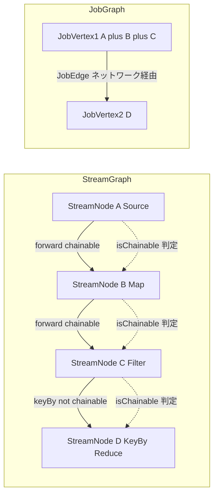

# 第8章 JobGraph への変換とオペレーターチェイン

> **本章で読むソース**
>
> - [`StreamingJobGraphGenerator.java`](https://github.com/apache/flink/blob/release-2.3.0/flink-runtime/src/main/java/org/apache/flink/streaming/api/graph/StreamingJobGraphGenerator.java)
> - [`JobGraph.java`](https://github.com/apache/flink/blob/release-2.3.0/flink-runtime/src/main/java/org/apache/flink/runtime/jobgraph/JobGraph.java)
> - [`JobVertex.java`](https://github.com/apache/flink/blob/release-2.3.0/flink-runtime/src/main/java/org/apache/flink/runtime/jobgraph/JobVertex.java)
> - [`JobEdge.java`](https://github.com/apache/flink/blob/release-2.3.0/flink-runtime/src/main/java/org/apache/flink/runtime/jobgraph/JobEdge.java)
> - [`IntermediateDataSet.java`](https://github.com/apache/flink/blob/release-2.3.0/flink-runtime/src/main/java/org/apache/flink/runtime/jobgraph/IntermediateDataSet.java)

## この章の狙い

第7章では、`DataStream` API の変換操作から `StreamGraph` が組み立てられる過程を見た。

`StreamGraph` はユーザーが書いた変換をそのまま反映したグラフであり、1つの `StreamNode` が1つの演算子に対応する。

本章では、`StreamGraph` を `JobGraph` に変換する `StreamingJobGraphGenerator` を読み、複数の `StreamNode` を1つの実行単位にまとめる**オペレーターチェイン**の判定条件と、その効果を追う。

## 前提

`StreamGraph` から `JobGraph` への変換は `StreamingJobGraphGenerator` が担う。

`JobGraph` は `StreamGraph` と異なり、ユーザーが書いた演算子の粒度をそのまま保持しない。

隣接する演算子どうしが条件を満たせば、実行時に1つの `JobVertex`（JobManager がスケジューリングする実行単位）へまとめられる。

この「まとめる」処理がオペレーターチェインであり、`JobGraph` はチェイン適用後の、実行に最適化されたグラフとして JobManager に投入される。

`JobGraph` は `JobVertex`（頂点）と `JobEdge`（辺）からなるグラフであり、`JobVertex` どうしの接続は `IntermediateDataSet` を介して表現される。

## createJobGraph の全体構造

`StreamingJobGraphGenerator` のエントリポイントは `createJobGraph` であり、チェインの決定を最初に行ってから、残りの設定を順に組み立てる。

[`StreamingJobGraphGenerator.java` L222-L257](https://github.com/apache/flink/blob/release-2.3.0/flink-runtime/src/main/java/org/apache/flink/streaming/api/graph/StreamingJobGraphGenerator.java#L222-L257)

```java
private JobGraph createJobGraph() {
    preValidate(streamGraph, userClassloader);

    setChaining();

    if (jobGraph.isDynamic()) {
        setVertexParallelismsForDynamicGraphIfNecessary();
    }

    // Note that we set all the non-chainable outputs configuration here because the
    // "setVertexParallelismsForDynamicGraphIfNecessary" may affect the parallelism of job
    // vertices and partition-reuse
    final Map<Integer, Map<StreamEdge, NonChainedOutput>> opIntermediateOutputs =
            new HashMap<>();
    setAllOperatorNonChainedOutputsConfigs(opIntermediateOutputs, jobVertexBuildContext);
    setAllVertexNonChainedOutputsConfigs(opIntermediateOutputs);

    setPhysicalEdges(jobVertexBuildContext);

    markSupportingConcurrentExecutionAttempts(jobVertexBuildContext);

    validateHybridShuffleExecuteInBatchMode(jobVertexBuildContext);

    setSlotSharingAndCoLocation(jobVertexBuildContext);

    setManagedMemoryFraction(jobVertexBuildContext);

    addVertexIndexPrefixInVertexName(jobVertexBuildContext, new AtomicInteger(0));

    setVertexDescription(jobVertexBuildContext);

    // Wait for the serialization of operator coordinators and stream config.
    serializeOperatorCoordinatorsAndStreamConfig(serializationExecutor, jobVertexBuildContext);

    return jobGraph;
}
```

`setChaining` がどの `StreamNode` をどの `JobVertex` にまとめるかを最初に決め、それ以降の処理（非チェイン辺の接続、スロット共有グループの割り当て、マネージドメモリの配分など）はこの結果を前提に進む。

チェインの判定が最初に置かれているのは、後続のすべての処理が「1つの `JobVertex` が何を含むか」という単位を必要とするためである。

## isChainable によるチェイン可否の判定

`isChainable` は、`StreamEdge`（`StreamGraph` 上の辺）1本を受け取り、その辺の上流と下流を同じ `JobVertex` にまとめてよいかを判定する。

[`StreamingJobGraphGenerator.java` L1730-L1740](https://github.com/apache/flink/blob/release-2.3.0/flink-runtime/src/main/java/org/apache/flink/streaming/api/graph/StreamingJobGraphGenerator.java#L1730-L1740)

```java
public static boolean isChainable(StreamEdge edge, StreamGraph streamGraph) {
    return isChainable(edge, streamGraph, false);
}

public static boolean isChainable(
        StreamEdge edge, StreamGraph streamGraph, boolean allowChainWithDefaultParallelism) {
    StreamNode downStreamVertex = streamGraph.getTargetVertex(edge);

    return downStreamVertex.getInEdges().size() == 1
            && isChainableInput(edge, streamGraph, allowChainWithDefaultParallelism);
}
```

下流ノードの入力辺が1本だけであることがまず要求される。

複数の上流からデータを受け取るノードをチェインに含めてしまうと、そのノードの実行順序が特定の上流の完了順に縛られてしまい、`JobVertex` 内で単一スレッドに直列化する前提が崩れるためである。

具体的なチェイン条件は `isChainableInput` に集約されている。

[`StreamingJobGraphGenerator.java` L1756-L1783](https://github.com/apache/flink/blob/release-2.3.0/flink-runtime/src/main/java/org/apache/flink/streaming/api/graph/StreamingJobGraphGenerator.java#L1756-L1783)

```java
private static boolean isChainableInput(
        StreamEdge edge, StreamGraph streamGraph, boolean allowChainWithDefaultParallelism) {
    StreamNode upStreamVertex = streamGraph.getSourceVertex(edge);
    StreamNode downStreamVertex = streamGraph.getTargetVertex(edge);

    if (!(streamGraph.isChainingEnabled()
            && upStreamVertex.isSameSlotSharingGroup(downStreamVertex)
            && areOperatorsChainable(
                    upStreamVertex,
                    downStreamVertex,
                    streamGraph,
                    allowChainWithDefaultParallelism)
            && arePartitionerAndExchangeModeChainable(
                    edge.getPartitioner(), edge.getExchangeMode(), streamGraph.isDynamic()))) {

        return false;
    }

    // check that we do not have a union operation, because unions currently only work
    // through the network/byte-channel stack.
    // we check that by testing that each "type" (which means input position) is used only once
    for (StreamEdge inEdge : downStreamVertex.getInEdges()) {
        if (inEdge != edge && inEdge.getTypeNumber() == edge.getTypeNumber()) {
            return false;
        }
    }
    return true;
}
```

チェイン可能と判定されるには、次の条件をすべて満たす必要がある。

- **チェイン全体が有効化されている**：`streamGraph.isChainingEnabled()`（`ExecutionConfig#disableOperatorChaining` で無効化できる）
- **同一スロット共有グループに属する**：`upStreamVertex.isSameSlotSharingGroup(downStreamVertex)`
- **演算子のチェイン戦略が両立する**：`areOperatorsChainable`（並列度の一致もここで検査する）
- **パーティショナと交換モードがチェインを許す**：`arePartitionerAndExchangeModeChainable`
- **union 演算でない**：同じ `typeNumber` の入力辺が2本以上存在しない

`arePartitionerAndExchangeModeChainable` は、パーティショナが `ForwardPartitioner`（レコードを並列度が同じ上流サブタスクへそのまま渡す転送）であり、かつ交換モードがバッチ実行でないことを要求する。
例外として、動的グラフ（`AdaptiveBatchScheduler` を用いる SQL Batch などの経路）では `ForwardForConsecutiveHashPartitioner` もチェイン可能と判定される。
これはチェイン構築後に forward もしくは hash へ変換される特殊なパーティショナであり、`isDynamicGraph` が真のときにだけ現れる。

[`StreamingJobGraphGenerator.java` L1786-L1799](https://github.com/apache/flink/blob/release-2.3.0/flink-runtime/src/main/java/org/apache/flink/streaming/api/graph/StreamingJobGraphGenerator.java#L1786-L1799)

```java
@VisibleForTesting
static boolean arePartitionerAndExchangeModeChainable(
        StreamPartitioner<?> partitioner,
        StreamExchangeMode exchangeMode,
        boolean isDynamicGraph) {
    if (partitioner instanceof ForwardForConsecutiveHashPartitioner) {
        checkState(isDynamicGraph);
        return true;
    } else if ((partitioner instanceof ForwardPartitioner)
            && exchangeMode != StreamExchangeMode.BATCH) {
        return true;
    } else {
        return false;
    }
}
```

`keyBy` や `shuffle` のようにレコードをネットワーク越しに再分配するパーティショナは、その時点で上流と下流が別サブタスクに配置される可能性を含むため、チェインの対象にならない。

チェインできるのは、上流の1サブタスクの出力がそのまま下流の1サブタスクの入力になる `forward` 接続に限られる。

`areOperatorsChainable` は演算子ごとの `ChainingStrategy`（`NEVER` / `HEAD` / `HEAD_WITH_SOURCES` / `ALWAYS`）を上流と下流の両方で確認し、さらに並列度と最大並列度の一致を検査する。

[`StreamingJobGraphGenerator.java` L1801-L1811](https://github.com/apache/flink/blob/release-2.3.0/flink-runtime/src/main/java/org/apache/flink/streaming/api/graph/StreamingJobGraphGenerator.java#L1801-L1811)

```java
@VisibleForTesting
static boolean areOperatorsChainable(
        StreamNode upStreamVertex,
        StreamNode downStreamVertex,
        StreamGraph streamGraph,
        boolean allowChainWithDefaultParallelism) {
    StreamOperatorFactory<?> upStreamOperator = upStreamVertex.getOperatorFactory();
    StreamOperatorFactory<?> downStreamOperator = downStreamVertex.getOperatorFactory();
    if (downStreamOperator == null || upStreamOperator == null) {
        return false;
    }
```

`ChainingStrategy.NEVER` を持つ演算子（`AsyncWaitOperator` など、独立したスレッドやタイマーを必要とする演算子）はチェインの対象にならず、常に単独の `JobVertex` になる。

並列度の一致を要求するのは、上流と下流のサブタスク数が同じでなければ「1上流サブタスク対1下流サブタスク」の `forward` 接続が成立せず、チェインしたサブタスク内で入出力の対応が取れなくなるためである。

## setChaining と createChain によるチェインの構築

`setChaining` は `StreamGraph` の各始点ノードから `createChain` を再帰的に呼び出し、`isChainable` が真を返す辺をたどってチェインを伸ばしていく。

[`StreamingJobGraphGenerator.java` L604-L627](https://github.com/apache/flink/blob/release-2.3.0/flink-runtime/src/main/java/org/apache/flink/streaming/api/graph/StreamingJobGraphGenerator.java#L604-L627)

```java
private void setChaining() {
    // we separate out the sources that run as inputs to another operator (chained inputs)
    // from the sources that needs to run as the main (head) operator.
    final Map<Integer, OperatorChainInfo> chainEntryPoints =
            buildChainedInputsAndGetHeadInputs();
    final Collection<OperatorChainInfo> initialEntryPoints =
            chainEntryPoints.entrySet().stream()
                    .sorted(Comparator.comparing(Map.Entry::getKey))
                    .map(Map.Entry::getValue)
                    .collect(Collectors.toList());

    // iterate over a copy of the values, because this map gets concurrently modified
    for (OperatorChainInfo info : initialEntryPoints) {
        createChain(
                info.getStartNodeId(),
                1, // operators start at position 1 because 0 is for chained source inputs
                info,
                chainEntryPoints,
                true,
                serializationExecutor,
                jobVertexBuildContext,
                null);
    }
}
```

`createChain` は現在のノードの出力辺を `isChainable` の結果で `chainableOutputs` と `nonChainableOutputs` に振り分ける。

[`StreamingJobGraphGenerator.java` L663-L669](https://github.com/apache/flink/blob/release-2.3.0/flink-runtime/src/main/java/org/apache/flink/streaming/api/graph/StreamingJobGraphGenerator.java#L663-L669)

```java
for (StreamEdge outEdge : currentNode.getOutEdges()) {
    if (isChainable(outEdge, streamGraph)) {
        chainableOutputs.add(outEdge);
    } else {
        nonChainableOutputs.add(outEdge);
    }
}
```

チェイン可能な辺の先には、同じ `chainInfo`（チェインの識別情報）と、1つ進んだ `chainIndex` を渡して `createChain` を再帰呼び出しし、同じチェインの続きとして扱う。

チェイン不可能な辺の先には、新しい `chainInfo`（`chainInfo.newChain`）を渡して `createChain` を呼び出し、別のチェインの始点として扱う。

[`StreamingJobGraphGenerator.java` L696-L716](https://github.com/apache/flink/blob/release-2.3.0/flink-runtime/src/main/java/org/apache/flink/streaming/api/graph/StreamingJobGraphGenerator.java#L696-L716)

```java
for (StreamEdge nonChainable : nonChainableOutputs) {
    transitiveOutEdges.add(nonChainable);
    // Used to control whether a new chain can be created, this value is true in the
    // full graph generation algorithm and false in the progressive generation
    // algorithm. In the future, this variable can be a boolean type function to adapt
    // to more adaptive scenarios.
    if (canCreateNewChain) {
        createChain(
                nonChainable.getTargetId(),
                1, // operators start at position 1 because 0 is for chained source
                // inputs
                chainEntryPoints.computeIfAbsent(
                        nonChainable.getTargetId(),
                        (k) -> chainInfo.newChain(nonChainable.getTargetId())),
                chainEntryPoints,
                canCreateNewChain,
                serializationExecutor,
                jobVertexBuildContext,
                visitedStreamNodeConsumer);
    }
}
```

チェインの先頭ノード（`currentNodeId.equals(startNodeId)`）でのみ `createJobVertex` を呼んで新しい `JobVertex` を作り、それ以外のノードはその `JobVertex` の設定に演算子情報を追記するだけにとどまる。

[`StreamingJobGraphGenerator.java` L757-L768](https://github.com/apache/flink/blob/release-2.3.0/flink-runtime/src/main/java/org/apache/flink/streaming/api/graph/StreamingJobGraphGenerator.java#L757-L768)

```java
StreamConfig config;
if (currentNodeId.equals(startNodeId)) {
    JobVertex jobVertex = jobVertexBuildContext.getJobVertex(startNodeId);
    if (jobVertex == null) {
        jobVertex =
                createJobVertex(
                        chainInfo, serializationExecutor, jobVertexBuildContext);
    }
    config = new StreamConfig(jobVertex.getConfiguration());
} else {
    config = new StreamConfig(new Configuration());
}
```

チェインに含まれる演算子ごとの設定（`StreamConfig`）は、先頭ノードの `JobVertex` に紐づく `TransitiveChainedTaskConfigs` としてまとめて保持される。

[`StreamingJobGraphGenerator.java` L780-L796](https://github.com/apache/flink/blob/release-2.3.0/flink-runtime/src/main/java/org/apache/flink/streaming/api/graph/StreamingJobGraphGenerator.java#L780-L796)

```java
if (currentNodeId.equals(startNodeId)) {
    chainInfo.setTransitiveOutEdges(transitiveOutEdges);
    jobVertexBuildContext.addChainInfo(startNodeId, chainInfo);

    config.setChainStart();
    config.setChainIndex(chainIndex);
    config.setOperatorName(streamGraph.getStreamNode(currentNodeId).getOperatorName());
    config.setTransitiveChainedTaskConfigs(
            jobVertexBuildContext.getChainedConfigs().get(startNodeId));
} else {
    config.setChainIndex(chainIndex);
    StreamNode node = streamGraph.getStreamNode(currentNodeId);
    config.setOperatorName(node.getOperatorName());
    jobVertexBuildContext
            .getOrCreateChainedConfig(startNodeId)
            .put(currentNodeId, config);
}
```

こうして、1つのチェインに属する複数の `StreamNode` は、実行時には1つの `JobVertex` の1つの `StreamConfig` セットとして扱われ、`StreamTask`（第13章）がこの設定を読んでチェインされた演算子群を1つのサブタスク内で順に呼び出す。



## 非チェイン辺の接続：JobEdge と IntermediateDataSet

チェイン不可能と判定された辺は `JobVertex` をまたぐネットワーク経由の接続として扱われ、`connect` メソッドが `JobEdge` を生成する。

[`StreamingJobGraphGenerator.java` L1585-L1620](https://github.com/apache/flink/blob/release-2.3.0/flink-runtime/src/main/java/org/apache/flink/streaming/api/graph/StreamingJobGraphGenerator.java#L1585-L1620)

```java
public static IntermediateDataSet connect(
        Integer headOfChain,
        StreamEdge edge,
        NonChainedOutput output,
        Map<Integer, JobVertex> jobVertices,
        JobVertexBuildContext jobVertexBuildContext) {

    jobVertexBuildContext.addPhysicalEdgesInOrder(edge);

    Integer downStreamVertexID = edge.getTargetId();

    JobVertex headVertex = jobVertices.get(headOfChain);
    JobVertex downStreamVertex = jobVertices.get(downStreamVertexID);

    StreamConfig downStreamConfig = new StreamConfig(downStreamVertex.getConfiguration());

    downStreamConfig.setNumberOfNetworkInputs(downStreamConfig.getNumberOfNetworkInputs() + 1);

    StreamPartitioner<?> partitioner = output.getPartitioner();
    ResultPartitionType resultPartitionType = output.getPartitionType();

    checkBufferTimeout(resultPartitionType, edge);

    JobEdge jobEdge;
    if (partitioner.isPointwise()) {
        jobEdge =
                downStreamVertex.connectNewDataSetAsInput(
                        headVertex,
                        DistributionPattern.POINTWISE,
                        resultPartitionType,
                        output.getDataSetId(),
                        partitioner.isBroadcast(),
                        partitioner.getClass().equals(ForwardPartitioner.class),
                        edge.getTypeNumber(),
                        edge.areInterInputsKeysCorrelated(),
                        edge.isIntraInputKeyCorrelated());
    } else {
```

実際に `JobEdge` を組み立てるのは `JobVertex#connectNewDataSetAsInput` である。

上流の `JobVertex` に `IntermediateDataSet`（実行時に生成される中間結果の受け渡し口）を作らせ、その `IntermediateDataSet` と下流の `JobVertex` を結ぶ `JobEdge` を生成して、双方に登録する。

[`JobVertex.java` L539-L566](https://github.com/apache/flink/blob/release-2.3.0/flink-runtime/src/main/java/org/apache/flink/runtime/jobgraph/JobVertex.java#L539-L566)

```java
public JobEdge connectNewDataSetAsInput(
        JobVertex input,
        DistributionPattern distPattern,
        ResultPartitionType partitionType,
        IntermediateDataSetID intermediateDataSetId,
        boolean isBroadcast,
        boolean isForward,
        int typeNumber,
        boolean interInputsKeysCorrelated,
        boolean intraInputKeyCorrelated) {

    IntermediateDataSet dataSet =
            input.getOrCreateResultDataSet(intermediateDataSetId, partitionType);

    JobEdge edge =
            new JobEdge(
                    dataSet,
                    this,
                    distPattern,
                    isBroadcast,
                    isForward,
                    typeNumber,
                    interInputsKeysCorrelated,
                    intraInputKeyCorrelated);
    this.inputs.add(edge);
    dataSet.addConsumer(edge);
    return edge;
}
```

`IntermediateDataSet` は「上流の `JobVertex` が生成する中間結果」を表し、複数の `JobEdge`（consumer）から参照されうる。

`DistributionPattern` は `POINTWISE`（各上流サブタスクが特定の下流サブタスクにのみ送る）か `ALL_TO_ALL`（全上流サブタスクが全下流サブタスクに送りうる）のいずれかであり、`keyBy` のような再分配は `ALL_TO_ALL` になる。

`JobGraph` はこうして得られた `JobVertex` の集合と `JobEdge` による接続をまとめたグラフであり、`addVertex` で頂点を登録し、`getVerticesSortedTopologicallyFromSources` でトポロジカル順に並べ替えられる。

## オペレーターチェインによる最適化

オペレーターチェインの効果は、チェイン内のレコードの受け渡し方法に現れる。

チェインされていない `JobVertex` どうしの通信は、ネットワークスタック（第16章、第17章）を介した `ResultPartition` と `InputGate` の往復であり、レコードをバッファへシリアライズし、ネットワーク越しに転送してデシリアライズする必要がある。

一方、同じ `JobVertex` にチェインされた演算子は、1つのサブタスクの1スレッド内で `StreamTask` から順に関数呼び出しされる。

チェイン内のレコード授受は Java のメソッド呼び出しに帰着し、シリアライズとデシリアライズもネットワークバッファへのコピーも発生しない。

`isChainable` が `forward` パーティショナのみをチェイン対象とするのは、この関数呼び出しへの置き換えが成立する条件が「上流の1サブタスクの出力が、必ず下流の同じサブタスク内の1入力になる」場合に限られるためである。

`keyBy` のようにレコードを別サブタスクへ再分配する接続は、原理的にスレッドをまたぐ転送が必要になり、関数呼び出しに置き換えられない。

演算子ごとに `JobVertex` を分けるナイーブな実装と比べ、オペレーターチェインはスレッド跨ぎの通信をスレッド内の関数呼び出しに変え、シリアライズとネットワークバッファの往復そのものを取り除く。

## まとめ

`StreamingJobGraphGenerator#createJobGraph` は、`setChaining` によるチェインの決定を起点に `StreamGraph` を `JobGraph` へ変換する。

`isChainable` は、下流の入力辺が1本であること、同一スロット共有グループであること、演算子のチェイン戦略と並列度が両立すること、パーティショナが `forward` であることを検査し、これらすべてを満たす隣接ノードだけをチェイン対象とする。

`createChain` はチェイン可能な辺をたどって同じ `JobVertex` に演算子をまとめ、チェイン不可能な辺は `connect` と `JobVertex#connectNewDataSetAsInput` によって `JobEdge` と `IntermediateDataSet` で結ばれるネットワーク接続になる。

オペレーターチェインは、`forward` 接続に限ってスレッド跨ぎの通信をスレッド内の関数呼び出しに変換し、レコードごとのシリアライズとネットワークバッファ往復を除く最適化である。

## 関連する章

- [第7章 StreamGraph の生成](07-streamgraph.md)
- [第9章 ExecutionGraph の構築](09-executiongraph.md)
- [第13章 StreamTask と mailbox 実行モデル](../part04-task-execution/13-streamtask-mailbox.md)
