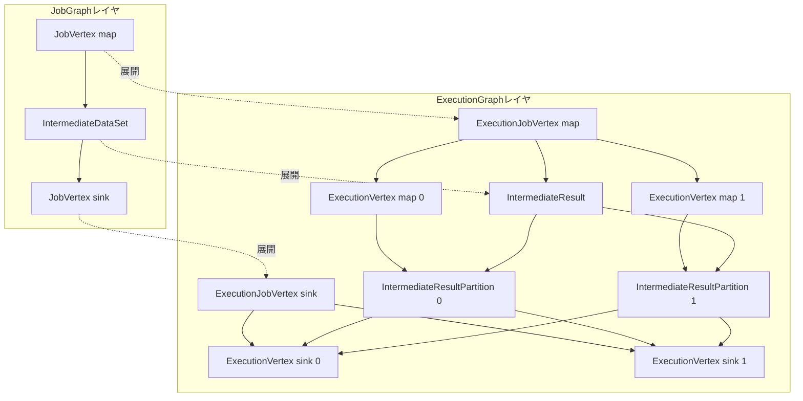

# 第9章 ExecutionGraph の構築

> **本章で読むソース**
>
> - [`ExecutionGraph.java`](https://github.com/apache/flink/blob/release-2.3.0/flink-runtime/src/main/java/org/apache/flink/runtime/executiongraph/ExecutionGraph.java)
> - [`DefaultExecutionGraphBuilder.java`](https://github.com/apache/flink/blob/release-2.3.0/flink-runtime/src/main/java/org/apache/flink/runtime/executiongraph/DefaultExecutionGraphBuilder.java)
> - [`DefaultExecutionGraph.java`](https://github.com/apache/flink/blob/release-2.3.0/flink-runtime/src/main/java/org/apache/flink/runtime/executiongraph/DefaultExecutionGraph.java)
> - [`ExecutionJobVertex.java`](https://github.com/apache/flink/blob/release-2.3.0/flink-runtime/src/main/java/org/apache/flink/runtime/executiongraph/ExecutionJobVertex.java)
> - [`ExecutionVertex.java`](https://github.com/apache/flink/blob/release-2.3.0/flink-runtime/src/main/java/org/apache/flink/runtime/executiongraph/ExecutionVertex.java)
> - [`Execution.java`](https://github.com/apache/flink/blob/release-2.3.0/flink-runtime/src/main/java/org/apache/flink/runtime/executiongraph/Execution.java)
> - [`IntermediateResult.java`](https://github.com/apache/flink/blob/release-2.3.0/flink-runtime/src/main/java/org/apache/flink/runtime/executiongraph/IntermediateResult.java)
> - [`IntermediateResultPartition.java`](https://github.com/apache/flink/blob/release-2.3.0/flink-runtime/src/main/java/org/apache/flink/runtime/executiongraph/IntermediateResultPartition.java)

## この章の狙い

第8章までで、ユーザーのプログラムが StreamGraph を経て JobGraph へたたみ込まれ、オペレーターチェインによって連結された論理的な実行計画になるところまでを見た。

JobGraph は「どの演算子がどの演算子へデータを渡すか」を並列度とは切り離して記述した設計図であり、実際に何個のタスクが動くかはまだ展開されていない。

本章では、この JobGraph を JobMaster が受け取り、並列度ぶんのサブタスクへ展開して実行時のグラフである ExecutionGraph を組み立てる過程をたどる。

具体的には、組み立ての入口である `DefaultExecutionGraphBuilder` から始め、`ExecutionJobVertex`、`ExecutionVertex`、`Execution` という3層の実行時表現と、頂点間のデータ交換を表す `IntermediateResult` がどう生成され、どう相互参照するかを読む。

## 前提

JobGraph は `JobVertex` を頂点、`IntermediateDataSet` を頂点間の結果として持つ論理グラフである（第8章）。

各 `JobVertex` は並列度（parallelism）を属性として持つが、その並列度ぶんの実体はまだ存在しない。

ExecutionGraph は JobMaster が生成し、その内部でスケジューリングとデプロイの対象になる。

スケジューリングそのもの、つまりいつどのサブタスクをどのスロットへ配置するかは第10章と第11章で扱う。

本章はその手前、スケジューリングの対象となるグラフがどのような構造で用意されるかに絞る。

## 実行時グラフを構成する3つの表現

`ExecutionGraph` インターフェースの Javadoc は、このグラフを構成する3つの表現を明示している。

[`ExecutionGraph.java` L58-L79](https://github.com/apache/flink/blob/release-2.3.0/flink-runtime/src/main/java/org/apache/flink/runtime/executiongraph/ExecutionGraph.java#L58-L79)

```java
/**
 * The execution graph is the central data structure that coordinates the distributed execution of a
 * data flow. It keeps representations of each parallel task, each intermediate stream, and the
 * communication between them.
 *
 * <p>The execution graph consists of the following constructs:
 *
 * <ul>
 *   <li>The {@link ExecutionJobVertex} represents one vertex from the JobGraph (usually one
 *       operation like "map" or "join") during execution. It holds the aggregated state of all
 *       parallel subtasks. The ExecutionJobVertex is identified inside the graph by the {@link
 *       JobVertexID}, which it takes from the JobGraph's corresponding JobVertex.
 *   <li>The {@link ExecutionVertex} represents one parallel subtask. For each ExecutionJobVertex,
 *       there are as many ExecutionVertices as the parallelism. The ExecutionVertex is identified
 *       by the ExecutionJobVertex and the index of the parallel subtask
 *   <li>The {@link Execution} is one attempt to execute a ExecutionVertex. There may be multiple
 *       Executions for the ExecutionVertex, in case of a failure, or in the case where some data
 *       needs to be recomputed because it is no longer available when requested by later
 *       operations. An Execution is always identified by an {@link ExecutionAttemptID}. All
 *       messages between the JobManager and the TaskManager about deployment of tasks and updates
 *       in the task status always use the ExecutionAttemptID to address the message receiver.
 * </ul>
 */
```

3層はそれぞれ粒度が異なる。

`ExecutionJobVertex` は JobGraph の1つの `JobVertex` に1対1で対応し、その並列サブタスク全体の集約状態を保持する。

`ExecutionVertex` は1つの並列サブタスクであり、`ExecutionJobVertex` あたり並列度と同じ個数だけ存在する。

`Execution` は `ExecutionVertex` の1回の実行試行であり、フェイルオーバーや再計算のたびに新しい `Execution` が作られる。

JobManager と TaskManager のあいだでやりとりされるデプロイや状態更新のメッセージは、常にこの `Execution` を指す `ExecutionAttemptID` を宛先に使う。

つまり、論理グラフの1頂点は「頂点の集約」「1サブタスク」「1試行」という3段階へ展開され、通信の単位は最も細かい試行の粒度に置かれている。

## 組み立ての入口 DefaultExecutionGraphBuilder

ExecutionGraph の組み立ては `DefaultExecutionGraphBuilder.buildGraph` に集約されている。

このメソッドは JobGraph を受け取り、まず空の `DefaultExecutionGraph` インスタンスを生成し、続いて JobGraph の頂点をそこへ接続する。

接続の中心は、頂点をトポロジカル順に並べてから `attachJobGraph` へ渡す部分である。

[`DefaultExecutionGraphBuilder.java` L187-L199](https://github.com/apache/flink/blob/release-2.3.0/flink-runtime/src/main/java/org/apache/flink/runtime/executiongraph/DefaultExecutionGraphBuilder.java#L187-L199)

```java
        initJobVerticesOnMaster(
                jobGraph.getVertices(), classLoader, log, vertexParallelismStore, jobName, jobId);

        // topologically sort the job vertices and attach the graph to the existing one
        List<JobVertex> sortedTopology = jobGraph.getVerticesSortedTopologicallyFromSources();
        if (log.isDebugEnabled()) {
            log.debug(
                    "Adding {} vertices from job graph {} ({}).",
                    sortedTopology.size(),
                    jobName,
                    jobId);
        }
        executionGraph.attachJobGraph(sortedTopology, jobManagerJobMetricGroup);
```

`getVerticesSortedTopologicallyFromSources` は、ソースから順に頂点を並べたリストを返す。

トポロジカル順で処理するのは、ある頂点を接続する時点でその上流の頂点がすでにグラフへ登録済みであることを保証するためである。

下流の頂点が入力として参照する `IntermediateResult` は上流頂点が生成するので、上流を先に作っておかないと参照先が定まらない。

## JobVertex から ExecutionJobVertex への展開

`attachJobGraph` の実装は `DefaultExecutionGraph` にあり、頂点の登録と初期化を2段階で行う。

登録の段階では、トポロジカル順に並んだ `JobVertex` を1つずつ取り出し、それぞれに対応する `ExecutionJobVertex` を生成してグラフの `tasks` マップへ収める。

[`DefaultExecutionGraph.java` L925-L957](https://github.com/apache/flink/blob/release-2.3.0/flink-runtime/src/main/java/org/apache/flink/runtime/executiongraph/DefaultExecutionGraph.java#L925-L957)

```java
    private void attachJobVertices(
            List<JobVertex> topologicallySorted, JobManagerJobMetricGroup jobManagerJobMetricGroup)
            throws JobException {
        for (JobVertex jobVertex : topologicallySorted) {

            if (jobVertex.isInputVertex() && !jobVertex.isStoppable()) {
                this.isStoppable = false;
            }

            VertexParallelismInformation parallelismInfo =
                    parallelismStore.getParallelismInfo(jobVertex.getID());

            // create the execution job vertex and attach it to the graph
            ExecutionJobVertex ejv =
                    executionJobVertexFactory.createExecutionJobVertex(
                            this,
                            jobVertex,
                            parallelismInfo,
                            coordinatorStore,
                            jobManagerJobMetricGroup);

            ExecutionJobVertex previousTask = this.tasks.putIfAbsent(jobVertex.getID(), ejv);
            if (previousTask != null) {
                throw new JobException(
                        String.format(
                                "Encountered two job vertices with ID %s : previous=[%s] / new=[%s]",
                                jobVertex.getID(), ejv, previousTask));
            }

            this.verticesInCreationOrder.add(ejv);
            this.numJobVerticesTotal++;
        }
    }
```

`JobVertex` の並列度は `parallelismStore` から `VertexParallelismInformation` として引き出される。

ここで並列度が JobGraph の頂点属性ではなく別のストアから供給されている点は、後述する論理グラフと実行グラフの分離を実装面で支えている。

生成された `ExecutionJobVertex` は `JobVertexID` をキーに `tasks` へ登録され、同じ ID が二重に現れれば例外になる。

この段階では並列サブタスクの実体はまだ作られておらず、頂点の骨組みだけがグラフに接続される。

## ExecutionJobVertex による並列サブタスクの生成

サブタスクの実体は `ExecutionJobVertex.initialize` で作られる。

このメソッドは、まず並列度ぶんの `ExecutionVertex` を格納する配列と、この頂点が生成する中間結果を表す `IntermediateResult` の配列を用意する。

[`ExecutionJobVertex.java` L216-L248](https://github.com/apache/flink/blob/release-2.3.0/flink-runtime/src/main/java/org/apache/flink/runtime/executiongraph/ExecutionJobVertex.java#L216-L248)

```java
        this.taskVertices = new ExecutionVertex[parallelismInfo.getParallelism()];

        this.inputs = new ArrayList<>(jobVertex.getInputs().size());

        // create the intermediate results
        this.producedDataSets =
                new IntermediateResult[jobVertex.getNumberOfProducedIntermediateDataSets()];

        for (int i = 0; i < jobVertex.getProducedDataSets().size(); i++) {
            final IntermediateDataSet result = jobVertex.getProducedDataSets().get(i);

            this.producedDataSets[i] =
                    new IntermediateResult(
                            result,
                            this,
                            this.parallelismInfo.getParallelism(),
                            result.getResultType(),
                            executionPlanSchedulingContext);
        }

        // create all task vertices
        for (int i = 0; i < this.parallelismInfo.getParallelism(); i++) {
            ExecutionVertex vertex =
                    createExecutionVertex(
                            this,
                            i,
                            producedDataSets,
                            timeout,
                            createTimestamp,
                            executionHistorySizeLimit,
                            initialAttemptCounts.getAttemptCount(i));

            this.taskVertices[i] = vertex;
        }
```

`taskVertices` は並列度と同じ長さの配列であり、添字 `i` がそのままサブタスクのインデックスになる。

JobGraph の `IntermediateDataSet` は、ここで `IntermediateResult` へ1対1で変換される。

`IntermediateResult` は生成元の `ExecutionJobVertex` を `producer` として保持し、並列度と同じ個数のパーティションを収める配列をあらかじめ確保する。

[`IntermediateResult.java` L84-L91](https://github.com/apache/flink/blob/release-2.3.0/flink-runtime/src/main/java/org/apache/flink/runtime/executiongraph/IntermediateResult.java#L84-L91)

```java
        this.producer = checkNotNull(producer);

        checkArgument(numParallelProducers >= 1);
        this.numParallelProducers = numParallelProducers;

        this.partitions = new IntermediateResultPartition[numParallelProducers];

        // we do not set the intermediate result partitions here, because we let them be initialized
        // by
        // the execution vertex that produces them
```

配列は確保するがパーティションの中身はここでは埋めない。

各パーティションは、それを生成するサブタスク側、つまり `ExecutionVertex` の生成時に作られて `setPartition` で登録される。

このため `IntermediateResult` と `ExecutionVertex` は互いを指し合う二重参照になり、`initialize` の末尾では割り当て済みパーティション数が並列度と一致するかを検査している。

## ExecutionVertex と Execution

`ExecutionVertex` のコンストラクタは、自分が担当するサブタスクインデックスに対応する `IntermediateResultPartition` を、上流から渡された各 `IntermediateResult` について1つずつ作る。

作ったパーティションは自身の `resultPartitions` マップへ保持しつつ、生成元の `IntermediateResult` へ `setPartition` で登録する。

その後、最初の実行試行として `Execution` を1つ生成し、`currentExecution` に据える。

[`ExecutionVertex.java` L128-L152](https://github.com/apache/flink/blob/release-2.3.0/flink-runtime/src/main/java/org/apache/flink/runtime/executiongraph/ExecutionVertex.java#L128-L152)

```java
        this.resultPartitions = new LinkedHashMap<>(producedDataSets.length, 1);

        for (IntermediateResult result : producedDataSets) {
            IntermediateResultPartition irp =
                    new IntermediateResultPartition(
                            result,
                            this,
                            subTaskIndex,
                            getExecutionGraphAccessor().getEdgeManager());
            result.setPartition(subTaskIndex, irp);

            resultPartitions.put(irp.getPartitionId(), irp);
        }

        this.executionHistory = new ExecutionHistory(executionHistorySizeLimit);

        this.nextAttemptNumber = initialAttemptCount;

        this.inputBytes = NUM_BYTES_UNKNOWN;

        this.timeout = timeout;
        this.inputSplits = new ArrayList<>();

        this.currentExecution = createNewExecution(createTimestamp);

        getExecutionGraphAccessor().registerExecution(currentExecution);
```

`IntermediateResultPartition` は生成元の `ExecutionVertex` を `producer` として、所属する `IntermediateResult` を `totalResult` として保持する。

これによって、ある中間結果の第 `i` 番目のパーティションは第 `i` 番目のサブタスクが生成する、という対応が構造として固定される。

`currentExecution` に置かれる `Execution` は、`ExecutionVertex` の1回の実行試行を表す。

[`Execution.java` L100-L104](https://github.com/apache/flink/blob/release-2.3.0/flink-runtime/src/main/java/org/apache/flink/runtime/executiongraph/Execution.java#L100-L104)

```java
/**
 * A single execution of a vertex. While an {@link ExecutionVertex} can be executed multiple times
 * (for recovery, re-computation, re-configuration), this class tracks the state of a single
 * execution of that vertex and the resources.
 */
```

`Execution` は `attemptNumber` を採番して `ExecutionAttemptID` を作り、その試行に割り当てられたスロットや状態を管理する。

`ExecutionVertex` が実行試行のたびに生成されるのではなく、`Execution` だけが作り直される。

`ExecutionVertex` は「このサブタスクは何番目か」という位置づけと接続関係を保持し続け、`Execution` は「今その位置で何回目の試行が動いているか」を担う。

この分担は、次に見るフェイルオーバー時の再生成にそのまま現れる。

## 論理グラフと実行グラフを分けることの効き目

本章で読んだ構造の設計上の要点は、並列度と再実行にかかわる状態がすべて ExecutionGraph 側に閉じていることである。

JobGraph は並列度を頂点の属性として持つだけで、サブタスクの実体も実行試行の状態も持たない。

これに対し ExecutionGraph は、並列度ぶんの `ExecutionVertex` 配列、中間結果のパーティション、実行試行の `Execution` を保持する。

この分離が効くのは、フェイルオーバーでサブタスクをやり直すときである。

`ExecutionVertex.resetForNewExecution` は、失敗したサブタスクの中間結果パーティションをリセットし、新しい `Execution` を作って `currentExecution` を差し替える。

[`ExecutionVertex.java` L400-L409](https://github.com/apache/flink/blob/release-2.3.0/flink-runtime/src/main/java/org/apache/flink/runtime/executiongraph/ExecutionVertex.java#L400-L409)

```java
        // reset the intermediate results
        for (IntermediateResultPartition resultPartition : resultPartitions.values()) {
            resultPartition.resetForNewExecution();
        }

        final Execution newExecution = createNewExecution(timestamp);
        currentExecution = newExecution;

        // register this execution to the execution graph, to receive call backs
        getExecutionGraphAccessor().registerExecution(newExecution);
```

やり直しの単位は `Execution` の差し替えに閉じており、`ExecutionVertex` そのものやグラフの接続関係、JobGraph は作り直さない。

失敗したサブタスクとその下流だけを対象にした部分再起動（リージョン単位のフェイルオーバー）を、実行グラフ側の局所的な状態リセットとして表現できるのは、位置づけを持つ `ExecutionVertex` と試行を持つ `Execution` が分かれているからである。

並列度の変更も同じ構造の上にある。

並列度は `parallelismStore` から供給され、`ExecutionJobVertex` が `taskVertices` 配列の長さとして展開する。

論理的なデータフローの定義である JobGraph に手を入れずに、展開する側の ExecutionGraph だけで並列度を決められるため、同じジョブ定義を異なる並列度で実行できる。

## 全体像

ここまでの展開を図にすると、JobGraph の1頂点が実行時にどう広がるかが見える。



`JobVertex` は `ExecutionJobVertex` へ、`IntermediateDataSet` は `IntermediateResult` へ1対1で対応する。

その一段下で、`ExecutionJobVertex` は並列度ぶんの `ExecutionVertex` へ、`IntermediateResult` は同数の `IntermediateResultPartition` へと展開される。

各 `ExecutionVertex` は独立してスケジューリングとデプロイの対象になり、上流のパーティションと下流のサブタスクの接続を通じてデータ交換の経路が定まる。

## まとめ

ExecutionGraph は、論理グラフである JobGraph を並列度ぶんに展開した実行時のグラフである。

組み立ては `DefaultExecutionGraphBuilder.buildGraph` から始まり、頂点をトポロジカル順に `attachJobGraph` へ渡すことで、上流を先に登録してから下流を接続する。

グラフは `ExecutionJobVertex`、`ExecutionVertex`、`Execution` の3層からなり、頂点の集約状態、1サブタスク、1実行試行という異なる粒度を分担する。

頂点間のデータ交換は `IntermediateResult` とその `IntermediateResultPartition` が表し、パーティションは生成元のサブタスクと1対1で結び付く。

並列度と実行試行の状態を ExecutionGraph 側に閉じ込めたことで、フェイルオーバーは `Execution` の差し替えとして、並列度変更は展開時の配列長として、いずれも JobGraph に触れずに実行グラフの側だけで扱える。

このグラフを実際にどうスケジューリングし、どのスロットへ配置するかは次章以降で扱う。

## 関連する章

- [第8章 JobGraph とオペレーターチェイン](../part02-graph/08-jobgraph-chaining.md)
- [第10章 JobMaster とスケジューリング](../part03-scheduling/10-jobmaster-scheduler.md)
- [第16章 ResultPartition と InputGate](../part05-network/16-resultpartition-inputgate.md)
