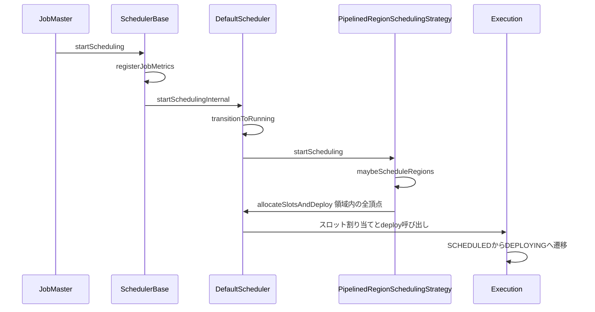
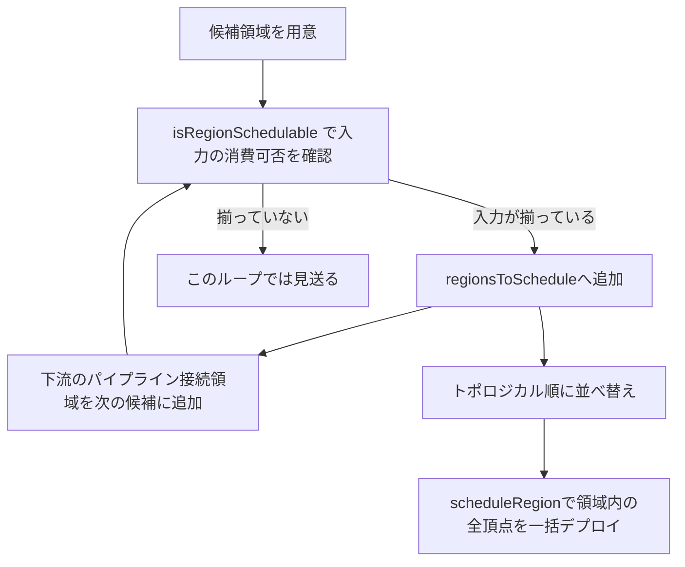

# 第10章 JobMaster とスケジューラ

> **本章で読むソース**
>
> - [`JobMaster.java`](https://github.com/apache/flink/blob/release-2.3.0/flink-runtime/src/main/java/org/apache/flink/runtime/jobmaster/JobMaster.java)
> - [`SchedulerBase.java`](https://github.com/apache/flink/blob/release-2.3.0/flink-runtime/src/main/java/org/apache/flink/runtime/scheduler/SchedulerBase.java)
> - [`DefaultScheduler.java`](https://github.com/apache/flink/blob/release-2.3.0/flink-runtime/src/main/java/org/apache/flink/runtime/scheduler/DefaultScheduler.java)
> - [`SchedulerOperations.java`](https://github.com/apache/flink/blob/release-2.3.0/flink-runtime/src/main/java/org/apache/flink/runtime/scheduler/SchedulerOperations.java)
> - [`PipelinedRegionSchedulingStrategy.java`](https://github.com/apache/flink/blob/release-2.3.0/flink-runtime/src/main/java/org/apache/flink/runtime/scheduler/strategy/PipelinedRegionSchedulingStrategy.java)
> - [`Execution.java`](https://github.com/apache/flink/blob/release-2.3.0/flink-runtime/src/main/java/org/apache/flink/runtime/executiongraph/Execution.java)
> - [`ExecutionState.java`](https://github.com/apache/flink/blob/release-2.3.0/flink-runtime/src/main/java/org/apache/flink/runtime/execution/ExecutionState.java)

## この章の狙い

第9章で見た ExecutionGraph は、JobGraph を並列度ぶんに展開した実行時のグラフだった。

グラフができただけでは何も動かない。

グラフの各 `ExecutionVertex` を実際にどの順序でスロットへ乗せていくかを決め、TaskExecutor への配置を指示する主体が要る。

本章では、その主体である JobMaster がジョブの実行を起動する流れと、実際の配置判断を担う `DefaultScheduler`、そして配置の単位を決める `PipelinedRegionSchedulingStrategy` を読む。

具体的には、`JobMaster.startJobExecution` から `SchedulerBase.startScheduling` を経て `PipelinedRegionSchedulingStrategy` がどの `ExecutionVertex` 群をまとめてデプロイ可能と判断するか、そして失敗が起きたときにどの範囲を再スケジュールするかを追う。

## 前提

ExecutionGraph は `ExecutionJobVertex`、`ExecutionVertex`、`Execution` の3層からなり、`Execution` が1回の実行試行を表す（第9章）。

`Execution` は状態機械であり、`ExecutionState` として **CREATED**、**SCHEDULED**、**DEPLOYING**、**RUNNING**、**FINISHED** などの値を遷移する。

スケジューリングとは、この状態機械を CREATED から先へ進めるためにスロットを割り当て、TaskExecutor へデプロイを指示する処理である。

JobMaster 自身はスケジューリングのアルゴリズムを持たない。

`SchedulerNG` インターフェースを実装した `DefaultScheduler` へ処理を委譲し、JobMaster はジョブのライフサイクル管理と、TaskExecutor や ResourceManager との通信に専念する。

## JobMaster がスケジューリングを起動するまで

JobMaster は `SchedulerNG` 型のフィールド `schedulerNG` を保持する。

[`JobMaster.java` L203-L205](https://github.com/apache/flink/blob/release-2.3.0/flink-runtime/src/main/java/org/apache/flink/runtime/jobmaster/JobMaster.java#L203-L205)

```java
    // --------- Scheduler --------

    private final SchedulerNG schedulerNG;
```

JobMaster が起動され、RPC エンドポイントとして稼働を始めると `startJobExecution` が呼ばれる。

このメソッドはシャッフルサービスへのジョブ登録、スロットプールなど JobMaster 自身のサービス起動を済ませたあとで、最後にスケジューリングを開始する。

[`JobMaster.java` L1172-L1187](https://github.com/apache/flink/blob/release-2.3.0/flink-runtime/src/main/java/org/apache/flink/runtime/jobmaster/JobMaster.java#L1172-L1187)

```java
    private void startJobExecution() throws Exception {
        validateRunsInMainThread();

        JobShuffleContext context = new JobShuffleContextImpl(executionPlan.getJobID(), this);
        shuffleMaster.registerJob(context);

        startJobMasterServices();

        log.info(
                "Starting execution of job '{}' ({}) under job master id {}.",
                executionPlan.getName(),
                executionPlan.getJobID(),
                getFencingToken());

        startScheduling();
    }
```

`startScheduling` は JobMaster 内部のプライベートメソッドであり、実体は `schedulerNG.startScheduling()` を呼ぶだけの薄い委譲である。

[`JobMaster.java` L1272-L1274](https://github.com/apache/flink/blob/release-2.3.0/flink-runtime/src/main/java/org/apache/flink/runtime/jobmaster/JobMaster.java#L1272-L1274)

```java
    private void startScheduling() {
        schedulerNG.startScheduling();
    }
```

JobMaster が担うのはここまでで、スロットの割り当て順序やデプロイの単位といった判断はすべて `schedulerNG` の実装、つまり `DefaultScheduler` の側にある。

## SchedulerBase と DefaultScheduler の分担

`schedulerNG.startScheduling()` の実体は `SchedulerBase.startScheduling` である。

`SchedulerBase` は `DefaultScheduler` の親クラスであり、スケジューラの実装が共通して必要とするジョブメトリクスの登録や `OperatorCoordinator` の起動をここでまとめて行う。

[`SchedulerBase.java` L669-L682](https://github.com/apache/flink/blob/release-2.3.0/flink-runtime/src/main/java/org/apache/flink/runtime/scheduler/SchedulerBase.java#L669-L682)

```java
    @Override
    public final void startScheduling() {
        mainThreadExecutor.assertRunningInMainThread();
        registerJobMetrics(
                jobManagerJobMetricGroup,
                executionGraph,
                this::getNumberOfRestarts,
                this::getNumberOfRescales,
                executionStateMetricsRegistrars,
                executionGraph::registerJobStatusListener,
                executionGraph.getStatusTimestamp(JobStatus.INITIALIZING),
                jobStatusMetricsSettings);
        operatorCoordinatorHandler.startAllOperatorCoordinators();
        startSchedulingInternal();
    }
```

`startScheduling` は `final` であり、サブクラスによる上書きを許さない。

具体的なスケジューリング方式は、末尾で呼ばれる抽象メソッド `startSchedulingInternal` に切り出されている。

[`SchedulerBase.java` L708](https://github.com/apache/flink/blob/release-2.3.0/flink-runtime/src/main/java/org/apache/flink/runtime/scheduler/SchedulerBase.java#L708)

```java
    protected abstract void startSchedulingInternal();
```

この構造はテンプレートメソッドパターンであり、メトリクス登録やコーディネータ起動という共通処理と、スケジューリング方式そのものという可変処理を分離している。

`DefaultScheduler` はこの抽象メソッドを実装し、ジョブの状態を RUNNING へ遷移させたうえで `schedulingStrategy` へスケジューリングを委ねる。

[`DefaultScheduler.java` L249-L255](https://github.com/apache/flink/blob/release-2.3.0/flink-runtime/src/main/java/org/apache/flink/runtime/scheduler/DefaultScheduler.java#L249-L255)

```java
    @Override
    protected void startSchedulingInternal() {
        log.info(
                "Starting scheduling with scheduling strategy [{}]",
                schedulingStrategy.getClass().getName());
        transitionToRunning();
        schedulingStrategy.startScheduling();
    }
```

`schedulingStrategy` の型は `SchedulingStrategy` インターフェースであり、2.3.0 の既定実装が `PipelinedRegionSchedulingStrategy` である。

つまり「いつ何を RUNNING へ進めるか」というジョブ全体の状態管理は `DefaultScheduler` が握り、「どの `ExecutionVertex` 群をまとめてデプロイ可能と判断するか」という具体的な選択は `SchedulingStrategy` へ委譲される。

## PipelinedRegionSchedulingStrategy による領域単位の判断

`PipelinedRegionSchedulingStrategy` は、ExecutionGraph を **パイプライン領域**（`SchedulingPipelinedRegion`）という単位に分割し、領域ごとにまとめてデプロイ可能かどうかを判断する。

パイプライン領域とは、パイプライン接続（結果が生成されると同時に下流が消費を始められる接続）だけで結ばれた `ExecutionVertex` の集まりであり、ブロッキング接続（上流の結果がすべて揃ってから下流が読み始める接続）の境界で区切られる。

`startScheduling` は、他のどの領域からもブロッキング接続を経由してしか到達されない領域（ソース領域）を洗い出し、それらをスケジュール候補として渡す。

[`PipelinedRegionSchedulingStrategy.java` L182-L188](https://github.com/apache/flink/blob/release-2.3.0/flink-runtime/src/main/java/org/apache/flink/runtime/scheduler/strategy/PipelinedRegionSchedulingStrategy.java#L182-L188)

```java
    @Override
    public void startScheduling() {
        final Set<SchedulingPipelinedRegion> sourceRegions =
                IterableUtils.toStream(schedulingTopology.getAllPipelinedRegions())
                        .filter(this::isSourceRegion)
                        .collect(Collectors.toSet());
        maybeScheduleRegions(sourceRegions);
    }
```

`maybeScheduleRegions` は候補領域から出発し、実際にデプロイ可能な領域を選び出す。

ある領域がデプロイ可能になると、その領域が生成する中間結果を消費する下流領域も新たにデプロイ可能になりうるため、`while` ループで連鎖的に候補を広げていく。

[`PipelinedRegionSchedulingStrategy.java` L224-L231](https://github.com/apache/flink/blob/release-2.3.0/flink-runtime/src/main/java/org/apache/flink/runtime/scheduler/strategy/PipelinedRegionSchedulingStrategy.java#L224-L231)

```java
    private void maybeScheduleRegions(final Set<SchedulingPipelinedRegion> regions) {
        final Set<SchedulingPipelinedRegion> regionsToSchedule = new HashSet<>();
        Set<SchedulingPipelinedRegion> nextRegions = regions;
        while (!nextRegions.isEmpty()) {
            nextRegions = addSchedulableAndGetNextRegions(nextRegions, regionsToSchedule);
        }
        // schedule regions in topological order.
        SchedulingStrategyUtils.sortPipelinedRegionsInTopologicalOrder(
                        schedulingTopology, regionsToSchedule)
                .forEach(this::scheduleRegion);
    }
```

ある領域がデプロイ可能かどうかは `isRegionSchedulable` が判定する。

条件は、その領域がまだスケジュール候補になっていないこと、まだスケジュール済みでないこと、そして領域が読み込むブロッキング接続の入力データがすべて揃っていることの3つである。

[`PipelinedRegionSchedulingStrategy.java` L273-L280](https://github.com/apache/flink/blob/release-2.3.0/flink-runtime/src/main/java/org/apache/flink/runtime/scheduler/strategy/PipelinedRegionSchedulingStrategy.java#L273-L280)

```java
    private boolean isRegionSchedulable(
            final SchedulingPipelinedRegion region,
            final Map<ConsumedPartitionGroup, Boolean> consumableStatusCache,
            final Set<SchedulingPipelinedRegion> regionToSchedule) {
        return !regionToSchedule.contains(region)
                && !scheduledRegions.contains(region)
                && areRegionInputsAllConsumable(region, consumableStatusCache, regionToSchedule);
    }
```

デプロイ可能と判定された領域は `scheduleRegion` によって実際にデプロイへ回される。

ここで注目すべきは、デプロイの単位が単一の `ExecutionVertex` ではなく、領域に属する `ExecutionVertex` すべてをまとめて渡している点である。

[`PipelinedRegionSchedulingStrategy.java` L282-L288](https://github.com/apache/flink/blob/release-2.3.0/flink-runtime/src/main/java/org/apache/flink/runtime/scheduler/strategy/PipelinedRegionSchedulingStrategy.java#L282-L288)

```java
    private void scheduleRegion(final SchedulingPipelinedRegion region) {
        checkState(
                areRegionVerticesAllInCreatedState(region),
                "BUG: trying to schedule a region which is not in CREATED state");
        scheduledRegions.add(region);
        schedulerOperations.allocateSlotsAndDeploy(regionVerticesSorted.get(region));
    }
```

デプロイの直前には、領域に属する全頂点が CREATED 状態のままであることを `areRegionVerticesAllInCreatedState` で確認する。

[`PipelinedRegionSchedulingStrategy.java` L362-L369](https://github.com/apache/flink/blob/release-2.3.0/flink-runtime/src/main/java/org/apache/flink/runtime/scheduler/strategy/PipelinedRegionSchedulingStrategy.java#L362-L369)

```java
    private boolean areRegionVerticesAllInCreatedState(final SchedulingPipelinedRegion region) {
        for (SchedulingExecutionVertex vertex : region.getVertices()) {
            if (vertex.getState() != ExecutionState.CREATED) {
                return false;
            }
        }
        return true;
    }
```

## allocateSlotsAndDeploy と ExecutionVertex の状態遷移

`SchedulingStrategy` は具体的なスロット割り当てやデプロイ RPC の発行方法を知らない。

これらは `SchedulerOperations` インターフェース越しに `DefaultScheduler` へ委譲される。

[`SchedulerOperations.java` L26-L37](https://github.com/apache/flink/blob/release-2.3.0/flink-runtime/src/main/java/org/apache/flink/runtime/scheduler/SchedulerOperations.java#L26-L37)

```java
public interface SchedulerOperations {

    /**
     * Allocate slots and deploy the vertex when slots are returned. Vertices will be deployed only
     * after all of them have been assigned slots. The given order will be respected, i.e. tasks
     * with smaller indices will be deployed earlier. Only vertices in CREATED state will be
     * accepted. Errors will happen if scheduling Non-CREATED vertices.
     *
     * @param verticesToDeploy The execution vertices to deploy
     */
    void allocateSlotsAndDeploy(List<ExecutionVertexID> verticesToDeploy);
}
```

Javadoc が明示するとおり、渡された頂点群は全員分のスロット割り当てが完了してから一括でデプロイされる。

`DefaultScheduler.allocateSlotsAndDeploy` は、渡された頂点 ID を現在の `Execution` へ変換したうえで、実際のスロット割り当てとデプロイを `executionDeployer` へ委ねる。

[`DefaultScheduler.java` L485-L495](https://github.com/apache/flink/blob/release-2.3.0/flink-runtime/src/main/java/org/apache/flink/runtime/scheduler/DefaultScheduler.java#L485-L495)

```java
    public void allocateSlotsAndDeploy(final List<ExecutionVertexID> verticesToDeploy) {
        final Map<ExecutionVertexID, ExecutionVertexVersion> requiredVersionByVertex =
                executionVertexVersioner.recordVertexModifications(verticesToDeploy);

        final List<Execution> executionsToDeploy =
                verticesToDeploy.stream()
                        .map(this::getCurrentExecutionOfVertex)
                        .collect(Collectors.toList());

        executionDeployer.allocateSlotsAndDeploy(executionsToDeploy, requiredVersionByVertex);
    }
```

スロットが割り当てられた `Execution` は SCHEDULED へ、TaskExecutor へのデプロイ RPC を送る直前で DEPLOYING へ遷移する。

`Execution.deploy` は、この遷移が SCHEDULED からしか許されないことをチェックしている。

[`Execution.java` L572-L597](https://github.com/apache/flink/blob/release-2.3.0/flink-runtime/src/main/java/org/apache/flink/runtime/executiongraph/Execution.java#L572-L597)

```java
    public void deploy() throws JobException {
        assertRunningInJobMasterMainThread();

        final LogicalSlot slot = assignedResource;

        checkNotNull(
                slot,
                "In order to deploy the execution we first have to assign a resource via tryAssignResource.");

        // Check if the TaskManager died in the meantime
        // This only speeds up the response to TaskManagers failing concurrently to deployments.
        // The more general check is the rpcTimeout of the deployment call
        if (!slot.isAlive()) {
            throw new JobException("Target slot (TaskManager) for deployment is no longer alive.");
        }

        // make sure exactly one deployment call happens from the correct state
        ExecutionState previous = this.state;
        if (previous == SCHEDULED) {
            if (!transitionState(previous, DEPLOYING)) {
                // race condition, someone else beat us to the deploying call.
                // this should actually not happen and indicates a race somewhere else
                throw new IllegalStateException(
                        "Cannot deploy task: Concurrent deployment call race.");
            }
        } else {
```

`ExecutionState` の Javadoc は、`Execution` が通常たどる遷移を図で示している。

[`ExecutionState.java` L20-L37](https://github.com/apache/flink/blob/release-2.3.0/flink-runtime/src/main/java/org/apache/flink/runtime/execution/ExecutionState.java#L20-L37)

```java
/**
 * An enumeration of all states that a task can be in during its execution. Tasks usually start in
 * the state {@code CREATED} and switch states according to this diagram:
 *
 * <pre>{@code
 *  CREATED  -> SCHEDULED -> DEPLOYING -> INITIALIZING -> RUNNING -> FINISHED
 *     |            |            |          |              |
 *     |            |            V    V
 *     |            |         CANCELLING -----+----> CANCELED
 *     |            |                         |
 *     |            +-------------------------+
 *     |
 *     |                                   ... -> FAILED
 *     V
 * RECONCILING  -> INITIALIZING | RUNNING | FINISHED | CANCELED | FAILED
 *
 * }</pre>
 */
```

CREATED から SCHEDULED への遷移はスロット割り当ての完了、SCHEDULED から DEPLOYING への遷移はデプロイ RPC の送出、DEPLOYING から RUNNING への遷移は TaskExecutor 側でタスクが動き出したことの通知にそれぞれ対応する。

DEPLOYING と RUNNING のあいだに INITIALIZING が挟まるが、これは第12章で TaskExecutor 側のタスク起動を読むときに扱う。

## 失敗したときの再スケジューリング

`ExecutionVertex` のいずれかが失敗すると、`DefaultScheduler.handleGlobalFailure` あるいは個別失敗を経由するハンドラが呼ばれ、`FailureHandlingResult` によって再起動すべき頂点の範囲が決まる。

[`DefaultScheduler.java` L337-L354](https://github.com/apache/flink/blob/release-2.3.0/flink-runtime/src/main/java/org/apache/flink/runtime/scheduler/DefaultScheduler.java#L337-L354)

```java
    @Override
    public void handleGlobalFailure(final Throwable error) {
        final long timestamp = System.currentTimeMillis();
        setGlobalFailureCause(error, timestamp);

        log.info("Trying to recover from a global failure.", error);
        final FailureHandlingResult failureHandlingResult =
                executionFailureHandler.getGlobalFailureHandlingResult(error, timestamp);
        maybeRestartTasks(failureHandlingResult);
    }

    protected void maybeRestartTasks(final FailureHandlingResult failureHandlingResult) {
        if (failureHandlingResult.canRestart()) {
            restartTasksWithDelay(failureHandlingResult);
        } else {
            failJob(
                    failureHandlingResult.getError(),
                    failureHandlingResult.getTimestamp(),
                    failureHandlingResult.getFailureLabels());
        }
    }
```

再起動可能と判断された場合、遅延を挟んだうえで対象頂点をキャンセルし、状態をリセットしてから `schedulingStrategy.restartTasks` を呼ぶ。

[`DefaultScheduler.java` L415-L436](https://github.com/apache/flink/blob/release-2.3.0/flink-runtime/src/main/java/org/apache/flink/runtime/scheduler/DefaultScheduler.java#L415-L436)

```java
    private void restartTasks(
            final Set<ExecutionVertexVersion> executionVertexVersions,
            final boolean isGlobalRecovery) {
        final Set<ExecutionVertexID> verticesToRestart =
                executionVertexVersioner.getUnmodifiedExecutionVertices(executionVertexVersions);

        if (verticesToRestart.isEmpty()) {
            return;
        }

        removeVerticesFromRestartPending(verticesToRestart);

        resetForNewExecutions(verticesToRestart);

        try {
            restoreState(verticesToRestart, isGlobalRecovery);
        } catch (Throwable t) {
            handleGlobalFailure(t);
            return;
        }

        schedulingStrategy.restartTasks(verticesToRestart);
    }
```

`resetForNewExecutions` が第9章で見た `ExecutionVertex.resetForNewExecution` を呼び、対象頂点の状態を CREATED まで戻す。

`PipelinedRegionSchedulingStrategy.restartTasks` は、リセットされた頂点が属するパイプライン領域を `scheduledRegions` から取り除いたうえで `maybeScheduleRegions` を再度呼ぶ。

つまり再スケジューリングの経路は初回のスケジューリングと同じ判断ロジックを通り、失敗した頂点を含む領域だけが CREATED 状態に戻ってスケジュール候補へ戻る。

## パイプライン領域単位でまとめる効き目

本章で読んだ構造の要点は、スケジューリングとデプロイの単位が個々の `ExecutionVertex` ではなく、パイプライン接続で結ばれた頂点群、つまりパイプライン領域である点である。

パイプライン接続された頂点どうしは、上流が結果を生成しながら下流が同時に消費するため、上流と下流のタスクが同時に稼働していなければ通信が成立しない。

もし領域内の一部の頂点だけを先にデプロイし、残りのスロットが確保できずに待たされると、先にデプロイされた頂点は出力先の受信バッファが埋まった時点でブロックする一方、まだデプロイされていない頂点は永久に受け取りを開始できない。

`scheduleRegion` が `regionVerticesSorted.get(region)` によって領域内の全頂点を一括で `allocateSlotsAndDeploy` に渡しているのは、この状況を避けるためである。

`SchedulerOperations.allocateSlotsAndDeploy` の Javadoc が「全員分のスロット割り当てが済むまでデプロイしない」と明示していたのも、同じ理由による。

ブロッキング接続の境界で領域を区切っているのは、ブロッキング接続では上流の結果がディスクや永続化されたバッファにいったん書き出されてから下流が読みに行くため、上流と下流が同時に稼働している必要がなく、まとめてデプロイする必然性もないからである。

この設計により、パイプライン接続された頂点群を「まとめて動かせる状態になってから動かす」という単位に区切ることで、部分的なデプロイに起因するデッドロックを構造的に避けている。

## スケジューリングの全体像

JobMaster の起動から領域単位のデプロイに至る流れを図にする。



領域内の判断を図にすると次のようになる。



## まとめ

JobMaster はスケジューリングのアルゴリズムを持たず、`startJobExecution` から `schedulerNG.startScheduling()` を呼ぶだけで処理を `DefaultScheduler` へ委譲する。

`SchedulerBase.startScheduling` はメトリクス登録と `OperatorCoordinator` の起動という共通処理を担い、具体的なスケジューリング方式は抽象メソッド `startSchedulingInternal` を介して `DefaultScheduler` に切り出されている。

`DefaultScheduler` はジョブ全体の状態管理を担いつつ、どの頂点をいつデプロイ可能とみなすかの判断を `SchedulingStrategy` に委ねる。

既定実装の `PipelinedRegionSchedulingStrategy` は、パイプライン接続で結ばれた `ExecutionVertex` の集まりをパイプライン領域という単位にまとめ、領域の入力データがすべて揃った時点で領域内の全頂点を一括でデプロイする。

この一括デプロイは、パイプライン接続された頂点どうしが同時に稼働していないと通信が成立しないという制約から導かれた設計であり、部分的なデプロイによるデッドロックを防いでいる。

`Execution` は CREATED から SCHEDULED、DEPLOYING を経て RUNNING へ遷移し、失敗時はリセットされた頂点が同じスケジューリング判断のループへ戻ることで再デプロイされる。

このスケジューリングが実際にどうスロットを確保し、ResourceManager と交渉するかは次章で扱う。

## 関連する章

- [第9章 ExecutionGraph の構築](../part02-graph/09-executiongraph.md)
- [第11章 スロットと ResourceManager](11-slot-resourcemanager.md)
- [第12章 TaskExecutor によるタスクのデプロイ](12-taskexecutor-deploy.md)
