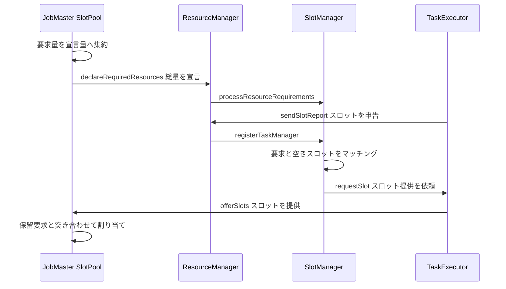

# 第11章 スロット管理と ResourceManager

> **本章で読むソース**
>
> - [`SlotPoolService.java`](https://github.com/apache/flink/blob/release-2.3.0/flink-runtime/src/main/java/org/apache/flink/runtime/jobmaster/slotpool/SlotPoolService.java)
> - [`DeclarativeSlotPool.java`](https://github.com/apache/flink/blob/release-2.3.0/flink-runtime/src/main/java/org/apache/flink/runtime/jobmaster/slotpool/DeclarativeSlotPool.java)
> - [`DeclarativeSlotPoolBridge.java`](https://github.com/apache/flink/blob/release-2.3.0/flink-runtime/src/main/java/org/apache/flink/runtime/jobmaster/slotpool/DeclarativeSlotPoolBridge.java)
> - [`DeclarativeSlotPoolService.java`](https://github.com/apache/flink/blob/release-2.3.0/flink-runtime/src/main/java/org/apache/flink/runtime/jobmaster/slotpool/DeclarativeSlotPoolService.java)
> - [`SlotManager.java`](https://github.com/apache/flink/blob/release-2.3.0/flink-runtime/src/main/java/org/apache/flink/runtime/resourcemanager/slotmanager/SlotManager.java)
> - [`FineGrainedSlotManager.java`](https://github.com/apache/flink/blob/release-2.3.0/flink-runtime/src/main/java/org/apache/flink/runtime/resourcemanager/slotmanager/FineGrainedSlotManager.java)
> - [`ResourceManager.java`](https://github.com/apache/flink/blob/release-2.3.0/flink-runtime/src/main/java/org/apache/flink/runtime/resourcemanager/ResourceManager.java)
> - [`DefaultSlotStatusSyncer.java`](https://github.com/apache/flink/blob/release-2.3.0/flink-runtime/src/main/java/org/apache/flink/runtime/resourcemanager/slotmanager/DefaultSlotStatusSyncer.java)
> - [`SlotSharingGroup.java`](https://github.com/apache/flink/blob/release-2.3.0/flink-runtime/src/main/java/org/apache/flink/runtime/jobmanager/scheduler/SlotSharingGroup.java)

## この章の狙い

第10章では、JobMaster がスケジューラを通じてサブタスクにスロットを要求するところまでを見た。

その要求はどこへ届き、誰が実際のスロットを差し出すのか。

Flink では、要求を出す側の JobMaster と、スロットを供給する側の ResourceManager が別のコンポーネントに分かれている。

JobMaster 側はスロットの必要量を宣言し、ResourceManager 側がクラスタ全体の TaskExecutor を見渡してその宣言を満たす。

本章では、JobMaster の `DeclarativeSlotPoolBridge` が要求量をどう集約して宣言するか、ResourceManager の `FineGrainedSlotManager` がその宣言を TaskExecutor の申告するスロットへどうマッチングするか、そして両者を往復するメッセージの流れを読む。

## 前提

JobMaster はジョブ1つに1つ存在し、その内部にスロットを管理する `SlotPoolService` を持つ。

ResourceManager はクラスタ全体に1つ存在し、すべての TaskExecutor から申告されるスロットを一元管理する。

TaskExecutor はスロットを提供する側のプロセスであり、自分の持つスロットを ResourceManager へ申告する。

スロット共有（slot sharing）は、異なる `JobVertex` に属する複数のサブタスクを1つのスロットへ同居させる仕組みで、JobGraph 構築の段階で各頂点に割り当てられている（第8章）。

スロットの割り当て先となる `ExecutionVertex` の構造は第9章で、そこへ要求を出すスケジューラは第10章で扱った。

本章はその要求が受理されて物理スロットになるまでの、JobMaster と ResourceManager のあいだの経路に絞る。

## 宣言的なスロット要求モデル

JobMaster がスロットを得る仕組みの土台は、`DeclarativeSlotPool` インターフェースが定める宣言的な資源管理プロトコルである。

このインターフェースの Javadoc は、資源を要求する側の作法を明示している。

[`DeclarativeSlotPool.java` L35-L42](https://github.com/apache/flink/blob/release-2.3.0/flink-runtime/src/main/java/org/apache/flink/runtime/jobmaster/slotpool/DeclarativeSlotPool.java#L35-L42)

```java
/**
 * Slot pool interface which uses Flink's declarative resource management protocol to acquire
 * resources.
 *
 * <p>In order to acquire new resources, users need to increase the required resources. Once they no
 * longer need the resources, users need to decrease the required resources so that superfluous
 * resources can be returned.
 */
public interface DeclarativeSlotPool {
```

要求する側は「このスロットが欲しい」と1件ずつ命令するのではなく、「合計でこれだけの資源が要る」という総量を宣言する。

必要になれば総量を増やし、不要になれば総量を減らす。

この増減を表すのが `increaseResourceRequirementsBy` と `decreaseResourceRequirementsBy` である。

[`DeclarativeSlotPool.java` L52-L64](https://github.com/apache/flink/blob/release-2.3.0/flink-runtime/src/main/java/org/apache/flink/runtime/jobmaster/slotpool/DeclarativeSlotPool.java#L52-L64)

```java
    /**
     * Increases the resource requirements by increment.
     *
     * @param increment increment by which to increase the resource requirements
     */
    void increaseResourceRequirementsBy(ResourceCounter increment);

    /**
     * Decreases the resource requirements by decrement.
     *
     * @param decrement decrement by which to decrease the resource requirements
     */
    void decreaseResourceRequirementsBy(ResourceCounter decrement);
```

要求量は `ResourceProfile` ごとの個数を数える `ResourceCounter` として保持され、個々のスロットの識別子ではなく型ごとの必要数として扱われる。

宣言する側は必要量だけを伝え、その必要量をどの TaskExecutor のどのスロットで満たすかは受け取る側の判断に委ねる。

命令ではなく状態を宣言するこの形は、要求と充足を非同期に切り離す。

要求量が変わるたびに個別の依頼を作り直す必要がなく、現在の宣言と現在の充足状況の差分だけを見て調整すればよい。

## JobMaster 側の要求集約

`DeclarativeSlotPoolBridge` は、スケジューラからのスロット要求を受け取り、それを宣言量の増分へ変換する橋渡し役である。

スケジューラが新しいスロットを要求すると `internalRequestNewAllocatedSlot` が呼ばれ、その要求を保留リストへ積むと同時に、宣言する資源量を1つ分だけ増やす。

[`DeclarativeSlotPoolBridge.java` L453-L459](https://github.com/apache/flink/blob/release-2.3.0/flink-runtime/src/main/java/org/apache/flink/runtime/jobmaster/slotpool/DeclarativeSlotPoolBridge.java#L453-L459)

```java
    private void internalRequestNewAllocatedSlot(PendingRequest pendingRequest) {
        pendingRequests.put(pendingRequest.getSlotRequestId(), pendingRequest);

        getDeclarativeSlotPool()
                .increaseResourceRequirementsBy(
                        ResourceCounter.withResource(pendingRequest.getResourceProfile(), 1));
    }
```

複数のサブタスクがそれぞれスロットを求めても、ここで積み上がるのは `ResourceCounter` の総数である。

個別の要求は `pendingRequests` に保留され、宣言側には要求の総量だけが反映される。

保留された要求は、スロットが実際に届いたときに解消される。

`DeclarativeSlotPool` が新しく使えるスロットを受け入れると、`newSlotsAreAvailable` を経て要求とスロットの突き合わせが走る。

[`DeclarativeSlotPoolBridge.java` L294-L310](https://github.com/apache/flink/blob/release-2.3.0/flink-runtime/src/main/java/org/apache/flink/runtime/jobmaster/slotpool/DeclarativeSlotPoolBridge.java#L294-L310)

```java
        final Collection<RequestSlotMatchingStrategy.RequestSlotMatch> requestSlotMatches =
                requestSlotMatchingStrategy.matchRequestsAndSlots(
                        freeSlots, pendingRequests.values(), getTaskExecutorsLoadingView());
        if (requestSlotMatches.size() == pendingRequests.size()) {
            reserveAndFulfillMatchedFreeSlots(requestSlotMatches);
        } else if (requestSlotMatches.size() < pendingRequests.size()) {
            // Do nothing and waiting slots.
            log.debug(
                    "Ignored the matched results: {}, pendingRequests: {}, waiting for more available slots.",
                    requestSlotMatches,
                    pendingRequests);
        } else {
            // For requestSlotMatches.size() > pendingRequests.size()
            throw new IllegalStateException(
                    "The number of matched slots is not equals to the pendingRequests.");
        }
```

`matchRequestsAndSlots` は、空きスロットと保留中の要求を突き合わせ、どの要求をどのスロットで満たすかの組を返す。

組が揃った要求から順に `reserveAndFulfillMatchedFreeSlots` でスロットを確保し、対応する要求の Future を完了させる。

要求を出す側は総量を宣言し、スロットが届いたら保留リストと突き合わせて個別の要求へ割り付ける。

この二段構えによって、要求の発行とスロットの到着が時間的にずれても破綻しない。

## 宣言を ResourceManager へ届ける

`DeclarativeSlotPool` の宣言量が変わると、その変化は ResourceManager へ送られる。

送信の経路は `DeclarativeSlotPoolService` にあり、ResourceManager へ接続する時点で宣言量を届けるコールバックを登録する。

[`DeclarativeSlotPoolService.java` L299-L317](https://github.com/apache/flink/blob/release-2.3.0/flink-runtime/src/main/java/org/apache/flink/runtime/jobmaster/slotpool/DeclarativeSlotPoolService.java#L299-L317)

```java
    @Override
    public void connectToResourceManager(ResourceManagerGateway resourceManagerGateway) {
        assertHasBeenStarted();

        resourceRequirementServiceConnectionManager.connect(
                resourceRequirements ->
                        resourceManagerGateway.declareRequiredResources(
                                jobMasterId, resourceRequirements, rpcTimeout));

        declareResourceRequirements(declarativeSlotPool.getResourceRequirements());
    }

    private void declareResourceRequirements(Collection<ResourceRequirement> resourceRequirements) {
        assertHasBeenStarted();

        resourceRequirementServiceConnectionManager.declareResourceRequirements(
                ResourceRequirements.create(
                        jobId, applicationId, jobManagerAddress, resourceRequirements));
    }
```

宣言量は `ResourceManagerGateway.declareRequiredResources` を通じて ResourceManager へ渡る。

送られるのは要求の総量を表す `ResourceRequirements` であり、ジョブ ID と宛先アドレスを添えて、そのジョブが今いくつのスロットを要るかを宣言する。

ResourceManager 側の受け口は `declareRequiredResources` で、送信元の JobMaster が登録済みであることを確かめてから、宣言を `SlotManager` へ引き渡す。

[`ResourceManager.java` L583-L599](https://github.com/apache/flink/blob/release-2.3.0/flink-runtime/src/main/java/org/apache/flink/runtime/resourcemanager/ResourceManager.java#L583-L599)

```java
    public CompletableFuture<Acknowledge> declareRequiredResources(
            JobMasterId jobMasterId, ResourceRequirements resourceRequirements, Duration timeout) {
        final JobID jobId = resourceRequirements.getJobId();
        try (MdcCloseable ignored = MdcUtils.withContext(MdcUtils.asContextData(jobId))) {
            final JobManagerRegistration jobManagerRegistration =
                    jobManagerRegistrations.get(jobId);

            if (null != jobManagerRegistration) {
                if (Objects.equals(jobMasterId, jobManagerRegistration.getJobMasterId())) {
                    return getReadyToServeFuture()
                            .thenApply(
                                    acknowledge -> {
                                        validateRunsInMainThread();
                                        slotManager.processResourceRequirements(
                                                resourceRequirements);
                                        return null;
                                    });
```

ここで JobMaster の宣言は ResourceManager の `SlotManager` へ渡り、供給側の管理下に入る。

## ResourceManager 側のスロット管理

ResourceManager が管理するスロットの状態を握るのが `SlotManager` インターフェースである。

その責務は Javadoc に明示されている。

[`SlotManager.java` L36-L46](https://github.com/apache/flink/blob/release-2.3.0/flink-runtime/src/main/java/org/apache/flink/runtime/resourcemanager/slotmanager/SlotManager.java#L36-L46)

```java
/**
 * The slot manager is responsible for maintaining a view on all registered task manager slots,
 * their allocation and all pending slot requests. Whenever a new slot is registered or an allocated
 * slot is freed, then it tries to fulfill another pending slot request. Whenever there are not
 * enough slots available the slot manager will notify the resource manager about it via {@link
 * ResourceAllocator#declareResourceNeeded}.
 *
 * <p>In order to free resources and avoid resource leaks, idling task managers (task managers whose
 * slots are currently not used) and pending slot requests time out triggering their release and
 * failure, respectively.
 */
public interface SlotManager extends AutoCloseable {
```

`SlotManager` は、登録済みの全 TaskExecutor のスロット、その割り当て状況、保留中の要求という3つの視点を1か所に集める。

新しいスロットが登録されるか、割り当て済みスロットが解放されるたびに、保留中の要求を満たせないか調べる。

要求を満たすスロットが足りなければ、ResourceManager 経由で新しい資源の確保を促す。

`FineGrainedSlotManager` はこのインターフェースの実装で、資源要求を受け取ると保留し、遅延つきの再チェックを予約する。

[`FineGrainedSlotManager.java` L338-L367](https://github.com/apache/flink/blob/release-2.3.0/flink-runtime/src/main/java/org/apache/flink/runtime/resourcemanager/slotmanager/FineGrainedSlotManager.java#L338-L367)

```java
    public void processResourceRequirements(ResourceRequirements resourceRequirements) {
        checkInit();
        if (resourceRequirements.getResourceRequirements().isEmpty()
                && resourceTracker.isRequirementEmpty(resourceRequirements.getJobId())) {
            // Skip duplicate empty resource requirements.
            return;
        }
        // ... (中略) ...
        resourceTracker.notifyResourceRequirements(
                resourceRequirements.getJobId(), resourceRequirements.getResourceRequirements());
        checkResourceRequirementsWithDelay();
    }
```

宣言された要求量は `resourceTracker` へ記録され、実際のマッチングは `checkResourceRequirementsWithDelay` の先に遅延させて回す。

要求の到着ごとに即座にマッチングせず、短い遅延にまとめることで、連続して届く宣言の更新を1回の調整にたためる。

## 要求とスロットのマッチング

マッチングの本体は `checkResourceRequirements` にある。

このメソッドは、まだ満たされていない要求量を `resourceTracker` から取り出し、資源割り当て戦略へ渡す。

[`FineGrainedSlotManager.java` L648-L677](https://github.com/apache/flink/blob/release-2.3.0/flink-runtime/src/main/java/org/apache/flink/runtime/resourcemanager/slotmanager/FineGrainedSlotManager.java#L648-L677)

```java
    private void checkResourceRequirements() {
        if (!started) {
            return;
        }
        Map<JobID, Collection<ResourceRequirement>> missingResources =
                resourceTracker.getMissingResources();
        // ... (中略) ...
        final ResourceAllocationResult result =
                resourceAllocationStrategy.tryFulfillRequirements(
                        missingResources, taskManagerTracker, this::isBlockedTaskManager);

        // Allocate slots according to the result
        allocateSlotsAccordingTo(result.getAllocationsOnRegisteredResources());
```

`tryFulfillRequirements` は、不足している要求量を、`taskManagerTracker` が把握する登録済み TaskExecutor の空き資源に対して割り当てる。

割り当ての結果は、登録済み資源で満たせる分と、新しい TaskExecutor の起動が要る分に分かれる。

登録済み資源で満たせる分は `allocateSlotsAccordingTo` が処理し、ジョブごと、TaskExecutor ごと、`ResourceProfile` ごとに1スロットずつ確保をかける。

[`FineGrainedSlotManager.java` L747-L766](https://github.com/apache/flink/blob/release-2.3.0/flink-runtime/src/main/java/org/apache/flink/runtime/resourcemanager/slotmanager/FineGrainedSlotManager.java#L747-L766)

```java
    private void allocateSlotsAccordingTo(Map<JobID, Map<InstanceID, ResourceCounter>> result) {
        final List<CompletableFuture<Void>> allocationFutures = new ArrayList<>();
        for (Map.Entry<JobID, Map<InstanceID, ResourceCounter>> jobEntry : result.entrySet()) {
            final JobID jobID = jobEntry.getKey();
            for (Map.Entry<InstanceID, ResourceCounter> tmEntry : jobEntry.getValue().entrySet()) {
                final InstanceID instanceID = tmEntry.getKey();
                for (Map.Entry<ResourceProfile, Integer> slotEntry :
                        tmEntry.getValue().getResourcesWithCount()) {
                    for (int i = 0; i < slotEntry.getValue(); ++i) {
                        allocationFutures.add(
                                slotStatusSyncer.allocateSlot(
                                        instanceID,
                                        jobID,
                                        jobIdsToApplicationIds.get(jobID),
                                        jobMasterTargetAddresses.get(jobID),
                                        slotEntry.getKey()));
                    }
                }
            }
        }
```

確保の1件ごとに `slotStatusSyncer.allocateSlot` が呼ばれ、対象の TaskExecutor へスロットの提供を依頼する。

## TaskExecutor との往復

TaskExecutor が持つスロットは、TaskExecutor 自身が申告して初めて ResourceManager の管理下に入る。

TaskExecutor は ResourceManager へ登録したのち、自分のスロット状況を `SlotReport` として送る。

その受け口が ResourceManager の `sendSlotReport` で、申告されたスロットを `SlotManager` へ登録する。

[`ResourceManager.java` L509-L524](https://github.com/apache/flink/blob/release-2.3.0/flink-runtime/src/main/java/org/apache/flink/runtime/resourcemanager/ResourceManager.java#L509-L524)

```java
    public CompletableFuture<Acknowledge> sendSlotReport(
            ResourceID taskManagerResourceId,
            InstanceID taskManagerRegistrationId,
            SlotReport slotReport,
            Duration timeout) {
        final WorkerRegistration<WorkerType> workerTypeWorkerRegistration =
                taskExecutors.get(taskManagerResourceId);

        if (workerTypeWorkerRegistration.getInstanceID().equals(taskManagerRegistrationId)) {
            SlotManager.RegistrationResult registrationResult =
                    slotManager.registerTaskManager(
                            workerTypeWorkerRegistration,
                            slotReport,
                            workerTypeWorkerRegistration.getTotalResourceProfile(),
                            workerTypeWorkerRegistration.getDefaultSlotResourceProfile());
```

`slotManager.registerTaskManager` は、申告された TaskExecutor とそのスロット状況を `taskManagerTracker` へ加える。

[`FineGrainedSlotManager.java` L408-L426](https://github.com/apache/flink/blob/release-2.3.0/flink-runtime/src/main/java/org/apache/flink/runtime/resourcemanager/slotmanager/FineGrainedSlotManager.java#L408-L426)

```java
            taskManagerTracker.addTaskManager(
                    taskExecutorConnection, totalResourceProfile, defaultSlotResourceProfile);

            if (initialSlotReport.hasAllocatedSlot()) {
                slotStatusSyncer.reportSlotStatus(
                        taskExecutorConnection.getInstanceID(), initialSlotReport);
            }

            if (matchedPendingTaskManagerOptional.isPresent()) {
                PendingTaskManager pendingTaskManager = matchedPendingTaskManagerOptional.get();
                allocateSlotsForRegisteredPendingTaskManager(
                        pendingTaskManager, taskExecutorConnection.getInstanceID());
                taskManagerTracker.removePendingTaskManager(
                        pendingTaskManager.getPendingTaskManagerId());
                return RegistrationResult.SUCCESS;
            }

            checkResourceRequirementsWithDelay();
            return RegistrationResult.SUCCESS;
```

新しく登録された TaskExecutor が、それまで起動待ちだった資源に一致すれば、待たせていた要求へすぐスロットを割り当てる。

一致しなければ `checkResourceRequirementsWithDelay` を回し、この TaskExecutor の空きスロットで満たせる要求がないか調べ直す。

マッチングが成立して確保が決まると、`slotStatusSyncer.allocateSlot` が対象の TaskExecutor へ RPC を投げてスロットの提供を求める。

[`DefaultSlotStatusSyncer.java` L128-L143](https://github.com/apache/flink/blob/release-2.3.0/flink-runtime/src/main/java/org/apache/flink/runtime/resourcemanager/slotmanager/DefaultSlotStatusSyncer.java#L128-L143)

```java
            taskManagerTracker.notifySlotStatus(
                    allocationId, jobId, instanceId, resourceProfile, SlotState.PENDING);
            resourceTracker.notifyAcquiredResource(jobId, resourceProfile);
            pendingSlotAllocations.add(allocationId);

            // RPC call to the task manager
            CompletableFuture<Acknowledge> requestFuture =
                    gateway.requestSlot(
                            SlotID.getDynamicSlotID(resourceId),
                            jobId,
                            applicationId,
                            allocationId,
                            resourceProfile,
                            targetAddress,
                            resourceManagerId,
                            taskManagerRequestTimeout);
```

`gateway.requestSlot` は TaskExecutor へ、指定した資源のスロットを特定のジョブへ差し出すよう命じる。

TaskExecutor はこれを受けて、宛先アドレスの JobMaster へスロットを提供する。

提供されたスロットは JobMaster の `SlotPoolService.offerSlots` に届き、前節で見た保留要求との突き合わせにかかる。

[`SlotPoolService.java` L78-L81](https://github.com/apache/flink/blob/release-2.3.0/flink-runtime/src/main/java/org/apache/flink/runtime/jobmaster/slotpool/SlotPoolService.java#L78-L81)

```java
    Collection<SlotOffer> offerSlots(
            TaskManagerLocation taskManagerLocation,
            TaskManagerGateway taskManagerGateway,
            Collection<SlotOffer> offers);
```

こうして、JobMaster の宣言から始まった要求が、ResourceManager のマッチングと TaskExecutor への依頼を経て、物理スロットの提供として JobMaster へ戻ってくる。

## スロット割り当ての全体像

ここまでの往復を図にすると、要求と供給が別コンポーネントに分かれたまま1周する様子が見える。



左側の JobMaster は要求量を宣言するだけで、どの TaskExecutor が応じるかは指定しない。

右側の ResourceManager は、TaskExecutor が申告するスロットの全体像を持ち、宣言された要求と空きスロットを突き合わせて提供先を決める。

要求と供給を分離したことで、JobMaster はクラスタ全体の資源配置を知らずに必要量だけを表明でき、資源の配分は ResourceManager の一元的な判断に集約される。

## スロット共有がもたらす省資源

1つのスロットには、既定では複数のサブタスクが同居できる。

その同居の単位を定めるのが `SlotSharingGroup` で、Javadoc はこれを「どのタスクを1スロットに一緒に置けるか」を決める緩い許可と説明する。

[`SlotSharingGroup.java` L32-L48](https://github.com/apache/flink/blob/release-2.3.0/flink-runtime/src/main/java/org/apache/flink/runtime/jobmanager/scheduler/SlotSharingGroup.java#L32-L48)

```java
/**
 * A slot sharing units defines which different task (from different job vertices) can be deployed
 * together within a slot. This is a soft permission, in contrast to the hard constraint defined by
 * a co-location hint.
 */
public class SlotSharingGroup implements java.io.Serializable {

    private static final long serialVersionUID = 1L;

    private final Set<JobVertexID> ids = new TreeSet<>();

    private final SlotSharingGroupId slotSharingGroupId = new SlotSharingGroupId();

    private String slotSharingGroupName;

    // Represents resources of all tasks in the group. Default to be UNKNOWN.
    private ResourceProfile resourceProfile = ResourceProfile.UNKNOWN;
```

同じグループに属する `JobVertexID` は `ids` にまとめられ、そのグループの資源要求は含まれるタスク全体の合計として `resourceProfile` に持つ。

異なる `JobVertex` のサブタスクが同居できるので、1本のパイプラインを構成する演算子の同じインデックスのサブタスクを、1つのスロットへ載せられる。

この同居が効くのは、必要なスロット数の決まり方である。

各演算子のサブタスクを別々のスロットに置くと、スロット数はジョブ全体のサブタスク総数、つまり並列度と演算子数の積になる。

スロット共有で1本のパイプラインを1スロットへたためると、必要なスロット数はパイプラインの本数、すなわち最大並列度に落ちる。

必要なスロット数が演算子数によらず最大並列度で決まるため、同じジョブをより少ない TaskExecutor で動かせる。

## まとめ

JobMaster と ResourceManager は、スロットを要求する側と供給する側として分かれている。

JobMaster の `DeclarativeSlotPoolBridge` は、スケジューラからの個別要求を `ResourceCounter` の総量へ集約し、宣言的な資源要求として保持する。

宣言量は `DeclarativeSlotPoolService` から `declareRequiredResources` を通じて ResourceManager へ届き、`SlotManager` の管理下に入る。

ResourceManager の `FineGrainedSlotManager` は、TaskExecutor が `sendSlotReport` で申告するスロットを一元管理し、宣言された要求と空きスロットを `checkResourceRequirements` で突き合わせる。

マッチングが決まると `requestSlot` で TaskExecutor へ提供を依頼し、TaskExecutor は `offerSlots` で JobMaster へスロットを差し出す。

要求量だけを宣言する JobMaster と、クラスタ全体を見て配分する ResourceManager に分けたことで、資源の割り当ての判断が一か所へ集まる。

スロット共有は、1本のパイプラインを1スロットへたたむことで、必要なスロット数を並列度と演算子数の積から最大並列度へ落とし、同じジョブを少ない TaskExecutor で動かせるようにする。

割り当てられたスロットの上でサブタスクが実際にどうデプロイされ動き出すかは、次章で扱う。

## 関連する章

- [第9章 ExecutionGraph の構築](../part02-graph/09-executiongraph.md)
- [第10章 JobMaster とスケジューリング](../part03-scheduling/10-jobmaster-scheduler.md)
- [第12章 TaskExecutor へのデプロイ](../part03-scheduling/12-taskexecutor-deploy.md)
- [第2章 クラスタのエントリポイント](../part00-overview/02-cluster-entrypoint.md)
