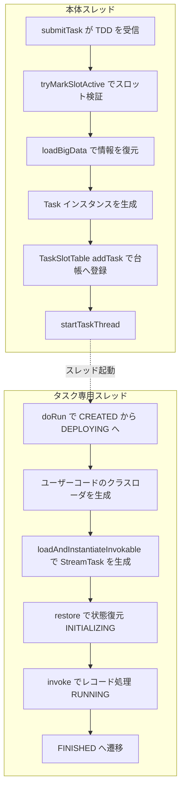

# 第12章 TaskExecutor によるタスクのデプロイ

> **本章で読むソース**
>
> - [`TaskExecutor.java`](https://github.com/apache/flink/blob/release-2.3.0/flink-runtime/src/main/java/org/apache/flink/runtime/taskexecutor/TaskExecutor.java)
> - [`TaskDeploymentDescriptor.java`](https://github.com/apache/flink/blob/release-2.3.0/flink-runtime/src/main/java/org/apache/flink/runtime/deployment/TaskDeploymentDescriptor.java)
> - [`Task.java`](https://github.com/apache/flink/blob/release-2.3.0/flink-runtime/src/main/java/org/apache/flink/runtime/taskmanager/Task.java)
> - [`TaskSlotTable.java`](https://github.com/apache/flink/blob/release-2.3.0/flink-runtime/src/main/java/org/apache/flink/runtime/taskexecutor/slot/TaskSlotTable.java)
> - [`TaskSlotTableImpl.java`](https://github.com/apache/flink/blob/release-2.3.0/flink-runtime/src/main/java/org/apache/flink/runtime/taskexecutor/slot/TaskSlotTableImpl.java)

## この章の狙い

第10章と第11章で、JobMaster が ExecutionGraph をスケジューリングし、必要なスロットを ResourceManager と TaskExecutor から確保するところまでを見た。

スロットが確保できると、JobMaster は各サブタスクを、割り当て済みのスロットを持つ TaskExecutor へ送り込む。

本章は、この送り込みを受ける側、つまり TaskExecutor がサブタスク1つを実際に動かし始めるまでの経路をたどる。

具体的には、デプロイ要求を運ぶ `TaskDeploymentDescriptor`、それを受け取る `TaskExecutor.submitTask`、生成される実行単位である `Task`、そしてスロットへの割り当て台帳である `TaskSlotTable` の4つを読む。

到達点は、`Task` が専用スレッドで走り出し、ユーザーコードである `TaskInvokable`（`StreamTask` など）の `invoke` が呼ばれる瞬間である。

## 前提

デプロイの宛先は「ジョブとアロケーションIDの組で識別されるスロット」である。

スロットの確保そのもの、つまり ResourceManager がどのスロットをどのジョブへ割り当て、TaskExecutor がそれを JobMaster へ提供するまでの流れは第11章で扱った（[第11章 スロットと ResourceManager](11-slot-resourcemanager.md)）。

本章はその後、確保済みのスロットへサブタスクを載せる段階に絞る。

`TaskInvokable` の内部、つまり `StreamTask` がメールボックスモデルでレコードをどう処理するかは次章で扱う（[第13章 StreamTask とメールボックス](../part04-task-execution/13-streamtask-mailbox.md)）。

本章は `invoke` を呼ぶところまでを見る。

## デプロイ情報を運ぶ TaskDeploymentDescriptor

JobMaster から TaskExecutor へ送られるデプロイ要求は、`TaskDeploymentDescriptor`（以下 TDD）1つに詰められる。

クラスの Javadoc は、その役割を「タスクをタスクマネージャへデプロイするのに必要な情報をすべて含む」と述べる。

TDD が持つフィールドを見ると、デプロイに要る情報の内訳がわかる。

[`TaskDeploymentDescriptor.java` L103-L145](https://github.com/apache/flink/blob/release-2.3.0/flink-runtime/src/main/java/org/apache/flink/runtime/deployment/TaskDeploymentDescriptor.java#L103-L145)

```java
    /** Serialized job information if non-offloaded or <tt>PermanentBlobKey</tt> if offloaded. */
    private final MaybeOffloaded<JobInformation> serializedJobInformation;

    /** Serialized task information if non-offloaded or <tt>PermanentBlobKey</tt> if offloaded. */
    private final MaybeOffloaded<TaskInformation> serializedTaskInformation;

    // ... (中略) ...

    /**
     * The ID referencing the job this task belongs to.
     *
     * <p>NOTE: this is redundant to the information stored in {@link #serializedJobInformation} but
     * needed in order to restore offloaded data.
     */
    private final JobID jobId;

    /** The ID referencing the attempt to execute the task. */
    private final ExecutionAttemptID executionId;

    /** The allocation ID of the slot in which the task shall be run. */
    private final AllocationID allocationId;

    /** The list of produced intermediate result partition deployment descriptors. */
    private final List<ResultPartitionDeploymentDescriptor> producedPartitions;

    /** The list of consumed intermediate result partitions. */
    private final List<InputGateDeploymentDescriptor> inputGates;
```

`JobInformation` はジョブ全体で共通の情報であり、ジョブ名、ジョブ設定、ユーザーコードのJARを指す情報を持つ。

`TaskInformation` はこのサブタスクが属する頂点の情報であり、動かすべきクラス名、頂点の並列度、頂点固有の設定を持つ。

`ExecutionAttemptID` はこのデプロイが指す実行試行であり、第9章で見たとおり JobManager と TaskManager のあいだのメッセージ宛先になる。

`AllocationID` はこのサブタスクを載せるべきスロットを指し、`producedPartitions` と `inputGates` は入出力のデータ交換をどこへつなぐかを記述する。

### 大きな情報を BLOB へ逃がす仕組み

`serializedJobInformation` と `serializedTaskInformation` の型が `MaybeOffloaded<T>` である点に、デプロイを軽くするための工夫が現れている。

`JobInformation` は同じジョブに属する全サブタスクで共通であり、並列度が大きいジョブでは同じ内容を何度も送ることになる。

`MaybeOffloaded<T>` はこの重複を避けるためのラッパーであり、値をそのまま埋め込む `NonOffloaded` と、BLOB ストアへ逃がして参照キーだけを持つ `Offloaded` の2形態を取る。

情報が大きいときは JobMaster 側で BLOB ストアへ1度だけ書き、TDD には `PermanentBlobKey` だけを載せる。

TaskExecutor 側でこれを実体へ戻すのが `loadBigData` である。

[`TaskDeploymentDescriptor.java` L282-L299](https://github.com/apache/flink/blob/release-2.3.0/flink-runtime/src/main/java/org/apache/flink/runtime/deployment/TaskDeploymentDescriptor.java#L282-L299)

```java
        if (serializedJobInformation instanceof Offloaded) {
            PermanentBlobKey jobInfoKey =
                    ((Offloaded<JobInformation>) serializedJobInformation).serializedValueKey;

            Preconditions.checkNotNull(blobService);

            JobInformation jobInformation = jobInformationCache.get(jobId, jobInfoKey);
            if (jobInformation == null) {
                final File dataFile = blobService.getFile(jobId, jobInfoKey);
                // NOTE: Do not delete the job info BLOB since it may be needed again during
                // recovery. (it is deleted automatically on the BLOB server and cache when the job
                // enters a terminal state)
                jobInformation =
                        InstantiationUtil.deserializeObject(
                                new BufferedInputStream(Files.newInputStream(dataFile.toPath())),
                                getClass().getClassLoader());
                jobInformationCache.put(jobId, jobInfoKey, jobInformation);
            }
            this.jobInformation = jobInformation.deepCopy();
        }
```

BLOB から戻した `JobInformation` は `jobInformationCache` へ入れ、同じジョブの次のサブタスクではキャッシュから取り出す。

これにより、同一 TaskExecutor に同じジョブの複数サブタスクをデプロイするとき、共通情報の読み出しとデシリアライズが1回で済む。

RPC で運ぶ TDD 本体を小さく保ち、共通情報の転送とデシリアライズをジョブあたり1回へまとめることが、並列度の大きいジョブでのデプロイを軽くする機構である。

## submitTask が受ける流れ

TaskExecutor 側の入口は `submitTask` である。

このメソッドは TDD を受け取り、宛先スロットの検証、情報の復元、`Task` の生成、スロットへの登録、スレッド起動までを一続きに行う。

はじめに、TDD が指す `AllocationID` のスロットが、このジョブに割り当て済みかを確認し、確認できたら BLOB へ逃がした情報を復元する。

[`TaskExecutor.java` L694-L716](https://github.com/apache/flink/blob/release-2.3.0/flink-runtime/src/main/java/org/apache/flink/runtime/taskexecutor/TaskExecutor.java#L694-L716)

```java
            if (!taskSlotTable.tryMarkSlotActive(jobId, tdd.getAllocationId())) {
                final String message =
                        "No task slot allocated for job ID "
                                + jobId
                                + " and allocation ID "
                                + tdd.getAllocationId()
                                + '.';
                log.debug(message);
                throw new TaskSubmissionException(message);
            }

            // re-integrate offloaded data and deserialize shuffle descriptors
            try {
                tdd.loadBigData(
                        taskExecutorBlobService.getPermanentBlobService(),
                        jobInformationCache,
                        taskInformationCache,
                        shuffleDescriptorsCache);
            } catch (IOException | ClassNotFoundException e) {
                throw new TaskSubmissionException(
                        "Could not re-integrate offloaded TaskDeploymentDescriptor data.", e);
            }
```

`tryMarkSlotActive` は、指定のスロットがこのジョブへ割り当て済みなら、それを「アクティブ」状態へ遷移させて `true` を返す。

割り当てのないスロットへデプロイしようとした要求は、ここで `TaskSubmissionException` として弾かれる。

つまり submitTask は、第11章で確保されたスロットの上でしかタスクを起動しない。

スロットの検証を通過したあと、`loadBigData` で `JobInformation` と `TaskInformation` を実体へ戻し、続いて `getJobInformation` と `getTaskInformation` でデシリアライズ済みの実体を取り出す。

## Task インスタンスの生成とスロットへの登録

必要な情報がそろうと、submitTask は復元した `JobInformation` と `TaskInformation`、そして TDD が運んだ実行試行ID、アロケーションID、入出力の記述子を渡して `Task` を生成する。

[`TaskExecutor.java` L836-L843](https://github.com/apache/flink/blob/release-2.3.0/flink-runtime/src/main/java/org/apache/flink/runtime/taskexecutor/TaskExecutor.java#L836-L843)

```java
            Task task =
                    new Task(
                            jobInformation,
                            taskInformation,
                            tdd.getExecutionAttemptId(),
                            tdd.getAllocationId(),
                            tdd.getProducedPartitions(),
                            tdd.getInputGates(),
```

`Task` は1つの並列サブタスク、つまり第9章で見た `Execution` 1回ぶんに対応する TaskExecutor 側の実行単位である。

生成した `Task` は、まず `TaskSlotTable` へ登録してからスレッドを起動する。

[`TaskExecutor.java` L874-L890](https://github.com/apache/flink/blob/release-2.3.0/flink-runtime/src/main/java/org/apache/flink/runtime/taskexecutor/TaskExecutor.java#L874-L890)

```java
            boolean taskAdded;

            try {
                taskAdded = taskSlotTable.addTask(task);
            } catch (SlotNotFoundException | SlotNotActiveException e) {
                throw new TaskSubmissionException("Could not submit task.", e);
            }

            if (taskAdded) {
                task.startTaskThread();

                setupResultPartitionBookkeeping(
                        tdd.getJobId(), tdd.getProducedPartitions(), task.getTerminationFuture());
                return CompletableFuture.completedFuture(Acknowledge.get());
            } else {
                final String message =
                        "TaskManager already contains a task for id " + task.getExecutionId() + '.';
```

登録が成功したときに限り `startTaskThread` を呼ぶ順序が重要である。

`addTask` が先に台帳へ載せることで、スレッドが走り出す前にそのサブタスクをアロケーションIDと実行試行IDから引ける状態にしておく。

こうしておかないと、起動直後にキャンセルや障害通知が届いたとき、対象のタスクを台帳から見つけられない。

## スロットの割り当て台帳 TaskSlotTable

`TaskSlotTable` は、TaskExecutor が持つスロット群と、そこへ載ったタスクの対応を管理する台帳である。

インターフェースの Javadoc は「複数の `TaskSlot` インスタンスの容れ物であり、タスクと割り当て済みスロットの集合への高速アクセスのため複数の索引を維持する」と述べる。

`addTask` の実装は、タスクのアロケーションIDからスロットを引き、そのスロットがアクティブであることを確かめてからタスクを載せる。

[`TaskSlotTableImpl.java` L543-L565](https://github.com/apache/flink/blob/release-2.3.0/flink-runtime/src/main/java/org/apache/flink/runtime/taskexecutor/slot/TaskSlotTableImpl.java#L543-L565)

```java
    public boolean addTask(T task) throws SlotNotFoundException, SlotNotActiveException {
        checkRunning();
        Preconditions.checkNotNull(task);

        TaskSlot<T> taskSlot = getTaskSlot(task.getAllocationId());

        if (taskSlot != null) {
            if (taskSlot.isActive(task.getJobID(), task.getAllocationId())) {
                if (taskSlot.add(task)) {
                    taskSlotMappings.put(
                            task.getExecutionId(), new TaskSlotMapping<>(task, taskSlot));

                    return true;
                } else {
                    return false;
                }
            } else {
                throw new SlotNotActiveException(task.getJobID(), task.getAllocationId());
            }
        } else {
            throw new SlotNotFoundException(task.getAllocationId());
        }
    }
```

`getTaskSlot` はアロケーションIDからスロットを引く索引であり、スロットが見つからなければ `SlotNotFoundException` を投げる。

スロットがアクティブでなければ `SlotNotActiveException` を投げ、submitTask 側はこれを `TaskSubmissionException` に包み直して JobMaster へ返す。

タスクを載せると `taskSlotMappings` に実行試行IDをキーとする対応を登録する。

この索引があるため、後続のキャンセル要求や状態問い合わせは実行試行IDだけでタスクへ到達できる。

`Task` が必要とする `MemoryManager` も、同じ台帳がアロケーションIDごとに保持する。

submitTask は `Task` 生成に先立って `taskSlotTable.getTaskMemoryManager` でスロット固有のメモリマネージャを取り出し、`Task` へ渡す。

こうしてスロットは、割り当ての単位であると同時にメモリ資源の帰属先にもなる。

## Task の起動とユーザーコードの隔離

`startTaskThread` は、`Task` の生成時にあらかじめ用意しておいた専用スレッドを起動するだけである。

そのスレッドはコンストラクタで作られ、この時点では起動しない。

[`Task.java` L442-L444](https://github.com/apache/flink/blob/release-2.3.0/flink-runtime/src/main/java/org/apache/flink/runtime/taskmanager/Task.java#L442-L444)

```java
        // finally, create the executing thread, but do not start it
        executingThread = new Thread(TASK_THREADS_GROUP, this, taskNameWithSubtask);
```

スレッドは専用のスレッドグループ `TASK_THREADS_GROUP` に属する。

各サブタスクを専用スレッドで走らせるこの設計が、ユーザーコードを TaskExecutor 本体から隔離する機構である。

`Task` は `Runnable` であり、`startTaskThread` が呼ぶ `executingThread.start()` からその `run` が別スレッドで動き出す。

[`Task.java` L575-L583](https://github.com/apache/flink/blob/release-2.3.0/flink-runtime/src/main/java/org/apache/flink/runtime/taskmanager/Task.java#L575-L583)

```java
    /** The core work method that bootstraps the task and executes its code. */
    @Override
    public void run() {
        try (MdcCloseable ignored = MdcUtils.withContext(MdcUtils.asContextData(jobId))) {
            doRun();
        } finally {
            terminationFuture.complete(executionState);
        }
    }
```

TaskExecutor の RPC を捌く本体スレッドと、ユーザーコードを走らせるタスクスレッドが分かれているため、ユーザーコードがブロックしたり大量のCPUを使ったりしても、TaskExecutor は他のタスクのデプロイやハートビートに応答し続けられる。

キャンセル時にはこのタスクスレッドだけを狙って割り込みをかけられ、暴走したユーザーコードを他へ波及させずに止めにいける。

### 状態遷移とユーザーコードのクラスロード

`doRun` はまず実行状態を `CREATED` から `DEPLOYING` へ遷移させる。

[`Task.java` L585-L596](https://github.com/apache/flink/blob/release-2.3.0/flink-runtime/src/main/java/org/apache/flink/runtime/taskmanager/Task.java#L585-L596)

```java
    private void doRun() {
        // ----------------------------
        //  Initial State transition
        // ----------------------------
        while (true) {
            ExecutionState current = this.executionState;
            if (current == ExecutionState.CREATED) {
                if (transitionState(ExecutionState.CREATED, ExecutionState.DEPLOYING)) {
                    // success, we can start our work
                    break;
                }
            } else if (current == ExecutionState.FAILED) {
```

`DEPLOYING` へ移ると、`Task` はユーザーコードのクラスローダを組み立てる。

`createUserCodeClassloader` は、ジョブのJARをBLOBストアから取得したうえで、ユーザーコードを読むためのクラスローダを作る。

このクラスローダの詳細、つまり親子委譲の順序や `child-first` の設定は第5章で扱った（[第5章 設定とクラスローダ](../part01-core/05-configuration-classloader.md)）。

[`Task.java` L643-L646](https://github.com/apache/flink/blob/release-2.3.0/flink-runtime/src/main/java/org/apache/flink/runtime/taskmanager/Task.java#L643-L646)

```java
            userCodeClassLoader = createUserCodeClassloader();
            final ExecutionConfig executionConfig =
                    serializedExecutionConfig.deserializeValue(userCodeClassLoader.asClassLoader());
            Configuration executionConfigConfiguration = executionConfig.toConfiguration();
```

続いて `RuntimeEnvironment` を組み立て、そのクラスローダをスレッドのコンテキストクラスローダに据えたうえで、`TaskInformation` が指すクラス名から実行本体を生成する。

[`Task.java` L748-L774](https://github.com/apache/flink/blob/release-2.3.0/flink-runtime/src/main/java/org/apache/flink/runtime/taskmanager/Task.java#L748-L774)

```java
            executingThread.setContextClassLoader(userCodeClassLoader.asClassLoader());

            // When constructing invokable, separate threads can be constructed and thus should be
            // monitored for system exit (in addition to invoking thread itself monitored below).
            FlinkSecurityManager.monitorUserSystemExitForCurrentThread();
            try {
                // now load and instantiate the task's invokable code
                invokable =
                        loadAndInstantiateInvokable(
                                userCodeClassLoader.asClassLoader(), nameOfInvokableClass, env);
            } finally {
                FlinkSecurityManager.unmonitorUserSystemExitForCurrentThread();
            }

            // ... (中略) ...

            this.invokable = invokable;

            restoreAndInvoke(invokable, postFailureCleanUpRegistry);
```

`nameOfInvokableClass` は `TaskInformation` が運んできた、動かすべきクラスの名前である。

`loadAndInstantiateInvokable` はこの名前をユーザーコードのクラスローダで解決し、`Environment` を1引数に取るコンストラクタでインスタンス化する。

[`Task.java` L1655-L1677](https://github.com/apache/flink/blob/release-2.3.0/flink-runtime/src/main/java/org/apache/flink/runtime/taskmanager/Task.java#L1655-L1677)

```java
    private static TaskInvokable loadAndInstantiateInvokable(
            ClassLoader classLoader, String className, Environment environment) throws Throwable {

        final Class<? extends TaskInvokable> invokableClass;
        try {
            invokableClass =
                    Class.forName(className, true, classLoader).asSubclass(TaskInvokable.class);
        } catch (Throwable t) {
            throw new Exception("Could not load the task's invokable class.", t);
        }

        Constructor<? extends TaskInvokable> statelessCtor;

        try {
            statelessCtor = invokableClass.getConstructor(Environment.class);
        } catch (NoSuchMethodException ee) {
            throw new FlinkException("Task misses proper constructor", ee);
        }

        // instantiate the class
        try {
            //noinspection ConstantConditions  --> cannot happen
            return statelessCtor.newInstance(environment);
        } catch (InvocationTargetException e) {
            throw e.getTargetException();
        } catch (Exception e) {
            throw new FlinkException("Could not instantiate the task's invokable class.", e);
        }
    }
```

生成される `TaskInvokable` は、ストリーミングジョブでは `StreamTask` の具象クラスである。

`Environment` を通じて、入出力ゲート、状態バックエンド、設定、メモリマネージャといった実行に要る資源が実行本体へ渡される。

### restore から invoke へ

生成した実行本体は `restoreAndInvoke` に渡され、状態の復元とユーザーコードの実行が段階的な状態遷移とともに進む。

[`Task.java` L944-L969](https://github.com/apache/flink/blob/release-2.3.0/flink-runtime/src/main/java/org/apache/flink/runtime/taskmanager/Task.java#L944-L969)

```java
    private void restoreAndInvoke(
            TaskInvokable finalInvokable, AutoCloseableRegistry cleanUpRegistry) throws Exception {
        try {
            // switch to the INITIALIZING state, if that fails, we have been canceled/failed in the
            // meantime
            if (!transitionState(ExecutionState.DEPLOYING, ExecutionState.INITIALIZING)) {
                throw new CancelTaskException();
            }

            taskManagerActions.updateTaskExecutionState(
                    new TaskExecutionState(executionId, ExecutionState.INITIALIZING));

            // make sure the user code classloader is accessible thread-locally
            executingThread.setContextClassLoader(userCodeClassLoader.asClassLoader());

            runWithSystemExitMonitoring(finalInvokable::restore);

            if (!transitionState(ExecutionState.INITIALIZING, ExecutionState.RUNNING)) {
                throw new CancelTaskException();
            }

            // notify everyone that we switched to running
            taskManagerActions.updateTaskExecutionState(
                    new TaskExecutionState(executionId, ExecutionState.RUNNING));

            runWithSystemExitMonitoring(finalInvokable::invoke);
```

`DEPLOYING` から `INITIALIZING` へ遷移したうえで `restore` を呼び、状態バックエンドからの復元を先に済ませる。

復元が終わると `INITIALIZING` から `RUNNING` へ遷移し、その旨を `taskManagerActions.updateTaskExecutionState` で JobManager へ通知してから `invoke` を呼ぶ。

`invoke` がユーザーコードの本処理であり、レコードの処理はここで初めて始まる。

`invoke` が正常に返ると、`doRun` は `RUNNING` から `FINISHED` へ遷移してサブタスクの実行を締めくくる。

各遷移が `transitionState` を介して JobManager へ通知されるので、JobMaster は ExecutionGraph 上の `Execution` の状態を TaskExecutor の実状態に追従させられる。

## デプロイの流れの全体像

submitTask がデプロイ要求を受けてから `invoke` に至るまでを図にすると、RPCを捌く本体スレッドとタスク専用スレッドの分かれ目が見える。



本体スレッドは検証と生成と登録を担い、専用スレッドはクラスロードと実行を担う。

両者の境目が `startTaskThread` であり、ここでユーザーコードが TaskExecutor 本体から切り離された別スレッドへ移る。

## まとめ

TaskExecutor へのタスクのデプロイは、`TaskDeploymentDescriptor` を運搬単位として始まる。

TDD は `JobInformation` と `TaskInformation`、実行試行ID、アロケーションID、入出力の記述子を1つにまとめ、大きな共通情報は `MaybeOffloaded` によって BLOB へ逃がしてRPCを軽く保つ。

`submitTask` は、宛先スロットがこのジョブへ割り当て済みかを `tryMarkSlotActive` で確かめ、`loadBigData` で情報を復元し、`Task` を生成してから `TaskSlotTable` の台帳へ登録する。

登録が済んで初めて `startTaskThread` で専用スレッドを起動し、そのスレッド上で `doRun` が状態を `DEPLOYING` へ移し、ユーザーコードのクラスローダを組み立てて `TaskInvokable` を生成する。

`restoreAndInvoke` が `restore` と `invoke` を段階的な状態遷移とともに呼ぶことで、状態の復元を挟んでからレコード処理が始まる。

各サブタスクを専用スレッドで隔離するこの設計により、ユーザーコードのブロックや暴走が TaskExecutor 本体の応答性を損なわず、キャンセルも対象スレッドへ局所化できる。

`invoke` の内側、つまり `StreamTask` がどうレコードを回すかは次章で読む。

## 関連する章

- [第11章 スロットと ResourceManager](11-slot-resourcemanager.md)
- [第13章 StreamTask とメールボックス](../part04-task-execution/13-streamtask-mailbox.md)
- [第5章 設定とクラスローダ](../part01-core/05-configuration-classloader.md)
