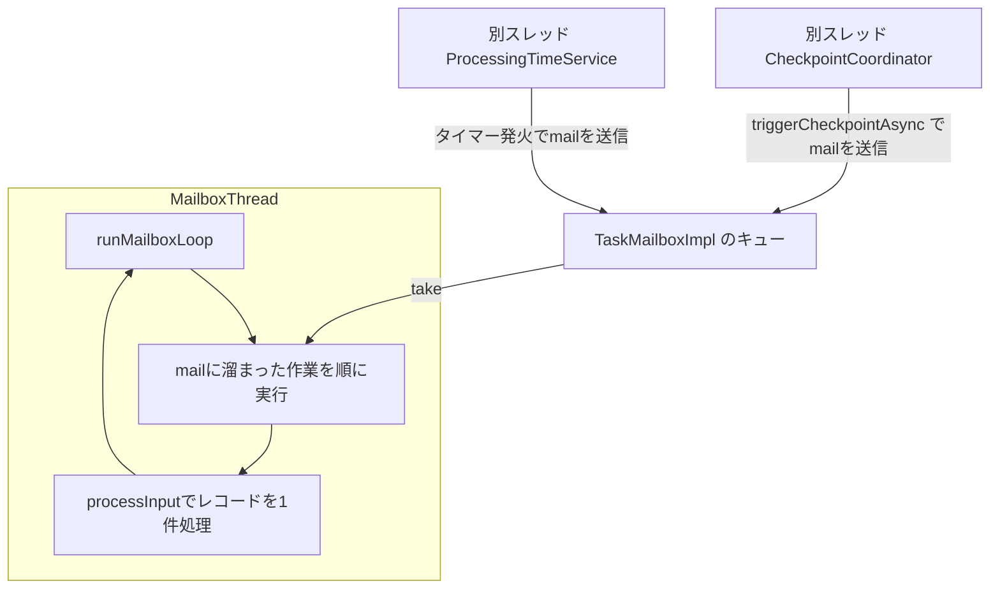

# 第13章 StreamTask と mailbox 実行モデル

> **本章で読むソース**
>
> - [`StreamTask.java`](https://github.com/apache/flink/blob/release-2.3.0/flink-runtime/src/main/java/org/apache/flink/streaming/runtime/tasks/StreamTask.java)
> - [`MailboxProcessor.java`](https://github.com/apache/flink/blob/release-2.3.0/flink-runtime/src/main/java/org/apache/flink/streaming/runtime/tasks/mailbox/MailboxProcessor.java)
> - [`TaskMailboxImpl.java`](https://github.com/apache/flink/blob/release-2.3.0/flink-runtime/src/main/java/org/apache/flink/streaming/runtime/tasks/mailbox/TaskMailboxImpl.java)
> - [`MailboxDefaultAction.java`](https://github.com/apache/flink/blob/release-2.3.0/flink-runtime/src/main/java/org/apache/flink/streaming/runtime/tasks/mailbox/MailboxDefaultAction.java)

## この章の狙い

第12章では、`TaskExecutor` がデプロイ要求を受け取り、`Task` を1つのスレッドとして起動するところまでを見た。

その `Task` の中でユーザーコードを実際に実行するのが `StreamTask` である。

`StreamTask` は、第8章で見たオペレーターチェインによって1つの `JobVertex` にまとめられた演算子群を、1つのサブタスクの中で順に呼び出す実行本体である。

本章では、`StreamTask#invoke` からレコード処理までの流れと、それを支える **mailbox** という単一スレッドの実行モデルを読む。

レコード処理とチェックポイントやタイマー発火が、なぜロックなしに同じスレッドで安全に共存できるのかを、`MailboxProcessor` と `TaskMailboxImpl` のコードから追う。

## 前提

`StreamTask` は `TaskInvokable` を実装し、`Task` のスレッドから `invoke()` を1回だけ呼ばれる。

サブタスクに割り当てられた演算子チェインは `OperatorChain` として保持され、`StreamTask` はこのチェインの先頭演算子（`mainOperator`）へレコードを渡す。

`StreamTask` の実行はすべて1本のスレッド（以下、mailboxスレッド）の上で行われる。

このスレッドは、通常時はレコードを処理し続け、チェックポイントの起動やタイマーの発火といった「本来は別スレッドから飛んでくる要求」も、**mail** という単位のタスクに変換したうえで同じスレッドの中で順番に処理する。

## invoke からレコード処理へ

`invoke()` はまず状態の復元を行い、その後 `runMailboxLoop()` を呼んでレコード処理のループに入る。

[`StreamTask.java` L944-L965](https://github.com/apache/flink/blob/release-2.3.0/flink-runtime/src/main/java/org/apache/flink/streaming/runtime/tasks/StreamTask.java#L944-L965)

```java
@Override
public final void invoke() throws Exception {
    // Allow invoking method 'invoke' without having to call 'restore' before it.
    if (!isRunning) {
        LOG.debug("Restoring during invoke will be called.");
        restoreInternal();
    }

    // final check to exit early before starting to run
    ensureNotCanceled();

    scheduleBufferDebloater();

    // let the task do its work
    getEnvironment().getMetricGroup().getIOMetricGroup().markTaskStart();
    runMailboxLoop();

    // if this left the run() method cleanly despite the fact that this was canceled,
    // make sure the "clean shutdown" is not attempted
    ensureNotCanceled();

    afterInvoke();
}
```

`runMailboxLoop()` は内部で `mailboxProcessor.runMailboxLoop()` を呼ぶだけの薄いラッパーであり、実際のループ本体は `MailboxProcessor` にある。

`mailboxProcessor` はコンストラクタで、レコード処理を担う `this::processInput` を **default action** として渡されて組み立てられる。

[`StreamTask.java` L420-L422](https://github.com/apache/flink/blob/release-2.3.0/flink-runtime/src/main/java/org/apache/flink/streaming/runtime/tasks/StreamTask.java#L420-L422)

```java
this.mailboxProcessor =
        new MailboxProcessor(
                this::processInput, mailbox, actionExecutor, mailboxMetricsControl);
```

`processInput` は `InputProcessor` からレコードを1件受け取り、対応するチェインの先頭演算子に渡す。

[`StreamTask.java` L655-L682](https://github.com/apache/flink/blob/release-2.3.0/flink-runtime/src/main/java/org/apache/flink/streaming/runtime/tasks/StreamTask.java#L655-L682)

```java
protected void processInput(MailboxDefaultAction.Controller controller) throws Exception {
    DataInputStatus status = inputProcessor.processInput();
    switch (status) {
        case MORE_AVAILABLE:
            if (taskIsAvailable()) {
                return;
            }
            break;
        case NOTHING_AVAILABLE:
            break;
        case END_OF_RECOVERY:
            throw new IllegalStateException("We should not receive this event here.");
        case STOPPED:
            endData(StopMode.NO_DRAIN);
            return;
        case END_OF_DATA:
            endData(StopMode.DRAIN);
            notifyEndOfData();
            return;
        case END_OF_INPUT:
            // Suspend the mailbox processor, it would be resumed in afterInvoke and finished
            // after all records processed by the downstream tasks. We also suspend the default
            // actions to avoid repeat executing the empty default operation (namely process
            // records).
            controller.suspendDefaultAction();
            mailboxProcessor.suspend();
            return;
    }
    // ... (中略、入力が入手できないときのバックプレッシャー計測)
}
```

`processInput` は1回の呼び出しで1件のレコードだけを処理して戻る設計になっている。

これは、後述する mailbox ループが「default action を1回呼ぶたびに mail の有無を確認する」構造だからであり、default action がレコードを大量に抱え込んで戻らないと、mail（チェックポイントやタイマー）の処理が長時間遅延してしまう。

## MailboxProcessor によるループの構造

`MailboxProcessor` のクラス javadoc は、この実行モデルの意図を端的に述べている。

[`MailboxProcessor.java` L44-L62](https://github.com/apache/flink/blob/release-2.3.0/flink-runtime/src/main/java/org/apache/flink/streaming/runtime/tasks/mailbox/MailboxProcessor.java#L44-L62)

```java
/**
 * This class encapsulates the logic of the mailbox-based execution model. At the core of this model
 * {@link #runMailboxLoop()} that continuously executes the provided {@link MailboxDefaultAction} in
 * a loop. On each iteration, the method also checks if there are pending actions in the mailbox and
 * executes such actions. This model ensures single-threaded execution between the default action
 * (e.g. record processing) and mailbox actions (e.g. checkpoint trigger, timer firing, ...).
 *
 * <p>The {@link MailboxDefaultAction} interacts with this class through the {@link
 * MailboxController} to communicate control flow changes to the mailbox loop, e.g. that invocations
 * of the default action are temporarily or permanently exhausted.
 *
 * <p>The design of {@link #runMailboxLoop()} is centered around the idea of keeping the expected
 * hot path (default action, no mail) as fast as possible. This means that all checking of mail and
 * other control flags (mailboxLoopRunning, suspendedDefaultAction) are always connected to #hasMail
 * indicating true. This means that control flag changes in the mailbox thread can be done directly,
 * but we must ensure that there is at least one action in the mailbox so that the change is picked
 * up. For control flag changes by all other threads, that must happen through mailbox actions, this
 * is automatically the case.
 */
```

`runMailboxLoop()` 自体は短い。

[`MailboxProcessor.java` L214-L232](https://github.com/apache/flink/blob/release-2.3.0/flink-runtime/src/main/java/org/apache/flink/streaming/runtime/tasks/mailbox/MailboxProcessor.java#L214-L232)

```java
public void runMailboxLoop() throws Exception {
    suspended = !mailboxLoopRunning;

    final TaskMailbox localMailbox = mailbox;

    checkState(
            localMailbox.isMailboxThread(),
            "Method must be executed by declared mailbox thread!");

    assert localMailbox.getState() == TaskMailbox.State.OPEN : "Mailbox must be opened!";

    final MailboxController mailboxController = new MailboxController(this);

    while (isNextLoopPossible()) {
        // The blocking `processMail` call will not return until default action is available.
        processMail(localMailbox, false);
        if (isNextLoopPossible()) {
            mailboxDefaultAction.runDefaultAction(
                    mailboxController); // lock is acquired inside default action as needed
        }
    }
}
```

ループは次の2ステップの繰り返しである。

1. `processMail` で mailbox に溜まっている mail をすべて処理する。
2. mail の処理が終わったら `mailboxDefaultAction.runDefaultAction`、すなわち `processInput` を1回呼び、レコードを1件処理する。

`processMail` は、非ブロッキングでバッチ分の mail を処理する `processMailsNonBlocking` と、default action が実行不能な間だけブロッキングで待つ `processMailsWhenDefaultActionUnavailable` を組み合わせる。

[`MailboxProcessor.java` L355-L368](https://github.com/apache/flink/blob/release-2.3.0/flink-runtime/src/main/java/org/apache/flink/streaming/runtime/tasks/mailbox/MailboxProcessor.java#L355-L368)

```java
private boolean processMail(TaskMailbox mailbox, boolean singleStep) throws Exception {
    // Doing this check is an optimization to only have a volatile read in the expected hot
    // path, locks are only
    // acquired after this point.
    boolean isBatchAvailable = mailbox.createBatch();

    // Take mails in a non-blockingly and execute them.
    boolean processed = isBatchAvailable && processMailsNonBlocking(singleStep);
    if (singleStep) {
        return processed;
    }

    // If the default action is currently not available, we can run a blocking mailbox execution
    // until the default action becomes available again.
    processed |= processMailsWhenDefaultActionUnavailable();

    return processed;
}
```

入力が枯渇するなどして `processInput` がすぐに戻る値を持たない状態（default action が使用不能）になると、mailbox スレッドは `mailbox.take` でブロッキング待機に移り、新しい mail か入力の到着を待つ。

これにより、処理すべきレコードも mail もない間、mailbox スレッドはビジーループせずにブロッキング待機する。

## mail という単位と TaskMailboxImpl

mailbox に積まれる作業の単位は `Mail` であり、チェックポイントの起動やタイマーコールバックの発火、非同期処理の完了通知などは、すべてこの `Mail` としてキューに積まれてから mailbox スレッドで実行される。

`StreamTask#triggerCheckpointAsync` は、`CheckpointCoordinator`（第20章）が別スレッドから呼ぶエントリポイントだが、実際のチェックポイント処理は自分では行わず、`mainMailboxExecutor.execute` で mail としてキューに積むだけである。

[`StreamTask.java` L1304-L1325](https://github.com/apache/flink/blob/release-2.3.0/flink-runtime/src/main/java/org/apache/flink/streaming/runtime/tasks/StreamTask.java#L1304-L1325)

```java
@Override
public CompletableFuture<Boolean> triggerCheckpointAsync(
        CheckpointMetaData checkpointMetaData, CheckpointOptions checkpointOptions) {
    checkForcedFullSnapshotSupport(checkpointOptions);

    MailboxExecutor.MailOptions mailOptions =
            CheckpointOptions.AlignmentType.UNALIGNED == checkpointOptions.getAlignment()
                    ? MailboxExecutor.MailOptions.urgent()
                    : MailboxExecutor.MailOptions.options();

    CompletableFuture<Boolean> result = new CompletableFuture<>();
    mainMailboxExecutor.execute(
            mailOptions,
            () -> {
                try {
                    boolean noUnfinishedInputGates =
                            Arrays.stream(getEnvironment().getAllInputGates())
                                    .allMatch(InputGate::isFinished);
                    // ... (中略)
                }
                // ... (中略)
            });
    // ... (中略)
}
```

`mailOptions` によって、非アラインドチェックポイントは `urgent`（優先度が高い）mail として送られる。

`TaskMailboxImpl` はこの優先度を、通常の mail を積む末尾キューとは別に、先頭へ差し込む経路で表現する。

[`TaskMailboxImpl.java` L284-L290](https://github.com/apache/flink/blob/release-2.3.0/flink-runtime/src/main/java/org/apache/flink/streaming/runtime/tasks/mailbox/TaskMailboxImpl.java#L284-L290)

```java
@Override
public void put(@Nonnull Mail mail) {
    if (mail.getMailOptions().isUrgent()) {
        putFirst(mail);
    } else {
        putLast(mail);
    }
}
```

`TaskMailboxImpl` はクラス javadoc で「複数の書き込みスレッドと単一の読み取りスレッド」を前提とすると明言している。

[`TaskMailboxImpl.java` L42-L45](https://github.com/apache/flink/blob/release-2.3.0/flink-runtime/src/main/java/org/apache/flink/streaming/runtime/tasks/mailbox/TaskMailboxImpl.java#L42-L45)

```java
/**
 * Implementation of {@link TaskMailbox} in a {@link java.util.concurrent.BlockingQueue} fashion and
 * tailored towards our use case with multiple writers and single reader.
 */
```

読み取り側（`take`、`tryTake`、`tryTakeFromBatch` など）はすべて、生成時に記録した `taskMailboxThread` と現在のスレッドを比較する `checkIsMailboxThread` によってガードされている。

[`TaskMailboxImpl.java` L369-L373](https://github.com/apache/flink/blob/release-2.3.0/flink-runtime/src/main/java/org/apache/flink/streaming/runtime/tasks/mailbox/TaskMailboxImpl.java#L369-L373)

```java
private void checkIsMailboxThread() {
    if (!isMailboxThread()) {
        throw new IllegalStateException(
                "Illegal thread detected. This method must be called from inside the mailbox thread!");
    }
}
```

書き込み側（`put`）だけが複数スレッドから呼ばれることを許され、内部の `ReentrantLock` でキューへの追加を保護する。

つまり、`TaskMailboxImpl` がロックで守っているのはキューへの出し入れという狭い範囲だけであり、mail の中身（チェックポイント処理やレコード処理そのもの）は常に mailbox スレッド1本の中で実行されるため、ロックを一切必要としない。



## この設計がなぜロック競合を排除するか

`StreamTask` が扱う処理には、レコード処理、チェックポイントバリアの処理、タイマーコールバックの発火という、性質の異なる3種類の作業が混在する。

これらは、演算子が保持する状態（第19章）や出力先の `RecordWriter` といった共有リソースに触れる点で共通しており、旧来のロックベースの実装ではこれらすべての呼び出しに対して同じ `checkpointLock` の獲得が必要だった。

mailbox モデルは、この排他制御をロックの取得ではなく、実行するスレッドを1本に固定することで実現する。

チェックポイントの起動もタイマーの発火も、要求元のスレッドが直接演算子を呼び出すのではなく、`Mail` としてキューに積むだけにとどめ、実際の実行は必ず mailbox スレッドが `MailboxProcessor` のループの中で行う。

演算子の状態やチェインの出力といった可変な資源は、mailbox スレッド以外から触れられることがないため、ロックなしで安全にアクセスできる。

`TaskMailboxImpl` のロックはキューという1点に閉じ込められ、演算子の処理時間の長さに関わらず、ロック保持時間はキューへの追加や取り出しという定数時間の操作に収まる。

複数スレッドが同じロックを奪い合う旧来の方式と比べ、待ち時間がキュー操作の一瞬に限定される点が、この設計の速度面の利点である。

## まとめ

`StreamTask#invoke` は、状態を復元したのち `MailboxProcessor#runMailboxLoop` を呼び出し、レコード処理のループに入る。

`runMailboxLoop` は「mailbox に溜まった mail をすべて処理する」処理と「default action（`processInput`）を1回呼ぶ」処理を交互に繰り返す単純なループであり、レコード処理とチェックポイントやタイマーの処理は、この1本のスレッドの中で直列に実行される。

`TaskMailboxImpl` は複数の書き込みスレッドと単一の読み取りスレッドを前提に設計されており、`checkIsMailboxThread` で読み取り側を mailbox スレッドに限定する一方、書き込み側だけを `ReentrantLock` で保護する。

チェックポイントの起動やタイマー発火は、要求元のスレッドが演算子を直接呼ぶのではなく `Mail` としてキューへ送るにとどめることで、演算子や状態へのアクセスをすべて mailbox スレッド1本に閉じ込め、レコード処理のホットパスからロック獲得そのものを取り除く。

## 関連する章

- [第12章 TaskExecutor によるデプロイ](../part03-scheduling/12-taskexecutor-deploy.md)
- [第14章 演算子とユーザー関数](14-operators-udf.md)
- [第20章 CheckpointCoordinator](../part06-state-checkpoint/20-checkpoint-coordinator.md)
