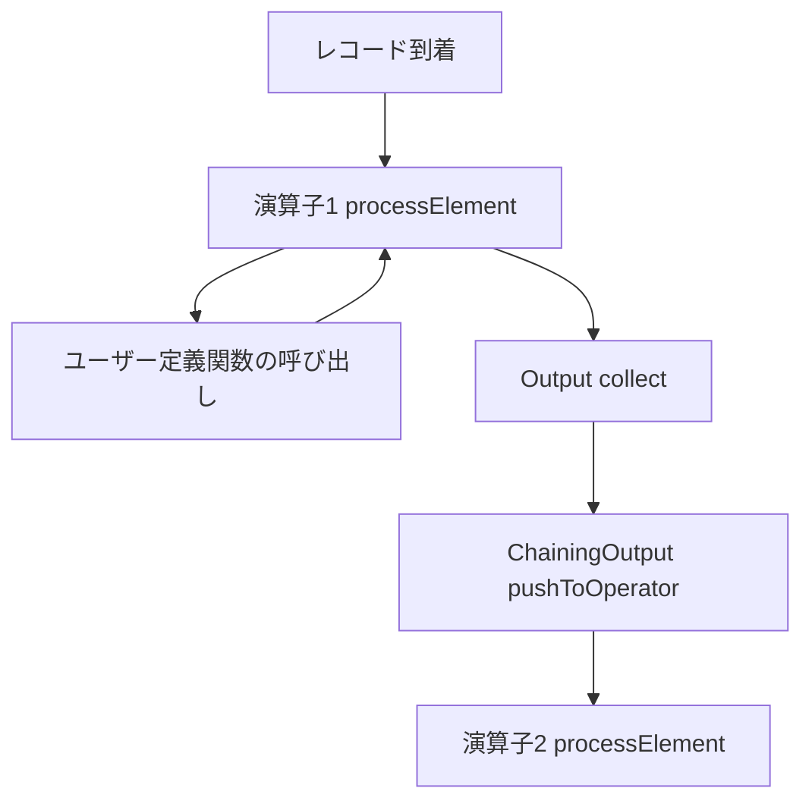

# 第14章 演算子とユーザー定義関数の実行

> **本章で読むソース**
>
> - [`AbstractStreamOperator.java`](https://github.com/apache/flink/blob/release-2.3.0/flink-runtime/src/main/java/org/apache/flink/streaming/api/operators/AbstractStreamOperator.java)
> - [`AbstractUdfStreamOperator.java`](https://github.com/apache/flink/blob/release-2.3.0/flink-runtime/src/main/java/org/apache/flink/streaming/api/operators/AbstractUdfStreamOperator.java)
> - [`OneInputStreamOperator.java`](https://github.com/apache/flink/blob/release-2.3.0/flink-runtime/src/main/java/org/apache/flink/streaming/api/operators/OneInputStreamOperator.java)
> - [`Output.java`](https://github.com/apache/flink/blob/release-2.3.0/flink-runtime/src/main/java/org/apache/flink/streaming/api/operators/Output.java)
> - [`StreamMap.java`](https://github.com/apache/flink/blob/release-2.3.0/flink-runtime/src/main/java/org/apache/flink/streaming/api/operators/StreamMap.java)
> - [`ChainingOutput.java`](https://github.com/apache/flink/blob/release-2.3.0/flink-runtime/src/main/java/org/apache/flink/streaming/runtime/tasks/ChainingOutput.java)
> - [`RecordProcessorUtils.java`](https://github.com/apache/flink/blob/release-2.3.0/flink-runtime/src/main/java/org/apache/flink/streaming/runtime/io/RecordProcessorUtils.java)
> - [`OperatorChain.java`](https://github.com/apache/flink/blob/release-2.3.0/flink-runtime/src/main/java/org/apache/flink/streaming/runtime/tasks/OperatorChain.java)

## この章の狙い

第13章では、`StreamTask` が mailbox からレコードを取り出し、演算子の `processElement` を呼び出すまでの実行モデルを追った。

本章では、その呼び出し先である**演算子**（`StreamOperator`）本体を読む。

`AbstractStreamOperator` が定めるライフサイクルと、ユーザー定義関数（UDF）をラップする `AbstractUdfStreamOperator` の役割、そして `processElement` が呼んだ `Output.collect` がどう下流の演算子に届くかを、`OperatorChain` の構築過程まで含めて見ていく。

## 前提

`StreamNode`（第7章）は `JobGraph`（第8章）へ変換される際、チェイン可能な隣接ノードが1つの `JobVertex` にまとめられる。

実行時には、1つの `JobVertex` に対応する `StreamTask` が、そのチェインに含まれる演算子群を保持する。

この演算子群を管理するのが `OperatorChain`（第13章で `StreamTask` の実行主体として登場したクラス）であり、`OperatorChain` はチェインの末尾（データの流れとしては下流）から先頭に向かって演算子を生成し、各演算子に「レコードをどこへ渡すか」を表す `Output` を渡す。

演算子自身は `StreamOperator` インタフェースを実装するが、実際にユーザーが `DataStream` API で書く `map` や `filter` は、`AbstractStreamOperator` を継承した具象クラス（`StreamMap` など）として生成される。

## 演算子のライフサイクルとフィールド

`AbstractStreamOperator` は、演算子が実行時に必要とする状態を transient フィールドとして持つ。

[`AbstractStreamOperator.java` L118-L122](https://github.com/apache/flink/blob/release-2.3.0/flink-runtime/src/main/java/org/apache/flink/streaming/api/operators/AbstractStreamOperator.java#L118-L122)

```java
    protected transient StreamConfig config;

    protected transient Output<StreamRecord<OUT>> output;

    protected transient IndexedCombinedWatermarkStatus combinedWatermark;
```

`output` フィールドが、この演算子が処理し終えたレコードの送り先である。

`timeServiceManager`（タイマーと状態への足がかり、第15章で扱う）も同様に演算子のフィールドとして保持される。

[`AbstractStreamOperator.java` L151-L153](https://github.com/apache/flink/blob/release-2.3.0/flink-runtime/src/main/java/org/apache/flink/streaming/api/operators/AbstractStreamOperator.java#L151-L153)

```java
    protected transient StreamOperatorStateHandler stateHandler;

    protected transient InternalTimeServiceManager<?> timeServiceManager;
```

これらのフィールドは `setup` によって初期化される。

`setup` は `OperatorChain` が演算子を生成する際に呼ばれ、`containingTask`（この演算子が属する `StreamTask`）と `output` を受け取って `this.output` に設定する。

[`AbstractStreamOperator.java` L195-L201](https://github.com/apache/flink/blob/release-2.3.0/flink-runtime/src/main/java/org/apache/flink/streaming/api/operators/AbstractStreamOperator.java#L195-L201)

```java
    protected void setup(
            StreamTask<?, ?> containingTask,
            StreamConfig config,
            Output<StreamRecord<OUT>> output) {
        final Environment environment = containingTask.getEnvironment();
        this.container = containingTask;
        this.config = config;
```

`setup` の後、`processElement` が呼ばれる前に `open` が呼ばれる。

デフォルトの `open` は、割り込み可能タイマーの設定確認以外は何もしない。

[`AbstractStreamOperator.java` L392-L402](https://github.com/apache/flink/blob/release-2.3.0/flink-runtime/src/main/java/org/apache/flink/streaming/api/operators/AbstractStreamOperator.java#L392-L402)

```java
    @Override
    public void open() throws Exception {
        if (useInterruptibleTimers(getContainingTask().getJobConfiguration())
                && areInterruptibleTimersConfigured()
                && getTimeServiceManager().isPresent()) {
            LOG.info("Interruptible timers enabled for {}", getClass().getSimpleName());
            this.watermarkProcessor =
                    new MailboxWatermarkProcessor(
                            output, mailboxExecutor, getTimeServiceManager().get());
        }
    }
```

対して `close` は、状態アクセスに使う `stateHandler` を破棄する。

[`AbstractStreamOperator.java` L407-L411](https://github.com/apache/flink/blob/release-2.3.0/flink-runtime/src/main/java/org/apache/flink/streaming/api/operators/AbstractStreamOperator.java#L407-L411)

```java
    @Override
    public void close() throws Exception {
        if (stateHandler != null) {
            stateHandler.dispose();
        }
    }
```

`setup`、`open`、`processElement`（複数回）、`close` という順序が、演算子1つのライフサイクル全体になる。

`processElement` そのものは `AbstractStreamOperator` に定義がなく、`Input` インタフェース（`OneInputStreamOperator` が継承する）を実装する各具象演算子が個別に実装する。

## UDF をラップする AbstractUdfStreamOperator

`map`、`filter`、`process` のようにユーザーが関数を渡す演算子は、`AbstractUdfStreamOperator` を継承する。

`AbstractUdfStreamOperator` は `userFunction` フィールドにユーザー定義関数を保持し、演算子のライフサイクルの各段階でユーザー定義関数の対応するメソッドを呼び出す形に委譲する。

[`AbstractUdfStreamOperator.java` L92-L99](https://github.com/apache/flink/blob/release-2.3.0/flink-runtime/src/main/java/org/apache/flink/streaming/api/operators/AbstractUdfStreamOperator.java#L92-L99)

```java
    @Override
    protected void setup(
            StreamTask<?, ?> containingTask,
            StreamConfig config,
            Output<StreamRecord<OUT>> output) {
        super.setup(containingTask, config, output);
        FunctionUtils.setFunctionRuntimeContext(userFunction, getRuntimeContext());
    }
```

`setup` の時点で `RichFunction`（状態や実行コンテキストにアクセスできるユーザー定義関数）に `RuntimeContext` を注入しておき、続く `open` でユーザー定義関数自身の初期化処理を呼ぶ。

[`AbstractUdfStreamOperator.java` L114-L118](https://github.com/apache/flink/blob/release-2.3.0/flink-runtime/src/main/java/org/apache/flink/streaming/api/operators/AbstractUdfStreamOperator.java#L114-L118)

```java
    @Override
    public void open() throws Exception {
        super.open();
        FunctionUtils.openFunction(userFunction, DefaultOpenContext.INSTANCE);
    }
```

演算子のライフサイクルは、こうしてユーザー定義関数のライフサイクル（`RichFunction#open`、`close` など）を内側に包み込む。

演算子の `open` が呼ばれれば、その内部で必ずユーザー定義関数の `open` が呼ばれる、という対応関係がここで作られる。

`processElement` そのものは `AbstractUdfStreamOperator` にも定義がなく、`userFunction` を実際にどう呼ぶかは各具象演算子に委ねられる。

`MapFunction` を実行する `StreamMap` を例に見ると、`processElement` はユーザー定義関数を呼び出した結果を `output.collect` に渡すだけの薄い実装になっている。

[`StreamMap.java` L33-L38](https://github.com/apache/flink/blob/release-2.3.0/flink-runtime/src/main/java/org/apache/flink/streaming/api/operators/StreamMap.java#L33-L38)

```java
    @Override
    public void processElement(StreamRecord<IN> element) throws Exception {
        output.collect(element.replace(userFunction.map(element.getValue())));
    }
}
```

`element.replace` は、入力の `StreamRecord`（タイムスタンプなどのメタデータを持つレコードの入れ物）が持つメタデータを保ったまま、値だけを `userFunction.map` の戻り値に差し替える。

`processElement` から `Output.collect` までの間に演算子自身が行う処理は、この程度の薄さにとどまる。

レコード1件あたりの実質的な計算は、ほとんどが `userFunction` の呼び出し1回に集約される。

## OneInputStreamOperator と Output：レコード1件の受け渡しインタフェース

入力が1本の演算子は `OneInputStreamOperator` を実装する。

[`OneInputStreamOperator.java` L34-L40](https://github.com/apache/flink/blob/release-2.3.0/flink-runtime/src/main/java/org/apache/flink/streaming/api/operators/OneInputStreamOperator.java#L34-L40)

```java
@PublicEvolving
public interface OneInputStreamOperator<IN, OUT> extends StreamOperator<OUT>, Input<IN> {
    @Override
    default void setKeyContextElement(StreamRecord<IN> record) throws Exception {
        setKeyContextElement1(record);
    }
}
```

`processElement` を含むレコード処理のメソッド群は、実際には `OneInputStreamOperator` が継承する `Input<IN>` インタフェースの側に定義されている。

演算子が下流にレコードを渡す側のインタフェースが `Output` であり、`Collector<T>` を継承する。

[`Output.java` L39-L40](https://github.com/apache/flink/blob/release-2.3.0/flink-runtime/src/main/java/org/apache/flink/streaming/api/operators/Output.java#L39-L40)

```java
@PublicEvolving
public interface Output<T> extends Collector<T> {
```

`Collector<T>` は `collect(T record)` という1メソッドの単純なインタフェースであり、`Output` はこれにウォーターマークやレイテンシマーカーなど、レコード以外のメッセージを流すメソッドを加えたものになる。

[`Output.java` L49-L58](https://github.com/apache/flink/blob/release-2.3.0/flink-runtime/src/main/java/org/apache/flink/streaming/api/operators/Output.java#L49-L58)

```java
    void emitWatermark(Watermark mark);

    void emitWatermarkStatus(WatermarkStatus watermarkStatus);

    /**
     * Emits a record to the side output identified by the given {@link OutputTag}.
     *
     * @param record The record to collect.
     */
    <X> void collect(OutputTag<X> outputTag, StreamRecord<X> record);
```

`processElement` は `IN` を受け取り、`output.collect` で `OUT` を送り出す。

演算子1つを見る限り、この `Output` が具体的に何であるか（同じサブタスク内の次の演算子か、ネットワークの先の別サブタスクか）は隠蔽されている。

その具体的な実装が、演算子どうしをオペレーターチェインでつなぐか、ネットワーク経由でつなぐかを分ける。

## オペレーターチェインでの Output 連結：ChainingOutput

`OperatorChain` はチェインを末尾から先頭に向かって組み立てる。

[`OperatorChain.java` L813-L852](https://github.com/apache/flink/blob/release-2.3.0/flink-runtime/src/main/java/org/apache/flink/streaming/runtime/tasks/OperatorChain.java#L813-L852)

```java
    private <IN, OUT> WatermarkGaugeExposingOutput<StreamRecord<IN>> createOperatorChain(
            StreamTask<OUT, ?> containingTask,
            StreamConfig prevOperatorConfig,
            StreamConfig operatorConfig,
            Map<Integer, StreamConfig> chainedConfigs,
            ClassLoader userCodeClassloader,
            Map<IntermediateDataSetID, RecordWriterOutput<?>> recordWriterOutputs,
            List<StreamOperatorWrapper<?, ?>> allOperatorWrappers,
            OutputTag<IN> outputTag,
            MailboxExecutorFactory mailboxExecutorFactory,
            boolean shouldAddMetricForPrevOperator) {
        // create the output that the operator writes to first. this may recursively create more
        // operators
        WatermarkGaugeExposingOutput<StreamRecord<OUT>> chainedOperatorOutput =
                createOutputCollector(
                        containingTask,
                        operatorConfig,
                        chainedConfigs,
                        userCodeClassloader,
                        recordWriterOutputs,
                        allOperatorWrappers,
                        mailboxExecutorFactory,
                        true);

        OneInputStreamOperator<IN, OUT> chainedOperator =
                createOperator(
                        containingTask,
                        operatorConfig,
                        userCodeClassloader,
                        chainedOperatorOutput,
                        allOperatorWrappers,
                        false);

        return wrapOperatorIntoOutput(
                chainedOperator,
                containingTask,
                prevOperatorConfig,
                operatorConfig,
                userCodeClassloader,
                outputTag,
                shouldAddMetricForPrevOperator);
    }
```

`createOperatorChain` は再帰的に呼ばれ、下流側の `Output`（`chainedOperatorOutput`）を先に作ってから、それを渡して現在の演算子（`chainedOperator`）を `createOperator` で生成する。

生成した演算子は最後に `wrapOperatorIntoOutput` によって、さらに上流の演算子から見た `Output` へと包み直される。

[`OperatorChain.java` L894-L926](https://github.com/apache/flink/blob/release-2.3.0/flink-runtime/src/main/java/org/apache/flink/streaming/runtime/tasks/OperatorChain.java#L894-L926)

```java
    private <IN, OUT> WatermarkGaugeExposingOutput<StreamRecord<IN>> wrapOperatorIntoOutput(
            OneInputStreamOperator<IN, OUT> operator,
            StreamTask<OUT, ?> containingTask,
            StreamConfig prevOperatorConfig,
            StreamConfig operatorConfig,
            ClassLoader userCodeClassloader,
            OutputTag<IN> outputTag,
            boolean shouldAddMetricForPrevOperator) {

        Counter recordsOutCounter = null;

        if (shouldAddMetricForPrevOperator) {
            recordsOutCounter = getOperatorRecordsOutCounter(containingTask, prevOperatorConfig);
        }

        WatermarkGaugeExposingOutput<StreamRecord<IN>> currentOperatorOutput;
        if (containingTask.getExecutionConfig().isObjectReuseEnabled()) {
            currentOperatorOutput =
                    new ChainingOutput<>(
                            operator, recordsOutCounter, operator.getMetricGroup(), outputTag);
        } else {
            TypeSerializer<IN> inSerializer =
                    operatorConfig.getTypeSerializerIn1(userCodeClassloader);
            currentOperatorOutput =
                    new CopyingChainingOutput<>(
                            operator,
                            inSerializer,
                            recordsOutCounter,
                            operator.getMetricGroup(),
                            outputTag);
        }
```

こうして、チェインに含まれる各演算子の `output` フィールドには、実行時オブジェクトの内部で次の演算子そのもの（`operator`）を保持する `ChainingOutput` が入る。

`ChainingOutput` は演算子ではなく `Output` の実装であり、`collect` が呼ばれると保持している `Input`（次の演算子）へレコードをそのまま渡す。

[`ChainingOutput.java` L73-L111](https://github.com/apache/flink/blob/release-2.3.0/flink-runtime/src/main/java/org/apache/flink/streaming/runtime/tasks/ChainingOutput.java#L73-L111)

```java
    @Override
    public void collect(StreamRecord<T> record) {
        if (this.outputTag != null) {
            // we are not responsible for emitting to the main output.
            return;
        }

        pushToOperator(record);
    }
```

```java
    protected <X> void pushToOperator(StreamRecord<X> record) {
        try {
            // we know that the given outputTag matches our OutputTag so the record
            // must be of the type that our operator expects.
            @SuppressWarnings("unchecked")
            StreamRecord<T> castRecord = (StreamRecord<T>) record;

            numRecordsOut.inc();
            numRecordsIn.inc();
            recordProcessor.accept(castRecord);
        } catch (Exception e) {
            throw new ExceptionInChainedOperatorException(e);
        }
    }
```

`recordProcessor` は `ChainingOutput` のコンストラクタで `RecordProcessorUtils.getRecordProcessor(input)` から得られる。

[`ChainingOutput.java` L69](https://github.com/apache/flink/blob/release-2.3.0/flink-runtime/src/main/java/org/apache/flink/streaming/runtime/tasks/ChainingOutput.java#L69)

```java
        this.recordProcessor = RecordProcessorUtils.getRecordProcessor(input);
```

`RecordProcessorUtils.getRecordProcessor` は、その演算子がキー付き状態を使わずキーコンテキストの設定を省略できると判定した場合、次の演算子の `processElement` メソッド参照をそのまま返す。

[`RecordProcessorUtils.java` L45-L57](https://github.com/apache/flink/blob/release-2.3.0/flink-runtime/src/main/java/org/apache/flink/streaming/runtime/io/RecordProcessorUtils.java#L45-L57)

```java
    public static <T> ThrowingConsumer<StreamRecord<T>, Exception> getRecordProcessor(
            Input<T> input) {
        boolean canOmitSetKeyContext;
        if (input instanceof AbstractStreamOperator) {
            canOmitSetKeyContext = canOmitSetKeyContext((AbstractStreamOperator<?>) input, 0);
        } else {
            canOmitSetKeyContext =
                    input instanceof KeyContextHandler
                            && !((KeyContextHandler) input).hasKeyContext();
        }

        if (canOmitSetKeyContext) {
            return input::processElement;
        }
```

つまり、あるレコードがチェイン内で先頭の演算子から下流の演算子へ流れるとき、実際に起きているのは以下の呼び出し連鎖である。



`StreamTask` の mailbox が1件のレコードを取り出してチェイン先頭の `processElement` を呼び出すと、そこから `Output.collect` を経由して次の演算子の `processElement` が呼ばれ、さらにその `Output.collect` が次の演算子を呼ぶ、という形で最後の演算子まで1回の呼び出しスタックの中で処理が進む。

## オペレーターチェインによる最適化：関数呼び出しへの置き換え

第8章で見た通り、オペレーターチェインが有効になるのは `forward` パーティショナで結ばれ、かつスロット共有グループが一致する隣接演算子どうしに限られる。

この条件のもとで実行時に何が起こるかが、ここまでで具体的に追えたことになる。

`ChainingOutput.collect` は、レコードをバイト列へシリアライズしたり、ネットワークバッファへ書き込んだりしない。

`pushToOperator` が呼ぶ `recordProcessor.accept` は、多くの場合そのまま次の演算子の `processElement` メソッド参照であり、Java のメソッド呼び出し1回に帰着する。

チェインされていない演算子どうしの接続（第16章、第17章で扱う `ResultPartition` と `InputGate` によるネットワーク経由の接続）では、レコードは `TypeSerializer` でシリアライズされ、ネットワークバッファへコピーされ、受信側でデシリアライズされる。

オペレーターチェインは、このシリアライズとネットワークバッファの往復をまるごと省略し、同一スレッド内の関数呼び出しに置き換える最適化である。

`RecordProcessorUtils.getRecordProcessor` がキーコンテキストの設定（`setKeyContextElement`）まで省略できる場合にメソッド参照を直接返すのも、チェイン内の1レコードあたりのオーバーヘッドを、可能な限り関数呼び出しそのものに近づけるための工夫である。

## まとめ

`AbstractStreamOperator` は `setup`、`open`、`processElement`、`close` という演算子のライフサイクルを定め、`output` フィールドを介して下流へレコードを渡す枠組みを提供する。

`AbstractUdfStreamOperator` はこのライフサイクルの各段階に、ユーザー定義関数（`RichFunction` など）の対応するメソッド呼び出しを対応づけ、`StreamMap` のような具象演算子は `processElement` の中でユーザー定義関数を1回呼び、結果を `output.collect` に渡すだけの薄い実装になる。

`OperatorChain` はチェインを末尾から先頭に向かって組み立て、`wrapOperatorIntoOutput` によって各演算子の `output` に `ChainingOutput` を設定する。

`ChainingOutput.collect` は、保持している次の演算子の `processElement` を直接呼び出すことで、オペレーターチェイン内のレコード授受をシリアライズなしの関数呼び出しに置き換える。

## 関連する章

- [第8章 JobGraph への変換とオペレーターチェイン](../part02-graph/08-jobgraph-chaining.md)
- [第13章 StreamTask と mailbox 実行モデル](13-streamtask-mailbox.md)
- [第15章 ウォーターマークとタイマー](15-watermark-timer.md)
