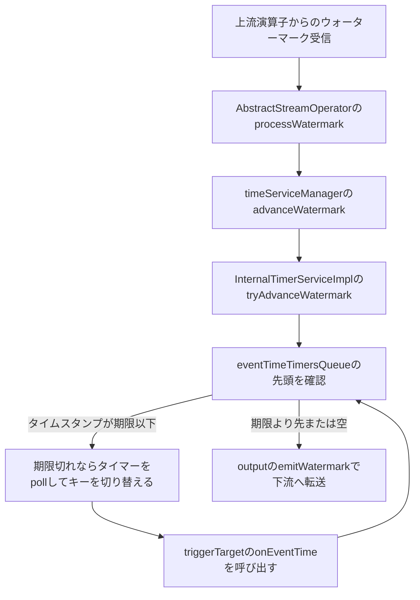

# 第15章 ウォーターマークとタイマー

> **本章で読むソース**
>
> - [`TimestampsAndWatermarksOperator.java`](https://github.com/apache/flink/blob/release-2.3.0/flink-runtime/src/main/java/org/apache/flink/streaming/runtime/operators/TimestampsAndWatermarksOperator.java)
> - [`WatermarkGenerator.java`](https://github.com/apache/flink/blob/release-2.3.0/flink-core/src/main/java/org/apache/flink/api/common/eventtime/WatermarkGenerator.java)
> - [`InternalTimeServiceManager.java`](https://github.com/apache/flink/blob/release-2.3.0/flink-runtime/src/main/java/org/apache/flink/streaming/api/operators/InternalTimeServiceManager.java)
> - [`InternalTimeServiceManagerImpl.java`](https://github.com/apache/flink/blob/release-2.3.0/flink-runtime/src/main/java/org/apache/flink/streaming/api/operators/InternalTimeServiceManagerImpl.java)
> - [`InternalTimerServiceImpl.java`](https://github.com/apache/flink/blob/release-2.3.0/flink-runtime/src/main/java/org/apache/flink/streaming/api/operators/InternalTimerServiceImpl.java)
> - [`AbstractStreamOperator.java`](https://github.com/apache/flink/blob/release-2.3.0/flink-runtime/src/main/java/org/apache/flink/streaming/api/operators/AbstractStreamOperator.java)

## この章の狙い

第14章では、演算子が `processElement` でレコードを1件ずつ処理する様子と、ユーザー関数がそこにどう組み込まれるかを見た。

ストリーム処理では、レコードの処理と並んでもう一つの時間軸が動いている。

イベントに埋め込まれたタイムスタンプが、いつまで遡って到着しうるかを示す**ウォーターマーク**と、その時刻が来たら発火する**タイマー**である。

本章では、ウォーターマークを生成する `TimestampsAndWatermarksOperator` から始め、演算子のあいだをウォーターマークが伝播する経路、そしてタイマーを管理する `InternalTimerServiceImpl` がウォーターマークの前進をきっかけに期限切れのタイマーを取り出して発火させる仕組みまでを読む。

## 前提

Flink のレコードは、送信側が付与した処理時刻とは別に、アプリケーションが定義するイベント時刻を持てる。

イベント時刻を使う演算子は、あるレコードの到着を待たずに集計を締め切ってよいタイミングを、レコード自体からは判断できない。

この判断材料として流れる特殊なマーカーがウォーターマークであり、「このタイムスタンプ以下のレコードはもう来ない」という見込みを表す。

タイマーは、ウォーターマークまたは処理時刻がある時刻に達したときにコールバックを起こす仕組みであり、ウィンドウの締め切りやセッションのタイムアウトなど、キーごとの状態と結びついた処理に使われる。

キー付き状態については第19章で扱う。

本章はタイマーがどのキーに属するかを前提として進めるが、状態バックエンドそのものの実装には立ち入らない。

## ウォーターマークを生成する TimestampsAndWatermarksOperator

イベント時刻とウォーターマークは、ソースに近い位置に挿入される専用の演算子 `TimestampsAndWatermarksOperator` が担う。

コンストラクタは `WatermarkStrategy` を受け取って保持するだけであり、実際にタイムスタンプ抽出器とウォーターマーク生成器を作るのは `open` である。

[`TimestampsAndWatermarksOperator.java` L85-L120](https://github.com/apache/flink/blob/release-2.3.0/flink-runtime/src/main/java/org/apache/flink/streaming/runtime/operators/TimestampsAndWatermarksOperator.java#L85-L120)

```java
    @Override
    public void open() throws Exception {
        super.open();
        inputActivityClock = new PausableRelativeClock(getProcessingTimeService().getClock());
        getContainingTask()
                .getEnvironment()
                .getMetricGroup()
                .getIOMetricGroup()
                .registerBackPressureListener(inputActivityClock);

        timestampAssigner = watermarkStrategy.createTimestampAssigner(this::getMetricGroup);
        watermarkGenerator =
                emitProgressiveWatermarks
                        ? watermarkStrategy.createWatermarkGenerator(
                                new WatermarkGeneratorSupplier.Context() {
                                    @Override
                                    public MetricGroup getMetricGroup() {
                                        return TimestampsAndWatermarksOperator.this
                                                .getMetricGroup();
                                    }

                                    @Override
                                    public RelativeClock getInputActivityClock() {
                                        return inputActivityClock;
                                    }
                                })
                        : new NoWatermarksGenerator<>();

        wmOutput = new WatermarkEmitter(output);

        watermarkInterval = getExecutionConfig().getAutoWatermarkInterval();
        if (watermarkInterval > 0 && emitProgressiveWatermarks) {
            final long now = getProcessingTimeService().getCurrentProcessingTime();
            getProcessingTimeService().registerTimer(now + watermarkInterval, this);
        }
    }
```

`watermarkInterval` が正であれば、演算子自身が処理時刻タイマーを自分に登録し、一定間隔でウォーターマークの発行機会を作る。

このタイマーは後述する `InternalTimerServiceImpl` ではなく `ProcessingTimeService` に直接登録される点に注意する。

`TimestampsAndWatermarksOperator` はキーに紐づかない演算子であり、キー付きタイマーの仕組みを必要としないためである。

レコードが到着するたびに呼ばれる `processElement` は、タイムスタンプの割り当てとウォーターマーク生成器への通知を行う。

[`TimestampsAndWatermarksOperator.java` L132-L150](https://github.com/apache/flink/blob/release-2.3.0/flink-runtime/src/main/java/org/apache/flink/streaming/runtime/operators/TimestampsAndWatermarksOperator.java#L132-L150)

```java
    @Override
    public void processElement(final StreamRecord<T> element) throws Exception {
        final T event = element.getValue();
        final long previousTimestamp =
                element.hasTimestamp() ? element.getTimestamp() : Long.MIN_VALUE;
        final long newTimestamp = timestampAssigner.extractTimestamp(event, previousTimestamp);

        element.setTimestamp(newTimestamp);
        output.collect(element);
        watermarkGenerator.onEvent(event, newTimestamp, wmOutput);
    }

    @Override
    public void onProcessingTime(long timestamp) throws Exception {
        watermarkGenerator.onPeriodicEmit(wmOutput);

        final long now = getProcessingTimeService().getCurrentProcessingTime();
        getProcessingTimeService().registerTimer(now + watermarkInterval, this);
    }
```

レコードはタイムスタンプを付け替えた後、まず下流へ送られる。

ウォーターマーク生成器への通知はその後であり、`onEvent` の呼び出しがレコードの転送を遅らせることはない。

`WatermarkGenerator` インターフェースは `onEvent` と `onPeriodicEmit` の2つのコールバックだけを持つ。

[`WatermarkGenerator.java` L32-L47](https://github.com/apache/flink/blob/release-2.3.0/flink-core/src/main/java/org/apache/flink/api/common/eventtime/WatermarkGenerator.java#L32-L47)

```java
public interface WatermarkGenerator<T> {

    /**
     * Called for every event, allows the watermark generator to examine and remember the event
     * timestamps, or to emit a watermark based on the event itself.
     */
    void onEvent(T event, long eventTimestamp, WatermarkOutput output);

    /**
     * Called periodically, and might emit a new watermark, or not.
     *
     * <p>The interval in which this method is called and Watermarks are generated depends on {@link
     * ExecutionConfig#getAutoWatermarkInterval()}.
     */
    void onPeriodicEmit(WatermarkOutput output);
}
```

`onEvent` はレコードごとの punctuated 方式、`onProcessingTime` から呼ばれる `onPeriodicEmit` は一定間隔の periodic 方式に対応する。

実装クラスはこの2つのコールバックのどちらか、または両方でウォーターマークを計算し `WatermarkOutput` へ渡す。

Javadoc のコメントが述べるとおり、この1つのインターフェースが旧来の `AssignerWithPunctuatedWatermarks` と `AssignerWithPeriodicWatermarks` の区別を吸収している。

## ウォーターマークが後退しない仕組み

ウォーターマーク生成器が計算した値は、`WatermarkOutput` の実装である `WatermarkEmitter` を経て下流へ送られる。

[`TimestampsAndWatermarksOperator.java` L182-L224](https://github.com/apache/flink/blob/release-2.3.0/flink-runtime/src/main/java/org/apache/flink/streaming/runtime/operators/TimestampsAndWatermarksOperator.java#L182-L224)

```java
    public static final class WatermarkEmitter implements WatermarkOutput {

        private final Output<?> output;

        private long currentWatermark;

        private boolean idle;

        public WatermarkEmitter(Output<?> output) {
            this.output = output;
            this.currentWatermark = Long.MIN_VALUE;
        }

        @Override
        public void emitWatermark(Watermark watermark) {
            final long ts = watermark.getTimestamp();

            if (ts <= currentWatermark) {
                return;
            }

            currentWatermark = ts;

            markActive();

            output.emitWatermark(new org.apache.flink.streaming.api.watermark.Watermark(ts));
        }
```

`emitWatermark` は、渡された時刻が現在保持している `currentWatermark` 以下であれば何もせず捨てる。

ウォーターマーク生成器の実装が誤って過去の時刻を返しても、演算子から出ていくウォーターマークは単調に増加する値だけになる。

ウォーターマークは「これ以下のイベント時刻はもう来ない」という下限の見込みなので、後退を許すと下流で締め切ったウィンドウを覆せなくなる。

これを演算子側の1行の比較で機械的に防いでいる点が、この仕組みの単純さである。

## ウォーターマークの伝播と InternalTimeServiceManager

`AbstractStreamOperator` は、上流から受け取ったウォーターマークを自分のタイマー管理へ反映してから下流へ転送する。

[`AbstractStreamOperator.java` L690-L703](https://github.com/apache/flink/blob/release-2.3.0/flink-runtime/src/main/java/org/apache/flink/streaming/api/operators/AbstractStreamOperator.java#L690-L703)

```java
    public void processWatermark(Watermark mark) throws Exception {
        if (watermarkProcessor != null) {
            watermarkProcessor.emitWatermarkInsideMailbox(mark);
        } else {
            emitWatermarkDirectly(mark);
        }
    }

    private void emitWatermarkDirectly(Watermark mark) throws Exception {
        if (timeServiceManager != null) {
            timeServiceManager.advanceWatermark(mark);
        }
        output.emitWatermark(mark);
    }
```

`timeServiceManager.advanceWatermark(mark)` が先に呼ばれ、`output.emitWatermark(mark)` による下流への転送はその後である。

この順序により、ある演算子でウォーターマークが到達したときに発火すべきタイマー（`onTimer` を呼ぶユーザー関数など)は、そのウォーターマークが次の演算子へ伝わる前に処理される。

`timeServiceManager` の型は `InternalTimeServiceManager` であり、キー付き演算子だけが持つ。

[`InternalTimeServiceManager.java` L55-L71](https://github.com/apache/flink/blob/release-2.3.0/flink-runtime/src/main/java/org/apache/flink/streaming/api/operators/InternalTimeServiceManager.java#L55-L71)

```java
    <N> InternalTimerService<N> getInternalTimerService(
            String name,
            TypeSerializer<K> keySerializer,
            TypeSerializer<N> namespaceSerializer,
            Triggerable<K, N> triggerable);

    /**
     * Advances the Watermark of all managed {@link InternalTimerService timer services},
     * potentially firing event time timers.
     */
    void advanceWatermark(Watermark watermark) throws Exception;
```

`getInternalTimerService` は、演算子が名前とネームスペースのシリアライザ、そしてタイマー発火時に呼ばれる `Triggerable` を渡してタイマーサービスを取得するための入口である。

同じ名前で呼び出せば、既存のタイマーサービスがそのまま返る。

`advanceWatermark` は、1つの演算子が内部に持つすべてのタイマーサービスへウォーターマークを配る。

実装クラス `InternalTimeServiceManagerImpl` では、管理下の `InternalTimerServiceImpl` を1つずつ回すだけの単純な処理になっている。

[`InternalTimeServiceManagerImpl.java` L211-L216](https://github.com/apache/flink/blob/release-2.3.0/flink-runtime/src/main/java/org/apache/flink/streaming/api/operators/InternalTimeServiceManagerImpl.java#L211-L216)

```java
    @Override
    public void advanceWatermark(Watermark watermark) throws Exception {
        for (InternalTimerServiceImpl<?, ?> service : timerServices.values()) {
            service.advanceWatermark(watermark.getTimestamp());
        }
    }
```

1つの演算子が複数の `InternalTimerService` を持てるのは、例えば1つの演算子の中で複数の種類のタイマー（異なるウィンドウ演算など)を名前で区別して管理する場合があるためである。

## タイマーの登録とキーごとの管理

タイマーの登録と発火は `InternalTimerServiceImpl` が担う。

このクラスは処理時刻タイマー用と、イベント時刻タイマー用の2つの優先度付きキューを持つ。

[`InternalTimerServiceImpl.java` L52-L58](https://github.com/apache/flink/blob/release-2.3.0/flink-runtime/src/main/java/org/apache/flink/streaming/api/operators/InternalTimerServiceImpl.java#L52-L58)

```java
    /** Processing time timers that are currently in-flight. */
    protected final KeyGroupedInternalPriorityQueue<TimerHeapInternalTimer<K, N>>
            processingTimeTimersQueue;

    /** Event time timers that are currently in-flight. */
    protected final KeyGroupedInternalPriorityQueue<TimerHeapInternalTimer<K, N>>
            eventTimeTimersQueue;
```

タイマーの登録はキーと名前空間を伴う。

[`InternalTimerServiceImpl.java` L232-L252](https://github.com/apache/flink/blob/release-2.3.0/flink-runtime/src/main/java/org/apache/flink/streaming/api/operators/InternalTimerServiceImpl.java#L232-L252)

```java
    @Override
    public void registerProcessingTimeTimer(N namespace, long time) {
        InternalTimer<K, N> oldHead = processingTimeTimersQueue.peek();
        if (processingTimeTimersQueue.add(
                new TimerHeapInternalTimer<>(time, (K) keyContext.getCurrentKey(), namespace))) {
            long nextTriggerTime = oldHead != null ? oldHead.getTimestamp() : Long.MAX_VALUE;
            // check if we need to re-schedule our timer to earlier
            if (time < nextTriggerTime) {
                if (nextTimer != null) {
                    nextTimer.cancel(false);
                }
                nextTimer = processingTimeService.registerTimer(time, this::onProcessingTime);
            }
        }
    }

    @Override
    public void registerEventTimeTimer(N namespace, long time) {
        eventTimeTimersQueue.add(
                new TimerHeapInternalTimer<>(time, (K) keyContext.getCurrentKey(), namespace));
    }
```

登録されるタイマーは `keyContext.getCurrentKey()` が返す現在処理中のキーを埋め込んだ `TimerHeapInternalTimer` としてキューへ積まれる。

`registerProcessingTimeTimer` を呼ぶとき、演算子は必ずそのレコードのキーへ状態がスコープされた状態になっている（第14章の `processElement` 呼び出し前にキーコンテキストが設定される)。

このため、あるタイマーが発火したときに `keyContext.setCurrentKey` でそのタイマーのキーへ切り替えれば、タイマーに紐づくキー付き状態へ正しくアクセスできる。

処理時刻タイマーの登録では、キューの先頭より早い時刻であれば `ProcessingTimeService` へ再登録し直す。

キューに複数のタイマーが積まれていても、実際にスケジューラへ登録される `ScheduledFuture` は常に1つだけであり、それが指すのはキュー先頭、つまり最も早く発火すべきタイマーである。

## advanceWatermark による期限切れタイマーの発火

イベント時刻タイマーの発火は、ウォーターマークが進んだときに `advanceWatermark` から呼ばれる `tryAdvanceWatermark` が行う。

[`InternalTimerServiceImpl.java` L328-L347](https://github.com/apache/flink/blob/release-2.3.0/flink-runtime/src/main/java/org/apache/flink/streaming/api/operators/InternalTimerServiceImpl.java#L328-L347)

```java
    public boolean tryAdvanceWatermark(
            long time, InternalTimeServiceManager.ShouldStopAdvancingFn shouldStopAdvancingFn)
            throws Exception {
        currentWatermark = time;
        InternalTimer<K, N> timer;
        boolean interrupted = false;
        while ((timer = eventTimeTimersQueue.peek()) != null
                && timer.getTimestamp() <= time
                && !cancellationContext.isCancelled()
                && !interrupted) {
            keyContext.setCurrentKey(timer.getKey());
            eventTimeTimersQueue.poll();
            triggerTarget.onEventTime(timer);
            taskIOMetricGroup.getNumFiredTimers().inc();
            // Check if we should stop advancing after at least one iteration to guarantee progress
            // and prevent a potential starvation.
            interrupted = shouldStopAdvancingFn.test();
        }
        return !interrupted;
    }
```

ループは `eventTimeTimersQueue` の先頭を覗き見て、そのタイムスタンプが新しいウォーターマーク以下である限り取り出し続ける。

取り出す前に `keyContext.setCurrentKey(timer.getKey())` でタイマーが属するキーへ切り替えてから `triggerTarget.onEventTime(timer)` を呼ぶので、コールバック先はそのキーの状態を安全に読み書きできる。

`triggerTarget` は `Triggerable` インターフェースを実装するオブジェクトであり、ウィンドウ演算子などが `onEventTime` と `onProcessingTime` を実装してタイマー発火時の処理（多くはユーザー定義の `onTimer`）を行う。

処理時刻タイマーの発火も、`onProcessingTime` が同じ形でキューを先頭から取り出す点は変わらない。

[`InternalTimerServiceImpl.java` L291-L312](https://github.com/apache/flink/blob/release-2.3.0/flink-runtime/src/main/java/org/apache/flink/streaming/api/operators/InternalTimerServiceImpl.java#L291-L312)

```java
    void onProcessingTime(long time) throws Exception {
        // null out the timer in case the Triggerable calls registerProcessingTimeTimer()
        // inside the callback.
        nextTimer = null;

        InternalTimer<K, N> timer;

        while ((timer = processingTimeTimersQueue.peek()) != null
                && timer.getTimestamp() <= time
                && !cancellationContext.isCancelled()) {
            keyContext.setCurrentKey(timer.getKey());
            processingTimeTimersQueue.poll();
            triggerTarget.onProcessingTime(timer);
            taskIOMetricGroup.getNumFiredTimers().inc();
        }

        if (timer != null && nextTimer == null) {
            nextTimer =
                    processingTimeService.registerTimer(
                            timer.getTimestamp(), this::onProcessingTime);
        }
    }
```

処理時刻の場合は `ProcessingTimeService` からのコールバック自体が「登録した時刻に達した」ことの通知なので、ループを終えた後にキューへ残ったタイマーがあれば次の発火に向けて改めてスケジュールし直す。

イベント時刻の場合はこの再スケジュールが要らない。

次にウォーターマークが進んだときに `tryAdvanceWatermark` が再び呼ばれ、その時点のキュー先頭を見るだけで足りるためである。

## 優先度付きキューによる効率化

`processingTimeTimersQueue` と `eventTimeTimersQueue` はどちらも `KeyGroupedInternalPriorityQueue` であり、内部はヒープによる優先度付きキューとして実装されている。

`TimerHeapInternalTimer` はタイムスタンプで順序づけられる `HeapPriorityQueueElement` を実装しており、キューの先頭は常に最も早く発火すべきタイマーになる。

[`TimerHeapInternalTimer.java` L34-L35](https://github.com/apache/flink/blob/release-2.3.0/flink-runtime/src/main/java/org/apache/flink/streaming/api/operators/TimerHeapInternalTimer.java#L34-L35)

```java
public final class TimerHeapInternalTimer<K, N>
        implements InternalTimer<K, N>, HeapPriorityQueueElement {
```

`advanceWatermark` と `onProcessingTime` のループが `peek` と `poll` だけで期限切れタイマーを取り出せているのは、この優先度付きキューの構造による。

タイマーの登録件数がどれだけ多くても、期限切れかどうかの判定はキュー先頭の1件を見るだけで済み、期限切れでなくなった時点でループはただちに止まる。

線形走査で全タイマーを毎回チェックする実装であれば、ウォーターマークが進むたびに登録件数に比例したコストがかかるが、ヒープを使うことで実際に発火するタイマーの件数ぶんの取り出し操作、つまり `O(発火件数 log 総件数)` に抑えられる。

大量のキーにまたがるウィンドウやタイムアウトを扱うジョブほど、この差は効いてくる。

## ウォーターマーク伝播からタイマー発火までの流れ

ここまでの経路を1つの図にまとめる。



ウォーターマークはまず自分の演算子が持つタイマーをすべて発火させ切ってから、次の演算子へ渡る。

これにより、あるウィンドウの締め切りがウォーターマークの通過と同じタイミングで確定し、後続の演算子はすでに締め切られた状態だけを受け取ることになる。

## まとめ

`TimestampsAndWatermarksOperator` は、`TimestampAssigner` でレコードにイベント時刻を刻みつつ、`WatermarkGenerator` の `onEvent` と `onPeriodicEmit` を通じてウォーターマークを計算する。

計算されたウォーターマークは `WatermarkEmitter` が単調増加であることを保証してから下流へ送る。

各演算子は `AbstractStreamOperator.processWatermark` で、下流への転送に先立って `InternalTimeServiceManager.advanceWatermark` を呼び、自分のキーごとのタイマーを処理する。

`InternalTimerServiceImpl` は処理時刻とイベント時刻それぞれに優先度付きキューを持ち、`tryAdvanceWatermark` と `onProcessingTime` はキュー先頭を覗いては期限切れの分だけ取り出す形で `Triggerable` を呼び出す。

タイマーには登録時のキーが埋め込まれており、発火時に `keyContext` を切り替えることで、キー付き状態と結びついた処理を正しいスコープで実行できる。

## 関連する章

- [第14章 演算子とユーザー定義関数](14-operators-udf.md)
- [第19章 状態バックエンド](../part06-state-checkpoint/19-state-backend.md)
- [第1章 Flinkとは何か](../part00-overview/01-what-is-flink.md)
