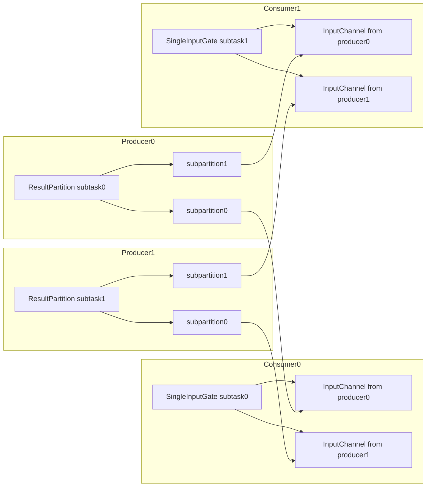

# 第16章 ResultPartition と InputGate

> **本章で読むソース**
>
> - [`ResultPartition.java`](https://github.com/apache/flink/blob/release-2.3.0/flink-runtime/src/main/java/org/apache/flink/runtime/io/network/partition/ResultPartition.java)
> - [`BufferWritingResultPartition.java`](https://github.com/apache/flink/blob/release-2.3.0/flink-runtime/src/main/java/org/apache/flink/runtime/io/network/partition/BufferWritingResultPartition.java)
> - [`PipelinedSubpartition.java`](https://github.com/apache/flink/blob/release-2.3.0/flink-runtime/src/main/java/org/apache/flink/runtime/io/network/partition/PipelinedSubpartition.java)
> - [`RecordWriter.java`](https://github.com/apache/flink/blob/release-2.3.0/flink-runtime/src/main/java/org/apache/flink/runtime/io/network/api/writer/RecordWriter.java)
> - [`ChannelSelectorRecordWriter.java`](https://github.com/apache/flink/blob/release-2.3.0/flink-runtime/src/main/java/org/apache/flink/runtime/io/network/api/writer/ChannelSelectorRecordWriter.java)
> - [`SingleInputGate.java`](https://github.com/apache/flink/blob/release-2.3.0/flink-runtime/src/main/java/org/apache/flink/runtime/io/network/partition/consumer/SingleInputGate.java)
> - [`LocalInputChannel.java`](https://github.com/apache/flink/blob/release-2.3.0/flink-runtime/src/main/java/org/apache/flink/runtime/io/network/partition/consumer/LocalInputChannel.java)
> - [`RemoteInputChannel.java`](https://github.com/apache/flink/blob/release-2.3.0/flink-runtime/src/main/java/org/apache/flink/runtime/io/network/partition/consumer/RemoteInputChannel.java)

## この章の狙い

第9章では、`ExecutionGraph` の中で頂点間のデータ交換が `IntermediateResult` と `IntermediateResultPartition` によって表現されることを見た。

第13章では、`StreamTask` がレコードを1件ずつ演算子チェインへ流すループの構造を見た。

このチェインの末端で演算子が出力したレコードは、下流の並列サブタスクへ届ける必要がある。

本章では、生産側の `ResultPartition`（と実装クラス `BufferWritingResultPartition`、`PipelinedSubpartition`）が、演算子の出力レコードをどうサブパーティションへ振り分け、バッファへ詰めるかを読む。

続けて、消費側の `SingleInputGate` と `InputChannel`（`LocalInputChannel`、`RemoteInputChannel`）が、生産側のサブパーティションからバッファを受け取り、演算子へレコードを供給する流れを読む。

## 前提

ある `JobVertex` の1つのサブタスクは、下流の `JobVertex` の全サブタスクのうち、自分が担当する分だけへデータを送る。

この送り先は `ResultPartition` の中で **サブパーティション**（subpartition）という単位に分かれており、サブパーティションの数は下流の並列度と一致する。

受け取る側の1つのサブタスクは `SingleInputGate` を持ち、その内部には上流の各サブタスクに対応する `InputChannel` が1つずつ並ぶ。

`InputChannel` は、上流サブタスクが同じ `TaskManager` プロセス内にいれば `LocalInputChannel`、別プロセスにいれば `RemoteInputChannel` として実体化される。

`ResultPartition` の javadoc は、この関係を次のように述べている。

[`ResultPartition.java` L52-L64](https://github.com/apache/flink/blob/release-2.3.0/flink-runtime/src/main/java/org/apache/flink/runtime/io/network/partition/ResultPartition.java#L52-L64)

```java
/**
 * A result partition for data produced by a single task.
 *
 * <p>This class is the runtime part of a logical {@link IntermediateResultPartition}. Essentially,
 * a result partition is a collection of {@link Buffer} instances. The buffers are organized in one
 * or more {@link ResultSubpartition} instances or in a joint structure which further partition the
 * data depending on the number of consuming tasks and the data {@link DistributionPattern}.
 *
 * <p>Tasks, which consume a result partition have to request one of its subpartitions. The request
 * happens either remotely (see {@link RemoteInputChannel}) or locally (see {@link
 * LocalInputChannel})
 */
```

`ResultPartition` は抽象クラスであり、2.3.0 ではストリーミングで使う実装が `PipelinedResultPartition`、バッチのブロッキングシャッフルで使う実装が `BoundedBlockingResultPartition` などに分かれる。

[`ResultPartition.java` L78](https://github.com/apache/flink/blob/release-2.3.0/flink-runtime/src/main/java/org/apache/flink/runtime/io/network/partition/ResultPartition.java#L78)

```java
public abstract class ResultPartition implements ResultPartitionWriter {
```

このうち、バッファへの書き込みロジックそのものは `BufferWritingResultPartition` にまとめられており、`PipelinedResultPartition` はこれを継承する。

本章はストリーミングの経路、つまり `PipelinedResultPartition` と `PipelinedSubpartition` を中心に読む。

## 生産側: レコードをサブパーティションへ振り分ける

演算子の出力は `RecordWriter#emit` を通る。

チャネル選択のロジックを持つのは `ChannelSelectorRecordWriter` であり、`ChannelSelector`（`KeyGroupStreamPartitioner` などパーティショナーの実装）にレコードを渡して送り先のサブパーティション番号を決める。

[`ChannelSelectorRecordWriter.java` L54-L56](https://github.com/apache/flink/blob/release-2.3.0/flink-runtime/src/main/java/org/apache/flink/runtime/io/network/api/writer/ChannelSelectorRecordWriter.java#L54-L56)

```java
    public void emit(T record) throws IOException {
        emit(record, channelSelector.selectChannel(record));
    }
```

`emit(record, targetSubpartition)` は基底クラス `RecordWriter` にあり、レコードをシリアライズしたのち `ResultPartitionWriter#emitRecord` へ渡すだけである。

[`RecordWriter.java` L105-L113](https://github.com/apache/flink/blob/release-2.3.0/flink-runtime/src/main/java/org/apache/flink/runtime/io/network/api/writer/RecordWriter.java#L105-L113)

```java
    public void emit(T record, int targetSubpartition) throws IOException {
        checkErroneous();

        targetPartition.emitRecord(serializeRecord(serializer, record), targetSubpartition);

        if (flushAlways) {
            targetPartition.flush(targetSubpartition);
        }
    }
```

`emitRecord` の実体は `BufferWritingResultPartition` にある。

サブパーティションごとにシリアライズ済みのバイト列を書き込み用のバッファへ詰めていく。

[`BufferWritingResultPartition.java` L164-L182](https://github.com/apache/flink/blob/release-2.3.0/flink-runtime/src/main/java/org/apache/flink/runtime/io/network/partition/BufferWritingResultPartition.java#L164-L182)

```java
    @Override
    public void emitRecord(ByteBuffer record, int targetSubpartition) throws IOException {
        writtenBytesPerSubpartition[targetSubpartition] += record.remaining();

        BufferBuilder buffer = appendUnicastDataForNewRecord(record, targetSubpartition);

        while (record.hasRemaining()) {
            // full buffer, partial record
            finishUnicastBufferBuilder(targetSubpartition);
            buffer = appendUnicastDataForRecordContinuation(record, targetSubpartition);
        }

        if (buffer.isFull()) {
            // full buffer, full record
            finishUnicastBufferBuilder(targetSubpartition);
        }

        // partial buffer, full record
    }
```

1レコードのバイト列がバッファに収まりきらない場合はバッファを閉じて次のバッファへ続きを書く（`while` ループ）が、収まる場合はバッファを閉じずに保持し続け、次のレコードの書き込みへ引き継ぐ点に注目したい。

これは後述する最適化と直結する。

`ResultPartition` はサブパーティションの配列を持ち、`targetSubpartition` はその配列の添字に対応する。

[`BufferWritingResultPartition.java` L54-L55](https://github.com/apache/flink/blob/release-2.3.0/flink-runtime/src/main/java/org/apache/flink/runtime/io/network/partition/BufferWritingResultPartition.java#L54-L55)

```java
    /** The subpartitions of this partition. At least one. */
    protected final ResultSubpartition[] subpartitions;
```

書き終えたバッファは `addToSubpartition` を通じて該当する `ResultSubpartition`（`PipelinedSubpartition`）のキューへ積まれる。

[`BufferWritingResultPartition.java` L354-L359](https://github.com/apache/flink/blob/release-2.3.0/flink-runtime/src/main/java/org/apache/flink/runtime/io/network/partition/BufferWritingResultPartition.java#L354-L359)

```java
    protected int addToSubpartition(
            int targetSubpartition, BufferConsumer bufferConsumer, int partialRecordLength)
            throws IOException {
        writtenBytesPerSubpartition[targetSubpartition] += bufferConsumer.getWrittenBytes();
        return subpartitions[targetSubpartition].add(bufferConsumer, partialRecordLength);
    }
```

## PipelinedSubpartition: バッファのキューと通知

`PipelinedSubpartition` は、1度しか消費できないインメモリのキューである。

javadoc は、キューへの追加が消費側への通知をどう引き起こすかを説明している。

[`PipelinedSubpartition.java` L53-L69](https://github.com/apache/flink/blob/release-2.3.0/flink-runtime/src/main/java/org/apache/flink/runtime/io/network/partition/PipelinedSubpartition.java#L53-L69)

```java
/**
 * A pipelined in-memory only subpartition, which can be consumed once.
 *
 * <p>Whenever {@link ResultSubpartition#add(BufferConsumer)} adds a finished {@link BufferConsumer}
 * or a second {@link BufferConsumer} (in which case we will assume the first one finished), we will
 * {@link PipelinedSubpartitionView#notifyDataAvailable() notify} a read view created via {@link
 * ResultSubpartition#createReadView(BufferAvailabilityListener)} of new data availability. Except
 * by calling {@link #flush()} explicitly, we always only notify when the first finished buffer
 * turns up and then, the reader has to drain the buffers via {@link #pollBuffer()} until its return
 * value shows no more buffers being available. This results in a buffer queue which is either empty
 * or has an unfinished {@link BufferConsumer} left from which the notifications will eventually
 * start again.
 *
 * <p>Explicit calls to {@link #flush()} will force this {@link
 * PipelinedSubpartitionView#notifyDataAvailable() notification} for any {@link BufferConsumer}
 * present in the queue.
 */
```

`add` は内部で `synchronized (buffers)` によりキューを保護しつつ、通知が必要かどうかを判定してからロックの外で通知する。

[`PipelinedSubpartition.java` L172-L199](https://github.com/apache/flink/blob/release-2.3.0/flink-runtime/src/main/java/org/apache/flink/runtime/io/network/partition/PipelinedSubpartition.java#L172-L199)

```java
    private int add(BufferConsumer bufferConsumer, int partialRecordLength, boolean finish) {
        checkNotNull(bufferConsumer);

        final boolean notifyDataAvailable;
        int prioritySequenceNumber = DEFAULT_PRIORITY_SEQUENCE_NUMBER;
        int newBufferSize;
        synchronized (buffers) {
            if (isFinished || isReleased) {
                bufferConsumer.close();
                return ADD_BUFFER_ERROR_CODE;
            }

            // Add the bufferConsumer and update the stats
            if (addBuffer(bufferConsumer, partialRecordLength)) {
                prioritySequenceNumber = sequenceNumber;
            }
            updateStatistics(bufferConsumer);
            increaseBuffersInBacklog(bufferConsumer);
            notifyDataAvailable = finish || shouldNotifyDataAvailable();

            isFinished |= finish;
            newBufferSize = bufferSize;
        }

        notifyPriorityEvent(prioritySequenceNumber);
        if (notifyDataAvailable) {
            notifyDataAvailable();
        }

        return newBufferSize;
    }
```

生産側から見ると、サブタスクが出したレコードは「サブパーティション選択」「バッファへの詰め込み」「キューへの追加と通知」という3段階を経て、下流サブタスクの1つが読み取れる状態になる。

## 消費側: SingleInputGate と InputChannel

`SingleInputGate` は1つの `IntermediateResult` を消費するゲートであり、上流の各サブタスクに対応する `InputChannel` を配列で保持する。

[`SingleInputGate.java` L128, L158](https://github.com/apache/flink/blob/release-2.3.0/flink-runtime/src/main/java/org/apache/flink/runtime/io/network/partition/consumer/SingleInputGate.java#L128-L158)

```java
public class SingleInputGate extends IndexedInputGate {
    // ... (中略)
    @GuardedBy("requestLock")
    private final InputChannel[] channels;
```

演算子が入力を1件求めるとき、`StreamTask`（第13章）側の `InputProcessor` は `SingleInputGate#getNext` を呼ぶ。

`getNext` は `getNextBufferOrEvent` を経て `waitAndGetNextData` に到達し、ここでデータが到着している `InputChannel` を1つ選んでバッファを取り出す。

[`SingleInputGate.java` L898-L942 抜粋](https://github.com/apache/flink/blob/release-2.3.0/flink-runtime/src/main/java/org/apache/flink/runtime/io/network/partition/consumer/SingleInputGate.java#L898-L942)

```java
    private Optional<InputWithData<InputChannel, Buffer>> waitAndGetNextData(boolean blocking)
            throws IOException, InterruptedException {
        while (true) {
            synchronized (inputChannelsWithData) {
                Optional<InputChannel> inputChannelOpt = getChannel(blocking);
                if (!inputChannelOpt.isPresent()) {
                    return Optional.empty();
                }

                final InputChannel inputChannel = inputChannelOpt.get();
                Optional<Buffer> buffer = readRecoveredOrNormalBuffer(inputChannel);
                if (!buffer.isPresent()) {
                    checkUnavailability();
                    continue;
                }
                // ... (中略、END_OF_DATA / END_OF_PARTITION の集約判定)
                checkUnavailability();
                return Optional.of(
                        new InputWithData<>(
                                inputChannel,
                                buffer.get(),
                                !inputChannelsWithData.isEmpty(),
                                morePriorityEvents));
            }
        }
    }
```

`inputChannelsWithData` は、バッファが届いた `InputChannel` だけを並べたキューであり、`SingleInputGate` は全チャネルを毎回ポーリングするのではなく、通知を受けたチャネルだけを順に処理する。

## ローカル経路: LocalInputChannel

上流と下流が同じ `TaskManager` プロセスに配置された場合、`LocalInputChannel` は `ResultPartitionManager` から直接 `ResultSubpartitionView` を取得する。

[`LocalInputChannel.java` L165-L192 抜粋](https://github.com/apache/flink/blob/release-2.3.0/flink-runtime/src/main/java/org/apache/flink/runtime/io/network/partition/consumer/LocalInputChannel.java#L165-L192)

```java
    protected void requestSubpartitions() throws IOException {
        // ... (中略、ロックとリトライ制御)
        if (subpartitionView == null) {
            // ... (中略)
            ResultSubpartitionView subpartitionView =
                    partitionManager.createSubpartitionView(
                            partitionId, consumedSubpartitionIndexSet, this);
            // ... (中略)
            this.subpartitionView = subpartitionView;
        }
        // ... (中略)
    }
```

`getNextBuffer` はこの `subpartitionView` からバッファを取り出すだけであり、シリアライズやネットワーク転送は一切介さない。

[`LocalInputChannel.java` L272-L284 抜粋](https://github.com/apache/flink/blob/release-2.3.0/flink-runtime/src/main/java/org/apache/flink/runtime/io/network/partition/consumer/LocalInputChannel.java#L272-L284)

```java
    public Optional<BufferAndAvailability> getNextBuffer() throws IOException {
        checkError();

        if (!toBeConsumedBuffers.isEmpty()) {
            return getNextRecoveredBuffer();
        }

        ResultSubpartitionView subpartitionView = this.subpartitionView;
        if (subpartitionView == null) {
            // ... (中略)
            subpartitionView = checkAndWaitForSubpartitionView();
        }

        BufferAndBacklog next = subpartitionView.getNextBuffer();
        // ... (中略)
    }
```

生産側の `PipelinedSubpartition` が保持するバッファのメモリを、消費側がコピーせずそのまま参照する経路であり、同一プロセス内でのデータ交換に余計なシリアライズやコピーを挟まない。

## リモート経路: RemoteInputChannel

上流と下流が別プロセスにある場合、`RemoteInputChannel` は Netty 経由で届いたバッファを `receivedBuffers` というキューに蓄積し、`getNextBuffer` はそこから取り出すだけになる。

[`RemoteInputChannel.java` L278-L312 抜粋](https://github.com/apache/flink/blob/release-2.3.0/flink-runtime/src/main/java/org/apache/flink/runtime/io/network/partition/consumer/RemoteInputChannel.java#L278-L312)

```java
    public Optional<BufferAndAvailability> getNextBuffer() throws IOException {
        final SequenceBuffer next;
        final DataType nextDataType;

        synchronized (receivedBuffers) {
            checkReadability();

            next = receivedBuffers.poll();
            // ... (中略)
        }

        if (next == null) {
            // ... (中略)
            return Optional.empty();
        }
        // ... (中略)
        return Optional.of(
                new BufferAndAvailability(next.buffer, nextDataType, 0, next.sequenceNumber));
    }
```

`LocalInputChannel` と `RemoteInputChannel` は、同じ `InputChannel` の抽象を実装しており、`SingleInputGate` から見ると呼び出し方はどちらも `getNextBuffer` の1点に揃っている。

生産側からバッファがどう届くか（メモリ参照かネットワーク経由か）という違いは、この2つのサブクラスの中に閉じ込められている。

## サブパーティションとチャネルが作る格子

上流サブタスクの数を M、下流サブタスクの数を N とすると、上流の各サブタスクは N 個のサブパーティションを持ち、下流の各サブタスクは M 個の `InputChannel` を持つ。

上流サブタスク i のサブパーティション j は、下流サブタスク j の `InputChannel`（上流サブタスク i に対応するもの）と1対1で結びつく。

これにより、M 個の生産側サブタスクと N 個の消費側サブタスクの間には M かける N のデータ交換経路が生まれる。



第8章と第9章で見た `DistributionPattern`（`POINTWISE` と `ALL_TO_ALL`）は、この格子の中でどの組み合わせに実際の接続を張るかを決める。

`ALL_TO_ALL` は上の図のようにすべての組み合わせを接続し、`POINTWISE` は対応する一部の組み合わせだけを接続する。

上流サブタスク間、下流サブタスク間の対応がどちらの経路（`LocalInputChannel` か `RemoteInputChannel` か）を通るかは、同じ `TaskManager` プロセスに配置されたかどうかで決まり、スケジューリング（第11章）の結果に依存する。

## この設計がなぜレコードごとのネットワーク往復を避けられるか

`emitRecord` の実装を見ると、1レコードごとにバッファを確保したり送信したりするのではなく、`BufferBuilder` を使ってバッファが埋まるかフラッシュが要求されるまで、複数のレコードを同じバッファへ詰め込み続ける。

[`BufferWritingResultPartition.java` L165-L182](https://github.com/apache/flink/blob/release-2.3.0/flink-runtime/src/main/java/org/apache/flink/runtime/io/network/partition/BufferWritingResultPartition.java#L165-L182)

```java
    @Override
    public void emitRecord(ByteBuffer record, int targetSubpartition) throws IOException {
        writtenBytesPerSubpartition[targetSubpartition] += record.remaining();

        BufferBuilder buffer = appendUnicastDataForNewRecord(record, targetSubpartition);
        // ... (中略、バッファが満杯なら閉じて次のバッファへ)
    }
```

`PipelinedSubpartition` への通知（`notifyDataAvailable`）も、レコード単位ではなく「未完了のバッファ列に最初の完了済みバッファが現れたとき」または明示的な `flush()` の呼び出し単位で発火する。

これにより、`LocalInputChannel` や `RemoteInputChannel` が読み取りやネットワーク送信を行う回数は、レコードの件数ではなくバッファの個数に比例する。

レコード1件ごとにキューへの追加、通知、ネットワーク送信を行う設計であれば、小さいレコードが大量に流れるストリーミングの負荷でオーバーヘッドが支配的になる。

バッファという単位でまとめて受け渡すことで、この往復コストをレコード件数から切り離し、バッファサイズとフラッシュ間隔の調整（第17章のクレジットベースフロー制御と関係する）でスループットとレイテンシのトレードオフを制御できるようにしている。

## まとめ

生産側では、`RecordWriter` が `ChannelSelector` の判定に従ってレコードの送り先サブパーティションを決め、`BufferWritingResultPartition#emitRecord` がそのバイト列を `BufferBuilder` を介してバッファへ詰め、`PipelinedSubpartition` のキューに積む。

キューへの追加は、最初の完了済みバッファが現れたときか明示的な `flush()` のときにだけ消費側へ通知される。

消費側では、`SingleInputGate` が通知を受けた `InputChannel` だけをキューから取り出して処理し、実際のバッファ取得は `LocalInputChannel`（メモリ参照）か `RemoteInputChannel`（Netty 経由のキュー）のどちらかに委ねる。

上流の並列度と下流の並列度が作るサブパーティションと `InputChannel` の格子は、`DistributionPattern` によってどの組み合わせを実際に接続するかが決まり、レコード単位ではなくバッファ単位でまとめて受け渡す設計が、ストリーミングにおけるネットワーク往復のオーバーヘッドを抑えている。

## 関連する章

- [第9章 ExecutionGraph の構築](../part02-graph/09-executiongraph.md)
- [第13章 StreamTask と mailbox 実行モデル](../part04-task-execution/13-streamtask-mailbox.md)
- [第17章 クレジットベースフロー制御とネットワークバッファ](17-credit-flow-buffers.md)
- [第18章 シャッフルサービス](18-shuffle-service.md)
