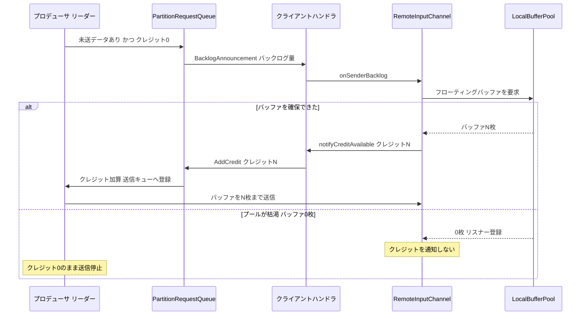

# 第17章 クレジットベースフロー制御とバッファ管理

> **本章で読むソース**
>
> - [`NetworkBufferPool.java`](https://github.com/apache/flink/blob/release-2.3.0/flink-runtime/src/main/java/org/apache/flink/runtime/io/network/buffer/NetworkBufferPool.java)
> - [`LocalBufferPool.java`](https://github.com/apache/flink/blob/release-2.3.0/flink-runtime/src/main/java/org/apache/flink/runtime/io/network/buffer/LocalBufferPool.java)
> - [`RemoteInputChannel.java`](https://github.com/apache/flink/blob/release-2.3.0/flink-runtime/src/main/java/org/apache/flink/runtime/io/network/partition/consumer/RemoteInputChannel.java)
> - [`CreditBasedPartitionRequestClientHandler.java`](https://github.com/apache/flink/blob/release-2.3.0/flink-runtime/src/main/java/org/apache/flink/runtime/io/network/netty/CreditBasedPartitionRequestClientHandler.java)
> - [`PartitionRequestQueue.java`](https://github.com/apache/flink/blob/release-2.3.0/flink-runtime/src/main/java/org/apache/flink/runtime/io/network/netty/PartitionRequestQueue.java)
> - [`CreditBasedSequenceNumberingViewReader.java`](https://github.com/apache/flink/blob/release-2.3.0/flink-runtime/src/main/java/org/apache/flink/runtime/io/network/netty/CreditBasedSequenceNumberingViewReader.java)

## この章の狙い

第16章では、`ResultPartition` がレコードをサブパーティションへ書き込み、`InputGate` が下流でそれを受け取る経路を読んだ。
この経路にはひとつの制御問題がある。
下流の演算子が処理に追いつかないとき、上流がレコードを送り続けると、送られたデータをどこかに滞留させなければならない。
本章は、その滞留を有界に保つ二つの機構を読む。

ひとつは、ネットワークで送受信するデータの入れ物であるネットワークバッファの管理である。
`NetworkBufferPool` と `LocalBufferPool` が、固定サイズのバッファプールをタスクへ貸し出し、返却を受け取る。
もうひとつは、クレジットベースフロー制御である。
下流が受信可能なバッファ数をクレジットとして上流へ通知し、上流はクレジットのある分だけを送る。
この二つが噛み合うことで、下流のバッファが尽きると上流の送信が自然に止まる、演算子単位のバックプレッシャーが実現する。

## 前提

Flink はレコードをシリアライズしてバイト列にし、固定サイズの区画へ詰めてネットワークへ流す。
この区画がネットワークバッファであり、実体は第3章で読んだ `MemorySegment` である。
プロデューサ側の `ResultSubpartition` も、コンシューマ側の `RemoteInputChannel` も、データを扱うにはまずバッファを1枚確保しなければならない。

バッファの総数はタスクマネージャの起動時に決まる固定量である。
無制限に確保できないため、確保できないときにどう振る舞うかが、そのままフロー制御の挙動になる。
コンシューマ側でバッファを確保できなければ、コンシューマは新しいデータを受け取れない。
この事実を上流へ伝える手段がクレジットであり、伝えないことによって送信を止めるのがバックプレッシャーである。

## NetworkBufferPool：固定サイズのグローバルプール

`NetworkBufferPool` は、ネットワークスタック全体が共有する `MemorySegment` の固定サイズプールである。
クラス冒頭のコメントは、その位置づけを次のように述べている。

[`NetworkBufferPool.java` L55-L62](https://github.com/apache/flink/blob/release-2.3.0/flink-runtime/src/main/java/org/apache/flink/runtime/io/network/buffer/NetworkBufferPool.java#L55-L62)

```java
/**
 * The NetworkBufferPool is a fixed size pool of {@link MemorySegment} instances for the network
 * stack.
 *
 * <p>The NetworkBufferPool creates {@link LocalBufferPool}s from which the individual tasks draw
 * the buffers for the network data transfer. When new local buffer pools are created, the
 * NetworkBufferPool dynamically redistributes the buffers between the pools.
 */
```

このプールは、コンストラクタで指定された枚数の `MemorySegment` を起動時に一括して確保する。

[`NetworkBufferPool.java` L125-L131](https://github.com/apache/flink/blob/release-2.3.0/flink-runtime/src/main/java/org/apache/flink/runtime/io/network/buffer/NetworkBufferPool.java#L125-L131)

```java
        try {
            for (int i = 0; i < numberOfSegmentsToAllocate; i++) {
                availableMemorySegments.add(
                        MemorySegmentFactory.allocateUnpooledOffHeapMemory(segmentSize, null));
            }
        } catch (OutOfMemoryError err) {
            int allocated = availableMemorySegments.size();
```

すべてのセグメントを先に確保しておくため、実行中にバッファを1枚要求するコストは、キューから1枚取り出すだけになる。

[`NetworkBufferPool.java` L274-L282](https://github.com/apache/flink/blob/release-2.3.0/flink-runtime/src/main/java/org/apache/flink/runtime/io/network/buffer/NetworkBufferPool.java#L274-L282)

```java
    private MemorySegment internalRequestMemorySegment() {
        assert Thread.holdsLock(availableMemorySegments);

        final MemorySegment segment = availableMemorySegments.poll();
        if (availableMemorySegments.isEmpty() && segment != null) {
            availabilityHelper.resetUnavailable();
        }
        return segment;
    }
```

`availableMemorySegments` が空になった瞬間に `availabilityHelper.resetUnavailable()` を呼び、プールが枯渇したことを可用性フラグへ反映する。
`poll()` は空なら `null` を返すため、要求側はブロックせずに枯渇を検知できる。
返却は逆にキューへ戻すだけである。

[`NetworkBufferPool.java` L186-L191](https://github.com/apache/flink/blob/release-2.3.0/flink-runtime/src/main/java/org/apache/flink/runtime/io/network/buffer/NetworkBufferPool.java#L186-L191)

```java
    public void recyclePooledMemorySegment(MemorySegment segment) {
        // Adds the segment back to the queue, which does not immediately free the memory
        // however, since this happens when references to the global pool are also released,
        // making the availableMemorySegments queue and its contained object reclaimable
        internalRecycleMemorySegments(Collections.singleton(checkNotNull(segment)));
    }
```

`NetworkBufferPool` から個々のタスク用のプールを切り出すのが `createBufferPool` である。

[`NetworkBufferPool.java` L452-L456](https://github.com/apache/flink/blob/release-2.3.0/flink-runtime/src/main/java/org/apache/flink/runtime/io/network/buffer/NetworkBufferPool.java#L452-L456)

```java
    @Override
    public BufferPool createBufferPool(int numRequiredBuffers, int maxUsedBuffers)
            throws IOException {
        return internalCreateBufferPool(
                numRequiredBuffers, maxUsedBuffers, 0, Integer.MAX_VALUE, 0);
    }
```

`numRequiredBuffers` は最低保証枚数、`maxUsedBuffers` は上限枚数である。
グローバルプールが有限のセグメントを複数のタスクで分け合うため、各タスクへは範囲を与え、その範囲内で動的に再配分する。

## LocalBufferPool：タスクへの貸し出しと待機

`LocalBufferPool` は、`NetworkBufferPool` からセグメントを引き出して、ひとつの `ResultPartition` または `InputGate` へ貸し出す層である。
バッファを要求する経路は、ブロックしない `requestMemorySegment` と、確保できるまで待つ `requestMemorySegmentBlocking` の二つに分かれる。

[`LocalBufferPool.java` L393-L400](https://github.com/apache/flink/blob/release-2.3.0/flink-runtime/src/main/java/org/apache/flink/runtime/io/network/buffer/LocalBufferPool.java#L393-L400)

```java
    @Nullable
    private MemorySegment requestMemorySegment(int targetChannel) {
        MemorySegment segment = null;
        synchronized (availableMemorySegments) {
            checkDestroyed();

            if (!availableMemorySegments.isEmpty()) {
                segment = availableMemorySegments.poll();
            } else if (isRequestedSizeReached()) {
```

手元の `availableMemorySegments` が空のとき、`requestMemorySegment` は `null` を返して呼び出し側へ枯渇を伝える。
このメソッドがどのタイミングでも `null` を返しうることが、フロー制御の起点になる。

書き込み側のようにバッファが得られるまで待ってよい経路は、`requestMemorySegmentBlocking` を使う。

[`LocalBufferPool.java` L377-L390](https://github.com/apache/flink/blob/release-2.3.0/flink-runtime/src/main/java/org/apache/flink/runtime/io/network/buffer/LocalBufferPool.java#L377-L390)

```java
    private MemorySegment requestMemorySegmentBlocking(int targetChannel)
            throws InterruptedException {
        MemorySegment segment;
        while ((segment = requestMemorySegment(targetChannel)) == null) {
            try {
                // wait until available
                getAvailableFuture().get();
            } catch (ExecutionException e) {
                LOG.error("The available future is completed exceptionally.", e);
                ExceptionUtils.rethrow(e);
            }
        }
        return segment;
    }
```

`requestMemorySegment` が `null` を返すあいだ、`getAvailableFuture()` が完了する（バッファが返却され利用可能になる）まで待つ。
スレッドをスピンさせず、可用性の `CompletableFuture` にスリープして待つ点が要点である。

返却は `recycle` が担う。
返ってきたセグメントは、待機している利用者があればそこへ回し、なければ手元のキューへ戻す。

[`LocalBufferPool.java` L579-L608](https://github.com/apache/flink/blob/release-2.3.0/flink-runtime/src/main/java/org/apache/flink/runtime/io/network/buffer/LocalBufferPool.java#L579-L608)

```java
    private void recycle(MemorySegment segment, int channel) {
        BufferListener listener;
        CompletableFuture<?> toNotify = null;
        do {
            synchronized (availableMemorySegments) {
                if (channel != UNKNOWN_CHANNEL) {
                    if (subpartitionBuffersCount[channel]-- == maxBuffersPerChannel) {
                        unavailableSubpartitionsCount--;
                    }
                }

                if (isDestroyed || hasExcessBuffers()) {
                    returnMemorySegment(segment);
                    return;
                } else {
                    listener = registeredListeners.poll();
                    if (listener == null) {
                        availableMemorySegments.add(segment);
                        if (!availabilityHelper.isApproximatelyAvailable() && shouldBeAvailable()) {
                            toNotify = availabilityHelper.getUnavailableToResetAvailable();
                        }
                        break;
                    }
                }

                checkConsistentAvailability();
            }
        } while (!fireBufferAvailableNotification(listener, segment));

        mayNotifyAvailable(toNotify);
```

返却時に登録済みの `BufferListener`（`registeredListeners`）があれば、キューへ戻さず直接そのリスナーへ渡す。
このリスナー機構が、コンシューマ側でフローティングバッファを待つ `RemoteInputChannel` へ、バッファの空きを非同期に通知する仕掛けになる。

## RemoteInputChannel のクレジット：exclusive と floating

`RemoteInputChannel` は、リモートのプロデューサからバッファを受け取るコンシューマ側の口である。
このチャネルは二種類のバッファを持つ。
ひとつは、チャネルへ固定的に割り当てる排他バッファ（exclusive buffer）であり、その枚数が初期クレジット `initialCredit` になる。

[`RemoteInputChannel.java` L156](https://github.com/apache/flink/blob/release-2.3.0/flink-runtime/src/main/java/org/apache/flink/runtime/io/network/partition/consumer/RemoteInputChannel.java#L156)

```java
        this.initialCredit = networkBuffersPerChannel;
```

チャネルの初期化時に、この枚数ぶんの排他バッファをまとめて確保する。

[`RemoteInputChannel.java` L201](https://github.com/apache/flink/blob/release-2.3.0/flink-runtime/src/main/java/org/apache/flink/runtime/io/network/partition/consumer/RemoteInputChannel.java#L201)

```java
        bufferManager.requestExclusiveBuffers(initialCredit);
```

もうひとつは、プールから動的に借りるフローティングバッファ（floating buffer）である。
排他バッファだけでは足りないとき、チャネルは `LocalBufferPool` からフローティングバッファを追加で借りようとする。

まだ上流へ通知していないクレジットの枚数は、`unannouncedCredit` が保持する。

[`RemoteInputChannel.java` L114](https://github.com/apache/flink/blob/release-2.3.0/flink-runtime/src/main/java/org/apache/flink/runtime/io/network/partition/consumer/RemoteInputChannel.java#L114)

```java
    private final AtomicInteger unannouncedCredit = new AtomicInteger(0);
```

`AtomicInteger` にしてあるのは、バッファを受信するネットワークスレッドとクレジットを送出するスレッドが、この値を別々に触るためである。

## 往復の構造：BacklogAnnouncement とクレジット通知

クレジットベースフロー制御の中心は、プロデューサとコンシューマのあいだで交わす2種類のメッセージである。
プロデューサは未送のデータ量（バックログ）を `BacklogAnnouncement` でコンシューマへ知らせる。
コンシューマはそれに応じてバッファを確保し、確保できた枚数をクレジットとしてプロデューサへ返す。

コンシューマ側でこの往復を始めるのが `onSenderBacklog` である。

[`RemoteInputChannel.java` L575-L583](https://github.com/apache/flink/blob/release-2.3.0/flink-runtime/src/main/java/org/apache/flink/runtime/io/network/partition/consumer/RemoteInputChannel.java#L575-L583)

```java
    /**
     * Receives the backlog from the producer's buffer response. If the number of available buffers
     * is less than backlog + initialCredit, it will request floating buffers from the buffer
     * manager, and then notify unannounced credits to the producer.
     *
     * @param backlog The number of unsent buffers in the producer's sub partition.
     */
    public void onSenderBacklog(int backlog) throws IOException {
        notifyBufferAvailable(bufferManager.requestFloatingBuffers(backlog + initialCredit));
    }
```

`onSenderBacklog` は、上流のバックログと初期クレジットの和を目標に、不足ぶんのフローティングバッファを `bufferManager` から要求する。
`requestFloatingBuffers` は、要求した枚数のうち実際に確保できた枚数を返す。

[`BufferManager.java` L164-L178](https://github.com/apache/flink/blob/release-2.3.0/flink-runtime/src/main/java/org/apache/flink/runtime/io/network/partition/consumer/BufferManager.java#L164-L178)

```java
    int requestFloatingBuffers(int numRequired) {
        int numRequestedBuffers = 0;
        synchronized (bufferQueue) {
            // Similar to notifyBufferAvailable(), make sure that we never add a buffer after
            // channel
            // released all buffers via releaseAllResources().
            if (inputChannel.isReleased()) {
                return numRequestedBuffers;
            }

            numRequiredBuffers = numRequired;
            numRequestedBuffers = tryRequestBuffers();
        }
        return numRequestedBuffers;
    }
```

`tryRequestBuffers` は `LocalBufferPool` へ1枚ずつ要求し、`null` が返ったら（プールが枯渇したら）リスナーとして自身を登録してループを抜ける。

[`BufferManager.java` L180-L197](https://github.com/apache/flink/blob/release-2.3.0/flink-runtime/src/main/java/org/apache/flink/runtime/io/network/partition/consumer/BufferManager.java#L180-L197)

```java
    private int tryRequestBuffers() {
        assert Thread.holdsLock(bufferQueue);

        int numRequestedBuffers = 0;
        while (bufferQueue.getAvailableBufferSize() < numRequiredBuffers
                && !isWaitingForFloatingBuffers) {
            BufferPool bufferPool = inputChannel.inputGate.getBufferPool();
            Buffer buffer = bufferPool.requestBuffer();
            if (buffer != null) {
                bufferQueue.addFloatingBuffer(buffer);
                numRequestedBuffers++;
            } else if (bufferPool.addBufferListener(this)) {
                isWaitingForFloatingBuffers = true;
                break;
            }
        }
        return numRequestedBuffers;
    }
```

確保できた枚数は `notifyBufferAvailable` を経て `unannouncedCredit` へ足し込まれる。

[`RemoteInputChannel.java` L451-L456](https://github.com/apache/flink/blob/release-2.3.0/flink-runtime/src/main/java/org/apache/flink/runtime/io/network/partition/consumer/RemoteInputChannel.java#L451-L456)

```java
    @Override
    public void notifyBufferAvailable(int numAvailableBuffers) throws IOException {
        if (numAvailableBuffers > 0 && unannouncedCredit.getAndAdd(numAvailableBuffers) == 0) {
            notifyCreditAvailable();
        }
    }
```

`getAndAdd` の戻り値が `0` のときだけ `notifyCreditAvailable` を呼ぶ。
未通知クレジットが `0` から正に転じた最初の一回だけ通知を起動し、以後の加算では起動しない。
これにより、クレジットが溜まっているあいだの重複した送出予約を避けている。

`notifyCreditAvailable` は、通知の送出を Netty のクライアントハンドラへ委ねる。

[`RemoteInputChannel.java` L398-L402](https://github.com/apache/flink/blob/release-2.3.0/flink-runtime/src/main/java/org/apache/flink/runtime/io/network/partition/consumer/RemoteInputChannel.java#L398-L402)

```java
    private void notifyCreditAvailable() throws IOException {
        checkPartitionRequestQueueInitialized();

        partitionRequestClient.notifyCreditAvailable(this);
    }
```

送出する枚数は `getAndResetUnannouncedCredit` が原子的に取り出してゼロに戻す。

[`RemoteInputChannel.java` L514-L516](https://github.com/apache/flink/blob/release-2.3.0/flink-runtime/src/main/java/org/apache/flink/runtime/io/network/partition/consumer/RemoteInputChannel.java#L514-L516)

```java
    public int getAndResetUnannouncedCredit() {
        return unannouncedCredit.getAndSet(0);
    }
```

## ハンドラでの送受信

コンシューマ側の `CreditBasedPartitionRequestClientHandler` は、プロデューサからのメッセージを読む役目と、クレジット通知をプロデューサへ書き出す役目を兼ねる。

[`CreditBasedPartitionRequestClientHandler.java` L55-L60](https://github.com/apache/flink/blob/release-2.3.0/flink-runtime/src/main/java/org/apache/flink/runtime/io/network/netty/CreditBasedPartitionRequestClientHandler.java#L55-L60)

```java
/**
 * Channel handler to read the messages of buffer response or error response from the producer, to
 * write and flush the unannounced credits for the producer.
 *
 * <p>It is used in the new network credit-based mode.
 */
```

プロデューサから `BacklogAnnouncement` を受け取ると、ハンドラは対応するチャネルの `onSenderBacklog` を呼ぶ。
これが前節のフローティングバッファ要求を起動する入口である。

[`CreditBasedPartitionRequestClientHandler.java` L341-L355](https://github.com/apache/flink/blob/release-2.3.0/flink-runtime/src/main/java/org/apache/flink/runtime/io/network/netty/CreditBasedPartitionRequestClientHandler.java#L341-L355)

```java
        } else if (msgClazz == NettyMessage.BacklogAnnouncement.class) {
            NettyMessage.BacklogAnnouncement announcement = (NettyMessage.BacklogAnnouncement) msg;

            RemoteInputChannel inputChannel = inputChannels.get(announcement.receiverId);
            if (inputChannel == null || inputChannel.isReleased()) {
                cancelRequestFor(announcement.receiverId);
                return;
            }

            try {
                inputChannel.onSenderBacklog(announcement.backlog);
            } catch (Throwable throwable) {
                inputChannel.onError(throwable);
            }
        } else {
```

逆方向のクレジット通知は、いったんハンドラ内のキュー `clientOutboundMessages` へ積み、キューが空だったときだけ書き出しを起動する。

[`CreditBasedPartitionRequestClientHandler.java` L209-L223](https://github.com/apache/flink/blob/release-2.3.0/flink-runtime/src/main/java/org/apache/flink/runtime/io/network/netty/CreditBasedPartitionRequestClientHandler.java#L209-L223)

```java
    @Override
    public void userEventTriggered(ChannelHandlerContext ctx, Object msg) throws Exception {
        if (msg instanceof ClientOutboundMessage) {
            boolean triggerWrite = clientOutboundMessages.isEmpty();

            clientOutboundMessages.add((ClientOutboundMessage) msg);

            if (triggerWrite) {
                writeAndFlushNextMessageIfPossible(ctx.channel());
            }
        } else if (msg instanceof ConnectionErrorMessage) {
            notifyAllChannelsOfErrorAndClose(((ConnectionErrorMessage) msg).getCause());
        } else {
            ctx.fireUserEventTriggered(msg);
        }
    }
```

## プロデューサ側：クレジット分だけ送る

プロデューサ側では、`PartitionRequestQueue` がクレジット付きの `AddCredit` メッセージを受け取り、リーダーへ加算する。

[`PartitionRequestQueue.java` L165-L175](https://github.com/apache/flink/blob/release-2.3.0/flink-runtime/src/main/java/org/apache/flink/runtime/io/network/netty/PartitionRequestQueue.java#L165-L175)

```java
    void addCreditOrResumeConsumption(
            InputChannelID receiverId, Consumer<NetworkSequenceViewReader> operation)
            throws Exception {
        if (fatalError) {
            return;
        }

        NetworkSequenceViewReader reader = obtainReader(receiverId);

        operation.accept(reader);
        enqueueAvailableReader(reader);
    }
```

サブパーティションを読むリーダー `CreditBasedSequenceNumberingViewReader` は、利用可能クレジット `numCreditsAvailable` を持つ。
`AddCredit` はこの値に受信したクレジットを加える。

[`CreditBasedSequenceNumberingViewReader.java` L148-L151](https://github.com/apache/flink/blob/release-2.3.0/flink-runtime/src/main/java/org/apache/flink/runtime/io/network/netty/CreditBasedSequenceNumberingViewReader.java#L148-L151)

```java
    @Override
    public void addCredit(int creditDeltas) {
        numCreditsAvailable += creditDeltas;
    }
```

リーダーが送信可能かどうかは、クレジットの有無で決まる。
`getAvailabilityAndBacklog` は、クレジットが正であることを送信可能の条件として渡す。

[`CreditBasedSequenceNumberingViewReader.java` L191-L194](https://github.com/apache/flink/blob/release-2.3.0/flink-runtime/src/main/java/org/apache/flink/runtime/io/network/netty/CreditBasedSequenceNumberingViewReader.java#L191-L194)

```java
    @Override
    public ResultSubpartitionView.AvailabilityWithBacklog getAvailabilityAndBacklog() {
        return subpartitionView.getAvailabilityAndBacklog(numCreditsAvailable > 0);
    }
```

`enqueueAvailableReader` は、この可用性を確かめてから振る舞いを分ける。
送信可能ならリーダーを送信キューへ登録し、送信不可でもバックログが残っていれば `announceBacklog` でバックログだけを知らせる。

[`PartitionRequestQueue.java` L109-L127](https://github.com/apache/flink/blob/release-2.3.0/flink-runtime/src/main/java/org/apache/flink/runtime/io/network/netty/PartitionRequestQueue.java#L109-L127)

```java
    private void enqueueAvailableReader(final NetworkSequenceViewReader reader) throws Exception {
        if (reader.isRegisteredAsAvailable()) {
            return;
        }

        ResultSubpartitionView.AvailabilityWithBacklog availabilityWithBacklog =
                reader.getAvailabilityAndBacklog();
        if (!availabilityWithBacklog.isAvailable()) {
            int backlog = availabilityWithBacklog.getBacklog();
            if (backlog > 0 && reader.needAnnounceBacklog()) {
                announceBacklog(reader, backlog);
            }
            return;
        }

        // Queue an available reader for consumption. If the queue is empty,
        // we try trigger the actual write. Otherwise this will be handled by
        // the writeAndFlushNextMessageIfPossible calls.
        boolean triggerWrite = availableReaders.isEmpty();
        registerAvailableReader(reader);
```

`announceBacklog` が送る `BacklogAnnouncement` が、コンシューマ側の `onSenderBacklog` を起動して往復を閉じる。

[`PartitionRequestQueue.java` L232-L238](https://github.com/apache/flink/blob/release-2.3.0/flink-runtime/src/main/java/org/apache/flink/runtime/io/network/netty/PartitionRequestQueue.java#L232-L238)

```java
    private void announceBacklog(NetworkSequenceViewReader reader, int backlog) {
        checkArgument(backlog > 0, "Backlog must be positive.");

        NettyMessage.BacklogAnnouncement announcement =
                new NettyMessage.BacklogAnnouncement(backlog, reader.getReceiverId());
        ctx.channel()
                .writeAndFlush(announcement)
```

実際にバッファを1枚送るたびに、リーダーはクレジットを1消費する。

[`CreditBasedSequenceNumberingViewReader.java` L254-L261](https://github.com/apache/flink/blob/release-2.3.0/flink-runtime/src/main/java/org/apache/flink/runtime/io/network/netty/CreditBasedSequenceNumberingViewReader.java#L254-L261)

```java
    @Override
    public BufferAndAvailability getNextBuffer() throws IOException {
        BufferAndBacklog next = subpartitionView.getNextBuffer();
        if (next != null) {
            if (next.buffer().isBuffer() && --numCreditsAvailable < 0) {
                throw new IllegalStateException("no credit available");
            }
```

クレジットが尽きて `0` になれば、`getAvailabilityAndBacklog` は送信不可を返し、リーダーは送信キューから外れる。
新しいクレジットが `AddCredit` で届くまで、そのサブパーティションからの送信は止まる。

## 全体の往復とバックプレッシャー

ここまでの往復を図にすると、次のようになる。



最適化として説明したいのは、この機構がバックプレッシャーを演算子単位で成立させる点である。
コンシューマの `LocalBufferPool` が枯渇すると、`requestFloatingBuffers` は0枚しか返さない。
0枚では `notifyBufferAvailable` の `numAvailableBuffers > 0` が成り立たず、`unannouncedCredit` は増えない。
クレジットが上流へ届かなければ、プロデューサ側のリーダーの `numCreditsAvailable` は `0` のままで、`getAvailabilityAndBacklog` が送信不可を返す。
その結果、そのサブパーティションからの送信だけが止まる。

この止まり方が、TCP のソケットバッファに頼る従来方式との違いを生む。
ソケットに頼る方式では、詰まった1本の TCP 接続に複数のサブパーティションが相乗りしているとき、詰まっていないサブパーティションのデータまで同じ接続の中で滞留する。
クレジットベースフロー制御は、送信可否をサブパーティションごとの `numCreditsAvailable` で判定するため、詰まったサブパーティションだけを止め、同じ接続を共有する他のサブパーティションの送信は続けられる。
バッファの枯渇という局所的な事実を、クレジットを通知しないという形でそのまま上流の送信停止へ変換することが、この設計の要点である。

そして、コンシューマがデータを処理してバッファを `recycle` で返却すると、`LocalBufferPool` は待機中のリスナーへバッファを渡し、`onSenderBacklog` が再び走ってクレジットが上流へ通知される。
下流が詰まれば止まり、下流が捌けば再開するという制御が、追加の合図なしにバッファの確保と返却だけで回る。

## まとめ

ネットワークバッファは、`NetworkBufferPool` が固定枚数の `MemorySegment` を起動時に確保し、`LocalBufferPool` がそれをタスクへ貸し出して返却を受け取る二層で管理される。
バッファ総数が有限であるため、確保できないという事実そのものがフロー制御の信号になる。

クレジットベースフロー制御は、プロデューサがバックログを `BacklogAnnouncement` で知らせ、コンシューマがバッファを確保できた枚数だけをクレジットとして返し、プロデューサがクレジットのある分だけを送るという往復で動く。
コンシューマの `LocalBufferPool` が枯渇するとクレジットが通知されず、プロデューサの送信がサブパーティション単位で止まる。
これが、TCP のソケットバッファに頼らず、詰まったサブパーティションだけを選んで止められるバックプレッシャーの実体である。

## 関連する章

- 第16章 [ResultPartition と InputGate](../part05-network/16-resultpartition-inputgate.md)
- 第3章 [メモリ管理：MemorySegment とマネージドメモリ](../part01-core/03-memory-segment.md)
- 第18章 [シャッフルサービス](18-shuffle-service.md)
