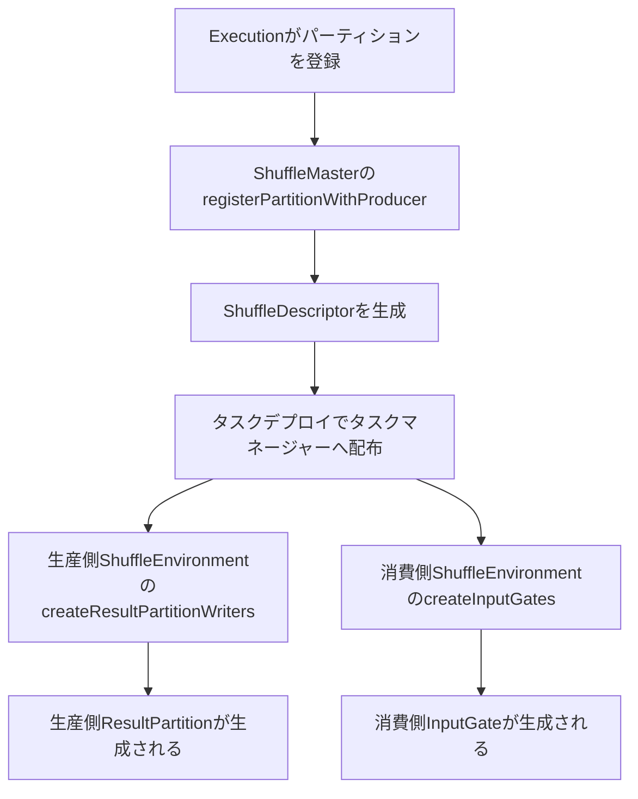

# 第18章 シャッフルサービスとデータ交換

> **本章で読むソース**
>
> - [`ShuffleMaster.java`](https://github.com/apache/flink/blob/release-2.3.0/flink-runtime/src/main/java/org/apache/flink/runtime/shuffle/ShuffleMaster.java)
> - [`ShuffleEnvironment.java`](https://github.com/apache/flink/blob/release-2.3.0/flink-runtime/src/main/java/org/apache/flink/runtime/shuffle/ShuffleEnvironment.java)
> - [`NettyShuffleMaster.java`](https://github.com/apache/flink/blob/release-2.3.0/flink-runtime/src/main/java/org/apache/flink/runtime/shuffle/NettyShuffleMaster.java)
> - [`NettyShuffleEnvironment.java`](https://github.com/apache/flink/blob/release-2.3.0/flink-runtime/src/main/java/org/apache/flink/runtime/io/network/NettyShuffleEnvironment.java)
> - [`ResultPartitionType.java`](https://github.com/apache/flink/blob/release-2.3.0/flink-runtime/src/main/java/org/apache/flink/runtime/io/network/partition/ResultPartitionType.java)
> - [`Execution.java`](https://github.com/apache/flink/blob/release-2.3.0/flink-runtime/src/main/java/org/apache/flink/runtime/executiongraph/Execution.java)

## この章の狙い

第16章では `ResultPartition` と `InputGate` がバッファをやり取りする構造を読み、第17章ではクレジットベースフロー制御がそのバッファ授受を制御する仕組みを読んだ。

しかし `ResultPartition` と `InputGate` が実際にどこで生成され、どのタスクマネージャーがどのタスクマネージャーへデータを送るかという配線情報がどこから来るのかは、まだ見ていない。

本章では、この配線を担う抽象境界である `ShuffleMaster` と `ShuffleEnvironment`、そして両者の既定実装である `NettyShuffleMaster` と `NettyShuffleEnvironment` を読む。

あわせて、パイプラインシャッフルとブロッキングシャッフルという2つのデータ交換方式が `ResultPartitionType` としてどう表現され、実行モードに応じてどちらが選ばれるのかを見る。

## 前提

Flink のジョブは、実行グラフ上で1つの `ExecutionVertex` が別の `ExecutionVertex` へ中間結果を渡すことで進む。

この中間結果の受け渡しをシャッフルと呼ぶ。

シャッフルは単なるデータ転送ではなく、生産側のどこにデータがあるかをジョブマスター側で把握し、消費側のタスクがそれを見つけて接続できるようにする、位置情報の管理を含む。

flink-runtime にはこの位置情報の管理とデータ転送を1つの実装（Netty ベースのネットワークスタック）に固定せず、差し替え可能なプラグイン境界として切り出した抽象がある。

それが `ShuffleMaster` と `ShuffleEnvironment` である。

## ShuffleMaster がパーティションを登録する

`ShuffleMaster` はジョブマスター側で動作するインターフェースであり、中間結果パーティションの登録と管理を担う。

[`ShuffleMaster.java` L73-L90](https://github.com/apache/flink/blob/release-2.3.0/flink-runtime/src/main/java/org/apache/flink/runtime/shuffle/ShuffleMaster.java#L73-L90)

```java
    /**
     * Asynchronously register a partition and its producer with the shuffle service.
     *
     * <p>The returned shuffle descriptor is an internal handle which identifies the partition
     * internally within the shuffle service. The descriptor should provide enough information to
     * read from or write data to the partition.
     *
     * @param jobID job ID of the corresponding job which registered the partition
     * @param partitionDescriptor general job graph information about the partition
     * @param producerDescriptor general producer information (location, execution id, connection
     *     info)
     * @return future with the partition shuffle descriptor used for producer/consumer deployment
     *     and their data exchange.
     */
    CompletableFuture<T> registerPartitionWithProducer(
            JobID jobID,
            PartitionDescriptor partitionDescriptor,
            ProducerDescriptor producerDescriptor);
```

`registerPartitionWithProducer` は、パーティションの一般情報（`PartitionDescriptor`）と生産者の情報（`ProducerDescriptor`、実行位置や接続情報を含む）を受け取り、非同期に `ShuffleDescriptor` を返す。

戻り値の型パラメータ `T` は `ShuffleDescriptor` を境界とし、実装ごとに異なる具象型（Netty 実装であれば後述する `NettyShuffleDescriptor`）を返せる。

呼び出しが `CompletableFuture` を返す点は、外部シャッフルサービスへの登録がネットワーク越しの操作になりうることを踏まえた設計であり、ジョブマスター側のスレッドを長時間ブロックしない。

この登録の呼び出し元は `Execution` である。

タスクの生産するパーティションごとに `registerPartitionWithProducer` を呼び、返ってきた `ShuffleDescriptor` からタスクへ配布する `ResultPartitionDeploymentDescriptor` を組み立てる。

[`Execution.java` L505-L524](https://github.com/apache/flink/blob/release-2.3.0/flink-runtime/src/main/java/org/apache/flink/runtime/executiongraph/Execution.java#L505-L524)

```java
    private static CompletableFuture<
                    Map<IntermediateResultPartitionID, ResultPartitionDeploymentDescriptor>>
            registerProducedPartitions(
                    ExecutionVertex vertex,
                    TaskManagerLocation location,
                    ExecutionAttemptID attemptId) {

        ProducerDescriptor producerDescriptor = ProducerDescriptor.create(location, attemptId);

        Collection<IntermediateResultPartition> partitions =
                vertex.getProducedPartitions().values();
        Collection<CompletableFuture<ResultPartitionDeploymentDescriptor>> partitionRegistrations =
                new ArrayList<>(partitions.size());

        for (IntermediateResultPartition partition : partitions) {
            PartitionDescriptor partitionDescriptor = PartitionDescriptor.from(partition);
            CompletableFuture<? extends ShuffleDescriptor> shuffleDescriptorFuture =
                    vertex.getExecutionGraphAccessor()
                            .getShuffleMaster()
                            .registerPartitionWithProducer(
```

`vertex.getExecutionGraphAccessor().getShuffleMaster()` が実行グラフに紐づいた `ShuffleMaster` を取り出している。

つまり `ShuffleMaster` はジョブ単位ではなく実行グラフに1つ結びつく共有のオブジェクトであり、タスクがデプロイされるたびにパーティションを登録しにいく相手として機能する。

このメソッドが集めた `ResultPartitionDeploymentDescriptor` の集合は、タスクをタスクマネージャーへデプロイするときのタスク情報に含まれ、生産側でどんな `ResultPartition` を作るべきかを伝える。

## ShuffleEnvironment が生産側と消費側を作る

`ShuffleMaster` がジョブマスター側でパーティションの所在を管理するのに対し、`ShuffleEnvironment` はタスクマネージャー側でローカルなシャッフル環境を管理するインターフェースである。

[`ShuffleEnvironment.java` L128-L146](https://github.com/apache/flink/blob/release-2.3.0/flink-runtime/src/main/java/org/apache/flink/runtime/shuffle/ShuffleEnvironment.java#L128-L146)

```java
    ShuffleIOOwnerContext createShuffleIOOwnerContext(
            String ownerName, ExecutionAttemptID executionAttemptID, MetricGroup parentGroup);

    /**
     * Factory method for the {@link ResultPartitionWriter ResultPartitionWriters} to produce result
     * partitions.
     *
     * <p>The order of the {@link ResultPartitionWriter ResultPartitionWriters} in the returned
     * collection should be the same as the iteration order of the passed {@code
     * resultPartitionDeploymentDescriptors}.
     *
     * @param ownerContext the owner context relevant for partition creation
     * @param resultPartitionDeploymentDescriptors descriptors of the partition, produced by the
     *     owner
     * @return list of the {@link ResultPartitionWriter ResultPartitionWriters}
     */
    List<P> createResultPartitionWriters(
            ShuffleIOOwnerContext ownerContext,
            List<ResultPartitionDeploymentDescriptor> resultPartitionDeploymentDescriptors);
```

`createResultPartitionWriters` が生産側のファクトリメソッドであり、`ResultPartitionDeploymentDescriptor` のリストから `ResultPartitionWriter`（第16章で見た `ResultPartition` はこの実装の1つ）を生成する。

消費側にも対称なファクトリメソッドがある。

[`ShuffleEnvironment.java` L178-L193](https://github.com/apache/flink/blob/release-2.3.0/flink-runtime/src/main/java/org/apache/flink/runtime/shuffle/ShuffleEnvironment.java#L178-L193)

```java
    /**
     * Factory method for the {@link InputGate InputGates} to consume result partitions.
     *
     * <p>The order of the {@link InputGate InputGates} in the returned collection should be the
     * same as the iteration order of the passed {@code inputGateDeploymentDescriptors}.
     *
     * @param ownerContext the owner context relevant for gate creation
     * @param partitionProducerStateProvider producer state provider to query whether the producer
     *     is ready for consumption
     * @param inputGateDeploymentDescriptors descriptors of the input gates to consume
     * @return list of the {@link InputGate InputGates}
     */
    List<G> createInputGates(
            ShuffleIOOwnerContext ownerContext,
            PartitionProducerStateProvider partitionProducerStateProvider,
            List<InputGateDeploymentDescriptor> inputGateDeploymentDescriptors);
```

`createInputGates` は `InputGateDeploymentDescriptor` のリストから `InputGate`（第16章の `SingleInputGate`）を生成する。

型パラメータ `P extends ResultPartitionWriter` と `G extends IndexedInputGate` は、`ShuffleEnvironment` の実装ごとに具体的な生産側と消費側の型を固定できるようにする境界であり、`NettyShuffleEnvironment` ではこれが `ResultPartition` と `SingleInputGate` になる。

`ShuffleMaster` と `ShuffleEnvironment` の役割分担をまとめると、次のようになる。



`ShuffleMaster` はジョブマスター側で1回だけ動く登録窓口であり、`ShuffleEnvironment` は各タスクマネージャー上でローカルに動く生成工場である。

この2段構えにより、パーティションの所在をジョブマスターが一元管理しつつ、実際のバッファ生成やネットワーク接続はタスクマネージャーのローカルな責務にとどめられる。

## 既定実装 NettyShuffleMaster

`NettyShuffleMaster` は `ShuffleMaster<NettyShuffleDescriptor>` を実装する既定の登録窓口である。

[`NettyShuffleMaster.java` L111-L144](https://github.com/apache/flink/blob/release-2.3.0/flink-runtime/src/main/java/org/apache/flink/runtime/shuffle/NettyShuffleMaster.java#L111-L144)

```java
    @Override
    public CompletableFuture<NettyShuffleDescriptor> registerPartitionWithProducer(
            JobID jobID,
            PartitionDescriptor partitionDescriptor,
            ProducerDescriptor producerDescriptor) {

        ResultPartitionID resultPartitionID =
                new ResultPartitionID(
                        partitionDescriptor.getPartitionId(),
                        producerDescriptor.getProducerExecutionId());

        List<TierShuffleDescriptor> tierShuffleDescriptors = null;
        if (tieredInternalShuffleMaster != null) {
            tierShuffleDescriptors =
                    tieredInternalShuffleMaster.addPartitionAndGetShuffleDescriptor(
                            jobID,
                            partitionDescriptor.getNumberOfSubpartitions(),
                            resultPartitionID);
        }

        NettyShuffleDescriptor shuffleDeploymentDescriptor =
                new NettyShuffleDescriptor(
                        producerDescriptor.getProducerLocation(),
                        createConnectionInfo(
                                producerDescriptor, partitionDescriptor.getConnectionIndex()),
                        resultPartitionID,
                        tierShuffleDescriptors);
        if (enableJobMasterFailover) {
            Map<ResultPartitionID, ShuffleDescriptor> shuffleDescriptorMap =
                    jobShuffleDescriptors.computeIfAbsent(jobID, k -> new HashMap<>());
            shuffleDescriptorMap.put(resultPartitionID, shuffleDeploymentDescriptor);
        }
        return CompletableFuture.completedFuture(shuffleDeploymentDescriptor);
    }
```

この実装は外部システムへの問い合わせを行わず、`ResultPartitionID` と接続情報（生産側の場所、データポート、実行 ID）だけを詰めた `NettyShuffleDescriptor` をその場で構築して即座に完了した `CompletableFuture` を返す。

登録処理がローカル完結する分、ジョブマスターからタスクマネージャーへは実データではなく「どこに接続すれば読めるか」という接続情報だけが伝わる。

`createConnectionInfo` は、生産側がデータポートを持つ（ネットワーク越しの接続が必要な）場合は `NetworkPartitionConnectionInfo` を、同一タスクマネージャー内で完結する場合は `LocalExecutionPartitionConnectionInfo` を選ぶ。

同一プロセス内の生産と消費であればネットワークソケットを経由せず、直接メモリ上のバッファをやり取りできるという最適化がここに埋め込まれている。

`enableJobMasterFailover` が有効な場合、`jobShuffleDescriptors` に登録済みの記述子を保持しておく。

これはバッチジョブでジョブマスターが再起動したときに、すでに生産済みのパーティションをスキャンし直さずに復元するための状態である。

## 既定実装 NettyShuffleEnvironment

`NettyShuffleEnvironment` は `ShuffleEnvironment<ResultPartition, SingleInputGate>` を実装するタスクマネージャー側の既定実装である。

[`NettyShuffleEnvironment.java` L79-L80](https://github.com/apache/flink/blob/release-2.3.0/flink-runtime/src/main/java/org/apache/flink/runtime/io/network/NettyShuffleEnvironment.java#L79-L80)

```java
public class NettyShuffleEnvironment
        implements ShuffleEnvironment<ResultPartition, SingleInputGate> {
```

型パラメータが `ResultPartition` と `SingleInputGate` に固定されており、第16章と第17章で読んだクラス群がここに接続する。

タスクマネージャーが起動するとき、`start` がネットワーク接続の下準備を行う。

[`NettyShuffleEnvironment.java` L337-L349](https://github.com/apache/flink/blob/release-2.3.0/flink-runtime/src/main/java/org/apache/flink/runtime/io/network/NettyShuffleEnvironment.java#L337-L349)

```java
    public int start() throws IOException {
        synchronized (lock) {
            Preconditions.checkState(
                    !isClosed, "The NettyShuffleEnvironment has already been shut down.");

            LOG.info("Starting the network environment and its components.");

            try {
                LOG.debug("Starting network connection manager");
                return connectionManager.start();
            } catch (IOException t) {
                throw new IOException("Failed to instantiate network connection manager.", t);
            }
        }
    }
```

`connectionManager.start()` が返すポート番号は、他のタスクマネージャーがこのタスクマネージャー上のパーティションへ接続する際の待ち受けポートになる。

このポートは `ProducerDescriptor` の一部としてジョブマスターへ伝わり、前述の `NettyShuffleMaster.registerPartitionWithProducer` が組み立てる接続情報に反映される。

生産側の生成は `createResultPartitionWriters` が担う。

[`NettyShuffleEnvironment.java` L222-L239](https://github.com/apache/flink/blob/release-2.3.0/flink-runtime/src/main/java/org/apache/flink/runtime/io/network/NettyShuffleEnvironment.java#L222-L239)

```java
    public List<ResultPartition> createResultPartitionWriters(
            ShuffleIOOwnerContext ownerContext,
            List<ResultPartitionDeploymentDescriptor> resultPartitionDeploymentDescriptors) {
        synchronized (lock) {
            Preconditions.checkState(
                    !isClosed, "The NettyShuffleEnvironment has already been shut down.");

            ResultPartition[] resultPartitions =
                    new ResultPartition[resultPartitionDeploymentDescriptors.size()];
            for (int partitionIndex = 0;
                    partitionIndex < resultPartitions.length;
                    partitionIndex++) {
                resultPartitions[partitionIndex] =
                        resultPartitionFactory.create(
                                ownerContext.getOwnerName(),
                                partitionIndex,
                                resultPartitionDeploymentDescriptors.get(partitionIndex));
            }
```

生成自体は内部に保持する `resultPartitionFactory` へ委譲されており、`NettyShuffleEnvironment` は記述子の集合をループしてファクトリを呼ぶだけである。

消費側の `createInputGates` も同じ形をとる。

[`NettyShuffleEnvironment.java` L250-L274](https://github.com/apache/flink/blob/release-2.3.0/flink-runtime/src/main/java/org/apache/flink/runtime/io/network/NettyShuffleEnvironment.java#L250-L274)

```java
    public List<SingleInputGate> createInputGates(
            ShuffleIOOwnerContext ownerContext,
            PartitionProducerStateProvider partitionProducerStateProvider,
            List<InputGateDeploymentDescriptor> inputGateDeploymentDescriptors) {
        synchronized (lock) {
            Preconditions.checkState(
                    !isClosed, "The NettyShuffleEnvironment has already been shut down.");

            MetricGroup networkInputGroup = ownerContext.getInputGroup();

            InputChannelMetrics inputChannelMetrics =
                    new InputChannelMetrics(networkInputGroup, ownerContext.getParentGroup());

            SingleInputGate[] inputGates =
                    new SingleInputGate[inputGateDeploymentDescriptors.size()];
            for (int gateIndex = 0; gateIndex < inputGates.length; gateIndex++) {
                final InputGateDeploymentDescriptor igdd =
                        inputGateDeploymentDescriptors.get(gateIndex);
                SingleInputGate inputGate =
                        singleInputGateFactory.create(
                                ownerContext,
                                gateIndex,
                                igdd,
                                partitionProducerStateProvider,
                                inputChannelMetrics);
                InputGateID id =
```

`partitionProducerStateProvider` は、消費側が接続しようとしている生産側パーティションがまだ生きているかを問い合わせるための引数であり、生産側タスクの失敗を検知して再接続や再スケジューリングにつなげる経路を `InputGate` の生成時点から組み込んでいる。

`resultPartitionFactory` と `singleInputGateFactory` の実体は、コンストラクタで渡される `ResultPartitionFactory` と `SingleInputGateFactory` であり、バッファプールの割り当てやサブパーティションの実装選択（第16章で扱ったパイプライン方式とファイルベース方式の切り替え）はこれらのファクトリに集約されている。

`NettyShuffleEnvironment` 自身は記述子の解釈とライフサイクル管理（`isClosed` の確認や `lock` による排他）に専念し、個々のパーティションやゲートの内部実装には立ち入らない。

## パイプラインシャッフルとブロッキングシャッフル

生産側と消費側がどのタイミングでデータをやり取りできるかは、`ResultPartitionType` という列挙で表現される。

[`ResultPartitionType.java` L22-L60](https://github.com/apache/flink/blob/release-2.3.0/flink-runtime/src/main/java/org/apache/flink/runtime/io/network/partition/ResultPartitionType.java#L22-L60)

```java
public enum ResultPartitionType {

    /**
     * Blocking partitions represent blocking data exchanges, where the data stream is first fully
     * produced and then consumed. This is an option that is only applicable to bounded streams and
     * can be used in bounded stream runtime and recovery.
     *
     * <p>Blocking partitions can be consumed multiple times and concurrently.
     *
     * <p>The partition is not automatically released after being consumed (like for example the
     * {@link #PIPELINED} partitions), but only released through the scheduler, when it determines
     * that the partition is no longer needed.
     */
    BLOCKING(true, false, false, ConsumingConstraint.BLOCKING, ReleaseBy.SCHEDULER),

    // ... (中略、BLOCKING_PERSISTENT ほか) ...

    /**
     * A pipelined streaming data exchange. This is applicable to both bounded and unbounded
     * streams.
     *
     * <p>Pipelined results can be consumed only once by a single consumer and are automatically
     * disposed when the stream has been consumed.
     *
     * <p>This result partition type may keep an arbitrary amount of data in-flight, in contrast to
     * the {@link #PIPELINED_BOUNDED} variant.
     */
    PIPELINED(false, false, false, ConsumingConstraint.MUST_BE_PIPELINED, ReleaseBy.UPSTREAM),
```

`BLOCKING` は、生産側がパーティションを完全に生産し終えてから消費側が読み始める方式であり、複数回、複数の消費者から読める。

パーティションの解放も生産側の完了と連動せず、スケジューラが明示的に不要と判断した時点で行われる。

一方 `PIPELINED` は、生産側が生産している最中から消費側が読み進められる方式であり、1回だけ、1つの消費者にしか読ませない。

第17章で読んだクレジットベースフロー制御が対象にしていたのはこの `PIPELINED` 系のデータ交換であり、生産と消費が同時に進むからこそ、消費側のバッファ余力を生産側へ伝えるクレジットの仕組みが必要になる。

`BLOCKING` はストリーミング処理では使われず、バッチジョブや、ストリーミングジョブの中でも一度全データを揃えてから処理を進める必要がある箇所（例えばリバランス前の中間結果）に使われる。

`PIPELINED` はストリーミング処理の既定であり、レコードがソースからシンクまで低遅延で流れ続けることを可能にする。

実行モードごとにどちらの `ResultPartitionType` を選ぶかは、`StreamingJobGraphGenerator` がジョブグラフを構築する段階で、各エッジの実行モード（ストリーミングかバッチか）とシャッフルモードの設定から決定する。

この決定はジョブグラフの生成時点で確定し、以降は `PartitionDescriptor` を通じてシャッフルサービスまで伝わる値として扱われる。

## シャッフルサービスを差し替え可能にする設計

`ShuffleMaster` と `ShuffleEnvironment` という2つのインターフェースへ抽象化されていることの実利は、両者を Netty 実装以外へ差し替えられる点にある。

`ShuffleServiceFactory` がこの差し替えの入口であり、設定に応じて `ShuffleMaster` と `ShuffleEnvironment` の実装ペアを生成する。

外部シャッフルサービス（例えばリモートのシャッフルクラスタや、クラウド基盤が提供するマネージドシャッフル）を使いたい場合、このインターフェースを実装すれば、ジョブマスターとタスクマネージャーのコード自体を変更せずに済む。

`ShuffleMaster` 側は「パーティションをどこにいくつ作るか」という配置情報の管理に専念し、`ShuffleEnvironment` 側は「実際のバイト列をどう読み書きするか」というローカルな実装に専念するという役割分担が、この差し替えを容易にしている。

タスクマネージャーが障害でプロセスごと失われても外部シャッフルサービスがパーティションを保持し続けられるのであれば、`BLOCKING` パーティションの再計算を避けられる、といった構成もこの抽象境界の上に成り立つ。

Flink 本体のコードは Netty ベースの `NettyShuffleMaster` と `NettyShuffleEnvironment` だけを既定で提供するが、インターフェースの粒度は最初から外部実装を想定して切られている。

## まとめ

`ShuffleMaster` はジョブマスター側でパーティションの登録を受け付け、`ShuffleDescriptor` という接続情報を生産側と消費側それぞれのタスクへ配布する窓口である。

`ShuffleEnvironment` はタスクマネージャー側でこの接続情報から実際の `ResultPartitionWriter` と `InputGate` を生成する工場であり、既定実装の `NettyShuffleEnvironment` では第16章と第17章で見た `ResultPartition` と `SingleInputGate` がこの工場から生まれる。

`ResultPartitionType` によって表現されるパイプラインシャッフルとブロッキングシャッフルの違いは、生産と消費が同時に進むかどうかを決め、ストリーミングとバッチという実行モードの違いに対応する。

登録の窓口と生成の工場という2つの抽象境界に分けたことで、Netty 実装を外部シャッフルサービスへ差し替える余地が生まれている。

## 関連する章

- [第16章 ResultPartitionとInputGate](16-resultpartition-inputgate.md)
- [第17章 クレジットベースフロー制御とネットワークバッファ](17-credit-flow-buffers.md)
- [第9章 ExecutionGraph](../part02-graph/09-executiongraph.md)
