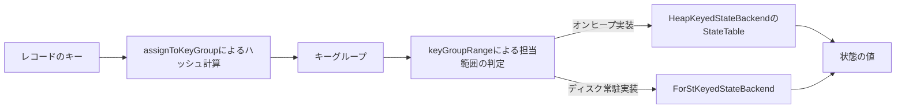

# 第19章 状態バックエンド：Keyed State と ForSt

> **本章で読むソース**
>
> - [`KeyedStateBackend.java`](https://github.com/apache/flink/blob/release-2.3.0/flink-runtime/src/main/java/org/apache/flink/runtime/state/KeyedStateBackend.java)
> - [`AbstractKeyedStateBackend.java`](https://github.com/apache/flink/blob/release-2.3.0/flink-runtime/src/main/java/org/apache/flink/runtime/state/AbstractKeyedStateBackend.java)
> - [`heap/HeapKeyedStateBackend.java`](https://github.com/apache/flink/blob/release-2.3.0/flink-runtime/src/main/java/org/apache/flink/runtime/state/heap/HeapKeyedStateBackend.java)
> - [`heap/StateTable.java`](https://github.com/apache/flink/blob/release-2.3.0/flink-runtime/src/main/java/org/apache/flink/runtime/state/heap/StateTable.java)
> - [`KeyGroupRange.java`](https://github.com/apache/flink/blob/release-2.3.0/flink-runtime/src/main/java/org/apache/flink/runtime/state/KeyGroupRange.java)
> - [`KeyGroupRangeAssignment.java`](https://github.com/apache/flink/blob/release-2.3.0/flink-runtime/src/main/java/org/apache/flink/runtime/state/KeyGroupRangeAssignment.java)
> - [`OperatorStateBackend.java`](https://github.com/apache/flink/blob/release-2.3.0/flink-runtime/src/main/java/org/apache/flink/runtime/state/OperatorStateBackend.java)
> - [`state/forst/ForStKeyedStateBackend.java`](https://github.com/apache/flink/blob/release-2.3.0/flink-state-backends/flink-statebackend-forst/src/main/java/org/apache/flink/state/forst/ForStKeyedStateBackend.java)

## この章の狙い

第15章では、タイマーが登録時のキーを覚えていて、発火のたびに `keyContext` を切り替える様子を見た。

そこで前提としていた「キーごとの状態」を実際に格納しているのが、本章で扱う状態バックエンドである。

`ValueState` や `ListState` といった**キー付き状態**（Keyed State）は、演算子から見ればただの読み書き可能な変数だが、その裏では現在のキーに応じて別々のデータへ振り分けられている。

本章では、この振り分けを担う `KeyedStateBackend` の抽象と、オンヒープの実装である `HeapKeyedStateBackend`、そしてディスクや遠隔ストレージまで扱える `ForStKeyedStateBackend` の位置づけを読む。

## 前提

Flink の演算子には、大きく分けて2種類の状態がある。

**キー付き状態**は、`KeyedStream` に対して定義され、レコードのキーごとに独立した値を持つ。

**演算子状態**（Operator State）は、キーに依存せず、演算子のサブタスクごとに1つ持つ。

本章はキー付き状態を中心に扱い、演算子状態は後述の一節で位置づけだけを示す。

キー付き状態を格納する側のコンポーネントを**状態バックエンド**（state backend）と呼び、`HeapKeyedStateBackend` のようにJVMヒープ上に格納する実装と、`ForStKeyedStateBackend` のようにヒープ外のストレージに格納する実装がある。

## KeyedStateBackend が定義するキー付き状態の入口

`KeyedStateBackend` インターフェースは、キー付き状態を扱うための操作をまとめている。

[`KeyedStateBackend.java` L36-L57](https://github.com/apache/flink/blob/release-2.3.0/flink-runtime/src/main/java/org/apache/flink/runtime/state/KeyedStateBackend.java#L36-L57)

```java
public interface KeyedStateBackend<K>
        extends KeyedStateFactory, PriorityQueueSetFactory, Disposable {

    /**
     * Sets the current key that is used for partitioned state.
     *
     * @param newKey The new current key.
     */
    void setCurrentKey(K newKey);

    /**
     * @return Current key.
     */
    K getCurrentKey();

    /** Act as a fast path for {@link #setCurrentKey} when the key group is known. */
    void setCurrentKeyAndKeyGroup(K newKey, int newKeyGroupIndex);

    /**
     * @return Serializer of the key.
     */
    TypeSerializer<K> getKeySerializer();
```

`setCurrentKey` は、これから読み書きする状態がどのキーに属するかを状態バックエンドへ伝える。

第15章で見た `InternalTimerServiceImpl` がタイマー発火の直前に `keyContext.setCurrentKey` を呼んでいたのは、まさにこの入口を経由してキー付き状態のスコープを切り替えるためである。

状態そのものの取得は `getOrCreateKeyedState` が担う。

[`KeyedStateBackend.java` L103-L117](https://github.com/apache/flink/blob/release-2.3.0/flink-runtime/src/main/java/org/apache/flink/runtime/state/KeyedStateBackend.java#L103-L117)

```java
    /**
     * Creates or retrieves a keyed state backed by this state backend.
     *
     * @param namespaceSerializer The serializer used for the namespace type of the state
     * @param stateDescriptor The identifier for the state. This contains name and can create a
     *     default state value.
     * @param <N> The type of the namespace.
     * @param <S> The type of the state.
     * @return A new key/value state backed by this backend.
     * @throws Exception Exceptions may occur during initialization of the state and should be
     *     forwarded.
     */
    <N, S extends State, T> S getOrCreateKeyedState(
            TypeSerializer<N> namespaceSerializer, StateDescriptor<S, T> stateDescriptor)
            throws Exception;
```

`StateDescriptor` は状態の名前と型を表す識別子であり、同じ名前で呼び出せば既存の状態ハンドルがそのまま返る。

`ValueState` や `ListState` はユーザーコードから見えるインターフェースであり、その実体は状態バックエンドが返す `InternalKvState` の実装である。

演算子はレコードごとに `setCurrentKey` を呼んでからこれらの状態ハンドルを読み書きするので、状態ハンドル自体はキーを持たず、現在のキーコンテキストを通じて間接的にデータへアクセスする形になる。

## AbstractKeyedStateBackend が担う共通処理

`AbstractKeyedStateBackend` は、`KeyedStateBackend` の実装に共通する処理をまとめる抽象クラスであり、`HeapKeyedStateBackend` を含む多くの実装がここを継承する。

コンストラクタで受け取る `keyGroupRange` は、このバックエンドが担当するキーグループの範囲を表す。

[`AbstractKeyedStateBackend.java` L74-L78](https://github.com/apache/flink/blob/release-2.3.0/flink-runtime/src/main/java/org/apache/flink/runtime/state/AbstractKeyedStateBackend.java#L74-L78)

```java
    /** The number of key-groups aka max parallelism. */
    protected final int numberOfKeyGroups;

    /** Range of key-groups for which this backend is responsible. */
    protected final KeyGroupRange keyGroupRange;
```

**キーグループ**（key group）は、キーの集合をあらかじめ固定個数のバケットへ分割した単位である。

キーグループの総数はジョブの最大並列度に等しく、1つの状態バックエンドは自分のサブタスクが担当するキーグループの範囲だけを保持する。

`setCurrentKey` の実装は、現在のキーを覚えるだけでなく、そのキーが属するキーグループも同時に計算する。

[`AbstractKeyedStateBackend.java` L257-L270](https://github.com/apache/flink/blob/release-2.3.0/flink-runtime/src/main/java/org/apache/flink/runtime/state/AbstractKeyedStateBackend.java#L257-L270)

```java
    @Override
    public void setCurrentKey(K newKey) {
        notifyKeySelected(newKey);
        this.keyContext.setCurrentKey(newKey);
        this.keyContext.setCurrentKeyGroupIndex(
                KeyGroupRangeAssignment.assignToKeyGroup(newKey, numberOfKeyGroups));
    }

    @Override
    public void setCurrentKeyAndKeyGroup(K newKey, int newKeyGroupIndex) {
        notifyKeySelected(newKey);
        this.keyContext.setCurrentKey(newKey);
        this.keyContext.setCurrentKeyGroupIndex(newKeyGroupIndex);
    }
```

`setCurrentKeyAndKeyGroup` は、呼び出し側がすでにキーグループを知っている場合のための近道であり、`KeyGroupRangeAssignment.assignToKeyGroup` の再計算を省く。

`getOrCreateKeyedState` の実装は、状態の名前をキーとした `HashMap` にキャッシュを持ち、同じ `StateDescriptor` が複数回渡されても状態ハンドルを使い回す。

[`AbstractKeyedStateBackend.java` L378-L404](https://github.com/apache/flink/blob/release-2.3.0/flink-runtime/src/main/java/org/apache/flink/runtime/state/AbstractKeyedStateBackend.java#L378-L404)

```java
    public <N, S extends State, V> S getOrCreateKeyedState(
            final TypeSerializer<N> namespaceSerializer, StateDescriptor<S, V> stateDescriptor)
            throws Exception {
        checkNotNull(namespaceSerializer, "Namespace serializer");
        checkNotNull(
                keySerializer,
                "State key serializer has not been configured in the config. "
                        + "This operation cannot use partitioned state.");

        InternalKvState<K, ?, ?> kvState = keyValueStatesByName.get(stateDescriptor.getName());
        if (kvState == null) {
            if (!stateDescriptor.isSerializerInitialized()) {
                stateDescriptor.initializeSerializerUnlessSet(executionConfig);
            }
            kvState =
                    MetricsTrackingStateFactory.createStateAndWrapWithMetricsTrackingIfEnabled(
                            TtlStateFactory.createStateAndWrapWithTtlIfEnabled(
                                    namespaceSerializer, stateDescriptor, this, ttlTimeProvider),
                            this,
                            stateDescriptor,
                            latencyTrackingStateConfig,
                            sizeTrackingStateConfig);
            keyValueStatesByName.put(stateDescriptor.getName(), kvState);
            publishQueryableStateIfEnabled(stateDescriptor, kvState);
        }
        return (S) kvState;
    }
```

新規作成の場合は、TTL（生存期間）を扱う `TtlStateFactory` と、メトリクス計測を扱う `MetricsTrackingStateFactory` で状態を包んでからキャッシュへ入れる。

状態そのものの生成方法は具象クラスに委ねられており、`AbstractKeyedStateBackend` はキャッシュとキー切り替えという横断的な処理だけを引き受ける構成になっている。

## HeapKeyedStateBackend とキーグループ単位の StateTable

`HeapKeyedStateBackend` は `AbstractKeyedStateBackend` を継承し、状態をJVMヒープ上の `StateTable` に保持する。

[`HeapKeyedStateBackend.java` L79-L85](https://github.com/apache/flink/blob/release-2.3.0/flink-runtime/src/main/java/org/apache/flink/runtime/state/heap/HeapKeyedStateBackend.java#L79-L85)

```java
/**
 * A {@link AbstractKeyedStateBackend} that keeps state on the Java Heap and will serialize state to
 * streams provided by a {@link CheckpointStreamFactory} upon checkpointing.
 *
 * @param <K> The key by which state is keyed.
 */
public class HeapKeyedStateBackend<K> extends AbstractKeyedStateBackend<K> {
```

状態の名前ごとに1つの `StateTable` を持ち、`registeredKVStates` というマップで管理する。

新しい状態は `tryRegisterStateTable` が生成する。

[`HeapKeyedStateBackend.java` L279-L298](https://github.com/apache/flink/blob/release-2.3.0/flink-runtime/src/main/java/org/apache/flink/runtime/state/heap/HeapKeyedStateBackend.java#L279-L298)

```java
        } else {
            RegisteredKeyValueStateBackendMetaInfo<N, V> newMetaInfo =
                    new RegisteredKeyValueStateBackendMetaInfo<>(
                            stateDesc.getType(),
                            stateDesc.getName(),
                            namespaceSerializer,
                            newStateSerializer,
                            snapshotTransformFactory);

            newMetaInfo =
                    allowFutureMetadataUpdates
                            ? newMetaInfo.withSerializerUpgradesAllowed()
                            : newMetaInfo;

            stateTable = stateTableFactory.newStateTable(keyContext, newMetaInfo, keySerializer);
            registeredKVStates.put(stateDesc.getName(), stateTable);
        }

        return stateTable;
    }
```

`StateTable` の内部は、キーグループごとに1つの `StateMap` を並べた配列である。

[`StateTable.java` L72-L102](https://github.com/apache/flink/blob/release-2.3.0/flink-runtime/src/main/java/org/apache/flink/runtime/state/heap/StateTable.java#L72-L102)

```java
    /** The current key group range. */
    protected final KeyGroupRange keyGroupRange;

    /**
     * Map for holding the actual state objects. The outer array represents the key-groups. All
     * array positions will be initialized with an empty state map.
     */
    protected final StateMap<K, N, S>[] keyGroupedStateMaps;

    /**
     * @param keyContext the key context provides the key scope for all put/get/delete operations.
     * @param metaInfo the meta information, including the type serializer for state copy-on-write.
     * @param keySerializer the serializer of the key.
     */
    public StateTable(
            InternalKeyContext<K> keyContext,
            RegisteredKeyValueStateBackendMetaInfo<N, S> metaInfo,
            TypeSerializer<K> keySerializer) {
        this.keyContext = Preconditions.checkNotNull(keyContext);
        this.metaInfo = Preconditions.checkNotNull(metaInfo);
        this.keySerializer = Preconditions.checkNotNull(keySerializer);

        this.keyGroupRange = keyContext.getKeyGroupRange();

        @SuppressWarnings("unchecked")
        StateMap<K, N, S>[] state =
                (StateMap<K, N, S>[])
                        new StateMap[keyContext.getKeyGroupRange().getNumberOfKeyGroups()];
        this.keyGroupedStateMaps = state;
        for (int i = 0; i < this.keyGroupedStateMaps.length; i++) {
            this.keyGroupedStateMaps[i] = createStateMap();
        }
```

配列の長さは、このバックエンドが担当するキーグループの数と一致する。

1つのキー、1つの `StateMap` の中では、キーと名前空間の組が値を指す辞書として実装されている。

状態への実際の読み書きは、現在のキーグループを配列の添字へ変換してから行う。

[`StateTable.java` L321-L337](https://github.com/apache/flink/blob/release-2.3.0/flink-runtime/src/main/java/org/apache/flink/runtime/state/heap/StateTable.java#L321-L337)

```java
    public int getKeyGroupOffset() {
        return keyGroupRange.getStartKeyGroup();
    }

    public StateMap<K, N, S> getMapForKeyGroup(int keyGroupIndex) {
        final int pos = indexToOffset(keyGroupIndex);
        if (pos >= 0 && pos < keyGroupedStateMaps.length) {
            return keyGroupedStateMaps[pos];
        } else {
            throw KeyGroupRangeOffsets.newIllegalKeyGroupException(keyGroupIndex, keyGroupRange);
        }
    }

    /** Translates a key-group id to the internal array offset. */
    private int indexToOffset(int index) {
        return index - getKeyGroupOffset();
    }
```

`get` や `put` の公開メソッドは、`keyContext.getCurrentKeyGroupIndex()` が返す現在のキーグループを引数にして `getMapForKeyGroup` を呼ぶ。

[`StateTable.java` L145-L169](https://github.com/apache/flink/blob/release-2.3.0/flink-runtime/src/main/java/org/apache/flink/runtime/state/heap/StateTable.java#L145-L169)

```java
    public S get(N namespace) {
        return get(keyContext.getCurrentKey(), keyContext.getCurrentKeyGroupIndex(), namespace);
    }
```

つまり、`setCurrentKey` によって現在のキーグループがあらかじめ計算されているため、状態の読み書き自体はハッシュテーブル探索と配列添字の計算だけで済み、キーグループ範囲の判定に線形走査は要らない。

## キーグループへの割り当てとリスケール可能性

あるキーがどのキーグループに属するかは、`KeyGroupRangeAssignment.assignToKeyGroup` がキーのハッシュ値から決める。

[`KeyGroupRangeAssignment.java` L63-L66](https://github.com/apache/flink/blob/release-2.3.0/flink-runtime/src/main/java/org/apache/flink/runtime/state/KeyGroupRangeAssignment.java#L63-L66)

```java
    public static int assignToKeyGroup(Object key, int maxParallelism) {
        Preconditions.checkNotNull(key, "Assigned key must not be null!");
        return computeKeyGroupForKeyHash(key.hashCode(), maxParallelism);
    }
```

キーグループの総数（最大並列度）はジョブ起動時に固定され、実行中の並列度が変わってもキーからキーグループへの対応は変化しない。

変わるのは、どのキーグループをどのサブタスクが担当するかという対応だけである。

[`KeyGroupRangeAssignment.java` L93-L106](https://github.com/apache/flink/blob/release-2.3.0/flink-runtime/src/main/java/org/apache/flink/runtime/state/KeyGroupRangeAssignment.java#L93-L106)

```java
    public static KeyGroupRange computeKeyGroupRangeForOperatorIndex(
            int maxParallelism, int parallelism, int operatorIndex) {

        checkParallelismPreconditions(parallelism);
        checkParallelismPreconditions(maxParallelism);

        Preconditions.checkArgument(
                maxParallelism >= parallelism,
                "Maximum parallelism must not be smaller than parallelism.");

        int start = ((operatorIndex * maxParallelism + parallelism - 1) / parallelism);
        int end = ((operatorIndex + 1) * maxParallelism - 1) / parallelism;
        return new KeyGroupRange(start, end);
    }
```

この関数は、キーグループの総数と現在の並列度から、各サブタスクが受け持つ範囲を機械的に計算する。

並列度を変更してジョブを再起動するとき、各キーグループの中身（`StateMap` に入った状態のエントリ）はキー単位で分割されているので丸ごと移動できる。

必要なのは、新しい並列度で `computeKeyGroupRangeForOperatorIndex` を計算し直し、その範囲に含まれるキーグループのデータを対応するサブタスクへ配ることだけであり、状態を1件ずつキー単位で再ハッシュする必要がない。

**キーからキーグループへの対応を固定し、キーグループからサブタスクへの対応だけを並列度に応じて変えるという二段構えの分割**が、この状態バックエンドの機構としての最適化であり、キーグループがリスケールの単位になる理由でもある。

具体的なリスケール処理は第22章で扱う。

## OperatorStateBackend への一言

`KeyedStateBackend` と対になるのが `OperatorStateBackend` であり、キーに紐づかない状態を扱う。

[`OperatorStateBackend.java` L30-L38](https://github.com/apache/flink/blob/release-2.3.0/flink-runtime/src/main/java/org/apache/flink/runtime/state/OperatorStateBackend.java#L30-L38)

```java
public interface OperatorStateBackend
        extends OperatorStateStore,
                Snapshotable<SnapshotResult<OperatorStateHandle>>,
                Closeable,
                Disposable {

    @Override
    void dispose();
}
```

`OperatorStateStore` を継承しているだけで、`KeyedStateBackend` のようなキーグループ単位の分割は持たない。

Source コネクタが読み込み中のファイルオフセットを保持する `ListState` などが、この演算子状態の典型的な使い方である。

## ForStKeyedStateBackend の位置づけ

`HeapKeyedStateBackend` はすべての状態をJVMヒープに載せるため、状態のサイズがヒープの大きさに縛られる。

大規模な状態を扱うジョブ向けに、`flink-statebackend-forst` モジュールは `ForStKeyedStateBackend` を提供する。

[`ForStKeyedStateBackend.java` L89-L93](https://github.com/apache/flink/blob/release-2.3.0/flink-state-backends/flink-statebackend-forst/src/main/java/org/apache/flink/state/forst/ForStKeyedStateBackend.java#L89-L93)

```java
/**
 * A KeyedStateBackend that stores its state in {@code ForSt}. This state backend can store very
 * large state that exceeds memory even disk to remote storage.
 */
public class ForStKeyedStateBackend<K> implements AsyncKeyedStateBackend<K> {
```

`ForSt` はRocksDB系のキーバリューストアであり、状態をディスクへ書き出すことでヒープサイズを超える状態を扱える。

`ForStKeyedStateBackend` は `KeyedStateBackend` ではなく `AsyncKeyedStateBackend` を実装しており、状態アクセスが同期的な呼び出しではなく非同期のリクエストとして扱われる点が `HeapKeyedStateBackend` と異なる。

このクラスも、キーの範囲をキーグループ単位で管理する `KeyGroupRange` を保持しており、キーグループという分割単位そのものは `HeapKeyedStateBackend` と共通である。

内部でどのようにキーをバイト列へシリアライズしてForStへ書き込むかという詳細には立ち入らず、本章では「ディスクや遠隔ストレージまで扱える実装がキーグループの枠組みを共有している」という位置づけに留める。

## キーからキーグループ、状態バックエンドへの対応

ここまでの対応関係を図にまとめる。



`setCurrentKey` が呼ばれるたびに、キーからキーグループへのハッシュ計算が行われ、そのキーグループを担当するバックエンドの内部構造（`StateTable` の配列添字、あるいはForStのキー接頭辞）へと絞り込まれる。

## まとめ

`KeyedStateBackend` はキー付き状態への統一的な入口であり、`setCurrentKey` で現在のキーを切り替えてから `ValueState` などの状態ハンドルを読み書きする。

`AbstractKeyedStateBackend` は、状態ハンドルのキャッシュとキーグループの計算という共通処理を引き受け、具象クラスは状態そのものの格納方式だけを実装する。

`HeapKeyedStateBackend` はキーグループごとに1つの `StateMap` を配列で並べた `StateTable` に状態を持ち、`ForStKeyedStateBackend` はより大規模な状態をディスクや遠隔ストレージへ逃がす実装として位置づけられる。

キーからキーグループへの対応は並列度によらず固定され、キーグループからサブタスクへの対応だけが並列度に応じて変わるため、キーグループはリスケール時にデータを再配分する単位として機能する。

## 関連する章

- [第15章 ウォーターマークとタイマー](../part04-task-execution/15-watermark-timer.md)
- [第20章 チェックポイントコーディネーター](20-checkpoint-coordinator.md)
- [第22章 リカバリとリスケール](22-recovery-rescale.md)
