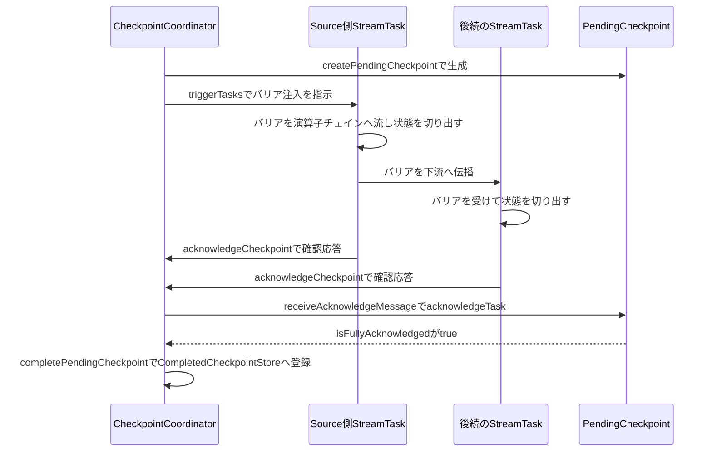

# 第20章 チェックポイントの調整：CheckpointCoordinator

> **本章で読むソース**
>
> - [`CheckpointCoordinator.java`](https://github.com/apache/flink/blob/release-2.3.0/flink-runtime/src/main/java/org/apache/flink/runtime/checkpoint/CheckpointCoordinator.java)
> - [`PendingCheckpoint.java`](https://github.com/apache/flink/blob/release-2.3.0/flink-runtime/src/main/java/org/apache/flink/runtime/checkpoint/PendingCheckpoint.java)
> - [`CompletedCheckpointStore.java`](https://github.com/apache/flink/blob/release-2.3.0/flink-runtime/src/main/java/org/apache/flink/runtime/checkpoint/CompletedCheckpointStore.java)

## この章の狙い

第13章では、`StreamTask` がチェックポイントの起動要求を `Mail` としてキューへ受け取り、mailboxスレッドの中でバリアを処理することを見た。

その要求元、つまり「いつ、どのタスクに向けてチェックポイントを起動するか」を決めるのが `CheckpointCoordinator` である。

`CheckpointCoordinator` は `JobMaster` の中で1ジョブに1つ生成され、定期的または明示的な要求に応じてチェックポイントを起動し、各タスクからの確認応答を集約し、全タスクの確認が揃った時点でチェックポイントを完了とみなす。

本章では、この一連の流れを `triggerCheckpoint` から `completePendingCheckpoint` まで順に読み、確認待ちの状態を保持する `PendingCheckpoint` の役割とあわせて把握する。

## 前提

`CheckpointCoordinator` は分散スナップショットの考え方を土台にしている。

分散システムの複数プロセスにまたがる一貫した状態を求める古典的な手法に、Chandy-Lamport の分散スナップショットアルゴリズムがある。

このアルゴリズムは、記録開始を告げる特別なマーカーをデータフローに流し、各プロセスがマーカーを受け取った時点で自分の状態を記録するという発想を持つ。

Flinkはこの発想を、演算子をつなぐストリームに埋め込む**バリア**というレコードとして具体化している。

バリアは通常のレコードと同じ経路を流れ、ある演算子をバリアが通過した瞬間が、その演算子の状態を切り出す区切りになる。

この方式は**非同期バリアスナップショット**（asynchronous barrier snapshotting）と呼ばれ、ストリーム処理を止めることなく、演算子をまたいで一貫した状態の断面を得られる点が特徴である。

バリアがどのように演算子を通過し、複数の入力チャネルからのバリアを揃える**アラインメント**がどう働くかは第21章で扱う。

本章では、そのバリアを送り出す起点である `CheckpointCoordinator` と、確認待ちの1回分のチェックポイントを表す `PendingCheckpoint` を読む。

## triggerCheckpoint：チェックポイントの起動

チェックポイントの起動は、外部からの明示的な要求と、定期的なタイマーによる要求の2つの経路を持つ。

いずれも最終的に、`CheckpointProperties` を受け取る内部の `triggerCheckpoint` に集約される。

[`CheckpointCoordinator.java` L612-L622](https://github.com/apache/flink/blob/release-2.3.0/flink-runtime/src/main/java/org/apache/flink/runtime/checkpoint/CheckpointCoordinator.java#L612-L622)

```java
@VisibleForTesting
CompletableFuture<CompletedCheckpoint> triggerCheckpoint(
        CheckpointProperties props,
        @Nullable String externalSavepointLocation,
        boolean isPeriodic) {

    CheckpointTriggerRequest request =
            new CheckpointTriggerRequest(props, externalSavepointLocation, isPeriodic);
    chooseRequestToExecute(request).ifPresent(this::startTriggeringCheckpoint);
    return request.onCompletionPromise;
}
```

要求はいったん `CheckpointTriggerRequest` に包まれ、`chooseRequestToExecute` を通ってから `startTriggeringCheckpoint` に渡る。

`chooseRequestToExecute` は、同時に進行できるチェックポイント数の上限や、直前のチェックポイントとの最小間隔といった制約を見て、今すぐ起動してよい要求を選ぶ役割を持つ。

`startTriggeringCheckpoint` の中身は、チェックポイントIDの採番、`PendingCheckpoint` の生成、保存先の初期化、そして各タスクへの通知という複数の非同期処理を `CompletableFuture` でつなぐ長い連鎖である。

その中核にあたる `createPendingCheckpoint` の呼び出しと、実際にタスクへ通知する `triggerTasks` を順に見る。

[`CheckpointCoordinator.java` L644-L670](https://github.com/apache/flink/blob/release-2.3.0/flink-runtime/src/main/java/org/apache/flink/runtime/checkpoint/CheckpointCoordinator.java#L644-L670)

```java
final CompletableFuture<PendingCheckpoint> pendingCheckpointCompletableFuture =
        checkpointPlanFuture
                .thenApplyAsync(
                        plan -> {
                            try {
                                // this must happen outside the coordinator-wide lock,
                                // because it communicates with external services
                                // (in HA mode) and may block for a while.
                                long checkpointID =
                                        checkpointIdCounter.getAndIncrement();
                                return new Tuple2<>(plan, checkpointID);
                            } catch (Throwable e) {
                                throw new CompletionException(e);
                            }
                        },
                        executor)
                .thenApplyAsync(
                        (checkpointInfo) ->
                                createPendingCheckpoint(
                                        timestamp,
                                        request.props,
                                        checkpointInfo.f0,
                                        request.isPeriodic,
                                        checkpointInfo.f1,
                                        request.getOnCompletionFuture(),
                                        masterTriggerCompletionPromise),
                        timer);
```

`checkpointPlanCalculator.calculateCheckpointPlan()` は、現在実行中のタスクのうちどれがバリアの送出元（source）で、どれが確認応答の集約対象かを算定した `CheckpointPlan` を返す。

チェックポイントIDは、HAモード下では外部サービス（`checkpointIdCounter`）が採番するため時間がかかりうると明記されており、コーディネーター全体を守る `lock` の外で行われる。

このIDと算定済みのプランをもとに、確認待ち状態を表す `PendingCheckpoint` オブジェクトが `createPendingCheckpoint` で1つ作られる。

保存先の初期化とオペレーターコーディネーターへの通知を経たあと、いよいよ各タスクへバリア注入を指示する `triggerTasks` が呼ばれる。

[`CheckpointCoordinator.java` L830-L862](https://github.com/apache/flink/blob/release-2.3.0/flink-runtime/src/main/java/org/apache/flink/runtime/checkpoint/CheckpointCoordinator.java#L830-L862)

```java
private CompletableFuture<Void> triggerTasks(
        CheckpointTriggerRequest request, long timestamp, PendingCheckpoint checkpoint) {
    // no exception, no discarding, everything is OK
    final long checkpointId = checkpoint.getCheckpointID();

    final SnapshotType type;
    if (this.forceFullSnapshot && !request.props.isSavepoint()) {
        type = FULL_CHECKPOINT;
    } else {
        type = request.props.getCheckpointType();
    }

    final CheckpointOptions checkpointOptions =
            CheckpointOptions.forConfig(
                    type,
                    checkpoint.getCheckpointStorageLocation().getLocationReference(),
                    isExactlyOnceMode,
                    unalignedCheckpointsEnabled,
                    alignedCheckpointTimeout);

    // send messages to the tasks to trigger their checkpoints
    List<CompletableFuture<Acknowledge>> acks = new ArrayList<>();
    for (Execution execution : checkpoint.getCheckpointPlan().getTasksToTrigger()) {
        if (request.props.isSynchronous()) {
            acks.add(
                    execution.triggerSynchronousSavepoint(
                            checkpointId, timestamp, checkpointOptions));
        } else {
            acks.add(execution.triggerCheckpoint(checkpointId, timestamp, checkpointOptions));
        }
    }
    return FutureUtils.waitForAll(acks);
}
```

`checkpoint.getCheckpointPlan().getTasksToTrigger()` は、算定済みのプランのうち起動通知を送るべきタスク、すなわちオペレーターチェインの先頭にあたる `Execution` の集合である。

`execution.triggerCheckpoint` は、対応する `TaskManagerGateway` を介して、実行先の `StreamTask` の `triggerCheckpointAsync`（第13章）を遠隔から呼び出す。

`StreamTask` 側はこの呼び出しを受けて自分では処理を進めず `Mail` としてキューに積むだけであり、実際にバリアを演算子チェインへ流す処理はmailboxスレッドが後で行う。

`triggerTasks` から見ると、この呼び出しはバリア注入を「指示する」だけであり、バリアが実際に演算子を通過して状態が切り出されるのを待つわけではない。

## PendingCheckpoint：確認を待つ1回分のチェックポイント

`createPendingCheckpoint` が返す `PendingCheckpoint` は、起動を指示したチェックポイント1回分の進行状況を保持するオブジェクトである。

コンストラクタでは、算定済みのプランからバリア注入対象タスクの集合を取り出し、それをまるごと「まだ確認応答が来ていないタスク」の集合として初期化する。

[`PendingCheckpoint.java` L160-L165](https://github.com/apache/flink/blob/release-2.3.0/flink-runtime/src/main/java/org/apache/flink/runtime/checkpoint/PendingCheckpoint.java#L160-L165)

```java
this.notYetAcknowledgedTasks =
        CollectionUtil.newHashMapWithExpectedSize(
                checkpointPlan.getTasksToWaitFor().size());
for (Execution execution : checkpointPlan.getTasksToWaitFor()) {
    notYetAcknowledgedTasks.put(execution.getAttemptId(), execution.getVertex());
}
```

コンストラクタは `checkpointPlan.getTasksToWaitFor()` から得たタスク集合の各 `Execution` について、実行IDをキーに `notYetAcknowledgedTasks` へ登録する。

タスクからの確認応答は `acknowledgeTask` で受け取り、対応するエントリを `notYetAcknowledgedTasks` から取り除く。

[`PendingCheckpoint.java` L385-L406](https://github.com/apache/flink/blob/release-2.3.0/flink-runtime/src/main/java/org/apache/flink/runtime/checkpoint/PendingCheckpoint.java#L385-L406)

```java
public TaskAcknowledgeResult acknowledgeTask(
        ExecutionAttemptID executionAttemptId,
        TaskStateSnapshot operatorSubtaskStates,
        CheckpointMetrics metrics) {

    synchronized (lock) {
        if (disposed) {
            return TaskAcknowledgeResult.DISCARDED;
        }

        final ExecutionVertex vertex = notYetAcknowledgedTasks.remove(executionAttemptId);

        if (vertex == null) {
            if (acknowledgedTasks.contains(executionAttemptId)) {
                return TaskAcknowledgeResult.DUPLICATE;
            } else {
                return TaskAcknowledgeResult.UNKNOWN;
            }
        } else {
            acknowledgedTasks.add(executionAttemptId);
        }
        // ... (中略、状態スナップショットの登録と統計の記録)

        return TaskAcknowledgeResult.SUCCESS;
    }
}
```

`notYetAcknowledgedTasks.remove` が `null` を返す、つまり該当タスクがすでに確認済み集合から消えている場合は、二重の確認応答（`DUPLICATE`）か未知のタスクからの応答（`UNKNOWN`）として扱われる。

全タスク、全オペレーターコーディネーター、全マスターフックの状態が確認済みになったかどうかは `isFullyAcknowledged` で判定する。

[`PendingCheckpoint.java` L238-L254](https://github.com/apache/flink/blob/release-2.3.0/flink-runtime/src/main/java/org/apache/flink/runtime/checkpoint/PendingCheckpoint.java#L238-L254)

```java
public boolean isFullyAcknowledged() {
    return areTasksFullyAcknowledged()
            && areCoordinatorsFullyAcknowledged()
            && areMasterStatesFullyAcknowledged();
}

boolean areMasterStatesFullyAcknowledged() {
    return notYetAcknowledgedMasterStates.isEmpty() && !disposed;
}

boolean areCoordinatorsFullyAcknowledged() {
    return notYetAcknowledgedOperatorCoordinators.isEmpty() && !disposed;
}

boolean areTasksFullyAcknowledged() {
    return notYetAcknowledgedTasks.isEmpty() && !disposed;
}
```

`PendingCheckpoint` が管理する「まだ確認していない」集合は、タスクだけでなく、オペレーターコーディネーター（Source APIの `SplitEnumerator` などジョブ側に常駐するコーディネーター）とマスターフックの2種類も含む。

3つの集合すべてが空になって初めて、このチェックポイントは完了できる状態になる。

## 確認応答の集約から完了まで

タスク側からの確認応答は、`CheckpointCoordinator#receiveAcknowledgeMessage` で受け取る。

[`CheckpointCoordinator.java` L1246-L1263](https://github.com/apache/flink/blob/release-2.3.0/flink-runtime/src/main/java/org/apache/flink/runtime/checkpoint/CheckpointCoordinator.java#L1246-L1263)

```java
if (checkpoint != null && !checkpoint.isDisposed()) {

    switch (checkpoint.acknowledgeTask(
            message.getTaskExecutionId(),
            message.getSubtaskState(),
            message.getCheckpointMetrics())) {
        case SUCCESS:
            LOG.debug(
                    "Received acknowledge message for checkpoint {} from task {} of job {} at {}.",
                    checkpointId,
                    message.getTaskExecutionId(),
                    message.getJob(),
                    taskManagerLocationInfo);

            if (checkpoint.isFullyAcknowledged()) {
                completePendingCheckpoint(checkpoint);
            }
            break;
        // ... (中略、DUPLICATE / UNKNOWN / DISCARDED の分岐)
```

`acknowledgeTask` が `SUCCESS` を返すたびに `isFullyAcknowledged` を確認し、全確認が揃った瞬間に `completePendingCheckpoint` を呼ぶ、という単純な仕組みである。

タスクの数だけ届く確認応答のうち、最後の1件が到達したスレッドがそのまま完了処理を担う。

`completePendingCheckpoint` は、`PendingCheckpoint` を確定した `CompletedCheckpoint` に変換し、完了済みチェックポイントの一覧へ登録する。

[`CheckpointCoordinator.java` L1359-L1396](https://github.com/apache/flink/blob/release-2.3.0/flink-runtime/src/main/java/org/apache/flink/runtime/checkpoint/CheckpointCoordinator.java#L1359-L1396)

```java
private void completePendingCheckpoint(PendingCheckpoint pendingCheckpoint)
        throws CheckpointException {
    final long checkpointId = pendingCheckpoint.getCheckpointID();
    final CompletedCheckpoint completedCheckpoint;
    final CompletedCheckpoint lastSubsumed;
    final CheckpointProperties props = pendingCheckpoint.getProps();

    completedCheckpointStore.getSharedStateRegistry().checkpointCompleted(checkpointId);

    try {
        completedCheckpoint = finalizeCheckpoint(pendingCheckpoint);

        // the pending checkpoint must be discarded after the finalization
        Preconditions.checkState(pendingCheckpoint.isDisposed() && completedCheckpoint != null);

        if (!props.isSavepoint()) {
            lastSubsumed =
                    addCompletedCheckpointToStoreAndSubsumeOldest(
                            checkpointId, completedCheckpoint, pendingCheckpoint);
        } else {
            lastSubsumed = null;
        }

        reportCompletedCheckpoint(completedCheckpoint);
        pendingCheckpoint.getCompletionFuture().complete(completedCheckpoint);
    } catch (Exception exception) {
        // ... (中略、完了失敗時の後始末)
        throw exception;
    } finally {
        pendingCheckpoints.remove(checkpointId);
        scheduleTriggerRequest();
    }

    cleanupAfterCompletedCheckpoint(
            pendingCheckpoint, checkpointId, completedCheckpoint, lastSubsumed, props);
}
```

`addCompletedCheckpointToStoreAndSubsumeOldest` が呼ぶ `CompletedCheckpointStore#addCheckpointAndSubsumeOldestOne` は、完了済みチェックポイントを保持数の上限を超えないLIFOキューへ追加し、あふれた古いチェックポイントを破棄する。

[`CompletedCheckpointStore.java` L37-L61](https://github.com/apache/flink/blob/release-2.3.0/flink-runtime/src/main/java/org/apache/flink/runtime/checkpoint/CompletedCheckpointStore.java#L37-L61)

```java
    /**
     * Adds a {@link CompletedCheckpoint} instance to the list of completed checkpoints.
     *
     * <p>Only a bounded number of checkpoints is kept. When exceeding the maximum number of
     * retained checkpoints, the oldest one will be discarded.
     */
    @Nullable
    CompletedCheckpoint addCheckpointAndSubsumeOldestOne(
            CompletedCheckpoint checkpoint,
            CheckpointsCleaner checkpointsCleaner,
            Runnable postCleanup)
            throws Exception;
```

`completePendingCheckpoint` の `finally` ブロックが、確認待ち集合 `pendingCheckpoints` からこのチェックポイントを取り除いたうえで `scheduleTriggerRequest` を呼んでいる点に注目したい。

これは、進行中のチェックポイント数の上限に達していたために保留されていた次の要求を、1つ完了して枠が空いたタイミングで再検討させるためであり、`chooseRequestToExecute` が持つ同時実行数の制約と対になっている。

## 定期トリガー

`CheckpointCoordinator` は、設定された間隔でチェックポイントを自動的に起動する定期トリガーも持つ。

`startCheckpointScheduler` が最初の起動を仕込み、以後は `ScheduledTrigger` が自分自身を再スケジュールしながら繰り返す。

[`CheckpointCoordinator.java` L2178-L2213](https://github.com/apache/flink/blob/release-2.3.0/flink-runtime/src/main/java/org/apache/flink/runtime/checkpoint/CheckpointCoordinator.java#L2178-L2213)

```java
final class ScheduledTrigger implements Runnable {

    @Override
    public void run() {
        synchronized (lock) {
            if (currentPeriodicTrigger != this) {
                // Another periodic trigger has been scheduled but this one
                // has not been force cancelled yet.
                return;
            }

            long checkpointInterval = getCurrentCheckpointInterval();
            if (checkpointInterval
                    != CheckpointCoordinatorConfiguration.DISABLED_CHECKPOINT_INTERVAL) {
                nextCheckpointTriggeringRelativeTime += checkpointInterval;
                currentPeriodicTriggerFuture =
                        timer.schedule(
                                this,
                                Math.max(
                                        0,
                                        nextCheckpointTriggeringRelativeTime
                                                - clock.relativeTimeMillis()),
                                TimeUnit.MILLISECONDS);
            } else {
                nextCheckpointTriggeringRelativeTime = Long.MAX_VALUE;
                currentPeriodicTrigger = null;
                currentPeriodicTriggerFuture = null;
            }
        }

        try {
            triggerCheckpoint(checkpointProperties, null, true);
        } catch (Exception e) {
            LOG.error("Exception while triggering checkpoint for job {}.", job, e);
        }
    }
}
```

`run` は、まず次回分の `ScheduledTrigger` を `timer.schedule` へ積んでから、`triggerCheckpoint` を呼んでいる。

次回分を先に予約する理由は、`triggerCheckpoint` の呼び出し自体が失敗したり、混雑した非同期処理チェーンによって時間を要したりしても、定期トリガーが途切れないようにするためである。

## この設計がなぜストリーム処理を止めずにスナップショットできるか

`triggerTasks` はバリア注入を各タスクへ「指示する」だけであり、その場でタスクの状態を読み取ったり、処理を停止させたりはしない。

実際に状態が切り出されるのは、バリアがStreamTaskのmailboxスレッド（第13章）へ届き、演算子チェインの中をレコードと同じ経路で流れていく過程においてであり、`CheckpointCoordinator` からは切り離されている。

`CheckpointCoordinator` の役割は、バリアを送り出すきっかけを作ることと、各タスクからの `acknowledgeTask` を `PendingCheckpoint` に集約して全確認をもって完了と判定することの2点に絞られている。

この分離により、バリアが演算子を通過するあいだもレコードの処理は止まらず、状態のスナップショットは非同期に進む一方で、`CheckpointCoordinator` 側は「いつ全員が確認したか」という集約だけを担えばよくなる。

バリアという単一のマーカーがストリームに沿って流れることで、レコード処理を止めることなく、ジョブ全体にわたる一貫した状態の断面を得られる。

これが非同期バリアスナップショットの機構であり、`CheckpointCoordinator` はその起点と集約点として設計されている。

## まとめ

`CheckpointCoordinator` は、`triggerCheckpoint` から `PendingCheckpoint` を生成し、`triggerTasks` で各タスクへバリア注入を指示する。

各タスクは指示を受けて自分で処理を進めるのではなく、バリアを演算子チェインへ流すことで状態を切り出し、完了した確認応答を `receiveAcknowledgeMessage` 経由で `CheckpointCoordinator` へ返す。

`PendingCheckpoint` は「まだ確認していないタスク」の集合を管理し、`isFullyAcknowledged` が真になった時点で `completePendingCheckpoint` が呼ばれ、`CompletedCheckpointStore` へ登録される。

定期トリガーは `ScheduledTrigger` が自分自身の再スケジュールと `triggerCheckpoint` の呼び出しを繰り返すことで実現されている。

バリアが演算子を通過する瞬間に状態を切り出す非同期バリアスナップショットの仕組みにより、`CheckpointCoordinator` はレコード処理を止めることなく、ジョブ全体で一貫した状態の断面を集約できる。



## 関連する章

- [第13章 StreamTask と mailbox 実行モデル](../part04-task-execution/13-streamtask-mailbox.md)
- [第19章 状態バックエンド](19-state-backend.md)
- [第21章 バリアとアラインメント](21-checkpoint-alignment.md)
- [第22章 障害復旧とリスケール](22-recovery-rescale.md)
