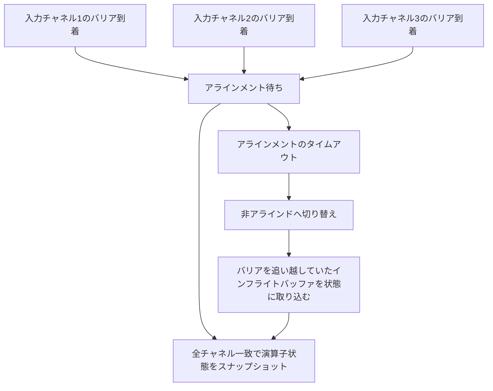

# 第21章 バリアのアラインメントと非アラインドチェックポイント

> **本章で読むソース**
>
> - [`CheckpointBarrierHandler.java`](https://github.com/apache/flink/blob/release-2.3.0/flink-runtime/src/main/java/org/apache/flink/streaming/runtime/io/checkpointing/CheckpointBarrierHandler.java)
> - [`SingleCheckpointBarrierHandler.java`](https://github.com/apache/flink/blob/release-2.3.0/flink-runtime/src/main/java/org/apache/flink/streaming/runtime/io/checkpointing/SingleCheckpointBarrierHandler.java)
> - [`BarrierHandlerState.java`](https://github.com/apache/flink/blob/release-2.3.0/flink-runtime/src/main/java/org/apache/flink/streaming/runtime/io/checkpointing/BarrierHandlerState.java)
> - [`AbstractAlignedBarrierHandlerState.java`](https://github.com/apache/flink/blob/release-2.3.0/flink-runtime/src/main/java/org/apache/flink/streaming/runtime/io/checkpointing/AbstractAlignedBarrierHandlerState.java)
> - [`WaitingForFirstBarrier.java`](https://github.com/apache/flink/blob/release-2.3.0/flink-runtime/src/main/java/org/apache/flink/streaming/runtime/io/checkpointing/WaitingForFirstBarrier.java)
> - [`AlternatingCollectingBarriersUnaligned.java`](https://github.com/apache/flink/blob/release-2.3.0/flink-runtime/src/main/java/org/apache/flink/streaming/runtime/io/checkpointing/AlternatingCollectingBarriersUnaligned.java)
> - [`ChannelState.java`](https://github.com/apache/flink/blob/release-2.3.0/flink-runtime/src/main/java/org/apache/flink/streaming/runtime/io/checkpointing/ChannelState.java)
> - [`CheckpointedInputGate.java`](https://github.com/apache/flink/blob/release-2.3.0/flink-runtime/src/main/java/org/apache/flink/streaming/runtime/io/checkpointing/CheckpointedInputGate.java)
> - [`RemoteInputChannel.java`](https://github.com/apache/flink/blob/release-2.3.0/flink-runtime/src/main/java/org/apache/flink/runtime/io/network/partition/consumer/RemoteInputChannel.java)

## この章の狙い

第20章では、`CheckpointCoordinator` がジョブ全体のチェックポイントを起動し、各サブタスクへ`CheckpointBarrier`を配る側を見た。

本章はその受け手側にあたる。

1つのサブタスクには、第17章で見た複数の入力チャネルからレコードとバリアが混在して届く。

演算子の状態を一貫したスナップショットとして切り出すには、すべての入力チャネルが同じチェックポイントのバリアに追いついた瞬間を捉える必要がある。

この「バリアを揃える」処理を**アラインメント**と呼ぶ。

本章では、`SingleCheckpointBarrierHandler`と、そのふるまいを状態機械として表す`BarrierHandlerState`の実装から、アラインドチェックポイントと**非アラインドチェックポイント**（unaligned checkpoint）がどのように1つの枠組みで実装されているかを読む。

## 前提

`StreamTask`（第13章）は、入力ゲートから読み出したレコードとイベントを`CheckpointedInputGate`経由で受け取る。

`CheckpointedInputGate`は、読み出したイベントが`CheckpointBarrier`であれば、自分では処理せず`CheckpointBarrierHandler#processBarrier`へ委譲する。

[`CheckpointedInputGate.java` L178-L186](https://github.com/apache/flink/blob/release-2.3.0/flink-runtime/src/main/java/org/apache/flink/streaming/runtime/io/checkpointing/CheckpointedInputGate.java#L178-L186)

```java
private Optional<BufferOrEvent> handleEvent(BufferOrEvent bufferOrEvent) throws IOException {
    Class<? extends AbstractEvent> eventClass = bufferOrEvent.getEvent().getClass();
    if (eventClass == CheckpointBarrier.class) {
        CheckpointBarrier checkpointBarrier = (CheckpointBarrier) bufferOrEvent.getEvent();
        barrierHandler.processBarrier(checkpointBarrier, bufferOrEvent.getChannelInfo(), false);
    } else if (eventClass == CancelCheckpointMarker.class) {
        barrierHandler.processCancellationBarrier(
                (CancelCheckpointMarker) bufferOrEvent.getEvent(),
                bufferOrEvent.getChannelInfo());
    // ... (中略、EndOfData / EndOfPartitionEvent / EventAnnouncement の分岐)
    }
    return Optional.of(bufferOrEvent);
}
```

`CheckpointBarrierHandler`はこの委譲を受ける抽象クラスであり、`processBarrier`のほか、バリアの事前通知を扱う`processBarrierAnnouncement`、チェックポイントの中止を伝える`processCancellationBarrier`を定義する。

[`CheckpointBarrierHandler.java` L94-L106](https://github.com/apache/flink/blob/release-2.3.0/flink-runtime/src/main/java/org/apache/flink/streaming/runtime/io/checkpointing/CheckpointBarrierHandler.java#L94-L106)

```java
public abstract void processBarrier(
        CheckpointBarrier receivedBarrier, InputChannelInfo channelInfo, boolean isRpcTriggered)
        throws IOException;

public abstract void processBarrierAnnouncement(
        CheckpointBarrier announcedBarrier, int sequenceNumber, InputChannelInfo channelInfo)
        throws IOException;

public abstract void processCancellationBarrier(
        CancelCheckpointMarker cancelBarrier, InputChannelInfo channelInfo) throws IOException;

public abstract void processEndOfPartition(InputChannelInfo channelInfo) throws IOException;
```

Flink 2.3.0では、この抽象クラスの実装は`SingleCheckpointBarrierHandler`1つに統一されている。

アラインドチェックポイントと非アラインドチェックポイント、両者を切り替える**alternating**（交互）モードは、同じ`SingleCheckpointBarrierHandler`のインスタンスが、内部に保持する`BarrierHandlerState`を差し替えることで実現される。

## processBarrier からアラインメントへ

`processBarrier`は、受け取ったバリアが既知のチェックポイントに対するものかを判定したのち、実際の状態遷移を`markCheckpointAlignedAndTransformState`に委ねる。

[`SingleCheckpointBarrierHandler.java` L213-L235](https://github.com/apache/flink/blob/release-2.3.0/flink-runtime/src/main/java/org/apache/flink/streaming/runtime/io/checkpointing/SingleCheckpointBarrierHandler.java#L213-L235)

```java
@Override
public void processBarrier(
        CheckpointBarrier barrier, InputChannelInfo channelInfo, boolean isRpcTriggered)
        throws IOException {
    long barrierId = barrier.getId();
    LOG.debug("{}: Received barrier from channel {} @ {}.", taskName, channelInfo, barrierId);

    if (currentCheckpointId > barrierId
            || (currentCheckpointId == barrierId && !isCheckpointPending())) {
        if (!barrier.getCheckpointOptions().isUnalignedCheckpoint()) {
            inputs[channelInfo.getGateIdx()].resumeConsumption(channelInfo);
        }
        return;
    }

    checkNewCheckpoint(barrier);
    checkState(currentCheckpointId == barrierId);

    markCheckpointAlignedAndTransformState(
            channelInfo,
            barrier,
            state -> state.barrierReceived(context, channelInfo, barrier, !isRpcTriggered));
}
```

`markCheckpointAlignedAndTransformState`は、バリアを受け取ったチャネルを`alignedChannels`集合へ加え、この集合が対象チャネル数（`targetChannelCount`）に達したかどうかで「アラインメント完了」を判定する。

[`SingleCheckpointBarrierHandler.java` L237-L279](https://github.com/apache/flink/blob/release-2.3.0/flink-runtime/src/main/java/org/apache/flink/streaming/runtime/io/checkpointing/SingleCheckpointBarrierHandler.java#L237-L279)

```java
protected void markCheckpointAlignedAndTransformState(
        InputChannelInfo alignedChannel,
        CheckpointBarrier barrier,
        FunctionWithException<BarrierHandlerState, BarrierHandlerState, Exception>
                stateTransformer)
        throws IOException {

    alignedChannels.add(alignedChannel);
    if (alignedChannels.size() == 1) {
        if (targetChannelCount == 1) {
            markAlignmentStartAndEnd(barrier.getId(), barrier.getTimestamp());
        } else {
            markAlignmentStart(barrier.getId(), barrier.getTimestamp());
        }
    }

    // we must mark alignment end before calling currentState.barrierReceived which might
    // trigger a checkpoint with unfinished future for alignment duration
    if (alignedChannels.size() == targetChannelCount) {
        if (targetChannelCount > 1) {
            markAlignmentEnd();
        }
    }

    try {
        currentState = stateTransformer.apply(currentState);
    } catch (CheckpointException e) {
        abortInternal(currentCheckpointId, e);
    } catch (Exception e) {
        ExceptionUtils.rethrowIOException(e);
    }

    if (alignedChannels.size() == targetChannelCount) {
        alignedChannels.clear();
        lastCancelledOrCompletedCheckpointId = currentCheckpointId;
        LOG.debug(
                "{}: All the channels are aligned for checkpoint {}.",
                taskName,
                currentCheckpointId);
        resetAlignmentTimer();
        allBarriersReceivedFuture.complete(null);
    }
}
```

ここで実行される`currentState.barrierReceived(...)`が、実際に「先行チャネルを止める」か「止めずに素通りさせる」かを決める。

その判断は`SingleCheckpointBarrierHandler`自身ではなく、`currentState`が指す`BarrierHandlerState`の実装に委ねられている。

## BarrierHandlerState という状態機械

`BarrierHandlerState`は、チェックポイント処理の1状態を表すインタフェースである。

javadocは、アラインドかどうか、バリア待ちか収集中かで組み合わさる4つの基本状態があると述べている。

[`BarrierHandlerState.java` L29-L41](https://github.com/apache/flink/blob/release-2.3.0/flink-runtime/src/main/java/org/apache/flink/streaming/runtime/io/checkpointing/BarrierHandlerState.java#L29-L41)

```java
/**
 * Represents a state in a state machine of processing a checkpoint. There are 4 base states:
 *
 * <ul>
 *   <li>Waiting for an aligned barrier
 *   <li>Collecting aligned barriers
 *   <li>Waiting for an unaligned barrier
 *   <li>Collecting unaligned barriers
 * </ul>
 *
 * <p>Additionally depending on the configuration we can switch between aligned and unaligned
 * actions.
 */
interface BarrierHandlerState {
```

`barrierReceived`は、バリアを受け取ったときに呼ばれ、次の状態を返す。

[`BarrierHandlerState.java` L51-L61](https://github.com/apache/flink/blob/release-2.3.0/flink-runtime/src/main/java/org/apache/flink/streaming/runtime/io/checkpointing/BarrierHandlerState.java#L51-L61)

```java
BarrierHandlerState barrierReceived(
        Controller controller,
        InputChannelInfo channelInfo,
        CheckpointBarrier checkpointBarrier,
        boolean markChannelBlocked)
        throws IOException, CheckpointException;

BarrierHandlerState abort(long cancelledId) throws IOException;

BarrierHandlerState endOfPartitionReceived(Controller controller, InputChannelInfo channelInfo)
        throws IOException, CheckpointException;
```

`Controller`は、`BarrierHandlerState`の実装が`SingleCheckpointBarrierHandler`側の状態（すべてのバリアが揃ったか、グローバルチェックポイントを起動するか）を参照したり操作したりするための狭い窓口である。

[`BarrierHandlerState.java` L63-L78](https://github.com/apache/flink/blob/release-2.3.0/flink-runtime/src/main/java/org/apache/flink/streaming/runtime/io/checkpointing/BarrierHandlerState.java#L63-L78)

```java
interface Controller {
    boolean allBarriersReceived();

    @Nullable
    CheckpointBarrier getPendingCheckpointBarrier();

    void triggerGlobalCheckpoint(CheckpointBarrier checkpointBarrier) throws IOException;

    void initInputsCheckpoint(CheckpointBarrier checkpointBarrier) throws CheckpointException;

    boolean isTimedOut(CheckpointBarrier barrier);
}
```

## アラインドチェックポイント: 先行チャネルを止める

アラインドチェックポイントの状態遷移は`AbstractAlignedBarrierHandlerState`が担う。

`WaitingForFirstBarrier`（まだどのチャネルからもバリアを受け取っていない状態）はこれを継承し、最初のバリアを受け取った後の遷移先だけを`CollectingBarriers`として指定する。

[`WaitingForFirstBarrier.java` L26-L36](https://github.com/apache/flink/blob/release-2.3.0/flink-runtime/src/main/java/org/apache/flink/streaming/runtime/io/checkpointing/WaitingForFirstBarrier.java#L26-L36)

```java
/** We are performing aligned checkpoints. We have not seen any barriers yet. */
final class WaitingForFirstBarrier extends AbstractAlignedBarrierHandlerState {

    WaitingForFirstBarrier(CheckpointableInput[] inputs) {
        super(new ChannelState(inputs));
    }

    @Override
    protected BarrierHandlerState convertAfterBarrierReceived(ChannelState state) {
        return new CollectingBarriers(state);
    }
```

`barrierReceived`の共通ロジックは`AbstractAlignedBarrierHandlerState`側にある。

バリアを受け取ったチャネルを`state.blockChannel`でブロックし、すべてのチャネルが揃うまで`convertAfterBarrierReceived`が返す次の状態（`CollectingBarriers`）へ遷移し続ける。

[`AbstractAlignedBarrierHandlerState.java` L52-L77](https://github.com/apache/flink/blob/release-2.3.0/flink-runtime/src/main/java/org/apache/flink/streaming/runtime/io/checkpointing/AbstractAlignedBarrierHandlerState.java#L52-L77)

```java
@Override
public final BarrierHandlerState barrierReceived(
        Controller controller,
        InputChannelInfo channelInfo,
        CheckpointBarrier checkpointBarrier,
        boolean markChannelBlocked)
        throws IOException, CheckpointException {
    checkState(!checkpointBarrier.getCheckpointOptions().isUnalignedCheckpoint());

    if (markChannelBlocked) {
        state.blockChannel(channelInfo);
    }

    if (controller.allBarriersReceived()) {
        return triggerGlobalCheckpoint(controller, checkpointBarrier);
    }

    return convertAfterBarrierReceived(state);
}

protected WaitingForFirstBarrier triggerGlobalCheckpoint(
        Controller controller, CheckpointBarrier checkpointBarrier) throws IOException {
    controller.triggerGlobalCheckpoint(checkpointBarrier);
    state.unblockAllChannels();
    return new WaitingForFirstBarrier(state.getInputs());
}
```

`state.blockChannel`は、`ChannelState`を経由して該当チャネルの`blockConsumption`を呼ぶ。

[`ChannelState.java` L54-L57](https://github.com/apache/flink/blob/release-2.3.0/flink-runtime/src/main/java/org/apache/flink/streaming/runtime/io/checkpointing/ChannelState.java#L54-L57)

```java
public void blockChannel(InputChannelInfo channelInfo) {
    inputs[channelInfo.getGateIdx()].blockConsumption(channelInfo);
    blockedChannels.add(channelInfo);
}
```

`blockConsumption`は第17章で見たクレジットベースフロー制御の入力ゲート側の操作であり、該当チャネルからの読み出しを一時停止する。

つまりアラインメントとは、バリアが先着したチャネルの読み出しを止め、遅れているチャネルにバリアが追いつくまで待つ処理である。

全チャネルが揃うと`triggerGlobalCheckpoint`が呼ばれ、演算子のスナップショットが1つの一貫した時点として確定したのち、`unblockAllChannels`ですべてのチャネルの読み出しを再開する。

このとき、揃うのを待つ間にブロックされたチャネルの後ろには、次のチェックポイント以降のレコードが積み上がり続ける。

上流の処理が遅い、あるいは下流がバックプレッシャーを受けている状況では、この待ち時間がチェックポイント全体の遅延に直結する。

## 非アラインドチェックポイント: バリアを追い越す

非アラインドチェックポイントは、この待ち時間を避けるために、バリアより先に届いていたレコードをブロックせず、そのままインフライトのバッファごと状態として取り込む。

対応する状態は`AlternatingCollectingBarriersUnaligned`である。

javadocは「少なくとも1つのバリアを受け取り済みで、残りのバリアを待っている」状態だと説明する。

[`AlternatingCollectingBarriersUnaligned.java` L30-L42](https://github.com/apache/flink/blob/release-2.3.0/flink-runtime/src/main/java/org/apache/flink/streaming/runtime/io/checkpointing/AlternatingCollectingBarriersUnaligned.java#L30-L42)

```java
/**
 * We either timed out or started unaligned. We have seen at least one barrier and we are waiting
 * for the remaining barriers.
 */
final class AlternatingCollectingBarriersUnaligned implements BarrierHandlerState {

    private final boolean alternating;
    private final ChannelState channelState;

    AlternatingCollectingBarriersUnaligned(boolean alternating, ChannelState channelState) {
        this.alternating = alternating;
        this.channelState = channelState;
    }
```

`barrierReceived`を見ると、`AbstractAlignedBarrierHandlerState`とは対照的に、通常のケースではチャネルをブロックしない。

[`AlternatingCollectingBarriersUnaligned.java` L60-L78](https://github.com/apache/flink/blob/release-2.3.0/flink-runtime/src/main/java/org/apache/flink/streaming/runtime/io/checkpointing/AlternatingCollectingBarriersUnaligned.java#L60-L78)

```java
@Override
public BarrierHandlerState barrierReceived(
        Controller controller,
        InputChannelInfo channelInfo,
        CheckpointBarrier checkpointBarrier,
        boolean markChannelBlocked)
        throws CheckpointException, IOException {
    // we received an out of order aligned barrier, we should book keep this channel as blocked,
    // as it is being blocked by the credit-based network
    if (markChannelBlocked
            && !checkpointBarrier.getCheckpointOptions().isUnalignedCheckpoint()) {
        channelState.blockChannel(channelInfo);
    }

    if (controller.allBarriersReceived()) {
        return finishCheckpoint(checkpointBarrier.getId());
    }
    return this;
}
```

ブロックが発生するのは、対向するチャネルが偶然すでにアラインドなバリアを送ってきていた場合だけであり、非アラインドなバリア自体はチャネルを止めない。

バリアより前に届いていたレコードがどうなるかは、`SingleCheckpointBarrierHandler`より下のレイヤー、入力チャネルの実装が担う。

`RemoteInputChannel#checkpointStarted`は、チェックポイントの開始時点でチャネルの受信キューに残っている未処理バッファを、丸ごとチェックポイントの状態として書き出す対象に登録する。

[`RemoteInputChannel.java` L709-L731](https://github.com/apache/flink/blob/release-2.3.0/flink-runtime/src/main/java/org/apache/flink/runtime/io/network/partition/consumer/RemoteInputChannel.java#L709-L731)

```java
/**
 * Spills all queued buffers on checkpoint start. If barrier has already been received (and
 * reordered), spill only the overtaken buffers.
 */
public void checkpointStarted(CheckpointBarrier barrier) throws CheckpointException {
    synchronized (receivedBuffers) {
        if (barrier.getId() < lastBarrierId) {
            throw new CheckpointException(
                    String.format(
                            "Sequence number for checkpoint %d is not known (it was likely been overwritten by a newer checkpoint %d)",
                            barrier.getId(), lastBarrierId),
                    CheckpointFailureReason
                            .CHECKPOINT_SUBSUMED); // currently, at most one active unaligned
            // checkpoint is possible
        } else if (barrier.getId() > lastBarrierId) {
            // This channel has received some obsolete barrier, older compared to the
            // checkpointId
            // which we are processing right now, and we should ignore that obsoleted checkpoint
            // barrier sequence number.
            resetLastBarrier();
        }

        channelStatePersister.startPersisting(
                barrier.getId(), getInflightBuffersUnsafe(barrier.getId()));
    }
}
```

javadocにある「バリアを追い越したバッファだけを吐き出す」（spill only the overtaken buffers）という一文が、非アラインドチェックポイントの本質を表している。

バリアより前に届いていたレコードは、アラインドチェックポイントであればブロックされたチャネルの中で待たされたはずのレコードであり、非アラインドチェックポイントではそれらをアラインメント待ちにする代わりに、そのままチェックポイントの一部として保存する。

すべてのチャネルからバリアを受け取り終えると、`finishCheckpoint`がチャネルごとの`checkpointStopped`を呼んでインフライトバッファの取り込みを終了させ、次のチェックポイントに備えて状態を初期化する。

[`AlternatingCollectingBarriersUnaligned.java` L100-L110](https://github.com/apache/flink/blob/release-2.3.0/flink-runtime/src/main/java/org/apache/flink/streaming/runtime/io/checkpointing/AlternatingCollectingBarriersUnaligned.java#L100-L110)

```java
private BarrierHandlerState finishCheckpoint(long cancelledId) throws IOException {
    for (CheckpointableInput input : channelState.getInputs()) {
        input.checkpointStopped(cancelledId);
    }
    channelState.unblockAllChannels();
    if (alternating) {
        return new AlternatingWaitingForFirstBarrier(channelState.emptyState());
    } else {
        return new AlternatingWaitingForFirstBarrierUnaligned(false, channelState.emptyState());
    }
}
```

## alternating: バックプレッシャーに応じた切り替え

`SingleCheckpointBarrierHandler`には、アラインドと非アラインドを固定するファクトリメソッド（`aligned`、`unaligned`）に加えて、`alternating`という第3のモードがある。

[`SingleCheckpointBarrierHandler.java` L168-L188](https://github.com/apache/flink/blob/release-2.3.0/flink-runtime/src/main/java/org/apache/flink/streaming/runtime/io/checkpointing/SingleCheckpointBarrierHandler.java#L168-L188)

```java
public static SingleCheckpointBarrierHandler alternating(
        String taskName,
        CheckpointableTask toNotifyOnCheckpoint,
        SubtaskCheckpointCoordinator checkpointCoordinator,
        Clock clock,
        int numOpenChannels,
        DelayableTimer registerTimer,
        boolean enableCheckpointAfterTasksFinished,
        CheckpointableInput... inputs) {
    return new SingleCheckpointBarrierHandler(
            taskName,
            toNotifyOnCheckpoint,
            checkpointCoordinator,
            clock,
            numOpenChannels,
            new AlternatingWaitingForFirstBarrier(new ChannelState(inputs)),
            true,
            registerTimer,
            inputs,
            enableCheckpointAfterTasksFinished);
}
```

`alternating`モードは、チェックポイントをまずアラインドとして開始し、アラインメントの待ち時間が設定した閾値を超えたときだけ非アラインドへ切り替える。

`checkNewCheckpoint`は、バリアが**timeoutable**（タイムアウト可能）であれば、アラインメントのタイムアウトを監視するタイマーを登録する。

[`SingleCheckpointBarrierHandler.java` L335-L353](https://github.com/apache/flink/blob/release-2.3.0/flink-runtime/src/main/java/org/apache/flink/streaming/runtime/io/checkpointing/SingleCheckpointBarrierHandler.java#L335-L353)

```java
private void checkNewCheckpoint(CheckpointBarrier barrier) throws IOException {
    long barrierId = barrier.getId();
    if (currentCheckpointId >= barrierId) {
        return; // This barrier is not the first for this checkpoint.
    }

    if (isCheckpointPending()) {
        cancelSubsumedCheckpoint(barrierId);
    }
    currentCheckpointId = barrierId;
    pendingCheckpointBarrier = barrier;
    alignedChannels.clear();
    targetChannelCount = numOpenChannels;
    allBarriersReceivedFuture = new CompletableFuture<>();

    if (alternating && barrier.getCheckpointOptions().isTimeoutable()) {
        registerAlignmentTimer(barrier);
    }
}
```

このタイマーが発火すると、`currentState.alignedCheckpointTimeout`が呼ばれ、`AlternatingWaitingForFirstBarrier`系の状態は自分自身を`AlternatingCollectingBarriersUnaligned`へ差し替える。

これによって、アラインメント中のチェックポイントがバックプレッシャーの影響で長引いている場合だけ、そのチェックポイントに限って非アラインドへ切り替わり、ブロックされていたチャネルは即座に読み出しを再開する。

平常時はアラインドチェックポイントのまま、状態のスナップショットに余分なインフライトバッファを含めずに完了する。



## この設計がなぜバックプレッシャー下の遅延を抑えるか

アラインドチェックポイントは、先着したバリアの後ろでチャネルの読み出しを止めることで、演算子状態のスナップショットを取る瞬間を全チャネルで一致させる。

この一致こそがチェックポイントの正しさを支えており、リカバリ時には、保存された演算子状態から再開しさえすれば、各入力チャネルの後続レコードを重複や欠落なく再生できる。

一方でこの方式は、遅いチャネル1本のためにほかのすべてのチャネルを待たせるという代償を払う。

バックプレッシャーがかかっている状況では、下流の処理速度がボトルネックとなり、バリアがそのボトルネックに追いつくまで長い時間を要する。

非アラインドチェックポイントは、この待ち時間そのものを消す。

バリアを追い越していたレコードをブロックして待たせる代わりに、`RemoteInputChannel#checkpointStarted`が示すとおり、そのレコードをバッファのまま状態の一部として書き出す。

演算子の状態と、まだ処理されていないインフライトのレコードを合わせて1つのスナップショットとみなすことで、アラインメントという同期点を作らずに済む。

その代わり、リカバリ時にはインフライトバッファを演算子の状態と一緒に復元し、まだ処理していないレコードとして再投入する処理が追加で必要になる（この復元は第22章で扱う）。

チェックポイントのスナップショットに含める対象が「演算子の状態だけ」か「演算子の状態とインフライトバッファ」かという違いが、アラインドと非アラインドの本質的なトレードオフである。

`alternating`モードは、両者を対立する二択として固定せず、アラインメントの遅延が閾値を超えたチェックポイントに限って非アラインドへ切り替えることで、平常時はスナップショットを軽量に保ちながら、バックプレッシャー下でもチェックポイントの完了を遅延させない。

## まとめ

`CheckpointedInputGate`は、入力チャネルから読み出した`CheckpointBarrier`を`CheckpointBarrierHandler#processBarrier`へ委譲し、実際のアラインメント判定は行わない。

Flink 2.3.0では、この抽象クラスの唯一の実装である`SingleCheckpointBarrierHandler`が、内部に保持する`BarrierHandlerState`を状態機械として差し替えることで、アラインド、非アラインド、両者を切り替える`alternating`の3方式を1つの枠組みで表現する。

`AbstractAlignedBarrierHandlerState`は、バリアを受け取ったチャネルを`blockChannel`でブロックし、全チャネルが揃うまで待たせる。

`AlternatingCollectingBarriersUnaligned`はチャネルをブロックせず、バリアより前に届いていたバッファを`RemoteInputChannel#checkpointStarted`によってそのままチェックポイントの状態に取り込む。

`alternating`モードは、アラインメントのタイムアウトを監視するタイマーによって、バックプレッシャーで長引いているチェックポイントだけを非アラインドへ切り替え、平常時の軽量さとバックプレッシャー下での遅延回避を両立させる。

## 関連する章

- [第17章 クレジットベースフロー制御とネットワークバッファ](../part05-network/17-credit-flow-buffers.md)
- [第20章 CheckpointCoordinator](20-checkpoint-coordinator.md)
- [第22章 リカバリとリスケール](22-recovery-rescale.md)
