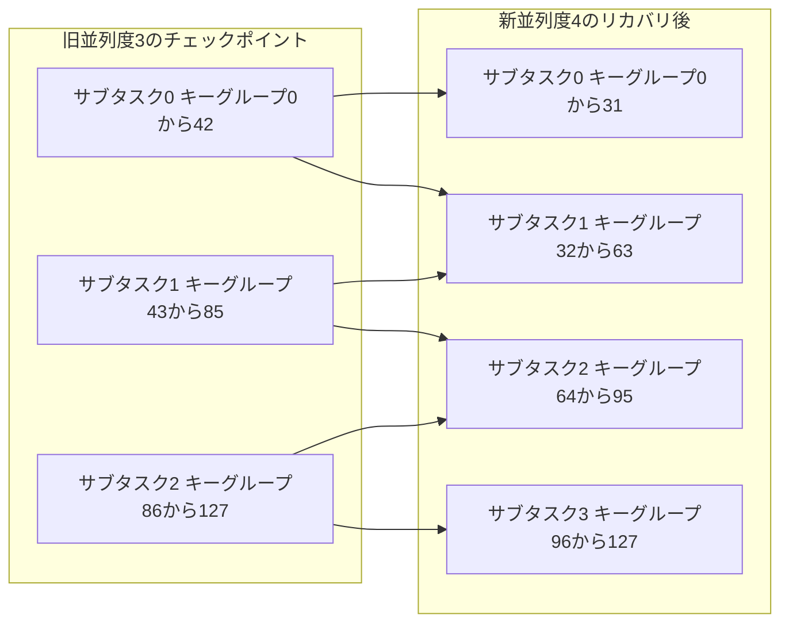

# 第22章 リカバリと状態の再配分

> **本章で読むソース**
>
> - [`StateAssignmentOperation.java`](https://github.com/apache/flink/blob/release-2.3.0/flink-runtime/src/main/java/org/apache/flink/runtime/checkpoint/StateAssignmentOperation.java)
> - [`KeyGroupRangeAssignment.java`](https://github.com/apache/flink/blob/release-2.3.0/flink-runtime/src/main/java/org/apache/flink/runtime/state/KeyGroupRangeAssignment.java)
> - [`RoundRobinOperatorStateRepartitioner.java`](https://github.com/apache/flink/blob/release-2.3.0/flink-runtime/src/main/java/org/apache/flink/runtime/checkpoint/RoundRobinOperatorStateRepartitioner.java)
> - [`CheckpointCoordinator.java`](https://github.com/apache/flink/blob/release-2.3.0/flink-runtime/src/main/java/org/apache/flink/runtime/checkpoint/CheckpointCoordinator.java)
> - [`SchedulerBase.java`](https://github.com/apache/flink/blob/release-2.3.0/flink-runtime/src/main/java/org/apache/flink/runtime/scheduler/SchedulerBase.java)

## この章の狙い

第19章では、単一のサブタスクが状態バックエンドを介してキー付き状態と演算子状態をどう読み書きするかを見た。

第20章では、`CheckpointCoordinator` が実行中の全サブタスクへバリアの注入を指示し、各サブタスクからのスナップショットを `CompletedCheckpoint` へ集約するところまでを見た。

チェックポイントは、保存した時点の並列度に紐づいた状態の集合にすぎない。

ジョブが失敗から復旧するとき、あるいは利用者が並列度を変更して再起動するとき、保存済みの状態は新しいジョブに対して改めて割り当て直さなければならない。

本章では、この割り当てを担う `StateAssignmentOperation` を中心に、キー付き状態と演算子状態のそれぞれがどのような単位で新しい並列度のサブタスクへ再配分されるかを読む。

あわせて、`CheckpointCoordinator` から `StateAssignmentOperation` が呼び出されるまでの、失敗検知からリカバリ実行に至る経路を概観する。

## 前提

チェックポイントに含まれる状態は、演算子ごとに `OperatorState` としてまとめられている（第20章）。

`OperatorState` は、チェックポイントを取得した時点の並列度ぶんの `OperatorSubtaskState` を保持し、各 `OperatorSubtaskState` はキー付き状態のハンドルと演算子状態のハンドルを両方持つ。

キー付き状態は、第19章で見たとおり、キーのハッシュ値から求めた**キーグループ**（key group）と呼ぶ区間に分割されており、各サブタスクはこのキーグループのある連続範囲（`KeyGroupRange`）を担当する。

演算子状態は、キーに紐づかない状態であり、`ManagedOperatorState`（マネージド演算子状態）と `RawOperatorState`（生の演算子状態）に分かれる。

これらをリカバリ時にどう再配分するかが本章の主題であり、キー付き状態と演算子状態では再配分の考え方が異なる。

## StateAssignmentOperation の全体の流れ

`StateAssignmentOperation` は、リカバリ時に保存済み状態を復元対象のタスクへ割り当てる処理をカプセル化したクラスである。

[`StateAssignmentOperation.java` L64-L69](https://github.com/apache/flink/blob/release-2.3.0/flink-runtime/src/main/java/org/apache/flink/runtime/checkpoint/StateAssignmentOperation.java#L64-L69)

```java
/**
 * This class encapsulates the operation of assigning restored state when restoring from a
 * checkpoint.
 */
@Internal
public class StateAssignmentOperation {
```

公開されているエントリポイントは `assignStates` の1メソッドであり、内部で4段階の処理を順に呼び出す。

[`StateAssignmentOperation.java` L105-L114](https://github.com/apache/flink/blob/release-2.3.0/flink-runtime/src/main/java/org/apache/flink/runtime/checkpoint/StateAssignmentOperation.java#L105-L114)

```java
    public void assignStates() {
        checkStateMappingCompleteness(allowNonRestoredState, operatorStates, tasks);

        buildStateAssignments();

        repartitionState();

        // actually assign the state
        applyStateAssignments();
    }
```

`checkStateMappingCompleteness` は、チェックポイントに含まれる演算子の状態がすべて復元対象の `ExecutionJobVertex` 側に対応する演算子を持つかを検証する。

対応する演算子が見つからない状態は、`allowNonRestoredState` が真であればログに記録して読み捨て、偽であれば例外を投げてリカバリを中断する。

`buildStateAssignments` は、各 `ExecutionJobVertex` に対して `TaskStateAssignment` という作業用オブジェクトを用意し、演算子IDをキーにして旧チェックポイントの状態と紐づける。

`repartitionState` が本章の中心であり、キー付き状態と演算子状態を新しい並列度のサブタスクへ再配分する。

`applyStateAssignments` は、再配分結果を実際に `Execution`（第9章）へ `JobManagerTaskRestore` として設定し、各サブタスクが起動時にどの状態ハンドルを読み込むかを確定させる。

## 演算子状態の再配分：ラウンドロビン

演算子状態とキー付き状態を実際に再配分するのは `assignAttemptState` である。

[`StateAssignmentOperation.java` L200-L246](https://github.com/apache/flink/blob/release-2.3.0/flink-runtime/src/main/java/org/apache/flink/runtime/checkpoint/StateAssignmentOperation.java#L200-L246)

```java
    private void assignAttemptState(TaskStateAssignment taskStateAssignment) {

        // 1. first compute the new parallelism
        checkParallelismPreconditions(taskStateAssignment);

        List<KeyGroupRange> keyGroupPartitions =
                createKeyGroupPartitions(
                        taskStateAssignment.executionJobVertex.getMaxParallelism(),
                        taskStateAssignment.newParallelism);

        /*
         * Redistribute ManagedOperatorStates and RawOperatorStates from old parallelism to new parallelism.
         *
         * The old ManagedOperatorStates with old parallelism 3:
         *
         * 		parallelism0 parallelism1 parallelism2
         * op0   states0,0    state0,1	   state0,2
         * op1
         * op2   states2,0    state2,1	   state2,2
         * op3   states3,0    state3,1     state3,2
         *
         * The new ManagedOperatorStates with new parallelism 4:
         *
         * 		parallelism0 parallelism1 parallelism2 parallelism3
         * op0   state0,0	  state0,1 	   state0,2		state0,3
         * op1
         * op2   state2,0	  state2,1 	   state2,2		state2,3
         * op3   state3,0	  state3,1 	   state3,2		state3,3
         */
        reDistributePartitionableStates(
                taskStateAssignment.oldState,
                taskStateAssignment.newParallelism,
                OperatorSubtaskState::getManagedOperatorState,
                RoundRobinOperatorStateRepartitioner.INSTANCE,
                taskStateAssignment.subManagedOperatorState);
        reDistributePartitionableStates(
                taskStateAssignment.oldState,
                taskStateAssignment.newParallelism,
                OperatorSubtaskState::getRawOperatorState,
                RoundRobinOperatorStateRepartitioner.INSTANCE,
                taskStateAssignment.subRawOperatorState);

        reDistributeInputChannelStates(taskStateAssignment);
        reDistributeResultSubpartitionStates(taskStateAssignment);

        reDistributeKeyedStates(keyGroupPartitions, taskStateAssignment);
    }
```

コメントの図が示すとおり、演算子状態は旧並列度のサブタスクが持つ状態片を集めて、新並列度のサブタスクへ**ラウンドロビン**で配り直す。

実際の配分は `RoundRobinOperatorStateRepartitioner` が担う。

演算子状態は `OperatorStateHandle.Mode` によって `SPLIT_DISTRIBUTE`（分割して配る）、`UNION`（全サブタスクが全体を受け取る）、`BROADCAST`（同じ内容を複製する）の3種類に分かれ、モードごとに配分方法が異なる。

並列度が変わらないリカバリでは、`UNION` 状態と一部完了済みの `BROADCAST` 状態だけを再計算し、それ以外はそのまま返す最適化が入っている。

[`RoundRobinOperatorStateRepartitioner.java` L53-L81](https://github.com/apache/flink/blob/release-2.3.0/flink-runtime/src/main/java/org/apache/flink/runtime/checkpoint/RoundRobinOperatorStateRepartitioner.java#L53-L81)

```java
    @Override
    public List<List<OperatorStateHandle>> repartitionState(
            List<List<OperatorStateHandle>> previousParallelSubtaskStates,
            int oldParallelism,
            int newParallelism) {

        Preconditions.checkNotNull(previousParallelSubtaskStates);
        Preconditions.checkArgument(newParallelism > 0);
        Preconditions.checkArgument(
                previousParallelSubtaskStates.size() == oldParallelism,
                "This method still depends on the order of the new and old operators");

        // Assemble result from all merge maps
        List<List<OperatorStateHandle>> result = new ArrayList<>(newParallelism);

        List<Map<StreamStateHandle, OperatorStateHandle>> mergeMapList;

        // We only round-robin repartition UNION state if new parallelism equals to the old one.
        if (newParallelism == oldParallelism) {
            Map<String, List<Tuple2<StreamStateHandle, OperatorStateHandle.StateMetaInfo>>>
                    unionStates = collectUnionStates(previousParallelSubtaskStates);

            Map<String, List<Tuple2<StreamStateHandle, OperatorStateHandle.StateMetaInfo>>>
                    partlyFinishedBroadcastStates =
                            collectPartlyFinishedBroadcastStates(previousParallelSubtaskStates);

            if (unionStates.isEmpty() && partlyFinishedBroadcastStates.isEmpty()) {
                return previousParallelSubtaskStates;
            }
```

演算子状態にはキー付き状態のようなキーグループ対応がないため、キーグループ単位の再割り当ては使えない。
かわりに `OperatorStateHandle.Mode` ごとの契約に従って再配分される。
`SPLIT_DISTRIBUTE` は状態パーティションを分割して各サブタスクへ配り、`UNION` は全パーティションを全サブタスクへ配布し、`BROADCAST` は各サブタスクが同一の状態を持つ前提で割り当てる。
`SPLIT_DISTRIBUTE` の再配分にはラウンドロビン方式を使う。

## キー付き状態の再配分単位：キーグループ

キー付き状態は演算子状態と異なり、任意の順序で配り直すわけにはいかない。

各キーは決まったキーグループへハッシュされており、あるサブタスクが処理するレコードのキーと、そのサブタスクが読み込む状態のキーグループが一致していなければ、状態を正しく引けない。

この対応関係を保ったまま並列度を変えるための単位が**キーグループ**である。

キーグループの区間をサブタスクへ割り当てる計算は `KeyGroupRangeAssignment.computeKeyGroupRangeForOperatorIndex` が担う。

[`KeyGroupRangeAssignment.java` L93-L106](https://github.com/apache/flink/blob/release-2.3.0/flink-runtime/src/main/java/org/apache/flink/runtime/state/KeyGroupRangeAssignment.java#L93-L106)

```java
    public static KeyGroupRange computeKeyGroupRangeForOperatorIndex(
            int maxParallelism, int parallelism, int operatorIndex) {

        checkParallelismPreconditions(parallelism);
        checkParallelismPreconditions(maxParallelism);

        Preconditions.checkArgument(
                maxParallelism >= parallelism,
                "Maximum parallelism must not be smaller than parallelism.");

        int start = ((operatorIndex * maxParallelism + parallelism - 1) / parallelism);
        int end = ((operatorIndex + 1) * maxParallelism - 1) / parallelism;
        return new KeyGroupRange(start, end);
    }
```

`maxParallelism`（キーグループの総数）を `parallelism`（現在の並列度）でできるだけ均等に割った区間を、`operatorIndex` 番目のサブタスクへ割り当てる。

`StateAssignmentOperation.createKeyGroupPartitions` は、この計算を新しい並列度ぶん繰り返して、サブタスクごとの `KeyGroupRange` の一覧を作る。

[`StateAssignmentOperation.java` L710-L721](https://github.com/apache/flink/blob/release-2.3.0/flink-runtime/src/main/java/org/apache/flink/runtime/checkpoint/StateAssignmentOperation.java#L710-L721)

```java
    public static List<KeyGroupRange> createKeyGroupPartitions(
            int numberKeyGroups, int parallelism) {
        Preconditions.checkArgument(numberKeyGroups >= parallelism);
        List<KeyGroupRange> result = new ArrayList<>(parallelism);

        for (int i = 0; i < parallelism; ++i) {
            result.add(
                    KeyGroupRangeAssignment.computeKeyGroupRangeForOperatorIndex(
                            numberKeyGroups, parallelism, i));
        }
        return result;
    }
```

この `KeyGroupRange` の一覧が、後続の `reDistributeKeyedStates` へ渡され、旧チェックポイントに含まれる状態ハンドルの再配分先を決める基準になる。

## キー付き状態の再配分：交差判定

`reDistributeKeyedStates` は、演算子ごとの旧状態を、新並列度の各サブタスクの `KeyGroupRange` と突き合わせて配り直す。

[`StateAssignmentOperation.java` L312-L332](https://github.com/apache/flink/blob/release-2.3.0/flink-runtime/src/main/java/org/apache/flink/runtime/checkpoint/StateAssignmentOperation.java#L312-L332)

```java
    private void reDistributeKeyedStates(
            List<KeyGroupRange> keyGroupPartitions, TaskStateAssignment stateAssignment) {
        stateAssignment.oldState.forEach(
                (operatorID, operatorState) -> {
                    for (int subTaskIndex = 0;
                            subTaskIndex < stateAssignment.newParallelism;
                            subTaskIndex++) {
                        OperatorInstanceID instanceID =
                                OperatorInstanceID.of(subTaskIndex, operatorID);
                        Tuple2<List<KeyedStateHandle>, List<KeyedStateHandle>> subKeyedStates =
                                reAssignSubKeyedStates(
                                        operatorState,
                                        keyGroupPartitions,
                                        subTaskIndex,
                                        stateAssignment.newParallelism,
                                        operatorState.getParallelism());
                        stateAssignment.subManagedKeyedState.put(instanceID, subKeyedStates.f0);
                        stateAssignment.subRawKeyedState.put(instanceID, subKeyedStates.f1);
                    }
                });
    }
```

実際の割り当てを行う `reAssignSubKeyedStates` は、並列度が変わっていなければ旧サブタスクの状態をそのまま新サブタスクへ引き継ぐ。

並列度が変わっている場合だけ、新サブタスクが担当する `KeyGroupRange` と交差する状態ハンドルを、旧チェックポイントの全サブタスク分から集めて渡す。

[`StateAssignmentOperation.java` L335-L367](https://github.com/apache/flink/blob/release-2.3.0/flink-runtime/src/main/java/org/apache/flink/runtime/checkpoint/StateAssignmentOperation.java#L335-L367)

```java
    private Tuple2<List<KeyedStateHandle>, List<KeyedStateHandle>> reAssignSubKeyedStates(
            OperatorState operatorState,
            List<KeyGroupRange> keyGroupPartitions,
            int subTaskIndex,
            int newParallelism,
            int oldParallelism) {

        List<KeyedStateHandle> subManagedKeyedState;
        List<KeyedStateHandle> subRawKeyedState;

        if (newParallelism == oldParallelism) {
            if (operatorState.getState(subTaskIndex) != null) {
                subManagedKeyedState =
                        operatorState.getState(subTaskIndex).getManagedKeyedState().asList();
                subRawKeyedState = operatorState.getState(subTaskIndex).getRawKeyedState().asList();
            } else {
                subManagedKeyedState = emptyList();
                subRawKeyedState = emptyList();
            }
        } else {
            subManagedKeyedState =
                    getManagedKeyedStateHandles(
                            operatorState, keyGroupPartitions.get(subTaskIndex));
            subRawKeyedState =
                    getRawKeyedStateHandles(operatorState, keyGroupPartitions.get(subTaskIndex));
        }

        if (subManagedKeyedState.isEmpty() && subRawKeyedState.isEmpty()) {
            return new Tuple2<>(emptyList(), emptyList());
        } else {
            return new Tuple2<>(subManagedKeyedState, subRawKeyedState);
        }
    }
```

「交差する」とは、旧サブタスクが持つ状態ハンドルの `KeyGroupRange` と、新サブタスクの `KeyGroupRange` が重なる部分を持つことを指す。

第19章で見たキー付き状態バックエンドは、状態ハンドルそのものにキーグループの区間を持たせて保存しているため、この重なりの判定と切り出しだけで、旧並列度の状態片から新並列度に必要な部分を正確に取り出せる。

1個の新サブタスクが担当するキーグループの区間が、旧並列度の複数サブタスクにまたがっていれば、その全てから該当区間を集めて1個の新サブタスクへ束ねる。

逆に並列度を減らす場合も同じ交差判定で対応でき、増減の方向によって特別な処理を分ける必要がない。

## 図：状態の再配分

保存済みの状態がキーグループ単位で新しい並列度のサブタスクへ再割り当てされる様子を示す。



新しいキーグループの区間が旧サブタスクの区間をまたぐ箇所（図のサブタスク1やサブタスク2）では、複数の旧サブタスクから状態ハンドルを集めて1個の新サブタスクへ束ねる。

## 最適化：キーグループ単位の割り当てが避ける完全な再シャッフル

キー付き状態の再配分がキーグループという固定の中間単位を経由することには、明確な利点がある。

もしキーグループという単位がなく、個々のレコードのキーごとに状態を再配分するとすれば、並列度を変えるたびに保存済みの状態を一度全て読み出し、キーのハッシュ値から新しい担当サブタスクを再計算して書き直す必要がある。

これは状態のサイズに比例した読み書きを毎回発生させ、大規模な状態を持つジョブほどリカバリに時間がかかる。

キーグループを単位にすると、この再計算はキーグループの区間同士の交差判定という軽い計算に置き換わる。

状態ハンドルはキーグループの区間ごとにまとまった塊として保存されているため、交差する塊を丸ごと新サブタスクへ渡すだけでよく、状態の中身であるキーと値のペアを1件ずつ読み直す必要がない。

これにより、任意の並列度変更を、状態の完全な再シャッフルなしに実現している。

## リカバリの経路：CheckpointCoordinator から StateAssignmentOperation まで

`StateAssignmentOperation` は単体では動かず、`CheckpointCoordinator` がリカバリ時に呼び出す。

[`CheckpointCoordinator.java` L1811-L1819](https://github.com/apache/flink/blob/release-2.3.0/flink-runtime/src/main/java/org/apache/flink/runtime/checkpoint/CheckpointCoordinator.java#L1811-L1819)

```java
            StateAssignmentOperation stateAssignmentOperation =
                    new StateAssignmentOperation(
                            latest.getCheckpointID(),
                            tasks,
                            operatorStates,
                            allowNonRestoredState,
                            recoverOutputOnDownstreamTask);

            stateAssignmentOperation.assignStates();
```

この呼び出しの手前で、`CheckpointCoordinator` は `completedCheckpointStore` から最新の `CompletedCheckpoint`（第20章）を取り出し、そこから演算子ごとの `OperatorState` を復元している。

呼び出し元は `SchedulerBase.restoreState` である。

[`SchedulerBase.java` L491-L503](https://github.com/apache/flink/blob/release-2.3.0/flink-runtime/src/main/java/org/apache/flink/runtime/scheduler/SchedulerBase.java#L491-L503)

```java
        if (isGlobalRecovery) {
            final Set<ExecutionJobVertex> jobVerticesToRestore =
                    getInvolvedExecutionJobVertices(vertices);

            checkpointCoordinator.restoreLatestCheckpointedStateToAll(jobVerticesToRestore, true);

        } else {
            final Map<ExecutionJobVertex, IntArrayList> subtasksToRestore =
                    getInvolvedExecutionJobVerticesAndSubtasks(vertices);

            final OptionalLong restoredCheckpointId =
                    checkpointCoordinator.restoreLatestCheckpointedStateToSubtasks(
                            subtasksToRestore.keySet());
```

`isGlobalRecovery` の真偽で、リカバリの範囲を全ジョブへ広げるか、失敗した一部のタスクだけに絞るかが分かれる。

ジョブ全体が失敗した場合や、利用者が並列度を変更して再起動する場合は前者の経路（`restoreLatestCheckpointedStateToAll`）を通り、`ExecutionGraph`（第9章）が再構築されたあとの全 `ExecutionJobVertex` を対象に `StateAssignmentOperation` が動く。

一部のリージョンだけが失敗した局所リカバリでは後者の経路を通り、影響を受けたサブタスクを持つ `ExecutionJobVertex` だけを対象にする。

いずれの経路でも、最終的に `StateAssignmentOperation.assignStates` が呼ばれ、本章で見たキーグループ単位の再配分とラウンドロビンの再配分を経て、各 `Execution` へ `JobManagerTaskRestore` として状態ハンドルが設定される。

タスクマネージャー上で実際にタスクが起動するとき、このハンドルをもとに状態バックエンド（第19章）が状態を読み込み、処理を再開する。

## まとめ

`StateAssignmentOperation` は、チェックポイントに保存された状態を、失敗からのリカバリ時や並列度変更時に、新しい並列度のサブタスクへ割り当て直す処理を担う。

演算子状態はキーという分割軸を持たないため、ラウンドロビンによる単純な再配分で新並列度に合わせられる。

キー付き状態はキーグループという固定の中間単位を経由し、新旧の `KeyGroupRange` が交差する状態ハンドルを集めることで、状態の中身を読み直すことなく再配分する。

このキーグループ単位の割り当てが、任意の並列度変更を状態の完全な再シャッフルなしに実現する仕組みである。

`CheckpointCoordinator` は、`CompletedCheckpoint` から復元した演算子状態を `StateAssignmentOperation` へ渡し、`SchedulerBase` はジョブ全体の失敗か局所的な失敗かに応じて、リカバリの対象範囲を選んでこの経路を呼び出す。

## 関連する章

- 第9章 [ExecutionGraph の構築](../part02-graph/09-executiongraph.md)：`ExecutionJobVertex` と `Execution` の構造
- 第19章 [状態バックエンド：Keyed State と ForSt](19-state-backend.md)：キーグループとキー付き状態の保存形式
- 第20章 [チェックポイントの調整：CheckpointCoordinator](20-checkpoint-coordinator.md)：`CompletedCheckpoint` の生成と `OperatorState` への集約
