# 第23章 Table API と SQL パーサーの Calcite 統合

> **本章で読むソース**
>
> - [`TableEnvironmentImpl.java`](https://github.com/apache/flink/blob/release-2.3.0/flink-table/flink-table-api-java/src/main/java/org/apache/flink/table/api/internal/TableEnvironmentImpl.java)
> - [`ParserImpl.java`](https://github.com/apache/flink/blob/release-2.3.0/flink-table/flink-table-planner/src/main/java/org/apache/flink/table/planner/delegation/ParserImpl.java)
> - [`CalciteParser.java`](https://github.com/apache/flink/blob/release-2.3.0/flink-table/flink-table-planner/src/main/java/org/apache/flink/table/planner/parse/CalciteParser.java)
> - [`SqlNodeToOperationConversion.java`](https://github.com/apache/flink/blob/release-2.3.0/flink-table/flink-table-planner/src/main/java/org/apache/flink/table/planner/operations/SqlNodeToOperationConversion.java)
> - [`FlinkPlannerImpl.scala`](https://github.com/apache/flink/blob/release-2.3.0/flink-table/flink-table-planner/src/main/scala/org/apache/flink/table/planner/calcite/FlinkPlannerImpl.scala)

## この章の狙い

ここまでの部では、`DataStream` API のプログラムが `Transformation` の木、`StreamGraph`、`JobGraph`、`ExecutionGraph` へと段階的に変換される過程を追ってきた。
Table API と SQL はこれとは別の入口を持つ。
ユーザーが渡すのは文字列としての SQL、あるいは `Table` の式木であり、これを実行可能な形へ落とし込むには、まず SQL 文字列を構文木として理解し、テーブルやカラムの存在とスキーマを検証し、最終的に演算子の依存関係を表す論理プランへ変換する工程が要る。
本章では、この最初の3工程（パース、検証、論理プランへの変換）を、`TableEnvironmentImpl` から `ParserImpl`、`FlinkPlannerImpl` へと辿る。
最適化された物理プランへの変換は第24章、実行可能な `ExecNode` への変換は第25章で扱う。

## 前提

Flink の Table API と SQL 処理段は、Apache **Calcite** という SQL パーサーと最適化フレームワークを土台にしている。
Calcite は SQL 文字列を構文木（`SqlNode`）へ変換するパーサー、スキーマに照らして構文木の妥当性を検査するバリデータ、構文木を関係代数の演算ノード（`RelNode`）へ変換するコンバータを提供する。
Flink はこれらを自前で実装せず、Calcite の枠組みに乗ったうえで、テーブル環境固有の構文（`CREATE TABLE` の Flink 拡張や `SHOW` 系のコマンドなど）と、Flink のカタログやスキーマの解決だけを継ぎ足している。

本章に出てくる型の対応は次のとおりである。

- **SqlNode**：Calcite のパーサーが SQL 文字列から作る構文木のノードである。
- **RelNode**：構文木を検証したあとに変換される、関係代数の演算を表すノードである。
  複数の `RelNode` が入出力の依存関係でつながったものが**論理プラン**であり、`RelRoot` はその根を指す。
- **Operation**：Flink が `RelNode` や DDL 系の `SqlNode` をラップして、実行系へ渡すための内部表現である。

## SQL 実行の入口 TableEnvironmentImpl

`TableEnvironmentImpl` は `executeSql()` と `sqlQuery()` という、ユーザーが SQL 文字列を渡す2つの入口を持つ。
どちらも内部で同じ `getParser().parse()` を呼び、返ってきた `Operation` の種類によって以後の扱いを分ける。

[`TableEnvironmentImpl.java` L919-L949](https://github.com/apache/flink/blob/release-2.3.0/flink-table/flink-table-api-java/src/main/java/org/apache/flink/table/api/internal/TableEnvironmentImpl.java#L919-L949)

```java
    @Override
    public Table sqlQuery(String query) {
        List<Operation> operations = getParser().parse(query);

        if (operations.size() != 1) {
            throw new ValidationException(
                    "Unsupported SQL query! sqlQuery() only accepts a single SQL query.");
        }

        Operation operation = operations.get(0);

        if (operation instanceof QueryOperation && !(operation instanceof ModifyOperation)) {
            return createTable((QueryOperation) operation);
        } else {
            throw new ValidationException(
                    "Unsupported SQL query! sqlQuery() only accepts a single SQL query of type "
                            + "SELECT, UNION, INTERSECT, EXCEPT, VALUES, and ORDER_BY.");
        }
    }

    @Override
    public TableResult executeSql(String statement) {
        List<Operation> operations = getParser().parse(statement);

        if (operations.size() != 1) {
            throw new TableException(UNSUPPORTED_QUERY_IN_EXECUTE_SQL_MSG);
        }

        Operation operation = operations.get(0);
        return executeInternal(operation);
    }
```

`sqlQuery()` は `SELECT` のような問い合わせだけを受け付け、結果を新しい `Table` として返す。
`executeSql()` は `INSERT` や `CREATE TABLE` を含む任意の1文を受け付け、`executeInternal()` へ委譲して実行する。
両者に共通しているのは、SQL 文字列を1個の `Operation` へ変換する責務を `getParser()` に一任している点である。
`getParser()` はプランナーが持つ `Parser` の実装を返す。

[`TableEnvironmentImpl.java` L1481-L1483](https://github.com/apache/flink/blob/release-2.3.0/flink-table/flink-table-api-java/src/main/java/org/apache/flink/table/api/internal/TableEnvironmentImpl.java#L1481-L1483)

```java
    @Override
    public Parser getParser() {
        return getPlanner().getParser();
    }
```

`TableEnvironmentImpl` 自体は SQL の文法や Calcite の API を一切知らない。
パース、検証、論理プランへの変換という Calcite に依存した処理は、すべて `flink-table-planner` モジュールの `ParserImpl` と `FlinkPlannerImpl` に閉じ込められている。

## SqlNode へのパースと Operation への変換を仲介する ParserImpl

`ParserImpl` は `Parser` インタフェースの実装であり、`parse()` メソッドが SQL 文字列を `Operation` のリストへ変換する処理全体の入口になる。

[`ParserImpl.java` L90-L108](https://github.com/apache/flink/blob/release-2.3.0/flink-table/flink-table-planner/src/main/java/org/apache/flink/table/planner/delegation/ParserImpl.java#L90-L108)

```java
    @Override
    public List<Operation> parse(String statement) {
        CalciteParser parser = calciteParserSupplier.get();
        FlinkPlannerImpl planner = validatorSupplier.get();

        Optional<Operation> command = EXTENDED_PARSER.parse(statement);
        if (command.isPresent()) {
            return Collections.singletonList(command.get());
        }

        // parse the sql query
        // use parseSqlList here because we need to support statement end with ';' in sql client.
        SqlNodeList sqlNodeList = parser.parseSqlList(statement);
        List<SqlNode> parsed = sqlNodeList.getList();
        Preconditions.checkArgument(parsed.size() == 1, "only single statement supported");
        return Collections.singletonList(
                SqlNodeToOperationConversion.convert(planner, catalogManager, parsed.get(0))
                        .orElseThrow(() -> new TableException("Unsupported query: " + statement)));
    }
```

`parse()` はまず `ExtendedParser`（`SET` や `RESET` のような、Calcite の SQL 文法に含まれない Flink 独自コマンドを扱う軽量パーサー）に文字列を渡し、そこで解釈できれば Calcite に触れずに `Operation` を返す。
`ExtendedParser` が解釈できない文字列だけが、Calcite の `CalciteParser` へ渡される。
`parseSqlList()` は Calcite の `SqlParser` を使って SQL 文字列を `SqlNodeList`（1個以上の `SqlNode` の列）へ変換する。

[`CalciteParser.java` L73-L83](https://github.com/apache/flink/blob/release-2.3.0/flink-table/flink-table-planner/src/main/java/org/apache/flink/table/planner/parse/CalciteParser.java#L73-L83)

```java
    public SqlNodeList parseSqlList(String sql) {
        try {
            SqlParser parser = SqlParser.create(sql, config);
            return parser.parseStmtList();
        } catch (SqlParseException e) {
            if (e.getMessage().contains("Encountered \"<EOF>\"")) {
                throw new SqlParserEOFException(e.getMessage(), e);
            }
            throw new SqlParserException("SQL parse failed. " + e.getMessage(), e);
        }
    }
```

`SqlParser.create()` と `parseStmtList()` はいずれも Calcite が提供する API であり、Flink はこの時点でまだ字句解析や構文解析を自前で行っていない。
この段階で作られる `SqlNode` は、SQL 文字列の構文だけを反映した木であり、参照しているテーブルやカラムが実在するかはまだ検証されていない。
`ParserImpl.parse()` は `parsed.size() == 1` を assert したうえで、単一の `SqlNode` を `SqlNodeToOperationConversion.convert()` に渡す。
セミコロン区切りで複数文を渡す SQL クライアントのユースケースを見越して `parseSqlList()`（複数文対応）を使いつつも、Table API の `parse()` としては1文しか受け付けない仕様になっている。

## validate から RelNode への変換を担う FlinkPlannerImpl

`SqlNodeToOperationConversion.convert()` は、パースされた `SqlNode` を検証してから `Operation` へ変換する、もう一段のディスパッチャである。

[`SqlNodeToOperationConversion.java` L172-L177](https://github.com/apache/flink/blob/release-2.3.0/flink-table/flink-table-planner/src/main/java/org/apache/flink/table/planner/operations/SqlNodeToOperationConversion.java#L172-L177)

```java
    public static Optional<Operation> convert(
            FlinkPlannerImpl flinkPlanner, CatalogManager catalogManager, SqlNode sqlNode) {
        // validate the query
        final SqlNode validated = flinkPlanner.validate(sqlNode);
        return convertValidatedSqlNode(flinkPlanner, catalogManager, validated);
    }
```

`flinkPlanner.validate()` の呼び出しが、本章で扱う検証工程の実体である。
`FlinkPlannerImpl` は Calcite の `PlannerImpl` を土台にしつつ、Flink 固有の SQL ノード（`RichSqlInsert` や `SqlStatementSet` など）ごとに検証の分岐を持つ。

[`FlinkPlannerImpl.scala` L117-L206](https://github.com/apache/flink/blob/release-2.3.0/flink-table/flink-table-planner/src/main/scala/org/apache/flink/table/planner/calcite/FlinkPlannerImpl.scala#L117-L206)

```scala
  def validate(sqlNode: SqlNode): SqlNode = {
    val validator = getOrCreateSqlValidator()
    validate(sqlNode, validator)
  }

  private def validate(sqlNode: SqlNode, validator: FlinkCalciteSqlValidator): SqlNode = {
    try {
      sqlNode.accept(new PreValidateReWriter(validator, typeFactory))
      // do extended validation.
      sqlNode match {
        case node: ExtendedSqlNode =>
          node.validate()
        case _ =>
      }
      // no need to validate row type for DDL and insert nodes.
      if (
        sqlNode.getKind.belongsTo(SqlKind.DDL)
        // ... (中略。DDL や SHOW 系コマンドの判定が続く) ...
      ) {
        return sqlNode
      }
      sqlNode match {
        case richExplain: SqlRichExplain =>
          // ... (中略。EXPLAIN の対象文だけを検証する) ...
          richExplain
        case statementSet: SqlStatementSet =>
          // ... (中略。STATEMENT SET 内の各 INSERT を検証する) ...
          statementSet
        case insert: RichSqlInsert =>
          validateRichSqlInsert(insert)
        case _ =>
          validator.validate(sqlNode)
      }
    } catch {
      case e: RuntimeException =>
        throw new ValidationException(s"SQL validation failed. ${e.getMessage}", e)
    }
  }
```

`getOrCreateSqlValidator()` が返す `FlinkCalciteSqlValidator` は Calcite の `SqlValidator` を継承した実装であり、`CatalogManager` から取り出したスキーマ情報（テーブル名、カラム名、型）と `SqlNode` を突き合わせて、存在しないテーブルや型が合わない演算を検出する。
DDL や `SHOW` 系のコマンドはテーブルの行型を持たないため、通常の `validator.validate()` を通さずに早期リターンする一方、`INSERT` や `EXPLAIN`、`STATEMENT SET` は内部の問い合わせ部分だけを再帰的に検証している。
検証を通った `SqlNode` は、`validated` として `convertValidatedSqlNode()` へ渡される。

`convertValidatedSqlNode()` は `SqlNode` の実クラスに応じて多数の `convert(SqlXxx)` メソッドへ分岐するが、`SELECT` のような問い合わせ文は最終的に `toQueryOperation()` に到達し、ここで `RelNode` への変換が行われる。

[`SqlNodeToOperationConversion.java` L761-L767](https://github.com/apache/flink/blob/release-2.3.0/flink-table/flink-table-planner/src/main/java/org/apache/flink/table/planner/operations/SqlNodeToOperationConversion.java#L761-L767)

```java
    private PlannerQueryOperation toQueryOperation(FlinkPlannerImpl planner, SqlNode validated) {
        // transform to a relational tree
        RelRoot relational = planner.rel(validated);
        return new PlannerQueryOperation(
                relational.project(),
                () -> OperationConverterUtils.getQuotedSqlString(validated, planner));
    }
```

`planner.rel()` が、検証済み `SqlNode` を `RelRoot`（`RelNode` の木の根）へ変換する、本章のもう一つの主役である。

[`FlinkPlannerImpl.scala` L209-L235](https://github.com/apache/flink/blob/release-2.3.0/flink-table/flink-table-planner/src/main/scala/org/apache/flink/table/planner/calcite/FlinkPlannerImpl.scala#L209-L235)

```scala
  def rel(validatedSqlNode: SqlNode): RelRoot = {
    rel(validatedSqlNode, getOrCreateSqlValidator())
  }

  private def rel(validatedSqlNode: SqlNode, sqlValidator: FlinkCalciteSqlValidator) = {
    try {
      assert(validatedSqlNode != null)
      // check whether this SqlNode tree contains query hints
      val checkContainQueryHintsShuttle = new CheckContainQueryHintsShuttle
      validatedSqlNode.accept(checkContainQueryHintsShuttle)
      val sqlToRelConverter: SqlToRelConverter =
        if (checkContainQueryHintsShuttle.containsQueryHints) {
          // ... (中略。クエリヒントを含む場合は project merge を無効化した専用コンバータを使う) ...
        } else {
          createSqlToRelConverter(sqlValidator, sqlToRelConverterConfig)
        }

      sqlToRelConverter.convertQuery(validatedSqlNode, false, true)
      // we disable automatic flattening in order to let composite types pass without modification
      // we might enable it again once Calcite has better support for structured types
      // root = root.withRel(sqlToRelConverter.flattenTypes(root.rel, true))

      // TableEnvironment.optimize will execute the following
      // root = root.withRel(RelDecorrelator.decorrelateQuery(root.rel))
      // convert time indicators
      // root = root.withRel(RelTimeIndicatorConverter.convert(root.rel, rexBuilder))
    } catch {
      case e: RelConversionException => throw new TableException(e.getMessage)
    }
  }
```

`sqlToRelConverter.convertQuery()` は Calcite の `SqlToRelConverter` が提供する変換処理そのものであり、`SELECT` や `JOIN`、`WHERE` といった構文要素を、対応する `RelNode`（`LogicalProject`、`LogicalJoin`、`LogicalFilter` など）へ機械的に置き換える。
コメントに書かれているとおり、この時点ではまだ相関サブクエリの平坦化（`RelDecorrelator`）や、イベント時間と処理時間を表すタイムスタンプ列の変換（`RelTimeIndicatorConverter`）は行われない。
これらは `TableEnvironment` 側の `optimize` 工程、つまり第24章で扱う論理最適化ルールの一部として後段に回される。
`rel()` が返す `RelRoot` は、あくまで SQL 構文を関係代数へ機械的に写し取っただけの、最適化前の論理プランである。

## Calcite を土台にした設計の要点

ここまでの流れを図にすると次のようになる。

```mermaid
graph LR
    SqlText[SQL文字列]
    ExtParser[ExtendedParser]
    CalciteP[CalciteParser parseSqlList]
    SqlNodeN[SqlNode 構文木]
    Validate[FlinkPlannerImpl validate]
    ValidatedNode[検証済み SqlNode]
    RelStep[FlinkPlannerImpl rel]
    RelPlan[RelNode 論理プラン]
    OpConv[SqlNodeToOperationConversion]
    Op[Operation]

    SqlText --> ExtParser
    ExtParser -->|非対応| CalciteP
    CalciteP --> SqlNodeN
    SqlNodeN --> Validate
    Validate --> ValidatedNode
    ValidatedNode --> OpConv
    OpConv -->|問い合わせ文| RelStep
    RelStep --> RelPlan
    RelPlan --> Op
    OpConv -->|DDL等| Op
```



本章の最適化の要点は、パース、検証、論理プランへの変換という SQL 処理の中核3工程を Flink が自前で実装せず、Calcite の `SqlParser`、`SqlValidator`、`SqlToRelConverter` にそのまま委譲している設計そのものにある。
SQL の文法や型検査、関係代数への変換規則は、単独のプロジェクトとして長年育てられてきた Calcite の実装がすでに広い方言と最適化フレームワークをカバーしており、Flink がゼロから実装し直すよりも枯れた実装を再利用するほうが、対応する SQL 構文の網羅性と正しさの両面で有利である。
`FlinkPlannerImpl` や `ParserImpl` が担っているのは、Flink 固有の構文（`ExtendedParser` が扱うコマンド、`RichSqlInsert` などの拡張ノード）の橋渡しと、`CatalogManager` が保持するテーブルカタログを Calcite のスキーマ解決の仕組みに接続する部分だけであり、SQL パーサーと最適化フレームワークの本体は Calcite にそのまま委ねている。
この分離により、Calcite 側の SQL 方言対応や最適化ルールの改善を、Flink 側のコードをほとんど変えずに取り込める。

## まとめ

`TableEnvironmentImpl` の `executeSql()` と `sqlQuery()` は、SQL 文字列の処理をすべて `Parser` インタフェースの実装である `ParserImpl` に委ねる。
`ParserImpl.parse()` は、Flink 独自コマンドを扱う `ExtendedParser` を先に試し、そこで解決できない文字列を Calcite の `CalciteParser` で `SqlNode` へパースする。
`SqlNodeToOperationConversion.convert()` は、`FlinkPlannerImpl.validate()` でスキーマに照らした検証を行い、問い合わせ文であれば `FlinkPlannerImpl.rel()` で `RelNode` の論理プランへ変換したうえで、Flink の内部表現である `Operation` を組み立てる。
パース、検証、論理プランへの変換という中核処理は Calcite の `SqlParser`、`SqlValidator`、`SqlToRelConverter` がそのまま担っており、Flink 側のコードは Flink 固有構文の橋渡しとカタログ接続に絞られている。
`rel()` が返す `RelRoot` はまだ最適化前の論理プランであり、相関サブクエリの平坦化や最適化ルールの適用は次章で扱う。

## 関連する章

- 第6章 [DataStream API と Transformation](../part02-graph/06-datastream-transformation.md)
- 第24章 [論理プランの最適化](24-logical-optimize.md)
- 第25章 [物理プランと ExecNode](25-physical-execnode.md)
