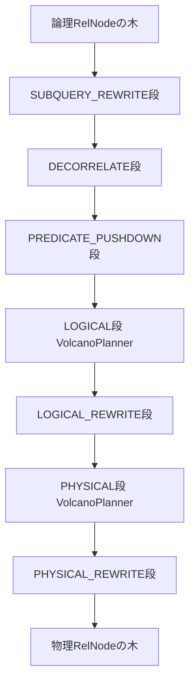

# 第24章 論理プランと最適化ルール

> **本章で読むソース**
>
> - [`PlannerBase.scala`](https://github.com/apache/flink/blob/release-2.3.0/flink-table/flink-table-planner/src/main/scala/org/apache/flink/table/planner/delegation/PlannerBase.scala)
> - [`Optimizer.scala`](https://github.com/apache/flink/blob/release-2.3.0/flink-table/flink-table-planner/src/main/scala/org/apache/flink/table/planner/plan/optimize/Optimizer.scala)
> - [`CommonSubGraphBasedOptimizer.scala`](https://github.com/apache/flink/blob/release-2.3.0/flink-table/flink-table-planner/src/main/scala/org/apache/flink/table/planner/plan/optimize/CommonSubGraphBasedOptimizer.scala)
> - [`StreamCommonSubGraphBasedOptimizer.scala`](https://github.com/apache/flink/blob/release-2.3.0/flink-table/flink-table-planner/src/main/scala/org/apache/flink/table/planner/plan/optimize/StreamCommonSubGraphBasedOptimizer.scala)
> - [`FlinkStreamProgram.scala`](https://github.com/apache/flink/blob/release-2.3.0/flink-table/flink-table-planner/src/main/scala/org/apache/flink/table/planner/plan/optimize/program/FlinkStreamProgram.scala)
> - [`FlinkChainedProgram.scala`](https://github.com/apache/flink/blob/release-2.3.0/flink-table/flink-table-planner/src/main/scala/org/apache/flink/table/planner/plan/optimize/program/FlinkChainedProgram.scala)
> - [`FlinkHepProgram.scala`](https://github.com/apache/flink/blob/release-2.3.0/flink-table/flink-table-planner/src/main/scala/org/apache/flink/table/planner/plan/optimize/program/FlinkHepProgram.scala)
> - [`FlinkVolcanoProgram.scala`](https://github.com/apache/flink/blob/release-2.3.0/flink-table/flink-table-planner/src/main/scala/org/apache/flink/table/planner/plan/optimize/program/FlinkVolcanoProgram.scala)
> - [`FlinkOptimizeProgram.scala`](https://github.com/apache/flink/blob/release-2.3.0/flink-table/flink-table-planner/src/main/scala/org/apache/flink/table/planner/plan/optimize/program/FlinkOptimizeProgram.scala)

## この章の狙い

第23章では、SQL テキストや Table API の呼び出しから `RelNode` の木が組み立てられるまでを見た。
`RelNode` は Calcite の論理プランの表現であり、この時点ではまだ Flink 上でどう実行するかという情報を持たない。
本章では、この `RelNode` の木を最適化する `Optimizer` と、その内部でルールを段階ごとに束ねる `FlinkStreamProgram` を読み、論理プランがどのように書き換えられ、最終的に Flink 物理 `RelNode` へ変換されるかを追う。

## 前提

**論理プラン**は、テーブルスキャンや射影、結合、集約といった SQL の意味だけを表す `RelNode` の木であり、`FlinkConventions.LOGICAL` という Calcite の convention を持つ。
**物理プラン**は、ストリーム処理としてどう実行するかを表す `RelNode` の木であり、`FlinkConventions.STREAM_PHYSICAL` の convention を持つ。
物理プランへの変換自体も最適化ルールの一段として行われ、物理 `RelNode`（`ExecNode` への変換や実際のコード生成）の詳細は第25章と第26章で扱う。
Calcite は最適化のための2種類のプランナーを提供する。
**HepPlanner** は、指定したルール集合をヒューリスティックに、多くの場合1回のトップダウンまたはボトムアップ走査で適用するプランナーであり、コスト計算を行わない。
**VolcanoPlanner** は、コストベースで複数の実行戦略を比較し、最小コストの物理プランを選ぶプランナーである。
本章で読む `FlinkStreamProgram` は、この2種類のプランナーをルールの性質に応じて使い分けている。

## PlannerBase から最適化を呼び出す位置

`PlannerBase` の `translate()` は、SQL やテーブル操作を実行可能な `Transformation` へ変換する一連の処理の入口である。

[`PlannerBase.scala` L175-L186](https://github.com/apache/flink/blob/release-2.3.0/flink-table/flink-table-planner/src/main/scala/org/apache/flink/table/planner/delegation/PlannerBase.scala#L175-L186)

```scala
  override def translate(
      modifyOperations: util.List[ModifyOperation]): util.List[Transformation[_]] = {
    beforeTranslation()
    if (modifyOperations.isEmpty) {
      return List.empty[Transformation[_]].asJava
    }

    val relNodes = modifyOperations.asScala.map(translateToRel)
    val optimizedRelNodes = optimize(relNodes)
    val execGraph = translateToExecNodeGraph(optimizedRelNodes, isCompiled = false)
    val transformations = translateToPlan(execGraph)
    afterTranslation()
    transformations
  }
```

`translateToRel()` が `ModifyOperation`（第23章で見た、Table API や SQL の意味を表す操作の木）を論理 `RelNode` に変換し、続く `optimize()` がその `RelNode` を最適化する。
`optimize()` の実体は薄いラッパーであり、実際の処理は `getOptimizer` が返す `Optimizer` に委譲される。

[`PlannerBase.scala` L393-L398](https://github.com/apache/flink/blob/release-2.3.0/flink-table/flink-table-planner/src/main/scala/org/apache/flink/table/planner/delegation/PlannerBase.scala#L393-L398)

```scala
  @VisibleForTesting
  private[flink] def optimize(relNodes: Seq[RelNode]): Seq[RelNode] = {
    val optimizedRelNodes = getOptimizer.optimize(relNodes)
    require(optimizedRelNodes.size <= relNodes.size)
    optimizedRelNodes
  }
```

`optimize()` から返る `RelNode` の個数が入力以下であるという制約は、複数の `INSERT INTO` 文が同じ部分クエリを共有するとき、その共通部分が1本の `RelNode` に集約されうることを示している。
この集約の仕組みが、次節で読む `CommonSubGraphBasedOptimizer` の役割である。

## 共通部分グラフ単位で最適化する Optimizer

`Optimizer` トレイトは、論理 `RelNode` の集合を最適化済みの `RelNode` の集合へ変換するという契約だけを定める。

[`Optimizer.scala` L26-L37](https://github.com/apache/flink/blob/release-2.3.0/flink-table/flink-table-planner/src/main/scala/org/apache/flink/table/planner/plan/optimize/Optimizer.scala#L26-L37)

```scala
trait Optimizer {

  /**
   * Generates the optimized [[RelNode]] DAG from the original relational nodes. <p>NOTES: The
   * reused node in result DAG will be converted to the same RelNode.
   *
   * @param roots
   *   the original relational nodes.
   * @return
   *   a list of RelNode represents an optimized RelNode DAG.
   */
  def optimize(roots: Seq[RelNode]): Seq[RelNode]
}
```

`CommonSubGraphBasedOptimizer` はこのトレイトを実装する抽象クラスであり、クラス冒頭のコメントが最適化の全体戦略を説明している。

[`CommonSubGraphBasedOptimizer.scala` L35-L57](https://github.com/apache/flink/blob/release-2.3.0/flink-table/flink-table-planner/src/main/scala/org/apache/flink/table/planner/plan/optimize/CommonSubGraphBasedOptimizer.scala#L35-L57)

```scala
/**
 * A [[Optimizer]] that optimizes [[RelNode]] DAG into semantically [[RelNode]] DAG based common
 * sub-graph. Common sub-graph represents the common sub RelNode plan in multiple RelNode trees.
 * Calcite planner does not support DAG (multiple roots) optimization, so a [[RelNode]] DAG should
 * be decomposed into multiple common sub-graphs, and each sub-graph is a tree (which has only one
 * root), and can be optimized independently by Calcite [[org.apache.calcite.plan.RelOptPlanner]].
 * The algorithm works as follows:
 *   1. Decompose [[RelNode]] DAG into multiple [[RelNodeBlock]]s, and build [[RelNodeBlock]] DAG.
 *      Each [[RelNodeBlock]] has only one sink output, and represents a common sub-graph. 2.
 *      optimize recursively each [[RelNodeBlock]] from leaf block to root(sink) block, and wrap the
 *      optimized result of non-root block as an [[IntermediateRelTable]]. 3. expand
 *      [[IntermediateRelTable]] into RelNode tree in each [[RelNodeBlock]].
 * ...
 */
abstract class CommonSubGraphBasedOptimizer extends Optimizer {
```

Calcite のプランナーは1個の根を持つ木しか最適化できないため、複数の `INSERT INTO` 文が1個の DAG（複数根を持つグラフ）を形成する場合は、そのままでは最適化にかけられない。
`CommonSubGraphBasedOptimizer` はこの DAG を、共有される部分木を境界として複数の `RelNodeBlock`（1個の根を持つ部分グラフ）へ分解し、葉側のブロックから順に最適化する。
非根ブロックの最適化結果は `IntermediateRelTable` という一時テーブルとしてラップされ、それを参照する側のブロックからは通常のテーブルスキャンと同じ形で扱われる。

`optimize()` の本体は、この分解と最適化に加えて、ヒントの解決や後処理を含む一連の流れをまとめている。

[`CommonSubGraphBasedOptimizer.scala` L78-L109](https://github.com/apache/flink/blob/release-2.3.0/flink-table/flink-table-planner/src/main/scala/org/apache/flink/table/planner/plan/optimize/CommonSubGraphBasedOptimizer.scala#L78-L109)

```scala
  override def optimize(roots: Seq[RelNode]): Seq[RelNode] = {
    // resolve hints before optimizing
    val queryHintsResolver = new QueryHintsResolver()
    val resolvedHintRoots = queryHintsResolver.resolve(toJava(roots))

    // clear query block alias bef optimizing
    val clearQueryBlockAliasResolver = new ClearQueryBlockAliasResolver
    val resolvedAliasRoots = clearQueryBlockAliasResolver.resolve(resolvedHintRoots)

    val sinkBlocks = doOptimize(resolvedAliasRoots)
    val optimizedPlan = sinkBlocks.map {
      block =>
        val plan = block.getOptimizedPlan
        require(plan != null)
        plan
    }
    val expanded = expandIntermediateTableScan(optimizedPlan)

    val postOptimizedPlan = postOptimize(expanded)

    // Rewrite same rel object to different rel objects
    // in order to get the correct dag (dag reuse is based on object not digest)
    val shuttle = new SameRelObjectShuttle()
    val relsWithoutSameObj = postOptimizedPlan.map(_.accept(shuttle))

    // reuse subplan
    SubplanReuser.reuseDuplicatedSubplan(
      relsWithoutSameObj,
      unwrapTableConfig(roots.head),
      unwrapContext(roots.head),
      unwrapTypeFactory(roots.head))
  }
```

`doOptimize()` が `RelNodeBlock` 単位の最適化を実装する抽象メソッドであり、ここに各実行モード固有のロジックが入る。
ストリーム実行では `StreamCommonSubGraphBasedOptimizer` がこれを実装する。

## RelNodeBlock ごとに FlinkStreamProgram を適用する StreamCommonSubGraphBasedOptimizer

`StreamCommonSubGraphBasedOptimizer` は `doOptimize()` を実装し、`RelNodeBlock` の木を葉側から順にたどって最適化する。

[`StreamCommonSubGraphBasedOptimizer.scala` L111-L130](https://github.com/apache/flink/blob/release-2.3.0/flink-table/flink-table-planner/src/main/scala/org/apache/flink/table/planner/plan/optimize/StreamCommonSubGraphBasedOptimizer.scala#L111-L130)

```scala
  override protected def doOptimize(roots: Seq[RelNode]): Seq[RelNodeBlock] = {
    val tableConfig = planner.getTableConfig
    // build RelNodeBlock plan
    val sinkBlocks = RelNodeBlockPlanBuilder.buildRelNodeBlockPlan(roots, tableConfig)
    // get the original configuration, and disable it if it is unnecessary
    val origMiniBatchEnabled = tableConfig.get(ExecutionConfigOptions.TABLE_EXEC_MINIBATCH_ENABLED)
    try {
      if (origMiniBatchEnabled) {
        tableConfig.set(
          ExecutionConfigOptions.TABLE_EXEC_MINIBATCH_ENABLED,
          Boolean.box(!shouldSkipMiniBatch(sinkBlocks)))
      }
      optimizeSinkBlocks(tableConfig, sinkBlocks)
    } finally {
      // revert the changed configuration back in the end
      tableConfig.getConfiguration.set(
        ExecutionConfigOptions.TABLE_EXEC_MINIBATCH_ENABLED,
        origMiniBatchEnabled)
    }
  }
```

個々の `RelNodeBlock` を実際に最適化するのが `optimizeTree()` である。
この関数は `FlinkStreamProgram.buildProgram()` が組み立てた `FlinkChainedProgram` を取得し、その `optimize()` を呼ぶだけの薄い委譲になっている。

[`StreamCommonSubGraphBasedOptimizer.scala` L191-L207](https://github.com/apache/flink/blob/release-2.3.0/flink-table/flink-table-planner/src/main/scala/org/apache/flink/table/planner/plan/optimize/StreamCommonSubGraphBasedOptimizer.scala#L191-L207)

```scala
  private def optimizeTree(
      relNode: RelNode,
      updateBeforeRequired: Boolean,
      miniBatchInterval: MiniBatchInterval,
      allowDuplicateChanges: Boolean,
      isSinkBlock: Boolean): RelNode = {

    val tableConfig = planner.getTableConfig
    val calciteConfig = TableConfigUtils.getCalciteConfig(tableConfig)
    val programs = calciteConfig.getStreamProgram
      .getOrElse(FlinkStreamProgram.buildProgram(tableConfig))
    Preconditions.checkNotNull(programs)

    val context = unwrapContext(relNode)

    programs.optimize(
      relNode,
      new StreamOptimizeContext() {
        // ... (中略。isBatchMode や getTableConfig など StreamOptimizeContext の実装) ...
      }
    )
```

`RelNodeBlock` 1個ぶんの最適化がすべて `FlinkStreamProgram` に集約されているため、`StreamCommonSubGraphBasedOptimizer` 自身が最適化ルールの中身を意識する必要はない。
DAG の分解と `IntermediateRelTable` による共有という骨組みと、個々の木に対する実際のルール適用が、明確に責務分離されている。

## ルールを段階に束ねる FlinkStreamProgram

`FlinkStreamProgram.buildProgram()` は、`FlinkChainedProgram` に対して最適化の段階（program）を順番に `addLast()` で積み上げていく。

[`FlinkStreamProgram.scala` L46-L52](https://github.com/apache/flink/blob/release-2.3.0/flink-table/flink-table-planner/src/main/scala/org/apache/flink/table/planner/plan/optimize/program/FlinkStreamProgram.scala#L46-L52)

```scala
  def buildProgram(tableConfig: ReadableConfig): FlinkChainedProgram[StreamOptimizeContext] = {
    val chainedProgram = new FlinkChainedProgram[StreamOptimizeContext]()

    // rewrite sub-queries to joins
    chainedProgram.addLast(
      SUBQUERY_REWRITE,
      FlinkGroupProgramBuilder
```

段階は、サブクエリの結合への書き換え（`SUBQUERY_REWRITE`）から始まり、時制結合の書き換え（`TEMPORAL_JOIN_REWRITE`）、相関除去（`DECORRELATE`）、既定の書き換え（`DEFAULT_REWRITE`）、述語プッシュダウン（`PREDICATE_PUSHDOWN`）、結合の並べ替え（`JOIN_REORDER`）、多段結合のまとめ上げ（`MULTI_JOIN`）、射影の書き換え（`PROJECT_REWRITE`）と続く。
その後に論理プランへの変換（`LOGICAL`）、論理プランの再書き換え（`LOGICAL_REWRITE`）、時間インジケータの変換（`TIME_INDICATOR`）、物理プランへの変換（`PHYSICAL`）、物理プランの後処理（`PHYSICAL_REWRITE`）が続く。

述語プッシュダウンの段は `FlinkGroupProgramBuilder` を使い、複数の子プログラムをまとめたうえで反復回数を指定できる。

[`FlinkStreamProgram.scala` L146-L207](https://github.com/apache/flink/blob/release-2.3.0/flink-table/flink-table-planner/src/main/scala/org/apache/flink/table/planner/plan/optimize/program/FlinkStreamProgram.scala#L146-L207)

```scala
    chainedProgram.addLast(
      PREDICATE_PUSHDOWN,
      FlinkGroupProgramBuilder
        .newBuilder[StreamOptimizeContext]
        .addProgram(
          FlinkGroupProgramBuilder
            .newBuilder[StreamOptimizeContext]
            .addProgram(
              FlinkHepRuleSetProgramBuilder
                .newBuilder[StreamOptimizeContext]
                .setHepRulesExecutionType(HEP_RULES_EXECUTION_TYPE.RULE_SEQUENCE)
                .setHepMatchOrder(HepMatchOrder.BOTTOM_UP)
                .add(FlinkStreamRuleSets.JOIN_PREDICATE_REWRITE_RULES)
                .build(),
              "join predicate rewrite"
            )
            // ... (中略。filter rules を追加) ...
            .setIterations(5)
            .build(),
          "predicate rewrite"
        )
        // ... (中略。partition push down と filter push down、empty pruning を追加) ...
        .build()
    )
```

`setIterations(5)` は、述語の書き換えと結合条件の整理を最大5回まで反復適用することを意味し、1回のボトムアップ走査だけでは収束しない書き換えの連鎖（述語をさらに下流へ押し出せる形に整形し直す、といった往復）を吸収している。
これらの段はいずれも `FlinkHepRuleSetProgramBuilder` が組み立てる `FlinkHepProgram` を使っており、HepPlanner によるヒューリスティックなルール適用である。

論理プランへの変換段は、これとは対照的に `FlinkVolcanoProgramBuilder` を使う。

[`FlinkStreamProgram.scala` L262-L268](https://github.com/apache/flink/blob/release-2.3.0/flink-table/flink-table-planner/src/main/scala/org/apache/flink/table/planner/plan/optimize/program/FlinkStreamProgram.scala#L262-L268)

```scala
    // optimize the logical plan
    chainedProgram.addLast(
      LOGICAL,
      FlinkVolcanoProgramBuilder.newBuilder
        .add(FlinkStreamRuleSets.LOGICAL_OPT_RULES)
        .setRequiredOutputTraits(Array(FlinkConventions.LOGICAL))
        .build()
    )
```

物理プランへの変換段も同じ形を取り、要求する convention だけが `FlinkConventions.STREAM_PHYSICAL` に変わる。

[`FlinkStreamProgram.scala` L294-L300](https://github.com/apache/flink/blob/release-2.3.0/flink-table/flink-table-planner/src/main/scala/org/apache/flink/table/planner/plan/optimize/program/FlinkStreamProgram.scala#L294-L300)

```scala
    // optimize the physical plan
    chainedProgram.addLast(
      PHYSICAL,
      FlinkVolcanoProgramBuilder.newBuilder
        .add(FlinkStreamRuleSets.PHYSICAL_OPT_RULES)
        .setRequiredOutputTraits(Array(FlinkConventions.STREAM_PHYSICAL))
        .build()
    )
```

`LOGICAL` 段と `PHYSICAL` 段が、それぞれ `FlinkConventions.LOGICAL` と `FlinkConventions.STREAM_PHYSICAL` という異なる convention を目標に据えている点が、この2段の役割の違いを表している。
`LOGICAL` 段では、結合順序や集約方式のような論理的に等価な書き換えの中からコストの低い形を選ぶ。
`PHYSICAL` 段では、その論理プランを実際にどの Flink 演算子（ハッシュ結合かソートマージ結合か、ウィンドウ集約をどう実装するかなど）で実行するかを、演算子ごとのコスト見積もりを比較して決める。
どちらもルールの候補数が多く、複数のルールを組み合わせた結果同士をコストで比較する必要があるため、コストベースの VolcanoPlanner に委ねられている。

## HepPlanner と VolcanoPlanner の使い分け

`FlinkHepProgram` は、内部に保持する `HepProgram` を使って `HepPlanner` を1回動かし、その結果を返すだけの実装である。

[`FlinkHepProgram.scala` L46-L68](https://github.com/apache/flink/blob/release-2.3.0/flink-table/flink-table-planner/src/main/scala/org/apache/flink/table/planner/plan/optimize/program/FlinkHepProgram.scala#L46-L68)

```scala
  override def optimize(root: RelNode, context: OC): RelNode = {
    if (hepProgram.isEmpty) {
      throw new TableException("hepProgram should not be None in FlinkHepProgram")
    }

    try {
      val planner = new HepPlanner(hepProgram.get, context)
      FlinkRelMdNonCumulativeCost.THREAD_PLANNER.set(planner)

      planner.setRoot(root)

      if (requestedRootTraits.isDefined) {
        val targetTraitSet = root.getTraitSet.plusAll(requestedRootTraits.get)
        if (!root.getTraitSet.equals(targetTraitSet)) {
          planner.changeTraits(root, targetTraitSet.simplify)
        }
      }

      planner.findBestExp
    } finally {
      FlinkRelMdNonCumulativeCost.THREAD_PLANNER.remove()
    }
  }
```

`HepPlanner` はマッチしたルールを見つけ次第その場で書き換えるだけで、複数の書き換え結果を比較しない。
そのため、述語のプッシュダウンや射影の整理のように、書き換えた結果が常に元より良い（あるいは少なくとも悪化しない）と分かっているルールに向いている。

一方 `FlinkVolcanoProgram` は、`VolcanoPlanner` に対してルール集合と要求トレイトを渡し、コストベースの探索を行わせる。

[`FlinkVolcanoProgram.scala` L43-L62](https://github.com/apache/flink/blob/release-2.3.0/flink-table/flink-table-planner/src/main/scala/org/apache/flink/table/planner/plan/optimize/program/FlinkVolcanoProgram.scala#L43-L62)

```scala
  override def optimize(root: RelNode, context: OC): RelNode = {
    if (rules.isEmpty) {
      return root
    }

    if (requiredOutputTraits.isEmpty) {
      throw new TableException("Required output traits should not be None in FlinkVolcanoProgram")
    }

    val targetTraits = root.getTraitSet.plusAll(requiredOutputTraits.get).simplify()
    // VolcanoPlanner limits that the planer a RelNode tree belongs to and
    // the VolcanoPlanner used to optimize the RelNode tree should be same instance.
    // see: VolcanoPlanner#registerImpl
    // here, use the planner in cluster directly
    val planner = root.getCluster.getPlanner.asInstanceOf[VolcanoPlanner]
    val optProgram = Programs.ofRules(rules)

    try {
      FlinkRelMdNonCumulativeCost.THREAD_PLANNER.set(planner)
      optProgram.run(planner, root, targetTraits, ImmutableList.of(), ImmutableList.of())
      // ... (中略。CannotPlanException 等を TableException に包み直す catch 節) ...
    } finally {
      FlinkRelMdNonCumulativeCost.THREAD_PLANNER.remove()
    }
  }
```

`VolcanoPlanner` は、同じ論理的内容を持つ複数の実装候補を等価集合として保持し、それぞれのコストを見積もったうえで最小コストの組み合わせを選ぶ。
論理から物理への変換のように、1個の論理演算に対して複数の物理演算子が対応しうる（結合であればハッシュ結合、ソートマージ結合、ブロードキャスト結合など）段階では、書き換えた結果同士を比較しないヒューリスティックなアプローチでは最良の組み合わせを選べない。
ルールの性質、書き換えれば必ず改善するのか、複数の候補をコストで比較する必要があるのかによって、`FlinkHepProgram` と `FlinkVolcanoProgram` を段階ごとに使い分けている。

## FlinkOptimizeProgram と FlinkChainedProgram という共通の枠組み

`FlinkHepProgram` と `FlinkVolcanoProgram` は、いずれも `FlinkOptimizeProgram` という共通のトレイトを実装する。

[`FlinkOptimizeProgram.scala` L29-L33](https://github.com/apache/flink/blob/release-2.3.0/flink-table/flink-table-planner/src/main/scala/org/apache/flink/table/planner/plan/optimize/program/FlinkOptimizeProgram.scala#L29-L33)

```scala
trait FlinkOptimizeProgram[OC <: FlinkOptimizeContext] {

  /** Transforms a relational expression into another relational expression. */
  def optimize(root: RelNode, context: OC): RelNode

}
```

`RelNode` を受け取り `RelNode` を返すという1個の契約に統一されているため、`FlinkChainedProgram` は内部の各段がヒューリスティックかコストベースかを区別せずに、単に順番へ並べて呼び出すだけでよい。

[`FlinkChainedProgram.scala` L52-L70](https://github.com/apache/flink/blob/release-2.3.0/flink-table/flink-table-planner/src/main/scala/org/apache/flink/table/planner/plan/optimize/program/FlinkChainedProgram.scala#L52-L70)

```scala
  /** Calling each program's optimize method in sequence. */
  def optimize(root: RelNode, context: OC): RelNode = {
    programNames.foldLeft(root) {
      (input, name) =>
        val program = get(name).getOrElse(throw new TableException(s"This should not happen."))

        val start = System.currentTimeMillis()
        val result = program.optimize(input, context)
        val end = System.currentTimeMillis()

        if (LOG.isDebugEnabled) {
          LOG.debug(
            s"optimize $name cost ${end - start} ms.\n" +
              s"optimize result: \n${FlinkRelOptUtil.toString(result)}")
        }

        result
    }
  }
```

`foldLeft` によって、前段の出力 `RelNode` がそのまま次段の入力になる。
ここが本章の最適化の要点である。
ルール集合を1個の巨大なプランナー呼び出しにまとめず、`FlinkOptimizeProgram` という共通インターフェースの下で段階（program）ごとに小分けにし、各段でヒューリスティックとコストベースを選び分けたうえで直列に適用する構造になっている。
段を分けることで、サブクエリの展開のように後続のルールが依存する前提を先に確定させる書き換えと、結合順序の探索のように多数の候補を比較する必要がある書き換えを、それぞれに適したプランナーへ振り分けられる。
段を1本のヒューリスティックな走査にまとめてしまうと、コストの比較が必要な結合順序の選択まで「見つけ次第書き換える」動作になり、局所的には正しくても大域的に最適でない計画を選んでしまう。
逆にすべてをコストベースの探索に委ねると、サブクエリ展開のような構造的な書き換えまで等価集合として管理する対象になり、探索空間が不必要に膨らむ。

## 論理 RelNode から物理 RelNode までの段階

ここまでの流れを図にすると次のようになる。



`SUBQUERY_REWRITE` から `PREDICATE_PUSHDOWN` までは HepPlanner によるヒューリスティックな書き換えであり、構文的に等価な形へ整理する段階に相当する。
`LOGICAL` と `PHYSICAL` は VolcanoPlanner によるコストベースの探索であり、それぞれ論理プランの最良形と、それを実現する物理演算子の組み合わせを選ぶ。

## まとめ

`PlannerBase.translate()` は、論理 `RelNode` へ変換した直後に `optimize()` を呼び、`CommonSubGraphBasedOptimizer` へ処理を委ねる。
`CommonSubGraphBasedOptimizer` は複数の `INSERT INTO` 文が形成する DAG を `RelNodeBlock` へ分解し、`StreamCommonSubGraphBasedOptimizer` が各ブロックに対して `FlinkStreamProgram` の組み立てる `FlinkChainedProgram` を適用する。
`FlinkStreamProgram` は、サブクエリ展開や述語プッシュダウンといったヒューリスティックな書き換え段と、論理プランおよび物理プランを選ぶコストベースの段を、`FlinkOptimizeProgram` という共通インターフェースの下で直列に並べている。
ルールの性質に応じて HepPlanner と VolcanoPlanner を段階ごとに使い分けることで、書き換えれば必ず改善する変換と、複数候補をコストで比較すべき変換を、それぞれに適したアルゴリズムへ振り分けている。
`PHYSICAL` 段の出力である物理 `RelNode` は、次段で `ExecNode` の DAG へ変換される。

## 関連する章

- 第23章 [SQL パーサーと Calcite によるプラン構築](23-table-parser-calcite.md)
- 第25章 [物理 ExecNode と実行計画](25-physical-execnode.md)
- 第26章 [コード生成とランタイム](26-codegen-runtime.md)
