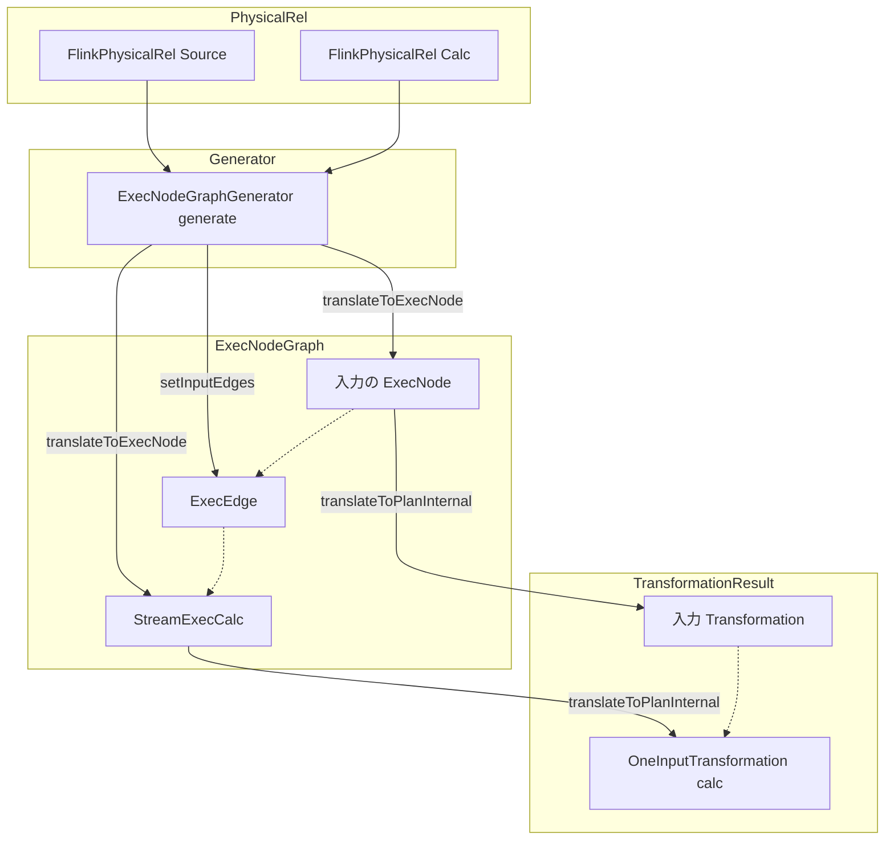

# 第25章 物理プランと ExecNode

> **本章で読むソース**
>
> - [`ExecNodeGraphGenerator.java`](https://github.com/apache/flink/blob/release-2.3.0/flink-table/flink-table-planner/src/main/java/org/apache/flink/table/planner/plan/nodes/exec/ExecNodeGraphGenerator.java)
> - [`ExecNodeBase.java`](https://github.com/apache/flink/blob/release-2.3.0/flink-table/flink-table-planner/src/main/java/org/apache/flink/table/planner/plan/nodes/exec/ExecNodeBase.java)
> - [`StreamExecNode.java`](https://github.com/apache/flink/blob/release-2.3.0/flink-table/flink-table-planner/src/main/java/org/apache/flink/table/planner/plan/nodes/exec/stream/StreamExecNode.java)
> - [`StreamExecCalc.java`](https://github.com/apache/flink/blob/release-2.3.0/flink-table/flink-table-planner/src/main/java/org/apache/flink/table/planner/plan/nodes/exec/stream/StreamExecCalc.java)
> - [`CommonExecCalc.java`](https://github.com/apache/flink/blob/release-2.3.0/flink-table/flink-table-planner/src/main/java/org/apache/flink/table/planner/plan/nodes/exec/common/CommonExecCalc.java)
> - [`PlannerBase.scala`](https://github.com/apache/flink/blob/release-2.3.0/flink-table/flink-table-planner/src/main/scala/org/apache/flink/table/planner/delegation/PlannerBase.scala)

## この章の狙い

第24章では、Calcite の最適化ルールが論理プランを物理プランへ書き換え、実行方式を織り込んだ物理 `RelNode` の木ができるまでを見た。
この木はまだ Calcite の `RelNode` であり、Flink の実行基盤が直接扱える形ではない。
本章では、物理 `RelNode` の木を **ExecNode** のグラフへ変換する `ExecNodeGraphGenerator` を読み、各 `ExecNode` が `translateToPlan` で `Transformation` を生成する経路を追う。
そのうえで、`StreamExecCalc` を具体例に、物理 `RelNode` から `ExecNode` を経て `Transformation` が組み上がる対応をコードで確かめる。

## 前提

**ExecNode** は、最適化を終えた物理プランを表す Flink Table/SQL プランナー独自の実行ノードである。
Calcite の `RelNode` が最適化と等価変換のための表現であるのに対し、`ExecNode` は実行計画そのものを表し、JSON への永続化とコード生成による `Transformation` の生成を担う。
`ExecNode` のグラフは、第2部で見た `Transformation` の木（第6章）に変換され、そこから StreamGraph（第7章）以降の共通実行経路へ合流する。
本章の登場物は、`ExecNode` の基底実装 `ExecNodeBase`、ストリーミング向けの目印となる `StreamExecNode`、物理 `RelNode` から `ExecNode` グラフを組む `ExecNodeGraphGenerator` の三つである。

## プランナーが踏む三段の変換

`ExecNode` の位置づけは、プランナー本体の変換手順を見ると明快である。
`PlannerBase.translate` は、最適化済みの `RelNode` からまず `ExecNode` グラフを作り、次にそれを `Transformation` へ変換する。

[`PlannerBase.scala` L175-L188](https://github.com/apache/flink/blob/release-2.3.0/flink-table/flink-table-planner/src/main/scala/org/apache/flink/table/planner/delegation/PlannerBase.scala#L175-L188)

```scala
  override def translate(
      modifyOperations: util.List[ModifyOperation]): util.List[Transformation[_]] = {
    beforeTranslation()
    if (modifyOperations.isEmpty) {
      return List.empty[Transformation[_]].asJava
    }

    val relNodes = modifyOperations.asScala.map(translateToRel)
    val optimizedRelNodes = optimize(relNodes)
    val execGraph = translateToExecNodeGraph(optimizedRelNodes, isCompiled = false)
    val transformations = translateToPlan(execGraph)
    afterTranslation()
    transformations
  }
```

`optimize` が第24章までの処理であり、そこから先が本章の対象である。
`translateToExecNodeGraph` が物理 `RelNode` を `ExecNode` グラフへ変換し、`translateToPlan` がそのグラフを辿って `Transformation` を得る。
`RelNode`、`ExecNode`、`Transformation` の三段を分けている点が、以降の議論の土台になる。

## 物理 RelNode から ExecNode グラフを組む

`ExecNodeGraphGenerator` は、物理 `RelNode`（`FlinkPhysicalRel`）の木から `ExecNode` のグラフを生成するクラスである。
クラス冒頭のコメントは、走査の方針を次のように説明する。

[`ExecNodeGraphGenerator.java` L36-L55](https://github.com/apache/flink/blob/release-2.3.0/flink-table/flink-table-planner/src/main/java/org/apache/flink/table/planner/plan/nodes/exec/ExecNodeGraphGenerator.java#L36-L55)

```java
/**
 * A generator that generates a {@link ExecNode} graph from a graph of {@link FlinkPhysicalRel}s.
 *
 * <p>This traverses the tree of {@link FlinkPhysicalRel} starting from the sinks. At each rel we
 * recursively transform the inputs, then create a {@link ExecNode}. Each rel will be visited only
 * once, that means a rel will only generate one ExecNode instance.
 *
 * <p>Exchange and Union will create a actual node in the {@link ExecNode} graph as the first step,
 * once all ExecNodes' implementation are separated from physical rel, we will use {@link
 * InputProperty} to replace them.
 */
public class ExecNodeGraphGenerator {

    private final Map<FlinkPhysicalRel, ExecNode<?>> visitedRels;
    private final Set<String> visitedProcessTableFunctionUids;

    public ExecNodeGraphGenerator() {
        this.visitedRels = new IdentityHashMap<>();
        this.visitedProcessTableFunctionUids = new HashSet<>();
    }
```

コメントにあるとおり、走査は Sink 側から入力方向へ再帰的に遡る。
第7章の `StreamGraphGenerator` が `Transformation` の木を Sink から辿ったのと同じ向きである。
`visitedRels` は `IdentityHashMap` であり、`FlinkPhysicalRel` インスタンスを同一性で照合して、一つの `RelNode` からは `ExecNode` を一つだけ作ることを保証する。

生成の本体は再帰メソッド `generate` である。

[`ExecNodeGraphGenerator.java` L65-L90](https://github.com/apache/flink/blob/release-2.3.0/flink-table/flink-table-planner/src/main/java/org/apache/flink/table/planner/plan/nodes/exec/ExecNodeGraphGenerator.java#L65-L90)

```java
    private ExecNode<?> generate(FlinkPhysicalRel rel, boolean isCompiled) {
        ExecNode<?> execNode = visitedRels.get(rel);
        if (execNode != null) {
            return execNode;
        }

        if (rel instanceof CommonIntermediateTableScan) {
            throw new TableException("Intermediate RelNode can't be converted to ExecNode.");
        }

        List<ExecNode<?>> inputNodes = new ArrayList<>();
        for (RelNode input : rel.getInputs()) {
            inputNodes.add(generate((FlinkPhysicalRel) input, isCompiled));
        }

        execNode = rel.translateToExecNode(isCompiled);
        // connects the input nodes
        List<ExecEdge> inputEdges = new ArrayList<>(inputNodes.size());
        for (ExecNode<?> inputNode : inputNodes) {
            inputEdges.add(ExecEdge.builder().source(inputNode).target(execNode).build());
        }
        execNode.setInputEdges(inputEdges);
        checkUidForProcessTableFunction(execNode);
        visitedRels.put(rel, execNode);
        return execNode;
    }
```

処理は先頭の `visitedRels` 参照から始まる。
すでに変換済みの `RelNode` であれば、同じ `ExecNode` インスタンスをそのまま返す。
これにより、共有された `RelNode`（同じ中間結果を複数の下流が参照する DAG）でも `ExecNode` は一つに保たれ、木ではなくグラフとして表現される。

未変換であれば、まず入力側の `RelNode` を再帰的に `generate` して、入力の `ExecNode` を確定させる。
そのうえで `rel.translateToExecNode(isCompiled)` を呼び、この `RelNode` に対応する `ExecNode` を1個生成する。
変換自体は物理 `RelNode` の各実装（`translateToExecNode`）に委ねられており、`ExecNodeGraphGenerator` は走査と重複排除、入力の接続だけを受け持つ。

接続は `ExecEdge` で表す。
入力ノードごとに `source` を入力 `ExecNode`、`target` を今作った `ExecNode` とする `ExecEdge` を作り、`setInputEdges` でまとめて登録する。
最後に `visitedRels` へ登録して、以降の再帰で同じインスタンスが再利用されるようにする。

複数の Sink を起点とするときは、外側の `generate` が根の集合を順に処理し、結果を `ExecNodeGraph` にまとめる。

[`ExecNodeGraphGenerator.java` L57-L63](https://github.com/apache/flink/blob/release-2.3.0/flink-table/flink-table-planner/src/main/java/org/apache/flink/table/planner/plan/nodes/exec/ExecNodeGraphGenerator.java#L57-L63)

```java
    public ExecNodeGraph generate(List<FlinkPhysicalRel> relNodes, boolean isCompiled) {
        List<ExecNode<?>> rootNodes = new ArrayList<>(relNodes.size());
        for (FlinkPhysicalRel relNode : relNodes) {
            rootNodes.add(generate(relNode, isCompiled));
        }
        return new ExecNodeGraph(rootNodes);
    }
```

`visitedRels` は `ExecNodeGraphGenerator` インスタンスのフィールドなので、複数の Sink をまたいで共有される。
Sink をまたいで同じ `RelNode` が現れても、`ExecNode` は一度だけ生成される。

## ExecNode の基底実装 ExecNodeBase

`ExecNodeGraphGenerator` が並べる `ExecNode` は、`ExecNodeBase` を基底に持つ。
`ExecNodeBase` はジェネリック型 `T` を出力要素の型としてとり、`ExecNode<T>` を実装する抽象クラスである。

[`ExecNodeBase.java` L57-L89](https://github.com/apache/flink/blob/release-2.3.0/flink-table/flink-table-planner/src/main/java/org/apache/flink/table/planner/plan/nodes/exec/ExecNodeBase.java#L57-L89)

```java
/**
 * Base class for {@link ExecNode}.
 *
 * @param <T> The type of the elements that result from this node.
 */
@JsonIgnoreProperties(ignoreUnknown = true)
public abstract class ExecNodeBase<T> implements ExecNode<T> {

    // ... (中略) ...
    private final String description;

    private final LogicalType outputType;

    @JsonSetter(nulls = Nulls.AS_EMPTY)
    private final List<InputProperty> inputProperties;

    private List<ExecEdge> inputEdges;

    private transient Transformation<T> transformation;

    // ... (中略) ...

    /** Holds the context information (id, name, version) as deserialized from a JSON plan. */
    @JsonProperty(value = FIELD_NAME_TYPE, access = JsonProperty.Access.WRITE_ONLY)
    private final ExecNodeContext context;
```

フィールドの並びに `ExecNode` の二つの顔が表れている。
`description`、`outputType`、`inputProperties`、`context` は `@JsonProperty` などの注釈を伴い、JSON プランへ永続化される計画情報である。
一方 `transformation` は `transient` であり、直列化の対象から外れている。
`ExecNode` は永続化可能な計画表現でありながら、実行時の変換結果である `Transformation` はキャッシュ用に一時保持するだけという役割分担になっている。

計画情報のうち `context` は、`ExecNode` の識別子、型名、バージョンを束ねる。

[`ExecNodeBase.java` L129-L142](https://github.com/apache/flink/blob/release-2.3.0/flink-table/flink-table-planner/src/main/java/org/apache/flink/table/planner/plan/nodes/exec/ExecNodeBase.java#L129-L142)

```java
    @Override
    public final int getId() {
        return context.getId();
    }

    @Override
    public final String getTypeAsString() {
        return context.getTypeAsString();
    }

    @Override
    public final int getVersion() {
        return context.getVersion();
    }
```

型名とバージョンを `ExecNode` が保持するため、ある版で書き出した JSON プランを、後の版が型名とバージョンを頼りに同じ `ExecNode` へ復元できる。
この安定した識別子が、コンパイル済みプランの永続化と再利用を支える。

入力側の接続は、`ExecNodeGraphGenerator` が組んだ `inputEdges` に保持される。

[`ExecNodeBase.java` L159-L177](https://github.com/apache/flink/blob/release-2.3.0/flink-table/flink-table-planner/src/main/java/org/apache/flink/table/planner/plan/nodes/exec/ExecNodeBase.java#L159-L177)

```java
    @Override
    public List<ExecEdge> getInputEdges() {
        return checkNotNull(
                inputEdges,
                "inputEdges should not be null, please call `setInputEdges(List<ExecEdge>)` first.");
    }

    @Override
    public void setInputEdges(List<ExecEdge> inputEdges) {
        checkNotNull(inputEdges, "inputEdges should not be null.");
        this.inputEdges = new ArrayList<>(inputEdges);
    }
```

`getInputEdges` が `inputEdges` の null を弾いているのは、`translateToPlanInternal` が入力の `Transformation` を辿るために、事前に `setInputEdges` が呼ばれていることを前提にしているためである。

## 一度きりの変換をキャッシュする translateToPlan

`ExecNode` から `Transformation` を得る入口が `translateToPlan` である。
この `final` メソッドは、変換のキャッシュと共通の後処理だけを行い、ノードごとの実際の変換は抽象メソッド `translateToPlanInternal` に委ねる。

[`ExecNodeBase.java` L179-L219](https://github.com/apache/flink/blob/release-2.3.0/flink-table/flink-table-planner/src/main/java/org/apache/flink/table/planner/plan/nodes/exec/ExecNodeBase.java#L179-L219)

```java
    @Override
    public final Transformation<T> translateToPlan(Planner planner) {
        if (transformation == null) {
            transformation =
                    translateToPlanInternal(
                            (PlannerBase) planner,
                            ExecNodeConfig.of(
                                    ((PlannerBase) planner).getTableConfig(),
                                    persistedConfig,
                                    isCompiled));
            if (this instanceof SingleTransformationTranslator) {
                if (inputsContainSingleton(transformation)) {
                    transformation.setParallelism(1);
                    transformation.setMaxParallelism(1);
                }
            }
        }
        return transformation;
    }

    // ... (中略) ...

    /**
     * Internal method, translates this node into a Flink operator.
     *
     * @param planner The planner.
     * @param config per-{@link ExecNode} configuration that contains the merged configuration from
     *     various layers which all the nodes implementing this method should use, instead of
     *     retrieving configuration from the {@code planner}. For more details check {@link
     *     ExecNodeConfig}.
     */
    protected abstract Transformation<T> translateToPlanInternal(
            PlannerBase planner, ExecNodeConfig config);
```

先頭の `transformation == null` の判定が、一度きりの変換を保証する仕組みである。
初回は `translateToPlanInternal` を呼んで `Transformation` を生成し、フィールドに覚える。
2回目以降は同じ `Transformation` インスタンスをそのまま返す。

このキャッシュは、DAG 形の `ExecNode` グラフで意味を持つ。
一つの `ExecNode` が複数の下流から入力として辿られても、`translateToPlan` が生成する `Transformation` は1個に保たれる。
`ExecNodeGraphGenerator` が `RelNode` を `ExecNode` へ一意化したのと同じ一意性を、`ExecNode` から `Transformation` への段でも維持している。

`translateToPlanInternal` に渡す `ExecNodeConfig` は、プランナー全体の設定とノード固有の `persistedConfig` を統合したものである。
コメントが述べるとおり、各ノードは `planner` から直接設定を引かず、この統合済み設定を使う。
JSON プランから復元したときは、書き出した時点の `persistedConfig` が効くため、設定を含めて実行計画が再現される。

## StreamExecNode という薄い特殊化

ストリーミング向けの `ExecNode` は、`StreamExecNode` という目印のインターフェースを実装する。
定義は次の1行に尽きる。

[`StreamExecNode.java` L24-L26](https://github.com/apache/flink/blob/release-2.3.0/flink-table/flink-table-planner/src/main/java/org/apache/flink/table/planner/plan/nodes/exec/stream/StreamExecNode.java#L24-L26)

```java
/** Base class for stream {@link ExecNode}. */
@Internal
public interface StreamExecNode<T> extends ExecNode<T> {}
```

メソッドを一つも追加せず、`ExecNode<T>` をそのまま継承するだけである。
役割は、ストリーミング用の `ExecNode` に共通の型としての目印を与えることにある。
第7章末で見た `StreamPlanner.translateToPlan` は、この目印を使って `ExecNode` グラフの根が確かにストリーミング用であることを確かめてから変換する。

[`StreamPlanner.scala` L78-L89](https://github.com/apache/flink/blob/release-2.3.0/flink-table/flink-table-planner/src/main/scala/org/apache/flink/table/planner/delegation/StreamPlanner.scala#L78-L89)

```scala
  override protected def translateToPlan(execGraph: ExecNodeGraph): util.List[Transformation[_]] = {
    beforeTranslation()
    val planner = createDummyPlanner()
    val transformations = execGraph.getRootNodes.map {
      case node: StreamExecNode[_] => node.translateToPlan(planner)
      case _ =>
        throw new TableException(
          "Cannot generate DataStream due to an invalid logical plan. " +
            "This is a bug and should not happen. Please file an issue.")
    }
    afterTranslation()
    transformations ++ planner.extraTransformations
```

グラフの根を順に `translateToPlan` で `Transformation` へ変換し、根が `StreamExecNode` でなければ不正な論理プランとして例外を投げる。
バッチ側には対になる `BatchExecNode` があり、実行方式ごとに `ExecNode` の系統を型で分けている。

## 具体例 StreamExecCalc から Transformation まで

ここまでの流れを、射影と絞り込みを表す `Calc` の `ExecNode` で具体化する。
`StreamExecCalc` は、共通実装 `CommonExecCalc` を継承しつつ `StreamExecNode<RowData>` を実装する。

[`StreamExecCalc.java` L42-L49](https://github.com/apache/flink/blob/release-2.3.0/flink-table/flink-table-planner/src/main/java/org/apache/flink/table/planner/plan/nodes/exec/stream/StreamExecCalc.java#L42-L49)

```java
/** Stream {@link ExecNode} for Calc. */
@ExecNodeMetadata(
        name = "stream-exec-calc",
        version = 1,
        producedTransformations = CommonExecCalc.CALC_TRANSFORMATION,
        minPlanVersion = FlinkVersion.v1_15,
        minStateVersion = FlinkVersion.v1_15)
public class StreamExecCalc extends CommonExecCalc implements StreamExecNode<RowData> {
```

クラスに付いた `@ExecNodeMetadata` が、`ExecNodeBase` の `context` が保持する型名（`stream-exec-calc`）とバージョン（`1`）の出どころである。
JSON プランには、この型名とバージョンで `StreamExecCalc` が記録され、復元時に同じ実行ノードへ戻される。
`StreamExecCalc` 自身はコンストラクタでフィールドを受け渡すだけで、変換ロジックは持たない。

実際の変換は `CommonExecCalc.translateToPlanInternal` にある。

[`CommonExecCalc.java` L88-L115](https://github.com/apache/flink/blob/release-2.3.0/flink-table/flink-table-planner/src/main/java/org/apache/flink/table/planner/plan/nodes/exec/common/CommonExecCalc.java#L88-L115)

```java
    @SuppressWarnings("unchecked")
    @Override
    protected Transformation<RowData> translateToPlanInternal(
            PlannerBase planner, ExecNodeConfig config) {
        final ExecEdge inputEdge = getInputEdges().get(0);
        final Transformation<RowData> inputTransform =
                (Transformation<RowData>) inputEdge.translateToPlan(planner);
        final CodeGeneratorContext ctx =
                new CodeGeneratorContext(config, planner.getFlinkContext().getClassLoader())
                        .setOperatorBaseClass(operatorBaseClass);

        final CodeGenOperatorFactory<RowData> substituteStreamOperator =
                CalcCodeGenerator.generateCalcOperator(
                        ctx,
                        inputTransform,
                        (RowType) getOutputType(),
                        JavaScalaConversionUtil.toScala(projection),
                        JavaScalaConversionUtil.toScala(Optional.ofNullable(this.condition)),
                        retainHeader,
                        getClass().getSimpleName());
        return ExecNodeUtil.createOneInputTransformation(
                inputTransform,
                createTransformationMeta(CALC_TRANSFORMATION, config),
                substituteStreamOperator,
                InternalTypeInfo.of(getOutputType()),
                inputTransform.getParallelism(),
                false);
    }
```

このメソッドが、`ExecNode` から `Transformation` への橋渡しの実物である。
先頭で `getInputEdges().get(0)` から入力辺を取り、`inputEdge.translateToPlan(planner)` で入力側の `Transformation` を得る。
`ExecEdge` の `translateToPlan` は、内部で入力 `ExecNode` の `translateToPlan` を呼ぶため、ここで入力方向への再帰が起きる。
`ExecNodeGraphGenerator` が Sink から入力方向へ辿ってグラフを組んだのに対し、`Transformation` の生成は根から入力へ辿って `Transformation` を積み上げる。

続いて `CalcCodeGenerator.generateCalcOperator` が、射影 `projection` と条件 `condition` から演算子を生成する。
`Calc` の処理そのものは、この段でコード生成される演算子ファクトリ `substituteStreamOperator` に収まる（コード生成の詳細は第26章で扱う）。
最後の `ExecNodeUtil.createOneInputTransformation` が、入力 `Transformation` と生成した演算子を結び、この `ExecNode` の出力となる1入力の `Transformation` を返す。
返り値は `ExecNodeBase.translateToPlan` に受け取られ、`transformation` フィールドへキャッシュされる。

## 変換過程の全体像

物理 `RelNode` から `Transformation` までの流れを図にすると次のようになる。



`ExecNodeGraphGenerator` は物理 `RelNode` を Sink から辿り、各 `RelNode` を `ExecNode` へ一意に変換して `ExecEdge` で接続する。
できあがった `ExecNode` グラフを `translateToPlan` が根から辿ると、各ノードの `translateToPlanInternal` が入力 `Transformation` の上に自ノードの `Transformation` を積み、`Transformation` の木ができる。

## 最適化と設計の工夫

本章の設計の要点は、`ExecNode` を `RelNode` から切り離した安定な中間表現として置いたことにある。
`RelNode` は Calcite の最適化のための表現で、最適化ルールの適用ごとに姿を変え、Calcite の版にも縛られる。
`ExecNode` はここから独立し、型名とバージョンを持つ計画情報（`context`、`outputType`、`inputProperties`）と、`transient` の `transformation` を分けて持つ。
計画情報だけを JSON へ書き出せるため、最適化の結果を一度確定した実行計画として永続化でき、実行のたびに Calcite の最適化を通す必要がなくなる。
`@ExecNodeMetadata` の型名とバージョンが版間の互換の鍵になり、ある版で書いた計画を後の版が同じ `ExecNode` へ復元できる。

もう一つの工夫は、変換の一意性を二段で守っていることである。
`ExecNodeGraphGenerator` は `visitedRels` で `RelNode` から `ExecNode` への変換を一意化し、`ExecNodeBase.translateToPlan` は `transformation` フィールドで `ExecNode` から `Transformation` への変換を一意化する。
共有ノードを持つ DAG でも、演算子は一度だけ生成され、重複した実行経路が作られない。

## まとめ

`ExecNodeGraphGenerator` は、最適化を終えた物理 `RelNode` の木を Sink 側から辿り、各 `RelNode` を `translateToExecNode` で `ExecNode` へ一意に変換し、`ExecEdge` で結んで `ExecNode` グラフを組む。
`ExecNode` は `ExecNodeBase` を基底とし、永続化可能な計画情報と `transient` な変換結果を分けて持ち、`translateToPlan` が一度きりの変換をキャッシュする。
`StreamExecNode` はストリーミング用の目印にすぎず、実際の変換は `CommonExecCalc.translateToPlanInternal` のようなノード実装が担い、入力 `Transformation` の上にコード生成した演算子を載せて `Transformation` を返す。
こうして `ExecNode` が生成する `Transformation` は、第7章の `StreamGraphGenerator` が受け取る `Transformation` の木と同じものであり、Table/SQL API と DataStream API はここで同じ `Transformation` 実行基盤に合流する。

## 関連する章

- 第24章 [論理プランの最適化](24-logical-optimize.md)
- 第26章 [コード生成とランタイム](26-codegen-runtime.md)
- 第7章 [StreamGraph の構築](../part02-graph/07-streamgraph.md)
