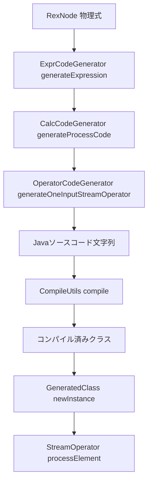

# 第26章 コード生成とtable-runtime演算子

> **本章で読むソース**
>
> - [`CodeGenUtils.scala`](https://github.com/apache/flink/blob/release-2.3.0/flink-table/flink-table-planner/src/main/scala/org/apache/flink/table/planner/codegen/CodeGenUtils.scala)
> - [`CalcCodeGenerator.scala`](https://github.com/apache/flink/blob/release-2.3.0/flink-table/flink-table-planner/src/main/scala/org/apache/flink/table/planner/codegen/CalcCodeGenerator.scala)
> - [`OperatorCodeGenerator.scala`](https://github.com/apache/flink/blob/release-2.3.0/flink-table/flink-table-planner/src/main/scala/org/apache/flink/table/planner/codegen/OperatorCodeGenerator.scala)
> - [`CommonExecCalc.java`](https://github.com/apache/flink/blob/release-2.3.0/flink-table/flink-table-planner/src/main/java/org/apache/flink/table/planner/plan/nodes/exec/common/CommonExecCalc.java)
> - [`CodeGenOperatorFactory.java`](https://github.com/apache/flink/blob/release-2.3.0/flink-table/flink-table-runtime/src/main/java/org/apache/flink/table/runtime/operators/CodeGenOperatorFactory.java)
> - [`GeneratedClass.java`](https://github.com/apache/flink/blob/release-2.3.0/flink-table/flink-table-runtime/src/main/java/org/apache/flink/table/runtime/generated/GeneratedClass.java)
> - [`CompileUtils.java`](https://github.com/apache/flink/blob/release-2.3.0/flink-table/flink-table-runtime/src/main/java/org/apache/flink/table/runtime/generated/CompileUtils.java)

## この章の狙い

第25章では、`ExecNode` が物理プランのノードごとに `translateToPlanInternal` を呼び、`Transformation` を組み立てていく過程を追った。

`CommonExecCalc`（射影と述語を持つ `Calc` の `ExecNode` 共通実装）は、この `translateToPlanInternal` の中で `CalcCodeGenerator.generateCalcOperator` を呼び出す。

本章では、この呼び出しから先、つまり `RexNode`（Calcite の物理式）が Java ソースコードの文字列へと組み立てられ、それが実行時にコンパイルされて演算子として動き出すまでを読む。

## 前提

`CommonExecCalc` は `getInputEdges()` から入力側の `Transformation` を取り出し、`CodeGeneratorContext` を1つ生成したうえで、コード生成の実体である `CalcCodeGenerator.generateCalcOperator` に処理を委ねる。

[`CommonExecCalc.java` L94-L112](https://github.com/apache/flink/blob/release-2.3.0/flink-table/flink-table-planner/src/main/java/org/apache/flink/table/planner/plan/nodes/exec/common/CommonExecCalc.java#L94-L112)

```java
        final CodeGeneratorContext ctx =
                new CodeGeneratorContext(config, planner.getFlinkContext().getClassLoader())
                        .setOperatorBaseClass(operatorBaseClass);

        final CodeGenOperatorFactory<RowData> substituteStreamOperator =
                CalcCodeGenerator.generateCalcOperator(
                        ctx,
                        inputTransform,
                        (RowType) getOutputType(),
                        JavaScalaConversionUtil.toScala(projection),
                        JavaScalaConversionUtil.toScala(Optional.ofNullable(this.condition)),
                        retainHeader,
                        getClass().getSimpleName());
        return ExecNodeUtil.createOneInputTransformation(
                inputTransform,
                createTransformationMeta(CALC_TRANSFORMATION, config),
                substituteStreamOperator,
```

`projection`（出力列を作る `RexNode` の列）と `condition`（`WHERE` の述語を表す `RexNode`）は、いずれも Calcite の式木である。

`generateCalcOperator` の戻り値は `CodeGenOperatorFactory<RowData>` であり、`ExecNodeUtil.createOneInputTransformation` はこれを演算子ファクトリとして `Transformation` に組み込む。

ここが、第25章で見た物理プランの世界（`RexNode` の式木）と、第14章で見た `StreamOperator` の世界（`processElement` を呼ばれる実行時オブジェクト）が接続する場所になる。

`flink-table-planner`（コード生成そのものを行う Scala のモジュール）と、`flink-table-runtime`（生成されたコードが依存する実行時基盤を持つ Java のモジュール）は、依存の向きが一方向である。

`flink-table-planner` は `flink-table-runtime` のクラス（`GeneratedFunction`、`CodeGenOperatorFactory` など）を参照してコード生成を行うが、`flink-table-runtime` は `flink-table-planner` を参照しない。

生成される Java ソースコードは、実行時には `flink-table-runtime` の基盤クラス（`AbstractStreamOperator` など）だけに依存する形にしておく必要があるためである。

## CodeGenUtilsとGenerateUtils：Javaソースを文字列として組み立てる基盤

コード生成とは、実行するたびに式木をたどって評価するインタプリタを書くのではなく、式木1つに対して1つの Java メソッド本体（文字列）を組み立て、それをコンパイルして呼び出す方式である。

`CodeGenUtils` は、この文字列組み立てで繰り返し使う部品を提供する。

まず、生成コードの中で使うローカル変数名は、複数の式のコード生成が並行して走っても衝突しないよう、`CodeGeneratorContext` が持つカウンタを使って一意な名前を発行する。

[`CodeGenUtils.scala` L133-L141](https://github.com/apache/flink/blob/release-2.3.0/flink-table/flink-table-planner/src/main/scala/org/apache/flink/table/planner/codegen/CodeGenUtils.scala#L133-L141)

```scala
  def newName(context: CodeGeneratorContext, name: String): String = {
    if (context == null || context.getNameCounter == null) {
      // Add an 'i' in the middle to distinguish from nameCounter in CodeGeneratorContext
      // and avoid naming conflicts.
      s"$name$$i${nameCounter.getAndIncrement}"
    } else {
      s"$name$$${context.getNameCounter.getAndIncrement}"
    }
  }
```

次に、Calcite の論理型（`LogicalType`）を、生成コードの中で使う Java の型名の文字列に変換する処理がある。

`primitiveTypeTermForType` は、`LogicalType` が `INT` や `BIGINT` のようなプリミティブ型に対応する場合は Java のプリミティブ型名を返し、それ以外は `boxedTypeTermForType`（ボックス化された型、または `RowData` や `BinaryStringData` などの内部データ型の型名を返す関数）に委譲する。

[`CodeGenUtils.scala` L205-L215](https://github.com/apache/flink/blob/release-2.3.0/flink-table/flink-table-planner/src/main/scala/org/apache/flink/table/planner/codegen/CodeGenUtils.scala#L205-L215)

```scala
  def primitiveTypeTermForType(t: LogicalType): String = t.getTypeRoot match {
    // ordered by type root definition
    case BOOLEAN => "boolean"
    case TINYINT => "byte"
    case SMALLINT => "short"
    case INTEGER | DATE | TIME_WITHOUT_TIME_ZONE | INTERVAL_YEAR_MONTH => "int"
    case BIGINT | INTERVAL_DAY_TIME => "long"
    case FLOAT => "float"
    case DOUBLE => "double"
    case DISTINCT_TYPE => primitiveTypeTermForType(t.asInstanceOf[DistinctType].getSourceType)
    case _ => boxedTypeTermForType(t)
  }
```

`primitiveDefaultValue` は、生成コードが変数を宣言する際に使う初期値の文字列を返す。

[`CodeGenUtils.scala` L302-L316](https://github.com/apache/flink/blob/release-2.3.0/flink-table/flink-table-planner/src/main/scala/org/apache/flink/table/planner/codegen/CodeGenUtils.scala#L302-L316)

```scala
  def primitiveDefaultValue(t: LogicalType): String = t.getTypeRoot match {
    // ordered by type root definition
    case CHAR | VARCHAR => s"$BINARY_STRING.EMPTY_UTF8"
    case BOOLEAN => "false"
    case TINYINT => "((byte) -1)"
    case SMALLINT => "((short) -1)"
    case INTEGER | DATE | TIME_WITHOUT_TIME_ZONE | INTERVAL_YEAR_MONTH => "-1"
    case BIGINT | INTERVAL_DAY_TIME => "-1L"
    case FLOAT => "-1.0f"
    case DOUBLE => "-1.0d"

    case DISTINCT_TYPE => primitiveDefaultValue(t.asInstanceOf[DistinctType].getSourceType)

    case _ => "null"
  }
```

`INTEGER` に対して `-1` を初期値に選んでいるのは、値が未初期化のまま使われるバグを検出しやすくするためであり、Java の `default` 値（`0`）とは意図的に変えてある。

`CodeGenUtils` がこうした型変換とリテラル生成の部品を提供する一方、`GenerateUtils` は式1つ分の評価コードを組み立てる、より上位のユーティリティを提供する。

`GenerateUtils.generateCallIfArgsNotNull` は、関数呼び出しの引数が `null` かどうかをチェックしたうえで呼び出す定型コード（Java の三項演算子や `if` 文に相当する文字列）を組み立てる関数であり、`ExprCodeGenerator`（式1つを担当するコード生成器）の内部で使われる。

`CodeGenUtils` と `GenerateUtils` は、いずれも実行するコードそのものではなく、実行するコードを表す文字列を組み立てる関数の集まりであるという点で共通している。

## CalcCodeGenerator：式評価をJavaコードに落とす

`Calc`（射影と述語を1つの演算子にまとめたノード）のコード生成を担うのが `CalcCodeGenerator` である。

`generateCalcOperator` は、`CommonExecCalc` から呼ばれるエントリポイントであり、`generateProcessCode` で1レコード分の処理コードを作ってから、`OperatorCodeGenerator.generateOneInputStreamOperator` で演算子クラス全体のコードに組み込む。

[`CalcCodeGenerator.scala` L36-L69](https://github.com/apache/flink/blob/release-2.3.0/flink-table/flink-table-planner/src/main/scala/org/apache/flink/table/planner/codegen/CalcCodeGenerator.scala#L36-L69)

```scala
  def generateCalcOperator(
      ctx: CodeGeneratorContext,
      inputTransform: Transformation[RowData],
      outputType: RowType,
      projection: Seq[RexNode],
      condition: Option[RexNode],
      retainHeader: Boolean = false,
      opName: String): CodeGenOperatorFactory[RowData] = {
    val inputType = inputTransform.getOutputType
      .asInstanceOf[InternalTypeInfo[RowData]]
      .toRowType
    // filter out time attributes
    val inputTerm = CodeGenUtils.DEFAULT_INPUT1_TERM
    val processCode = generateProcessCode(
      ctx,
      inputType,
      outputType,
      classOf[BoxedWrapperRowData],
      projection,
      condition,
      eagerInputUnboxingCode = true,
      retainHeader = retainHeader)

    val genOperator =
      OperatorCodeGenerator.generateOneInputStreamOperator[RowData, RowData](
        ctx,
        opName,
        processCode,
        inputType,
        inputTerm = inputTerm,
        lazyInputUnboxingCode = true)

    new CodeGenOperatorFactory(genOperator)
  }
```

`generateProcessCode` の内部で、射影の各列は `RexNode` から `ExprCodeGenerator.generateExpression` によって `GeneratedExpression`（生成コードの文字列と、その結果を保持するローカル変数名の組）に変換される。

[`CalcCodeGenerator.scala` L138-L155](https://github.com/apache/flink/blob/release-2.3.0/flink-table/flink-table-planner/src/main/scala/org/apache/flink/table/planner/codegen/CalcCodeGenerator.scala#L138-L155)

```scala
    def produceProjectionCode: String = {
      val projectionExprs = projection.map(exprGenerator.generateExpression)
      val projectionExpression =
        exprGenerator.generateResultExpression(projectionExprs, outRowType, outRowClass)

      val projectionExpressionCode = projectionExpression.code

      val header = if (retainHeader) {
        s"${projectionExpression.resultTerm}.setRowKind($inputTerm.getRowKind());"
      } else {
        ""
      }

      s"""
         |$header
         |$projectionExpressionCode
         |${produceOutputCode(projectionExpression.resultTerm)}
```

`projection.map(exprGenerator.generateExpression)` は、射影に含まれる列の数だけ式木をたどり、それぞれに対応する Java コード片を作る処理である。

述語（`condition`）がある場合も同様に、`exprGenerator.generateExpression(condition.get)` で述語の評価コードを生成し、`if` 文でくるんでレコードの通過と破棄を切り分ける。

この時点で、射影と述語という論理的に別の処理は、1つの `processCode`（文字列）へと合成されている。

## OperatorCodeGenerator：演算子クラス全体を1つのJavaソースにする

`generateProcessCode` が作るのは、レコード1件を処理する本体だけの断片である。

`OperatorCodeGenerator.generateOneInputStreamOperator` は、これを `processElement` メソッドの中身として埋め込み、クラス宣言、コンストラクタ、`open`、`finish` などを含めた1つの Java クラス全体のソースコードを組み立てる。

[`OperatorCodeGenerator.scala` L72-L107](https://github.com/apache/flink/blob/release-2.3.0/flink-table/flink-table-planner/src/main/scala/org/apache/flink/table/planner/codegen/OperatorCodeGenerator.scala#L72-L107)

```scala
    val operatorCode =
      j"""
      public class $operatorName extends ${abstractBaseClass.getCanonicalName}
          implements ${baseClass.getCanonicalName}$endInputImpl {

        private final Object[] references;
        ${ctx.reuseMemberCode()}

        public $operatorName(
            Object[] references,
            ${className[StreamTask[_, _]]} task,
            ${className[StreamConfig]} config,
            ${className[Output[_]]} output,
            ${className[ProcessingTimeService]} processingTimeService) throws Exception {
          this.references = references;
          ${ctx.reuseInitCode()}
          this.setup(task, config, output);
          if (this instanceof ${className[AbstractStreamOperator[_]]}) {
            ((${className[AbstractStreamOperator[_]]}) this)
              .setProcessingTimeService(processingTimeService);
          }
        }

        @Override
        public void open() throws Exception {
          super.open();
          ${ctx.reuseOpenCode()}
        }

        @Override
        public void processElement($STREAM_RECORD $ELEMENT) throws Exception {
          $inputTypeTerm $inputTerm = ($inputTypeTerm) ${converter(s"$ELEMENT.getValue()")};
          ${ctx.reusePerRecordCode()}
          ${ctx.reuseLocalVariableCode()}
          ${if (lazyInputUnboxingCode) "" else ctx.reuseInputUnboxingCode()}
          $processCode
        }

        $endInput
```

この文字列テンプレートを実際の値で埋めると、クラス宣言は第14章で読んだ `AbstractStreamOperator`（または `abstractBaseClass` として渡された別の基底クラス）を継承し、`OneInputStreamOperator`（`baseClass`）を実装する形になる。

`processElement` の本体には、`generateProcessCode` が組み立てた `processCode` がそのまま挿入される。

つまり生成される演算子クラスは、第14章で読んだ `StreamMap` のような手書きの演算子と、実行時のインタフェース上は区別がつかない。

`AbstractStreamOperator` が定める `setup`、`open`、`processElement`、`close` というライフサイクルは、生成された演算子にもそのまま適用される。

コンストラクタが受け取る `references` は、生成コードの外側にある実行時オブジェクト（`UserDefinedFunction` のインスタンスや正規表現の `Pattern` など、コード生成では文字列化できないオブジェクト）への参照を保持する配列であり、`GeneratedFunction` や `GeneratedClass` がこの配列を演算子側に引き渡す役割を持つ。

## GeneratedClassとCompileUtils：文字列から実行可能なクラスへ

`OperatorCodeGenerator.generateOneInputStreamOperator` の戻り値は `GeneratedOperator`（`GeneratedClass` のサブクラス）であり、`generateCalcOperator` の最後でこれを `CodeGenOperatorFactory` に包む。

`CodeGenOperatorFactory` は `AbstractStreamOperatorFactory` を実装し、`createStreamOperator` が呼ばれた時点で初めて `GeneratedClass.newInstance` を呼び出す。

[`CodeGenOperatorFactory.java` L27-L47](https://github.com/apache/flink/blob/release-2.3.0/flink-table/flink-table-runtime/src/main/java/org/apache/flink/table/runtime/operators/CodeGenOperatorFactory.java#L27-L47)

```java
public class CodeGenOperatorFactory<OUT> extends AbstractStreamOperatorFactory<OUT> {

    private final GeneratedClass<? extends StreamOperator<OUT>> generatedClass;

    public CodeGenOperatorFactory(GeneratedClass<? extends StreamOperator<OUT>> generatedClass) {
        this.generatedClass = generatedClass;
    }

    @SuppressWarnings("unchecked")
    @Override
    public <T extends StreamOperator<OUT>> T createStreamOperator(
            StreamOperatorParameters<OUT> parameters) {
        return (T)
                generatedClass.newInstance(
                        parameters.getContainingTask().getUserCodeClassLoader(),
                        generatedClass.getReferences(),
                        parameters.getContainingTask(),
                        parameters.getStreamConfig(),
                        parameters.getOutput(),
                        processingTimeService);
    }
```

`createStreamOperator` は `TaskExecutor` 側（第12章）で `StreamTask` が演算子を生成するタイミングで呼ばれる。

ここまでは Java ソースコードの文字列を組み立てるだけの処理だったが、`newInstance` の呼び出しで初めてコンパイルが起きる。

[`GeneratedClass.java` L66-L92](https://github.com/apache/flink/blob/release-2.3.0/flink-table/flink-table-runtime/src/main/java/org/apache/flink/table/runtime/generated/GeneratedClass.java#L66-L92)

```java
    public T newInstance(ClassLoader classLoader) {
        try {
            return compile(classLoader)
                    .getConstructor(Object[].class)
                    // Because Constructor.newInstance(Object... initargs), we need to load
                    // references into a new Object[], otherwise it cannot be compiled.
                    .newInstance(new Object[] {references});
        } catch (Throwable e) {
            throw new RuntimeException(
                    "Could not instantiate generated class '" + className + "'", e);
        }
    }

    @SuppressWarnings("unchecked")
    public T newInstance(ClassLoader classLoader, Object... args) {
        try {
            return (T) compile(classLoader).getConstructors()[0].newInstance(args);
        } catch (Exception e) {
            throw new RuntimeException(
                    "Could not instantiate generated class '" + className + "'", e);
        }
    }

    /**
     * Compiles the generated code, the compiled class will be cached in the {@link GeneratedClass}.
     */
    public Class<T> compile(ClassLoader classLoader) {
        if (compiledClass == null) {
            // cache the compiled class
            try {
                // first try to compile the split code
                compiledClass = CompileUtils.compile(classLoader, className, splitCode);
```

`compile` の中身は `CompileUtils.compile` に委譲される。

`CompileUtils` は、コンパイル結果のクラスをキャッシュに保持したうえで、Janino（Java ソースコードをその場でコンパイルする軽量コンパイラライブラリ）の `SimpleCompiler` に文字列を渡してコンパイルする。

[`CompileUtils.java` L86-L114](https://github.com/apache/flink/blob/release-2.3.0/flink-table/flink-table-runtime/src/main/java/org/apache/flink/table/runtime/generated/CompileUtils.java#L86-L114)

```java
    public static <T> Class<T> compile(ClassLoader cl, String name, String code) {
        try {
            // The class name is part of the "code" and makes the string unique,
            // to prevent class leaks we don't cache the class loader directly
            // but only its hash code
            final ClassKey classKey = new ClassKey(cl.hashCode(), code);
            return (Class<T>) COMPILED_CLASS_CACHE.get(classKey, () -> doCompile(cl, name, code));
        } catch (Exception e) {
            throw new FlinkRuntimeException(e.getMessage(), e);
        }
    }

    private static <T> Class<T> doCompile(ClassLoader cl, String name, String code) {
        checkNotNull(cl, "Classloader must not be null.");
        CODE_LOG.debug("Compiling: {} \n\n Code:\n{}", name, code);
        SimpleCompiler compiler = new SimpleCompiler();
        compiler.setParentClassLoader(cl);
        try {
            compiler.cook(code);
        } catch (Throwable t) {
            System.out.println(addLineNumber(code));
            throw new InvalidProgramException(
                    "Table program cannot be compiled. This is a bug. Please file an issue.", t);
        }
        try {
            //noinspection unchecked
            return (Class<T>) compiler.getClassLoader().loadClass(name);
        } catch (ClassNotFoundException e) {
            throw new RuntimeException("Can not load class " + name, e);
```

`COMPILED_CLASS_CACHE` は `ClassKey`（クラスローダーのハッシュ値と生成コード本体をキーにする）をキーとするキャッシュであり、同じ生成コードに対する再コンパイルを避ける。

`compiler.cook(code)` が実際のコンパイルの呼び出しであり、成功すればコンパイル結果のクラスをそのクラスローダーからロードして返す。

`GeneratedClass.newInstance` は、こうして得たクラスのコンストラクタに `references`（先述の、コード生成では文字列化できないオブジェクトの配列）を渡してインスタンスを作る。

以上で、`RexNode` から始まった処理は `StreamOperator` の実行時インスタンス1個にたどり着いた。

## なぜ式評価をコード生成するか

`GenerateUtils.generateCallIfArgsNotNull` のような部品が、式木の各ノードに対してJavaコード片を組み立てる設計になっているのは、実行時に式木そのものを繰り返しトラバースする評価器を避けるためである。

式木をインタプリタとして評価する実装であれば、レコード1件ごとに、木のノードを辿りながら「このノードは加算か比較か関数呼び出しか」を分岐で判定し、各ノードが保持する子ノードへの参照をたどって仮想メソッド呼び出しを重ねることになる。

`CalcCodeGenerator` と `OperatorCodeGenerator` がここまでで組み立てたコードは、この分岐と仮想呼び出しをコンパイル時に消してしまう。

`primitiveTypeTermForType` によって列の型ごとに専用の Java プリミティブ型が選ばれ、`ExprCodeGenerator.generateExpression` が式木のノード数に応じた直線的な文の列を生成するため、実行時の `processElement` は「この呼び出しがどの型のどの演算か」を一切判定しない、型特化されたコードになる。

型が生成時点で固定された直線的なコードは、JIT コンパイラがインライン化や型に応じた最適化を行いやすい対象であり、式木をたどるインタプリタよりも高速に実行できる。

`GeneratedClass` がコンパイル結果をクラス単位でキャッシュするのも、この型特化コードを作るコストが安くないためであり、同一の実行計画から繰り返し演算子インスタンスを作る場面（並列度の分だけ演算子を生成する場面など）で、コンパイルを1回に抑える工夫になっている。



## まとめ

`CommonExecCalc` は `translateToPlanInternal` の中で `CalcCodeGenerator.generateCalcOperator` を呼び、`RexNode` で表された射影と述語をコード生成の入口に渡す。

`CodeGenUtils` と `GenerateUtils` は、変数名の発行、型変換、リテラル生成といった部品を提供し、`ExprCodeGenerator` はこれらを使って式木のノードごとに Java コード片（`GeneratedExpression`）を組み立てる。

`OperatorCodeGenerator.generateOneInputStreamOperator` は、この処理コードを `processElement` に埋め込んだ演算子クラス全体のソースコードを1つの文字列として組み立て、`CodeGenOperatorFactory` がそれを `GeneratedClass` として保持する。

実行時に `createStreamOperator` が呼ばれると、`GeneratedClass.newInstance` が `CompileUtils.compile` を通じて Janino に文字列をコンパイルさせ、得られたクラスから演算子インスタンスを生成する。

こうして生成される演算子は `AbstractStreamOperator` を継承する点で手書きの演算子と変わらないが、レコード1件あたりの処理は、式木の分岐と仮想呼び出しを排した型特化の直線的なコードになっている。

## 関連する章

- [第25章 物理プランとExecNode](25-physical-execnode.md)
- [第14章 演算子とユーザー定義関数の実行](../part04-task-execution/14-operators-udf.md)
- [第4章 型システムとシリアライザ](../part01-core/04-type-serialization.md)
