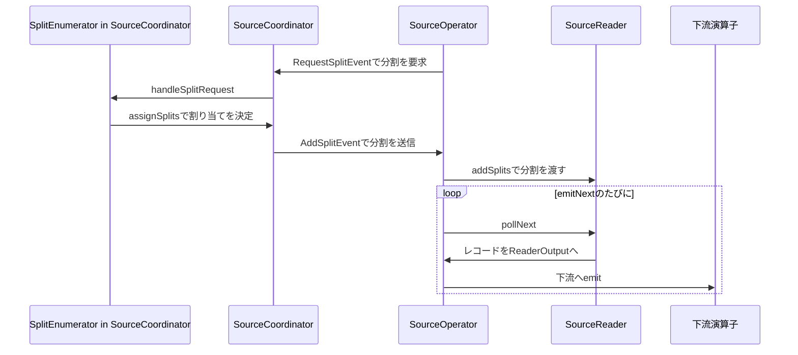

# 第27章 新しい Source API：FLIP-27

> **本章で読むソース**
>
> - [`Source.java`](https://github.com/apache/flink/blob/release-2.3.0/flink-core/src/main/java/org/apache/flink/api/connector/source/Source.java)
> - [`SourceSplit.java`](https://github.com/apache/flink/blob/release-2.3.0/flink-core/src/main/java/org/apache/flink/api/connector/source/SourceSplit.java)
> - [`SourceReader.java`](https://github.com/apache/flink/blob/release-2.3.0/flink-core/src/main/java/org/apache/flink/api/connector/source/SourceReader.java)
> - [`SplitEnumerator.java`](https://github.com/apache/flink/blob/release-2.3.0/flink-core/src/main/java/org/apache/flink/api/connector/source/SplitEnumerator.java)
> - [`SourceOperator.java`](https://github.com/apache/flink/blob/release-2.3.0/flink-runtime/src/main/java/org/apache/flink/streaming/api/operators/SourceOperator.java)
> - [`SourceCoordinator.java`](https://github.com/apache/flink/blob/release-2.3.0/flink-runtime/src/main/java/org/apache/flink/runtime/source/coordinator/SourceCoordinator.java)
> - [`SourceCoordinatorContext.java`](https://github.com/apache/flink/blob/release-2.3.0/flink-runtime/src/main/java/org/apache/flink/runtime/source/coordinator/SourceCoordinatorContext.java)
> - [`OperatorCoordinator.java`](https://github.com/apache/flink/blob/release-2.3.0/flink-runtime/src/main/java/org/apache/flink/runtime/operators/coordination/OperatorCoordinator.java)

## この章の狙い

第14章では、演算子が `processElement` を起点に下流へレコードを送り出す仕組みを読んだ。

その `processElement` を最初に駆動するのはどこか。

ストリームの先頭にあたる Source 演算子は、外部システムからレコードを取り出す点で他の演算子と性質が異なる。

外部システムは、Kafka のパーティション、ファイルシステムのブロック、データベースのシャードのように、並行して読み進められる単位に分けられることが多い。

FLIP-27（Flink Improvement Proposal 27）は、この分割の発見と読み取りを別々の責務として切り出す形で Source API を再設計した。

本章では、`Source` インタフェースが定める分割モデルと、分割を発見し割り当てる `SplitEnumerator`、分割を実際に読む `SourceReader` の役割分担を読む。

続けて、`SourceReader` を演算子として駆動する `SourceOperator` と、JobMaster 側で `SplitEnumerator` を動かす `SourceCoordinator` が、`OperatorCoordinator` という仕組みを介してどう連携し、分割をサブタスクへ届けるかを追う。

## 前提

第10章で見たとおり、`JobMaster` は `ExecutionVertex` のデプロイをスケジューラへ委ねる。

Source 演算子だけは、デプロイされた個々のサブタスクに閉じない調整役をもう一つ必要とする。

外部システムのどの範囲をどのサブタスクに読ませるかは、ジョブ全体を見渡す単一の主体が決めなければ、同じ範囲を複数のサブタスクが重複して読んだり、逆に誰も読まない範囲が残ったりする。

この調整役が `OperatorCoordinator` であり、JobMaster 側で動作して各サブタスクの `SourceOperator` と通信する。

FLIP-27 以前の `SourceFunction` にはこの調整役がなく、並列度に応じた分割の割り当てをユーザーコード側で静的に決めるしかなかった。

FLIP-27 は、分割の発見と割り当てを `SplitEnumerator` に、分割の読み取りを `SourceReader` にそれぞれ切り出すことで、実行中に分割を動的に発見し、実行中のサブタスクへ動的に割り当てられる構造に置き換えた。

## Source インタフェースと分割モデル

`Source` は、実行時に必要な二つの部品を生成するファクトリである。

[`Source.java` L36-L45](https://github.com/apache/flink/blob/release-2.3.0/flink-core/src/main/java/org/apache/flink/api/connector/source/Source.java#L36-L45)

```java
@Public
public interface Source<T, SplitT extends SourceSplit, EnumChkT>
        extends SourceReaderFactory<T, SplitT> {

    /**
     * Get the boundedness of this source.
     *
     * @return the boundedness of this source.
     */
    Boundedness getBoundedness();
```

型パラメータ `SplitT` が、この Source が扱う**分割**（split）の型である。

分割は、外部システムの読み取り範囲をひとまとまりにした単位であり、`SourceSplit` インタフェースを実装する。

[`SourceSplit.java` L23-L33](https://github.com/apache/flink/blob/release-2.3.0/flink-core/src/main/java/org/apache/flink/api/connector/source/SourceSplit.java#L23-L33)

```java
/** An interface for all the Split types to extend. */
@Public
public interface SourceSplit {

    /**
     * Get the split id of this source split.
     *
     * @return id of this source split.
     */
    String splitId();
}
```

`SourceSplit` が要求するのは `splitId` だけであり、分割の中身（Kafka ならパーティションと読み取り開始オフセット、ファイルソースならファイルパスとバイト範囲）はコネクタごとの実装に委ねられる。

`Source` は `getBoundedness` によって、このソースが有限個のレコードで終わる**有界**（bounded）なものか、終わりなく続く**無界**（unbounded）なものかを表明する。

バッチ実行とストリーミング実行のどちらであっても、分割の発見と読み取りという同じ二つの部品を組み合わせて実行できる点が、FLIP-27 が旧 `SourceFunction` を置き換えた理由の一つである。

## 分割の発見と割り当てを担う SplitEnumerator

`SplitEnumerator` は、外部システムから分割を発見し、`SourceReader` へ割り当てる役割を持つ。

[`SplitEnumerator.java` L33-L42](https://github.com/apache/flink/blob/release-2.3.0/flink-core/src/main/java/org/apache/flink/api/connector/source/SplitEnumerator.java#L33-L42)

```java
@Public
public interface SplitEnumerator<SplitT extends SourceSplit, CheckpointT>
        extends AutoCloseable, CheckpointListener {

    /**
     * Start the split enumerator.
     *
     * <p>The default behavior does nothing.
     */
    void start();
```

`SplitEnumerator` は分割の割り当て契機を複数持つ。
サブタスクからの要求（`sendSplitRequest` に対応する `handleSplitRequest`）に応じて割り当てるほか、reader 登録を受け取る `addReader` を契機に connector 実装が割り当てを開始することもできる。

[`SplitEnumerator.java` L44-L52](https://github.com/apache/flink/blob/release-2.3.0/flink-core/src/main/java/org/apache/flink/api/connector/source/SplitEnumerator.java#L44-L52)

```java
    /**
     * Handles the request for a split. This method is called when the reader with the given subtask
     * id calls the {@link SourceReaderContext#sendSplitRequest()} method.
     *
     * @param subtaskId the subtask id of the source reader who sent the source event.
     * @param requesterHostname Optional, the hostname where the requesting task is running. This
     *     can be used to make split assignments locality-aware.
     */
    void handleSplitRequest(int subtaskId, @Nullable String requesterHostname);
```

`handleSplitRequest` の Javadoc が示すとおり、割り当てのきっかけは `SourceReaderContext.sendSplitRequest` である。

`sendSplitRequest` による要求は割り当ての契機のひとつだが、それだけではない。
reader 登録時の `addReader` でも connector 実装は割り当てを始められ、要求駆動にするか登録契機で配るかは Source 実装に委ねられている。

`requesterHostname` を受け取れることも重要であり、`SplitEnumerator` は要求元サブタスクが動いているホストを踏まえて、ローカリティを考慮した割り当てを行える。

## 分割を読み取る SourceReader

`SourceReader` は、割り当てられた分割からレコードを読み、下流へ渡す役割を持つ。

[`SourceReader.java` L55-L57](https://github.com/apache/flink/blob/release-2.3.0/flink-core/src/main/java/org/apache/flink/api/connector/source/SourceReader.java#L55-L57)

```java
@Public
public interface SourceReader<T, SplitT extends SourceSplit>
        extends AutoCloseable, CheckpointListener {
```

レコードを取り出す中心のメソッドが `pollNext` である。

[`SourceReader.java` L62-L73](https://github.com/apache/flink/blob/release-2.3.0/flink-core/src/main/java/org/apache/flink/api/connector/source/SourceReader.java#L62-L73)

```java
    /**
     * Poll the next available record into the {@link ReaderOutput}.
     *
     * <p>The implementation must make sure this method is non-blocking.
     *
     * <p>Although the implementation can emit multiple records into the given ReaderOutput, it is
     * recommended not doing so. Instead, emit one record into the ReaderOutput and return a {@link
     * InputStatus#MORE_AVAILABLE} to let the caller thread know there are more records available.
     *
     * @return The InputStatus of the SourceReader after the method invocation.
     */
    InputStatus pollNext(ReaderOutput<T> output) throws Exception;
```

`pollNext` は非ブロッキングでなければならない。

外部システムへの実際のブロッキング I/O（ネットワーク経由のフェッチなど）は、`SourceReader` の実装が別スレッドで行い、`pollNext` はそのスレッドが用意した結果を取り出すだけにとどめる、という分担が Javadoc から読み取れる。

分割を受け取る側のメソッドが `addSplits` であり、`SplitEnumerator` からの割り当てが届く経路として明示されている。

[`SourceReader.java` L104-L111](https://github.com/apache/flink/blob/release-2.3.0/flink-core/src/main/java/org/apache/flink/api/connector/source/SourceReader.java#L104-L111)

```java
    /**
     * Adds a list of splits for this reader to read. This method is called when the enumerator
     * assigns a split via {@link SplitEnumeratorContext#assignSplit(SourceSplit, int)} or {@link
     * SplitEnumeratorContext#assignSplits(SplitsAssignment)}.
     *
     * @param splits The splits assigned by the split enumerator.
     */
    void addSplits(List<SplitT> splits);
```

ここまでで、`SplitEnumerator` と `SourceReader` の関係が見えてくる。

`SplitEnumerator` は分割の発見と割り当ての判断だけを持ち、`SourceReader` は割り当てられた分割を実際に読む処理だけを持つ。

両者は同じ JVM 上で動くとは限らず、`SplitEnumerator` は JobMaster 側、`SourceReader` は各サブタスクの TaskExecutor 側で動く。

この分離により、割り当ての判断ロジックを1箇所に集約しながら、読み取りの実処理を各サブタスクへ並列に分散させられる。

## SourceOperator：SourceReader を演算子として駆動する

`SourceReader` はそれ自身では `StreamOperator` ではない。

`SourceReader` を演算子として StreamTask の実行モデルに組み込むのが `SourceOperator` である。

[`SourceOperator.java` L106-L110](https://github.com/apache/flink/blob/release-2.3.0/flink-runtime/src/main/java/org/apache/flink/streaming/api/operators/SourceOperator.java#L106-L110)

```java
@Internal
public class SourceOperator<OUT, SplitT extends SourceSplit> extends AbstractStreamOperator<OUT>
        implements OperatorEventHandler,
                PushingAsyncDataInput<OUT>,
                TimestampsAndWatermarks.WatermarkUpdateListener {
```

第14章で見た演算子群は `Input<IN>` を実装し、`StreamTask` の mailbox がレコードを取り出すたびに `processElement` を呼んでいた。

`SourceOperator` にはそもそも上流演算子がなく、`processElement` の代わりに `PushingAsyncDataInput` の `emitNext` が呼び出しの起点になる。

[`SourceOperator.java` L515-L540](https://github.com/apache/flink/blob/release-2.3.0/flink-runtime/src/main/java/org/apache/flink/streaming/api/operators/SourceOperator.java#L515-L540)

```java
    @Override
    public DataInputStatus emitNext(DataOutput<OUT> output) throws Exception {
        if (waitingForCheckpoint && operatingMode == OperatingMode.SOURCE_DRAINED) {
            return DataInputStatus.END_OF_DATA;
        }
        // guarding an assumptions we currently make due to the fact that certain classes
        // assume a constant output, this assumption does not need to stand if we emitted all
        // records. In that case the output will change to FinishedDataOutput
        assert lastInvokedOutput == output
                || lastInvokedOutput == null
                || this.operatingMode == OperatingMode.DATA_FINISHED;

        // short circuit the hot path. Without this short circuit (READING handled in the
        // switch/case) InputBenchmark.mapSink was showing a performance regression.
        if (operatingMode != OperatingMode.READING) {
            return emitNextNotReading(output);
        }

        InputStatus status;
        do {
            status = sourceReader.pollNext(currentMainOutput);
        } while (status == InputStatus.MORE_AVAILABLE
                && canEmitBatchOfRecords.check()
                && !shouldWaitForAlignment());
        return convertToInternalStatus(status);
    }
```

`emitNext` の実体は `sourceReader.pollNext` を呼ぶことであり、その戻り値である `InputStatus` が `MORE_AVAILABLE` である限り、`do-while` ループの中で `pollNext` を呼び続ける。

コメントが述べるとおり、`operatingMode != OperatingMode.READING` を先に判定して通常時の経路を早く抜けさせているのは、状態遷移の分岐を毎回フルに評価するコストを避けるためである。

`StreamTask` の mailbox 実行モデル（第13章）における `emitNext` の位置づけは、他の演算子の `processElement` に相当する。

mailbox がアイドル状態のときに `emitNext` を呼び出し、`pollNext` が `MORE_AVAILABLE` を返す限りレコードを吐き出させ続け、`NOTHING_AVAILABLE` が返ってきたところで mailbox は他のタスク（チェックポイントバリアの処理やタイマーの発火など）に制御を戻す。

読み取ったレコードは `currentMainOutput`（`ReaderOutput`、`Output` の拡張）を介して下流へ渡され、以降は第14章で見た `ChainingOutput` や `RecordWriterOutput` の経路に合流する。

## SourceOperator と SourceCoordinator の通信経路

`SourceOperator` は、分割を要求する必要が生じると `OperatorEventGateway` を介してイベントを送る。

[`SourceOperator.java` L338-L342](https://github.com/apache/flink/blob/release-2.3.0/flink-runtime/src/main/java/org/apache/flink/streaming/api/operators/SourceOperator.java#L338-L342)

```java
                    @Override
                    public void sendSplitRequest() {
                        operatorEventGateway.sendEventToCoordinator(
                                new RequestSplitEvent(getLocalHostName()));
                    }
```

逆方向、つまり `SplitEnumerator` から割り当てられた分割が `SourceOperator` へ届くのは、`OperatorEventHandler` インタフェースの `handleOperatorEvent` を経由する。

[`SourceOperator.java` L718-L741](https://github.com/apache/flink/blob/release-2.3.0/flink-runtime/src/main/java/org/apache/flink/streaming/api/operators/SourceOperator.java#L718-L741)

```java
    @SuppressWarnings("unchecked")
    public void handleOperatorEvent(OperatorEvent event) {
        if (event instanceof WatermarkAlignmentEvent) {
            updateMaxDesiredWatermark((WatermarkAlignmentEvent) event);
            checkWatermarkAlignment();
            checkSplitWatermarkAlignment();
        } else if (event instanceof AddSplitEvent) {
            handleAddSplitsEvent(((AddSplitEvent<SplitT>) event));
        } else if (event instanceof SourceEventWrapper) {
            sourceReader.handleSourceEvents(((SourceEventWrapper) event).getSourceEvent());
        } else if (event instanceof NoMoreSplitsEvent) {
            sourceReader.notifyNoMoreSplits();
        } else if (event instanceof IsProcessingBacklogEvent) {
            if (eventTimeLogic != null) {
                eventTimeLogic.emitImmediateWatermark(System.currentTimeMillis());
            }
            output.emitRecordAttributes(
                    new RecordAttributesBuilder(Collections.emptyList())
                            .setBacklog(((IsProcessingBacklogEvent) event).isProcessingBacklog())
                            .build());
        } else {
            throw new IllegalStateException("Received unexpected operator event " + event);
        }
    }
```

分割の割り当てを表す `AddSplitEvent` を受け取ると、`handleAddSplitsEvent` が実際の反映を行う。

[`SourceOperator.java` L743-L760](https://github.com/apache/flink/blob/release-2.3.0/flink-runtime/src/main/java/org/apache/flink/streaming/api/operators/SourceOperator.java#L743-L760)

```java
    private void handleAddSplitsEvent(AddSplitEvent<SplitT> event) {
        try {
            List<SplitT> newSplits = event.splits(splitSerializer);
            if (operatingMode == OperatingMode.OUTPUT_NOT_INITIALIZED) {
                // For splits arrived before the main output is initialized, store them into the
                // pending list. Outputs of these splits will be created once the main output is
                // ready.
                splitsToInitializeOutput.addAll(newSplits);
            } else {
                // Create output directly for new splits if the main output is already initialized.
                createOutputForSplits(newSplits);
            }
            sourceReader.addSplits(newSplits);
            createMetricGroupForSplits(newSplits);
        } catch (IOException e) {
            throw new FlinkRuntimeException("Failed to deserialize the splits.", e);
        }
    }
```

`event.splits(splitSerializer)` によってバイト列から分割オブジェクトへデシリアライズしたうえで、最終的に `sourceReader.addSplits(newSplits)` を呼ぶ。

ここまでで、`SourceReader.addSplits`（前節で読んだ `SourceReader` 側のメソッド）が実際にどこから呼ばれているかが追えたことになる。

`SourceOperator` はこの一連のイベント授受を仲介するだけで、分割をどのサブタスクに割り当てるかという判断そのものは持たない。

## SourceCoordinator：JobMaster 側で SplitEnumerator を動かす調整役

`SourceOperator` が送信した `RequestSplitEvent` や、割り当て後に送られる `AddSplitEvent` の受け皿となるのが `SourceCoordinator` である。

`SourceCoordinator` は `OperatorCoordinator` インタフェースを実装し、JobMaster 側で動作する。

[`OperatorCoordinator.java` L42-L51](https://github.com/apache/flink/blob/release-2.3.0/flink-runtime/src/main/java/org/apache/flink/runtime/operators/coordination/OperatorCoordinator.java#L42-L51)

```java
 * <h2>Thread Model</h2>
 *
 * <p>All coordinator methods are called by the Job Manager's main thread (mailbox thread). That
 * means that these methods must not, under any circumstances, perform blocking operations (like I/O
 * or waiting on locks or futures). That would run a high risk of bringing down the entire
 * JobManager.
 *
 * <p>Coordinators that involve more complex operations should hence spawn threads to handle the I/O
 * work. The methods on the {@link Context} are safe to be called from another thread than the
 * thread that calls the Coordinator's methods.
```

`OperatorCoordinator` のメソッドは JobMaster のメインスレッド（mailbox スレッド）から呼ばれる。

`SplitEnumerator` の実装が外部システムへの問い合わせのようなブロッキング処理を行いうることを踏まえ、`SourceCoordinator` はこの制約を守るために専用の実行スレッド（コーディネータ実行用スレッド）を介して `SplitEnumerator` を動かす。

`SourceCoordinator.start` が `SplitEnumerator` を生成し起動する箇所を見る。

[`SourceCoordinator.java` L234-L264](https://github.com/apache/flink/blob/release-2.3.0/flink-runtime/src/main/java/org/apache/flink/runtime/source/coordinator/SourceCoordinator.java#L234-L264)

```java
    @Override
    public void start() throws Exception {
        LOG.info("Starting split enumerator for source {}.", operatorName);

        // we mark this as started first, so that we can later distinguish the cases where
        // 'start()' wasn't called and where 'start()' failed.
        started = true;

        // there are two ways the SplitEnumerator can get created:
        //  (1) Source.restoreEnumerator(), in which case the 'resetToCheckpoint()' method creates
        // it
        //  (2) Source.createEnumerator, in which case it has not been created, yet, and we create
        // it here
        if (enumerator == null) {
            final ClassLoader userCodeClassLoader =
                    context.getCoordinatorContext().getUserCodeClassloader();
            try (TemporaryClassLoaderContext ignored =
                    TemporaryClassLoaderContext.of(userCodeClassLoader)) {
                enumerator = source.createEnumerator(context);
            } catch (Throwable t) {
                ExceptionUtils.rethrowIfFatalErrorOrOOM(t);
                LOG.error("Failed to create Source Enumerator for source {}", operatorName, t);
                context.failJob(t);
                return;
            }
        }

        // The start sequence is the first task in the coordinator executor.
        // We rely on the single-threaded coordinator executor to guarantee
        // the other methods are invoked after the enumerator has started.
        runInEventLoop(() -> enumerator.start(), "starting the SplitEnumerator.");
```

`enumerator = source.createEnumerator(context)` によって、章の前半で読んだ `Source.createEnumerator` が実際に呼ばれる場所がここだとわかる。

`runInEventLoop` がコメントで説明するとおり、`enumerator.start()` 以降の `SplitEnumerator` に対する操作はすべて単一スレッドの「コーディネータ実行用スレッド」上で順序どおりに実行される。

`SourceOperator` からのイベントは `handleEventFromOperator` で受け取り、種類ごとに振り分ける。

分割要求（`RequestSplitEvent`）が届いたときの処理を見る。

[`SourceCoordinator.java` L650-L662](https://github.com/apache/flink/blob/release-2.3.0/flink-runtime/src/main/java/org/apache/flink/runtime/source/coordinator/SourceCoordinator.java#L650-L662)

```java
    private void handleRequestSplitEvent(int subtask, int attemptNumber, RequestSplitEvent event) {
        LOG.info(
                "Source {} received split request from parallel task {} (#{})",
                operatorName,
                subtask,
                attemptNumber);

        // request splits from the enumerator only if the enumerator has un-assigned splits
        // this helps to reduce unnecessary split requests to the enumerator
        if (!context.hasNoMoreSplits(subtask)) {
            enumerator.handleSplitRequest(subtask, event.hostName());
        }
    }
```

`enumerator.handleSplitRequest(subtask, event.hostName())` が、前節で読んだ `SplitEnumerator.handleSplitRequest` の呼び出し元である。

サブタスクが起動して `SourceOperator` が最初に登録するタイミングでは、`ReaderRegistrationEvent` を経由して `SplitEnumerator.addReader` が呼ばれる。

[`SourceCoordinator.java` L686-L709](https://github.com/apache/flink/blob/release-2.3.0/flink-runtime/src/main/java/org/apache/flink/runtime/source/coordinator/SourceCoordinator.java#L686-L709)

```java
    private void handleReaderRegistrationEvent(
            int subtask, int attemptNumber, ReaderRegistrationEvent event) throws Exception {
        checkArgument(subtask == event.subtaskId());

        LOG.info(
                "Source {} registering reader for parallel task {} (#{}) @ {}",
                operatorName,
                subtask,
                attemptNumber,
                event.location());

        final boolean subtaskReaderExisted =
                context.registeredReadersOfAttempts().containsKey(subtask);
        context.registerSourceReader(
                subtask, attemptNumber, event.location(), event.splits(splitSerializer));
        if (!subtaskReaderExisted) {
            enumerator.addReader(event.subtaskId());

            final Boolean isBacklog = context.isBacklog().getAsBoolean();
            if (isBacklog != null) {
                context.sendEventToSourceOperatorIfTaskReady(
                        subtask, new IsProcessingBacklogEvent(isBacklog));
            }
        }
```

`SplitEnumerator` は `handleSplitRequest` や `addReader` の中で分割の割り当てを決めると、`SplitEnumeratorContext.assignSplits` を呼ぶ。

`SourceCoordinator` はこの `Context` の実装（`SourceCoordinatorContext`）でもあり、`assignSplits` が実際に `AddSplitEvent` を組み立てて送信する。

[`SourceCoordinatorContext.java` L287-L310](https://github.com/apache/flink/blob/release-2.3.0/flink-runtime/src/main/java/org/apache/flink/runtime/source/coordinator/SourceCoordinatorContext.java#L287-L310)

```java
    @Override
    public void assignSplits(SplitsAssignment<SplitT> assignment) {
        // Ensure the split assignment is done by the coordinator executor.
        callInCoordinatorThread(
                () -> {
                    // Ensure all the subtasks in the assignment have registered.
                    assignment
                            .assignment()
                            .forEach(
                                    (id, splits) -> {
                                        if (!registeredReaders.containsKey(id)) {
                                            throw new IllegalArgumentException(
                                                    String.format(
                                                            "Cannot assign splits %s to subtask %d because the subtask is not registered.",
                                                            splits, id));
                                        }
                                    });

                    assignmentTracker.recordSplitAssignment(assignment);
                    assignSplitsToAttempts(assignment);
                    return null;
                },
                String.format("Failed to assign splits %s due to ", assignment));
    }
```

`assignSplitsToAttempts` を辿った先が、実際に `AddSplitEvent` を作って送る箇所である。

[`SourceCoordinatorContext.java` L621-L639](https://github.com/apache/flink/blob/release-2.3.0/flink-runtime/src/main/java/org/apache/flink/runtime/source/coordinator/SourceCoordinatorContext.java#L621-L639)

```java
    private void assignSplitsToAttempt(int subtaskIndex, int attemptNumber, List<SplitT> splits) {
        checkAndLazyInitialize();
        if (splits.isEmpty()) {
            return;
        }

        checkAttemptReaderReady(subtaskIndex, attemptNumber);

        final AddSplitEvent<SplitT> addSplitEvent;
        try {
            addSplitEvent = new AddSplitEvent<>(splits, splitSerializer);
        } catch (IOException e) {
            throw new FlinkRuntimeException("Failed to serialize splits.", e);
        }

        final OperatorCoordinator.SubtaskGateway gateway =
                subtaskGateways.getGatewayAndCheckReady(subtaskIndex, attemptNumber);
        gateway.sendEvent(addSplitEvent);
    }
```

`gateway.sendEvent(addSplitEvent)` によって送られた `AddSplitEvent` は、`SourceOperator.handleOperatorEvent`（前節で読んだ箇所）へ届き、`sourceReader.addSplits` に至る。

これで、要求から割り当てまでの一巡が追えたことになる。

`SourceOperator.sendSplitRequest` が `RequestSplitEvent` を送り、`SourceCoordinator.handleRequestSplitEvent` が `SplitEnumerator.handleSplitRequest` を呼び、`SplitEnumerator` は `SplitEnumeratorContext.assignSplits`（実体は `SourceCoordinatorContext.assignSplits`）を呼んで応答し、その結果が `AddSplitEvent` として `SourceOperator` へ戻る。

## OperatorCoordinator という仕組みの位置づけ

`SourceCoordinator` が実装する `OperatorCoordinator` は、Source 専用の仕組みではない。

[`OperatorCoordinator.java` L95-L101](https://github.com/apache/flink/blob/release-2.3.0/flink-runtime/src/main/java/org/apache/flink/runtime/operators/coordination/OperatorCoordinator.java#L95-L101)

```java
    /**
     * Starts the coordinator. This method is called once at the beginning, before any other
     * methods.
     *
     * @throws Exception Any exception thrown from this method causes a full job failure.
     */
    void start() throws Exception;
```

[`OperatorCoordinator.java` L112-L120](https://github.com/apache/flink/blob/release-2.3.0/flink-runtime/src/main/java/org/apache/flink/runtime/operators/coordination/OperatorCoordinator.java#L112-L120)

```java
    /**
     * Hands an OperatorEvent coming from a parallel Operator instance (one attempt of the parallel
     * subtasks).
     *
     * @throws Exception Any exception thrown by this method results in a full job failure and
     *     recovery.
     */
    void handleEventFromOperator(int subtask, int attemptNumber, OperatorEvent event)
            throws Exception;
```

`OperatorCoordinator` は、ある演算子の並列サブタスク群に対して、JobMaster 側にただ一つだけ存在する調整役という一般的な仕組みである。

第10章で見た `SchedulerBase.startScheduling` が `operatorCoordinatorHandler.startAllOperatorCoordinators()` を呼んでいたのも、この仕組みの起動そのものであり、`SourceCoordinator` はその一つの実装にすぎない。

## JobMaster 側への集約による動的な分割割り当て

本章で読んだ構造の要点は、分割の発見と割り当ての判断を、各サブタスクではなく JobMaster 側の単一の `SourceCoordinator`（`SplitEnumerator` を内包する）に集約している点である。

FLIP-27 以前の `SourceFunction` では、分割にあたる読み取り範囲の割り振りをサブタスクが自分自身の並列度とインデックスから静的に計算するしかなかった。

Kafka のパーティション数が実行中に増えても、静的な割り当てロジックはジョブ起動時点のパーティション数しか知らないため、新しいパーティションを拾えない。

`SourceCoordinator` に判断を集約すると、`SplitEnumerator` は実行中いつでも新しい分割を発見でき、`handleSplitRequest` を通じて空いたサブタスクへ動的に割り当てられる。

`handleRequestSplitEvent` が `context.hasNoMoreSplits(subtask)` を確認してから `handleSplitRequest` を呼んでいたのも、割り当て済みの状態を JobMaster 側で一元的に把握しているからこそ可能な最適化であり、各サブタスクが自分の割り当て状況しか知らない静的な方式では成立しない。

サブタスクの失敗時に `SplitEnumerator.addSplitsBack` で未処理の分割を回収し、再デプロイされたサブタスクへ改めて割り当て直せるのも、割り当ての記録が JobMaster 側の単一の主体に集約されているためである。

分割の発見と割り当てを1箇所に集約し、読み取りの実処理だけを各サブタスクに分散させる設計が、動的な分割の発見と障害時の再配分を両立させる仕組みになっている。

## 分割の割り当てからレコード送出までの全体像



## まとめ

`Source` インタフェースは `SplitEnumerator` と `SourceReader` という二つの部品を生成するファクトリであり、外部システムの読み取り範囲を表す分割（`SourceSplit`）を単位に、分割の発見と割り当てを `SplitEnumerator` に、分割の読み取りを `SourceReader` に分離する。

`SourceOperator` は `SourceReader` を演算子として StreamTask の実行モデルに組み込み、`emitNext` から `sourceReader.pollNext` を呼び出してレコードを下流へ送り出す。

`SourceOperator` と `SplitEnumerator` は同じ JVM 上にあるとは限らず、両者は `OperatorEventGateway` と `OperatorCoordinator` を介したイベントの往復（`RequestSplitEvent` と `AddSplitEvent`）で通信する。

`SourceCoordinator` は `OperatorCoordinator` の実装として JobMaster 側で動作し、`SplitEnumerator` を単一スレッドの実行ループ上で駆動することで、分割の発見と割り当ての判断を1箇所に集約する。

この集約により、実行中に新しく発見された分割を動的に割り当てたり、失敗したサブタスクの未処理分割を回収して再配分したりすることが可能になり、静的な割り当てしかできなかった旧 `SourceFunction` の制約を解消している。

## 関連する章

- [第10章 JobMaster とスケジューラ](../part03-scheduling/10-jobmaster-scheduler.md)
- [第14章 演算子とユーザー定義関数の実行](../part04-task-execution/14-operators-udf.md)
- [第28章 Sink とコネクタ](28-sink-connector.md)
