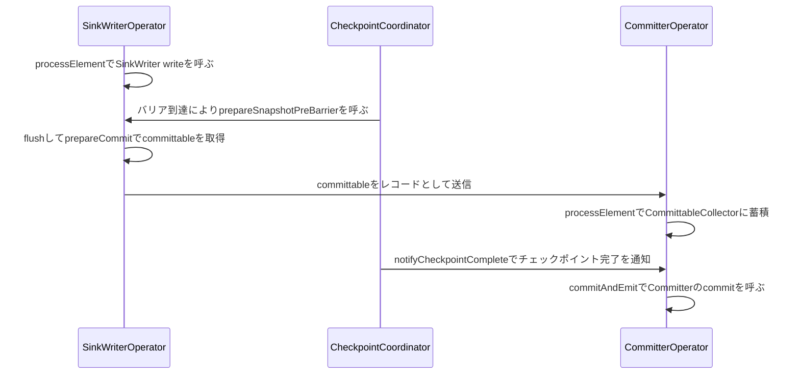

# 第28章 Sink とコネクタ基盤

> **本章で読むソース**
>
> - [`Sink.java`](https://github.com/apache/flink/blob/release-2.3.0/flink-core/src/main/java/org/apache/flink/api/connector/sink2/Sink.java)
> - [`SinkWriter.java`](https://github.com/apache/flink/blob/release-2.3.0/flink-core/src/main/java/org/apache/flink/api/connector/sink2/SinkWriter.java)
> - [`CommittingSinkWriter.java`](https://github.com/apache/flink/blob/release-2.3.0/flink-core/src/main/java/org/apache/flink/api/connector/sink2/CommittingSinkWriter.java)
> - [`SupportsCommitter.java`](https://github.com/apache/flink/blob/release-2.3.0/flink-core/src/main/java/org/apache/flink/api/connector/sink2/SupportsCommitter.java)
> - [`Committer.java`](https://github.com/apache/flink/blob/release-2.3.0/flink-core/src/main/java/org/apache/flink/api/connector/sink2/Committer.java)
> - [`SinkWriterOperator.java`](https://github.com/apache/flink/blob/release-2.3.0/flink-runtime/src/main/java/org/apache/flink/streaming/runtime/operators/sink/SinkWriterOperator.java)
> - [`CommitterOperator.java`](https://github.com/apache/flink/blob/release-2.3.0/flink-runtime/src/main/java/org/apache/flink/streaming/runtime/operators/sink/CommitterOperator.java)

## この章の狙い

第27章では、外部システムからレコードを読み込む側の抽象である `Source` と `SourceReader` を読んだ。

本章では対になる出力側、`Sink` と `SinkWriter` を読む。

`Sink` は書き込みそのものを担う `SinkWriter` と、書き込みを確定させる `Committer` に責務を分けており、この分離が第20章で見たチェックポイントの仕組みと組み合わさることで、外部システムへの正確に1回の書き込みを実現する。

`SinkWriterOperator` と `CommitterOperator` が、この分離された責務を演算子としてどう駆動するかまで、順に見ていく。

## 前提

第14章で見た通り、`DataStream` API のユーザーコードは `AbstractStreamOperator` を継承した演算子として実行される。

`Sink` はこの演算子の内側に埋め込まれるユーザー定義の書き込みロジックであり、`AbstractUdfStreamOperator` が UDF をラップしたのと同じ構図で、`SinkWriterOperator` が `SinkWriter` を保持して駆動する。

もう一つの前提が、第20章で見た `CheckpointCoordinator` によるチェックポイントの起動と、演算子チェインをバリアが流れる過程である。

`Sink` の書き込みが「正確に1回」であることを保証する仕組みは、このバリアの通過というタイミングに強く結びついている。

## Sink と SinkWriter：書き込みの最小契約

`Sink` インタフェースが定める契約は単純で、`SinkWriter` を生成するメソッド1つしか持たない。

[`Sink.java` L38-L48](https://github.com/apache/flink/blob/release-2.3.0/flink-core/src/main/java/org/apache/flink/api/connector/sink2/Sink.java#L38-L48)

```java
public interface Sink<InputT> extends Serializable {

    /**
     * Creates a {@link SinkWriter}.
     *
     * @param context the runtime context.
     * @return A sink writer.
     * @throws IOException for any failure during creation.
     */
    SinkWriter<InputT> createWriter(WriterInitContext context) throws IOException;
}
```

`Sink` 自身は `Serializable` でなければならず、JobGraph の一部としてジョブ提出時にシリアライズされてTaskManagerへ送られる。

`createWriter` が実際に呼ばれるのはTaskManager上のサブタスクが起動した後であり、`SinkWriter` はサブタスクごとに1つ生成される、シリアライズ不要の実行時オブジェクトになる。

`SinkWriter` が定める書き込みの契約も、`write` と `flush` の2メソッドが中心である。

[`SinkWriter.java` L32-L47](https://github.com/apache/flink/blob/release-2.3.0/flink-core/src/main/java/org/apache/flink/api/connector/sink2/SinkWriter.java#L32-L47)

```java
public interface SinkWriter<InputT> extends AutoCloseable {

    /**
     * Adds an element to the writer.
     *
     * @param element The input record
     * @param context The additional information about the input record
     * @throws IOException if fail to add an element.
     */
    void write(InputT element, Context context) throws IOException, InterruptedException;

    /**
     * Called on checkpoint or end of input so that the writer to flush all pending data for
     * at-least-once.
     */
    void flush(boolean endOfInput) throws IOException, InterruptedException;
```

`write` はレコード1件を受け取って外部システムへ渡す準備をするメソッドであり、`flush` はチェックポイントや入力終端のタイミングで、まだ外部システムに届いていない保留分をすべて送り出すよう促すメソッドである。

この `write` と `flush` だけを実装すれば、少なくとも1回の書き込み（at-least-once）は保証できる、というのが基本契約の水準になる。

正確に1回の書き込みには、これだけでは足りない。

## 2相コミットの分離：CommittingSinkWriter と Committer

正確に1回の書き込みを実現する `Sink` は、`SinkWriter` に加えて、書き込みの確定を担う `Committer` を持つ。

この2段構えは、`SinkWriter` が `CommittingSinkWriter` を実装し、`Sink` が `SupportsCommitter` を実装するという2つのインタフェースの組み合わせで表現される。

[`CommittingSinkWriter.java` L28-L39](https://github.com/apache/flink/blob/release-2.3.0/flink-core/src/main/java/org/apache/flink/api/connector/sink2/CommittingSinkWriter.java#L28-L39)

```java
/** A {@link SinkWriter} that performs the first part of a two-phase commit protocol. */
@Public
public interface CommittingSinkWriter<InputT, CommittableT> extends SinkWriter<InputT> {
    /**
     * Prepares for a commit.
     *
     * <p>This method will be called after {@link #flush(boolean)} and before {@link
     * StatefulSinkWriter#snapshotState(long)}.
     *
     * @return The data to commit as the second step of the two-phase commit protocol.
     * @throws IOException if fail to prepare for a commit.
     */
    Collection<CommittableT> prepareCommit() throws IOException, InterruptedException;
}
```

`prepareCommit` は、`flush` の後、状態のスナップショット（`snapshotState`）の前に呼ばれると明記されている。

戻り値の `CommittableT` は「外部システムに何をコミットすればよいか」を表すデータであり、たとえばファイルシステムSinkであれば一時ファイルのパス、トランザクション対応のメッセージキューであればトランザクションIDに相当する。

`prepareCommit` は外部システムへの書き込みを完了させるが、その内容を外部から見える形で確定（コミット）はしない、という点が鍵になる。

コミットを実際に行うのが `Committer` であり、`Sink` 側は `SupportsCommitter` を実装して `Committer` を生成する。

[`SupportsCommitter.java` L41-L55](https://github.com/apache/flink/blob/release-2.3.0/flink-core/src/main/java/org/apache/flink/api/connector/sink2/SupportsCommitter.java#L41-L55)

```java
public interface SupportsCommitter<CommittableT> {

    /**
     * Creates a {@link Committer} that permanently makes the previously written data visible
     * through {@link Committer#commit(Collection)}.
     *
     * @param context The context information for the committer initialization.
     * @return A committer for the two-phase commit protocol.
     * @throws IOException for any failure during creation.
     */
    Committer<CommittableT> createCommitter(CommitterInitContext context) throws IOException;

    /** Returns the serializer of the committable type. */
    SimpleVersionedSerializer<CommittableT> getCommittableSerializer();
}
```

`getCommittableSerializer` が返す `SimpleVersionedSerializer` は、`CommittableT` をチェックポイントの状態としてシリアライズするために使われる。

`prepareCommit` が返した committable は、`SinkWriter` から `Committer` へレコードとして下流に流れていくため、演算子をまたいで運ぶ以上シリアライズできる必要がある。

`Committer` は、この committable の集合を受け取って実際にコミットする1メソッドのインタフェースである。

[`Committer.java` L39-L47](https://github.com/apache/flink/blob/release-2.3.0/flink-core/src/main/java/org/apache/flink/api/connector/sink2/Committer.java#L39-L47)

```java
public interface Committer<CommT> extends AutoCloseable {
    /**
     * Commit the given collection of {@link CommitRequest}.
     *
     * @param committables A collection of commit requests staged by the sink writer.
     * @throws IOException for reasons that may yield a complete restart of the job.
     */
    void commit(Collection<CommitRequest<CommT>> committables)
            throws IOException, InterruptedException;
```

`commit` は冪等でなければならないとJavadocに明記されている。

障害からの復旧時、Flinkは直前のチェックポイントから再開して committable の再コミットを試みるため、すでに一度コミット済みの committable に対して `commit` が再度呼ばれる場合がある。

この再呼び出しに備えて、`CommitRequest` は `signalAlreadyCommitted` のような、外部システムを変更せずに済ませるための通知メソッド群を持つ。

`prepareCommit` によるステージングと `commit` による確定という2段階、これが2相コミット（two-phase commit）と呼ばれる構造であり、`SinkWriter` と `Committer` の責務分離は、この2段階をそのままクラス設計に落としたものになる。

## SinkWriterOperator：書き込みとチェックポイントの連動

`SinkWriter` を実行時に駆動するのが `SinkWriterOperator` である。

`SinkWriterOperator` は `AbstractStreamOperator` を継承する演算子であり、コンストラクタで受け取った `Sink` が `SupportsCommitter` を実装しているかどうかで、下流へcommittableを送るかどうかを決める。

[`SinkWriterOperator.java` L114-L137](https://github.com/apache/flink/blob/release-2.3.0/flink-runtime/src/main/java/org/apache/flink/streaming/runtime/operators/sink/SinkWriterOperator.java#L114-L137)

```java
    SinkWriterOperator(
            StreamOperatorParameters<CommittableMessage<CommT>> parameters,
            Sink<InputT> sink,
            ProcessingTimeService processingTimeService,
            MailboxExecutor mailboxExecutor) {
        super(parameters);
        this.processingTimeService = checkNotNull(processingTimeService);
        this.mailboxExecutor = checkNotNull(mailboxExecutor);
        this.context = new Context<>();
        this.emitDownstream = sink instanceof SupportsCommitter;

        if (sink instanceof SupportsWriterState) {
            writerStateHandler =
                    new StatefulSinkWriterStateHandler<>((SupportsWriterState<InputT, ?>) sink);
        } else {
            writerStateHandler = new StatelessSinkWriterStateHandler<>(sink);
        }

        if (sink instanceof SupportsCommitter) {
            committableSerializer = ((SupportsCommitter<CommT>) sink).getCommittableSerializer();
        } else {
            committableSerializer = null;
        }
    }
```

`emitDownstream` フラグが `true` になるのは、`Sink` が `SupportsCommitter` を実装している場合、つまり2相コミットを行う `Sink` の場合だけである。

そうでない `Sink`（at-least-once止まりの `Sink`）では、下流へは何も送らず、`SinkWriterOperator` 自身が書き込みの終端になる。

レコード1件を受け取る `processElement` は薄い実装で、`SinkWriter.write` を呼ぶだけである。

[`SinkWriterOperator.java` L180-L185](https://github.com/apache/flink/blob/release-2.3.0/flink-runtime/src/main/java/org/apache/flink/streaming/runtime/operators/sink/SinkWriterOperator.java#L180-L185)

```java
    @Override
    public void processElement(StreamRecord<InputT> element) throws Exception {
        checkState(!endOfInput, "Received element after endOfInput: %s", element);
        context.element = element;
        sinkWriter.write(element.getValue(), context);
    }
```

第14章で見た `StreamMap.processElement` がユーザー定義関数を1回呼ぶだけだったのと同じ形で、`SinkWriterOperator.processElement` も `SinkWriter.write` を1回呼ぶだけの薄さにとどまる。

2相コミットの要である `prepareCommit` の呼び出しは、`processElement` ではなく、チェックポイントのバリアが到達したタイミングで呼ばれる `prepareSnapshotPreBarrier` の中で行われる。

[`SinkWriterOperator.java` L187-L195](https://github.com/apache/flink/blob/release-2.3.0/flink-runtime/src/main/java/org/apache/flink/streaming/runtime/operators/sink/SinkWriterOperator.java#L187-L195)

```java
    @Override
    public void prepareSnapshotPreBarrier(long checkpointId) throws Exception {
        super.prepareSnapshotPreBarrier(checkpointId);
        if (!endOfInput) {
            sinkWriter.flush(false);
            emitCommittables(checkpointId);
        }
        // no records are expected to emit after endOfInput
    }
```

`prepareSnapshotPreBarrier` は、`AbstractStreamOperator` のライフサイクルにおいて `snapshotState` より前、演算子の状態をスナップショットへ切り出す直前に呼ばれるメソッドである。

ここで `sinkWriter.flush(false)` によって保留中のレコードを外部システムへ送り切ったうえで、`emitCommittables` が `prepareCommit` を呼び出してcommittableを取得する。

[`SinkWriterOperator.java` L215-L243](https://github.com/apache/flink/blob/release-2.3.0/flink-runtime/src/main/java/org/apache/flink/streaming/runtime/operators/sink/SinkWriterOperator.java#L215-L243)

```java
    private void emitCommittables(long checkpointId) throws IOException, InterruptedException {
        lastKnownCheckpointId = checkpointId;
        if (!emitDownstream) {
            // To support SinkV1 topologies with only a writer we have to call prepareCommit
            // although no committables are forwarded
            if (sinkWriter instanceof CommittingSinkWriter) {
                ((CommittingSinkWriter<?, ?>) sinkWriter).prepareCommit();
            }
            return;
        }
        Collection<CommT> committables =
                ((CommittingSinkWriter<?, CommT>) sinkWriter).prepareCommit();
        StreamingRuntimeContext runtimeContext = getRuntimeContext();
        final int indexOfThisSubtask = runtimeContext.getTaskInfo().getIndexOfThisSubtask();
        final int numberOfParallelSubtasks =
                runtimeContext.getTaskInfo().getNumberOfParallelSubtasks();

        // Emit only committable summary if there are legacy committables
        if (!legacyCommittables.isEmpty()) {
            checkState(checkpointId > WriterInitContext.INITIAL_CHECKPOINT_ID);
            emit(
                    indexOfThisSubtask,
                    numberOfParallelSubtasks,
                    WriterInitContext.INITIAL_CHECKPOINT_ID,
                    legacyCommittables);
            legacyCommittables.clear();
        }
        emit(indexOfThisSubtask, numberOfParallelSubtasks, checkpointId, committables);
    }
```

`emitDownstream` が `true` の場合、`prepareCommit` で得たcommittableの集合を、どのチェックポイントに紐づくものかという `checkpointId` とともに `CommittableSummary`（件数などのメタデータ）と `CommittableWithLineage`（committable本体）に包んで下流へ送る。

`checkpointId` を明示的に運ぶ理由は、`Committer` 側がどのチェックポイントの完了通知に応じてこのcommittableをコミットしてよいかを、後で判定できるようにするためである。

## CommitterOperator：チェックポイント完了通知によるコミット

`SinkWriterOperator` が送ったcommittableを受け取るのが `CommitterOperator` である。

`processElement` はcommittableを受け取ってすぐにはコミットせず、`CommittableCollector` に蓄積するだけである。

[`CommitterOperator.java` L209-L212](https://github.com/apache/flink/blob/release-2.3.0/flink-runtime/src/main/java/org/apache/flink/streaming/runtime/operators/sink/CommitterOperator.java#L209-L212)

```java
    @Override
    public void processElement(StreamRecord<CommittableMessage<CommT>> element) throws Exception {
        committableCollector.addMessage(element.getValue());
    }
```

コミットが実際に走るのは、そのチェックポイントが全タスクの確認を得て完了したという通知、`notifyCheckpointComplete` を受け取ったときである。

[`CommitterOperator.java` L158-L174](https://github.com/apache/flink/blob/release-2.3.0/flink-runtime/src/main/java/org/apache/flink/streaming/runtime/operators/sink/CommitterOperator.java#L158-L174)

```java
    @Override
    public void notifyCheckpointComplete(long checkpointId) throws Exception {
        super.notifyCheckpointComplete(checkpointId);
        commitAndEmitCheckpoints(Math.max(lastCompletedCheckpointId, checkpointId));
    }

    private void commitAndEmitCheckpoints(long checkpointId)
            throws IOException, InterruptedException {
        lastCompletedCheckpointId = checkpointId;
        for (CheckpointCommittableManager<CommT> checkpointManager :
                committableCollector.getCheckpointCommittablesUpTo(checkpointId)) {
            // ensure that all committables of the first checkpoint are fully committed before
            // attempting the next committable
            commitAndEmit(checkpointManager);
            committableCollector.remove(checkpointManager);
        }
    }
```

`getCheckpointCommittablesUpTo(checkpointId)` が、完了が通知されたチェックポイントID以下の、まだコミットしていないcommittableの集合を取り出す。

`notifyCheckpointComplete` は、第20章で見た `CheckpointCoordinator` が全タスクの確認応答を集約し、`PendingCheckpoint` を `CompletedCheckpoint` として確定させたあとに、各タスクへ配られる通知である。

`CommitterOperator` は、この通知が届くまでコミットを保留することで、「チェックポイントとして確定した状態に対応するcommittableだけをコミットする」という順序を守る。

`commitAndEmit` が実際にコミットを行う箇所である。

[`CommitterOperator.java` L176-L182](https://github.com/apache/flink/blob/release-2.3.0/flink-runtime/src/main/java/org/apache/flink/streaming/runtime/operators/sink/CommitterOperator.java#L176-L182)

```java
    private void commitAndEmit(CheckpointCommittableManager<CommT> committableManager)
            throws IOException, InterruptedException {
        committableManager.commit(committer, maxRetries);
        if (emitDownstream) {
            emit(committableManager);
        }
    }
```

`committableManager.commit` が内部で `Committer.commit` を呼び出し、外部システムへコミットを確定させる。

## exactly-once が成り立つ理由：チェックポイント境界へのコミット同期

`SinkWriterOperator` と `CommitterOperator` の役割分担をたどると、コミットのタイミングがチェックポイントの完了という単一のイベントに縛られていることがわかる。

`prepareCommit` は `prepareSnapshotPreBarrier` の中、つまりバリアが演算子に到達し状態のスナップショットを取る直前にしか呼ばれない。

このタイミングで生成されたcommittableは、そのチェックポイントの状態スナップショットの一部として（`CommitterOperator` 側の `committableCollectorState` に）保存され、障害が起きればチェックポイントからの復旧とともに復元される。

一方、`Committer.commit` は `notifyCheckpointComplete`、つまり全タスクがチェックポイントの完了を確認し終えたという通知が届くまで呼ばれない。

この2つの制約が組み合わさることで、外部システムへの書き込みが確定するタイミングは、必ず「あるチェックポイントが完了した後」に限定される。

チェックポイントが完了する前にジョブが障害から再起動した場合、そのチェックポイント分のcommittableは復旧後に状態から復元され、`Committer.commit` の冪等性を頼りに再コミットが試みられる。

こうして、外部システムへの書き込みは「チェックポイントが完了するたびに、そのチェックポイントに属するデータだけがちょうど1回確定する」という単位に揃えられる。

これが2相コミットとチェックポイントを組み合わせた、Sinkにおける正確に1回の書き込みの機構である。



## まとめ

`Sink` は `createWriter` だけを定める最小契約であり、`SinkWriter` の `write` と `flush` によって少なくとも1回の書き込みが実現される。

正確に1回の書き込みを求める `Sink` は、`SupportsCommitter` を実装して `Committer` を提供し、`SinkWriter` 側も `CommittingSinkWriter` を実装して `prepareCommit` でステージング済みのcommittableを返す。

`SinkWriterOperator` はチェックポイントのバリアが到達した `prepareSnapshotPreBarrier` の中で `prepareCommit` を呼び、得られたcommittableを下流の `CommitterOperator` へ送る。

`CommitterOperator` はcommittableをいったん蓄積し、`notifyCheckpointComplete` によってそのチェックポイントの完了が確認された後にだけ `Committer.commit` を呼ぶ。

プリコミットをチェックポイント境界に、コミットをチェックポイント完了通知に同期させることで、書き込みの確定単位をチェックポイントの単位に一致させ、これが `Sink` における正確に1回の書き込みを支えている。

`Source`（第27章）と `Sink` がともにこの形の抽象に載ることで、DataStream APIのユーザーコードは外部システムの種類を意識せず、`SourceReader` や `SinkWriter` の実装を差し替えるだけで異なるコネクタに切り替えられる。

## 関連する章

- [第14章 演算子とユーザー定義関数の実行](../part04-task-execution/14-operators-udf.md)
- [第20章 チェックポイントの調整：CheckpointCoordinator](../part06-state-checkpoint/20-checkpoint-coordinator.md)
- [第27章 Source APIとFLIP-27](27-source-api-flip27.md)
