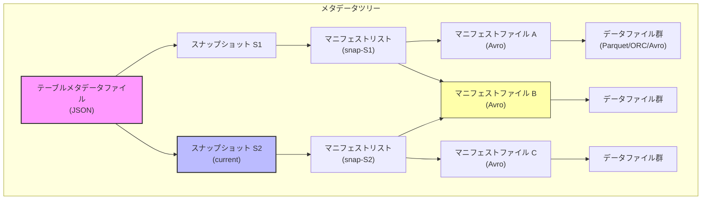
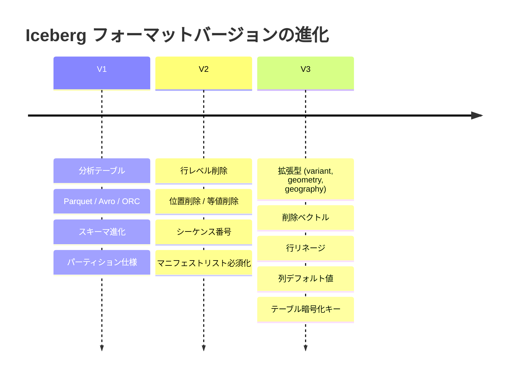
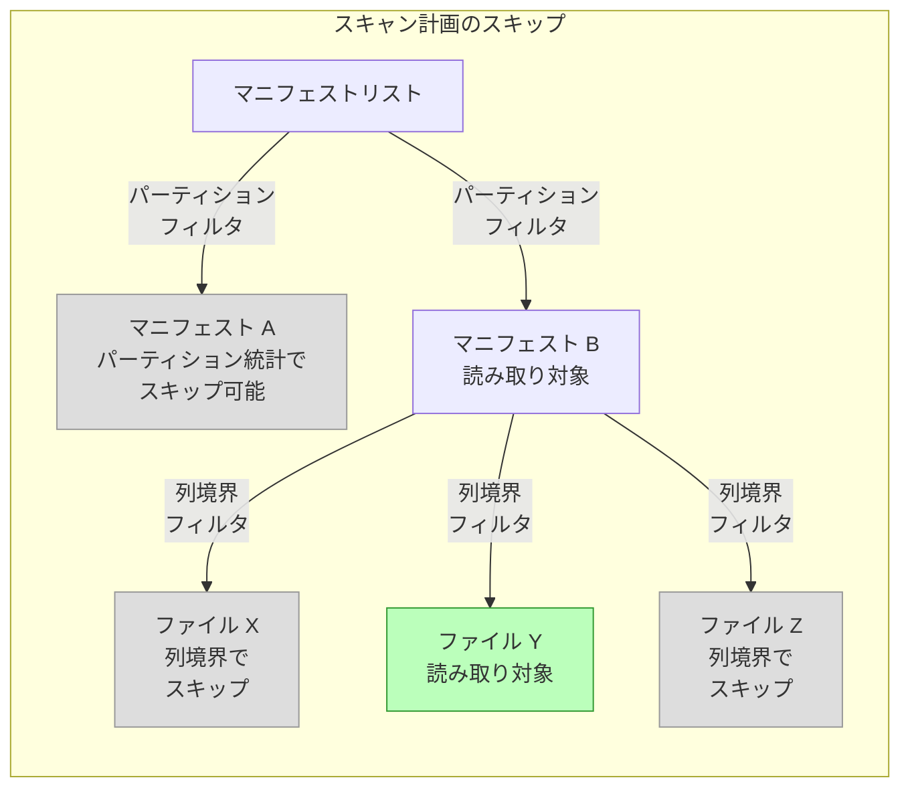

# 第1章 Iceberg とは何か

> **本章で読むソース**
>
> - [`format/spec.md`](https://github.com/apache/iceberg/blob/apache-iceberg-1.11.0/format/spec.md)
> - [`api/src/main/java/org/apache/iceberg/Table.java`](https://github.com/apache/iceberg/blob/apache-iceberg-1.11.0/api/src/main/java/org/apache/iceberg/Table.java)
> - [`api/src/main/java/org/apache/iceberg/Snapshot.java`](https://github.com/apache/iceberg/blob/apache-iceberg-1.11.0/api/src/main/java/org/apache/iceberg/Snapshot.java)
> - [`api/src/main/java/org/apache/iceberg/Schema.java`](https://github.com/apache/iceberg/blob/apache-iceberg-1.11.0/api/src/main/java/org/apache/iceberg/Schema.java)

## この章の狙い

Apache Iceberg の全体像を把握する。
Open Table Format としての設計思想、メタデータツリーの階層構造、フォーマットバージョンの進化、そして参照実装の `Table` インタフェースが提供する主要な操作を理解する。

## 前提

Parquet や ORC といった列指向ファイルフォーマットの概念を把握していること。
分散ファイルシステム（HDFS）やオブジェクトストア（S3）上にデータファイルを配置する分析基盤の基本構成が分かっていれば十分である。

## Iceberg の概要

**Apache Iceberg** は、分散ファイルシステムやオブジェクトストア上のファイル群をテーブルとして管理するための Open Table Format 仕様と、その参照実装である。
仕様の冒頭に、Iceberg が何であるかが一文で定義されている。

[`format/spec.md` L23-L23](https://github.com/apache/iceberg/blob/apache-iceberg-1.11.0/format/spec.md#L23-L23)

```text
This is a specification for the Iceberg table format that is designed to manage a large, slow-changing collection of files in a distributed file system or key-value store as a table.
```

ここで重要なのは "specification" という語である。
Iceberg はそれ自体がクエリエンジンやストレージエンジンではなく、テーブルの状態をどのようにメタデータとして記録するかを定める仕様である。
Spark、Flink、Trino、Dremio などの計算エンジンが Iceberg 仕様に従ってメタデータを読み書きすることで、エンジン間でテーブルを共有できる。

Iceberg が解決する従来の問題は、Hive メタストア時代のディレクトリベースのパーティション管理に起因するものである。
Hive はパーティションをディレクトリとして管理していたため、テーブルのスキャン計画にはパーティション数に比例する O(n) 回のファイルシステム呼び出しが必要だった。
Iceberg はこの問題を、個別のデータファイルをメタデータで追跡する方式に変えることで解決した。

## 仕様が掲げる7つの設計目標

仕様は Goals セクションで7つの設計目標を明示している。

[`format/spec.md` L62-L68](https://github.com/apache/iceberg/blob/apache-iceberg-1.11.0/format/spec.md#L62-L68)

```text
* **Serializable isolation** -- Reads will be isolated from concurrent writes and always use a committed snapshot of a table’s data. Writes will support removing and adding files in a single operation and are never partially visible. Readers will not acquire locks.
* **Speed** -- Operations will use O(1) remote calls to plan the files for a scan and not O(n) where n grows with the size of the table, like the number of partitions or files.
* **Scale** -- Job planning will be handled primarily by clients and not bottleneck on a central metadata store. Metadata will include information needed for cost-based optimization.
* **Evolution** -- Tables will support full schema and partition spec evolution. Schema evolution supports safe column add, drop, reorder and rename, including in nested structures.
* **Dependable types** -- Tables will provide well-defined and dependable support for a core set of types.
* **Storage separation** -- Partitioning will be table configuration. Reads will be planned using predicates on data values, not partition values. Tables will support evolving partition schemes.
* **Formats** -- Underlying data file formats will support identical schema evolution rules and types. Both read-optimized and write-optimized formats will be available.
```

これらの目標を日本語で整理すると、以下のようになる。

1. **直列化可能な分離性**: 読み取りは書き込みから分離され、コミット済みのスナップショットを常に使用する。書き込みは原子的に行われ、部分的に見えることがない。読み取り側はロックを取得しない。
2. **速度**: スキャン計画に必要なリモート呼び出しは O(1) であり、パーティション数やファイル数に比例して増加しない。
3. **スケーラビリティ**: ジョブ計画はクライアント側で処理され、中央のメタデータストアがボトルネックにならない。
4. **進化**: スキーマとパーティション仕様の両方を安全に変更できる。列の追加、削除、並べ替え、名前変更がネスト構造を含めて可能である。
5. **信頼できる型**: コアとなる型の集合に対して、明確で信頼できるサポートを提供する。
6. **ストレージ分離**: パーティショニングはテーブルの設定であり、読み取りはデータ値に対する述語で計画される。パーティション値ではない。パーティション方式の変更も可能である。
7. **フォーマット**: 下位のデータファイルフォーマット（Parquet、Avro、ORC）は同一のスキーマ進化規則と型をサポートする。

この7つの目標が、以降で説明するメタデータツリー構造やスナップショット機構の設計を規定している。

## メタデータツリーの全体像

Iceberg テーブルの状態は、4層のメタデータツリーで表現される。
仕様の Overview セクションがこの構造を説明している。

[`format/spec.md` L74-L80](https://github.com/apache/iceberg/blob/apache-iceberg-1.11.0/format/spec.md#L74-L80)

```text
This table format tracks individual data files in a table instead of directories. This allows writers to create data files in-place and only adds files to the table in an explicit commit.

Table state is maintained in metadata files. All changes to table state create a new metadata file and replace the old metadata with an atomic swap. The table metadata file tracks the table schema, partitioning config, custom properties, and snapshots of the table contents. A snapshot represents the state of a table at some time and is used to access the complete set of data files in the table.

Data files in snapshots are tracked by one or more manifest files that contain a row for each data file in the table, the file's partition data, and its metrics. The data in a snapshot is the union of all files in its manifests. Manifest files are reused across snapshots to avoid rewriting metadata that is slow-changing. Manifests can track data files with any subset of a table and are not associated with partitions.

The manifests that make up a snapshot are stored in a manifest list file. Each manifest list stores metadata about manifests, including partition stats and data file counts. These stats are used to avoid reading manifests that are not required for an operation.
```

この説明に基づいて、メタデータツリーの4層構造を図示する。



この図で注目すべきは、マニフェストファイル B が2つのスナップショットのマニフェストリストから参照されている点である。
仕様が "Manifest files are reused across snapshots" と述べているとおり、変更されていないマニフェストは新しいスナップショットでもそのまま再利用される。
この再利用設計が、コミットのたびにメタデータ全体を書き直すコストを回避する鍵となっている。

### 第1層: テーブルメタデータファイル

テーブルメタデータファイルは JSON 形式であり、テーブルの全状態を保持する。
仕様が定めるテーブルメタデータの主要フィールドは以下である。

| フィールド | 説明 |
|---|---|
| `format-version` | フォーマットバージョン（1、2、または 3） |
| `table-uuid` | テーブルの一意識別子 |
| `location` | テーブルのベースロケーション |
| `last-sequence-number` | 最新のシーケンス番号 |
| `schemas` | スキーマのリスト |
| `current-schema-id` | 現在のスキーマ ID |
| `partition-specs` | パーティション仕様のリスト |
| `default-spec-id` | 現在のデフォルトパーティション仕様 ID |
| `snapshots` | 有効なスナップショットのリスト |
| `current-snapshot-id` | 現在のスナップショット ID |
| `sort-orders` | ソート順序のリスト |
| `refs` | スナップショット参照（ブランチとタグ） |

テーブルの状態を変更するたびに新しいメタデータファイルが作成され、古いメタデータファイルとアトミックにスワップされる。
このアトミックスワップが、ロックなしでの直列化可能な分離性の基盤となる。

### 第2層: マニフェストリスト

**マニフェストリスト**は、スナップショットごとに1つ存在する Avro ファイルである。
各エントリが1つのマニフェストファイルを指し、そのマニフェストに含まれるファイル数やパーティション統計などの要約情報を持つ。

マニフェストリストの主要フィールドを仕様から抜粋する。

| フィールド | 型 | 説明 |
|---|---|---|
| `manifest_path` | `string` | マニフェストファイルの場所 |
| `manifest_length` | `long` | マニフェストファイルのバイト長 |
| `partition_spec_id` | `int` | マニフェストの書き込みに使用したパーティション仕様 ID |
| `content` | `int` | 追跡するファイルの種類（0: データ、1: 削除） |
| `added_files_count` | `int` | ADDED ステータスのエントリ数 |
| `existing_files_count` | `int` | EXISTING ステータスのエントリ数 |
| `deleted_files_count` | `int` | DELETED ステータスのエントリ数 |
| `partitions` | `list` | パーティションフィールドの要約 |

要約情報の存在が重要である。
スキャン計画時に、パーティション統計とファイル数カウントを使って不要なマニフェストの読み取りをスキップできる。
これが、スキャン計画を O(1) に近づける仕組みの一つである。

### 第3層: マニフェストファイル

**マニフェストファイル**は Avro 形式であり、データファイルまたは削除ファイルの一覧を保持する。
各エントリ（`manifest_entry`）は、ファイルのステータス（ADDED / EXISTING / DELETED）、スナップショット ID、シーケンス番号、そしてファイルのメタデータ（`data_file` 構造体）を含む。

`data_file` 構造体の主要フィールドは以下である。

| フィールド | 説明 |
|---|---|
| `file_path` | ファイルの URI |
| `file_format` | ファイル形式（avro、orc、parquet、puffin） |
| `partition` | パーティションデータのタプル |
| `record_count` | レコード数 |
| `file_size_in_bytes` | ファイルサイズ |
| `column_sizes` | 列 ID ごとのディスクサイズ |
| `value_counts` | 列 ID ごとの値の数 |
| `null_value_counts` | 列 ID ごとの null 値の数 |
| `lower_bounds` | 列 ID ごとの下限値 |
| `upper_bounds` | 列 ID ごとの上限値 |

`lower_bounds` と `upper_bounds` はスキャン計画の述語プッシュダウンに使用される。
スキャン述語がファイルの列境界と重ならないことが判明すれば、そのファイルの読み取りをスキップできる。

### 第4層: データファイル

データファイルは Parquet、ORC、Avro のいずれかの形式で格納される実際のデータである。
Iceberg はデータファイルの形式を指定するが、ファイルの内部構造には関与しない。
各ファイル形式のスキーマ表現は仕様の Appendix A で定義されている。

データファイルは一度書き込まれたら変更されない（イミュータブル）。
テーブルからの削除は、データファイルを物理的に書き換えるのではなく、削除ファイル（Delete File）で記録する。
この設計がスナップショットの作成を高速にしている。

## フォーマットバージョンの進化

Iceberg 仕様はバージョン 1、2、3 が策定済みであり、バージョン 4 が開発中である。

[`format/spec.md` L27-L29](https://github.com/apache/iceberg/blob/apache-iceberg-1.11.0/format/spec.md#L27-L29)

```text
Versions 1, 2 and 3 of the Iceberg spec are complete and adopted by the community.

**Version 4 is under active development and has not been formally adopted.**
```

各バージョンの追加機能を整理する。

### V1: 分析テーブル

V1 はイミュータブルなファイルフォーマット（Parquet、Avro、ORC）を用いた大規模分析テーブルの管理を定義した。
メタデータツリーの基本構造、スキーマ進化、パーティション仕様がこのバージョンで確立された。

### V2: 行レベル削除

V2 の最大の変更は、行レベルの更新と削除の追加である。

[`format/spec.md` L43-L43](https://github.com/apache/iceberg/blob/apache-iceberg-1.11.0/format/spec.md#L43-L43)

```text
The primary change in version 2 adds delete files to encode rows that are deleted in existing data files. This version can be used to delete or replace individual rows in immutable data files without rewriting the files.
```

削除ファイルには2種類ある。

- **位置削除**（Position Delete）: データファイルのパスと行位置で削除対象を指定する
- **等値削除**（Equality Delete）: 列の値の組み合わせで削除対象を指定する（例: `id = 5`）

V2 ではシーケンス番号も導入された。
シーケンス番号により、削除ファイルがどのデータファイルに適用されるかを判定できる。

### V3: 拡張型と新機能

V3 は型と機能の大幅な拡張を行った。

[`format/spec.md` L51-L56](https://github.com/apache/iceberg/blob/apache-iceberg-1.11.0/format/spec.md#L51-L56)

```text
* New data types: nanosecond timestamp(tz), unknown, variant, geometry, geography
* Default value support for columns
* Multi-argument transforms for partitioning and sorting
* Row Lineage tracking
* Binary deletion vectors
* Table encryption keys
```

特に注目すべきは、**削除ベクトル**（Deletion Vector）の追加である。
V2 の位置削除ファイルは行位置のリストを別ファイルに記録していたが、V3 の削除ベクトルはビットマップ形式でより効率的に削除対象を表現する。

また、**行リネージ**（Row Lineage）により、各行に一意の `_row_id` と `_last_updated_sequence_number` が割り当てられるようになった。
これにより、行レベルのデータ追跡が可能になる。

**Variant** 型は半構造化データをサポートする型であり、JSON に近い柔軟性を持ちながら、日付やタイムスタンプ、バイナリ、decimal などの豊富なプリミティブ型を使用できる。



## 楽観的並行制御

Iceberg の書き込みは**楽観的並行制御**（Optimistic Concurrency）に基づいている。

[`format/spec.md` L84-L88](https://github.com/apache/iceberg/blob/apache-iceberg-1.11.0/format/spec.md#L84-L88)

```text
An atomic swap of one table metadata file for another provides the basis for serializable isolation. Readers use the snapshot that was current when they load the table metadata and are not affected by changes until they refresh and pick up a new metadata location.

Writers create table metadata files optimistically, assuming that the current version will not be changed before the writer's commit. Once a writer has created an update, it commits by swapping the table’s metadata file pointer from the base version to the new version.

If the snapshot on which an update is based is no longer current, the writer must retry the update based on the new current version. Some operations support retry by re-applying metadata changes and committing, under well-defined conditions. For example, a change that rewrites files can be applied to a new table snapshot if all of the rewritten files are still in the table.
```

この仕組みをまとめると以下のようになる。

1. 書き込み側は、現在のメタデータバージョンが変更されないことを前提として、新しいメタデータファイルを作成する
2. コミット時に、メタデータファイルポインタをアトミックにスワップする
3. 競合が発生した場合（コミット中に別の書き込みがメタデータを更新した場合）、新しいベースバージョンに基づいてリトライする

この設計の利点は、読み取り側がロックを取得する必要がないことである。
読み取り側はメタデータをロードした時点のスナップショットを使用し、書き込みの影響を受けない。
MVCC (Multi-Version Concurrency Control) と同様の分離を、ファイルシステムのアトミックスワップだけで実現している。

## シーケンス番号と継承

V2 で導入された**シーケンス番号**は、データファイルと削除ファイルの相対的な新旧関係を表現する。

[`format/spec.md` L94-L94](https://github.com/apache/iceberg/blob/apache-iceberg-1.11.0/format/spec.md#L94-L94)

```text
The relative age of data and delete files relies on a sequence number that is assigned to every successful commit. When a snapshot is created for a commit, it is optimistically assigned the next sequence number, and it is written into the snapshot's metadata. If the commit fails and must be retried, the sequence number is reassigned and written into new snapshot metadata.
```

シーケンス番号の継承は、Iceberg のメタデータ書き込みにおける設計上の工夫である。
新しいデータファイルのマニフェストエントリにはシーケンス番号として `null` が書き込まれ、読み取り時にマニフェストリストに記録されたマニフェストのシーケンス番号で置き換えられる。

この設計により、マニフェストファイルはシーケンス番号が確定する前に書き込める。
コミットのリトライ時にはマニフェストリストだけを書き直せばよく、マニフェストファイルの再利用が可能になる。
大規模テーブルでのコミットリトライのコストを大幅に削減する工夫である。

## Table インタフェースの構造

参照実装では、テーブルの操作は `Table` インタフェースで定義されている。
このインタフェースは仕様が定めるテーブルの機能を Java API として表現したものである。

[`api/src/main/java/org/apache/iceberg/Table.java` L29-L30](https://github.com/apache/iceberg/blob/apache-iceberg-1.11.0/api/src/main/java/org/apache/iceberg/Table.java#L29-L30)

```java
/** Represents a table. */
public interface Table {
```

`Table` インタフェースの主要メソッドは、以下の4つのカテゴリに分類できる。

### メタデータ取得

テーブルの状態を読み取るメソッド群である。

[`api/src/main/java/org/apache/iceberg/Table.java` L103-L152](https://github.com/apache/iceberg/blob/apache-iceberg-1.11.0/api/src/main/java/org/apache/iceberg/Table.java#L103-L152)

```java
  Schema schema();

  // ... (中略) ...

  Map<Integer, Schema> schemas();

  // ... (中略) ...

  PartitionSpec spec();

  // ... (中略) ...

  Map<Integer, PartitionSpec> specs();

  // ... (中略) ...

  SortOrder sortOrder();

  // ... (中略) ...

  Map<Integer, SortOrder> sortOrders();

  // ... (中略) ...

  Map<String, String> properties();

  // ... (中略) ...

  String location();
```

`schema()` は現在のスキーマを返し、`schemas()` は過去のスキーマも含む全スキーマの Map を返す。
同様に、`spec()` と `specs()` のペア、`sortOrder()` と `sortOrders()` のペアがある。
これは仕様が定めるスキーマ進化、パーティション仕様進化、ソート順序進化に対応するものである。
現在の値だけでなく過去の値も保持することで、古いマニフェストファイルの読み取りに必要な情報を維持している。

### スナップショット操作

テーブルのスナップショットにアクセスするメソッド群である。

[`api/src/main/java/org/apache/iceberg/Table.java` L159-L181](https://github.com/apache/iceberg/blob/apache-iceberg-1.11.0/api/src/main/java/org/apache/iceberg/Table.java#L159-L181)

```java
  Snapshot currentSnapshot();

  // ... (中略) ...

  Snapshot snapshot(long snapshotId);

  // ... (中略) ...

  Iterable<Snapshot> snapshots();

  // ... (中略) ...

  List<HistoryEntry> history();
```

`currentSnapshot()` は現在のスナップショットを返す。
`snapshot(long snapshotId)` は ID を指定して特定のスナップショットを取得できる。
タイムトラベルクエリ（過去の時点のデータを読み取ること）は、この仕組みで実現される。

### スキャン

テーブルのデータを読み取るためのスキャンを作成するメソッド群である。

[`api/src/main/java/org/apache/iceberg/Table.java` L44-L51](https://github.com/apache/iceberg/blob/apache-iceberg-1.11.0/api/src/main/java/org/apache/iceberg/Table.java#L44-L51)

```java
  /**
   * Create a new {@link TableScan scan} for this table.
   *
   * <p>Once a table scan is created, it can be refined to project columns and filter data.
   *
   * @return a table scan for this table
   */
  TableScan newScan();
```

`newScan()` は `TableScan` オブジェクトを生成する。
`TableScan` には列プロジェクション（必要な列だけを読み取る）やフィルタリング（述語による行の絞り込み）を追加でき、ビルダーパターンで条件を組み立てていく。

その他にも `newIncrementalAppendScan()` や `newIncrementalChangelogScan()` など、差分スキャンのためのメソッドが用意されている。

### データ変更操作

テーブルにデータを追加、削除、書き換えるための操作を生成するメソッド群である。

[`api/src/main/java/org/apache/iceberg/Table.java` L224-L289](https://github.com/apache/iceberg/blob/apache-iceberg-1.11.0/api/src/main/java/org/apache/iceberg/Table.java#L224-L289)

```java
  AppendFiles newAppend();

  // ... (中略) ...

  default AppendFiles newFastAppend() {
    return newAppend();
  }

  // ... (中略) ...

  RewriteFiles newRewrite();

  // ... (中略) ...

  OverwriteFiles newOverwrite();

  // ... (中略) ...

  RowDelta newRowDelta();

  // ... (中略) ...

  DeleteFiles newDelete();
```

各メソッドが返すオブジェクトは、仕様が定めるテーブル操作の種類に対応する。

| メソッド | 操作 | スナップショットの `operation` |
|---|---|---|
| `newAppend()` | データファイルの追加 | `append` |
| `newFastAppend()` | 高速なデータファイルの追加 | `append` |
| `newRewrite()` | データファイルの書き換え（コンパクション等） | `replace` |
| `newOverwrite()` | フィルタによるデータの上書き | `overwrite` |
| `newRowDelta()` | 行レベルの削除や置換 | `overwrite` / `delete` |
| `newDelete()` | データファイルの削除 | `delete` |

`newFastAppend()` は注目に値する。
通常の `newAppend()` がマニフェストのマージを行うのに対し、`newFastAppend()` は新しいマニフェストを追加するだけでコミットを完了する。
コミットは高速になるが、マニフェストが増え続けるとスキャン計画が遅くなるため、定期的なマニフェストのリライト（`rewriteManifests()`）が必要になる。

## Snapshot インタフェース

`Snapshot` インタフェースは、テーブルのある時点の状態を表現する。

[`api/src/main/java/org/apache/iceberg/Snapshot.java` L26-L34](https://github.com/apache/iceberg/blob/apache-iceberg-1.11.0/api/src/main/java/org/apache/iceberg/Snapshot.java#L26-L34)

```java
/**
 * A snapshot of the data in a table at a point in time.
 *
 * <p>A snapshot consist of one or more file manifests, and the complete table contents is the union
 * of all the data files in those manifests.
 *
 * <p>Snapshots are created by table operations, like {@link AppendFiles} and {@link RewriteFiles}.
 */
public interface Snapshot extends Serializable {
```

Javadoc が明確に述べているように、スナップショットの内容は「1つ以上のマニフェストに含まれる全データファイルの和集合」である。

主要メソッドは以下のとおりである。

[`api/src/main/java/org/apache/iceberg/Snapshot.java` L42-L104](https://github.com/apache/iceberg/blob/apache-iceberg-1.11.0/api/src/main/java/org/apache/iceberg/Snapshot.java#L42-L104)

```java
  long sequenceNumber();

  // ... (中略) ...

  long snapshotId();

  // ... (中略) ...

  Long parentId();

  // ... (中略) ...

  long timestampMillis();

  // ... (中略) ...

  List<ManifestFile> allManifests(FileIO io);

  // ... (中略) ...

  List<ManifestFile> dataManifests(FileIO io);

  // ... (中略) ...

  List<ManifestFile> deleteManifests(FileIO io);

  // ... (中略) ...

  String operation();

  // ... (中略) ...

  Map<String, String> summary();
```

`allManifests()` はデータマニフェストと削除マニフェストの両方を返し、`dataManifests()` と `deleteManifests()` はそれぞれを個別に返す。
V2 で削除ファイルが導入されたことで、マニフェストも `content` フィールドでデータ用と削除用に区別されるようになった。

`parentId()` はスナップショットの親（直前のスナップショット）の ID を返す。
これにより、スナップショットは連鎖構造を持ち、テーブルの変更履歴を辿ることができる。

## Schema クラスの設計

`Schema` クラスは、テーブルのスキーマを表現する。
Iceberg のスキーマは、列名と型だけでなく、各フィールドに一意の整数 ID を割り当てている。

[`api/src/main/java/org/apache/iceberg/Schema.java` L50-L59](https://github.com/apache/iceberg/blob/apache-iceberg-1.11.0/api/src/main/java/org/apache/iceberg/Schema.java#L50-L59)

```java
/**
 * The schema of a data table.
 *
 * <p>Schema ID will only be populated when reading from/writing to table metadata, otherwise it
 * will be default to 0.
 */
public class Schema implements Serializable {
  private static final Joiner NEWLINE = Joiner.on('\n');
  private static final String ALL_COLUMNS = "*";
  private static final int DEFAULT_SCHEMA_ID = 0;
```

フィールド ID による列の識別は、Iceberg のスキーマ進化を安全にする設計上の工夫である。
列を名前ではなく ID で識別するため、列の名前変更や並べ替えが既存のデータファイルに影響を与えない。

`Schema` クラスは遅延初期化のインデックスを複数持っている。

[`api/src/main/java/org/apache/iceberg/Schema.java` L77-L85](https://github.com/apache/iceberg/blob/apache-iceberg-1.11.0/api/src/main/java/org/apache/iceberg/Schema.java#L77-L85)

```java
  private transient BiMap<String, Integer> aliasToId = null;
  private transient Map<Integer, NestedField> idToField = null;
  private transient Map<String, Integer> nameToId = null;
  private transient Map<String, Integer> lowerCaseNameToId = null;
  private transient Map<Integer, Accessor<StructLike>> idToAccessor = null;
  private transient Map<Integer, String> idToName = null;
  private transient Set<Integer> identifierFieldIdSet = null;
  private final transient Map<Integer, Integer> idsToReassigned;
  private final transient Map<Integer, Integer> idsToOriginal;
```

`idToField`、`nameToId`、`idToName` など、フィールドへのアクセスを効率化する複数のインデックスが `transient` フィールドとして定義されている。
`transient` であるのは、これらがシリアライズ不要な導出データであるためである。
初回アクセス時に遅延的に構築される。

[`api/src/main/java/org/apache/iceberg/Schema.java` L215-L220](https://github.com/apache/iceberg/blob/apache-iceberg-1.11.0/api/src/main/java/org/apache/iceberg/Schema.java#L215-L220)

```java
  private Map<Integer, NestedField> lazyIdToField() {
    if (idToField == null) {
      this.idToField = TypeUtil.indexById(struct);
    }
    return idToField;
  }
```

`Schema` クラスはフォーマットバージョンとの互換性検証も行う。

[`api/src/main/java/org/apache/iceberg/Schema.java` L61-L70](https://github.com/apache/iceberg/blob/apache-iceberg-1.11.0/api/src/main/java/org/apache/iceberg/Schema.java#L61-L70)

```java
  @VisibleForTesting static final int DEFAULT_VALUES_MIN_FORMAT_VERSION = 3;

  @VisibleForTesting
  static final Map<Type.TypeID, Integer> MIN_FORMAT_VERSIONS =
      ImmutableMap.of(
          Type.TypeID.TIMESTAMP_NANO, 3,
          Type.TypeID.VARIANT, 3,
          Type.TypeID.UNKNOWN, 3,
          Type.TypeID.GEOMETRY, 3,
          Type.TypeID.GEOGRAPHY, 3);
```

`MIN_FORMAT_VERSIONS` は、各型が最低限必要とするフォーマットバージョンを定義している。
`TIMESTAMP_NANO`、`VARIANT`、`UNKNOWN`、`GEOMETRY`、`GEOGRAPHY` はいずれも V3 以降でのみ使用可能である。
`checkCompatibility()` メソッドがこの Map を参照して、スキーマがテーブルのフォーマットバージョンと互換性があるかを検証する。

## 設計上の工夫: マニフェストの再利用とメタデータの段階的スキップ

本章で見たメタデータツリーの設計には、大規模データへの対処を可能にする2つの工夫がある。

第一の工夫は、マニフェストファイルの再利用である。
スナップショットのコミット時に変更されたデータファイルを含むマニフェストだけが新たに書かれ、変更のないマニフェストはそのまま新しいマニフェストリストから参照される。
数千のマニフェストを持つテーブルでも、1回のコミットで書き換えが必要なのはわずかなマニフェストだけである。

第二の工夫は、メタデータの段階的なスキップである。
マニフェストリストにはパーティション統計とファイル数カウントが記録されており、スキャン述語と照合することで不要なマニフェストの読み取りをスキップできる。
マニフェスト内でも、`lower_bounds` と `upper_bounds` によるファイルレベルのスキップが可能である。
この2段階のスキップにより、テーブルのサイズに依存しない O(1) に近いスキャン計画が実現する。



## まとめ

- Iceberg は分散ファイルシステムやオブジェクトストア上のファイル群をテーブルとして管理する Open Table Format の仕様と参照実装である
- テーブルの状態は4層のメタデータツリー（テーブルメタデータ、マニフェストリスト、マニフェストファイル、データファイル）で表現される
- 仕様は7つの設計目標を掲げており、直列化可能な分離性、O(1) のスキャン計画、スキーマ進化が中心にある
- フォーマットバージョンは V1（分析テーブル）、V2（行レベル削除）、V3（拡張型、削除ベクトル、行リネージ）と進化してきた
- 楽観的並行制御により、テーブルメタデータファイルのアトミックスワップだけでロックなしの分離性を実現している
- シーケンス番号の継承は、マニフェストの書き込みとコミットを分離し、リトライ時の書き換えコストを最小化する設計上の工夫である
- 参照実装の `Table` インタフェースはメタデータ取得、スナップショット操作、スキャン、データ変更の4カテゴリの操作を提供する
- `Schema` クラスはフィールド ID ベースの列識別と遅延インデックス構築により、安全なスキーマ進化と効率的なフィールド検索を実現している

## 関連する章

- [第2章 型とスキーマ](../part01-type-and-schema/) ではスキーマの内部構造とスキーマ進化の詳細を解説する
- [第3章 パーティショニング](../part02-partitioning/) ではパーティション仕様と変換関数の仕組みを解説する
- [第4章 スナップショットとコミット](../part03-snapshot/) ではスナップショットの作成と楽観的並行制御の実装を解説する
