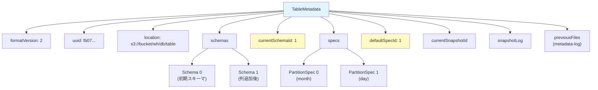
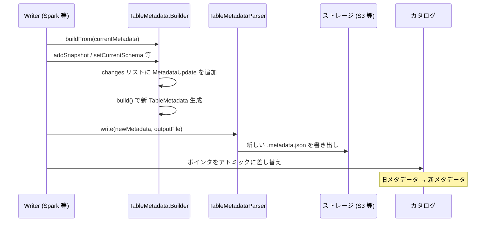

# 第2章 テーブルメタデータとフォーマットバージョン

> **本章で読むソース**
>
> - [`core/src/main/java/org/apache/iceberg/TableMetadata.java`](https://github.com/apache/iceberg/blob/apache-iceberg-1.11.0/core/src/main/java/org/apache/iceberg/TableMetadata.java)
> - [`core/src/main/java/org/apache/iceberg/TableMetadataParser.java`](https://github.com/apache/iceberg/blob/apache-iceberg-1.11.0/core/src/main/java/org/apache/iceberg/TableMetadataParser.java)
> - [`core/src/main/java/org/apache/iceberg/TableProperties.java`](https://github.com/apache/iceberg/blob/apache-iceberg-1.11.0/core/src/main/java/org/apache/iceberg/TableProperties.java)

## この章の狙い

Iceberg テーブルの状態を表現する中心的なデータ構造である `TableMetadata` の全体像を把握する。
メタデータ JSON ファイルに何が記録されているか、どのように読み書きされるか、そしてフォーマットバージョン V1 から V3 へ進化するなかで何が変わったかを、仕様と参照実装の両面から理解する。

## 前提

第1章で Iceberg のアーキテクチャ全体像（メタデータファイル、マニフェストリスト、マニフェスト、データファイルの階層構造）を把握していること。
JSON の読み書きと Java の不変オブジェクトパターンの基礎知識があること。

## テーブルメタデータの位置づけ

Iceberg はテーブルの状態をすべて**メタデータ JSON ファイル**に記録する。
RDBMS のシステムカタログに相当するが、ファイルシステム上の JSON ファイルとして永続化される点が異なる。
テーブルに対する変更（スキーマ変更、スナップショット追加、プロパティ変更など）は、新しいメタデータファイルを作成し、カタログ側のポインタをアトミックに差し替えることで反映される。
古いメタデータファイルは上書きされず、新しいファイルが追加される。
この設計により、書き込み中の読み取りが影響を受けない直列化可能分離（Serializable Isolation）が実現される。

## TableMetadata クラスの構造

`TableMetadata` は Iceberg 参照実装でテーブルの全状態を保持する不変オブジェクトである。
仕様が定めるメタデータフィールドと Java 実装のフィールドは一対一で対応する。

[`core/src/main/java/org/apache/iceberg/TableMetadata.java` L54-L63](https://github.com/apache/iceberg/blob/apache-iceberg-1.11.0/core/src/main/java/org/apache/iceberg/TableMetadata.java#L54-L63)

```java
public class TableMetadata implements Serializable {
  static final long INITIAL_SEQUENCE_NUMBER = 0;
  static final long INVALID_SEQUENCE_NUMBER = -1;
  static final int DEFAULT_TABLE_FORMAT_VERSION = 2;
  static final int SUPPORTED_TABLE_FORMAT_VERSION = 4;
  static final int MIN_FORMAT_VERSION_ROW_LINEAGE = 3;
  static final int INITIAL_SPEC_ID = 0;
  static final int INITIAL_SORT_ORDER_ID = 1;
  static final int INITIAL_SCHEMA_ID = 0;
  static final int INITIAL_ROW_ID = 0;
```

`DEFAULT_TABLE_FORMAT_VERSION` が 2 であることから、新規テーブルは V2 で作成される。
`SUPPORTED_TABLE_FORMAT_VERSION` が 4 まで定義されているが、V4 はまだ正式採択されていない仕様である。

### フィールド一覧

以下にコンストラクタの引数から読み取れる主要フィールドを示す。

[`core/src/main/java/org/apache/iceberg/TableMetadata.java` L242-L268](https://github.com/apache/iceberg/blob/apache-iceberg-1.11.0/core/src/main/java/org/apache/iceberg/TableMetadata.java#L242-L268)

```java
  // stored metadata
  private final String metadataFileLocation;
  private final int formatVersion;
  private final String uuid;
  private final String location;
  private final long lastSequenceNumber;
  private final long lastUpdatedMillis;
  private final int lastColumnId;
  private final int currentSchemaId;
  private final List<Schema> schemas;
  private final int defaultSpecId;
  private final List<PartitionSpec> specs;
  private final int lastAssignedPartitionId;
  private final int defaultSortOrderId;
  private final List<SortOrder> sortOrders;
  private final Map<String, String> properties;
  private final long currentSnapshotId;
  // ... (中略) ...
  private final List<HistoryEntry> snapshotLog;
  private final List<MetadataLogEntry> previousFiles;
  private final List<StatisticsFile> statisticsFiles;
  private final List<PartitionStatisticsFile> partitionStatisticsFiles;
  private final List<MetadataUpdate> changes;
  private final long nextRowId;
  private final List<EncryptedKey> encryptionKeys;
```

各フィールドの役割は次のとおりである。

| フィールド | 仕様上のキー | 説明 |
|-----------|-------------|------|
| `formatVersion` | `format-version` | フォーマットバージョン（1, 2, 3） |
| `uuid` | `table-uuid` | テーブルの一意識別子 |
| `location` | `location` | テーブルのベースパス |
| `lastSequenceNumber` | `last-sequence-number` | 最後に割り当てたシーケンス番号（V2 以降） |
| `lastUpdatedMillis` | `last-updated-ms` | 最終更新時刻（Unix エポックからのミリ秒） |
| `lastColumnId` | `last-column-id` | 最後に割り当てた列 ID |
| `currentSchemaId` | `current-schema-id` | 現在のスキーマ ID |
| `schemas` | `schemas` | 過去を含む全スキーマのリスト |
| `defaultSpecId` | `default-spec-id` | 現在のパーティション仕様 ID |
| `specs` | `partition-specs` | 過去を含む全パーティション仕様のリスト |
| `defaultSortOrderId` | `default-sort-order-id` | 現在のソート順序 ID |
| `sortOrders` | `sort-orders` | 過去を含む全ソート順序のリスト |
| `properties` | `properties` | テーブルプロパティ |
| `currentSnapshotId` | `current-snapshot-id` | 現在のスナップショット ID |
| `snapshotLog` | `snapshot-log` | スナップショット変更履歴 |
| `previousFiles` | `metadata-log` | 過去のメタデータファイル位置の履歴 |
| `nextRowId` | `next-row-id` | 次に割り当てる行 ID（V3 以降） |
| `encryptionKeys` | `encryption-keys` | テーブル暗号化鍵（V3 以降） |

### 設計上の工夫: 履歴の完全保持

`schemas`、`specs`、`sortOrders` はそれぞれリストで過去の定義をすべて保持する。
現在使われている定義を ID で指し示す構造にすることで、スキーマ進化やパーティション進化が生じても、古いマニフェストやデータファイルは作成時の定義を参照できる。
列 ID やパーティションフィールド ID は単調増加で、再利用しない。
この設計は仕様の `last-column-id`、`last-partition-id` という高水位マーカーとして表現されている。



## 不変オブジェクトと Builder パターン

`TableMetadata` は不変（immutable）である。
フィールドはすべて `final` で宣言され、コンストラクタで一度だけ設定される。
テーブルに変更を加えるときは、既存の `TableMetadata` を基に `Builder` で新しいインスタンスを生成する。

[`core/src/main/java/org/apache/iceberg/TableMetadata.java` L882-L888](https://github.com/apache/iceberg/blob/apache-iceberg-1.11.0/core/src/main/java/org/apache/iceberg/TableMetadata.java#L882-L888)

```java
  public static Builder buildFrom(TableMetadata base) {
    return new Builder(base);
  }

  public static Builder buildFromEmpty() {
    return new Builder(DEFAULT_TABLE_FORMAT_VERSION);
  }
```

`Builder` は既存の「テーブルメタデータ」をコピーし、変更を適用してから `build()` で新しいインスタンスを返す。
変更がなければ元のインスタンスをそのまま返す最適化が入っている。

[`core/src/main/java/org/apache/iceberg/TableMetadata.java` L1526-L1537](https://github.com/apache/iceberg/blob/apache-iceberg-1.11.0/core/src/main/java/org/apache/iceberg/TableMetadata.java#L1526-L1537)

```java
    private boolean hasChanges() {
      return changes.size() != startingChangeCount
          || (discardChanges && !changes.isEmpty())
          || metadataLocation != null
          || suppressHistoricalSnapshots
          || null != snapshotsSupplier;
    }

    public TableMetadata build() {
      if (!hasChanges()) {
        return base;
      }
```

この「変更がなければ同一インスタンスを返す」設計は、楽観的並行制御でリトライが発生した際に不要なメタデータファイル生成を避けるために重要である。

### 変更の追跡

`Builder` は変更操作のたびに `MetadataUpdate` オブジェクトを `changes` リストに追加する。
この変更リストは REST カタログとの通信でサーバ側に差分だけを送信するために使われる。

[`core/src/main/java/org/apache/iceberg/TableMetadata.java` L1059-L1079](https://github.com/apache/iceberg/blob/apache-iceberg-1.11.0/core/src/main/java/org/apache/iceberg/TableMetadata.java#L1059-L1079)

```java
    public Builder upgradeFormatVersion(int newFormatVersion) {
      Preconditions.checkArgument(
          newFormatVersion <= SUPPORTED_TABLE_FORMAT_VERSION,
          "Cannot upgrade table to unsupported format version: v%s (supported: v%s)",
          newFormatVersion,
          SUPPORTED_TABLE_FORMAT_VERSION);
      Preconditions.checkArgument(
          newFormatVersion >= formatVersion,
          "Cannot downgrade v%s table to v%s",
          formatVersion,
          newFormatVersion);

      if (newFormatVersion == formatVersion) {
        return this;
      }

      this.formatVersion = newFormatVersion;
      changes.add(new MetadataUpdate.UpgradeFormatVersion(newFormatVersion));

      return this;
    }
```

ダウングレードは禁止されている。
バージョンアップ時には `MetadataUpdate.UpgradeFormatVersion` が記録される。

## 新規テーブル作成の流れ

`newTableMetadata` 静的メソッドがテーブル作成のエントリポイントである。
この処理は以下の手順で新しい `TableMetadata` を構築する。

1. プロパティから `format-version` を取得する（デフォルトは V2）
2. スキーマの全列 ID を 0 から振り直す（`TypeUtil.assignFreshIds`）
3. パーティション仕様を新しい列 ID で再構築する
4. ソート順序を新しい列 ID で再構築する
5. メトリクス設定を検証する
6. `Builder` で組み立てて返す

[`core/src/main/java/org/apache/iceberg/TableMetadata.java` L67-L78](https://github.com/apache/iceberg/blob/apache-iceberg-1.11.0/core/src/main/java/org/apache/iceberg/TableMetadata.java#L67-L78)

```java
  public static TableMetadata newTableMetadata(
      Schema schema,
      PartitionSpec spec,
      SortOrder sortOrder,
      String location,
      Map<String, String> properties) {
    int formatVersion =
        PropertyUtil.propertyAsInt(
            properties, TableProperties.FORMAT_VERSION, DEFAULT_TABLE_FORMAT_VERSION);
    return newTableMetadata(
        schema, spec, sortOrder, location, persistedProperties(properties), formatVersion);
  }
```

列 ID の振り直しは、ユーザが指定したスキーマの列 ID が Iceberg 内部の ID 体系と衝突しないようにするための防御的な設計である。

## テーブルプロパティと予約プロパティ

`TableProperties` クラスはテーブルの動作を制御するプロパティ名とデフォルト値を定義する。

[`core/src/main/java/org/apache/iceberg/TableProperties.java` L42-L84](https://github.com/apache/iceberg/blob/apache-iceberg-1.11.0/core/src/main/java/org/apache/iceberg/TableProperties.java#L42-L84)

```java
  public static final String FORMAT_VERSION = "format-version";

  /** Reserved table property for table UUID. */
  public static final String UUID = "uuid";
  // ... (中略) ...
  public static final Set<String> RESERVED_PROPERTIES =
      ImmutableSet.of(
          FORMAT_VERSION,
          UUID,
          SNAPSHOT_COUNT,
          CURRENT_SNAPSHOT_ID,
          CURRENT_SNAPSHOT_SUMMARY,
          CURRENT_SNAPSHOT_TIMESTAMP,
          CURRENT_SCHEMA,
          DEFAULT_PARTITION_SPEC,
          DEFAULT_SORT_ORDER);
```

**予約プロパティ**（`RESERVED_PROPERTIES`）は特別な扱いを受ける。
`format-version` や `uuid` のような予約プロパティはテーブル作成時や更新時の制御に使われるが、メタデータ JSON の `properties` マップには永続化されない。
`persistedProperties` メソッドが予約プロパティを除外したうえで、新規テーブルに適用するデフォルト値（たとえば Parquet の圧縮コーデック）を設定する。

[`core/src/main/java/org/apache/iceberg/TableMetadata.java` L91-L104](https://github.com/apache/iceberg/blob/apache-iceberg-1.11.0/core/src/main/java/org/apache/iceberg/TableMetadata.java#L91-L104)

```java
  private static Map<String, String> persistedProperties(Map<String, String> rawProperties) {
    Map<String, String> persistedProperties = Maps.newHashMap();

    // explicitly set defaults that apply only to new tables
    persistedProperties.put(
        TableProperties.PARQUET_COMPRESSION,
        TableProperties.PARQUET_COMPRESSION_DEFAULT_SINCE_1_4_0);

    rawProperties.entrySet().stream()
        .filter(entry -> !TableProperties.RESERVED_PROPERTIES.contains(entry.getKey()))
        .forEach(entry -> persistedProperties.put(entry.getKey(), entry.getValue()));

    return persistedProperties;
  }
```

バージョン 1.4.0 以降のデフォルト圧縮コーデックは `zstd` である。
これは `PARQUET_COMPRESSION_DEFAULT_SINCE_1_4_0` 定数として定義されており、それ以前のデフォルト `gzip` から変更された。

プロパティにはコミットのリトライ制御（`commit.retry.num-retries` など）やファイルフォーマット設定（`write.format.default` など）が含まれる。
これらはテーブルの振る舞いを制御するための設定であり、任意のメタデータを格納する場所ではない。

## JSON シリアライゼーション

`TableMetadataParser` が「テーブルメタデータ」の JSON 読み書きを担う。

### 書き出し

`toJson` メソッドは `TableMetadata` のフィールドを JSON オブジェクトとして直列化する。
フォーマットバージョンに応じて出力するフィールドが変わる点が重要である。

[`core/src/main/java/org/apache/iceberg/TableMetadataParser.java` L165-L173](https://github.com/apache/iceberg/blob/apache-iceberg-1.11.0/core/src/main/java/org/apache/iceberg/TableMetadataParser.java#L165-L173)

```java
  public static void toJson(TableMetadata metadata, JsonGenerator generator) throws IOException {
    generator.writeStartObject();

    generator.writeNumberField(FORMAT_VERSION, metadata.formatVersion());
    generator.writeStringField(TABLE_UUID, metadata.uuid());
    generator.writeStringField(LOCATION, metadata.location());
    if (metadata.formatVersion() > 1) {
      generator.writeNumberField(LAST_SEQUENCE_NUMBER, metadata.lastSequenceNumber());
    }
    generator.writeNumberField(LAST_UPDATED_MILLIS, metadata.lastUpdatedMillis());
    generator.writeNumberField(LAST_COLUMN_ID, metadata.lastColumnId());

    // for older readers, continue writing the current schema as "schema".
    // this is only needed for v1 because support for schemas and current-schema-id is required in
    // v2 and later.
    if (metadata.formatVersion() == 1) {
      generator.writeFieldName(SCHEMA);
      SchemaParser.toJson(metadata.schema(), generator);
    }
    // ... (中略) ...
    // for older readers, continue writing the default spec as "partition-spec"
    if (metadata.formatVersion() == 1) {
      generator.writeFieldName(PARTITION_SPEC);
      PartitionSpecParser.toJsonFields(metadata.spec(), generator);
    }
```

V1 では後方互換性のために `schema` フィールドと `partition-spec` フィールドを単体でも書き出す。
V2 以降ではこれらは省略され、`schemas` + `current-schema-id` および `partition-specs` + `default-spec-id` のペアのみが使われる。

V3 以降では `next-row-id` フィールドが追加される。

[`core/src/main/java/org/apache/iceberg/TableMetadataParser.java` L230-L232](https://github.com/apache/iceberg/blob/apache-iceberg-1.11.0/core/src/main/java/org/apache/iceberg/TableMetadataParser.java#L230-L232)

```java
    if (metadata.formatVersion() >= 3) {
      generator.writeNumberField(NEXT_ROW_ID, metadata.nextRowId());
    }
```

`current-snapshot-id` の扱いもバージョンで異なる。
V3 以降ではスナップショットが存在しないとき `null` を書き出すが、V1/V2 では `-1` を書き出す。

[`core/src/main/java/org/apache/iceberg/TableMetadataParser.java` L220-L228](https://github.com/apache/iceberg/blob/apache-iceberg-1.11.0/core/src/main/java/org/apache/iceberg/TableMetadataParser.java#L220-L228)

```java
    if (metadata.currentSnapshot() != null) {
      generator.writeNumberField(CURRENT_SNAPSHOT_ID, metadata.currentSnapshot().snapshotId());
    } else {
      if (metadata.formatVersion() >= MIN_NULL_CURRENT_SNAPSHOT_VERSION) {
        generator.writeNullField(CURRENT_SNAPSHOT_ID);
      } else {
        generator.writeNumberField(CURRENT_SNAPSHOT_ID, -1L);
      }
    }
```

### 読み込み

`fromJson` メソッドは JSON ノードから「テーブルメタデータ」を復元する。
フォーマットバージョンを最初に読み取り、バージョンに応じて必須フィールドの有無を切り替える。

[`core/src/main/java/org/apache/iceberg/TableMetadataParser.java` L339-L356](https://github.com/apache/iceberg/blob/apache-iceberg-1.11.0/core/src/main/java/org/apache/iceberg/TableMetadataParser.java#L339-L356)

```java
  public static TableMetadata fromJson(String metadataLocation, JsonNode node) {
    Preconditions.checkArgument(
        node.isObject(), "Cannot parse metadata from a non-object: %s", node);

    int formatVersion = JsonUtil.getInt(FORMAT_VERSION, node);
    Preconditions.checkArgument(
        formatVersion <= TableMetadata.SUPPORTED_TABLE_FORMAT_VERSION,
        "Cannot read unsupported version %s",
        formatVersion);

    String uuid = JsonUtil.getStringOrNull(TABLE_UUID, node);
    String location = JsonUtil.getString(LOCATION, node);
    long lastSequenceNumber;
    if (formatVersion > 1) {
      lastSequenceNumber = JsonUtil.getLong(LAST_SEQUENCE_NUMBER, node);
    } else {
      lastSequenceNumber = TableMetadata.INITIAL_SEQUENCE_NUMBER;
    }
    // ... (中略) ...
    JsonNode schemaArray = node.get(SCHEMAS);
    if (schemaArray != null) {
      // ... (中略) ...
    } else {
      Preconditions.checkArgument(
          formatVersion == 1, "%s must exist in format v%s", SCHEMAS, formatVersion);

      schema = SchemaParser.fromJson(JsonUtil.get(SCHEMA, node));
      currentSchemaId = schema.schemaId();
      schemas = ImmutableList.of(schema);
    }
```

V1 のメタデータを読むとき、`schemas` 配列がなければ `schema` 単体フィールドから読み取る。
V2 以降で `schemas` がない場合はエラーとなる。
このフォールバックにより、V1 で書かれたメタデータを V2 のリーダーが読み取れる前方互換性が確保される。

### GZIP 圧縮

メタデータ JSON ファイルは GZIP で圧縮できる。
`Codec` 列挙型がファイル名からコーデックを判定する。

[`core/src/main/java/org/apache/iceberg/TableMetadataParser.java` L50-L83](https://github.com/apache/iceberg/blob/apache-iceberg-1.11.0/core/src/main/java/org/apache/iceberg/TableMetadataParser.java#L50-L83)

```java
  public enum Codec {
    NONE(""),
    GZIP(".gz");
    // ... (中略) ...
    public static Codec fromFileName(String fileName) {
      Preconditions.checkArgument(
          fileName.contains(".metadata.json"), "%s is not a valid metadata file", fileName);
      // we have to be backward-compatible with .metadata.json.gz files
      if (fileName.endsWith(".metadata.json.gz")) {
        return Codec.GZIP;
      }
      String fileNameWithoutSuffix = fileName.substring(0, fileName.lastIndexOf(".metadata.json"));
      if (fileNameWithoutSuffix.endsWith(Codec.GZIP.extension)) {
        return Codec.GZIP;
      } else {
        return Codec.NONE;
      }
    }
  }
```

`.gz.metadata.json`（新形式）と `.metadata.json.gz`（旧形式）の両方を認識する。
仕様の Appendix F にあるとおり、一部の実装では `.gz` の位置がファイル名の先頭側にないと正しく読めないため、新形式が導入された。

読み込み時はファイル名からコーデックを判定し、GZIP なら `GZIPInputStream` でラップする。

[`core/src/main/java/org/apache/iceberg/TableMetadataParser.java` L297-L305](https://github.com/apache/iceberg/blob/apache-iceberg-1.11.0/core/src/main/java/org/apache/iceberg/TableMetadataParser.java#L297-L305)

```java
  public static TableMetadata read(InputFile file) {
    Codec codec = Codec.fromFileName(file.location());
    try (InputStream is =
        codec == Codec.GZIP ? new GZIPInputStream(file.newStream()) : file.newStream()) {
      return fromJson(file, JsonUtil.mapper().readValue(is, JsonNode.class));
    } catch (IOException e) {
      throw new RuntimeIOException(e, "Failed to read file: %s", file.location());
    }
  }
```

## メタデータファイルの更新フロー

テーブルに変更が加わるたびに、以下の流れで新しいメタデータファイルが作成される。



このフローの特徴は次の3点である。

1. メタデータファイルは上書きされず、新規ファイルとして書き出される
2. カタログ側のポインタ更新がコミットの原子性を保証する
3. 旧メタデータファイルのパスは `metadata-log` に記録され、一定数が保持される

`metadata-log` の最大保持数は `TableProperties.METADATA_PREVIOUS_VERSIONS_MAX` プロパティで制御される。

[`core/src/main/java/org/apache/iceberg/TableMetadata.java` L1780-L1808](https://github.com/apache/iceberg/blob/apache-iceberg-1.11.0/core/src/main/java/org/apache/iceberg/TableMetadata.java#L1780-L1808)

```java
    private static List<MetadataLogEntry> addPreviousFile(
        List<MetadataLogEntry> previousFiles,
        String previousFileLocation,
        long timestampMillis,
        Map<String, String> properties) {
      if (previousFileLocation == null) {
        return previousFiles;
      }

      int maxSize =
          Math.max(
              1,
              PropertyUtil.propertyAsInt(
                  properties,
                  TableProperties.METADATA_PREVIOUS_VERSIONS_MAX,
                  TableProperties.METADATA_PREVIOUS_VERSIONS_MAX_DEFAULT));

      List<MetadataLogEntry> newMetadataLog;
      if (previousFiles.size() >= maxSize) {
        int removeIndex = previousFiles.size() - maxSize + 1;
        newMetadataLog =
            Lists.newArrayList(previousFiles.subList(removeIndex, previousFiles.size()));
      } else {
        newMetadataLog = Lists.newArrayList(previousFiles);
      }
      newMetadataLog.add(new MetadataLogEntry(timestampMillis, previousFileLocation));

      return newMetadataLog;
    }
```

履歴が上限を超えると古いエントリから削除される。
ただし、メタデータファイル自体は即座には削除されない。
ガベージコレクション操作（`ExpireSnapshots` など）が別途ファイルを削除する。

## スナップショットログと整合性検証

「テーブルメタデータ」はスナップショットの変更履歴を `snapshot-log` として保持する。
コンストラクタで時系列の整合性が検証される。

[`core/src/main/java/org/apache/iceberg/TableMetadata.java` L360-L377](https://github.com/apache/iceberg/blob/apache-iceberg-1.11.0/core/src/main/java/org/apache/iceberg/TableMetadata.java#L360-L377)

```java
    HistoryEntry last = null;
    for (HistoryEntry logEntry : snapshotLog) {
      if (last != null) {
        Preconditions.checkArgument(
            (logEntry.timestampMillis() - last.timestampMillis()) >= -ONE_MINUTE,
            "[BUG] Expected sorted snapshot log entries.");
      }
      last = logEntry;
    }
    if (last != null) {
      Preconditions.checkArgument(
          // commits can happen concurrently from different machines.
          // A tolerance helps us avoid failure for small clock skew
          lastUpdatedMillis - last.timestampMillis() >= -ONE_MINUTE,
          "Invalid update timestamp %s: before last snapshot log entry at %s",
          lastUpdatedMillis,
          last.timestampMillis());
    }
```

ログエントリのタイムスタンプは昇順が期待されるが、分散環境でのクロックスキューを考慮して 1 分の許容幅が設けられている。
この `ONE_MINUTE` の許容は、異なるマシンから並行してコミットが行われる現実的なシナリオに対応する設計である。

## スナップショットの遅延読み込み

`TableMetadata` はスナップショットの遅延読み込みをサポートする。
REST カタログではメタデータ取得時にスナップショット一覧を含めない軽量レスポンスを返し、必要になったときに別途読み込む。

[`core/src/main/java/org/apache/iceberg/TableMetadata.java` L534-L548](https://github.com/apache/iceberg/blob/apache-iceberg-1.11.0/core/src/main/java/org/apache/iceberg/TableMetadata.java#L534-L548)

```java
  private synchronized void ensureSnapshotsLoaded() {
    if (!snapshotsLoaded) {
      List<Snapshot> loadedSnapshots = Lists.newArrayList(snapshotsSupplier.get());
      loadedSnapshots.removeIf(s -> s.sequenceNumber() > lastSequenceNumber);

      this.snapshots = ImmutableList.copyOf(loadedSnapshots);
      this.snapshotsById = indexAndValidateSnapshots(snapshots, lastSequenceNumber);
      validateCurrentSnapshot();

      this.refs = validateRefs(currentSnapshotId, refs, snapshotsById);

      this.snapshotsLoaded = true;
      this.snapshotsSupplier = null;
    }
  }
```

`snapshotsSupplier` が設定されている場合、最初にスナップショットが必要になった時点で `get()` が呼ばれ、結果がキャッシュされる。
`synchronized` で排他制御し、`volatile` フラグ `snapshotsLoaded` でダブルチェックロッキングのような構造になっている。
`lastSequenceNumber` より大きいシーケンス番号のスナップショットは除外される。
これは、並行コミットで将来のスナップショットが見えてしまうケースを防ぐためである。

## フォーマットバージョンの違い

Iceberg の仕様はバージョン 1、2、3 が採択されている。
バージョン番号は前方互換性を壊す変更が入ったときに上がる。
以下に各バージョンの主な変更点を整理する。

### V1: 分析テーブル

V1 は Iceberg の最初のバージョンである。
不変ファイルフォーマット（Parquet、Avro、ORC）を使って大規模分析テーブルを管理する基盤を定めた。

V1 の特徴は以下のとおりである。

- シーケンス番号がない（`last-sequence-number` は 0 固定）
- スキーマは `schema` フィールドで単体指定（`schemas` 配列は任意）
- パーティション仕様は `partition-spec` フィールドで単体指定
- `table-uuid` は任意
- `current-snapshot-id` が存在しないとき `-1`
- 削除ファイル（delete file）は存在しない

コンストラクタでは V1 のシーケンス番号制約が検証される。

[`core/src/main/java/org/apache/iceberg/TableMetadata.java` L314-L317](https://github.com/apache/iceberg/blob/apache-iceberg-1.11.0/core/src/main/java/org/apache/iceberg/TableMetadata.java#L314-L317)

```java
    Preconditions.checkArgument(
        formatVersion > 1 || lastSequenceNumber == 0,
        "Sequence number must be 0 in v1: %s",
        lastSequenceNumber);
```

### V2: 行レベル削除

V2 の最大の変更は**削除ファイル**の導入である。
位置削除（position delete）と等値削除（equality delete）の2種類により、不変データファイルを書き直さずに個別行を削除または更新できる。

V2 で必須となったフィールドは以下のとおりである。

- `table-uuid`（V1 では任意）
- `last-sequence-number`（V1 では存在しない）
- `schemas` と `current-schema-id`（V1 の `schema` を置換）
- `partition-specs` と `default-spec-id`（V1 の `partition-spec` を置換）
- `sort-orders` と `default-sort-order-id`

UUID の必須化はコンストラクタで検証される。

[`core/src/main/java/org/apache/iceberg/TableMetadata.java` L303-L304](https://github.com/apache/iceberg/blob/apache-iceberg-1.11.0/core/src/main/java/org/apache/iceberg/TableMetadata.java#L303-L304)

```java
    Preconditions.checkArgument(
        specs != null && !specs.isEmpty(), "Partition specs cannot be null or empty");
```

### V3: 拡張型と削除ベクトル

V3 は複数の機能を追加した大きなバージョンアップである。

1. **削除ベクトル**（deletion vector）: 位置削除を Puffin ファイルのバイナリ形式で効率的に表現する。V3 では新しい位置削除ファイルの追加が禁止され、代わりに削除ベクトルを使う
2. **行リネージ**（row lineage）: `next-row-id` フィールドによりテーブル全体で行に一意な ID を割り当てる。`MIN_FORMAT_VERSION_ROW_LINEAGE` が 3 であることから、V3 以降でのみ有効である
3. **新しいデータ型**: `variant`、`geometry`、`geography`、`unknown`、`timestamp_ns`、`timestamptz_ns`
4. **列デフォルト値**: `initial-default` と `write-default`
5. **暗号化鍵**: `encryption-keys` フィールドでテーブルレベルの暗号化鍵を管理する

行リネージの処理は `Builder.addSnapshot` で実装されている。

[`core/src/main/java/org/apache/iceberg/TableMetadata.java` L1266-L1276](https://github.com/apache/iceberg/blob/apache-iceberg-1.11.0/core/src/main/java/org/apache/iceberg/TableMetadata.java#L1266-L1276)

```java
      if (formatVersion >= MIN_FORMAT_VERSION_ROW_LINEAGE) {
        ValidationException.check(
            snapshot.firstRowId() != null, "Cannot add a snapshot: first-row-id is null");
        RetryableValidationException.check(
            snapshot.firstRowId() != null && snapshot.firstRowId() >= nextRowId,
            "Cannot add a snapshot, first-row-id is behind table next-row-id: %s < %s",
            snapshot.firstRowId(),
            nextRowId);

        this.nextRowId += snapshot.addedRows();
      }
```

スナップショットの `firstRowId` は現在の `nextRowId` 以上でなければならない。
スナップショットが追加されると、`nextRowId` は追加された行数分だけ増加する。
この単調増加のメカニズムにより、テーブル全体で行 ID の一意性が保証される。

### バージョン間の差異まとめ

| 特性 | V1 | V2 | V3 |
|------|----|----|-----|
| シーケンス番号 | なし（0固定） | 必須 | 必須 |
| UUID | 任意 | 必須 | 必須 |
| スキーマ管理 | `schema` 単体 | `schemas` リスト | `schemas` リスト |
| 削除ファイル | なし | 位置削除、等値削除 | 削除ベクトル（新規位置削除禁止） |
| 行リネージ | なし | なし | `next-row-id` |
| 暗号化鍵 | なし | なし | `encryption-keys` |
| null snapshot-id | `-1` | `-1` | `null` |
| 新データ型 | 基本型 | V1 と同じ | variant, geometry 等 |

## 設計上の工夫: ID ベースの参照と高水位マーカー

Iceberg のメタデータ設計には、大規模データレイクで安全にスキーマやパーティションを進化させるための工夫がある。

スキーマ、パーティション仕様、ソート順序はそれぞれ整数 ID で識別され、リストとして全世代が保持される。
この設計により、以下の利点が生まれる。

- 古いマニフェストファイルは作成時のスキーマ ID やパーティション仕様 ID を記録しているため、現在のスキーマが変わっても正しく解釈できる
- ID を名前ではなく整数で管理することで、列名の変更がデータファイルの互換性を壊さない
- `lastColumnId` や `lastAssignedPartitionId` のような高水位マーカーにより、新しい ID は常に未使用の値から始まる

既存のスキーマやパーティション仕様と同一の定義が追加された場合は、既存の ID を再利用する。

[`core/src/main/java/org/apache/iceberg/TableMetadata.java` L1642-L1653](https://github.com/apache/iceberg/blob/apache-iceberg-1.11.0/core/src/main/java/org/apache/iceberg/TableMetadata.java#L1642-L1653)

```java
    private int reuseOrCreateNewSchemaId(Schema newSchema) {
      // if the schema already exists, use its id; otherwise use the highest id + 1
      int newSchemaId = currentSchemaId;
      for (Schema schema : schemas) {
        if (schema.sameSchema(newSchema)) {
          return schema.schemaId();
        } else if (schema.schemaId() >= newSchemaId) {
          newSchemaId = schema.schemaId() + 1;
        }
      }
      return newSchemaId;
    }
```

同じスキーマが再度設定された場合は既存 ID を返し、異なるスキーマの場合は最大 ID + 1 を割り当てる。
このパターンはパーティション仕様とソート順序でも同様に適用されている。
ID の重複を防ぎつつ不要な履歴の増加を抑える設計である。

## まとめ

- 「テーブルメタデータ」は Iceberg テーブルの全状態を表す不変オブジェクトであり、JSON ファイルとして永続化される
- メタデータの更新は新しいファイルを作成してカタログのポインタを差し替えるアトミック操作で行われる
- `TableMetadataParser` がフォーマットバージョンに応じた JSON の読み書きを行い、V1 メタデータを V2 リーダーが読めるフォールバック機構を備える
- フォーマットバージョンは V1（基本）、V2（行レベル削除）、V3（削除ベクトル、行リネージ、新データ型）と進化してきた
- スキーマ、パーティション仕様、ソート順序は ID ベースで全世代が保持されるため、進化しても過去のデータファイルとの互換性が維持される
- 予約プロパティは制御用であり、メタデータ JSON の `properties` マップには永続化されない
- `Builder` パターンにより変更追跡と不変性が両立し、REST カタログへの差分通信が可能になっている

## 関連する章

- [第1章 Iceberg とは何か](01-what-is-iceberg.md)
- [第3章 型システム](../part01-type-and-schema/03-type-system.md)
- [第4章 スキーマ進化](../part01-type-and-schema/04-schema-evolution.md)
- [第5章 パーティション仕様と変換関数](../part02-partitioning/05-partition-spec.md)
- [第7章 スナップショットモデル](../part03-snapshot/07-snapshot-model.md)
- [第15章 カタログ抽象と TableOperations](../part06-catalog/15-catalog-abstraction.md)
