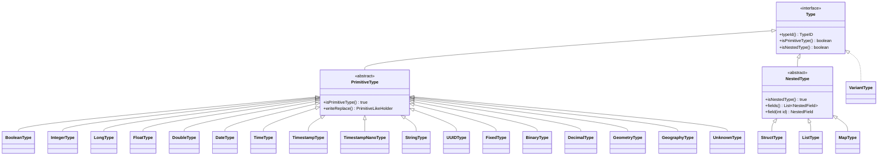

# 第3章 型システム

> **本章で読むソース**
>
> - [`api/src/main/java/org/apache/iceberg/types/Type.java`](https://github.com/apache/iceberg/blob/apache-iceberg-1.11.0/api/src/main/java/org/apache/iceberg/types/Type.java)
> - [`api/src/main/java/org/apache/iceberg/types/Types.java`](https://github.com/apache/iceberg/blob/apache-iceberg-1.11.0/api/src/main/java/org/apache/iceberg/types/Types.java)
> - [`api/src/main/java/org/apache/iceberg/Schema.java`](https://github.com/apache/iceberg/blob/apache-iceberg-1.11.0/api/src/main/java/org/apache/iceberg/Schema.java)
> - [`api/src/main/java/org/apache/iceberg/types/TypeUtil.java`](https://github.com/apache/iceberg/blob/apache-iceberg-1.11.0/api/src/main/java/org/apache/iceberg/types/TypeUtil.java)

## この章の狙い

Iceberg のすべてのデータ表現は型システムの上に成り立つ。
本章では仕様が定めるプリミティブ型とネスト型の分類を示し、参照実装がそれをどのクラス階層で表現しているかを読む。
あわせて、スキーマ進化を支える**フィールド ID** の仕組み、V3 で追加された **Variant** 型、`Schema` クラスの内部構造、そして `TypeUtil` による型ツリーの走査パターンを理解する。

## 前提

第2章までで Iceberg のテーブルメタデータとフォーマットバージョンの概要を把握していることを前提とする。

## 仕様が定める型の分類

仕様（`format/spec.md`）は型を3つのカテゴリに分けている。

1. **プリミティブ型**: `boolean`, `int`, `long`, `float`, `double`, `decimal(P,S)`, `date`, `time`, `timestamp`, `timestamptz`, `timestamp_ns`, `timestamptz_ns`, `string`, `uuid`, `fixed(L)`, `binary`。V3 で `unknown`, `geometry`, `geography` が追加された。
2. **ネスト型**: `struct`, `list`, `map`。ネスト型のフィールドやキー、値、要素にはそれぞれ一意の整数 ID が振られる。
3. **半構造化型**: `variant`。V3 で追加された。構造やデータ型が行ごとに異なりうるセミスキーマレスなデータを扱う。

仕様の記述を引用する。

> A table's **schema** is a list of named columns.
> All data types are either primitives or nested types, which are maps, lists, or structs.
> A table schema is also a struct type.

この定義がそのまま参照実装のクラス階層に反映されている。

## Type インタフェースと TypeID 列挙型

参照実装の型階層の頂点は `Type` インタフェースである。

[`api/src/main/java/org/apache/iceberg/types/Type.java` L31-L64](https://github.com/apache/iceberg/blob/apache-iceberg-1.11.0/api/src/main/java/org/apache/iceberg/types/Type.java#L31-L64)

```java
public interface Type extends Serializable {
  enum TypeID {
    BOOLEAN(Boolean.class),
    INTEGER(Integer.class),
    LONG(Long.class),
    FLOAT(Float.class),
    DOUBLE(Double.class),
    DATE(Integer.class),
    TIME(Long.class),
    TIMESTAMP(Long.class),
    TIMESTAMP_NANO(Long.class),
    STRING(CharSequence.class),
    UUID(java.util.UUID.class),
    FIXED(ByteBuffer.class),
    BINARY(ByteBuffer.class),
    DECIMAL(BigDecimal.class),
    GEOMETRY(ByteBuffer.class),
    GEOGRAPHY(ByteBuffer.class),
    STRUCT(StructLike.class),
    LIST(List.class),
    MAP(Map.class),
    VARIANT(Variant.class),
    UNKNOWN(Object.class);

    private final Class<?> javaClass;

    TypeID(Class<?> javaClass) {
      this.javaClass = javaClass;
    }

    public Class<?> javaClass() {
      return javaClass;
    }
  }
```

「TypeID」列挙型は二つの役割を持つ。
一つは型の種別を一意に識別する列挙値としての役割、もう一つは各型に対応する Java クラス（`javaClass`）を保持してランタイムの型変換に利用される役割である。
たとえば `DATE` の Java 表現は `Integer.class`（エポックからの日数）、`TIMESTAMP` は `Long.class`（マイクロ秒）であり、仕様が定める論理型と物理表現の対応がここに集約されている。

`Type` インタフェースはさらに `isPrimitiveType()` / `asPrimitiveType()` のような型判定とキャストの default メソッドを提供する。
`instanceof` を呼び出し側で書かなくても安全にダウンキャストできる設計であり、`isStructType()` / `asStructType()` など型ごとに同じパターンが用意されている。

## PrimitiveType と NestedType

`Type` インタフェースの直下に、二つの抽象クラスが定義されている。

[`api/src/main/java/org/apache/iceberg/types/Type.java` L116-L147](https://github.com/apache/iceberg/blob/apache-iceberg-1.11.0/api/src/main/java/org/apache/iceberg/types/Type.java#L116-L147)

```java
  abstract class PrimitiveType implements Type {
    @Override
    public boolean isPrimitiveType() {
      return true;
    }

    @Override
    public PrimitiveType asPrimitiveType() {
      return this;
    }

    Object writeReplace() throws ObjectStreamException {
      return new PrimitiveLikeHolder(toString());
    }

    @Override
    public boolean equals(Object o) {
      // ... (中略) ...
      PrimitiveType that = (PrimitiveType) o;
      return typeId() == that.typeId();
    }
  }
```

「PrimitiveType」はパラメータを持たない型（`BooleanType` など）の `equals` を `typeId()` の比較だけで済ませている。
パラメータ付きの型（`DecimalType`, `FixedType` など）は独自の `equals` / `hashCode` をオーバーライドする。

`writeReplace()` は Java シリアライゼーションのフックであり、シリアライズ時に `PrimitiveLikeHolder` に置き換える。
デシリアライズ時には `Types.fromTypeName(typeAsString)` でシングルトンインスタンスを復元するため、ネットワーク越しにスキーマを転送しても型のシングルトン性が保たれる。

[`api/src/main/java/org/apache/iceberg/types/Type.java` L149-L158](https://github.com/apache/iceberg/blob/apache-iceberg-1.11.0/api/src/main/java/org/apache/iceberg/types/Type.java#L149-L158)

```java
  abstract class NestedType implements Type {
    @Override
    public boolean isNestedType() {
      return true;
    }

    @Override
    public NestedType asNestedType() {
      return this;
    }
```

「NestedType」は子フィールドにアクセスするための共通メソッド `fields()`, `fieldType(name)`, `field(id)` を抽象メソッドとして定め、ネスト型の走査に統一的なインタフェースを与えている。

## 型階層の全体図

以下の Mermaid 図は `Type` インタフェースを頂点とする型階層を示す。



図の注目点は、`VariantType` が `PrimitiveType` でも `NestedType` でもなく、`Type` インタフェースを直接実装していることである。
これは「Variant」が半構造化型という独自のカテゴリに属することを型階層で表現した設計判断である。

## プリミティブ型の具象クラス

`Types` クラスにプリミティブ型の具象クラスがすべて定義されている。
パラメータを持たない型はシングルトンパターンを採用する。

[`api/src/main/java/org/apache/iceberg/types/Types.java` L118-L134](https://github.com/apache/iceberg/blob/apache-iceberg-1.11.0/api/src/main/java/org/apache/iceberg/types/Types.java#L118-L134)

```java
  public static class BooleanType extends PrimitiveType {
    private static final BooleanType INSTANCE = new BooleanType();

    public static BooleanType get() {
      return INSTANCE;
    }

    @Override
    public TypeID typeId() {
      return TypeID.BOOLEAN;
    }

    @Override
    public String toString() {
      return "boolean";
    }
  }
```

`IntegerType`, `LongType`, `StringType` なども同じパターンで実装されている。
シングルトンにすることで、型の比較を参照等値（`==`）で行えるケースが増え、大量のフィールドを持つスキーマでの型比較コストを抑えている。

### パラメータ付きプリミティブ型

パラメータを持つ型はインスタンスごとに異なる値を保持するため、シングルトンにはならない。

**TimestampType** はタイムゾーン調整の有無を `adjustToUTC` フィールドで区別する。

[`api/src/main/java/org/apache/iceberg/types/Types.java` L246-L258](https://github.com/apache/iceberg/blob/apache-iceberg-1.11.0/api/src/main/java/org/apache/iceberg/types/Types.java#L246-L258)

```java
  public static class TimestampType extends PrimitiveType {
    private static final TimestampType INSTANCE_WITH_ZONE = new TimestampType(true);
    private static final TimestampType INSTANCE_WITHOUT_ZONE = new TimestampType(false);

    public static TimestampType withZone() {
      return INSTANCE_WITH_ZONE;
    }

    public static TimestampType withoutZone() {
      return INSTANCE_WITHOUT_ZONE;
    }

    private final boolean adjustToUTC;
```

取りうる値が2通りしかないため、事前に2つのインスタンスを作成してファクトリメソッドで返す。
`equals` は `adjustToUTC` の比較で判定する。
`TimestampNanoType` も同じ設計である。

**DecimalType** は `precision` と `scale` の組み合わせが多いため、ファクトリメソッド `of(precision, scale)` で都度インスタンスを生成する。
精度の上限は 38 に制限されている。

[`api/src/main/java/org/apache/iceberg/types/Types.java` L517-L532](https://github.com/apache/iceberg/blob/apache-iceberg-1.11.0/api/src/main/java/org/apache/iceberg/types/Types.java#L517-L532)

```java
  public static class DecimalType extends PrimitiveType {
    public static DecimalType of(int precision, int scale) {
      return new DecimalType(precision, scale);
    }

    private final int scale;
    private final int precision;

    private DecimalType(int precision, int scale) {
      Preconditions.checkArgument(
          precision <= 38,
          "Decimals with precision larger than 38 are not supported: %s",
          precision);
      this.scale = scale;
      this.precision = precision;
    }
```

**FixedType** も同様に、`ofLength(length)` で長さを指定して生成する。

### 文字列からの型復元

`Types.fromTypeName()` メソッドは、型の文字列表現（`"boolean"`, `"decimal(10, 2)"` など）からインスタンスを復元する。
パラメータなしの型はあらかじめ `TYPES` マップに登録しておき、O(1) で引く。
パラメータ付きの型は正規表現で解析する。

[`api/src/main/java/org/apache/iceberg/types/Types.java` L44-L64](https://github.com/apache/iceberg/blob/apache-iceberg-1.11.0/api/src/main/java/org/apache/iceberg/types/Types.java#L44-L64)

```java
  private static final ImmutableMap<String, Type> TYPES =
      ImmutableMap.<String, Type>builder()
          .put(BooleanType.get().toString(), BooleanType.get())
          .put(IntegerType.get().toString(), IntegerType.get())
          .put(LongType.get().toString(), LongType.get())
          .put(FloatType.get().toString(), FloatType.get())
          .put(DoubleType.get().toString(), DoubleType.get())
          // ... (中略) ...
          .put(VariantType.get().toString(), VariantType.get())
          .put(GeometryType.crs84().toString(), GeometryType.crs84())
          .put(GeographyType.crs84().toString(), GeographyType.crs84())
          .buildOrThrow();
```

この仕組みは JSON や Avro からスキーマをデシリアライズするときに使われる。
`PrimitiveLikeHolder` の `readResolve()` も最終的に `fromTypeName()` を呼び出すため、同一の復元パスが共有されている。

## NestedField とフィールド ID

ネスト型を構成する要素として、`Types.NestedField` クラスがある。
仕様が求めるフィールドの属性をすべて保持する。

[`api/src/main/java/org/apache/iceberg/types/Types.java` L854-L883](https://github.com/apache/iceberg/blob/apache-iceberg-1.11.0/api/src/main/java/org/apache/iceberg/types/Types.java#L854-L883)

```java
    private final boolean isOptional;
    private final int id;
    private final String name;
    private final Type type;
    private final String doc;
    private final Literal<?> initialDefault;
    private final Literal<?> writeDefault;

    private NestedField(
        boolean isOptional,
        int id,
        String name,
        Type type,
        String doc,
        Literal<?> initialDefault,
        Literal<?> writeDefault) {
      Preconditions.checkNotNull(name, "Name cannot be null");
      Preconditions.checkNotNull(type, "Type cannot be null");
      // ... (中略) ...
      this.initialDefault = castDefault(initialDefault, type);
      this.writeDefault = castDefault(writeDefault, type);
    }
```

### フィールド ID の意義

フィールド ID は Iceberg の型システムにおいて最も重要な設計要素の一つである。

仕様は次のように定めている。

> Each field in the tuple is named and has an integer id that is unique in the table schema.

フィールド ID がスキーマ進化を支える仕組みは以下の通りである。

1. **列の同一性はフィールド名ではなく ID で判定する。** 列名を変更しても ID が変わらないため、既存のデータファイルは再書き込み不要である。
2. **データファイルの列は ID で照合する。** 仕様は「Columns in Iceberg data files are selected by field id」と明記している。データファイルに書かれた列とテーブルスキーマの列を ID で突き合わせることで、列の追加や削除、並び替えがあっても正しく読み取れる。
3. **ネスト型の内部要素にも ID が振られる。** `ListType` の要素、`MapType` のキーと値にもそれぞれ固有の ID が付与される。これにより、ネストされた構造体のフィールド単位でスキーマ進化が可能になる。

`NestedField` は ID に加えて `isOptional`（null 許容性）、`doc`（ドキュメント文字列）、`initialDefault` / `writeDefault`（V3 のデフォルト値）を保持する。
デフォルト値はコンストラクタ内で `castDefault()` を通じて型チェックされ、ネスト型にデフォルト値を設定しようとすると例外が投げられる。

## ネスト型の具象クラス

### StructType

「StructType」は名前付きフィールドの順序付きタプルである。
仕様の記述どおり、テーブルスキーマ自体も `StructType` として表現される。

[`api/src/main/java/org/apache/iceberg/types/Types.java` L1001-L1027](https://github.com/apache/iceberg/blob/apache-iceberg-1.11.0/api/src/main/java/org/apache/iceberg/types/Types.java#L1001-L1027)

```java
  public static class StructType extends NestedType {
    private static final Joiner FIELD_SEP = Joiner.on(", ");

    public static StructType of(NestedField... fields) {
      return of(Arrays.asList(fields));
    }

    public static StructType of(List<NestedField> fields) {
      return new StructType(fields);
    }

    private final NestedField[] fields;

    // lazy values
    private transient Schema schema = null;
    private transient List<NestedField> fieldList = null;
    private transient Map<String, NestedField> fieldsByName = null;
    private transient Map<String, NestedField> fieldsByLowerCaseName = null;
    private transient Map<Integer, NestedField> fieldsById = null;

    private StructType(List<NestedField> fields) {
      Preconditions.checkNotNull(fields, "Field list cannot be null");
      this.fields = new NestedField[fields.size()];
      for (int i = 0; i < this.fields.length; i += 1) {
        this.fields[i] = fields.get(i);
      }
    }
```

設計上の工夫として、`StructType` は名前引き、大文字小文字無視の名前引き、ID 引きの3種類のインデックスを**遅延初期化**（lazy initialization）で構築する。
フィールド数が多い大規模スキーマでは、未使用のインデックスの構築コストを避けることができる。
これらのフィールドが `transient` で宣言されているのは、シリアライズ後にインデックスを再構築するためである。

[`api/src/main/java/org/apache/iceberg/types/Types.java` L1114-L1123](https://github.com/apache/iceberg/blob/apache-iceberg-1.11.0/api/src/main/java/org/apache/iceberg/types/Types.java#L1114-L1123)

```java
    private Map<String, NestedField> lazyFieldsByName() {
      if (fieldsByName == null) {
        ImmutableMap.Builder<String, NestedField> byNameBuilder = ImmutableMap.builder();
        for (NestedField field : fields) {
          byNameBuilder.put(field.name(), field);
        }
        fieldsByName = byNameBuilder.build();
      }
      return fieldsByName;
    }

    // ... (中略) ...

    private Map<Integer, NestedField> lazyFieldsById() {
      if (fieldsById == null) {
        ImmutableMap.Builder<Integer, NestedField> byIdBuilder = ImmutableMap.builder();
        for (NestedField field : fields) {
          byIdBuilder.put(field.fieldId(), field);
        }
        this.fieldsById = byIdBuilder.build();
      }
      return fieldsById;
    }
```

### ListType

「ListType」は単一の要素フィールドを持つコレクション型である。

[`api/src/main/java/org/apache/iceberg/types/Types.java` L1148-L1157](https://github.com/apache/iceberg/blob/apache-iceberg-1.11.0/api/src/main/java/org/apache/iceberg/types/Types.java#L1148-L1157)

```java
  public static class ListType extends NestedType {
    public static ListType ofOptional(int elementId, Type elementType) {
      Preconditions.checkNotNull(elementType, "Element type cannot be null");
      return new ListType(NestedField.optional(elementId, "element", elementType));
    }

    public static ListType ofRequired(int elementId, Type elementType) {
      Preconditions.checkNotNull(elementType, "Element type cannot be null");
      return new ListType(NestedField.required(elementId, "element", elementType));
    }
```

要素は `NestedField` として表現され、名前は固定で `"element"` となる。
要素にもフィールド ID（`elementId`）が割り当てられ、スキーマ進化においてリスト要素の型変更を追跡できる。

### MapType

「MapType」はキーフィールドと値フィールドの2つの `NestedField` を持つ。

[`api/src/main/java/org/apache/iceberg/types/Types.java` L1248-L1270](https://github.com/apache/iceberg/blob/apache-iceberg-1.11.0/api/src/main/java/org/apache/iceberg/types/Types.java#L1248-L1270)

```java
  public static class MapType extends NestedType {
    public static MapType ofOptional(int keyId, int valueId, Type keyType, Type valueType) {
      Preconditions.checkNotNull(valueType, "Value type cannot be null");
      return new MapType(
          NestedField.required(keyId, "key", keyType),
          NestedField.optional(valueId, "value", valueType));
    }

    public static MapType ofRequired(int keyId, int valueId, Type keyType, Type valueType) {
      Preconditions.checkNotNull(valueType, "Value type cannot be null");
      return new MapType(
          NestedField.required(keyId, "key", keyType),
          NestedField.required(valueId, "value", valueType));
    }

    private final NestedField keyField;
    private final NestedField valueField;
    private transient List<NestedField> fields = null;

    private MapType(NestedField keyField, NestedField valueField) {
      this.keyField = keyField;
      this.valueField = valueField;
    }
```

仕様は「Map keys are required」と定めており、`ofOptional` / `ofRequired` のどちらを呼んでもキーフィールドは常に `required` で生成される。
`optional` / `required` の区別は値フィールドにのみ適用される。

## Variant 型（V3）

「Variant」は V3 で追加された半構造化型である。
仕様では JSON に類似しつつ、日付、タイムスタンプ、バイナリ、Decimal など幅広いプリミティブ値を持てると説明されている。

実装上の特徴は、`VariantType` が `PrimitiveType` にも `NestedType` にも属さず、`Type` を直接実装していることである。

[`api/src/main/java/org/apache/iceberg/types/Types.java` L450-L455](https://github.com/apache/iceberg/blob/apache-iceberg-1.11.0/api/src/main/java/org/apache/iceberg/types/Types.java#L450-L455)

```java
  public static class VariantType implements Type {
    private static final VariantType INSTANCE = new VariantType();

    public static VariantType get() {
      return INSTANCE;
    }

    @Override
    public TypeID typeId() {
      return TypeID.VARIANT;
    }

    // ... (中略) ...

    @Override
    public boolean isVariantType() {
      return true;
    }
```

`VariantType` はシングルトンで、`writeReplace()` による `PrimitiveLikeHolder` 委譲もプリミティブ型と同じである。
ただし `PrimitiveType` を継承しないため `isPrimitiveType()` は `false`、`isNestedType()` も `false` であり、`isVariantType()` だけが `true` を返す独自のカテゴリとなっている。

この設計は `TypeUtil` のビジターにも影響しており、ビジターに専用の `variant()` コールバックが用意されている。

## Schema クラスの構造

`Schema` クラスはテーブルスキーマの表現であり、内部に `StructType` を持つ。

[`api/src/main/java/org/apache/iceberg/Schema.java` L72-L85](https://github.com/apache/iceberg/blob/apache-iceberg-1.11.0/api/src/main/java/org/apache/iceberg/Schema.java#L72-L85)

```java
  private final StructType struct;
  private final int schemaId;
  private final int[] identifierFieldIds;
  private final int highestFieldId;

  private transient BiMap<String, Integer> aliasToId = null;
  private transient Map<Integer, NestedField> idToField = null;
  private transient Map<String, Integer> nameToId = null;
  private transient Map<String, Integer> lowerCaseNameToId = null;
  private transient Map<Integer, Accessor<StructLike>> idToAccessor = null;
  private transient Map<Integer, String> idToName = null;
  private transient Set<Integer> identifierFieldIdSet = null;
  private final transient Map<Integer, Integer> idsToReassigned;
  private final transient Map<Integer, Integer> idsToOriginal;
```

`Schema` が保持する主要なフィールドは以下の通りである。

- `struct`: トップレベルの「StructType」。全カラムのフィールド定義を含む。
- `schemaId`: スキーマ進化で付与される一意の整数 ID。テーブルメタデータ読み書き時に設定され、それ以外ではデフォルト値 0 となる。
- `identifierFieldIds`: 識別子フィールド（主キーに近い概念）の ID 配列。
- `highestFieldId`: スキーマ中の最大フィールド ID。新規フィールド追加時の ID 採番に使う。

`StructType` と同様に、`Schema` もフィールド検索用のインデックスをすべて遅延初期化する。
`idToField`, `nameToId`, `lowerCaseNameToId` は `TypeUtil` のインデクサを呼び出してネスト構造全体を走査し、フラットなマップを構築する。

[`api/src/main/java/org/apache/iceberg/Schema.java` L215-L234](https://github.com/apache/iceberg/blob/apache-iceberg-1.11.0/api/src/main/java/org/apache/iceberg/Schema.java#L215-L234)

```java
  private Map<Integer, NestedField> lazyIdToField() {
    if (idToField == null) {
      this.idToField = TypeUtil.indexById(struct);
    }
    return idToField;
  }

  private Map<String, Integer> lazyNameToId() {
    if (nameToId == null) {
      this.nameToId = ImmutableMap.copyOf(TypeUtil.indexByName(struct));
    }
    return nameToId;
  }

  private Map<Integer, String> lazyIdToName() {
    if (idToName == null) {
      this.idToName = ImmutableMap.copyOf(TypeUtil.indexNameById(struct));
    }
    return idToName;
  }
```

### フォーマットバージョンとの互換性検査

`Schema.checkCompatibility()` は V3 以降でのみ使用可能な型がスキーマに含まれていないかを検査する。

[`api/src/main/java/org/apache/iceberg/Schema.java` L64-L70](https://github.com/apache/iceberg/blob/apache-iceberg-1.11.0/api/src/main/java/org/apache/iceberg/Schema.java#L64-L70)

```java
  static final Map<Type.TypeID, Integer> MIN_FORMAT_VERSIONS =
      ImmutableMap.of(
          Type.TypeID.TIMESTAMP_NANO, 3,
          Type.TypeID.VARIANT, 3,
          Type.TypeID.UNKNOWN, 3,
          Type.TypeID.GEOMETRY, 3,
          Type.TypeID.GEOGRAPHY, 3);
```

`TIMESTAMP_NANO`, `VARIANT`, `UNKNOWN`, `GEOMETRY`, `GEOGRAPHY` はいずれもフォーマットバージョン 3 が最低要件である。
V1 や V2 のテーブルでこれらの型を使おうとすると、この検査が `IllegalStateException` を投げる。

### 識別子フィールド

「識別子フィールド」（Identifier Field）は主キーに近い概念であり、upsert 操作のキーとして使われる。
`Schema.validateIdentifierField()` がコンストラクタ内で以下の4つの制約を検証する（[L163-L205](https://github.com/apache/iceberg/blob/apache-iceberg-1.11.0/api/src/main/java/org/apache/iceberg/Schema.java#L163-L205)）。

1. プリミティブ型であること
2. `required` であること
3. `float` / `double` でないこと（NaN や精度の問題で等値比較が不安定になるため）
4. ルートから当該フィールドまでのパスが `required` な `struct` の連鎖であること

## TypeUtil によるスキーマ走査

`TypeUtil` はスキーマの型ツリーを走査するためのビジターパターンを提供する。

### SchemaVisitor

「SchemaVisitor」（[L664-L728](https://github.com/apache/iceberg/blob/apache-iceberg-1.11.0/api/src/main/java/org/apache/iceberg/types/TypeUtil.java#L664-L728)）は後順（post-order）で型ツリーを走査する。
主なコールバックは `struct()`, `field()`, `list()`, `map()`, `variant()`, `primitive()` であり、子ノードの結果を受け取ってから親のコールバックが呼ばれるため、ボトムアップの集約処理に適している。
`beforeField()` / `afterField()` のフックでフィールド単位の前後処理を挟むこともできる。

`visit()` メソッド（[L734-L794](https://github.com/apache/iceberg/blob/apache-iceberg-1.11.0/api/src/main/java/org/apache/iceberg/types/TypeUtil.java#L734-L794)）は `TypeID` で分岐して再帰的に走査する。
`beforeField()` / `afterField()` を `try-finally` で囲み、例外が発生してもフック対が崩れない設計になっている。

### CustomOrderSchemaVisitor

後順走査だけでは対応できないユースケース（たとえばフィールド ID の事前順採番）のために、「CustomOrderSchemaVisitor」（[L796-L824](https://github.com/apache/iceberg/blob/apache-iceberg-1.11.0/api/src/main/java/org/apache/iceberg/types/TypeUtil.java#L796-L824)）が用意されている。
このビジターでは子ノードの結果が `Supplier<T>` として渡されるため、呼び出し側が `get()` を呼ぶタイミングで初めて子の走査が実行される。
これにより、事前順（pre-order）走査や、子の走査を条件付きでスキップする走査が可能になる。

### TypeUtil が提供するインデックス構築

`TypeUtil` はビジターを活用して各種のインデックスを構築する静的メソッドを提供する。

[`api/src/main/java/org/apache/iceberg/types/TypeUtil.java` L179-L183](https://github.com/apache/iceberg/blob/apache-iceberg-1.11.0/api/src/main/java/org/apache/iceberg/types/TypeUtil.java#L179-L183)

```java
  public static Map<String, Integer> indexByName(Types.StructType struct) {
    IndexByName indexer = new IndexByName();
    visit(struct, indexer);
    return indexer.byName();
  }

  public static Map<Integer, String> indexNameById(Types.StructType struct) {
    IndexByName indexer = new IndexByName();
    visit(struct, indexer);
    return indexer.byId();
  }

  // ... (中略) ...

  public static Map<Integer, Types.NestedField> indexById(Types.StructType struct) {
    return visit(struct, new IndexById());
  }

  public static Map<Integer, Integer> indexParents(Types.StructType struct) {
    return ImmutableMap.copyOf(visit(struct, new IndexParents()));
  }
```

- `indexByName`: ドット区切りの完全修飾名からフィールド ID へのマップ。ネスト構造を平坦化して `"user.address.city"` のような名前を生成する。
- `indexById`: フィールド ID から `NestedField` へのマップ。
- `indexParents`: 子フィールドの ID から親フィールドの ID へのマップ。識別子フィールドの検証で使われる。

### 型昇格の判定

`TypeUtil.isPromotionAllowed()`（[L440-L466](https://github.com/apache/iceberg/blob/apache-iceberg-1.11.0/api/src/main/java/org/apache/iceberg/types/TypeUtil.java#L440-L466)）は仕様が定める型昇格ルールを実装している。
仕様が認める昇格は `int` から `long`、`float` から `double`、そして `decimal` の精度拡大（スケール固定）の3パターンのみであり、それ以外の変換は `false` を返してスキーマ進化の安全性を保証する。

## 設計上の工夫: フィールド ID による列名非依存の読み取り

Iceberg の型システムにおける最大の設計上の工夫は、フィールド ID を用いた列名非依存のデータアクセスである。

従来のテーブルフォーマット（Hive テーブルなど）は列名や列の位置でデータファイルのカラムとスキーマを対応付けていた。
この方式では列名を変更したり列を並び替えたりするとデータファイルの再書き込みが必要になる。

Iceberg は各フィールドに不変の整数 ID を割り当て、データファイルのカラムもこの ID で記録する。
その結果、以下のスキーマ進化操作がデータファイルの書き換えなしに可能になる。

- 列の追加: 既存のデータファイルでは新しい ID のカラムが存在しないため、null またはデフォルト値が返る
- 列の削除: 削除された ID のカラムはデータファイルに残るが、スキーマに存在しないため読み飛ばされる
- 列名の変更: ID は変わらないため、データファイルの列との対応は保たれる
- 列の並び替え: データファイル内の列順序は ID で解決されるため、スキーマの列順序と独立している

この仕組みにより、ペタバイト規模のテーブルでもスキーマ進化がメタデータの更新だけで完了する。

## まとめ

- Iceberg の型システムは `Type` インタフェースを頂点に、`PrimitiveType`（プリミティブ型）と `NestedType`（ネスト型）の二大系統、および `VariantType`（半構造化型）で構成される。
- 「TypeID」列挙型が型の識別と Java クラスへのマッピングを一元管理する。
- パラメータなしのプリミティブ型はシングルトンで実装され、`PrimitiveLikeHolder` によるシリアライゼーションでシングルトン性が維持される。
- 「NestedField」がフィールド ID、名前、型、null 許容性、デフォルト値を束ね、ネスト型の構成単位となる。
- フィールド ID は列名に依存しないデータアクセスを可能にし、大規模テーブルのスキーマ進化を再書き込み不要で実現する。
- 「StructType」はインデックスの遅延初期化により、多数のカラムを持つスキーマでも不要なインデックス構築を回避する。
- 「Schema」クラスは `StructType` をラップし、フォーマットバージョン互換性検査や識別子フィールドの検証を担う。
- 「TypeUtil」の `SchemaVisitor` / `CustomOrderSchemaVisitor` は後順と任意順の2種類のビジターパターンを提供し、型ツリーの走査を統一的に扱う。

## 関連する章

- [第2章 テーブルメタデータとフォーマットバージョン](../part00-overview/02-table-metadata.md)
- [第4章 スキーマ進化](04-schema-evolution.md)
