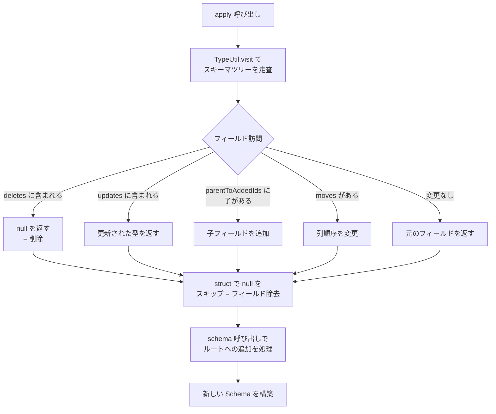

# 第4章 スキーマ進化

> **本章で読むソース**
>
> - [`api/src/main/java/org/apache/iceberg/UpdateSchema.java`](https://github.com/apache/iceberg/blob/apache-iceberg-1.11.0/api/src/main/java/org/apache/iceberg/UpdateSchema.java)
> - [`core/src/main/java/org/apache/iceberg/SchemaUpdate.java`](https://github.com/apache/iceberg/blob/apache-iceberg-1.11.0/core/src/main/java/org/apache/iceberg/SchemaUpdate.java)
> - [`core/src/main/java/org/apache/iceberg/schema/SchemaWithPartnerVisitor.java`](https://github.com/apache/iceberg/blob/apache-iceberg-1.11.0/core/src/main/java/org/apache/iceberg/schema/SchemaWithPartnerVisitor.java)

## この章の狙い

Iceberg のスキーマ進化がなぜデータファイルのリライトなしに列の追加、削除、リネーム、型拡張を実現できるのかを、仕様と参照実装の両面から読み解く。
「SchemaUpdate」がどのように変更操作を蓄積し、一括でスキーマを組み立てるかを追い、「SchemaWithPartnerVisitor」による新旧スキーマ突き合わせの仕組みまで理解する。

## 前提

Iceberg のスキーマは、すべてのフィールドに一意な整数 ID（**フィールド ID**）を割り当てる。
データファイル内の列もこの「フィールド ID」で識別されるため、列名の変更や列の追加があっても既存ファイルを書き換える必要がない。
この仕組みが本章の全体を貫く設計原則である。

仕様（format/spec.md）はスキーマ進化について次のように定めている。

> Schemas may be evolved by type promotion or adding, deleting, renaming, or reordering fields in structs (both nested structs and the top-level schema's struct).

進化操作がコミットされると、新しいスキーマにはユニークな**スキーマ ID** が振られ、テーブルメタデータのスキーマ一覧に追加される。
過去のスナップショットは古いスキーマ ID を保持し続けるため、タイムトラベル時にも正しい列マッピングが保証される。

## UpdateSchema インタフェース：進化操作の API 設計

スキーマ進化の操作は `UpdateSchema` インタフェースで宣言されている。
このインタフェースは `PendingUpdate<Schema>` を継承しており、変更操作をメソッドチェーンで蓄積し、最後に `commit()` で確定する設計である。

[`api/src/main/java/org/apache/iceberg/UpdateSchema.java` L34-L34](https://github.com/apache/iceberg/blob/apache-iceberg-1.11.0/api/src/main/java/org/apache/iceberg/UpdateSchema.java#L34-L34)

```java
public interface UpdateSchema extends PendingUpdate<Schema> {
```

操作は大きく6種類に分かれる。

| 操作カテゴリ | 主要メソッド | 互換性 |
|---|---|---|
| 列の追加（optional） | `addColumn` | 互換 |
| 列の追加（required） | `addRequiredColumn` | 非互換（デフォルト値なしの場合） |
| 列の削除 | `deleteColumn` | 互換 |
| 列のリネーム | `renameColumn` | 互換 |
| 型の拡張 | `updateColumn` | 互換（仕様が許可する昇格のみ） |
| 列の並び替え | `moveFirst`, `moveBefore`, `moveAfter` | 互換 |

### 非互換変更のガード

required 列の追加や optional から required への変更は、古いデータファイルの読み取り時に値が存在しない可能性があるため、デフォルトでは例外が発生する。
`allowIncompatibleChanges()` を呼ぶことで明示的に許可する設計になっている。

[`api/src/main/java/org/apache/iceberg/UpdateSchema.java` L51-L51](https://github.com/apache/iceberg/blob/apache-iceberg-1.11.0/api/src/main/java/org/apache/iceberg/UpdateSchema.java#L51-L51)

```java
  UpdateSchema allowIncompatibleChanges();
```

また、required 列にデフォルト値を設定すれば、古いデータファイルにその列がなくてもデフォルト値で補完できるため、互換変更として扱える。
仕様は次のように定めている。

> When a required field is added, both defaults must be set to a non-null value

`addColumn` のオーバーロード群は最終的に5引数版（parent, name, type, doc, defaultValue）に委譲される。
`parent` が null ならトップレベル、null でなければネストされた構造体への追加となる。

[`api/src/main/java/org/apache/iceberg/UpdateSchema.java` L129-L135](https://github.com/apache/iceberg/blob/apache-iceberg-1.11.0/api/src/main/java/org/apache/iceberg/UpdateSchema.java#L129-L135)

```java
  default UpdateSchema addColumn(String name, Type type, String doc, Literal<?> defaultValue) {
    Preconditions.checkArgument(
        !name.contains("."),
        "Cannot add column with ambiguous name: %s, use addColumn(parent, name, type)",
        name);
    return addColumn(null, name, type, doc, defaultValue);
  }
```

名前に `.` を含むフィールドは列パスの区切りと曖昧になるため、トップレベル追加時には禁止される。
ネスト追加時には parent と name を分離して指定するため、name に `.` を含んでも問題ない。

## SchemaUpdate：変更の蓄積と適用

`SchemaUpdate` クラスが `UpdateSchema` の実装であり、スキーマ進化の中核を担う。
変更操作をデータ構造に蓄積し、`apply()` 呼び出し時に一括で新スキーマを組み立てる。

### 蓄積用データ構造

[`core/src/main/java/org/apache/iceberg/SchemaUpdate.java` L59-L66](https://github.com/apache/iceberg/blob/apache-iceberg-1.11.0/core/src/main/java/org/apache/iceberg/SchemaUpdate.java#L59-L66)

```java
  private final List<Integer> deletes = Lists.newArrayList();
  private final Map<Integer, Types.NestedField> updates = Maps.newHashMap();
  private final Multimap<Integer, Integer> parentToAddedIds =
      Multimaps.newListMultimap(Maps.newHashMap(), Lists::newArrayList);
  private final Map<String, Integer> addedNameToId = Maps.newHashMap();
  private final Multimap<Integer, Move> moves =
      Multimaps.newListMultimap(Maps.newHashMap(), Lists::newArrayList);
  private int lastColumnId;
```

各フィールドの役割は次のとおりである。

- `deletes`: 削除するフィールドの ID リスト
- `updates`: 更新、追加されたフィールドの新しい定義（ID をキーとする Map）
- `parentToAddedIds`: 親フィールド ID から追加された子フィールド ID 群へのマッピング
- `addedNameToId`: 追加されたフィールドの完全修飾名から ID への逆引き
- `moves`: 親フィールド ID から列移動命令群へのマッピング
- `lastColumnId`: 次に割り当てるフィールド ID のカウンタ

すべての操作はフィールド ID を介して管理される。
名前ではなく ID で追跡するため、リネームと型変更を同時に行っても競合しない。

### 列の追加: internalAddColumn

列追加の実体は `internalAddColumn` メソッドである。

[`core/src/main/java/org/apache/iceberg/SchemaUpdate.java` L113-L187](https://github.com/apache/iceberg/blob/apache-iceberg-1.11.0/core/src/main/java/org/apache/iceberg/SchemaUpdate.java#L113-L187)

```java
  private void internalAddColumn(
      String parent,
      String name,
      boolean isOptional,
      Type type,
      String doc,
      Literal<?> defaultValue) {
    int parentId = TABLE_ROOT_ID;
    String fullName;
    if (parent != null) {
      Types.NestedField parentField = findField(parent);
      // ... (中略) ...
      parentId = parentField.fieldId();
      // ... (中略) ...
      fullName = schema.findColumnName(parentId) + "." + name;
    } else {
      // ... (中略) ...
      fullName = name;
    }

    Preconditions.checkArgument(
        defaultValue != null || isOptional || allowIncompatibleChanges,
        "Incompatible change: cannot add required column without a default value: %s",
        fullName);

    // assign new IDs in order
    int newId = assignNewColumnId();

    // update tracking for moves
    addedNameToId.put(caseSensitivityAwareName(fullName), newId);
    if (parentId != TABLE_ROOT_ID) {
      idToParent.put(newId, parentId);
    }

    Types.NestedField newField =
        Types.NestedField.builder()
            .withName(name)
            .isOptional(isOptional)
            .withId(newId)
            .ofType(TypeUtil.assignFreshIds(type, this::assignNewColumnId))
            .withDoc(doc)
            .withInitialDefault(defaultValue)
            .withWriteDefault(defaultValue)
            .build();

    updates.put(newId, newField);
    parentToAddedIds.put(parentId, newId);
  }
```

この処理には2つの重要なポイントがある。

第一に、`assignNewColumnId()` で新しいフィールド ID を採番している。
`lastColumnId` を 1 ずつインクリメントし、テーブル内で一意な ID を保証する。
ネストした型（struct, list, map）を追加する場合は、`TypeUtil.assignFreshIds` で内部フィールドにも新しい ID が再帰的に割り当てられる。

[`core/src/main/java/org/apache/iceberg/SchemaUpdate.java` L478-L482](https://github.com/apache/iceberg/blob/apache-iceberg-1.11.0/core/src/main/java/org/apache/iceberg/SchemaUpdate.java#L478-L482)

```java
  private int assignNewColumnId() {
    int next = lastColumnId + 1;
    this.lastColumnId = next;
    return next;
  }
```

第二に、required 列をデフォルト値なしで追加しようとすると `Preconditions.checkArgument` で拒否される。
`allowIncompatibleChanges` が true の場合のみ許可される。

### 列の削除

削除はフィールド ID を `deletes` リストに追加するだけである。

[`core/src/main/java/org/apache/iceberg/SchemaUpdate.java` L189-L202](https://github.com/apache/iceberg/blob/apache-iceberg-1.11.0/core/src/main/java/org/apache/iceberg/SchemaUpdate.java#L189-L202)

```java
  @Override
  public UpdateSchema deleteColumn(String name) {
    Types.NestedField field = findField(name);
    Preconditions.checkArgument(field != null, "Cannot delete missing column: %s", name);
    Preconditions.checkArgument(
        !parentToAddedIds.containsKey(field.fieldId()),
        "Cannot delete a column that has additions: %s",
        name);
    Preconditions.checkArgument(
        !updates.containsKey(field.fieldId()), "Cannot delete a column that has updates: %s", name);
    deletes.add(field.fieldId());

    return this;
  }
```

同一操作内で追加や更新したフィールドを削除することは禁止される。
逆に、削除済みフィールドに対する追加や更新も `internalAddColumn` や `updateColumn` 側で弾かれる。
これにより、矛盾した操作の組み合わせがコンパイル前に検出される。

### リネーム

リネームはフィールド ID を変えずに名前だけを差し替える。

[`core/src/main/java/org/apache/iceberg/SchemaUpdate.java` L204-L227](https://github.com/apache/iceberg/blob/apache-iceberg-1.11.0/core/src/main/java/org/apache/iceberg/SchemaUpdate.java#L204-L227)

```java
  @Override
  public UpdateSchema renameColumn(String name, String newName) {
    Types.NestedField field = findField(name);
    Preconditions.checkArgument(field != null, "Cannot rename missing column: %s", name);
    Preconditions.checkArgument(newName != null, "Cannot rename a column to null");
    Preconditions.checkArgument(
        !deletes.contains(field.fieldId()),
        "Cannot rename a column that will be deleted: %s",
        field.name());

    // merge with an update, if present
    int fieldId = field.fieldId();
    Types.NestedField update = updates.get(fieldId);
    Types.NestedField newField =
        Types.NestedField.from(update != null ? update : field).withName(newName).build();
    updates.put(fieldId, newField);

    if (identifierFieldNames.contains(name)) {
      identifierFieldNames.remove(name);
      identifierFieldNames.add(newName);
    }

    return this;
  }
```

既に型変更のための `update` が `updates` マップに存在する場合は、その更新に名前変更をマージする。
identifier フィールド（主キーに相当するフィールド）の場合は、名前の追従も行っている。
フィールド ID は変わらないため、データファイルとの対応関係は維持される。

### 型の拡張

型の拡張は `TypeUtil.isPromotionAllowed` で許可される昇格のみ受け付ける。

[`core/src/main/java/org/apache/iceberg/SchemaUpdate.java` L272-L298](https://github.com/apache/iceberg/blob/apache-iceberg-1.11.0/core/src/main/java/org/apache/iceberg/SchemaUpdate.java#L272-L298)

```java
  @Override
  public UpdateSchema updateColumn(String name, Type.PrimitiveType newType) {
    Types.NestedField field = findForUpdate(name);
    Preconditions.checkArgument(field != null, "Cannot update missing column: %s", name);
    Preconditions.checkArgument(
        !deletes.contains(field.fieldId()),
        "Cannot update a column that will be deleted: %s",
        field.name());

    if (field.type().equals(newType)) {
      return this;
    }

    Preconditions.checkArgument(
        TypeUtil.isPromotionAllowed(field.type(), newType),
        "Cannot change column type: %s: %s -> %s",
        name,
        field.type(),
        newType);

    // merge with a rename, if present
    int fieldId = field.fieldId();
    Types.NestedField newField = Types.NestedField.from(field).ofType(newType).build();
    updates.put(fieldId, newField);

    return this;
  }
```

`isPromotionAllowed` が許可する型昇格は仕様で定められた範囲に限定される。

[`api/src/main/java/org/apache/iceberg/types/TypeUtil.java` L440-L466](https://github.com/apache/iceberg/blob/apache-iceberg-1.11.0/api/src/main/java/org/apache/iceberg/types/TypeUtil.java#L440-L466)

```java
  public static boolean isPromotionAllowed(Type from, Type.PrimitiveType to) {
    // Warning! Before changing this function, make sure that the type change doesn't introduce
    // compatibility problems in partitioning.
    if (from.equals(to)) {
      return true;
    }

    switch (from.typeId()) {
      case INTEGER:
        return to.typeId() == Type.TypeID.LONG;

      case FLOAT:
        return to.typeId() == Type.TypeID.DOUBLE;

      case DECIMAL:
        Types.DecimalType fromDecimal = (Types.DecimalType) from;
        if (to.typeId() != Type.TypeID.DECIMAL) {
          return false;
        }

        Types.DecimalType toDecimal = (Types.DecimalType) to;
        return fromDecimal.scale() == toDecimal.scale()
            && fromDecimal.precision() <= toDecimal.precision();
    }

    return false;
  }
```

許可される昇格は次の3パターンのみである。

| 変更前 | 変更後 | 条件 |
|---|---|---|
| `int` | `long` | 無条件 |
| `float` | `double` | 無条件 |
| `decimal(P, S)` | `decimal(P', S)` | P' > P かつ S は同一 |

メソッド冒頭のコメントが警告するとおり、型昇格はパーティション変換との互換性にも影響する。
たとえば `bucket[N]` は int と long で同じハッシュ値を返すが、int と string では異なるため、パーティションフィールドの source になっている列の型昇格は制限される。

## apply(): 蓄積された変更の一括適用

`apply()` メソッドが、蓄積されたすべての変更をスキーマに反映する。

[`core/src/main/java/org/apache/iceberg/SchemaUpdate.java` L466-L470](https://github.com/apache/iceberg/blob/apache-iceberg-1.11.0/core/src/main/java/org/apache/iceberg/SchemaUpdate.java#L466-L470)

```java
  @Override
  public Schema apply() {
    return applyChanges(
        schema, deletes, updates, parentToAddedIds, moves, identifierFieldNames, caseSensitive);
  }
```

`applyChanges` は `TypeUtil.visit` を使って既存スキーマをツリー走査し、各ノードで削除、更新、追加を適用する。

[`core/src/main/java/org/apache/iceberg/SchemaUpdate.java` L565-L587](https://github.com/apache/iceberg/blob/apache-iceberg-1.11.0/core/src/main/java/org/apache/iceberg/SchemaUpdate.java#L565-L587)

```java
    // apply schema changes
    Types.StructType struct =
        TypeUtil.visit(schema, new ApplyChanges(deletes, updates, parentToAddedIds, moves))
            .asNestedType()
            .asStructType();

    // validate identifier requirements based on the latest schema
    Map<String, Integer> nameToId =
        caseSensitive ? TypeUtil.indexByName(struct) : TypeUtil.indexByLowerCaseName(struct);
    Set<Integer> freshIdentifierFieldIds = Sets.newHashSet();
    for (String name : identifierFieldNames) {
      Preconditions.checkArgument(
          nameToId.containsKey(name),
          "Cannot add field %s as an identifier field: not found in current schema or added columns",
          name);
      freshIdentifierFieldIds.add(nameToId.get(name));
    }

    Map<Integer, Types.NestedField> idToField = TypeUtil.indexById(struct);
    freshIdentifierFieldIds.forEach(
        id -> Schema.validateIdentifierField(id, idToField, idToParent));

    return new Schema(struct.fields(), freshIdentifierFieldIds);
```

### ApplyChanges ビジター

内部クラス `ApplyChanges` が `TypeUtil.SchemaVisitor<Type>` を実装し、スキーマの各ノードを訪問しながら変更を適用する。



`field` メソッドでは、フィールド ID が `deletes` に含まれていれば null を返して削除を表現する。
`struct` メソッドでは null を返したフィールドを除外し、更新があればマージする。

[`core/src/main/java/org/apache/iceberg/SchemaUpdate.java` L656-L687](https://github.com/apache/iceberg/blob/apache-iceberg-1.11.0/core/src/main/java/org/apache/iceberg/SchemaUpdate.java#L656-L687)

```java
    @Override
    public Type field(Types.NestedField field, Type fieldResult) {
      // the API validates deletes, updates, and additions don't conflict
      // handle deletes
      int fieldId = field.fieldId();
      if (deletes.contains(fieldId)) {
        return null;
      }

      // handle updates
      Types.NestedField update = updates.get(field.fieldId());
      if (update != null && update.type() != field.type()) {
        // rename is handled in struct, but struct needs the correct type from the field result
        return update.type();
      }

      // handle adds
      Collection<Types.NestedField> newFields =
          parentToAddedIds.get(fieldId).stream().map(updates::get).collect(Collectors.toList());
      Collection<Move> columnsToMove = moves.get(fieldId);
      if (!newFields.isEmpty() || !columnsToMove.isEmpty()) {
        // if either collection is non-null, then this must be a struct type. try to apply the
        // changes
        List<Types.NestedField> fields =
            addAndMoveFields(fieldResult.asStructType().fields(), newFields, columnsToMove);
        if (fields != null) {
          return Types.StructType.of(fields);
        }
      }

      return fieldResult;
    }
```

このビジターパターンにより、ネストしたスキーマ（struct の中の struct, list の中の struct など）に対しても再帰的に変更が適用される。

### 設計上の工夫: 遅延適用による変更の合成

`SchemaUpdate` は操作を即座にスキーマへ反映せず、データ構造に蓄積して `apply()` で一括適用する。
この遅延適用設計には3つの利点がある。

第一に、複数の変更操作の間で矛盾チェックが可能である。
たとえば「列 A を削除してから列 A を更新する」という矛盾した操作は、蓄積段階で検出されて例外が投げられる。

第二に、リネームと型変更のように同一フィールドに対する複数の変更が `updates` マップ上でマージされ、ツリー走査は1回で済む。

第三に、テーブルへのコミットが楽観的並行制御で失敗した場合、蓄積された操作を最新のメタデータに対して再適用できる。

## commit(): テーブルメタデータへの反映

`commit()` は `apply()` で生成したスキーマをテーブルメタデータに組み込み、`TableOperations.commit` で永続化する。

[`core/src/main/java/org/apache/iceberg/SchemaUpdate.java` L472-L476](https://github.com/apache/iceberg/blob/apache-iceberg-1.11.0/core/src/main/java/org/apache/iceberg/SchemaUpdate.java#L472-L476)

```java
  @Override
  public void commit() {
    TableMetadata update = applyChangesToMetadata(base.updateSchema(apply()));
    ops.commit(base, update);
  }
```

`applyChangesToMetadata` は、スキーマ変更に連動して2つの付随的な更新を行う。

第一に、`NameMapping`（列名からフィールド ID へのマッピング）の更新である。
Hive テーブルからの移行など、フィールド ID を持たないデータファイルを読む際に使われる。

第二に、列名に紐づくテーブルプロパティ（メトリクス設定、Parquet Bloom フィルタ設定など）のリネームと削除である。

[`core/src/main/java/org/apache/iceberg/SchemaUpdate.java` L510-L527](https://github.com/apache/iceberg/blob/apache-iceberg-1.11.0/core/src/main/java/org/apache/iceberg/SchemaUpdate.java#L510-L527)

```java
      List<String> deletedColumns =
          deletes.stream().map(schema::findColumnName).collect(Collectors.toList());
      Map<String, String> renamedColumns =
          updates.keySet().stream()
              .filter(id -> !addedNameToId.containsValue(id)) // remove added columns
              .filter(id -> !schema.findColumnName(id).equals(newSchema.findColumnName(id)))
              .collect(Collectors.toMap(schema::findColumnName, newSchema::findColumnName));
      if (!deletedColumns.isEmpty() || !renamedColumns.isEmpty()) {
        Set<String> columnProperties =
            ImmutableSet.of(
                TableProperties.METRICS_MODE_COLUMN_CONF_PREFIX,
                TableProperties.PARQUET_BLOOM_FILTER_COLUMN_ENABLED_PREFIX,
                TableProperties.PARQUET_COLUMN_STATS_ENABLED_PREFIX);
        Map<String, String> updatedProperties =
            PropertyUtil.applySchemaChanges(
                newMetadata.properties(), deletedColumns, renamedColumns, columnProperties);
        newMetadata = newMetadata.replaceProperties(updatedProperties);
      }
```

## SchemaWithPartnerVisitor: 新旧スキーマの並行走査

`SchemaWithPartnerVisitor` は、あるスキーマのツリーを走査しながら、対応する「パートナー」のデータ構造を同期的に辿るための汎用ビジターである。

[`core/src/main/java/org/apache/iceberg/schema/SchemaWithPartnerVisitor.java` L27-L38](https://github.com/apache/iceberg/blob/apache-iceberg-1.11.0/core/src/main/java/org/apache/iceberg/schema/SchemaWithPartnerVisitor.java#L27-L38)

```java
public abstract class SchemaWithPartnerVisitor<P, R> {

  public interface PartnerAccessors<P> {

    P fieldPartner(P partnerStruct, int fieldId, String name);

    P mapKeyPartner(P partnerMap);

    P mapValuePartner(P partnerMap);

    P listElementPartner(P partnerList);
  }
```

型パラメータ `P` がパートナーの型、`R` が結果の型である。
`PartnerAccessors` インタフェースがパートナー側の構造へのアクセス方法を定義し、ビジター本体はスキーマのツリー構造に沿って再帰的に走査する。

走査の中核部分では、struct の各フィールドについて `PartnerAccessors.fieldPartner` でパートナー側の対応要素を取得し、再帰的に訪問する。

[`core/src/main/java/org/apache/iceberg/schema/SchemaWithPartnerVisitor.java` L48-L68](https://github.com/apache/iceberg/blob/apache-iceberg-1.11.0/core/src/main/java/org/apache/iceberg/schema/SchemaWithPartnerVisitor.java#L48-L68)

```java
  public static <P, T> T visit(
      Type type, P partner, SchemaWithPartnerVisitor<P, T> visitor, PartnerAccessors<P> accessors) {
    switch (type.typeId()) {
      case STRUCT:
        Types.StructType struct = type.asNestedType().asStructType();
        List<T> results = Lists.newArrayListWithExpectedSize(struct.fields().size());
        for (Types.NestedField field : struct.fields()) {
          P fieldPartner =
              partner != null
                  ? accessors.fieldPartner(partner, field.fieldId(), field.name())
                  : null;
          visitor.beforeField(field, fieldPartner);
          T result;
          try {
            result = visit(field.type(), fieldPartner, visitor, accessors);
          } finally {
            visitor.afterField(field, fieldPartner);
          }
          results.add(visitor.field(field, fieldPartner, result));
        }
        return visitor.struct(struct, partner, results);
```

パートナーが null の場合（既存スキーマに対応するフィールドが存在しない場合）でも走査を続行する。
これにより、新スキーマにあって旧スキーマにないフィールドを検出できる。

```mermaid
flowchart LR
    subgraph 新スキーマの走査
        A[struct] --> B[field: id]
        A --> C[field: name]
        A --> D[field: email]
    end

    subgraph パートナー（既存スキーマ）
        E[struct] --> F[field: id]
        E --> G[field: name]
        E --> H["(存在しない)"]
    end

    B -.->|fieldPartner| F
    C -.->|fieldPartner| G
    D -.->|"null（新規列）"| H
```

## UnionByNameVisitor: 名前ベースのスキーマ統合

`UnionByNameVisitor` は `SchemaWithPartnerVisitor` を具体化し、名前が一致するフィールド同士を突き合わせて既存スキーマを新スキーマとの和集合へ進化させる。

[`core/src/main/java/org/apache/iceberg/schema/UnionByNameVisitor.java` L34-L44](https://github.com/apache/iceberg/blob/apache-iceberg-1.11.0/core/src/main/java/org/apache/iceberg/schema/UnionByNameVisitor.java#L34-L44)

```java
public class UnionByNameVisitor extends SchemaWithPartnerVisitor<Integer, Boolean> {

  private final UpdateSchema api;
  private final Schema partnerSchema;
  private final boolean caseSensitive;

  private UnionByNameVisitor(UpdateSchema api, Schema partnerSchema, boolean caseSensitive) {
    this.api = api;
    this.partnerSchema = partnerSchema;
    this.caseSensitive = caseSensitive;
  }
```

パートナー型 `P` が `Integer`（既存スキーマのフィールド ID）、結果型 `R` が `Boolean`（そのフィールドが既存スキーマに存在しないかどうか）である。

`visit` メソッドでは、新スキーマ側をツリー走査し、`PartnerIdByNameAccessors` が既存スキーマ側で名前が一致するフィールドの ID を返す。

[`core/src/main/java/org/apache/iceberg/schema/UnionByNameVisitor.java` L69-L76](https://github.com/apache/iceberg/blob/apache-iceberg-1.11.0/core/src/main/java/org/apache/iceberg/schema/UnionByNameVisitor.java#L69-L76)

```java
  public static void visit(
      UpdateSchema api, Schema existingSchema, Schema newSchema, boolean caseSensitive) {
    visit(
        newSchema,
        -1,
        new UnionByNameVisitor(api, existingSchema, caseSensitive),
        new PartnerIdByNameAccessors(existingSchema, caseSensitive));
  }
```

`struct` メソッドでは、新スキーマの各フィールドについて、既存スキーマに存在しなければ追加、存在すれば型やオプショナリティの差分を `UpdateSchema` の API で登録する。

[`core/src/main/java/org/apache/iceberg/schema/UnionByNameVisitor.java` L78-L104](https://github.com/apache/iceberg/blob/apache-iceberg-1.11.0/core/src/main/java/org/apache/iceberg/schema/UnionByNameVisitor.java#L78-L104)

```java
  @Override
  public Boolean struct(
      Types.StructType struct, Integer partnerId, List<Boolean> missingPositions) {
    if (partnerId == null) {
      return true;
    }

    List<Types.NestedField> fields = struct.fields();
    Types.StructType partnerStruct = findFieldType(partnerId).asStructType();
    IntStream.range(0, missingPositions.size())
        .forEach(
            pos -> {
              Boolean isMissing = missingPositions.get(pos);
              Types.NestedField field = fields.get(pos);
              if (isMissing) {
                addColumn(partnerId, field);
              } else {
                Types.NestedField nestedField =
                    caseSensitive
                        ? partnerStruct.field(field.name())
                        : partnerStruct.caseInsensitiveField(field.name());
                updateColumn(field, nestedField);
              }
            });

    return false;
  }
```

`updateColumn` メソッドは4種類の差分を検出する。

[`core/src/main/java/org/apache/iceberg/schema/UnionByNameVisitor.java` L171-L195](https://github.com/apache/iceberg/blob/apache-iceberg-1.11.0/core/src/main/java/org/apache/iceberg/schema/UnionByNameVisitor.java#L171-L195)

```java
  private void updateColumn(Types.NestedField field, Types.NestedField existingField) {
    String fullName = partnerSchema.findColumnName(existingField.fieldId());

    boolean needsOptionalUpdate = field.isOptional() && existingField.isRequired();
    boolean needsTypeUpdate = !isIgnorableTypeUpdate(existingField.type(), field.type());
    boolean needsDocUpdate = field.doc() != null && !field.doc().equals(existingField.doc());
    boolean needsDefaultUpdate =
        field.writeDefault() != null && !field.writeDefault().equals(existingField.writeDefault());

    if (needsOptionalUpdate) {
      api.makeColumnOptional(fullName);
    }

    if (needsTypeUpdate) {
      api.updateColumn(fullName, field.type().asPrimitiveType());
    }

    if (needsDocUpdate) {
      api.updateColumnDoc(fullName, field.doc());
    }

    if (needsDefaultUpdate) {
      api.updateColumnDefault(fullName, field.writeDefaultLiteral());
    }
  }
```

型の差分判定には `isIgnorableTypeUpdate` が使われる。
既存型のほうが広い場合（たとえば既存が long で新スキーマが int の場合）は、更新不要と判断してスキップする。
これにより、Spark DataFrame のスキーマのように精度情報が落ちたスキーマから union しても、不要な型変更が発行されない。

## 列プロジェクション: フィールド ID による列の選択

仕様はデータファイルからの列選択について次のように定めている。

> Columns in Iceberg data files are selected by field id. The table schema's column names and order may change after a data file is written, and projection must be done using field ids.

スキーマ進化後にデータファイルを読む際、ファイル内の列はフィールド ID で選択される。
テーブルスキーマ上の列名や列順序がファイル書き込み後に変わっていても、フィールド ID が一致すれば正しくマッピングされる。
ファイルに存在しないフィールド ID の値は、以下の優先順位で解決される。

1. パーティションメタデータに Identity Transform の値があればそれを使う
2. `schema.name-mapping.default` で列名からフィールド ID にマッピングできればその列を使う
3. `initial-default` が定義されていればそのデフォルト値を返す
4. いずれも該当しなければ null を返す

この解決順序により、スキーマ進化でフィールドが追加された後も、古いデータファイルはリライトなしに読み取れる。

## まとめ

- Iceberg のスキーマ進化は「フィールド ID」による列追跡を基盤とする。列名や列順序が変わっても、データファイルのリライトは不要である。
- `UpdateSchema` インタフェースが列の追加、削除、リネーム、型拡張、並び替えの操作を宣言し、`SchemaUpdate` が実装する。
- `SchemaUpdate` は変更を即時適用せず、`deletes`, `updates`, `parentToAddedIds`, `moves` の4つのデータ構造に蓄積し、`apply()` で一括適用する遅延適用パターンを採る。
- 型昇格は仕様で定められた安全な範囲（int to long, float to double, decimal の精度拡大）のみ許可される。パーティション変換との互換性も考慮されている。
- `SchemaWithPartnerVisitor` は2つのスキーマを並行走査する汎用フレームワークであり、`UnionByNameVisitor` がこれを使って名前ベースのスキーマ統合を実現する。
- `commit()` ではスキーマ本体に加え、`NameMapping` やメトリクス設定などの付随メタデータも連動して更新される。

## 関連する章

- [第3章 型システム](03-type-system.md)
- [第5章 パーティション仕様と変換関数](../part02-partitioning/05-partition-spec.md)
- [第2章 テーブルメタデータとフォーマットバージョン](../part00-overview/02-table-metadata.md)
