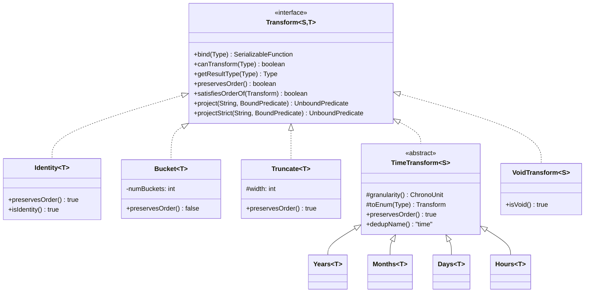
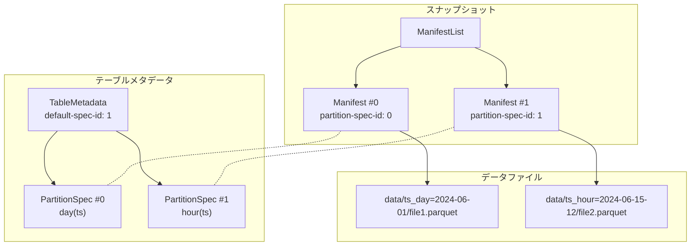
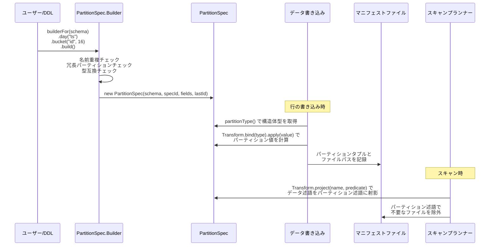

# 第5章 パーティション仕様と変換関数

> **本章で読むソース**
>
> - [`api/src/main/java/org/apache/iceberg/PartitionSpec.java`](https://github.com/apache/iceberg/blob/apache-iceberg-1.11.0/api/src/main/java/org/apache/iceberg/PartitionSpec.java)
> - [`api/src/main/java/org/apache/iceberg/PartitionField.java`](https://github.com/apache/iceberg/blob/apache-iceberg-1.11.0/api/src/main/java/org/apache/iceberg/PartitionField.java)
> - [`api/src/main/java/org/apache/iceberg/transforms/Transform.java`](https://github.com/apache/iceberg/blob/apache-iceberg-1.11.0/api/src/main/java/org/apache/iceberg/transforms/Transform.java)
> - [`api/src/main/java/org/apache/iceberg/transforms/Transforms.java`](https://github.com/apache/iceberg/blob/apache-iceberg-1.11.0/api/src/main/java/org/apache/iceberg/transforms/Transforms.java)

## この章の狙い

Iceberg の **Hidden Partitioning** がどのような設計思想で成り立つかを理解する。
仕様が定めるパーティション仕様（`PartitionSpec`）と変換関数（`Transform`）のデータモデルを読み、ユーザーが述語をパーティション列ではなくデータ列に書くだけで正しくファイルを刈り込める仕組みを追う。
さらに変換関数の射影（`project` / `projectStrict`）の意味論と、パーティション進化の仕組みを確認する。

## 前提

第1章で述べた Iceberg の全体像と、第3章の型システムを前提とする。
仕様書（`format/spec.md`）の「Partitioning」節にも目を通しておくとよい。

## Hidden Partitioning という設計思想

Hive に代表される従来のテーブルフォーマットでは、パーティション列はテーブルのスキーマの一部であり、ユーザーはクエリで `WHERE year = 2024 AND month = 6` のようにパーティション列を直接指定する必要があった。
この設計には 2 つの問題がある。

1. 物理レイアウトがクエリの書き方に漏れ出す。パーティション構成を変更すると、既存のクエリが壊れる。
2. パーティション列とデータ列の二重管理が必要になり、書き手がパーティション値を明示的に設定しなければならない。

Iceberg はこれらの問題を「パーティション仕様」という抽象で解決する。
仕様書は次のように述べている。

> Partition specs capture the transform from table data to partition values.
> This is used to transform predicates to partition predicates, in addition to transforming data values.
> Deriving partition predicates from column predicates on the table data is used to separate the logical queries from physical storage.

つまり、ユーザーは `WHERE ts > '2024-06-01'` のようにデータ列だけで述語を書く。
エンジンが変換関数を通じてパーティション述語（例: `ts_day >= day('2024-06-01')`）を自動導出し、不要なファイルを刈り込む。
パーティション列がスキーマに露出しないため、この仕組みを「Hidden Partitioning」と呼ぶ。

## PartitionField: パーティションフィールドのデータモデル

仕様が定めるパーティションフィールドは 4 つの属性で構成される。

1. ソース列 ID（`sourceId`）
2. パーティションフィールド ID（`fieldId`）
3. パーティション名（`name`）
4. 変換関数（`transform`）

参照実装の `PartitionField` はこの 4 属性をそのまま保持する不変オブジェクトである。

[`api/src/main/java/org/apache/iceberg/PartitionField.java` L26-L37](https://github.com/apache/iceberg/blob/apache-iceberg-1.11.0/api/src/main/java/org/apache/iceberg/PartitionField.java#L26-L37)

```java
public class PartitionField implements Serializable {
  private final int sourceId;
  private final int fieldId;
  private final String name;
  private final Transform<?, ?> transform;

  PartitionField(int sourceId, int fieldId, String name, Transform<?, ?> transform) {
    this.sourceId = sourceId;
    this.fieldId = fieldId;
    this.name = name;
    this.transform = transform;
  }
```

`sourceId` はテーブルスキーマ中のソース列を指す。
`fieldId` はパーティションフィールド固有の ID であり、v2 ではすべてのパーティション仕様をまたいで一意である。
この分離により、同じソース列に対して異なる変換関数を適用する（例: `day(ts)` から `hour(ts)` への進化）場合にも、旧マニフェストの整合性を保てる。

## PartitionSpec: パーティション仕様の全体構造

**PartitionSpec** はテーブルに対するパーティション定義の全体像を保持する。

[`api/src/main/java/org/apache/iceberg/PartitionSpec.java` L53-L75](https://github.com/apache/iceberg/blob/apache-iceberg-1.11.0/api/src/main/java/org/apache/iceberg/PartitionSpec.java#L53-L75)

```java
public class PartitionSpec implements Serializable {
  // IDs for partition fields start at 1000
  private static final int PARTITION_DATA_ID_START = 1000;

  private final Schema schema;

  // this is ordered so that DataFile has a consistent schema
  private final int specId;
  private final PartitionField[] fields;
  private transient volatile ListMultimap<Integer, PartitionField> fieldsBySourceId = null;
  private transient volatile Class<?>[] lazyJavaClasses = null;
  private transient volatile StructType lazyPartitionType = null;
  private transient volatile StructType lazyRawPartitionType = null;
  private transient volatile List<PartitionField> fieldList = null;
  private final int lastAssignedFieldId;

  private PartitionSpec(
      Schema schema, int specId, List<PartitionField> fields, int lastAssignedFieldId) {
    this.schema = schema;
    this.specId = specId;
    this.fields = fields.toArray(new PartitionField[0]);
    this.lastAssignedFieldId = lastAssignedFieldId;
  }
```

注目すべき設計ポイントがいくつかある。

`PARTITION_DATA_ID_START` の値は 1000 で、パーティションフィールド ID はこの値から採番される。
スキーマのフィールド ID（通常 1 から始まる）と名前空間を分離し、マニフェストファイル中のパーティション構造体のフィールド ID と衝突しないようにしている。

`fields` は配列で保持され、順序が確定している。
これはマニフェストファイル中のパーティションタプルのスキーマを一意に定めるためである。

遅延初期化フィールド（`lazyPartitionType` など）は `transient volatile` で宣言されている。
`PartitionSpec` は `Serializable` であり、シリアライズ後にこれらを再構築する設計である。

### パーティション型の導出

`partitionType()` メソッドはパーティションフィールドの配列から `StructType` を導出する。
各フィールドについて、ソース列の型に変換関数の `getResultType` を適用して結果型を得る。

[`api/src/main/java/org/apache/iceberg/PartitionSpec.java` L126-L150](https://github.com/apache/iceberg/blob/apache-iceberg-1.11.0/api/src/main/java/org/apache/iceberg/PartitionSpec.java#L126-L150)

```java
  public StructType partitionType() {
    if (lazyPartitionType == null) {
      synchronized (this) {
        if (lazyPartitionType == null) {
          List<Types.NestedField> structFields = Lists.newArrayListWithExpectedSize(fields.length);

          for (PartitionField field : fields) {
            Type sourceType = schema.findType(field.sourceId());
            Type resultType = field.transform().getResultType(sourceType);

            // When the source field has been dropped we cannot determine the type
            if (sourceType == null) {
              resultType = Types.UnknownType.get();
            }

            structFields.add(Types.NestedField.optional(field.fieldId(), field.name(), resultType));
          }

          this.lazyPartitionType = Types.StructType.of(structFields);
        }
      }
    }

    return lazyPartitionType;
  }
```

ソース列が削除済み（スキーマ進化でドロップされた場合）のときは `UnknownType` にフォールバックする。
これにより、過去のパーティション仕様を含むメタデータを読み続けることができる。

### パーティションパスの生成

`partitionToPath` メソッドはパーティション値から Hive 互換のパスを生成する。

[`api/src/main/java/org/apache/iceberg/PartitionSpec.java` L214-L229](https://github.com/apache/iceberg/blob/apache-iceberg-1.11.0/api/src/main/java/org/apache/iceberg/PartitionSpec.java#L214-L229)

```java
  public String partitionToPath(StructLike data) {
    StringBuilder sb = new StringBuilder();
    Class<?>[] javaClasses = javaClasses();
    List<Types.NestedField> outputFields = partitionType().fields();
    for (int i = 0; i < javaClasses.length; i += 1) {
      PartitionField field = fields[i];
      Type type = outputFields.get(i).type();
      String valueString = field.transform().toHumanString(type, get(data, i, javaClasses[i]));

      if (i > 0) {
        sb.append("/");
      }
      sb.append(escape(field.name())).append("=").append(escape(valueString));
    }
    return sb.toString();
  }
```

各パーティションフィールドの `toHumanString` を呼び出し、`name=value` の形式をスラッシュで連結する。
時刻系変換の場合、`TransformUtil.humanYear` や `TransformUtil.humanDay` によって `2024` や `2024-06-01` のような人間可読文字列に変換される。

### 非パーティションテーブルの表現

パーティションなしのテーブルは `unpartitioned()` が返すシングルトンで表現される。

[`api/src/main/java/org/apache/iceberg/PartitionSpec.java` L341-L351](https://github.com/apache/iceberg/blob/apache-iceberg-1.11.0/api/src/main/java/org/apache/iceberg/PartitionSpec.java#L341-L351)

```java
  private static final PartitionSpec UNPARTITIONED_SPEC =
      new PartitionSpec(new Schema(), 0, ImmutableList.of(), unpartitionedLastAssignedId());

  /**
   * Returns a spec for unpartitioned tables.
   *
   * @return a partition spec with no partitions
   */
  public static PartitionSpec unpartitioned() {
    return UNPARTITIONED_SPEC;
  }
```

`specId` は 0、フィールドは空リスト、`lastAssignedFieldId` は 999（`PARTITION_DATA_ID_START - 1`）である。
この設計により、非パーティションテーブルもパーティションテーブルと同じコードパスで扱える。

## PartitionSpec.Builder: パーティション仕様の構築

パーティション仕様は `Builder` パターンで構築する。

[`api/src/main/java/org/apache/iceberg/PartitionSpec.java` L372-L379](https://github.com/apache/iceberg/blob/apache-iceberg-1.11.0/api/src/main/java/org/apache/iceberg/PartitionSpec.java#L372-L379)

```java
  public static class Builder {
    private final Schema schema;
    private final List<PartitionField> fields = Lists.newArrayList();
    private final Set<String> partitionNames = Sets.newHashSet();
    private final Map<Map.Entry<Integer, String>, PartitionField> dedupFields = Maps.newHashMap();
    private int specId = 0;
    private final AtomicInteger lastAssignedFieldId =
        new AtomicInteger(unpartitionedLastAssignedId());
```

ビルダーは 2 つのバリデーションを行う。

第一に、パーティション名の重複を `partitionNames` で検出する。
第二に、同一ソース列に同一変換を重複適用しないよう `dedupFields` で検出する。

[`api/src/main/java/org/apache/iceberg/PartitionSpec.java` L429-L439](https://github.com/apache/iceberg/blob/apache-iceberg-1.11.0/api/src/main/java/org/apache/iceberg/PartitionSpec.java#L429-L439)

```java
    private void checkForRedundantPartitions(PartitionField field) {
      Map.Entry<Integer, String> dedupKey =
          new AbstractMap.SimpleEntry<>(field.sourceId(), field.transform().dedupName());
      PartitionField partitionField = dedupFields.get(dedupKey);
      Preconditions.checkArgument(
          partitionField == null,
          "Cannot add redundant partition: %s conflicts with %s",
          partitionField,
          field);
      dedupFields.put(dedupKey, field);
    }
```

重複検出のキーは `(sourceId, dedupName)` のペアである。
時刻系変換（year, month, day, hour）は `dedupName()` がすべて `"time"` を返すため、同一ソース列に対して `year` と `month` を同時に適用するとエラーになる。
これは `TimeTransform.dedupName()` で定義されている。

[`api/src/main/java/org/apache/iceberg/transforms/TimeTransform.java` L102-L105](https://github.com/apache/iceberg/blob/apache-iceberg-1.11.0/api/src/main/java/org/apache/iceberg/transforms/TimeTransform.java#L102-L105)

```java
  @Override
  public String dedupName() {
    return "time";
  }
```

ビルダーの各メソッド（`identity`, `bucket`, `truncate`, `year`, `month`, `day`, `hour`）は、ソース列名を引数に取り、パーティション名を自動生成する。
たとえば `bucket("id", 16)` は `id_bucket` というパーティション名を生成する。

[`api/src/main/java/org/apache/iceberg/PartitionSpec.java` L568-L572](https://github.com/apache/iceberg/blob/apache-iceberg-1.11.0/api/src/main/java/org/apache/iceberg/PartitionSpec.java#L568-L572)

```java
    public Builder bucket(String sourceName, int numBuckets) {
      Types.NestedField sourceColumn = findSourceColumn(sourceName);
      String columnName = schema.findColumnName(sourceColumn.fieldId());
      return bucket(sourceColumn, numBuckets, columnName + "_bucket");
    }
```

## Transform インタフェース: 変換関数の契約

**Transform** インタフェースは変換関数の振る舞いを規定する。

[`api/src/main/java/org/apache/iceberg/transforms/Transform.java` L39-L51](https://github.com/apache/iceberg/blob/apache-iceberg-1.11.0/api/src/main/java/org/apache/iceberg/transforms/Transform.java#L39-L51)

```java
public interface Transform<S, T> extends Serializable {
  // ... (中略) ...

  default SerializableFunction<S, T> bind(Type type) {
    throw new UnsupportedOperationException("bind is not implemented");
  }

  boolean canTransform(Type type);

  Type getResultType(Type sourceType);

  default boolean preservesOrder() {
    return false;
  }

  default boolean satisfiesOrderOf(Transform<?, ?> other) {
    return equals(other);
  }
```

主要なメソッドの役割を整理する。

| メソッド | 役割 |
|---------|------|
| `bind(Type)` | 型に束縛した適用関数を返す |
| `canTransform(Type)` | 指定型に適用可能か判定する |
| `getResultType(Type)` | 変換結果の型を返す |
| `preservesOrder()` | 単調性を持つか判定する |
| `satisfiesOrderOf(Transform)` | この変換の順序が他の変換の順序を満たすか判定する |
| `project(name, predicate)` | 包含射影を行う |
| `projectStrict(name, predicate)` | 厳密射影を行う |

`bind` メソッドは型消去後の安全な適用を実現する。
`Transform<S, T>` 自体は型パラメータを持つが、メタデータからデシリアライズされた時点では型情報が失われている。
`bind(Type)` を呼ぶことで、具体型に対応した `SerializableFunction` を取得し、値の変換を行う。

### 順序の保存と充足

`preservesOrder()` は変換が単調であるかを示す。
単調とは、任意の値 a < b に対して apply(a) <= apply(b) が成り立つことを意味する。
`identity`, `truncate`, 時刻系変換は単調であり、`bucket` は単調ではない。

`satisfiesOrderOf(Transform)` はソート順序の互換性を判定する。
たとえば `day(ts)` でソートされたデータは `month(ts)` や `year(ts)` の順序も満たす。
逆に `day(ts)` は `hour(ts)` の順序を満たさない。

`Identity` 変換の `satisfiesOrderOf` は、相手が `preservesOrder()` を返せば常に `true` を返す。
identity で整列されたデータは、任意の単調変換の順序を満たすからである。

[`api/src/main/java/org/apache/iceberg/transforms/Identity.java` L136-L140](https://github.com/apache/iceberg/blob/apache-iceberg-1.11.0/api/src/main/java/org/apache/iceberg/transforms/Identity.java#L136-L140)

```java
  @Override
  public boolean satisfiesOrderOf(Transform<?, ?> other) {
    // ordering by value is the same as long as the other preserves order
    return other.preservesOrder();
  }
```

## 組み込み変換関数

仕様が定める変換関数は 7 種類である。
参照実装では `Transforms` クラスのファクトリメソッドを通じてインスタンスを取得する。

### identity

ソース値をそのまま返す。
すべてのプリミティブ型（`VARIANT`, `GEOMETRY`, `GEOGRAPHY` を除く）に適用できる。
結果型はソース型と同一である。

`project` と `projectStrict` は同じ実装を共有し、述語をそのまま新しいフィールド名に束縛し直す。
これは変換を行わないので、述語の意味が完全に保存されるためである。

[`api/src/main/java/org/apache/iceberg/transforms/Identity.java` L142-L157](https://github.com/apache/iceberg/blob/apache-iceberg-1.11.0/api/src/main/java/org/apache/iceberg/transforms/Identity.java#L142-L157)

```java
  @Override
  public UnboundPredicate<T> project(String name, BoundPredicate<T> predicate) {
    return projectStrict(name, predicate);
  }

  @Override
  public UnboundPredicate<T> projectStrict(String name, BoundPredicate<T> predicate) {
    if (predicate.isUnaryPredicate()) {
      return Expressions.predicate(predicate.op(), name);
    } else if (predicate.isLiteralPredicate()) {
      return Expressions.predicate(predicate.op(), name, predicate.asLiteralPredicate().literal());
    } else if (predicate.isSetPredicate()) {
      return Expressions.predicate(predicate.op(), name, predicate.asSetPredicate().literalSet());
    }
    return null;
  }
```

### bucket[N]

Murmur3 ハッシュの 32 ビット版（x86 variant, seed = 0）を計算し、符号ビットを落とした後に N で剰余を取る。

[`api/src/main/java/org/apache/iceberg/transforms/Bucket.java` L111-L117](https://github.com/apache/iceberg/blob/apache-iceberg-1.11.0/api/src/main/java/org/apache/iceberg/transforms/Bucket.java#L111-L117)

```java
  @Override
  public Integer apply(T value) {
    if (value == null) {
      return null;
    }
    return (hash(value) & Integer.MAX_VALUE) % numBuckets;
  }
```

`hash(value) & Integer.MAX_VALUE` で符号ビットを除去し、結果を必ず非負にする。
仕様書の疑似コードと逐語的に一致する設計である。

`bucket` は単調ではないため、`preservesOrder()` はデフォルトの `false` を返す。
`project` では等値述語（`EQ`）と `IN` のみ射影可能であり、範囲述語（`LT`, `GT` など）は射影できず `null` を返す。
ハッシュの性質上、順序関係が保存されないためである。

### truncate[W]

値を幅 W で切り捨てる。
整数型では `v - (v % W)`（ただし剰余は正にする）、文字列型では先頭 W 文字（Unicode コードポイント単位）を取る。

[`api/src/main/java/org/apache/iceberg/transforms/Truncate.java` L180-L187](https://github.com/apache/iceberg/blob/apache-iceberg-1.11.0/api/src/main/java/org/apache/iceberg/transforms/Truncate.java#L180-L187)

```java
    @Override
    public Integer apply(Integer value) {
      if (value == null) {
        return null;
      }

      return TruncateUtil.truncateInt(width, value);
    }
```

`truncate` は単調であり、`preservesOrder()` は `true` を返す。
`satisfiesOrderOf` では、自身の幅が相手の幅以上であれば順序を満たすと判定する。
`truncate[5]` でソートされたデータは `truncate[10]` の順序を満たすが、逆は成り立たない。

[`api/src/main/java/org/apache/iceberg/transforms/Truncate.java` L128-L140](https://github.com/apache/iceberg/blob/apache-iceberg-1.11.0/api/src/main/java/org/apache/iceberg/transforms/Truncate.java#L128-L140)

```java
  @Override
  public boolean satisfiesOrderOf(Transform<?, ?> other) {
    if (this == other) {
      return true;
    }

    if (!(other instanceof Truncate)) {
      return false;
    }

    Truncate<?> otherTrunc = (Truncate<?>) other;
    return otherTrunc.width <= width;
  }
```

### year, month, day, hour（時刻系変換）

時刻系変換はすべて `TimeTransform` 抽象クラスを継承する。
1970-01-01 を基準としたエポックからの整数値を返す。
`year` は年数、`month` は月数、`day` は日数、`hour` は時間数である。

`Years` クラスの実装はシンプルである。

[`api/src/main/java/org/apache/iceberg/transforms/Years.java` L26-L32](https://github.com/apache/iceberg/blob/apache-iceberg-1.11.0/api/src/main/java/org/apache/iceberg/transforms/Years.java#L26-L32)

```java
class Years<T> extends TimeTransform<T> {
  private static final Years<?> INSTANCE = new Years<>();

  @SuppressWarnings("unchecked")
  static <T> Years<T> get() {
    return (Years<T>) INSTANCE;
  }

  @Override
  protected ChronoUnit granularity() {
    return ChronoUnit.YEARS;
  }

  @Override
  protected Transform<T, Integer> toEnum(Type type) {
    return (Transform<T, Integer>)
        fromSourceType(type, Dates.YEAR, Timestamps.MICROS_TO_YEAR, Timestamps.NANOS_TO_YEAR);
  }

  @Override
  public Type getResultType(Type sourceType) {
    return Types.IntegerType.get();
  }
  // ... (中略) ...
  @Override
  public String toString() {
    return "year";
  }
```

`toEnum` メソッドでソース型に応じた変換実装（`Dates.YEAR` や `Timestamps.MICROS_TO_YEAR`）に委譲する。
日付型とタイムスタンプ型で内部表現（日数 vs マイクロ秒）が異なるため、型に応じた分岐が必要になる。

`Hours` は日付型をサポートしない点が他の時刻系変換と異なる。
`toEnum` で `Dates` の引数に `null` を渡しており、日付型で呼び出すと `IllegalArgumentException` が発生する。

[`api/src/main/java/org/apache/iceberg/transforms/Hours.java` L34-L38](https://github.com/apache/iceberg/blob/apache-iceberg-1.11.0/api/src/main/java/org/apache/iceberg/transforms/Hours.java#L34-L38)

```java
  @Override
  protected ChronoUnit granularity() {
    return ChronoUnit.HOURS;
  }

```

### void

常に `null` を返す変換である。
`project` と `projectStrict` は常に `null` を返し、述語によるフィルタリングは一切行わない。
パーティション進化で削除されたフィールドの代替として使われる（後述）。

## 変換関数の階層構造

変換関数の実装は以下の階層で整理される。



`TimeTransform` が `dedupName()` で `"time"` を返す設計は、同一ソース列への時刻系変換の重複適用を防ぐための重要な仕組みである。

## Transforms ファクトリ: 文字列からの復元

メタデータから変換関数を復元するとき、`Transforms.fromString` が呼ばれる。
`bucket[N]` や `truncate[W]` のようなパラメータ付き変換は正規表現でパースする。

[`api/src/main/java/org/apache/iceberg/transforms/Transforms.java` L39-L68](https://github.com/apache/iceberg/blob/apache-iceberg-1.11.0/api/src/main/java/org/apache/iceberg/transforms/Transforms.java#L39-L68)

```java
  private static final Pattern HAS_WIDTH = Pattern.compile("(\\w+)\\[(\\d+)\\]");

  public static Transform<?, ?> fromString(String transform) {
    Matcher widthMatcher = HAS_WIDTH.matcher(transform);
    if (widthMatcher.matches()) {
      String name = widthMatcher.group(1);
      int parsedWidth = Integer.parseInt(widthMatcher.group(2));
      if (name.equalsIgnoreCase("truncate")) {
        return Truncate.get(parsedWidth);
      } else if (name.equalsIgnoreCase("bucket")) {
        return Bucket.get(parsedWidth);
      }
    }

    if (transform.equalsIgnoreCase("identity")) {
      return Identity.get();
    } else if (transform.equalsIgnoreCase("year")) {
      return Years.get();
    } else if (transform.equalsIgnoreCase("month")) {
      return Months.get();
    } else if (transform.equalsIgnoreCase("day")) {
      return Days.get();
    } else if (transform.equalsIgnoreCase("hour")) {
      return Hours.get();
    } else if (transform.equalsIgnoreCase("void")) {
      return VoidTransform.get();
    }

    return new UnknownTransform<>(transform);
  }
```

未知の変換名が来た場合は `UnknownTransform` を返す。
仕様書はこの振る舞いを明示的に規定しており、読み手は未知の変換を持つパーティションフィールドを無視してファイルフィルタリングを行う。
書き手は未知の変換を含むパーティション仕様でデータをコミットできない。

## 変換関数の射影: project と projectStrict

Hidden Partitioning の核心は、データ列への述語をパーティション列への述語に変換する「射影」にある。
仕様書はこれを **包含射影**（inclusive projection）と呼ぶ。

### 包含射影（project）

`project` メソッドは包含射影を行う。
その保証は「元の述語が行に対して真ならば、射影された述語もその行のパーティション値に対して真」である。

[`api/src/main/java/org/apache/iceberg/transforms/Transform.java` L104-L115](https://github.com/apache/iceberg/blob/apache-iceberg-1.11.0/api/src/main/java/org/apache/iceberg/transforms/Transform.java#L104-L115)

```java
  /**
   * Transforms a {@link BoundPredicate predicate} to an inclusive predicate on the partition values
   * produced by the transform.
   *
   * <p>This inclusive transform guarantees that if pred(v) is true, then projected(apply(v)) is
   * true.
   *
   * @param name the field name for partition values
   * @param predicate a predicate for source values
   * @return an inclusive predicate on partition values
   */
  UnboundPredicate<T> project(String name, BoundPredicate<S> predicate);
```

これはスキャンプランニングで使われる。
包含射影は偽陰性を起こさない（一致するファイルを見逃さない）が、偽陽性を許容する（一致しないファイルを含めることがある）。

たとえば、`ts > '2024-06-15 12:00:00'` という述語に対して `day` 変換の包含射影は `ts_day >= day('2024-06-15')` となる。
6 月 15 日のパーティションには 12:00:00 より前のレコードも含まれるが、そのファイルを読むことは安全である（偽陽性）。

### 厳密射影（projectStrict）

`projectStrict` メソッドは厳密射影を行う。
その保証は逆方向で、「射影された述語がパーティション値に対して真ならば、そのパーティション内のすべての行で元の述語が真」である。

[`api/src/main/java/org/apache/iceberg/transforms/Transform.java` L104-L115](https://github.com/apache/iceberg/blob/apache-iceberg-1.11.0/api/src/main/java/org/apache/iceberg/transforms/Transform.java#L104-L115)

```java
  /**
   * Transforms a {@link BoundPredicate predicate} to an inclusive predicate on the partition values
   * produced by the transform.
   *
   * <p>This inclusive transform guarantees that if pred(v) is true, then projected(apply(v)) is
   * true.
   *
   * @param name the field name for partition values
   * @param predicate a predicate for source values
   * @return an inclusive predicate on partition values
   */
  UnboundPredicate<T> project(String name, BoundPredicate<S> predicate);
```

厳密射影は上書き操作（overwrite）で使われる。
たとえば「条件に一致するすべてのデータを上書きする」操作では、パーティション全体が条件を満たすことを保証する必要がある。

### 変換ごとの射影の違い

変換関数の性質によって、射影できる述語の種類が異なる。

| 変換 | project（包含射影） | projectStrict（厳密射影） |
|------|---------------------|--------------------------|
| identity | すべての述語を射影可能 | すべての述語を射影可能 |
| bucket | EQ, IN のみ | NOT_EQ, NOT_IN のみ |
| truncate | すべての比較述語を射影可能 | すべての比較述語を射影可能 |
| 時刻系 | すべての比較述語を射影可能 | すべての比較述語を射影可能 |
| void | 常に null（射影不能） | 常に null（射影不能） |

`bucket` の `project` が等値述語に限られる理由は明確である。
`bucket[16]` で `id = 42` は `id_bucket = bucket(42)` に射影できる。
しかし `id > 42` は `id_bucket > bucket(42)` に射影できない。
ハッシュ値の大小関係は元の値の大小関係と無関係だからである。

## 設計上の工夫: パーティションフィールド ID の分離と進化の安全性

Iceberg のパーティション設計で最も重要な工夫は、パーティションフィールド ID の名前空間を分離し、パーティション進化を安全に行えるようにしている点である。

### 問題

テーブルが成長するとパーティション構成の変更が必要になる。
日単位のパーティションを時間単位に変更したい場合、従来のテーブルフォーマットではテーブルを再作成するか、すべてのデータを再書き込みする必要があった。

### Iceberg の解決策

Iceberg では複数のパーティション仕様が同時に存在できる。
各マニフェストファイルは自身が書かれた時点のパーティション仕様 ID を保持する。
古いマニフェストは古いパーティション仕様で読み、新しいマニフェストは新しいパーティション仕様で読む。



この図は、パーティション仕様が `day(ts)` から `hour(ts)` に進化した場合を示す。
古いデータファイルは `PartitionSpec #0` で管理され、新しいデータファイルは `PartitionSpec #1` で管理される。
データの再書き込みは不要である。

### v1 と v2 の違い

v1 ではパーティションフィールド ID は暗黙的に 1000 から連番で割り当てられていた。
この設計では、パーティション仕様を変更すると同じ ID に異なる型のデータが入る問題が生じた。
仕様書はこの制約を明示している。

> In v1, partition field IDs were not tracked, but were assigned sequentially starting at 1000 in the reference implementation.
> This assignment caused problems when reading metadata tables based on manifest files from multiple specs because partition fields with the same ID may contain different data types.

v2 では `lastAssignedFieldId` をテーブルメタデータレベルで追跡し、新しいパーティションフィールドには常にグローバルに一意な ID を割り当てる。

[`api/src/main/java/org/apache/iceberg/PartitionSpec.java` L617-L622](https://github.com/apache/iceberg/blob/apache-iceberg-1.11.0/api/src/main/java/org/apache/iceberg/PartitionSpec.java#L617-L622)

```java
    Builder add(int sourceId, int fieldId, String name, Transform<?, ?> transform) {
      checkAndAddPartitionName(name, sourceId);
      fields.add(new PartitionField(sourceId, fieldId, name, transform));
      lastAssignedFieldId.getAndAccumulate(fieldId, Math::max);
      return this;
    }
```

`getAndAccumulate(fieldId, Math::max)` により、与えられた `fieldId` と現在の最大値の大きい方を保持する。
これはメタデータから既存のパーティション仕様を復元するときに、ID の連続性が保証されないケースにも対応する。

### v1 での安全なパーティション進化

v1 テーブルでパーティションを安全に進化させるために、仕様書は 3 つのルールを定めている。

1. パーティションフィールドを並べ替えない
2. パーティションフィールドを削除しない。代わりに `void` 変換で置き換える
3. 新しいフィールドは末尾にのみ追加する

`void` 変換による「論理削除」は、ID の割り当てを壊さずにフィールドを無効化する工夫である。

### 互換性判定

`PartitionSpec.compatibleWith` メソッドは、2 つのパーティション仕様がフィールド ID を無視して等価かを判定する。
仕様書は「同一のパーティション仕様が既に存在する場合、書き手は新しいパーティション仕様を作ってはならない」と定めている。

[`api/src/main/java/org/apache/iceberg/PartitionSpec.java` L239-L259](https://github.com/apache/iceberg/blob/apache-iceberg-1.11.0/api/src/main/java/org/apache/iceberg/PartitionSpec.java#L239-L259)

```java
  public boolean compatibleWith(PartitionSpec other) {
    if (equals(other)) {
      return true;
    }

    if (fields.length != other.fields.length) {
      return false;
    }

    for (int i = 0; i < fields.length; i += 1) {
      PartitionField thisField = fields[i];
      PartitionField thatField = other.fields[i];
      if (thisField.sourceId() != thatField.sourceId()
          || !thisField.transform().toString().equals(thatField.transform().toString())
          || !thisField.name().equals(thatField.name())) {
        return false;
      }
    }

    return true;
  }
```

`fieldId` は比較対象に含めず、`sourceId`、変換関数の文字列表現、名前の 3 属性で判定する。
変換関数の比較に `toString()` を使っている点は注意が必要で、これは `equals` だと異なるインスタンスが等価にならないケース（シリアライズ前後など）への対策である。

## PartitionSpec の構成の流れ

パーティション仕様がどのように構築され、データファイルの書き込みと読み込みで使われるかの全体の流れを示す。



## まとめ

- Iceberg の Hidden Partitioning は、パーティション列をスキーマに露出させず、変換関数を介してデータ列への述語をパーティション述語に自動変換する仕組みである
- 「PartitionSpec」は specId、フィールド配列、lastAssignedFieldId を持ち、パーティション値の構造体型をフィールドの変換結果から導出する
- 「PartitionField」は sourceId、fieldId、name、transform の 4 属性で構成され、fieldId はパーティション仕様をまたいでグローバルに一意（v2）である
- 組み込み変換関数は identity, bucket, truncate, year, month, day, hour, void の 8 種類で、それぞれ `canTransform` で適用可能な型を制限する
- `project`（包含射影）はスキャン時のファイル刈り込みに、`projectStrict`（厳密射影）は上書き操作時のパーティション確定に使われる
- パーティション進化により、テーブルは複数のパーティション仕様を同時に持てる。各マニフェストは自身のパーティション仕様 ID を保持し、データの再書き込みなしにパーティション構成を変更できる
- 時刻系変換の `dedupName()` が `"time"` を返す設計により、同一ソース列への時刻系変換の重複適用をビルド時に防止する

## 関連する章

- [第3章 型システム](../part01-type-and-schema/03-type-system.md)
- [第6章 ソート順序](06-sort-order.md)
- [第8章 マニフェストファイル](../part03-snapshot/08-manifest-file.md)
- [第13章 式と述語](../part05-scan/13-expressions-and-predicates.md)
- [第14章 プランニングとスキャン](../part05-scan/14-planning-and-scan.md)
