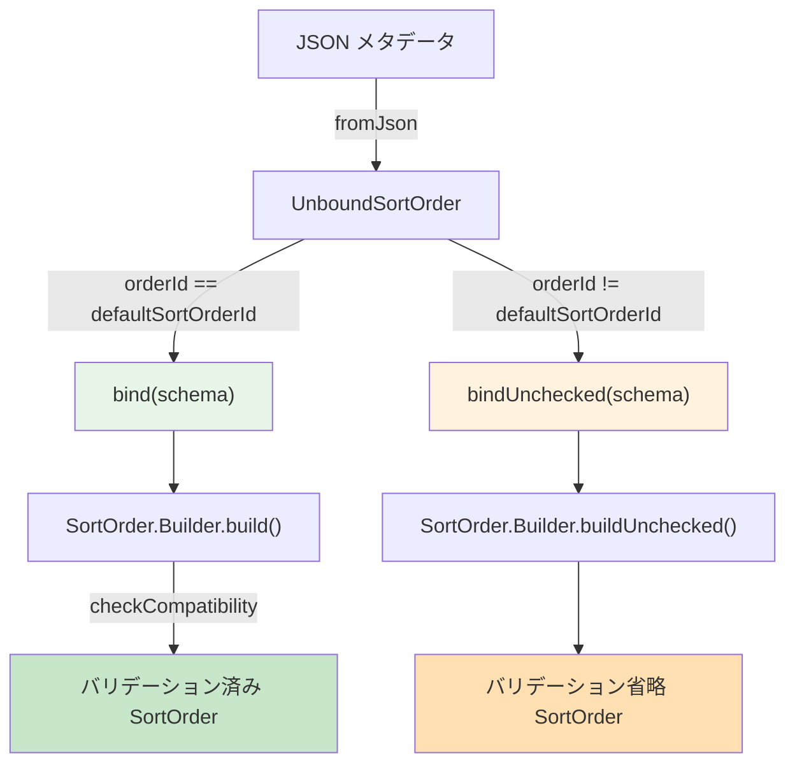
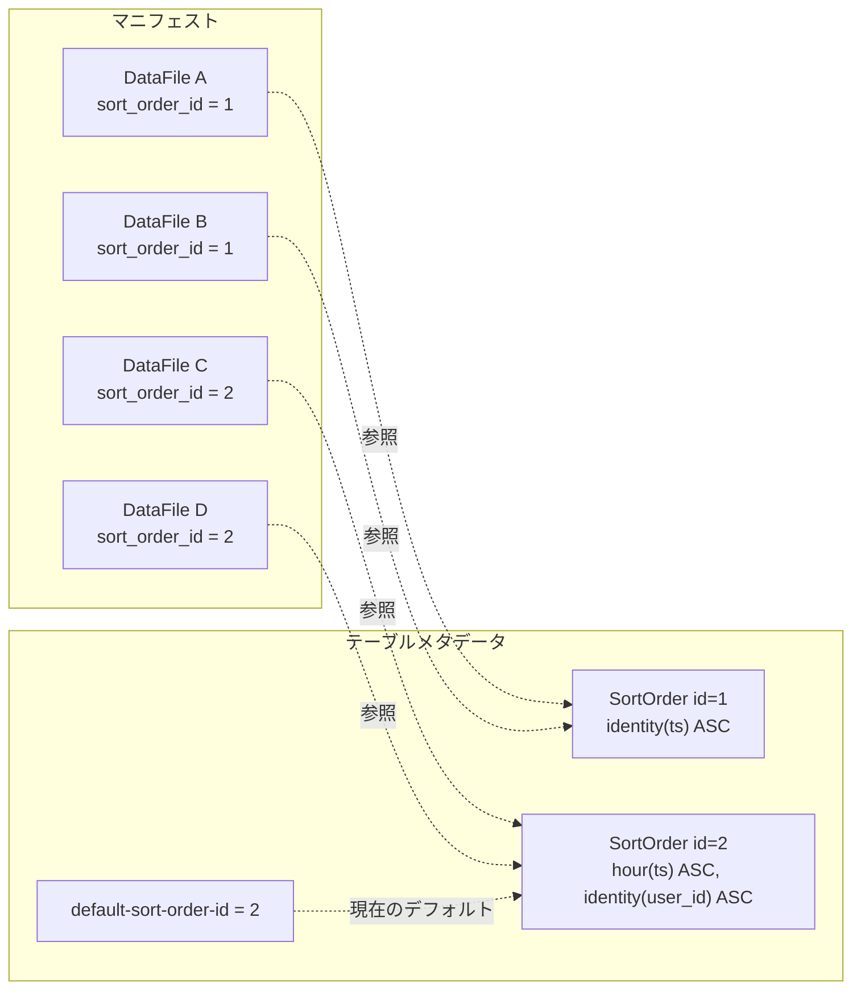

# 第6章 ソート順序

> **本章で読むソース**
>
> - [`api/src/main/java/org/apache/iceberg/SortOrder.java`](https://github.com/apache/iceberg/blob/apache-iceberg-1.11.0/api/src/main/java/org/apache/iceberg/SortOrder.java)
> - [`api/src/main/java/org/apache/iceberg/SortField.java`](https://github.com/apache/iceberg/blob/apache-iceberg-1.11.0/api/src/main/java/org/apache/iceberg/SortField.java)
> - [`api/src/main/java/org/apache/iceberg/NullOrder.java`](https://github.com/apache/iceberg/blob/apache-iceberg-1.11.0/api/src/main/java/org/apache/iceberg/NullOrder.java)
> - [`api/src/main/java/org/apache/iceberg/SortDirection.java`](https://github.com/apache/iceberg/blob/apache-iceberg-1.11.0/api/src/main/java/org/apache/iceberg/SortDirection.java)
> - [`api/src/main/java/org/apache/iceberg/SortOrderBuilder.java`](https://github.com/apache/iceberg/blob/apache-iceberg-1.11.0/api/src/main/java/org/apache/iceberg/SortOrderBuilder.java)
> - [`api/src/main/java/org/apache/iceberg/UnboundSortOrder.java`](https://github.com/apache/iceberg/blob/apache-iceberg-1.11.0/api/src/main/java/org/apache/iceberg/UnboundSortOrder.java)
> - [`core/src/main/java/org/apache/iceberg/SortOrderParser.java`](https://github.com/apache/iceberg/blob/apache-iceberg-1.11.0/core/src/main/java/org/apache/iceberg/SortOrderParser.java)

## この章の狙い

Iceberg の**ソート順序**（Sort Order）は、データファイルや削除ファイル内の行をどの列でどの方向に並べるかをテーブルメタデータとして宣言する仕組みである。
本章では、仕様が定めるソート順序の構造と、参照実装がそれをどのクラス群で表現しているかを読み解く。
あわせて、ソート済みデータがクエリ性能にもたらす効果と、スキーマ進化に安全に追従するための Unbound/Bound 分離の設計を理解する。

## 前提

- 第3章で扱った型システムと、列を一意に識別する「フィールド ID」の概念を理解していること。
- 第5章で扱ったパーティション仕様と「変換関数」（Transform）の概念を理解していること。
- テーブルメタデータに複数のパーティション仕様やスキーマが履歴として保持される仕組み（第2章）を知っていること。

## 仕様が定めるソート順序

Iceberg 仕様（`format/spec.md`）の「Sorting」セクションは、ソート順序を次のように定義している。

> A sort order is defined by a sort order id and a list of sort fields.

ソート順序は **sort order id** と **ソートフィールドのリスト** で構成される。
リスト内のフィールドの並び順がそのままソートの優先順位となる。
各ソートフィールドは以下の 4 要素を持つ。

1. **source column id** : テーブルスキーマ上の列フィールド ID
2. **transform** : ソート値を生成する変換関数（パーティション変換と同じ体系）
3. **direction** : 昇順（`asc`）または降順（`desc`）
4. **null order** : null 値の位置（`nulls-first` または `nulls-last`）

仕様はさらに以下の制約を設けている。

- order id `0` は「ソートなし」（unsorted）に予約される。
- 浮動小数点のソート順は `-NaN < -Infinity < -value < -0 < 0 < value < Infinity < NaN` とし、Java の浮動小数点比較に準拠する。
- データファイルや削除ファイルはマニフェストエントリの `sort_order_id`（フィールド ID 140）でソート順序と関連付けられる。
- テーブルメタデータは `sort-orders`（全ソート順序のリスト）と `default-sort-order-id`（新規書き込みのデフォルト）を保持する。

## SortField : ソートフィールドの表現

仕様が定める 4 要素を Java で表現するのが `SortField` クラスである。

[`api/src/main/java/org/apache/iceberg/SortField.java` L26-L38](https://github.com/apache/iceberg/blob/apache-iceberg-1.11.0/api/src/main/java/org/apache/iceberg/SortField.java#L26-L38)

```java
public class SortField implements Serializable {

  private final Transform<?, ?> transform;
  private final int sourceId;
  private final SortDirection direction;
  private final NullOrder nullOrder;

  SortField(Transform<?, ?> transform, int sourceId, SortDirection direction, NullOrder nullOrder) {
    this.transform = transform;
    this.sourceId = sourceId;
    this.direction = direction;
    this.nullOrder = nullOrder;
  }
```

4 つのフィールドはすべて `final` であり、「SortField」は不変オブジェクトとして設計されている。
`transform` はパーティション仕様と同じ `Transform` インタフェースを再利用する。
変換なしでそのまま列値でソートする場合は `identity` 変換が入る。

### SortDirection と NullOrder

ソート方向と null の位置はそれぞれ列挙型で定義されている。

[`api/src/main/java/org/apache/iceberg/SortDirection.java` L24-L26](https://github.com/apache/iceberg/blob/apache-iceberg-1.11.0/api/src/main/java/org/apache/iceberg/SortDirection.java#L24-L26)

```java
public enum SortDirection {
  ASC,
  DESC;
```

[`api/src/main/java/org/apache/iceberg/NullOrder.java` L21-L23](https://github.com/apache/iceberg/blob/apache-iceberg-1.11.0/api/src/main/java/org/apache/iceberg/NullOrder.java#L21-L23)

```java
public enum NullOrder {
  NULLS_FIRST,
  NULLS_LAST;
```

いずれも値は 2 つだけであり、仕様の `asc`/`desc` と `nulls-first`/`nulls-last` に 1 対 1 で対応する。

### satisfies による順序の包含判定

「SortField」は自分が別の「SortField」の順序要件を満たすかどうかを判定する `satisfies` メソッドを持つ。

[`api/src/main/java/org/apache/iceberg/SortField.java` L73-L83](https://github.com/apache/iceberg/blob/apache-iceberg-1.11.0/api/src/main/java/org/apache/iceberg/SortField.java#L73-L83)

```java
  public boolean satisfies(SortField other) {
    if (Objects.equals(this, other)) {
      return true;
    } else if (sourceId != other.sourceId
        || direction != other.direction
        || nullOrder != other.nullOrder) {
      return false;
    }

    return transform.satisfiesOrderOf(other.transform);
  }
```

列 ID、方向、null 順序が一致した上で、変換関数レベルでの順序包含を `Transform.satisfiesOrderOf` に委譲する。
たとえば `identity` 変換は `hour` 変換の順序を満たす（identity でソート済みなら hour でもソート済みとみなせる）が、逆は成り立たない。
この仕組みにより、より細かい粒度でソートされたデータが粗い粒度の要件を満たすかどうかを型安全に判定できる。

## SortOrder : ソート順序全体の表現

複数の「SortField」をまとめ、order id と紐づけるのが `SortOrder` クラスである。

[`api/src/main/java/org/apache/iceberg/SortOrder.java` L41-L55](https://github.com/apache/iceberg/blob/apache-iceberg-1.11.0/api/src/main/java/org/apache/iceberg/SortOrder.java#L41-L55)

```java
public class SortOrder implements Serializable {
  private static final SortOrder UNSORTED_ORDER =
      new SortOrder(new Schema(), 0, Collections.emptyList());

  private final Schema schema;
  private final int orderId;
  private final SortField[] fields;

  private transient volatile List<SortField> fieldList;

  private SortOrder(Schema schema, int orderId, List<SortField> fields) {
    this.schema = schema;
    this.orderId = orderId;
    this.fields = fields.toArray(new SortField[0]);
  }
```

注目すべき点がいくつかある。

**シングルトンの unsorted 順序。**
`UNSORTED_ORDER` は order id `0` の空フィールドリストで、仕様の「ID 0 は unsorted に予約」に対応する。
`SortOrder.unsorted()` 経由で取得でき、同一インスタンスが再利用される。

**配列とリストの二重保持。**
フィールドは内部的には配列（`SortField[]`）で保持し、`satisfies` や `sameOrder` の比較を配列操作で高速に行う。
一方、外部公開用には `fields()` メソッドで `ImmutableList` を遅延生成する。

[`api/src/main/java/org/apache/iceberg/SortOrder.java` L114-L123](https://github.com/apache/iceberg/blob/apache-iceberg-1.11.0/api/src/main/java/org/apache/iceberg/SortOrder.java#L114-L123)

```java
  private List<SortField> lazyFieldList() {
    if (fieldList == null) {
      synchronized (this) {
        if (fieldList == null) {
          this.fieldList = ImmutableList.copyOf(fields);
        }
      }
    }
    return fieldList;
  }
```

`fieldList` は `transient volatile` であり、Java シリアライゼーションで転送してもデシリアライゼーション後に再生成される。
ダブルチェックロッキングによってスレッドセーフな遅延初期化を実現している。

### ソート順序の satisfies 判定

「SortOrder」レベルの `satisfies` は、先頭フィールドから順に「SortField」の `satisfies` を検証する。

[`api/src/main/java/org/apache/iceberg/SortOrder.java` L88-L102](https://github.com/apache/iceberg/blob/apache-iceberg-1.11.0/api/src/main/java/org/apache/iceberg/SortOrder.java#L88-L102)

```java
  public boolean satisfies(SortOrder anotherSortOrder) {
    // any ordering satisfies an unsorted ordering
    if (anotherSortOrder.isUnsorted()) {
      return true;
    }

    // this ordering cannot satisfy an ordering with more sort fields
    if (anotherSortOrder.fields.length > fields.length) {
      return false;
    }

    // this ordering has either more or the same number of sort fields
    return IntStream.range(0, anotherSortOrder.fields.length)
        .allMatch(index -> fields[index].satisfies(anotherSortOrder.fields[index]));
  }
```

この判定は SQL の「ORDER BY a, b はORDER BY a を満たす」という直感に対応する。
自分のフィールド数が相手以上であり、先頭から相手のフィールド数分だけ各フィールドが `satisfies` を満たせば、全体として相手の順序を満たすと判定する。
unsorted 順序はどのような順序でも満たされる。

### sameOrder による同値判定

`sameOrder` は order id を無視してフィールド配列のみを比較する。

[`api/src/main/java/org/apache/iceberg/SortOrder.java` L110-L112](https://github.com/apache/iceberg/blob/apache-iceberg-1.11.0/api/src/main/java/org/apache/iceberg/SortOrder.java#L110-L112)

```java
  public boolean sameOrder(SortOrder anotherSortOrder) {
    return Arrays.equals(fields, anotherSortOrder.fields);
  }
```

これはソート順序の進化で同じ論理的順序に異なる ID が振られる場合に、実質的に同一かどうかを判定するために使われる。

## クラス構造の全体像

ソート順序に関わるクラス群の関係を以下の図に示す。

```mermaid
classDiagram
    class SortOrder {
        -Schema schema
        -int orderId
        -SortField[] fields
        +fields() List~SortField~
        +isSorted() boolean
        +isUnsorted() boolean
        +satisfies(SortOrder) boolean
        +sameOrder(SortOrder) boolean
        +toUnbound() UnboundSortOrder
        +unsorted()$ SortOrder
        +builderFor(Schema)$ Builder
    }

    class SortField {
        -Transform transform
        -int sourceId
        -SortDirection direction
        -NullOrder nullOrder
        +satisfies(SortField) boolean
    }

    class SortDirection {
        <<enum>>
        ASC
        DESC
    }

    class NullOrder {
        <<enum>>
        NULLS_FIRST
        NULLS_LAST
    }

    class UnboundSortOrder {
        -int orderId
        -List~UnboundSortField~ fields
        +bind(Schema) SortOrder
        +bindUnchecked(Schema) SortOrder
    }

    class SortOrderParser {
        +toJson(SortOrder) String
        +fromJson(Schema, String) SortOrder
        +fromJson(JsonNode) UnboundSortOrder
    }

    class SortOrderBuilder {
        <<interface>>
        +asc(Term, NullOrder) R
        +desc(Term, NullOrder) R
    }

    SortOrder "1" *-- "0..*" SortField
    SortField --> SortDirection
    SortField --> NullOrder
    SortOrder ..> UnboundSortOrder : toUnbound
    UnboundSortOrder ..> SortOrder : bind
    SortOrderParser ..> SortOrder : serialize/deserialize
    SortOrderParser ..> UnboundSortOrder : parse
    SortOrder +-- Builder
    Builder ..|> SortOrderBuilder
```

## Builder によるソート順序の構築

「SortOrder」のコンストラクタは `private` であり、生成は必ず `Builder` を経由する。
`Builder` は `SortOrderBuilder` インタフェースを実装し、流暢な API でフィールドを追加できる。

### SortOrderBuilder インタフェースのデフォルト値

[`api/src/main/java/org/apache/iceberg/SortOrderBuilder.java` L33-L35](https://github.com/apache/iceberg/blob/apache-iceberg-1.11.0/api/src/main/java/org/apache/iceberg/SortOrderBuilder.java#L33-L35)

```java
  default R asc(String name) {
    return asc(Expressions.ref(name), NullOrder.NULLS_FIRST);
  }
```

[`api/src/main/java/org/apache/iceberg/SortOrderBuilder.java` L73-L75](https://github.com/apache/iceberg/blob/apache-iceberg-1.11.0/api/src/main/java/org/apache/iceberg/SortOrderBuilder.java#L73-L75)

```java
  default R desc(String name) {
    return desc(Expressions.ref(name), NullOrder.NULLS_LAST);
  }
```

`asc` のデフォルト null 順序は `NULLS_FIRST`、`desc` のデフォルトは `NULLS_LAST` である。
これは SQL 標準の慣習（ASC では NULL が先頭、DESC では NULL が末尾）に従っている。

### Builder の addSortField : Term のバインドと変換の解決

Builder にフィールドを追加する際、Term（未バインドの列参照や変換式）をスキーマにバインドし、source ID と Transform を確定する。

[`api/src/main/java/org/apache/iceberg/SortOrder.java` L245-L254](https://github.com/apache/iceberg/blob/apache-iceberg-1.11.0/api/src/main/java/org/apache/iceberg/SortOrder.java#L245-L254)

```java
    private Builder addSortField(Term term, SortDirection direction, NullOrder nullOrder) {
      Preconditions.checkArgument(term instanceof UnboundTerm, "Term must be unbound");
      // ValidationException is thrown by bind if binding fails so we assume that boundTerm is
      // correct
      BoundTerm<?> boundTerm = ((UnboundTerm<?>) term).bind(schema.asStruct(), caseSensitive);
      int sourceId = boundTerm.ref().fieldId();
      SortField sortField = new SortField(toTransform(boundTerm), sourceId, direction, nullOrder);
      fields.add(sortField);
      return this;
    }
```

`UnboundTerm` をスキーマ構造体にバインドすることで、列名からフィールド ID への解決が行われる。
バインド後の `BoundTerm` から Transform を抽出する `toTransform` は以下のように動作する。

[`api/src/main/java/org/apache/iceberg/SortOrder.java` L286-L295](https://github.com/apache/iceberg/blob/apache-iceberg-1.11.0/api/src/main/java/org/apache/iceberg/SortOrder.java#L286-L295)

```java
    private Transform<?, ?> toTransform(BoundTerm<?> term) {
      if (term instanceof BoundReference) {
        return Transforms.identity(term.type());
      } else if (term instanceof BoundTransform) {
        return ((BoundTransform<?, ?>) term).transform();
      } else {
        throw new ValidationException(
            "Invalid term: %s, expected either a bound reference or transform", term);
      }
    }
```

単純な列参照（`BoundReference`）の場合は `identity` 変換が自動的に割り当てられる。
変換付きの参照（`BoundTransform`）の場合はその変換がそのまま使われる。
これによって、ユーザーが `asc("ts")` と書いた場合は identity ソートに、`asc(Expressions.hour("ts"))` と書いた場合は hour 変換ソートになる。

### build 時のバリデーション

[`api/src/main/java/org/apache/iceberg/SortOrder.java` L263-L284](https://github.com/apache/iceberg/blob/apache-iceberg-1.11.0/api/src/main/java/org/apache/iceberg/SortOrder.java#L263-L284)

```java
    public SortOrder build() {
      SortOrder sortOrder = buildUnchecked();
      checkCompatibility(sortOrder, schema);
      return sortOrder;
    }

    SortOrder buildUnchecked() {
      if (fields.isEmpty()) {
        if (orderId != null && orderId != 0) {
          throw new IllegalArgumentException("Unsorted order ID must be 0");
        }
        return SortOrder.unsorted();
      }

      if (orderId != null && orderId == 0) {
        throw new IllegalArgumentException("Sort order ID 0 is reserved for unsorted order");
      }

      // default ID to 1 as 0 is reserved for unsorted order
      int actualOrderId = orderId != null ? orderId : 1;
      return new SortOrder(schema, actualOrderId, fields);
    }
```

`build` は `buildUnchecked` で「SortOrder」を生成した後、`checkCompatibility` でスキーマとの整合性を検証する。
`buildUnchecked` 自体は ID 0 の予約ルールを検証する。
フィールドが空なら unsorted シングルトンを返し、フィールドがあるのに ID 0 を指定するとエラーになる。

[`api/src/main/java/org/apache/iceberg/SortOrder.java` L298-L313](https://github.com/apache/iceberg/blob/apache-iceberg-1.11.0/api/src/main/java/org/apache/iceberg/SortOrder.java#L298-L313)

```java
  public static void checkCompatibility(SortOrder sortOrder, Schema schema) {
    for (SortField field : sortOrder.fields) {
      Type sourceType = schema.findType(field.sourceId());
      ValidationException.check(
          sourceType != null, "Cannot find source column for sort field: %s", field);
      ValidationException.check(
          sourceType.isPrimitiveType(),
          "Cannot sort by non-primitive source field: %s",
          sourceType);
      ValidationException.check(
          field.transform().canTransform(sourceType),
          "Invalid source type %s for transform: %s",
          sourceType,
          field.transform());
    }
  }
```

`checkCompatibility` は 3 つの条件を検証する。

1. ソース列がスキーマに存在すること
2. ソース列がプリミティブ型であること（構造体やリストではソートできない）
3. 指定された変換がそのソース型に適用可能であること（`canTransform`）

この検証は静的に行われるため、不正なソート順序がメタデータに永続化されることを防ぐ。

## Unbound/Bound 分離の設計

ソート順序には「バインド済み」の `SortOrder` と「未バインド」の `UnboundSortOrder` の 2 つの表現がある。
この分離は、パーティション仕様の Unbound/Bound 分離と同じ設計方針に従っている。

### なぜ分離が必要か

ソート順序が JSON として永続化されるとき、フィールドの参照先はフィールド ID と変換名の文字列である。
これを読み込む際、スキーマがまだ利用可能でない、またはスキーマ進化で列が削除済みの場合がある。
そのような状況でもメタデータの読み込み自体は成功させる必要がある。

`UnboundSortOrder` は Transform を文字列として保持し、スキーマへのバインドを遅延させる。

[`api/src/main/java/org/apache/iceberg/UnboundSortOrder.java` L124-L136](https://github.com/apache/iceberg/blob/apache-iceberg-1.11.0/api/src/main/java/org/apache/iceberg/UnboundSortOrder.java#L124-L136)

```java
  static class UnboundSortField {
    private final Transform<?, ?> transform;
    private final int sourceId;
    private final SortDirection direction;
    private final NullOrder nullOrder;

    private UnboundSortField(
        String transformAsString, int sourceId, SortDirection direction, NullOrder nullOrder) {
      this.transform = Transforms.fromString(transformAsString);
      this.sourceId = sourceId;
      this.direction = direction;
      this.nullOrder = nullOrder;
    }
```

`UnboundSortField` のコンストラクタは変換名の文字列を受け取り、`Transforms.fromString` で型非依存の Transform オブジェクトを生成する。
この時点ではソース列の型情報がないため、Transform はまだソース型にバインドされていない。

### bind と bindUnchecked

`UnboundSortOrder` は 2 つのバインドメソッドを提供する。

[`api/src/main/java/org/apache/iceberg/UnboundSortOrder.java` L40-L65](https://github.com/apache/iceberg/blob/apache-iceberg-1.11.0/api/src/main/java/org/apache/iceberg/UnboundSortOrder.java#L40-L65)

```java
  public SortOrder bind(Schema schema) {
    SortOrder.Builder builder = SortOrder.builderFor(schema).withOrderId(orderId);

    for (UnboundSortField field : fields) {
      Type sourceType = schema.findType(field.sourceId);
      Transform<?, ?> transform;
      if (sourceType != null) {
        transform = Transforms.fromString(sourceType, field.transform.toString());
      } else {
        transform = field.transform;
      }
      builder.addSortField(transform, field.sourceId, field.direction, field.nullOrder);
    }

    return builder.build();
  }

  SortOrder bindUnchecked(Schema schema) {
    SortOrder.Builder builder = SortOrder.builderFor(schema).withOrderId(orderId);

    for (UnboundSortField field : fields) {
      builder.addSortField(field.transform, field.sourceId, field.direction, field.nullOrder);
    }

    return builder.buildUnchecked();
  }
```

`bind` はスキーマからソース列の型を探し、型情報付きで Transform を再構築した後、`builder.build()` で完全なバリデーションを行う。
`bindUnchecked` はバリデーションをスキップし、`buildUnchecked()` で生成する。

この使い分けは `SortOrderParser.fromJson` で活用されている。

[`core/src/main/java/org/apache/iceberg/SortOrderParser.java` L115-L123](https://github.com/apache/iceberg/blob/apache-iceberg-1.11.0/core/src/main/java/org/apache/iceberg/SortOrderParser.java#L115-L123)

```java
  public static SortOrder fromJson(Schema schema, JsonNode json, int defaultSortOrderId) {
    UnboundSortOrder unboundSortOrder = fromJson(json);

    if (unboundSortOrder.orderId() == defaultSortOrderId) {
      return unboundSortOrder.bind(schema);
    } else {
      return unboundSortOrder.bindUnchecked(schema);
    }
  }
```

デフォルトのソート順序（現在アクティブな順序）はバリデーション付きでバインドする。
履歴として残っている古いソート順序は、スキーマ進化で列が削除されている可能性があるため、バリデーションなしでバインドする。
この設計によって、テーブルメタデータの読み込み時に過去のソート順序がバリデーションエラーで読み込めなくなる問題を回避している。



## ソート順序の JSON 表現

`SortOrderParser` はソート順序と JSON の相互変換を担う。

### シリアライゼーション

[`core/src/main/java/org/apache/iceberg/SortOrderParser.java` L42-L48](https://github.com/apache/iceberg/blob/apache-iceberg-1.11.0/core/src/main/java/org/apache/iceberg/SortOrderParser.java#L42-L48)

```java
  public static void toJson(SortOrder sortOrder, JsonGenerator generator) throws IOException {
    generator.writeStartObject();
    generator.writeNumberField(ORDER_ID, sortOrder.orderId());
    generator.writeFieldName(FIELDS);
    toJsonFields(sortOrder, generator);
    generator.writeEndObject();
  }
```

トップレベルオブジェクトには `order-id` と `fields` の 2 つのキーが出力される。
各フィールドの出力は以下の通りである。

[`core/src/main/java/org/apache/iceberg/SortOrderParser.java` L66-L78](https://github.com/apache/iceberg/blob/apache-iceberg-1.11.0/core/src/main/java/org/apache/iceberg/SortOrderParser.java#L66-L78)

```java
  private static void toJsonFields(SortOrder sortOrder, JsonGenerator generator)
      throws IOException {
    generator.writeStartArray();
    for (SortField field : sortOrder.fields()) {
      generator.writeStartObject();
      generator.writeStringField(TRANSFORM, field.transform().toString());
      generator.writeNumberField(SOURCE_ID, field.sourceId());
      generator.writeStringField(DIRECTION, toJson(field.direction()));
      generator.writeStringField(NULL_ORDER, toJson(field.nullOrder()));
      generator.writeEndObject();
    }
    generator.writeEndArray();
  }
```

各フィールドは `transform`、`source-id`、`direction`、`null-order` の 4 つのキーを持つオブジェクトとして出力される。

生成される JSON は以下のような形式になる。

```json
{
  "order-id": 1,
  "fields": [
    {
      "transform": "identity",
      "source-id": 2,
      "direction": "asc",
      "null-order": "nulls-first"
    },
    {
      "transform": "bucket[4]",
      "source-id": 3,
      "direction": "desc",
      "null-order": "nulls-last"
    }
  ]
}
```

### デシリアライゼーション

JSON からの復元は、まず `UnboundSortOrder` を生成し、必要に応じてスキーマにバインドする 2 段階で行われる。

[`core/src/main/java/org/apache/iceberg/SortOrderParser.java` L133-L140](https://github.com/apache/iceberg/blob/apache-iceberg-1.11.0/core/src/main/java/org/apache/iceberg/SortOrderParser.java#L133-L140)

```java
  public static UnboundSortOrder fromJson(JsonNode json) {
    Preconditions.checkArgument(
        json.isObject(), "Cannot parse sort order from non-object: %s", json);
    int orderId = JsonUtil.getInt(ORDER_ID, json);
    UnboundSortOrder.Builder builder = UnboundSortOrder.builder().withOrderId(orderId);
    buildFromJsonFields(builder, JsonUtil.get(FIELDS, json));
    return builder.build();
  }
```

`buildFromJsonFields` は `fields` 配列を走査し、各要素から `transform`（文字列）、`source-id`（整数）、`direction`（文字列）、`null-order`（文字列）を読み取って Builder に追加する。

[`core/src/main/java/org/apache/iceberg/SortOrderParser.java` L142-L164](https://github.com/apache/iceberg/blob/apache-iceberg-1.11.0/core/src/main/java/org/apache/iceberg/SortOrderParser.java#L142-L164)

```java
  private static void buildFromJsonFields(UnboundSortOrder.Builder builder, JsonNode json) {
    Preconditions.checkArgument(json != null, "Cannot parse null sort order fields");
    Preconditions.checkArgument(
        json.isArray(), "Cannot parse sort order fields, not an array: %s", json);

    Iterator<JsonNode> elements = json.elements();
    while (elements.hasNext()) {
      JsonNode element = elements.next();
      Preconditions.checkArgument(
          element.isObject(), "Cannot parse sort field, not an object: %s", element);

      String transform = JsonUtil.getString(TRANSFORM, element);
      int sourceId = JsonUtil.getInt(SOURCE_ID, element);

      String directionAsString = JsonUtil.getString(DIRECTION, element);
      SortDirection direction = SortDirection.fromString(directionAsString);

      String nullOrderingAsString = JsonUtil.getString(NULL_ORDER, element);
      NullOrder nullOrder = toNullOrder(nullOrderingAsString);

      builder.addSortField(transform, sourceId, direction, nullOrder);
    }
  }
```

## sort-order-id とメタデータの関係

ソート順序がテーブルメタデータやマニフェストでどのように参照されるかを整理する。

### テーブルメタデータでの位置

テーブルメタデータは `sort-orders` と `default-sort-order-id` の 2 つのフィールドでソート順序を管理する。
仕様ではフォーマットバージョン 2 以降で必須とされている。

| フィールド | 意味 |
|-----------|------|
| `sort-orders` | テーブルがこれまでに使用した全ソート順序のリスト |
| `default-sort-order-id` | ライターが新規データの書き込み時に使うべきデフォルト順序の ID |

パーティション仕様と同じパターンで、過去に使われたソート順序はすべて保持される。
これは古いデータファイルが参照するソート順序を後から引けるようにするためである。

### マニフェストエントリでの参照

各データファイルや削除ファイルのマニフェストエントリには `sort_order_id`（フィールド ID 140）が記録される。
仕様は以下のルールを定めている。

- `sort_order_id` が欠落または不明な場合、そのファイルは unsorted とみなされる。
- データファイルと等値削除ファイルのみが非 null の order id を設定すべきである。
- 位置削除ファイルは file と position でソートされるべきであり、テーブルのソート順序ではないため、order id は null にすべきである。

この設計により、各データファイルがどの順序でソートされているかを個別に追跡できる。
テーブルのデフォルトソート順序が変更されても、過去のデータファイルは元のソート順序 ID を保持し続ける。



## 設計上の工夫 : 変換の再利用による統一的なデータ配置

ソート順序の設計で最も注目すべき工夫は、パーティション仕様と同じ Transform 体系をソートフィールドにも再利用している点である。

パーティション仕様では `hour(ts)` のような変換でデータを物理的にディレクトリ分割する。
ソート順序でも同じ `hour(ts)` を使って、パーティション内のデータを時間単位でまとめて配置できる。
さらに `identity(user_id)` を第 2 ソートキーにすれば、同一時間帯内でユーザー ID 順に並ぶ。

この統一により、パーティショニングとソートを組み合わせたデータ配置の宣言が、仕様レベルで一貫した語彙で記述できる。
クエリエンジンはパーティションプルーニングでファイルを絞り込んだ後、ソート順序の情報を使ってファイル内のスキャンをさらに効率化できる。
たとえば、`WHERE ts > '2024-01-01'` というフィルタに対し、identity(ts) ASC でソート済みのファイルであれば、条件を満たさない先頭行群を読み飛ばせる。

ソート済みデータには以下の性能上の利点がある。

- **ファイル内のスキップ**: Parquet の行グループや ORC のストライプに対する min/max 統計が偏りなく効くため、不要な行グループの読み飛ばしが効果的になる。ランダム配置のデータでは行グループごとに min/max の範囲が重複しやすいが、ソート済みでは範囲が分離する。
- **圧縮率の向上**: 同じ値や近い値が連続するため、辞書エンコーディングやランレングスエンコーディングの効率が上がり、ファイルサイズが小さくなる。
- **マージ操作の効率化**: コンパクション時にソート済みファイル同士をマージソートできるため、全件再ソートと比べて計算コストが低い。

## まとめ

- **ソート順序**はテーブルメタデータとしてデータファイル内の行の並び順を宣言する仕組みであり、`SortOrder`（order id とフィールドリスト）と `SortField`（transform、source id、direction、null order）で構成される。
- order id `0` は unsorted に予約され、シングルトンの `UNSORTED_ORDER` で表現される。
- `SortField.satisfies` と `SortOrder.satisfies` により、あるソート順序が別の順序の要件を満たすかを判定できる。Transform レベルの順序包含も考慮される。
- `UnboundSortOrder` と `SortOrder` の Unbound/Bound 分離によって、スキーマ進化で列が削除された古いソート順序もメタデータから安全に読み込める。デフォルト順序のみバリデーション付きでバインドし、履歴順序はバリデーションを省略する。
- JSON 表現は `SortOrderParser` が担い、デシリアライゼーションは一度 `UnboundSortOrder` を経由する 2 段階で行われる。
- パーティション変換と同じ Transform 体系を再利用することで、パーティショニングとソートを統一的な語彙で宣言でき、クエリ性能の最適化（行グループスキップ、圧縮率向上、マージ効率化）を可能にする。

## 関連する章

- [第5章 パーティション仕様と変換関数](05-partition-spec.md) : ソート順序が再利用する Transform 体系の詳細
- [第2章 テーブルメタデータとフォーマットバージョン](../part00-overview/02-table-metadata.md) : `sort-orders` と `default-sort-order-id` が格納されるメタデータ構造
- [第8章 マニフェストファイル](../part03-snapshot/08-manifest-file.md) : `sort_order_id` が記録されるマニフェストエントリの構造
- [第12章 コンパクションとファイルリライト](../part04-data-operations/12-compaction-and-rewrite.md) : ソート済みデータのマージとリライト
