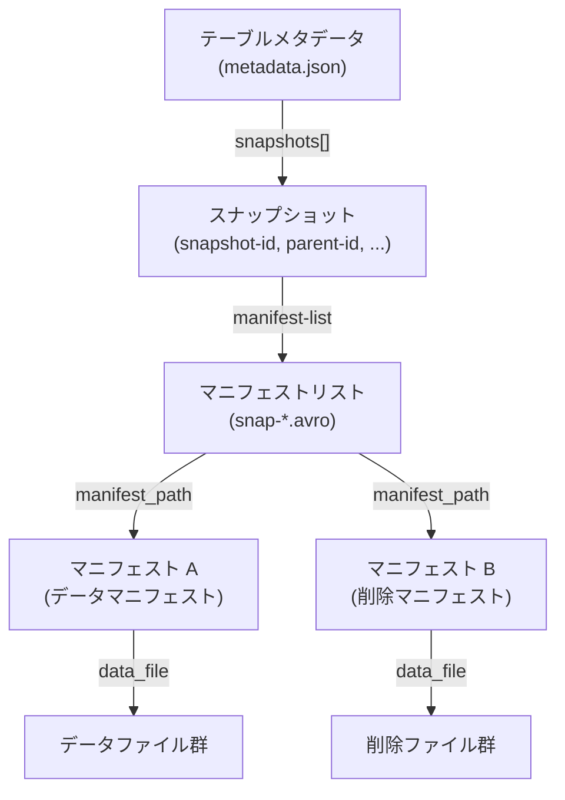
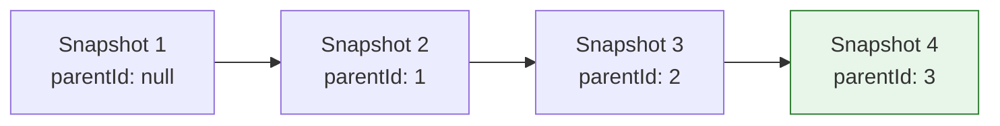
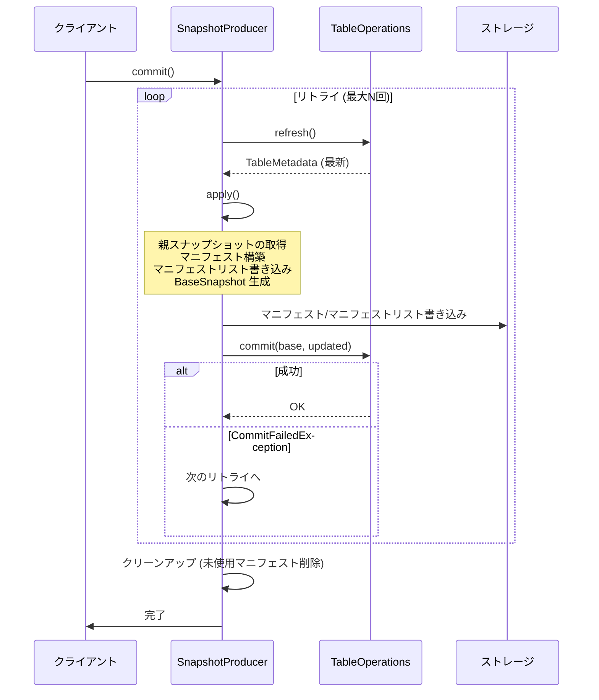

# 第7章 スナップショットモデル

> **本章で読むソース**
>
> - [`api/src/main/java/org/apache/iceberg/Snapshot.java`](https://github.com/apache/iceberg/blob/apache-iceberg-1.11.0/api/src/main/java/org/apache/iceberg/Snapshot.java)
> - [`core/src/main/java/org/apache/iceberg/BaseSnapshot.java`](https://github.com/apache/iceberg/blob/apache-iceberg-1.11.0/core/src/main/java/org/apache/iceberg/BaseSnapshot.java)
> - [`core/src/main/java/org/apache/iceberg/SnapshotProducer.java`](https://github.com/apache/iceberg/blob/apache-iceberg-1.11.0/core/src/main/java/org/apache/iceberg/SnapshotProducer.java)
> - [`api/src/main/java/org/apache/iceberg/ManageSnapshots.java`](https://github.com/apache/iceberg/blob/apache-iceberg-1.11.0/api/src/main/java/org/apache/iceberg/ManageSnapshots.java)

## この章の狙い

**スナップショット**はテーブルのある時点における不変な状態を表す。
Iceberg のすべての読み書き操作はスナップショットを起点に動く。
本章では、仕様が定めるスナップショットの構造、参照実装の `Snapshot` インタフェースと `BaseSnapshot` の設計、`SnapshotProducer` による新スナップショット生成フロー、そしてチェリーピックとロールバックによるスナップショット系譜の操作を読み解く。

## 前提

- 第2章で扱ったテーブルメタデータの構造を理解していること。
- マニフェストリストとマニフェストファイルの概念を知っていること（第2章で概要を扱っている）。
- 楽観的並行制御（Optimistic Concurrency Control）の基本を知っていること。

## 仕様が定めるスナップショット

Iceberg 仕様（`format/spec.md`）はスナップショットを次のように定義している。

> A snapshot represents the state of a table at some time and is used to access the complete set of data files in the table.

スナップショットは以下のフィールドで構成される。

| フィールド | v1 | v2/v3 | 説明 |
|---|---|---|---|
| `snapshot-id` | 必須 | 必須 | 一意な long 型 ID |
| `parent-snapshot-id` | 任意 | 任意 | 親スナップショットの ID |
| `sequence-number` | なし | 必須 | コミット順序を追跡する単調増加の long 値 |
| `timestamp-ms` | 必須 | 必須 | 作成時刻（GC とテーブル検査に使用） |
| `manifest-list` | 任意 | 必須 | マニフェストリストファイルの場所 |
| `summary` | 任意 | 必須 | 操作の要約（`operation` フィールドを含む） |
| `schema-id` | 任意 | 任意 | スナップショット作成時のスキーマ ID |

v2 からは `manifest-list` と `summary` が必須になった。
`summary` には `operation` フィールドが含まれ、そのスナップショットを生成した操作の種類を記録する。

## 操作の種類（DataOperations）

仕様は 4 種類の操作を定義している。
参照実装では `DataOperations` クラスが定数として宣言する。

[`api/src/main/java/org/apache/iceberg/DataOperations.java` L28-L38](https://github.com/apache/iceberg/blob/apache-iceberg-1.11.0/api/src/main/java/org/apache/iceberg/DataOperations.java#L28-L38)

```java
public class DataOperations {
  private DataOperations() {}

  /**
   * New data is appended to the table and no data is removed or deleted.
   *
   * <p>This operation is implemented by {@link AppendFiles}.
   */
  public static final String APPEND = "append";

  /**
```

各定数の意味は次のとおりである。

| 操作 | 意味 | 実装クラス例 |
|---|---|---|
| `append` | データファイルの追加のみ、削除なし | `AppendFiles` |
| `replace` | ファイルの置換（コンパクション等）、論理的なデータ変更なし | `RewriteFiles` |
| `overwrite` | 既存データを上書きするデータ追加と削除 | `OverwriteFiles`, `ReplacePartitions` |
| `delete` | データの論理削除、または削除ファイルの追加 | `DeleteFiles` |

操作の種類はスナップショットの期限切れ処理で活用される。
たとえば `append` 操作のスナップショットには削除されたファイルが存在しないため、ファイル削除のクリーンアップをスキップできる。

## Snapshot インタフェース

参照実装の `Snapshot` インタフェースは仕様のフィールドを Java のメソッドとして宣言する。

[`api/src/main/java/org/apache/iceberg/Snapshot.java` L34-L41](https://github.com/apache/iceberg/blob/apache-iceberg-1.11.0/api/src/main/java/org/apache/iceberg/Snapshot.java#L34-L41)

```java
public interface Snapshot extends Serializable {
  /**
   * Return this snapshot's sequence number.
   *
   * <p>Sequence numbers are assigned when a snapshot is committed.
   *
   * @return a long sequence number
   */
```

`Serializable` を実装する設計により、Spark や Flink などのエンジンがスナップショット情報をシリアライズしてワーカーノードへ転送できる。

### マニフェストファイルの取得

スナップショットはマニフェストファイルへのアクセスを 3 つのメソッドで提供する。

[`api/src/main/java/org/apache/iceberg/Snapshot.java` L73-L77](https://github.com/apache/iceberg/blob/apache-iceberg-1.11.0/api/src/main/java/org/apache/iceberg/Snapshot.java#L73-L77)

```java
  List<ManifestFile> allManifests(FileIO io);

  /**
   * Return a {@link ManifestFile} for each data manifest in this snapshot.
   *
```

すべてのメソッドは `FileIO` を引数に取る。
これはスナップショット自体がストレージへの参照を保持せず、呼び出し側が読み取り手段を注入する設計である。
この分離により、「Snapshot」はストレージ実装に依存せず純粋なメタデータとして機能する。

### データファイルの変更追跡

スナップショットは、そのスナップショットで追加または削除されたデータファイルと削除ファイルを返すメソッドを持つ。

[`api/src/main/java/org/apache/iceberg/Snapshot.java` L117-L132](https://github.com/apache/iceberg/blob/apache-iceberg-1.11.0/api/src/main/java/org/apache/iceberg/Snapshot.java#L117-L132)

```java
  @Deprecated
  Iterable<DataFile> addedDataFiles(FileIO io);

  // ... (中略) ...

  @Deprecated
  Iterable<DataFile> removedDataFiles(FileIO io);
```

これらのメソッドは 2.0.0 で `SnapshotChanges` に移行予定として `@Deprecated` が付与されている。

### manifestListLocation

[`api/src/main/java/org/apache/iceberg/Snapshot.java` L171-L171](https://github.com/apache/iceberg/blob/apache-iceberg-1.11.0/api/src/main/java/org/apache/iceberg/Snapshot.java#L171-L171)

```java
  String manifestListLocation();
```

「マニフェストリスト」ファイルの場所を返す。
v2 以降では必須フィールドであり、スナップショットからマニフェスト群を辿る起点となる。

## スナップショットの階層構造

仕様の構造をまとめると、スナップショットは次の階層でテーブルの状態を表現する。



テーブルメタデータはスナップショットのリストを保持し、各スナップショットはマニフェストリストを指す。
マニフェストリストは複数のマニフェストファイルを列挙し、各マニフェストがデータファイルまたは削除ファイルの集合を管理する。
スナップショットが参照するすべてのマニフェストに含まれるデータファイルの和集合が、そのスナップショットにおけるテーブルの完全な状態となる。

## BaseSnapshot : Snapshot の実装

`BaseSnapshot` は `Snapshot` インタフェースの参照実装である。

### フィールド構成

[`core/src/main/java/org/apache/iceberg/BaseSnapshot.java` L36-L57](https://github.com/apache/iceberg/blob/apache-iceberg-1.11.0/core/src/main/java/org/apache/iceberg/BaseSnapshot.java#L36-L57)

```java
class BaseSnapshot implements Snapshot {
  private final long snapshotId;
  private final Long parentId;
  private final long sequenceNumber;
  private final long timestampMillis;
  private final String manifestListLocation;
  private final String operation;
  private final Map<String, String> summary;
  private final Integer schemaId;
  private final String[] v1ManifestLocations;
  private final Long firstRowId;
  private final Long addedRows;
  private final String keyId;

  // lazily initialized
  private transient List<ManifestFile> allManifests = null;
  private transient List<ManifestFile> dataManifests = null;
  private transient List<ManifestFile> deleteManifests = null;
  private transient List<DataFile> addedDataFiles = null;
  private transient List<DataFile> removedDataFiles = null;
  private transient List<DeleteFile> addedDeleteFiles = null;
  private transient List<DeleteFile> removedDeleteFiles = null;
```

設計上の重要な点は 2 つある。

1. 仕様のフィールドに対応する値はすべて `final` で宣言され、コンストラクタで確定する。スナップショットの不変性はこの設計で保証される。
2. マニフェストやファイル変更のリストは `transient` かつ初期値 `null` で宣言される。シリアライズ時にこれらは転送されず、必要になった時点で遅延ロードされる。

### v1 互換のコンストラクタ

「BaseSnapshot」は 2 つのコンストラクタを持つ。

[`core/src/main/java/org/apache/iceberg/BaseSnapshot.java` L59-L94](https://github.com/apache/iceberg/blob/apache-iceberg-1.11.0/core/src/main/java/org/apache/iceberg/BaseSnapshot.java#L59-L94)

```java
  BaseSnapshot(
      long sequenceNumber,
      long snapshotId,
      Long parentId,
      long timestampMillis,
      String operation,
      Map<String, String> summary,
      Integer schemaId,
      String manifestList,
      Long firstRowId,
      Long addedRows,
      String keyId) {
    // ... (中略) ...
    this.manifestListLocation = manifestList;
    this.v1ManifestLocations = null;
    // ... (中略) ...
  }
```

[`core/src/main/java/org/apache/iceberg/BaseSnapshot.java` L96-L117](https://github.com/apache/iceberg/blob/apache-iceberg-1.11.0/core/src/main/java/org/apache/iceberg/BaseSnapshot.java#L96-L117)

```java
  BaseSnapshot(
      long sequenceNumber,
      long snapshotId,
      Long parentId,
      long timestampMillis,
      String operation,
      Map<String, String> summary,
      Integer schemaId,
      String[] v1ManifestLocations) {
    // ... (中略) ...
    this.manifestListLocation = null;
    this.v1ManifestLocations = v1ManifestLocations;
    // ... (中略) ...
  }
```

1 つ目のコンストラクタは v2 以降で使用され、`manifestList`（マニフェストリストの場所）を受け取る。
2 つ目は v1 互換用であり、マニフェストファイルの場所を文字列配列（`v1ManifestLocations`）として直接受け取る。
v1 ではマニフェストリストが任意フィールドだったため、マニフェストの場所をスナップショット内に直接保持する場合があった。

### 遅延ロードによるマニフェストキャッシュ

「BaseSnapshot」の `cacheManifests` メソッドが、遅延ロードの中核を担う。

[`core/src/main/java/org/apache/iceberg/BaseSnapshot.java` L169-L200](https://github.com/apache/iceberg/blob/apache-iceberg-1.11.0/core/src/main/java/org/apache/iceberg/BaseSnapshot.java#L169-L200)

```java
  private void cacheManifests(FileIO fileIO) {
    if (fileIO == null) {
      throw new IllegalArgumentException("Cannot cache changes: FileIO is null");
    }

    if (allManifests == null && v1ManifestLocations != null) {
      // if we have a collection of manifest locations, then we need to load them here
      allManifests =
          Lists.transform(
              Arrays.asList(v1ManifestLocations),
              location ->
                  new GenericManifestFile(fileIO.newInputFile(location), 0, this.snapshotId));
    }

    if (allManifests == null) {
      // if manifests isn't set, then the snapshotFile is set and should be read to get the list
      this.allManifests =
          ManifestLists.read(
              fileIO.newInputFile(new BaseManifestListFile(manifestListLocation, keyId)));
    }

    if (dataManifests == null || deleteManifests == null) {
      this.dataManifests =
          ImmutableList.copyOf(
              Iterables.filter(
                  allManifests, manifest -> manifest.content() == ManifestContent.DATA));
      this.deleteManifests =
          ImmutableList.copyOf(
              Iterables.filter(
                  allManifests, manifest -> manifest.content() == ManifestContent.DELETES));
    }
  }
```

処理は 3 段階で進む。

1. v1 互換パス: `v1ManifestLocations` が存在する場合、各場所を `GenericManifestFile` に変換して `allManifests` にセットする。
2. v2 パス: `manifestListLocation` からマニフェストリストファイルを読み込み、マニフェスト一覧を取得する。
3. フィルタリング: 全マニフェストを `ManifestContent.DATA`（データマニフェスト）と `ManifestContent.DELETES`（削除マニフェスト）に分類する。

この遅延ロード設計により、スナップショットの一覧取得など、マニフェストの内容まで読む必要のない操作ではストレージ I/O を発生させずに済む。

### データファイル変更のキャッシュ

追加/削除されたデータファイルも同様に遅延ロードされる。

[`core/src/main/java/org/apache/iceberg/BaseSnapshot.java` L297-L328](https://github.com/apache/iceberg/blob/apache-iceberg-1.11.0/core/src/main/java/org/apache/iceberg/BaseSnapshot.java#L297-L328)

```java
  private void cacheDataFileChanges(FileIO fileIO) {
    Preconditions.checkArgument(fileIO != null, "Cannot cache data file changes: FileIO is null");

    ImmutableList.Builder<DataFile> adds = ImmutableList.builder();
    ImmutableList.Builder<DataFile> deletes = ImmutableList.builder();

    // read only manifests that were created by this snapshot
    Iterable<ManifestFile> changedManifests =
        Iterables.filter(
            dataManifests(fileIO), manifest -> Objects.equal(manifest.snapshotId(), snapshotId));
    // ... (中略) ...
  }
```

このメソッドの設計には重要な最適化がある。
全マニフェストを走査するのではなく、`manifest.snapshotId() == snapshotId` でフィルタリングし、そのスナップショットで作成されたマニフェストだけを読む。
スナップショットは前のスナップショットのマニフェストを再利用するため、変更がないマニフェストを読み飛ばすことで I/O コストを大幅に削減する。

## スナップショットの系譜

スナップショットは `parentId()` で親スナップショットを参照し、単方向リンクリストの系譜を形成する。



最初のスナップショットの `parentId` は `null` となる。
以降のスナップショットは必ず 1 つの親を持ち、テーブルの変更履歴を時系列で辿ることができる。

この系譜は増分読み取り（incremental read）で活用される。
2 つのスナップショット間の差分は、その区間に存在するスナップショットの変更を合成して得られる。

## SnapshotProducer : 新スナップショットの生成

`SnapshotProducer` はスナップショットを生成するすべての操作（append, overwrite, delete, replace）の基底クラスである。

[`core/src/main/java/org/apache/iceberg/SnapshotProducer.java` L91-L91](https://github.com/apache/iceberg/blob/apache-iceberg-1.11.0/core/src/main/java/org/apache/iceberg/SnapshotProducer.java#L91-L91)

```java
abstract class SnapshotProducer<ThisT> implements SnapshotUpdate<ThisT> {
```

Curiously Recurring Template Pattern（CRTP）を使い、サブクラスが自身の型を `ThisT` として渡す。
これによりメソッドチェーンの戻り値型が具象クラスとなり、型安全なビルダーパターンを実現する。

### apply メソッド : スナップショットの組み立て

`apply()` メソッドが新しい「スナップショット」を組み立てる。

[`core/src/main/java/org/apache/iceberg/SnapshotProducer.java` L271-L348](https://github.com/apache/iceberg/blob/apache-iceberg-1.11.0/core/src/main/java/org/apache/iceberg/SnapshotProducer.java#L271-L348)

```java
  @Override
  public Snapshot apply() {
    refresh();
    Snapshot parentSnapshot = SnapshotUtil.latestSnapshot(base, targetBranch);

    long sequenceNumber = base.nextSequenceNumber();
    Long parentSnapshotId = parentSnapshot == null ? null : parentSnapshot.snapshotId();

    runValidations(parentSnapshot);

    List<ManifestFile> manifests = apply(base, parentSnapshot);

    OutputFile manifestList = manifestListPath();

    ManifestListWriter writer =
        ManifestLists.write(
            ops.current().formatVersion(),
            manifestList,
            ops.encryption(),
            snapshotId(),
            parentSnapshotId,
            sequenceNumber,
            base.nextRowId());

    try (writer) {
      // keep track of the manifest lists created
      manifestLists.add(manifestList.location());

      ManifestFile[] manifestFiles = new ManifestFile[manifests.size()];

      Tasks.range(manifestFiles.length)
          .stopOnFailure()
          .throwFailureWhenFinished()
          .executeWith(workerPool())
          .run(index -> manifestFiles[index] = manifestsWithMetadata.get(manifests.get(index)));

      writer.addAll(Arrays.asList(manifestFiles));
    } catch (IOException e) {
      throw new RuntimeIOException(e, "Failed to write manifest list file");
    }

    // ... (中略) ...

    return new BaseSnapshot(
        sequenceNumber,
        snapshotId(),
        parentSnapshotId,
        System.currentTimeMillis(),
        operation(),
        summary(base),
        base.currentSchemaId(),
        manifestList.location(),
        nextRowId,
        assignedRows,
        writer.toManifestListFile().encryptionKeyID());
  }
```

処理の流れは以下のとおりである。

1. `refresh()` でテーブルメタデータを最新の状態に更新する。
2. 対象ブランチ（デフォルトは `main`）の最新スナップショットを親として取得する。
3. `runValidations()` でバリデーションを実行する。
4. サブクラスが実装する `apply(base, parentSnapshot)` を呼び出し、新しいマニフェストリストを構築する。
5. マニフェストリストファイルを書き出す。マニフェストのメタデータ付与はワーカープールで並列に行われる。
6. 最終的に `BaseSnapshot` を生成して返す。

### シーケンス番号の楽観的割り当て

仕様は次のように述べている。

> When a snapshot is created for a commit, it is optimistically assigned the next sequence number, and it is written into the snapshot's metadata.

`apply()` メソッドの L276 で `base.nextSequenceNumber()` を取得している。
この時点ではまだコミットが成功したかどうかはわからない。
もしコミットが競合で失敗した場合、リトライ時に `refresh()` で最新のメタデータを取得し、新しいシーケンス番号が割り当てられる。
この楽観的な割り当て戦略により、マニフェストファイルへのシーケンス番号の書き込みを「コミット成功を待たずに」行える。

### commit メソッド : リトライ付きコミット

[`core/src/main/java/org/apache/iceberg/SnapshotProducer.java` L457-L543](https://github.com/apache/iceberg/blob/apache-iceberg-1.11.0/core/src/main/java/org/apache/iceberg/SnapshotProducer.java#L457-L543)

```java
  @Override
  @SuppressWarnings("checkstyle:CyclomaticComplexity")
  public void commit() {
    // this is always set to the latest commit attempt's snapshot id.
    AtomicLong newSnapshotId = new AtomicLong(-1L);
    try (Timed ignore = commitMetrics().totalDuration().start()) {
      try {
        Tasks.foreach(ops)
            .retry(base.propertyAsInt(COMMIT_NUM_RETRIES, COMMIT_NUM_RETRIES_DEFAULT))
            .exponentialBackoff(
                base.propertyAsInt(COMMIT_MIN_RETRY_WAIT_MS, COMMIT_MIN_RETRY_WAIT_MS_DEFAULT),
                base.propertyAsInt(COMMIT_MAX_RETRY_WAIT_MS, COMMIT_MAX_RETRY_WAIT_MS_DEFAULT),
                base.propertyAsInt(COMMIT_TOTAL_RETRY_TIME_MS, COMMIT_TOTAL_RETRY_TIME_MS_DEFAULT),
                2.0 /* exponential */)
            .onlyRetryOn(CommitFailedException.class)
            .countAttempts(commitMetrics().attempts())
            .run(
                taskOps -> {
                  Snapshot newSnapshot = apply();
                  newSnapshotId.set(newSnapshot.snapshotId());
                  TableMetadata.Builder update = TableMetadata.buildFrom(base);
                  if (base.snapshot(newSnapshot.snapshotId()) != null) {
                    // this is a rollback operation
                    update.setBranchSnapshot(newSnapshot.snapshotId(), targetBranch);
                  } else if (stageOnly) {
                    update.addSnapshot(newSnapshot);
                  } else {
                    update.setBranchSnapshot(newSnapshot, targetBranch);
                  }

                  TableMetadata updated = update.build();
                  if (updated.changes().isEmpty()) {
                    return;
                  }

                  taskOps.commit(base, updated.withUUID());
                });
      // ... (中略) ...
    }
```

コミット処理は `Tasks` フレームワークを使い、指数バックオフ付きのリトライで実行される。
リトライ対象は `CommitFailedException` のみであり、バリデーションエラーなどはリトライしない。

リトライループの各イテレーションで `apply()` が再度呼ばれる。
これにより、最新のテーブル状態に基づいてスナップショットが再構築される。
テーブルプロパティでリトライ回数（デフォルト 4 回）、最小/最大待機時間、合計リトライ時間を制御できる。

### コミット後のクリーンアップ

コミット成功後、未使用のマニフェストとマニフェストリストが削除される。

[`core/src/main/java/org/apache/iceberg/SnapshotProducer.java` L521-L533](https://github.com/apache/iceberg/blob/apache-iceberg-1.11.0/core/src/main/java/org/apache/iceberg/SnapshotProducer.java#L521-L533)

```java
        Snapshot saved = ops.refresh().snapshot(newSnapshotId.get());
        if (saved != null) {
          if (cleanupAfterCommit()) {
            cleanUncommitted(Sets.newHashSet(saved.allManifests(ops.io())));
          }

          // also clean up unused manifest lists created by multiple attempts
          for (String manifestList : manifestLists) {
            if (!saved.manifestListLocation().equals(manifestList)) {
              deleteFile(manifestList);
            }
          }
        } else {
```

リトライにより複数のマニフェストリストが生成される可能性がある。
コミット成功後、実際に使われたマニフェストリスト以外を削除することで、ストレージ上のゴミを清掃する。

### スナップショット ID の一意性保証

[`core/src/main/java/org/apache/iceberg/SnapshotProducer.java` L665-L674](https://github.com/apache/iceberg/blob/apache-iceberg-1.11.0/core/src/main/java/org/apache/iceberg/SnapshotProducer.java#L665-L674)

```java
  protected long snapshotId() {
    if (snapshotId == null) {
      synchronized (this) {
        while (snapshotId == null || ops.current().snapshot(snapshotId) != null) {
          this.snapshotId = ops.newSnapshotId();
        }
      }
    }
    return snapshotId;
  }
```

スナップショット ID の生成は `synchronized` ブロックで保護されている。
`while` ループで既存のスナップショットと衝突しないことを確認する。
`snapshotId` フィールドは `volatile` で宣言されており（L118）、ダブルチェックロッキングの正しい実装となっている。

## スナップショット生成の全体フロー



## チェリーピックとロールバック : ManageSnapshots

`ManageSnapshots` インタフェースはスナップショットの系譜を操作する API を提供する。

[`api/src/main/java/org/apache/iceberg/ManageSnapshots.java` L44-L44](https://github.com/apache/iceberg/blob/apache-iceberg-1.11.0/api/src/main/java/org/apache/iceberg/ManageSnapshots.java#L44-L44)

```java
public interface ManageSnapshots extends PendingUpdate<Snapshot> {
```

`PendingUpdate<Snapshot>` を継承しており、変更をステージングしてから `commit()` で確定する 2 フェーズモデルに従う。

### ロールバック

テーブルの状態を過去のスナップショットに戻す操作として 3 つのメソッドが用意されている。

[`api/src/main/java/org/apache/iceberg/ManageSnapshots.java` L53-L57](https://github.com/apache/iceberg/blob/apache-iceberg-1.11.0/api/src/main/java/org/apache/iceberg/ManageSnapshots.java#L53-L57)

```java
  ManageSnapshots setCurrentSnapshot(long snapshotId);

  /**
   * Roll this table's data back to the last {@link Snapshot} before the given timestamp.
   *
```

| メソッド | 動作 |
|---|---|
| `setCurrentSnapshot` | 指定 ID のスナップショットをカレントに設定する |
| `rollbackToTime` | 指定タイムスタンプ以前の最新スナップショットにロールバックする |
| `rollbackTo` | 指定 ID のスナップショットにロールバックする（祖先であることを検証） |

`setCurrentSnapshot` はスナップショットの系譜を検証せず、任意のスナップショットに切り替える。
一方 `rollbackTo` は指定されたスナップショットが現在のスナップショットの祖先であることを検証する。

ロールバックは新しいスナップショットを生成しない。
既存のスナップショット ID をブランチのヘッドとして設定するだけである。
`SnapshotProducer` の `commit()` でも、既存のスナップショット ID が指定された場合は `setBranchSnapshot(snapshotId, branch)` でポインタを切り替える（L478-L479）。

### チェリーピック

[`api/src/main/java/org/apache/iceberg/ManageSnapshots.java` L84-L84](https://github.com/apache/iceberg/blob/apache-iceberg-1.11.0/api/src/main/java/org/apache/iceberg/ManageSnapshots.java#L84-L84)

```java
  ManageSnapshots cherrypick(long snapshotId);
```

チェリーピックは監査ワークフロー（WAP: Write-Audit-Publish）で使用される。
仕様の Javadoc は次のように説明している。

> In an audit workflow, new data is written to an orphan snapshot that is not committed as the table's current state until it is audited.

ワークフローの流れは以下のとおりである。

1. 新しいデータを孤立スナップショット（`stageOnly` で作成）として書き込む。
2. 監査担当者がデータを検証する。
3. 検証に通ったら `cherrypick` で変更を現在のスナップショットの上に適用する。

チェリーピックでは、孤立スナップショットの変更が現在の最新スナップショットに対して再適用され、新しいスナップショットが生成される。

### ブランチとタグの管理

「ManageSnapshots」はブランチとタグの操作も提供する。

[`api/src/main/java/org/apache/iceberg/ManageSnapshots.java` L94-L117](https://github.com/apache/iceberg/blob/apache-iceberg-1.11.0/api/src/main/java/org/apache/iceberg/ManageSnapshots.java#L94-L117)

```java
  default ManageSnapshots createBranch(String name) {
    // ... (中略) ...
  }

  ManageSnapshots createBranch(String name, long snapshotId);

  ManageSnapshots createTag(String name, long snapshotId);
```

ブランチとタグの実体は `SnapshotRef` であり、スナップショット ID と参照型（BRANCH または TAG）を保持する。
ブランチは更新可能な参照であり、新しいコミットのターゲットにできる。
タグは不変な参照であり、特定のスナップショットに名前を付けるために使用する。

ブランチには保持ポリシー（`minSnapshotsToKeep`, `maxSnapshotAgeMs`）を設定でき、スナップショットの期限切れ処理がブランチごとに制御される。

### SnapshotManager の実装

`SnapshotManager` は `ManageSnapshots` の実装であり、内部で `BaseTransaction` を使用する。

[`core/src/main/java/org/apache/iceberg/SnapshotManager.java` L24-L37](https://github.com/apache/iceberg/blob/apache-iceberg-1.11.0/core/src/main/java/org/apache/iceberg/SnapshotManager.java#L24-L37)

```java
public class SnapshotManager implements ManageSnapshots {

  private final boolean isExternalTransaction;
  private final BaseTransaction transaction;
  private UpdateSnapshotReferencesOperation updateSnapshotReferencesOperation;

  SnapshotManager(String tableName, TableOperations ops, MetricsReporter reporter) {
    Preconditions.checkState(
        ops.current() != null, "Cannot manage snapshots: table %s does not exist", tableName);
    this.transaction =
        new BaseTransaction(
            tableName, ops, BaseTransaction.TransactionType.SIMPLE, ops.refresh(), reporter);
    this.isExternalTransaction = false;
  }
```

独立して使用される場合は `SIMPLE` トランザクションを内部で作成し、外部トランザクションに組み込まれる場合はそのトランザクションを使い回す。
`cherrypick` や `rollbackTo` などのスナップショット操作はトランザクション内の個別コミットとして実行される。
ブランチやタグの作成/削除は `UpdateSnapshotReferencesOperation` にバッチで蓄積され、最終的な `commit()` でまとめて適用される。

## 設計上の工夫 : マニフェスト再利用による書き込み増幅の抑制

スナップショットモデルの設計上、最も効果の大きい工夫は、マニフェストの再利用である。

仕様は次のように述べている。

> Manifest files are reused across snapshots to avoid rewriting metadata that is slow-changing.

スナップショット N のマニフェスト群のうち、変更がないものはスナップショット N+1 のマニフェストリストにそのまま含まれる。
新しいマニフェストリストファイルは作成されるが、個々のマニフェストファイルは変更がなければ再書き込みしない。
これにより、テーブルに数千のマニフェストが存在する場合でも、1 回のコミットで書き込むメタデータ量は変更に比例する量に抑えられる。

`SnapshotProducer` の `buildManifestCountSummary` メソッドがこの効果を定量的に追跡する。

[`core/src/main/java/org/apache/iceberg/SnapshotProducer.java` L691-L710](https://github.com/apache/iceberg/blob/apache-iceberg-1.11.0/core/src/main/java/org/apache/iceberg/SnapshotProducer.java#L691-L710)

```java
  protected SnapshotSummary.Builder buildManifestCountSummary(
      List<ManifestFile> manifests, int replacedManifestsCount) {
    SnapshotSummary.Builder summaryBuilder = SnapshotSummary.builder();
    int manifestsCreated = 0;
    int manifestsKept = 0;

    for (ManifestFile manifest : manifests) {
      if (snapshotId() == manifest.snapshotId()) {
        manifestsCreated++;
      } else if (null != manifest.snapshotId()) {
        manifestsKept++;
      }
    }

    summaryBuilder.set(SnapshotSummary.CREATED_MANIFESTS_COUNT, String.valueOf(manifestsCreated));
    summaryBuilder.set(SnapshotSummary.KEPT_MANIFESTS_COUNT, String.valueOf(manifestsKept));
    summaryBuilder.set(
        SnapshotSummary.REPLACED_MANIFESTS_COUNT, String.valueOf(replacedManifestsCount));
    return summaryBuilder;
  }
```

サマリーには `manifests-created`（新規作成）、`manifests-kept`（再利用）、`manifests-replaced`（置換）の 3 つのカウントが記録される。
大規模テーブルへの小さな append では `manifests-kept` が大部分を占め、書き込み増幅が最小限に抑えられていることをサマリーから確認できる。

## まとめ

- **スナップショット**はテーブルのある時点における不変な状態であり、`snapshot-id`、`parent-snapshot-id`、`sequence-number`、`manifest-list` などのフィールドで構成される。
- `Snapshot` インタフェースは `FileIO` を引数に取るメソッドでマニフェストへのアクセスを提供し、ストレージ実装からの独立性を保つ。
- `BaseSnapshot` は不変フィールドと遅延ロードを組み合わせ、不変性の保証と読み込みコストの最小化を両立する。
- `SnapshotProducer` は楽観的並行制御と指数バックオフリトライにより、複数ライターの並行コミットを安全に処理する。
- `ManageSnapshots` はロールバック、チェリーピック、ブランチ/タグ管理を通じてスナップショットの系譜を操作する API を提供する。
- マニフェストの再利用がスナップショットモデルの書き込み増幅を抑制し、大規模テーブルでも効率的なメタデータ管理を可能にする。

## 関連する章

- [第2章 テーブルメタデータ](../part00-overview/02-table-metadata.md) : スナップショットを保持するメタデータの全体構造
- [第5章 パーティション仕様](../part02-partitioning/05-partition-spec.md) : マニフェストが参照するパーティション仕様
