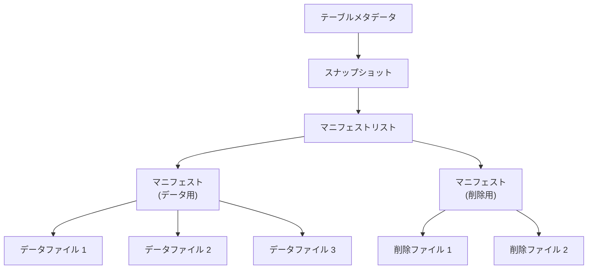
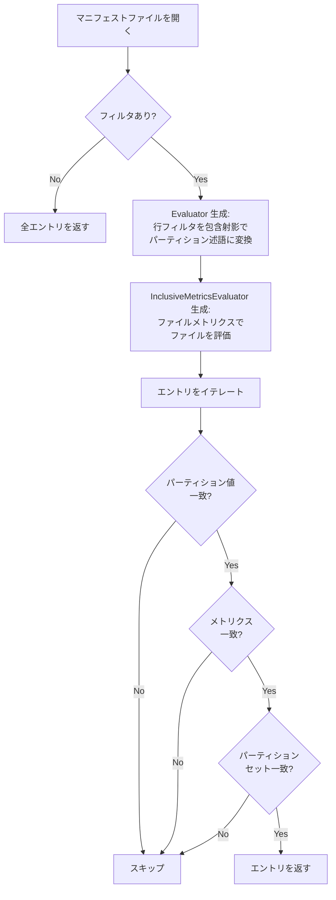

# 第8章 マニフェストファイル

> **本章で読むソース**
>
> - [`api/src/main/java/org/apache/iceberg/ManifestFile.java`](https://github.com/apache/iceberg/blob/apache-iceberg-1.11.0/api/src/main/java/org/apache/iceberg/ManifestFile.java)
> - [`core/src/main/java/org/apache/iceberg/ManifestReader.java`](https://github.com/apache/iceberg/blob/apache-iceberg-1.11.0/core/src/main/java/org/apache/iceberg/ManifestReader.java)
> - [`core/src/main/java/org/apache/iceberg/ManifestWriter.java`](https://github.com/apache/iceberg/blob/apache-iceberg-1.11.0/core/src/main/java/org/apache/iceberg/ManifestWriter.java)
> - [`api/src/main/java/org/apache/iceberg/DataFile.java`](https://github.com/apache/iceberg/blob/apache-iceberg-1.11.0/api/src/main/java/org/apache/iceberg/DataFile.java)
> - [`api/src/main/java/org/apache/iceberg/ContentFile.java`](https://github.com/apache/iceberg/blob/apache-iceberg-1.11.0/api/src/main/java/org/apache/iceberg/ContentFile.java)

## この章の狙い

Iceberg のスナップショットは、テーブルに含まれる全データファイルをマニフェストファイルの集合で管理する。
本章では、マニフェストファイルの Avro 構造、エントリのステータス管理、ファイルレベルメトリクス、パーティションサマリーによるフィルタリング、そして「ManifestReader」「ManifestWriter」の実装を読み解く。

## 前提

第2章「テーブルメタデータ」のスナップショット構造、第5章「パーティション仕様」のパーティションフィールドを理解していることを前提とする。

## マニフェストファイルの位置づけ

Iceberg のメタデータツリーは、テーブルメタデータ、マニフェストリスト、マニフェストファイルの3層で構成される。
マニフェストファイルは最下層に位置し、個々のデータファイルや削除ファイルへの参照を Avro 形式で保持する。

仕様では以下のように定義されている。

> A manifest is an immutable Avro file that lists data files or delete files, along with each file's partition data tuple, metrics, and tracking information.

1つのマニフェストファイルは、データファイルか削除ファイルのどちらか一方のみを格納する。
削除ファイルを含むマニフェストはスキャン計画時に先に読み込まれるため、両者を分離する設計になっている。

また、1つのマニフェストファイルは単一のパーティション仕様に紐づく。
パーティション仕様が変更されると、古いファイルは古いマニフェストに残り、新しいファイルは新しいマニフェストに書き込まれる。



## ManifestFile インターフェース

**ManifestFile** インターフェースは、マニフェストリストの1行に相当するメタデータを定義する。
マニフェストファイル自体の内容ではなく、マニフェストリストから見たマニフェストファイルのサマリー情報である。

[`api/src/main/java/org/apache/iceberg/ManifestFile.java` L29-L117](https://github.com/apache/iceberg/blob/apache-iceberg-1.11.0/api/src/main/java/org/apache/iceberg/ManifestFile.java#L29-L117)

```java
public interface ManifestFile {
  int PARTITION_SUMMARIES_ELEMENT_ID = 508;

  Types.NestedField PATH =
      required(500, "manifest_path", Types.StringType.get(), "Location URI with FS scheme");
  Types.NestedField LENGTH =
      required(501, "manifest_length", Types.LongType.get(), "Total file size in bytes");
  Types.NestedField SPEC_ID =
      required(502, "partition_spec_id", Types.IntegerType.get(), "Spec ID used to write");
  Types.NestedField MANIFEST_CONTENT =
      optional(
          517, "content", Types.IntegerType.get(), "Contents of the manifest: 0=data, 1=deletes");
  Types.NestedField SEQUENCE_NUMBER =
      optional(
          515,
          "sequence_number",
          Types.LongType.get(),
          "Sequence number when the manifest was added");
  Types.NestedField MIN_SEQUENCE_NUMBER =
      optional(
          516,
          "min_sequence_number",
          Types.LongType.get(),
          "Lowest sequence number in the manifest");
  // ... (中略) ...
  Schema SCHEMA =
      new Schema(
          PATH,
          LENGTH,
          SPEC_ID,
          MANIFEST_CONTENT,
          SEQUENCE_NUMBER,
          MIN_SEQUENCE_NUMBER,
          SNAPSHOT_ID,
          ADDED_FILES_COUNT,
          EXISTING_FILES_COUNT,
          DELETED_FILES_COUNT,
          ADDED_ROWS_COUNT,
          EXISTING_ROWS_COUNT,
          DELETED_ROWS_COUNT,
          PARTITION_SUMMARIES,
          KEY_METADATA,
          FIRST_ROW_ID);
```

各フィールドの役割を整理する。

| フィールド ID | 名前 | 型 | 役割 |
|---|---|---|---|
| 500 | `manifest_path` | string | マニフェストファイルの URI |
| 501 | `manifest_length` | long | ファイルサイズ（バイト） |
| 502 | `partition_spec_id` | int | 使用されたパーティション仕様の ID |
| 517 | `content` | int | 0=データ、1=削除 |
| 515 | `sequence_number` | long | マニフェスト追加時のシーケンス番号 |
| 516 | `min_sequence_number` | long | マニフェスト内の最小データシーケンス番号 |
| 503 | `added_snapshot_id` | long | マニフェストを追加したスナップショット ID |
| 504-506 | `added/existing/deleted_files_count` | int | ステータス別のファイル数 |
| 512-514 | `added/existing/deleted_rows_count` | long | ステータス別の行数 |
| 507 | `partitions` | list | パーティションフィールドサマリーのリスト |
| 520 | `first_row_id` | long | v3 で導入された行 ID の開始値 |

`hasAddedFiles()` や `hasDeletedFiles()` のようなデフォルトメソッドは、カウントが null（不明）の場合にも `true` を返す安全側の設計になっている。

[`api/src/main/java/org/apache/iceberg/ManifestFile.java` L149-L151](https://github.com/apache/iceberg/blob/apache-iceberg-1.11.0/api/src/main/java/org/apache/iceberg/ManifestFile.java#L149-L151)

```java
  default boolean hasAddedFiles() {
    return addedFilesCount() == null || addedFilesCount() > 0;
  }
```

カウントが null のときは v1 マニフェストなど古い形式からの読み込みを想定しており、安全のためにファイルが存在しうると見なす。

## ManifestEntry とステータス管理

マニフェストファイルの Avro スキーマは `manifest_entry` 構造体で定義される。
**ManifestEntry** インターフェースは、この構造体の Java 表現である。

[`core/src/main/java/org/apache/iceberg/ManifestEntry.java` L27-L48](https://github.com/apache/iceberg/blob/apache-iceberg-1.11.0/core/src/main/java/org/apache/iceberg/ManifestEntry.java#L27-L48)

```java
interface ManifestEntry<F extends ContentFile<F>> {
  enum Status {
    EXISTING(0),
    ADDED(1),
    DELETED(2);

    private final int id;

    Status(int id) {
      this.id = id;
    }
    // ... (中略) ...
  }

  // ids for data-file columns are assigned from 1000
  Types.NestedField STATUS = required(0, "status", Types.IntegerType.get());
  Types.NestedField SNAPSHOT_ID = optional(1, "snapshot_id", Types.LongType.get());
  Types.NestedField SEQUENCE_NUMBER = optional(3, "sequence_number", Types.LongType.get());
  Types.NestedField FILE_SEQUENCE_NUMBER =
      optional(4, "file_sequence_number", Types.LongType.get());
  int DATA_FILE_ID = 2;

  static Schema wrapFileSchema(StructType fileType) {
    return new Schema(
        STATUS,
        SNAPSHOT_ID,
        SEQUENCE_NUMBER,
        FILE_SEQUENCE_NUMBER,
        required(DATA_FILE_ID, "data_file", fileType));
  }
```

「ManifestEntry」は以下の5つのフィールドで構成される。

1. **status** (フィールド ID 0): `EXISTING`(0)、`ADDED`(1)、`DELETED`(2) の3値
2. **snapshot_id** (フィールド ID 1): ファイルを追加または削除したスナップショットの ID
3. **sequence_number** (フィールド ID 3): データシーケンス番号（v2 以降）
4. **file_sequence_number** (フィールド ID 4): ファイルシーケンス番号（v2 以降）
5. **data_file** (フィールド ID 2): ファイルのメタデータ構造体

### ステータスの意味

ファイルがテーブルに追加されると、ステータスは `ADDED` に設定される。
既存のマニフェストが新しいマニフェストにマージされるとき、変更のないファイルは `EXISTING` として記録される。
ファイルが論理的に削除されると、ステータスは `DELETED` に設定される。

スキャン時には `DELETED` エントリは無視される。
`isLive()` メソッドがこの判定を行う。

[`core/src/main/java/org/apache/iceberg/ManifestEntry.java` L77-L79](https://github.com/apache/iceberg/blob/apache-iceberg-1.11.0/core/src/main/java/org/apache/iceberg/ManifestEntry.java#L77-L79)

```java
  default boolean isLive() {
    return status() == Status.ADDED || status() == Status.EXISTING;
  }
```

### シーケンス番号の継承

v2 以降ではシーケンス番号の継承が重要な設計要素になっている。
新しいファイルを追加するとき、データシーケンス番号とファイルシーケンス番号は `null` のまま書き込まれる。
読み込み時に、マニフェストリストに記録されたマニフェストのシーケンス番号が継承される。

この継承の仕組みにより、マニフェストファイルはコミット前に書き込んでおき、リトライ時にはマニフェストリストだけを書き直せばよい。

`GenericManifestEntry` の `wrapAppend` メソッドがこの動作を実装している。

[`core/src/main/java/org/apache/iceberg/GenericManifestEntry.java` L69-L80](https://github.com/apache/iceberg/blob/apache-iceberg-1.11.0/core/src/main/java/org/apache/iceberg/GenericManifestEntry.java#L69-L80)

```java
  ManifestEntry<F> wrapAppend(Long newSnapshotId, F newFile) {
    return wrapAppend(newSnapshotId, null, newFile);
  }

  ManifestEntry<F> wrapAppend(Long newSnapshotId, Long newDataSequenceNumber, F newFile) {
    this.status = Status.ADDED;
    this.snapshotId = newSnapshotId;
    this.dataSequenceNumber = newDataSequenceNumber;
    this.fileSequenceNumber = null;
    this.file = Delegates.suppressFirstRowId(newFile);
    return this;
  }
```

`fileSequenceNumber` は常に `null` に設定される。
コミット成功時にマニフェストリストからの継承で値が確定するためである。

## ContentFile と DataFile

**ContentFile** は「DataFile」と「DeleteFile」の共通インターフェースである。
ファイルパス、パーティション値、レコード数、ファイルサイズに加え、列レベルのメトリクスを保持する。

[`api/src/main/java/org/apache/iceberg/ContentFile.java` L31-L220](https://github.com/apache/iceberg/blob/apache-iceberg-1.11.0/api/src/main/java/org/apache/iceberg/ContentFile.java#L31-L220)

```java
public interface ContentFile<F> {
  Long pos();
  int specId();
  FileContent content();
  CharSequence path();
  FileFormat format();
  StructLike partition();
  long recordCount();
  long fileSizeInBytes();
  Map<Integer, Long> columnSizes();
  Map<Integer, Long> valueCounts();
  Map<Integer, Long> nullValueCounts();
  Map<Integer, Long> nanValueCounts();
  Map<Integer, ByteBuffer> lowerBounds();
  Map<Integer, ByteBuffer> upperBounds();
  // ... (中略) ...
}
```

### DataFile のスキーマ定義

**DataFile** インターフェースは「ContentFile」を継承し、Avro スキーマのフィールド定義を静的フィールドとして持つ。

[`api/src/main/java/org/apache/iceberg/DataFile.java` L35-L153](https://github.com/apache/iceberg/blob/apache-iceberg-1.11.0/api/src/main/java/org/apache/iceberg/DataFile.java#L35-L153)

```java
public interface DataFile extends ContentFile<DataFile> {
  Types.NestedField CONTENT =
      optional(
          134,
          "content",
          IntegerType.get(),
          "Contents of the file: 0=data, 1=position deletes, 2=equality deletes");
  Types.NestedField FILE_PATH =
      required(100, "file_path", StringType.get(), "Location URI with FS scheme");
  // ... (中略) ...
  static StructType getType(StructType partitionType) {
    // IDs start at 100 to leave room for changes to ManifestEntry
    return StructType.of(
        CONTENT,
        FILE_PATH,
        FILE_FORMAT,
        SPEC_ID,
        required(PARTITION_ID, PARTITION_NAME, partitionType, PARTITION_DOC),
        RECORD_COUNT,
        FILE_SIZE,
        COLUMN_SIZES,
        VALUE_COUNTS,
        NULL_VALUE_COUNTS,
        NAN_VALUE_COUNTS,
        LOWER_BOUNDS,
        UPPER_BOUNDS,
        KEY_METADATA,
        SPLIT_OFFSETS,
        EQUALITY_IDS,
        SORT_ORDER_ID,
        FIRST_ROW_ID,
        REFERENCED_DATA_FILE,
        CONTENT_OFFSET,
        CONTENT_SIZE);
  }
```

フィールド ID が 100 から始まっている点に注意する。
「ManifestEntry」のフィールド ID は 0 から 4 であり、100 未満の ID 空間は将来のエントリレベルフィールドの追加に予約されている。

### ファイルレベルメトリクス

データファイルに格納されるメトリクスは、スキャン計画時の述語プッシュダウンに使われる。

| フィールド ID | 名前 | 型 | 用途 |
|---|---|---|---|
| 108 | `column_sizes` | `map<int, long>` | 列 ID ごとのディスク上のサイズ |
| 109 | `value_counts` | `map<int, long>` | 列 ID ごとの値の総数（null, NaN 含む） |
| 110 | `null_value_counts` | `map<int, long>` | 列 ID ごとの null 値の数 |
| 137 | `nan_value_counts` | `map<int, long>` | 列 ID ごとの NaN 値の数 |
| 125 | `lower_bounds` | `map<int, binary>` | 列 ID ごとの下限値（バイナリシリアライズ） |
| 128 | `upper_bounds` | `map<int, binary>` | 列 ID ごとの上限値（バイナリシリアライズ） |

`lower_bounds` と `upper_bounds` はバイナリ形式でシリアライズされる。
スキャン時にクエリの述語と比較し、一致する可能性のないファイルをスキップすることで、読み込むファイル数を大幅に削減する。

### DeleteFile インターフェース

**DeleteFile** は「ContentFile」を継承し、削除ファイル固有のフィールドを追加する。

[`api/src/main/java/org/apache/iceberg/DeleteFile.java` L24-L41](https://github.com/apache/iceberg/blob/apache-iceberg-1.11.0/api/src/main/java/org/apache/iceberg/DeleteFile.java#L24-L41)

```java
public interface DeleteFile extends ContentFile<DeleteFile> {
  /**
   * @return List of recommended split locations, if applicable, null otherwise. When available,
   *     this information is used for planning scan tasks whose boundaries are determined by these
   *     offsets. The returned list must be sorted in ascending order.
   */
  @Override
  default List<Long> splitOffsets() {
    return null;
  }

  /**
   * Returns the location of a data file that all deletes reference.
   *
   * <p>The referenced data file is required for deletion vectors and may be optionally captured for
   * position delete files that apply to only one data file. This method always returns null for
   * equality delete files.
   */
```

`referencedDataFile()` は削除ベクトルで必須のフィールドであり、すべての削除が単一のデータファイルを参照する場合に設定される。
`contentOffset()` と `contentSizeInBytes()` は Puffin ファイル内の削除ベクトル BLOB への直接アクセスに使われる。

## パーティションサマリーとフィルタリング

### PartitionFieldSummary

「ManifestFile」インターフェースには `partitions()` メソッドがあり、パーティションフィールドごとのサマリーを返す。

[`api/src/main/java/org/apache/iceberg/ManifestFile.java` L222-L238](https://github.com/apache/iceberg/blob/apache-iceberg-1.11.0/api/src/main/java/org/apache/iceberg/ManifestFile.java#L222-L238)

```java
  interface PartitionFieldSummary {
    static Types.StructType getType() {
      return PARTITION_SUMMARY_TYPE;
    }

    /** Returns true if at least one file in the manifest has a null value for the field. */
    boolean containsNull();

    /**
     * Returns true if at least one file in the manifest has a NaN value for the field. Null if this
     * information doesn't exist.
     *
     * <p>Default to return null to ensure backward compatibility.
     */
    default Boolean containsNaN() {
      return null;
    }
```

各サマリーは、パーティション仕様のフィールドと序数で対応する。
たとえばパーティション仕様が `[ts_day=day(ts), type=identity(type)]` であれば、サマリーリストの1番目は `ts_day` フィールドの統計、2番目は `type` フィールドの統計である。

### PartitionSummary の実装

**PartitionSummary** クラスは、マニフェスト書き込み時にパーティションフィールドごとの統計を蓄積する。

[`core/src/main/java/org/apache/iceberg/PartitionSummary.java` L32-L102](https://github.com/apache/iceberg/blob/apache-iceberg-1.11.0/core/src/main/java/org/apache/iceberg/PartitionSummary.java#L32-L102)

```java
class PartitionSummary {
  private final PartitionFieldStats<?>[] fields;
  private final Class<?>[] javaClasses;

  PartitionSummary(PartitionSpec spec) {
    this.javaClasses = spec.javaClasses();
    this.fields = new PartitionFieldStats[javaClasses.length];
    List<Types.NestedField> partitionFields = spec.partitionType().fields();
    for (int i = 0; i < fields.length; i += 1) {
      this.fields[i] = new PartitionFieldStats<>(partitionFields.get(i).type());
    }
  }
  // ... (中略) ...
  private static class PartitionFieldStats<T> {
    private final Type type;
    private final Comparator<T> comparator;

    private boolean containsNull = false;
    private boolean containsNaN = false;
    private T min = null;
    private T max = null;

    void update(T value) {
      if (value == null) {
        this.containsNull = true;
      } else if (NaNUtil.isNaN(value)) {
        this.containsNaN = true;
      } else if (min == null) {
        this.min = value;
        this.max = value;
      } else {
        if (comparator.compare(value, min) < 0) {
          this.min = value;
        }
        if (comparator.compare(max, value) < 0) {
          this.max = value;
        }
      }
    }
  }
}
```

`update` メソッドは、エントリが追加されるたびにそのファイルのパーティション値を受け取り、null/NaN フラグと最小値/最大値を更新する。
この統計はマニフェストリストに書き込まれ、スキャン計画時にマニフェストファイル自体を開かずにスキップ可能かを判定するために使われる。

## ManifestWriter の実装

**ManifestWriter** はマニフェストファイルの書き込みを担う抽象クラスである。
フォーマットバージョン（v1 から v4）ごとにサブクラスが存在する。

[`core/src/main/java/org/apache/iceberg/ManifestWriter.java` L38-L60](https://github.com/apache/iceberg/blob/apache-iceberg-1.11.0/core/src/main/java/org/apache/iceberg/ManifestWriter.java#L38-L60)

```java
public abstract class ManifestWriter<F extends ContentFile<F>> implements FileAppender<F> {
  // stand-in for the current sequence number that will be assigned when the commit is successful
  // this is replaced when writing a manifest list by the ManifestFile wrapper
  static final long UNASSIGNED_SEQ = -1L;

  private final OutputFile file;
  private final EncryptionKeyMetadata keyMetadata;
  private final int specId;
  private final FileAppender<ManifestEntry<F>> writer;
  private final Long snapshotId;
  private final GenericManifestEntry<F> reused;
  private final PartitionSummary stats;
  private final Long firstRowId;
  // ... (中略) ...
  private boolean closed = false;
  private int addedFiles = 0;
  private long addedRows = 0L;
  private int existingFiles = 0;
  private long existingRows = 0L;
  private int deletedFiles = 0;
  private long deletedRows = 0L;
  private Long minDataSequenceNumber = null;
```

`UNASSIGNED_SEQ` は -1 であり、コミット前のシーケンス番号のプレースホルダーとして使われる。
コミット成功後にマニフェストリストの書き込み時に実際の値に置き換えられる。

### エントリの追加

`addEntry` メソッドは、ステータスに応じてカウンターを更新し、パーティションサマリーを蓄積する。

[`core/src/main/java/org/apache/iceberg/ManifestWriter.java` L93-L118](https://github.com/apache/iceberg/blob/apache-iceberg-1.11.0/core/src/main/java/org/apache/iceberg/ManifestWriter.java#L93-L118)

```java
  void addEntry(ManifestEntry<F> entry) {
    switch (entry.status()) {
      case ADDED:
        addedFiles += 1;
        addedRows += entry.file().recordCount();
        break;
      case EXISTING:
        existingFiles += 1;
        existingRows += entry.file().recordCount();
        break;
      case DELETED:
        deletedFiles += 1;
        deletedRows += entry.file().recordCount();
        break;
    }

    stats.update(entry.file().partition());

    if (entry.isLive()
        && entry.dataSequenceNumber() != null
        && (minDataSequenceNumber == null || entry.dataSequenceNumber() < minDataSequenceNumber)) {
      this.minDataSequenceNumber = entry.dataSequenceNumber();
    }

    writer.add(prepare(entry));
  }
```

ここで3つの処理が同時に行われる。

1. ステータスごとのファイル数と行数のカウント
2. 「PartitionSummary」へのパーティション値の蓄積
3. 生存エントリの最小データシーケンス番号の追跡

`minDataSequenceNumber` はマニフェストリストの `min_sequence_number` フィールドになる。
この値により、特定のシーケンス番号より新しいファイルしか含まないマニフェストを、削除ファイルの適用判定でスキップできる。

### ManifestFile オブジェクトの生成

マニフェストの書き込みが完了した後、`toManifestFile()` でマニフェストリスト用の要約情報を生成する。

[`core/src/main/java/org/apache/iceberg/ManifestWriter.java` L206-L241](https://github.com/apache/iceberg/blob/apache-iceberg-1.11.0/core/src/main/java/org/apache/iceberg/ManifestWriter.java#L206-L241)

```java
  public ManifestFile toManifestFile() {
    Preconditions.checkState(closed, "Cannot build ManifestFile, writer is not closed");
    // ... (中略) ...
    // if the minSequenceNumber is null, then no manifests with a sequence number have been written,
    // so the min data sequence number is the one that will be assigned when this is committed.
    // pass UNASSIGNED_SEQ to inherit it.
    long minSeqNumber = minDataSequenceNumber != null ? minDataSequenceNumber : UNASSIGNED_SEQ;
    return new GenericManifestFile(
        file.location(),
        writer.length(),
        specId,
        content(),
        UNASSIGNED_SEQ,
        minSeqNumber,
        snapshotId,
        stats.summaries(),
        keyMetadataBuffer,
        addedFiles,
        addedRows,
        existingFiles,
        existingRows,
        deletedFiles,
        deletedRows,
        firstRowId);
  }
```

シーケンス番号に `UNASSIGNED_SEQ`（-1）を渡している点が重要である。
実際のシーケンス番号はコミット成功時にマニフェストリストの書き込みで確定する。

### バージョン別サブクラス

「ManifestWriter」は v1, v2, v3, v4 の4つのバージョンに対応するデータ用ライターと、v2, v3, v4 の削除用ライターを持つ。
各サブクラスは `newAppender` と `prepare` をオーバーライドし、バージョン固有のスキーマで Avro ファイルを書き込む。

v2 のデータライターを例に見ると、Avro メタデータにスキーマ、パーティション仕様、フォーマットバージョン、コンテントタイプを埋め込んでいる。

[`core/src/main/java/org/apache/iceberg/ManifestWriter.java` L438-L458](https://github.com/apache/iceberg/blob/apache-iceberg-1.11.0/core/src/main/java/org/apache/iceberg/ManifestWriter.java#L438-L458)

```java
    @Override
    protected FileAppender<ManifestEntry<DataFile>> newAppender(
        PartitionSpec spec, OutputFile file) {
      Schema manifestSchema = V2Metadata.entrySchema(spec.partitionType());
      try {
        return InternalData.write(FileFormat.AVRO, file)
            .schema(manifestSchema)
            .named("manifest_entry")
            .meta("schema", SchemaParser.toJson(spec.schema()))
            .meta("partition-spec", PartitionSpecParser.toJsonFields(spec))
            .meta("partition-spec-id", String.valueOf(spec.specId()))
            .meta("format-version", "2")
            .meta("content", "data")
            .set(writerProperties())
            .overwrite()
            .build();
      } catch (IOException e) {
        throw new RuntimeIOException(
            e, "Failed to create manifest writer for path: %s", file.location());
      }
    }
```

仕様で定義されたメタデータキー（`schema`, `partition-spec`, `partition-spec-id`, `format-version`, `content`）がそのまま Avro ファイルの key-value メタデータに書き込まれている。

## ManifestReader の実装

**ManifestReader** はマニフェストファイルを読み込み、フィルタリングされたファイルエントリをイテレートする。

[`core/src/main/java/org/apache/iceberg/ManifestReader.java` L57-L58](https://github.com/apache/iceberg/blob/apache-iceberg-1.11.0/core/src/main/java/org/apache/iceberg/ManifestReader.java#L57-L58)

```java
public class ManifestReader<F extends ContentFile<F>> extends CloseableGroup
    implements CloseableIterable<F> {
```

### フィルタリングの2段階構造

「ManifestReader」は、パーティションフィルタと行フィルタの2段階でファイルを絞り込む。

[`core/src/main/java/org/apache/iceberg/ManifestReader.java` L254-L281](https://github.com/apache/iceberg/blob/apache-iceberg-1.11.0/core/src/main/java/org/apache/iceberg/ManifestReader.java#L254-L281)

```java
  private CloseableIterable<ManifestEntry<F>> entries(boolean onlyLive) {
    if (hasRowFilter() || hasPartitionFilter() || partitionSet != null) {
      Evaluator evaluator = evaluator();
      InclusiveMetricsEvaluator metricsEvaluator = metricsEvaluator();

      // ensure stats columns are present for metrics evaluation
      boolean requireStatsProjection = requireStatsProjection(rowFilter, columns);
      Collection<String> projectColumns =
          requireStatsProjection ? withStatsColumns(columns) : columns;
      CloseableIterable<ManifestEntry<F>> entries =
          open(projection(fileSchema, fileProjection, projectColumns, caseSensitive));

      return CloseableIterable.filter(
          content == FileType.DATA_FILES
              ? scanMetrics.skippedDataFiles()
              : scanMetrics.skippedDeleteFiles(),
          onlyLive ? filterLiveEntries(entries) : entries,
          entry ->
              entry != null
                  && evaluator.eval(entry.file().partition())
                  && metricsEvaluator.eval(entry.file())
                  && inPartitionSet(entry.file()));
    } else {
      CloseableIterable<ManifestEntry<F>> entries =
          open(projection(fileSchema, fileProjection, columns, caseSensitive));
      return onlyLive ? filterLiveEntries(entries) : entries;
    }
  }
```

フィルタリングは3つの条件の AND で構成される。

1. `evaluator.eval(entry.file().partition())`: パーティション値が述語に一致するか
2. `metricsEvaluator.eval(entry.file())`: ファイルメトリクス（下限/上限）が述語に一致する可能性があるか
3. `inPartitionSet(entry.file())`: 指定されたパーティション集合に含まれるか



### 列プロジェクションの最適化

「ManifestReader」は、スキャンに必要な列だけを読み込む列プロジェクションをサポートする。
ただし、メトリクスによるフィルタリングが必要な場合、統計列が自動的に追加される。

[`core/src/main/java/org/apache/iceberg/ManifestReader.java` L381-L396](https://github.com/apache/iceberg/blob/apache-iceberg-1.11.0/core/src/main/java/org/apache/iceberg/ManifestReader.java#L381-L396)

```java
  private static boolean requireStatsProjection(Expression rowFilter, Collection<String> columns) {
    // Make sure we have all stats columns for metrics evaluator
    return rowFilter != alwaysTrue()
        && columns != null
        && !columns.containsAll(ManifestReader.ALL_COLUMNS)
        && !columns.containsAll(STATS_COLUMNS);
  }

  static boolean dropStats(Collection<String> columns) {
    // Make sure we only drop all stats if we had projected all stats
    // We do not drop stats even if we had partially added some stats columns, except for
    // record_count column.
    // Since we don't want to keep stats map which could be huge in size just because we select
    // record_count, which
    // is a primitive type.
    if (columns != null && !columns.containsAll(ManifestReader.ALL_COLUMNS)) {
```

`dropStats` メソッドは、統計列が要求されていない場合にコピー時に統計情報を落とす判定を行う。
メトリクスの Map はサイズが大きくなりうるため、不要な場合は除外することでメモリ使用量を抑える。

### InheritableMetadata による継承処理

「ManifestReader」はエントリを読み込んだ後、**InheritableMetadata** を適用してシーケンス番号やスナップショット ID を継承する。

[`core/src/main/java/org/apache/iceberg/InheritableMetadataFactory.java` L49-L93](https://github.com/apache/iceberg/blob/apache-iceberg-1.11.0/core/src/main/java/org/apache/iceberg/InheritableMetadataFactory.java#L49-L93)

```java
  static class BaseInheritableMetadata implements InheritableMetadata {
    private final int specId;
    private final long snapshotId;
    private final long sequenceNumber;
    private final String manifestLocation;
    // ... (中略) ...
    @Override
    public <F extends ContentFile<F>> ManifestEntry<F> apply(ManifestEntry<F> manifestEntry) {
      if (manifestEntry.snapshotId() == null) {
        manifestEntry.setSnapshotId(snapshotId);
      }

      // in v1 tables, the data sequence number is not persisted and can be safely defaulted to 0
      // in v2 tables, the data sequence number should be inherited iff the entry status is ADDED
      if (manifestEntry.dataSequenceNumber() == null
          && (sequenceNumber == 0 || manifestEntry.status() == ManifestEntry.Status.ADDED)) {
        manifestEntry.setDataSequenceNumber(sequenceNumber);
      }

      // in v1 tables, the file sequence number is not persisted and can be safely defaulted to 0
      // in v2 tables, the file sequence number should be inherited iff the entry status is ADDED
      if (manifestEntry.fileSequenceNumber() == null
          && (sequenceNumber == 0 || manifestEntry.status() == ManifestEntry.Status.ADDED)) {
        manifestEntry.setFileSequenceNumber(sequenceNumber);
      }
      // ... (中略) ...
      return manifestEntry;
    }
  }
```

継承のルールは以下の通りである。

- v1 テーブル（`sequenceNumber == 0`）: すべてのエントリに対して無条件に継承する
- v2 以降: ステータスが `ADDED` のエントリのみ継承する。`EXISTING` や `DELETED` のエントリは明示的な値を持つ必要がある

## 設計上の工夫: シーケンス番号の遅延確定

マニフェストファイルの設計における重要な工夫は、シーケンス番号の遅延確定である。

楽観的並行制御では、コミットがリトライされることがある。
シーケンス番号がコミット時に確定する設計にすることで、マニフェストファイル自体はリトライ時にも再利用できる。
変更が必要なのはマニフェストリスト（シーケンス番号をエントリに書き込むファイル）だけである。

この設計により、大量のデータファイルを含むマニフェストの書き込みコスト（Avro ファイルの生成とアップロード）がリトライのたびに発生することを防いでいる。
大規模テーブルでは1つのマニフェストに数千から数万のエントリが含まれるため、この最適化は実用上の効果が大きい。

## まとめ

- マニフェストファイルは Avro 形式のイミュータブルなファイルであり、データファイルまたは削除ファイルの一覧を格納する
- 各エントリは `ADDED`, `EXISTING`, `DELETED` の3つのステータスで管理され、`DELETED` エントリはスキャン時に無視される
- 「ContentFile」は列レベルのメトリクス（値の数、null 数、NaN 数、下限、上限）を保持し、述語プッシュダウンに使われる
- パーティションサマリーにより、マニフェストリストの段階でマニフェストファイル自体を開かずにスキップ判定が可能になる
- 「ManifestReader」はパーティション評価とメトリクス評価の2段階でファイルをフィルタリングする
- シーケンス番号の遅延確定により、楽観的並行制御のリトライ時にマニフェストファイルを再利用できる

## 関連する章

- [第2章 テーブルメタデータ](../part00-overview/02-table-metadata.md)
- [第5章 パーティション仕様](../part02-partitioning/05-partition-spec.md)
