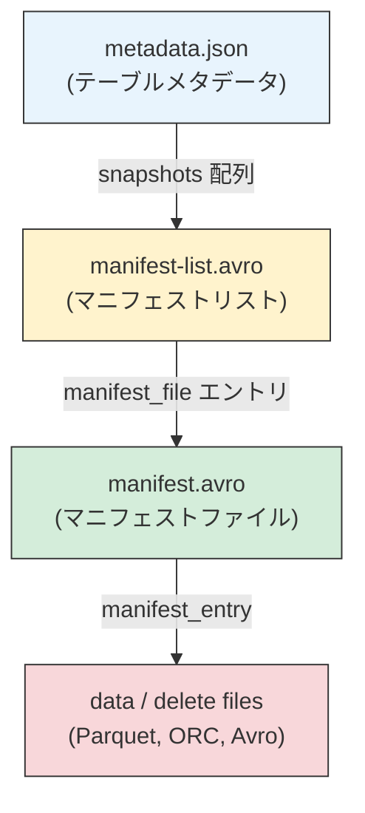
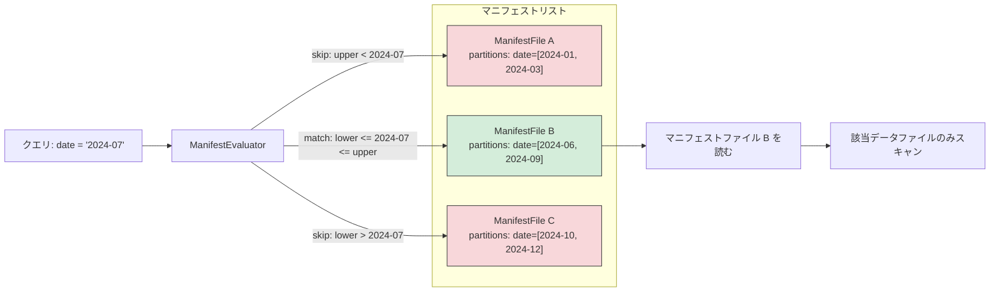

# 第9章 マニフェストリストとメタデータツリー

> **本章で読むソース**
>
> - [`api/src/main/java/org/apache/iceberg/ManifestFile.java`](https://github.com/apache/iceberg/blob/apache-iceberg-1.11.0/api/src/main/java/org/apache/iceberg/ManifestFile.java)
> - [`core/src/main/java/org/apache/iceberg/ManifestListWriter.java`](https://github.com/apache/iceberg/blob/apache-iceberg-1.11.0/core/src/main/java/org/apache/iceberg/ManifestListWriter.java)
> - [`core/src/main/java/org/apache/iceberg/ManifestLists.java`](https://github.com/apache/iceberg/blob/apache-iceberg-1.11.0/core/src/main/java/org/apache/iceberg/ManifestLists.java)
> - [`core/src/main/java/org/apache/iceberg/GenericManifestFile.java`](https://github.com/apache/iceberg/blob/apache-iceberg-1.11.0/core/src/main/java/org/apache/iceberg/GenericManifestFile.java)
> - [`api/src/main/java/org/apache/iceberg/expressions/ManifestEvaluator.java`](https://github.com/apache/iceberg/blob/apache-iceberg-1.11.0/api/src/main/java/org/apache/iceberg/expressions/ManifestEvaluator.java)

## この章の狙い

スナップショットからデータファイルに至るまでのメタデータの階層構造を理解する。
仕様が定める**マニフェストリスト**の Avro スキーマと、そこに格納される `ManifestFile` の各フィールドを読み、パーティションサマリーやファイルカウントといった統計情報がどのようにスキャン時の枝刈りに使われるかを追う。
さらに、metadata.json からデータファイルに至る 4 層のメタデータツリーを俯瞰し、最小限の I/O で必要なファイルだけを読む設計を確認する。

## 前提

第7章のスナップショットモデルと第8章のマニフェストファイルの知識を前提とする。
第5章で扱ったパーティション仕様（`PartitionSpec`）の概念も使う。

## メタデータツリーの全体像

Iceberg のテーブルは、JSON ファイル 1 個と Avro ファイル群による 4 層のツリーで構成される。



仕様書は各層の役割を次のように整理している。

1. **metadata.json** はテーブルのスキーマ、パーティション仕様、スナップショット一覧を保持する。各スナップショットは `manifest-list` フィールドでマニフェストリストの場所を指す。
2. **マニフェストリスト**（manifest-list.avro）は、そのスナップショットに属する全マニフェストファイルの一覧を格納する Avro ファイルである。各エントリにはパーティションサマリーやファイルカウントといった統計情報が含まれ、スキャン計画時に不要なマニフェストを読み飛ばすために使われる。
3. **マニフェストファイル**（manifest.avro）は、データファイルや削除ファイルの一覧をパーティション値や列統計とともに格納する。
4. **データファイル / 削除ファイル**が実際のレコードを格納する。

この階層構造の要点は、読み取り時に上の層の統計情報を使って下の層を読むかどうかを判断できる点にある。
マニフェストリストの統計情報でマニフェストを枝刈りし、さらにマニフェスト内のパーティション値や列統計でデータファイルを枝刈りする。
2 段階のフィルタリングにより、ペタバイト規模のテーブルでも、スキャンに必要なメタデータ I/O を最小限に抑えられる。

## ManifestFile インタフェース: マニフェストリストの 1 行

マニフェストリストの各行は `ManifestFile` インタフェースで定義される。
仕様書が定める `manifest_file` 構造体のフィールドを、Java インタフェースの定数として宣言している。

### フィールド定義の全体像

[`api/src/main/java/org/apache/iceberg/ManifestFile.java` L32-L98](https://github.com/apache/iceberg/blob/apache-iceberg-1.11.0/api/src/main/java/org/apache/iceberg/ManifestFile.java#L32-L98)

```java
  Types.NestedField PATH =
      required(500, "manifest_path", Types.StringType.get(), "Location URI with FS scheme");
  Types.NestedField LENGTH =
      required(501, "manifest_length", Types.LongType.get(), "Total file size in bytes");
  Types.NestedField SPEC_ID =
      required(502, "partition_spec_id", Types.IntegerType.get(), "Spec ID used to write");
  Types.NestedField MANIFEST_CONTENT =
      optional(
          517, "content", Types.IntegerType.get(), "Contents of the manifest: 0=data, 1=deletes");
  Types.NestedField SEQUENCE_NUMBER =
      optional(
          515,
          "sequence_number",
          Types.LongType.get(),
          "Sequence number when the manifest was added");
  Types.NestedField MIN_SEQUENCE_NUMBER =
      optional(
          516,
          "min_sequence_number",
          Types.LongType.get(),
          "Lowest sequence number in the manifest");
  Types.NestedField SNAPSHOT_ID =
      required(
          503, "added_snapshot_id", Types.LongType.get(), "Snapshot ID that added the manifest");
  Types.NestedField ADDED_FILES_COUNT =
      optional(504, "added_files_count", Types.IntegerType.get(), "Added entry count");
  Types.NestedField EXISTING_FILES_COUNT =
      optional(505, "existing_files_count", Types.IntegerType.get(), "Existing entry count");
  Types.NestedField DELETED_FILES_COUNT =
      optional(506, "deleted_files_count", Types.IntegerType.get(), "Deleted entry count");
  Types.NestedField ADDED_ROWS_COUNT =
      optional(512, "added_rows_count", Types.LongType.get(), "Added rows count");
  Types.NestedField EXISTING_ROWS_COUNT =
      optional(513, "existing_rows_count", Types.LongType.get(), "Existing rows count");
  Types.NestedField DELETED_ROWS_COUNT =
      optional(514, "deleted_rows_count", Types.LongType.get(), "Deleted rows count");
  // ... (中略) ...
  Types.NestedField FIRST_ROW_ID =
      optional(
          520,
          "first_row_id",
          Types.LongType.get(),
          "Starting row ID to assign to new rows in ADDED data files");
  // next ID to assign: 521
```

これらのフィールドは大きく 4 つの役割に分類できる。

| 役割 | フィールド | 用途 |
|------|-----------|------|
| 所在 | `manifest_path`, `manifest_length` | マニフェストファイルの場所とサイズ |
| 帰属 | `partition_spec_id`, `added_snapshot_id`, `content` | どのパーティション仕様、どのスナップショットで追加されたか、データかデリートか |
| 順序 | `sequence_number`, `min_sequence_number`, `first_row_id` | コミット順序の追跡と行 ID の付番 |
| 統計 | ファイルカウント 3 種、行カウント 3 種、`partitions` | スキャン計画時の枝刈りに使用 |

### content フィールドによるデータとデリートの分離

仕様は v2 で `content` フィールドを導入した。
値 0 はデータマニフェスト、値 1 は削除マニフェストを表す。
この分離により、スキャン計画時に削除マニフェストを先に読み、対応するデータマニフェストだけを処理できる。

### ファイルカウントと行カウント

`added_files_count`、`existing_files_count`、`deleted_files_count` の 3 フィールドは、マニフェスト内のエントリをステータス別に集計した値である。
v1 では optional だが、v2 以降は required になる。

`ManifestFile` インタフェースは、これらのカウントを利用して高速にマニフェストの内容を判定するデフォルトメソッドを提供している。

[`api/src/main/java/org/apache/iceberg/ManifestFile.java` L149-L151](https://github.com/apache/iceberg/blob/apache-iceberg-1.11.0/api/src/main/java/org/apache/iceberg/ManifestFile.java#L149-L151)

```java
  default boolean hasAddedFiles() {
    return addedFilesCount() == null || addedFilesCount() > 0;
  }
```

カウントが `null` の場合は「不明なので読む可能性がある」とみなして `true` を返す。
これは v1 マニフェストリストとの後方互換を保つための設計である。
カウントが 0 と分かっている場合にのみ `false` を返し、マニフェスト全体の読み飛ばしを許可する。

`hasExistingFiles()` と `hasDeletedFiles()` も同じパターンで定義されている。

## パーティションサマリー: マニフェスト単位の枝刈り

`ManifestFile` の `partitions` フィールドは、マニフェスト内の全ファイルについてパーティションフィールドごとの統計を集約した `PartitionFieldSummary` のリストを格納する。

### PartitionFieldSummary の構造

[`api/src/main/java/org/apache/iceberg/ManifestFile.java` L68-L83](https://github.com/apache/iceberg/blob/apache-iceberg-1.11.0/api/src/main/java/org/apache/iceberg/ManifestFile.java#L68-L83)

```java
  Types.StructType PARTITION_SUMMARY_TYPE =
      Types.StructType.of(
          required(
              509,
              "contains_null",
              Types.BooleanType.get(),
              "True if any file has a null partition value"),
          optional(
              518,
              "contains_nan",
              Types.BooleanType.get(),
              "True if any file has a nan partition value"),
          optional(
              510, "lower_bound", Types.BinaryType.get(), "Partition lower bound for all files"),
          optional(
              511, "upper_bound", Types.BinaryType.get(), "Partition upper bound for all files"));
```

各パーティションフィールドについて、以下の 4 つの統計を記録する。

1. **`contains_null`**: マニフェスト内のいずれかのファイルが当該パーティションフィールドに null 値を持つかどうか
2. **`contains_nan`**: 同様に NaN 値を持つかどうか（v2 で追加）
3. **`lower_bound`**: マニフェスト内の全ファイルにわたる当該パーティションフィールドの下限値
4. **`upper_bound`**: 同様に上限値

`lower_bound` と `upper_bound` はバイナリ型でシリアライズされる。
仕様書（Appendix D）が定める Single-Value Serialization に従い、パーティションフィールドの型に応じたバイト列として格納される。

### 枝刈りの仕組み: ManifestEvaluator

パーティションサマリーを使ってマニフェストを読み飛ばす判定を行うのが `ManifestEvaluator` である。

`ManifestEvaluator` は、テーブルのデータ列に対する述語（例: `ts > '2024-06-01'`）を「包含射影」によってパーティション述語に変換し、その述語をパーティションサマリーの上限値と下限値に対して評価する。

[`api/src/main/java/org/apache/iceberg/expressions/ManifestEvaluator.java` L55-L59](https://github.com/apache/iceberg/blob/apache-iceberg-1.11.0/api/src/main/java/org/apache/iceberg/expressions/ManifestEvaluator.java#L55-L59)

```java
  public static ManifestEvaluator forRowFilter(
      Expression rowFilter, PartitionSpec spec, boolean caseSensitive) {
    return new ManifestEvaluator(
        spec, Projections.inclusive(spec, caseSensitive).project(rowFilter), caseSensitive);
  }
```

`eval` メソッドは `ManifestFile` を受け取り、パーティションサマリーが存在しない場合は「マッチする可能性あり」として `true` を返す。
サマリーが存在する場合は、変換済みの述語をビジターパターンで評価する。

[`api/src/main/java/org/apache/iceberg/expressions/ManifestEvaluator.java` L83-L93](https://github.com/apache/iceberg/blob/apache-iceberg-1.11.0/api/src/main/java/org/apache/iceberg/expressions/ManifestEvaluator.java#L83-L93)

```java
  private class ManifestEvalVisitor extends BoundExpressionVisitor<Boolean> {
    private List<PartitionFieldSummary> stats = null;

    private boolean eval(ManifestFile manifest) {
      this.stats = manifest.partitions();
      if (stats == null) {
        return ROWS_MIGHT_MATCH;
      }

      return ExpressionVisitors.visitEvaluator(expr, this);
    }
```

以下は `lt`（less than）の評価例である。

[`api/src/main/java/org/apache/iceberg/expressions/ManifestEvaluator.java` L173-L189](https://github.com/apache/iceberg/blob/apache-iceberg-1.11.0/api/src/main/java/org/apache/iceberg/expressions/ManifestEvaluator.java#L173-L189)

```java
    @Override
    public <T> Boolean lt(BoundReference<T> ref, Literal<T> lit) {
      int pos = Accessors.toPosition(ref.accessor());
      ByteBuffer lowerBound = stats.get(pos).lowerBound();
      if (lowerBound == null) {
        return ROWS_CANNOT_MATCH; // values are all null
      }

      T lower = Conversions.fromByteBuffer(ref.type(), lowerBound);

      int cmp = lit.comparator().compare(lower, lit.value());
      if (cmp >= 0) {
        return ROWS_CANNOT_MATCH;
      }

      return ROWS_MIGHT_MATCH;
    }
```

下限値がリテラル以上であれば、マニフェスト内の全パーティション値がリテラル以上であるため、`column < literal` を満たすレコードは存在しない。
上限値の比較を使う `gt`、`gtEq` や、上限値と下限値の両方を使う `eq` も同じパターンで実装されている。

次の図はスキャン計画時の 2 段階の枝刈りの流れを示す。



この図では `date = '2024-07'` というクエリに対し、ManifestFile A（上限 2024-03）と ManifestFile C（下限 2024-10）はパーティションサマリーの範囲外であるため読み飛ばされ、ManifestFile B のみが読まれる。

## ManifestGroup: スキャン計画でのマニフェスト枝刈り

`ManifestEvaluator` は `ManifestGroup` クラスから呼び出される。
`ManifestGroup` はスキャン計画の中核であり、マニフェストリストから読み込んだ `ManifestFile` の集合に対してフィルタリングを適用する。

[`core/src/main/java/org/apache/iceberg/ManifestGroup.java` L301-L309](https://github.com/apache/iceberg/blob/apache-iceberg-1.11.0/core/src/main/java/org/apache/iceberg/ManifestGroup.java#L301-L309)

```java
    CloseableIterable<ManifestFile> closeableDataManifests =
        CloseableIterable.withNoopClose(dataManifests);
    CloseableIterable<ManifestFile> matchingManifests =
        evalCache == null
            ? closeableDataManifests
            : CloseableIterable.filter(
                scanMetrics.skippedDataManifests(),
                closeableDataManifests,
                manifest -> evalCache.get(manifest.partitionSpecId()).eval(manifest));
```

`evalCache` はパーティション仕様 ID ごとにキャッシュされた `ManifestEvaluator` である。
マニフェストは特定のパーティション仕様に紐づいて書かれるため、パーティション仕様 ID をキーにして評価器を使い回せる。

さらに `ManifestGroup` はファイルカウントも利用する。
例えば、削除エントリだけのマニフェストを無視する場合の処理は次のとおりである。

[`core/src/main/java/org/apache/iceberg/ManifestGroup.java` L311-L320](https://github.com/apache/iceberg/blob/apache-iceberg-1.11.0/core/src/main/java/org/apache/iceberg/ManifestGroup.java#L311-L320)

```java
    if (ignoreDeleted) {
      // only scan manifests that have entries other than deletes
      // remove any manifests that don't have any existing or added files. if either the added or
      // existing files count is missing, the manifest must be scanned.
      matchingManifests =
          CloseableIterable.filter(
              scanMetrics.skippedDataManifests(),
              matchingManifests,
              manifest -> manifest.hasAddedFiles() || manifest.hasExistingFiles());
    }
```

`hasAddedFiles()` と `hasExistingFiles()` は先述のデフォルトメソッドであり、カウントが 0 と確定しているマニフェストだけをスキップする。
パーティションサマリーによる枝刈りとファイルカウントによる枝刈りが組み合わさることで、実際に読むマニフェストファイルの数を最小限に抑えている。

## マニフェストリストの読み書き

### 読み込み: ManifestLists.read

`ManifestLists.read` は、マニフェストリストの Avro ファイルから `ManifestFile` のリストを復元する。

[`core/src/main/java/org/apache/iceberg/ManifestLists.java` L34-L49](https://github.com/apache/iceberg/blob/apache-iceberg-1.11.0/core/src/main/java/org/apache/iceberg/ManifestLists.java#L34-L49)

```java
  static List<ManifestFile> read(InputFile manifestList) {
    try (CloseableIterable<ManifestFile> files =
        InternalData.read(FileFormat.AVRO, manifestList)
            .setRootType(GenericManifestFile.class)
            .setCustomType(
                ManifestFile.PARTITION_SUMMARIES_ELEMENT_ID, GenericPartitionFieldSummary.class)
            .project(ManifestFile.schema())
            .build()) {

      return Lists.newLinkedList(files);

    } catch (IOException e) {
      throw new RuntimeIOException(
          e, "Cannot read manifest list file: %s", manifestList.location());
    }
  }
```

注目すべき点は 3 つある。

1. **`setRootType(GenericManifestFile.class)`** により、Avro のレコードを `GenericManifestFile` クラスへ直接デシリアライズする。
2. **`setCustomType`** で `PARTITION_SUMMARIES_ELEMENT_ID`（508）を `GenericPartitionFieldSummary` に関連づけている。パーティションサマリーのネストした構造体を正しく復元するための仕組みである。
3. **`project(ManifestFile.schema())`** により、スキーマプロジェクションを適用する。Avro ファイルのスキーマに存在しないフィールド（例: v1 のファイルには `content` がない）があってもデフォルト値で補完される。

### 書き込み: ManifestListWriter

`ManifestListWriter` はフォーマットバージョンに応じた Avro スキーマでマニフェストリストを書き出す抽象クラスである。

[`core/src/main/java/org/apache/iceberg/ManifestListWriter.java` L34-L55](https://github.com/apache/iceberg/blob/apache-iceberg-1.11.0/core/src/main/java/org/apache/iceberg/ManifestListWriter.java#L34-L55)

```java
abstract class ManifestListWriter implements FileAppender<ManifestFile> {
  private final FileAppender<ManifestFile> writer;
  private final StandardEncryptionManager standardEncryptionManager;
  private final NativeEncryptionKeyMetadata manifestListKeyMetadata;
  private final OutputFile outputFile;

  private ManifestListWriter(
      OutputFile file, EncryptionManager encryptionManager, Map<String, String> meta) {
    if (encryptionManager instanceof StandardEncryptionManager) {
      // ability to encrypt the manifest list key is introduced for standard encryption.
      this.standardEncryptionManager = (StandardEncryptionManager) encryptionManager;
      EncryptedOutputFile encryptedFile = this.standardEncryptionManager.encrypt(file);
      this.outputFile = encryptedFile.encryptingOutputFile();
      this.manifestListKeyMetadata = (NativeEncryptionKeyMetadata) encryptedFile.keyMetadata();
    } else {
      this.standardEncryptionManager = null;
      this.outputFile = file;
      this.manifestListKeyMetadata = null;
    }

    this.writer = newAppender(outputFile, meta);
  }
```

コンストラクタは暗号化対応を担う。
`StandardEncryptionManager` が渡された場合は出力ファイルを暗号化し、そうでなければ平文で書き出す。

各バージョンのサブクラスは `prepare` メソッドと `newAppender` メソッドをオーバーライドする。
`prepare` は書き込む `ManifestFile` を当該バージョンのスキーマに適合させるラッパーを返す。

### バージョン別ファクトリ: ManifestLists.write

`ManifestLists.write` は、フォーマットバージョンに応じて適切な `ManifestListWriter` サブクラスを生成するファクトリメソッドである。

[`core/src/main/java/org/apache/iceberg/ManifestLists.java` L51-L89](https://github.com/apache/iceberg/blob/apache-iceberg-1.11.0/core/src/main/java/org/apache/iceberg/ManifestLists.java#L51-L89)

```java
  static ManifestListWriter write(
      int formatVersion,
      OutputFile manifestListFile,
      EncryptionManager encryptionManager,
      long snapshotId,
      Long parentSnapshotId,
      long sequenceNumber,
      Long firstRowId) {
    switch (formatVersion) {
      case 1:
        // ... (中略) ...
        return new ManifestListWriter.V1Writer(
            manifestListFile, encryptionManager, snapshotId, parentSnapshotId);
      case 2:
        return new ManifestListWriter.V2Writer(
            manifestListFile, encryptionManager, snapshotId, parentSnapshotId, sequenceNumber);
      case 3:
        return new ManifestListWriter.V3Writer(
            manifestListFile,
            encryptionManager,
            snapshotId,
            parentSnapshotId,
            sequenceNumber,
            firstRowId);
      // ... (中略) ...
    }
    throw new UnsupportedOperationException(
        "Cannot write manifest list for table version: " + formatVersion);
  }
```

バージョンが上がるにつれてコンストラクタに渡す引数が増えることがわかる。
v1 は `snapshotId` と `parentSnapshotId` だけだが、v2 で `sequenceNumber` が加わり、v3 で `firstRowId` がさらに加わる。

## バージョン別スキーマの進化

マニフェストリストの Avro スキーマは、フォーマットバージョンごとに異なる。
各バージョンの違いを整理する。

### v1 スキーマ

[`core/src/main/java/org/apache/iceberg/V1Metadata.java` L32-L45](https://github.com/apache/iceberg/blob/apache-iceberg-1.11.0/core/src/main/java/org/apache/iceberg/V1Metadata.java#L32-L45)

```java
  static final Schema MANIFEST_LIST_SCHEMA =
      new Schema(
          ManifestFile.PATH,
          ManifestFile.LENGTH,
          ManifestFile.SPEC_ID,
          ManifestFile.SNAPSHOT_ID,
          ManifestFile.ADDED_FILES_COUNT,
          ManifestFile.EXISTING_FILES_COUNT,
          ManifestFile.DELETED_FILES_COUNT,
          ManifestFile.PARTITION_SUMMARIES,
          ManifestFile.ADDED_ROWS_COUNT,
          ManifestFile.EXISTING_ROWS_COUNT,
          ManifestFile.DELETED_ROWS_COUNT,
          ManifestFile.KEY_METADATA);
```

v1 には `content`、`sequence_number`、`min_sequence_number` がない。
v1 ではすべてのマニフェストがデータマニフェスト（削除ファイルを格納できない）であり、シーケンス番号の概念も存在しない。
ファイルカウントや行カウントは optional のままである。

### v2 スキーマ

[`core/src/main/java/org/apache/iceberg/V2Metadata.java` L33-L49](https://github.com/apache/iceberg/blob/apache-iceberg-1.11.0/core/src/main/java/org/apache/iceberg/V2Metadata.java#L33-L49)

```java
  static final Schema MANIFEST_LIST_SCHEMA =
      new Schema(
          ManifestFile.PATH,
          ManifestFile.LENGTH,
          ManifestFile.SPEC_ID,
          ManifestFile.MANIFEST_CONTENT.asRequired(),
          ManifestFile.SEQUENCE_NUMBER.asRequired(),
          ManifestFile.MIN_SEQUENCE_NUMBER.asRequired(),
          ManifestFile.SNAPSHOT_ID,
          ManifestFile.ADDED_FILES_COUNT.asRequired(),
          ManifestFile.EXISTING_FILES_COUNT.asRequired(),
          ManifestFile.DELETED_FILES_COUNT.asRequired(),
          ManifestFile.ADDED_ROWS_COUNT.asRequired(),
          ManifestFile.EXISTING_ROWS_COUNT.asRequired(),
          ManifestFile.DELETED_ROWS_COUNT.asRequired(),
          ManifestFile.PARTITION_SUMMARIES,
          ManifestFile.KEY_METADATA);
```

v2 では 3 つの変更がある。

1. `content`、`sequence_number`、`min_sequence_number` が required として追加された
2. ファイルカウントと行カウントの 6 フィールドがすべて required になった
3. `partitions`（パーティションサマリー）と `key_metadata` は引き続き optional のまま

`asRequired()` の呼び出しにより、`ManifestFile` で optional と定義されたフィールドを required に昇格させている。
v1 との後方互換性は、読み取り時にフィールドが欠落していればデフォルト値（`content` なら 0、シーケンス番号なら 0）を補完することで保たれる。

### v3 スキーマ

[`core/src/main/java/org/apache/iceberg/V3Metadata.java` L31-L48](https://github.com/apache/iceberg/blob/apache-iceberg-1.11.0/core/src/main/java/org/apache/iceberg/V3Metadata.java#L31-L48)

```java
  static final Schema MANIFEST_LIST_SCHEMA =
      new Schema(
          ManifestFile.PATH,
          ManifestFile.LENGTH,
          ManifestFile.SPEC_ID,
          ManifestFile.MANIFEST_CONTENT.asRequired(),
          ManifestFile.SEQUENCE_NUMBER.asRequired(),
          ManifestFile.MIN_SEQUENCE_NUMBER.asRequired(),
          ManifestFile.SNAPSHOT_ID,
          ManifestFile.ADDED_FILES_COUNT.asRequired(),
          ManifestFile.EXISTING_FILES_COUNT.asRequired(),
          ManifestFile.DELETED_FILES_COUNT.asRequired(),
          ManifestFile.ADDED_ROWS_COUNT.asRequired(),
          ManifestFile.EXISTING_ROWS_COUNT.asRequired(),
          ManifestFile.DELETED_ROWS_COUNT.asRequired(),
          ManifestFile.PARTITION_SUMMARIES,
          ManifestFile.KEY_METADATA,
          ManifestFile.FIRST_ROW_ID);
```

v3 では v2 のスキーマに `first_row_id`（フィールド ID 520）が追加された。
このフィールドは、マニフェスト内の新規追加データファイルに割り当てる行 ID の開始値を保持する。
行 ID の付番はマニフェストリスト書き込み時に行われ、`ManifestListWriter.V3Writer.prepare` で実装されている。

## シーケンス番号の継承: コミットリトライの効率化

仕様が定めるシーケンス番号の継承は、Iceberg の重要な設計上の工夫である。

新しいマニフェストファイルを書き込む時点ではスナップショットのシーケンス番号はまだ確定していない（楽観的並行制御のため、コミットが成功するまで番号が決まらない）。
そこで、マニフェストエントリ内のシーケンス番号を `null` のまま書き込み、読み取り時にマニフェストリストのメタデータから継承する仕組みになっている。

仕様書はこの設計を次のように説明している。

> Inheriting the sequence number from manifest metadata allows writing a new manifest once and reusing it in commit retries. To change a sequence number for a retry, only the manifest list must be rewritten -- which would be rewritten anyway with the latest set of manifests.

つまり、コミットが競合してリトライする場合、マニフェストファイル自体は再利用でき、シーケンス番号を反映したマニフェストリストだけを書き直せばよい。
マニフェストファイルの書き込みは（ファイルカウントの集計やパーティションサマリーの計算を含むため）コストが高いが、マニフェストリストの書き込みは各マニフェストのメタデータを並べるだけなので比較的軽量である。

`ManifestListWriter.V2Writer` のコンストラクタでは、このシーケンス番号を Avro ファイルのキーバリューメタデータとして書き込む。

[`core/src/main/java/org/apache/iceberg/ManifestListWriter.java` L236-L243](https://github.com/apache/iceberg/blob/apache-iceberg-1.11.0/core/src/main/java/org/apache/iceberg/ManifestListWriter.java#L236-L243)

```java
      super(
          snapshotFile,
          encryptionManager,
          ImmutableMap.of(
              "snapshot-id", String.valueOf(snapshotId),
              "parent-snapshot-id", String.valueOf(parentSnapshotId),
              "sequence-number", String.valueOf(sequenceNumber),
              "format-version", "2"));
```

## GenericManifestFile: ManifestFile の Avro 実装

`GenericManifestFile` は `ManifestFile` インタフェースの汎用実装であり、Avro の `IndexedRecord` と `SchemaConstructable` を実装している。
Avro のリフレクションベースのデシリアライズでこのクラスのインスタンスが直接生成される。

[`core/src/main/java/org/apache/iceberg/GenericManifestFile.java` L39-L40](https://github.com/apache/iceberg/blob/apache-iceberg-1.11.0/core/src/main/java/org/apache/iceberg/GenericManifestFile.java#L39-L40)

```java
public class GenericManifestFile extends SupportsIndexProjection
    implements ManifestFile, StructLike, IndexedRecord, SchemaConstructable, Serializable {
```

`SupportsIndexProjection` を継承することで、Avro スキーマのプロジェクション（列選択）に対応する。
マニフェストリストを読む際に全フィールドが不要な場合（例: パーティションサマリーだけを読みたい場合）、プロジェクションによって不要なフィールドのデシリアライズをスキップできる。

フィールドの読み書きは位置ベースの `switch` 文で実装されている。

[`core/src/main/java/org/apache/iceberg/GenericManifestFile.java` L290-L327](https://github.com/apache/iceberg/blob/apache-iceberg-1.11.0/core/src/main/java/org/apache/iceberg/GenericManifestFile.java#L290-L327)

```java
  private Object getByPos(int basePos) {
    switch (basePos) {
      case 0:
        return manifestPath;
      case 1:
        return lazyLength();
      case 2:
        return specId;
      case 3:
        return content.id();
      case 4:
        return sequenceNumber;
      case 5:
        return minSequenceNumber;
      case 6:
        return snapshotId;
      case 7:
        return addedFilesCount;
      case 8:
        return existingFilesCount;
      case 9:
        return deletedFilesCount;
      case 10:
        return addedRowsCount;
      case 11:
        return existingRowsCount;
      case 12:
        return deletedRowsCount;
      case 13:
        return partitions();
      case 14:
        return keyMetadata();
      case 15:
        return firstRowId();
      default:
        throw new UnsupportedOperationException("Unknown field ordinal: " + basePos);
    }
  }
```

位置 1 の `lazyLength()` は注目に値する。
`InputFile` から生成された `GenericManifestFile` ではファイル長を遅延取得する設計であり、実際に値が必要になるまで I/O を発生させない。

[`core/src/main/java/org/apache/iceberg/GenericManifestFile.java` L187-L198](https://github.com/apache/iceberg/blob/apache-iceberg-1.11.0/core/src/main/java/org/apache/iceberg/GenericManifestFile.java#L187-L198)

```java
  public Long lazyLength() {
    if (length == null) {
      if (file != null) {
        // this was created from an input file and length is lazily loaded
        this.length = file.getLength();
      } else {
        // this was loaded from a file without projecting length, throw an exception
        return null;
      }
    }
    return length;
  }
```

## first_row_id の付番: V3Writer.prepare

v3 以降では、マニフェストリスト書き込み時に各データマニフェストへ `first_row_id` を付番する。
この処理は `V3Writer.prepare` メソッドに実装されている。

[`core/src/main/java/org/apache/iceberg/ManifestListWriter.java` L191-L203](https://github.com/apache/iceberg/blob/apache-iceberg-1.11.0/core/src/main/java/org/apache/iceberg/ManifestListWriter.java#L191-L203)

```java
    @Override
    protected ManifestFile prepare(ManifestFile manifest) {
      if (manifest.content() != ManifestContent.DATA || manifest.firstRowId() != null) {
        return wrapper.wrap(manifest, null);
      } else {
        // assign first-row-id and update the next to assign
        wrapper.wrap(manifest, nextRowId);
        // leave space for existing and added rows, in case any of the existing data files do not
        // have an assigned first-row-id (this is the case with manifests from pre-v3 snapshots)
        this.nextRowId += manifest.existingRowsCount() + manifest.addedRowsCount();
        return wrapper;
      }
    }
```

処理のロジックは次のとおりである。

1. 削除マニフェスト（`content != DATA`）または既に `firstRowId` が割り当て済みのマニフェストは、`firstRowId` を変更せずそのまま書き出す
2. まだ `firstRowId` が割り当てられていないデータマニフェストには現在の `nextRowId` を割り当てる
3. `nextRowId` を `existingRowsCount + addedRowsCount` だけ進める。これは仕様書が定める「前のマニフェストの行数分だけ増やす」ルールの簡潔な実装である

この設計により、v3 にアップグレードした直後の既存マニフェスト（`first_row_id` が null）にも、マニフェストリスト書き込み時に行 ID が自動的に付番される。

## 設計上の工夫: 統計情報による階層的枝刈り

本章で確認した設計上の最大の工夫は、マニフェストリストに埋め込まれた統計情報による階層的な枝刈りである。

メタデータツリーの各層に統計情報を持たせ、上の層の統計で下の層を読むかどうかを判断する。

| 層 | 統計の種類 | 枝刈りの効果 |
|----|-----------|-------------|
| マニフェストリスト | パーティションサマリー（上限値、下限値、null/NaN の有無） | クエリ条件に合致しないマニフェストファイル全体を読み飛ばす |
| マニフェストリスト | ファイルカウント（added, existing, deleted） | 必要なステータスのエントリがないマニフェストを読み飛ばす |
| マニフェストファイル | パーティション値、列統計（min/max、null カウント） | 条件に合致しないデータファイルを読み飛ばす |
| データファイル | Parquet/ORC のフッター統計（行グループ単位の min/max） | ファイル内の不要な行グループを読み飛ばす |

この階層的な統計の設計が大規模データに有効な理由は、上の層で枝刈りするほど下の層の I/O を指数的に減らせるためである。
例えば、1,000 個のマニフェストからパーティションサマリーで 10 個に絞り込めば、残り 990 個のマニフェストファイル（それぞれ数千のデータファイルエントリを含む可能性がある）の読み込みを完全に回避できる。

## まとめ

- Iceberg のメタデータは metadata.json、マニフェストリスト、マニフェストファイル、データファイルの 4 層のツリーで構成される
- マニフェストリストの各行は `ManifestFile` インタフェースで表現され、パス、ファイルカウント、行カウント、パーティションサマリーなどのフィールドを持つ
- 「パーティションサマリー」は各パーティションフィールドの上限値、下限値、null/NaN の有無を記録し、`ManifestEvaluator` がこれを使ってマニフェスト単位の枝刈りを行う
- ファイルカウント（`hasAddedFiles` 等）により、不要なステータスのエントリしか含まないマニフェストも読み飛ばせる
- マニフェストリストの Avro スキーマはフォーマットバージョンごとに進化する。v2 で `content` とシーケンス番号が追加され、v3 で `first_row_id` が追加された
- シーケンス番号の継承により、マニフェストファイルはコミットリトライ時に再利用でき、マニフェストリストだけを書き直せばよい

## 関連する章

- [第7章 スナップショットモデル](07-snapshot-model.md): スナップショットがマニフェストリストを参照する仕組み
- [第8章 マニフェストファイル](08-manifest-file.md): マニフェストリストから参照されるマニフェストファイルの内部構造
- [第5章 パーティション仕様と変換関数](../part02-partitioning/05-partition-spec.md): パーティションサマリーが依存するパーティション仕様
- [第13章 式と述語](../part05-scan/13-expressions-and-predicates.md): `ManifestEvaluator` が使う式と包含射影の仕組み
- [第14章 プランニングとスキャン](../part05-scan/14-planning-and-scan.md): `ManifestGroup` がマニフェストリストを使うスキャン計画の全体フロー
