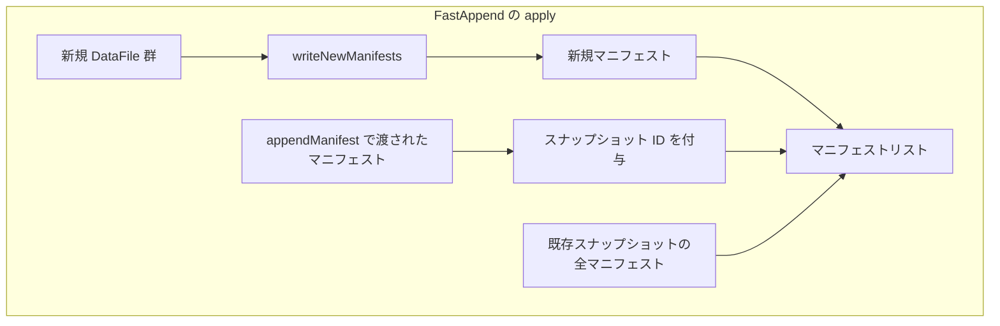
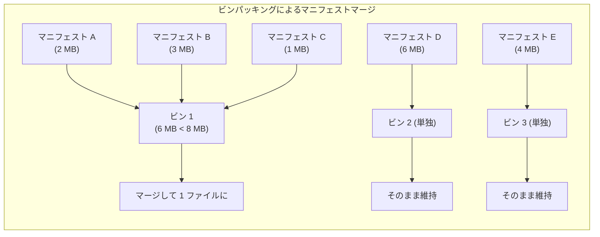
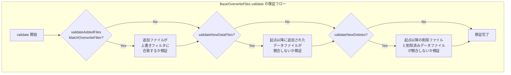
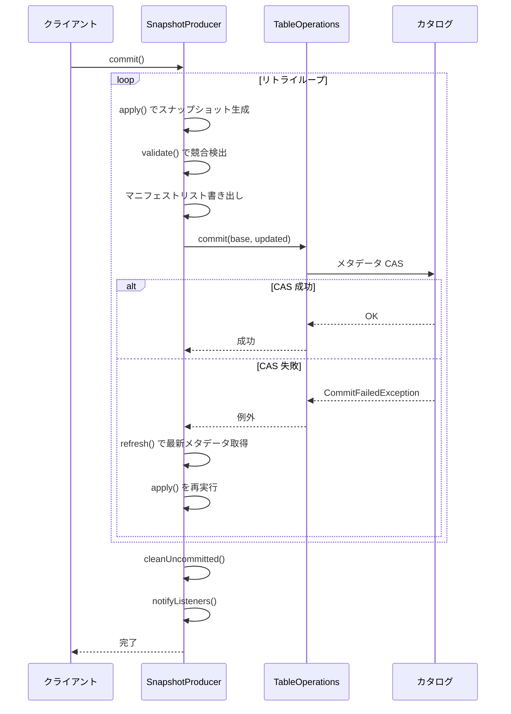

# 第10章 追記と上書き

> **本章で読むソース**
>
> - [`api/src/main/java/org/apache/iceberg/AppendFiles.java`](https://github.com/apache/iceberg/blob/apache-iceberg-1.11.0/api/src/main/java/org/apache/iceberg/AppendFiles.java)
> - [`core/src/main/java/org/apache/iceberg/FastAppend.java`](https://github.com/apache/iceberg/blob/apache-iceberg-1.11.0/core/src/main/java/org/apache/iceberg/FastAppend.java)
> - [`core/src/main/java/org/apache/iceberg/MergeAppend.java`](https://github.com/apache/iceberg/blob/apache-iceberg-1.11.0/core/src/main/java/org/apache/iceberg/MergeAppend.java)
> - [`api/src/main/java/org/apache/iceberg/OverwriteFiles.java`](https://github.com/apache/iceberg/blob/apache-iceberg-1.11.0/api/src/main/java/org/apache/iceberg/OverwriteFiles.java)
> - [`core/src/main/java/org/apache/iceberg/BaseOverwriteFiles.java`](https://github.com/apache/iceberg/blob/apache-iceberg-1.11.0/core/src/main/java/org/apache/iceberg/BaseOverwriteFiles.java)
> - [`core/src/main/java/org/apache/iceberg/SnapshotProducer.java`](https://github.com/apache/iceberg/blob/apache-iceberg-1.11.0/core/src/main/java/org/apache/iceberg/SnapshotProducer.java)
> - [`core/src/main/java/org/apache/iceberg/MergingSnapshotProducer.java`](https://github.com/apache/iceberg/blob/apache-iceberg-1.11.0/core/src/main/java/org/apache/iceberg/MergingSnapshotProducer.java)
> - [`core/src/main/java/org/apache/iceberg/ManifestMergeManager.java`](https://github.com/apache/iceberg/blob/apache-iceberg-1.11.0/core/src/main/java/org/apache/iceberg/ManifestMergeManager.java)

## この章の狙い

Iceberg テーブルへデータを追加する `AppendFiles` と、条件に基づいてデータを入れ替える `OverwriteFiles` の仕組みを理解する。
2 つの「追記」実装である `FastAppend` と `MergeAppend` がマニフェストファイルをどう扱い分けるか、上書き操作がどのように競合検出を組み込むか、そしてすべてのスナップショット生成に共通する楽観的並行制御のリトライループを追う。

## 前提

第2章でテーブルメタデータの構造を、第7章あるいは第8章でスナップショットとマニフェストの階層構造（メタデータファイル、マニフェストリスト、マニフェストファイル、データファイル）を把握していること。
仕様上のシーケンス番号とスナップショット ID の役割を知っていること。

## データ操作の分類

Iceberg 仕様はスナップショットを生成する操作を 4 種類に分類する。

[`api/src/main/java/org/apache/iceberg/DataOperations.java` L28-L38](https://github.com/apache/iceberg/blob/apache-iceberg-1.11.0/api/src/main/java/org/apache/iceberg/DataOperations.java#L28-L38)

```java
public class DataOperations {
  private DataOperations() {}

  /**
   * New data is appended to the table and no data is removed or deleted.
   *
   * <p>This operation is implemented by {@link AppendFiles}.
   */
  public static final String APPEND = "append";

  /**
```

`APPEND` はデータの追加のみ、`OVERWRITE` は追加と削除の組み合わせ、`DELETE` は削除のみ、`REPLACE` はデータの内容を変えずにファイルを入れ替える（コンパクション等）操作である。
本章では `APPEND` と `OVERWRITE` を扱う。

## AppendFiles API

**AppendFiles** は新しいデータファイルをテーブルに追加する API である。
インタフェースは 2 つのメソッドだけを定義する。

[`api/src/main/java/org/apache/iceberg/AppendFiles.java` L30-L34](https://github.com/apache/iceberg/blob/apache-iceberg-1.11.0/api/src/main/java/org/apache/iceberg/AppendFiles.java#L30-L34)

```java
public interface AppendFiles extends SnapshotUpdate<AppendFiles> {
  /**
   * Append a {@link DataFile} to the table.
   *
   * @param file a data file
```

`appendFile` は個々のデータファイルを追加する。
`appendManifest` はエンジン側で事前に構築したマニフェストファイルをそのまま渡す。
Spark のような書き込みエンジンは、タスクごとにマニフェストを書いてからまとめて渡すことが多い。

`BaseTable` は `newAppend()` で `MergeAppend` を、`newFastAppend()` で `FastAppend` を返す。

[`core/src/main/java/org/apache/iceberg/BaseTable.java` L190-L196](https://github.com/apache/iceberg/blob/apache-iceberg-1.11.0/core/src/main/java/org/apache/iceberg/BaseTable.java#L190-L196)

```java
  public AppendFiles newAppend() {
    return new MergeAppend(name, ops).reportWith(reporter);
  }

  @Override
  public AppendFiles newFastAppend() {
    return new FastAppend(name, ops).reportWith(reporter);
```

## FastAppend: マニフェストを追加するだけの軽量実装

**FastAppend** は `SnapshotProducer` を直接継承する。
既存マニフェストのマージを行わず、新しいマニフェストを先頭に追加して既存マニフェストをそのまま引き継ぐ。



### ファイルの蓄積

`appendFile` が呼ばれると、データファイルはパーティション仕様ごとに `newDataFilesBySpec` マップへ蓄積される。

[`core/src/main/java/org/apache/iceberg/FastAppend.java` L77-L96](https://github.com/apache/iceberg/blob/apache-iceberg-1.11.0/core/src/main/java/org/apache/iceberg/FastAppend.java#L77-L96)

```java
  @Override
  public FastAppend appendFile(DataFile file) {
    Preconditions.checkNotNull(file, "Invalid data file: null");
    PartitionSpec spec = spec(file.specId());
    Preconditions.checkArgument(
        spec != null,
        "Cannot find partition spec %s for data file: %s",
        file.specId(),
        file.location());

    DataFileSet dataFiles =
        newDataFilesBySpec.computeIfAbsent(spec.specId(), ignored -> DataFileSet.create());

    if (dataFiles.add(file)) {
      this.hasNewFiles = true;
      summaryBuilder.addedFile(spec, file);
    }

    return this;
  }
```

`DataFileSet` は重複を排除する集合であり、同じファイルを二重に追加しても 1 回だけカウントされる。

### スナップショットの構築

`apply` メソッドでは 3 種類のマニフェストを連結してマニフェストリストを構成する。

[`core/src/main/java/org/apache/iceberg/FastAppend.java` L146-L172](https://github.com/apache/iceberg/blob/apache-iceberg-1.11.0/core/src/main/java/org/apache/iceberg/FastAppend.java#L146-L172)

```java
  @Override
  public List<ManifestFile> apply(TableMetadata base, Snapshot snapshot) {
    List<ManifestFile> manifests = Lists.newArrayList();

    try {
      List<ManifestFile> newWrittenManifests = writeNewManifests();
      if (newWrittenManifests != null) {
        manifests.addAll(newWrittenManifests);
      }
    } catch (IOException e) {
      throw new RuntimeIOException(e, "Failed to write manifest");
    }

    Iterable<ManifestFile> appendManifestsWithMetadata =
        Iterables.transform(
            Iterables.concat(appendManifests, rewrittenAppendManifests),
            manifest -> GenericManifestFile.copyOf(manifest).withSnapshotId(snapshotId()).build());
    Iterables.addAll(manifests, appendManifestsWithMetadata);

    if (snapshot != null) {
      manifests.addAll(snapshot.allManifests(ops().io()));
    }

    summaryBuilder.merge(buildManifestCountSummary(manifests, 0));

    return manifests;
  }
```

既存スナップショットのマニフェストは `snapshot.allManifests(ops().io())` でそのまま末尾に追加される。
マニフェストの書き換えやマージは一切行わない。
この単純さが「Fast」の名前の由来である。

### リトライ時のマニフェスト再利用

`writeNewManifests` は、リトライ時に前回書いたマニフェストを削除してから書き直す。

[`core/src/main/java/org/apache/iceberg/FastAppend.java` L204-L217](https://github.com/apache/iceberg/blob/apache-iceberg-1.11.0/core/src/main/java/org/apache/iceberg/FastAppend.java#L204-L217)

```java
  private List<ManifestFile> writeNewManifests() throws IOException {
    if (hasNewFiles && !newManifests.isEmpty()) {
      newManifests.forEach(file -> deleteFile(file.path()));
      newManifests.clear();
    }

    if (newManifests.isEmpty() && !newDataFilesBySpec.isEmpty()) {
      newDataFilesBySpec.forEach(
          (specId, dataFiles) -> newManifests.addAll(writeDataManifests(dataFiles, spec(specId))));
      hasNewFiles = false;
    }

    return newManifests;
  }
```

`hasNewFiles` フラグが立っていてかつ既にマニフェストが書かれている場合、前回のマニフェストファイルを削除してから再生成する。
新しいファイルが追加されていなければ、前回書いたマニフェストをそのまま再利用する。

## MergeAppend: マニフェストをマージする標準実装

**MergeAppend** は `MergingSnapshotProducer` を継承する。
クラス自体は薄いラッパーであり、主要な処理はすべて親クラスに委譲される。

[`core/src/main/java/org/apache/iceberg/MergeAppend.java` L24-L65](https://github.com/apache/iceberg/blob/apache-iceberg-1.11.0/core/src/main/java/org/apache/iceberg/MergeAppend.java#L24-L65)

```java
class MergeAppend extends MergingSnapshotProducer<AppendFiles> implements AppendFiles {
  MergeAppend(String tableName, TableOperations ops) {
    super(tableName, ops);
  }

  @Override
  protected AppendFiles self() {
    return this;
  }

  @Override
  protected String operation() {
    return DataOperations.APPEND;
  }

  @Override
  public MergeAppend appendFile(DataFile file) {
    add(file);
    return this;
  }

  // ... (中略) ...

  @Override
  public AppendFiles appendManifest(ManifestFile manifest) {
    Preconditions.checkArgument(
        !manifest.hasExistingFiles(), "Cannot append manifest with existing files");
    Preconditions.checkArgument(
        !manifest.hasDeletedFiles(), "Cannot append manifest with deleted files");
    // ... (中略) ...
    add(manifest);
    return this;
  }
}
```

`appendFile` は親の `add(DataFile)` を、`appendManifest` は親の `add(ManifestFile)` を呼ぶだけである。

### MergingSnapshotProducer の apply

`MergingSnapshotProducer.apply` は「FastAppend」とは異なり、既存マニフェストのフィルタリングとマージを行う。

[`core/src/main/java/org/apache/iceberg/MergingSnapshotProducer.java` L973-L1040](https://github.com/apache/iceberg/blob/apache-iceberg-1.11.0/core/src/main/java/org/apache/iceberg/MergingSnapshotProducer.java#L973-L1040)

```java
  @Override
  public List<ManifestFile> apply(TableMetadata base, Snapshot snapshot) {
    validateDeleteFilesForVersion(base.formatVersion());
    // filter any existing manifests
    List<ManifestFile> filtered =
        filterManager.filterManifests(
            SnapshotUtil.schemaFor(base, targetBranch()),
            snapshot != null ? snapshot.dataManifests(ops().io()) : null);
    // ... (中略) ...

    // only keep manifests that have live data files or that were written by this commit
    Predicate<ManifestFile> shouldKeep =
        manifest ->
            manifest.hasAddedFiles()
                || manifest.hasExistingFiles()
                || manifest.snapshotId() == snapshotId();
    Iterable<ManifestFile> unmergedManifests =
        Iterables.filter(Iterables.concat(prepareNewDataManifests(), filtered), shouldKeep);
    Iterable<ManifestFile> unmergedDeleteManifests =
        Iterables.filter(Iterables.concat(prepareDeleteManifests(), filteredDeletes), shouldKeep);

    // ... (中略) ...

    List<ManifestFile> manifests = Lists.newArrayList();
    Iterables.addAll(manifests, mergeManager.mergeManifests(unmergedManifests));
    Iterables.addAll(manifests, deleteMergeManager.mergeManifests(unmergedDeleteManifests));

    // ... (中略) ...

    return manifests;
  }
```

処理の流れは 4 段階ある。

1. `filterManager.filterManifests` で、削除対象のファイルを含む既存マニフェストを書き換える
2. 新規データファイルから作ったマニフェストと、フィルタ済みの既存マニフェストを結合する
3. 生きたデータファイルを持たない空マニフェストを除去する
4. `mergeManager.mergeManifests` でビンパッキングによるマニフェストマージを実行する

追記だけの操作（`MergeAppend`）では削除対象がないため手順 1 の書き換えは発生しないが、マニフェストの数が閾値を超えるとマージが走る。

## FastAppend と MergeAppend の使い分け

2 つの実装の違いを整理する。

| 特性 | FastAppend | MergeAppend |
|------|-----------|-------------|
| 継承元 | `SnapshotProducer` | `MergingSnapshotProducer` |
| マニフェストマージ | しない | する |
| 既存マニフェストの扱い | そのまま引き継ぐ | ビンパッキングで統合 |
| コミット速度 | 速い | マージ分だけ遅い |
| マニフェスト数の増加 | 増え続ける | 制御される |
| 用途 | ストリーミング書き込み等の高頻度追記 | バッチ書き込み（デフォルト） |

`newAppend()` のデフォルトが `MergeAppend` である理由は、追記を繰り返すとマニフェストの数が際限なく増え、スキャン性能が劣化するためである。
一方、ストリーミング書き込みのように 1 コミットあたりのファイル数が少なく、コミットのレイテンシが重要な場合は `newFastAppend()` を使い、定期的なコンパクションでマニフェストを統合する運用が推奨される。

## マニフェストマージの仕組み: ManifestMergeManager

`MergeAppend` が利用する**マニフェストマージ**の中心は `ManifestMergeManager` である。
マージの戦略はビンパッキングアルゴリズムに基づく。

### マージの判断基準

コンストラクタで 3 つのパラメータを受け取る。

[`core/src/main/java/org/apache/iceberg/ManifestMergeManager.java` L42-L240](https://github.com/apache/iceberg/blob/apache-iceberg-1.11.0/core/src/main/java/org/apache/iceberg/ManifestMergeManager.java#L42-L240)

```java
abstract class ManifestMergeManager<F extends ContentFile<F>> {
  private final long targetSizeBytes;
  private final int minCountToMerge;
  private final boolean mergeEnabled;

  // track manifests replaced during bin-packing
  private final AtomicInteger replacedManifestsCount = new AtomicInteger(0);
  // cache merge results to reuse when retrying
  private final Map<List<ManifestFile>, ManifestFile> mergedManifests = Maps.newConcurrentMap();
  // ... (中略) ...
}
```

`targetSizeBytes` はマニフェストファイルの目標サイズであり、テーブルプロパティ `write.manifest.target-size-bytes`（デフォルト 8 MB）で制御する。
`minCountToMerge` はマージを開始する最小マニフェスト数であり、`write.manifest.min-count-to-merge`（デフォルト 100）で制御する。
`mergeEnabled` が `false` のときはマージ自体を行わない。

### ビンパッキングによるグループ化

`mergeManifests` はマニフェストをパーティション仕様ごとにグループ化し、各グループに対してビンパッキングを適用する。

[`core/src/main/java/org/apache/iceberg/ManifestMergeManager.java` L79-L94](https://github.com/apache/iceberg/blob/apache-iceberg-1.11.0/core/src/main/java/org/apache/iceberg/ManifestMergeManager.java#L79-L94)

```java
  Iterable<ManifestFile> mergeManifests(Iterable<ManifestFile> manifests) {
    Iterator<ManifestFile> manifestIter = manifests.iterator();
    if (!mergeEnabled || !manifestIter.hasNext()) {
      return manifests;
    }

    ManifestFile first = manifestIter.next();

    List<ManifestFile> merged = Lists.newArrayList();
    ListMultimap<Integer, ManifestFile> groups = groupBySpec(first, manifestIter);
    for (Integer specId : groups.keySet()) {
      Iterables.addAll(merged, mergeGroup(first, specId, groups.get(specId)));
    }

    return merged;
  }
```

先頭のマニフェスト（新規データファイルのマニフェスト）を `first` として記録し、特別扱いする。
`first` を含むビンは `minCountToMerge` に達していなければマージをスキップする。
これにより、新しいマニフェストと古い大きなマニフェストが不必要に統合されることを防ぐ。

[`core/src/main/java/org/apache/iceberg/ManifestMergeManager.java` L140-L185](https://github.com/apache/iceberg/blob/apache-iceberg-1.11.0/core/src/main/java/org/apache/iceberg/ManifestMergeManager.java#L140-L185)

```java
  private Iterable<ManifestFile> mergeGroup(
      ManifestFile first, int specId, List<ManifestFile> group) {
    // use a lookback of 1 to avoid reordering the manifests. using 1 also means this should pack
    // from the end so that the manifest that gets under-filled is the first one, which will be
    // merged the next time.
    ListPacker<ManifestFile> packer = new ListPacker<>(targetSizeBytes, 1, false);
    List<List<ManifestFile>> bins = packer.packEnd(group, ManifestFile::length);

    // ... (中略) ...

    Tasks.range(bins.size())
        .stopOnFailure()
        .throwFailureWhenFinished()
        .executeWith(workerPoolSupplier.get())
        .run(
            index -> {
              List<ManifestFile> bin = bins.get(index);
              List<ManifestFile> outputManifests = Lists.newArrayList();
              binResults[index] = outputManifests;

              if (bin.size() == 1) {
                // no need to rewrite
                outputManifests.add(bin.get(0));
                return;
              }

              if (bin.contains(first) && bin.size() < minCountToMerge) {
                // not enough to merge, add all manifest files to the output list
                outputManifests.addAll(bin);
              } else {
                // merge the bin into a single manifest
                outputManifests.add(createManifest(specId, bin));
              }
            });

    return Iterables.concat(binResults);
  }
```



ビンパッキングは `ListPacker` の `packEnd` を使い、末尾から詰めていく。
lookback を 1 に設定することで、マニフェストの順序が大きく入れ替わることを防ぐ。
充填不足になるビンは先頭に集まるため、次回のコミットでマージ対象になる。

### 設計上の工夫: マージ結果のキャッシュ

`ManifestMergeManager` はマージ結果を `mergedManifests` マップにキャッシュする。

[`core/src/main/java/org/apache/iceberg/ManifestMergeManager.java` L187-L239](https://github.com/apache/iceberg/blob/apache-iceberg-1.11.0/core/src/main/java/org/apache/iceberg/ManifestMergeManager.java#L187-L239)

```java
  private ManifestFile createManifest(int specId, List<ManifestFile> bin) {
    // if this merge was already rewritten, use the existing file.
    // if the new files are in this merge, then the ManifestFile for the new files has changed and
    // will be a cache miss.
    if (mergedManifests.containsKey(bin)) {
      return mergedManifests.get(bin);
    }

    ManifestWriter<F> writer = newManifestWriter(spec(specId));
    boolean threw = true;
    try {
      for (ManifestFile manifest : bin) {
        boolean isCommitted =
            manifest.snapshotId() != null && snapshotId() != manifest.snapshotId();
        try (ManifestReader<F> reader = newManifestReader(manifest, isCommitted)) {
          for (ManifestEntry<F> entry : reader.entries()) {
            if (entry.status() == Status.DELETED) {
              if (entry.snapshotId() == snapshotId()) {
                writer.delete(entry);
              }
            } else if (entry.status() == Status.ADDED && entry.snapshotId() == snapshotId()) {
              writer.add(entry);
            } else {
              writer.existing(entry);
            }
          }
        } catch (IOException e) {
          throw new RuntimeIOException(e, "Failed to close manifest reader");
        }
      }
      threw = false;
    } finally {
      Exceptions.close(writer, threw);
    }

    ManifestFile manifest = writer.toManifestFile();

    // cache the merged manifest to reuse when retrying and track replaced manifests
    mergedManifests.put(bin, manifest);
    // ... (中略) ...

    return manifest;
  }
```

キャッシュキーはマニフェストファイルのリスト（ビン）そのものである。
楽観的並行制御のリトライ時、新規データファイルのマニフェストが変わるとキャッシュミスになるが、既存マニフェスト同士のマージ結果はヒットする。
大規模テーブルでリトライが発生した場合、既存マニフェストの読み込みと書き出しを繰り返さずに済むため、コミット全体の実行時間を抑えられる。

## OverwriteFiles API

**OverwriteFiles** は、条件に合致するデータファイルを削除しつつ新しいデータファイルを追加する API である。
べき等な書き込み（日次パーティションの全データを毎回置き換えるなど）と、フィルタ付きの非べき等な更新の両方をサポートする。

[`api/src/main/java/org/apache/iceberg/OverwriteFiles.java` L44-L172](https://github.com/apache/iceberg/blob/apache-iceberg-1.11.0/api/src/main/java/org/apache/iceberg/OverwriteFiles.java#L44-L172)

```java
public interface OverwriteFiles extends SnapshotUpdate<OverwriteFiles> {
  OverwriteFiles overwriteByRowFilter(Expression expr);

  OverwriteFiles addFile(DataFile file);

  OverwriteFiles deleteFile(DataFile file);
  // ... (中略) ...
}
```

`overwriteByRowFilter` は行レベルの式で削除対象を指定する。
パーティションの包含射影（inclusive projection）で候補ファイルを選び、厳密射影（strict projection）で全行が条件に合致するファイルだけを削除する。
一部の行だけが条件に合致するファイルが見つかった場合は `ValidationException` を投げる。

### 競合検出の設定

非べき等な操作では、並行して追加されたデータや削除が自分の操作と矛盾しないことを検証する必要がある。
`OverwriteFiles` はそのための 4 つのメソッドを持つ。

[`api/src/main/java/org/apache/iceberg/OverwriteFiles.java` L113-L171](https://github.com/apache/iceberg/blob/apache-iceberg-1.11.0/api/src/main/java/org/apache/iceberg/OverwriteFiles.java#L113-L171)

```java
  OverwriteFiles validateFromSnapshot(long snapshotId);

  // ... (中略) ...

  OverwriteFiles conflictDetectionFilter(Expression conflictDetectionFilter);

  OverwriteFiles validateNoConflictingData();

  OverwriteFiles validateNoConflictingDeletes();
```

`validateFromSnapshot` は検証の起点となるスナップショット ID を指定する。
`conflictDetectionFilter` は競合検出に使う式を指定する。
`validateNoConflictingData` を有効にすると、起点スナップショット以降に追加されたデータファイルのうち、競合検出フィルタに合致するものが存在すれば操作を中断する。
`validateNoConflictingDeletes` を有効にすると、起点以降に追加された削除ファイルや、削除されたデータファイルが競合検出フィルタに合致すれば中断する。

## BaseOverwriteFiles の実装

**BaseOverwriteFiles** は `MergingSnapshotProducer` を継承し、`OverwriteFiles` を実装する。
操作の種類は追加と削除の組み合わせに応じて動的に決まる。

[`core/src/main/java/org/apache/iceberg/BaseOverwriteFiles.java` L49-L60](https://github.com/apache/iceberg/blob/apache-iceberg-1.11.0/core/src/main/java/org/apache/iceberg/BaseOverwriteFiles.java#L49-L60)

```java
  @Override
  protected String operation() {
    if (deletesDataFiles() && !addsDataFiles()) {
      return DataOperations.DELETE;
    }

    if (addsDataFiles() && !deletesDataFiles()) {
      return DataOperations.APPEND;
    }

    return DataOperations.OVERWRITE;
  }
```

追加のみなら `APPEND`、削除のみなら `DELETE`、両方なら `OVERWRITE` を返す。
スナップショットの `operation` フィールドに記録され、後のスナップショット期限切れ処理が不要なクリーンアップ（例えば `APPEND` では削除ファイルのクリーンアップが不要）をスキップする際に使われる。

### validate メソッド: 競合検出の実行

`validate` は `SnapshotProducer.apply()` の中からコミット直前に呼ばれる。

[`core/src/main/java/org/apache/iceberg/BaseOverwriteFiles.java` L135-L176](https://github.com/apache/iceberg/blob/apache-iceberg-1.11.0/core/src/main/java/org/apache/iceberg/BaseOverwriteFiles.java#L135-L176)

```java
  @Override
  protected void validate(TableMetadata base, Snapshot parent) {
    if (validateAddedFilesMatchOverwriteFilter) {
      PartitionSpec spec = dataSpec();
      Expression rowFilter = rowFilter();

      Expression inclusiveExpr = Projections.inclusive(spec).project(rowFilter);
      Evaluator inclusive = new Evaluator(spec.partitionType(), inclusiveExpr);

      Expression strictExpr = Projections.strict(spec).project(rowFilter);
      Evaluator strict = new Evaluator(spec.partitionType(), strictExpr);

      StrictMetricsEvaluator metrics =
          new StrictMetricsEvaluator(base.schema(), rowFilter, isCaseSensitive());

      for (DataFile file : addedDataFiles()) {
        // the real test is that the strict or metrics test matches the file, indicating that all
        // records in the file match the filter. inclusive is used to avoid testing the metrics,
        // which is more complicated
        ValidationException.check(
            inclusive.eval(file.partition())
                && (strict.eval(file.partition()) || metrics.eval(file)),
            "Cannot append file with rows that do not match filter: %s: %s",
            rowFilter,
            file.location());
      }
    }

    if (validateNewDataFiles) {
      validateAddedDataFiles(base, startingSnapshotId, dataConflictDetectionFilter(), parent);
    }

    if (validateNewDeletes) {
      if (rowFilter() != Expressions.alwaysFalse()) {
        Expression filter = conflictDetectionFilter != null ? conflictDetectionFilter : rowFilter();
        validateNoNewDeleteFiles(base, startingSnapshotId, filter, parent);
        validateDeletedDataFiles(base, startingSnapshotId, filter, parent);
      }

      if (!deletedDataFiles.isEmpty()) {
        validateNoNewDeletesForDataFiles(
            base, startingSnapshotId, conflictDetectionFilter, deletedDataFiles, parent);
```

検証は 3 段階で構成される。

1. `validateAddedFilesMatchOverwriteFilter` が有効な場合、追加するファイルの全行が上書きフィルタに合致することを、パーティション射影とメトリクスで確認する。これにより、べき等性が保証される。つまり、同じ操作を再度実行したとしても、追加したファイルが削除対象に含まれる。
2. `validateNewDataFiles` が有効な場合、起点スナップショット以降に並行して追加されたデータファイルが競合検出フィルタに合致しないことを確認する。
3. `validateNewDeletes` が有効な場合、起点以降に追加された削除ファイルと、削除されたデータファイルが競合しないことを確認する。



### 競合検出フィルタの決定ロジック

`dataConflictDetectionFilter` メソッドは、データファイルの競合検出に使うフィルタを決定する。

[`core/src/main/java/org/apache/iceberg/BaseOverwriteFiles.java` L181-L189](https://github.com/apache/iceberg/blob/apache-iceberg-1.11.0/core/src/main/java/org/apache/iceberg/BaseOverwriteFiles.java#L181-L189)

```java
  private Expression dataConflictDetectionFilter() {
    if (conflictDetectionFilter != null) {
      return conflictDetectionFilter;
    } else if (rowFilter() != Expressions.alwaysFalse() && deletedDataFiles.isEmpty()) {
      return rowFilter();
    } else {
      return Expressions.alwaysTrue();
    }
  }
```

明示的に `conflictDetectionFilter` が設定されていればそれを使う。
行フィルタが設定されていて個別ファイルの削除がない場合は行フィルタをそのまま使う。
それ以外は `alwaysTrue()`（全ファイルを検査対象にする）にフォールバックする。
最も緩い条件が `alwaysTrue` であるため、フィルタを明示しない非べき等操作は、並行する任意のデータ追加で失敗する安全側の振る舞いになる。

## 楽観的並行制御: SnapshotProducer.commit

`AppendFiles` と `OverwriteFiles` の両方が利用する共通のコミットループは `SnapshotProducer.commit` に実装されている。

[`core/src/main/java/org/apache/iceberg/SnapshotProducer.java` L457-L501](https://github.com/apache/iceberg/blob/apache-iceberg-1.11.0/core/src/main/java/org/apache/iceberg/SnapshotProducer.java#L457-L501)

```java
  @Override
  @SuppressWarnings("checkstyle:CyclomaticComplexity")
  public void commit() {
    // this is always set to the latest commit attempt's snapshot id.
    AtomicLong newSnapshotId = new AtomicLong(-1L);
    try (Timed ignore = commitMetrics().totalDuration().start()) {
      try {
        Tasks.foreach(ops)
            .retry(base.propertyAsInt(COMMIT_NUM_RETRIES, COMMIT_NUM_RETRIES_DEFAULT))
            .exponentialBackoff(
                base.propertyAsInt(COMMIT_MIN_RETRY_WAIT_MS, COMMIT_MIN_RETRY_WAIT_MS_DEFAULT),
                base.propertyAsInt(COMMIT_MAX_RETRY_WAIT_MS, COMMIT_MAX_RETRY_WAIT_MS_DEFAULT),
                base.propertyAsInt(COMMIT_TOTAL_RETRY_TIME_MS, COMMIT_TOTAL_RETRY_TIME_MS_DEFAULT),
                2.0 /* exponential */)
            .onlyRetryOn(CommitFailedException.class)
            .countAttempts(commitMetrics().attempts())
            .run(
                taskOps -> {
                  Snapshot newSnapshot = apply();
                  newSnapshotId.set(newSnapshot.snapshotId());
                  TableMetadata.Builder update = TableMetadata.buildFrom(base);
                  if (base.snapshot(newSnapshot.snapshotId()) != null) {
                    // this is a rollback operation
                    update.setBranchSnapshot(newSnapshot.snapshotId(), targetBranch);
                  } else if (stageOnly) {
                    update.addSnapshot(newSnapshot);
                  } else {
                    update.setBranchSnapshot(newSnapshot, targetBranch);
                  }

                  TableMetadata updated = update.build();
                  if (updated.changes().isEmpty()) {
                    // do not commit if the metadata has not changed. for example, this may happen
                    // when setting the current
                    // snapshot to an ID that is already current. note that this check uses
                    // identity.
                    return;
                  }

                  // if the table UUID is missing, add it here. the UUID will be re-created each
                  // time
                  // this operation retries
                  // to ensure that if a concurrent operation assigns the UUID, this operation will
                  // not fail.
                  taskOps.commit(base, updated.withUUID());
```

リトライ対象は `CommitFailedException` のみである。
`ValidationException`（競合検出の失敗）はリトライされず即座に呼び出し元へ伝播する。
リトライ時は `apply()` が再度呼ばれ、最新のテーブルメタデータに対して変更を再適用する。

### リトライのパラメータ

リトライに関するテーブルプロパティは以下の 4 つである。

| プロパティ | デフォルト値 | 意味 |
|-----------|------------|------|
| `commit.retry.num-retries` | 4 | 最大リトライ回数 |
| `commit.retry.min-wait-ms` | 100 | 最小待ち時間（ミリ秒） |
| `commit.retry.max-wait-ms` | 60000 | 最大待ち時間（ミリ秒） |
| `commit.retry.total-timeout-ms` | 1800000 | リトライ全体のタイムアウト（ミリ秒） |

バックオフは指数関数的に増加する（倍率 2.0）。

### コミット成功後のクリーンアップ

コミット成功後は、使われなかったマニフェストやマニフェストリストを削除する。

[`core/src/main/java/org/apache/iceberg/SnapshotProducer.java` L521-L533](https://github.com/apache/iceberg/blob/apache-iceberg-1.11.0/core/src/main/java/org/apache/iceberg/SnapshotProducer.java#L521-L533)

```java
        Snapshot saved = ops.refresh().snapshot(newSnapshotId.get());
        if (saved != null) {
          if (cleanupAfterCommit()) {
            cleanUncommitted(Sets.newHashSet(saved.allManifests(ops.io())));
          }

          // also clean up unused manifest lists created by multiple attempts
          for (String manifestList : manifestLists) {
            if (!saved.manifestListLocation().equals(manifestList)) {
              deleteFile(manifestList);
            }
          }
        } else {
```

`cleanUncommitted` は抽象メソッドであり、各実装がコミットされたマニフェスト集合と自分が書いたマニフェストを比較して、使われなかったものを削除する。
マニフェストリストについても、最終的にコミットされたもの以外をすべて削除する。



## validationHistory: 並行変更の履歴走査

競合検出で並行変更を見つけるには、起点スナップショットから現在のスナップショットまでの祖先チェーンをたどる必要がある。
`MergingSnapshotProducer` の `validationHistory` がその役割を担う。

[`core/src/main/java/org/apache/iceberg/MergingSnapshotProducer.java` L913-L953](https://github.com/apache/iceberg/blob/apache-iceberg-1.11.0/core/src/main/java/org/apache/iceberg/MergingSnapshotProducer.java#L913-L953)

```java
  private Pair<List<ManifestFile>, Set<Long>> validationHistory(
      TableMetadata base,
      Long startingSnapshotId,
      Set<String> matchingOperations,
      ManifestContent content,
      Snapshot parent) {
    List<ManifestFile> manifests = Lists.newArrayList();
    Set<Long> newSnapshots = Sets.newHashSet();

    Snapshot lastSnapshot = null;
    Iterable<Snapshot> snapshots =
        SnapshotUtil.ancestorsBetween(parent.snapshotId(), startingSnapshotId, base::snapshot);
    for (Snapshot currentSnapshot : snapshots) {
      lastSnapshot = currentSnapshot;

      if (matchingOperations.contains(currentSnapshot.operation())) {
        newSnapshots.add(currentSnapshot.snapshotId());
        if (content == ManifestContent.DATA) {
          for (ManifestFile manifest : currentSnapshot.dataManifests(ops().io())) {
            if (manifest.snapshotId() == currentSnapshot.snapshotId()) {
              manifests.add(manifest);
            }
          }
        } else {
          for (ManifestFile manifest : currentSnapshot.deleteManifests(ops().io())) {
            if (manifest.snapshotId() == currentSnapshot.snapshotId()) {
              manifests.add(manifest);
            }
          }
        }
      }
    }

    // ... (中略) ...

    return Pair.of(manifests, newSnapshots);
  }
```

起点から現在のスナップショットまでの間にある各スナップショットについて、その操作種別が `matchingOperations` に含まれているかを確認する。
含まれている場合、そのスナップショットが新たに作成したマニフェスト（`manifest.snapshotId() == currentSnapshot.snapshotId()`）だけを収集する。
マージによって引き継がれたマニフェストは除外されるため、真に並行して追加されたファイルだけが検出対象になる。

## まとめ

- **AppendFiles** はデータファイルをテーブルに追加する API であり、**FastAppend** と **MergeAppend** の 2 つの実装がある
- 「FastAppend」は新しいマニフェストを先頭に追加するだけの軽量実装であり、マニフェストの数が増え続ける代わりにコミットが速い
- 「MergeAppend」は `MergingSnapshotProducer` を通じてビンパッキングによるマニフェストマージを行い、マニフェスト数の増加を抑制する
- 「ManifestMergeManager」はマージ結果をキャッシュし、楽観的並行制御のリトライ時に既存マニフェストの再マージを回避する
- **OverwriteFiles** は行フィルタまたは個別ファイル指定でデータを削除しつつ新しいデータを追加する API である
- 「BaseOverwriteFiles」の `validate` メソッドは、並行して追加されたデータや削除がフィルタに合致しないことを 3 段階で検証し、非べき等操作の分離性を保証する
- すべてのスナップショット更新は `SnapshotProducer.commit` の楽観的並行制御ループで実行され、`CommitFailedException` に対してのみ指数バックオフで最大 4 回リトライする

## 関連する章

- [第2章 テーブルメタデータとフォーマットバージョン](../part00-overview/02-table-metadata.md)
