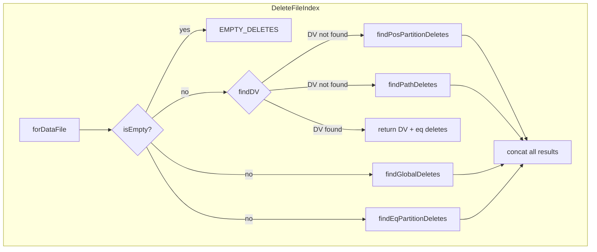

# 第11章 行レベル更新と削除ファイル

> **本章で読むソース**
>
> - [`api/src/main/java/org/apache/iceberg/RowDelta.java`](https://github.com/apache/iceberg/blob/apache-iceberg-1.11.0/api/src/main/java/org/apache/iceberg/RowDelta.java)
> - [`core/src/main/java/org/apache/iceberg/BaseRowDelta.java`](https://github.com/apache/iceberg/blob/apache-iceberg-1.11.0/core/src/main/java/org/apache/iceberg/BaseRowDelta.java)
> - [`api/src/main/java/org/apache/iceberg/DeleteFile.java`](https://github.com/apache/iceberg/blob/apache-iceberg-1.11.0/api/src/main/java/org/apache/iceberg/DeleteFile.java)
> - [`core/src/main/java/org/apache/iceberg/DeleteFileIndex.java`](https://github.com/apache/iceberg/blob/apache-iceberg-1.11.0/core/src/main/java/org/apache/iceberg/DeleteFileIndex.java)
> - [`core/src/main/java/org/apache/iceberg/DeletionVector.java`](https://github.com/apache/iceberg/blob/apache-iceberg-1.11.0/core/src/main/java/org/apache/iceberg/DeletionVector.java)

## この章の狙い

Iceberg が行レベルの削除と更新をどのように実現するかを理解する。
フォーマットバージョン V2 で導入された**位置削除**（Position Delete）と**等値削除**（Equality Delete）、V3 で導入された**削除ベクトル**（Deletion Vector）の仕様上の違いを整理し、参照実装がこれらを `RowDelta` オペレーションと `DeleteFileIndex` でどう管理しているかを追う。

## 前提

第2章のテーブルメタデータ、スナップショット、マニフェストの構造を前提とする。
特にシーケンス番号がスナップショットごとに単調増加し、削除ファイルの適用範囲を決定する仕組みを理解しておく必要がある。

## 行レベル削除の3つの方式

Iceberg の仕様は、データファイルそのものを書き換えることなく行を論理削除する仕組みとして、3 種類の**削除ファイル**を定義している。

### 位置削除（V2）

「位置削除」ファイルは、削除対象の行を「データファイルのパス」と「そのファイル内の行番号（0 始まり）」の組で指定する。
仕様上のコンテンツタイプは `POSITION_DELETES`（ID = 1）である。

[`api/src/main/java/org/apache/iceberg/FileContent.java` L24-L27](https://github.com/apache/iceberg/blob/apache-iceberg-1.11.0/api/src/main/java/org/apache/iceberg/FileContent.java#L24-L27)

```java
public enum FileContent {
  DATA(0),
  POSITION_DELETES(1),
  EQUALITY_DELETES(2),
```

位置削除ファイルの中身は `(file_path, pos)` のペアを格納した Parquet や Avro のファイルである。
特定のデータファイルだけを参照する場合、列統計の `file_path` 列の上限値と下限値が一致するため、スキャン時にそのデータファイル以外への適用を効率よくスキップできる。
この最適化は `ContentFileUtil.referencedDataFile()` で実装されている。

[`core/src/main/java/org/apache/iceberg/util/ContentFileUtil.java` L63-L89](https://github.com/apache/iceberg/blob/apache-iceberg-1.11.0/core/src/main/java/org/apache/iceberg/util/ContentFileUtil.java#L63-L89)

```java
  public static CharSequence referencedDataFile(DeleteFile deleteFile) {
    if (deleteFile.content() == FileContent.EQUALITY_DELETES) {
      return null;
    }

    if (deleteFile.referencedDataFile() != null) {
      return deleteFile.referencedDataFile();
    }

    Map<Integer, ByteBuffer> lowerBounds = deleteFile.lowerBounds();
    ByteBuffer lowerPathBound = lowerBounds != null ? lowerBounds.get(PATH_ID) : null;
    if (lowerPathBound == null) {
      return null;
    }

    Map<Integer, ByteBuffer> upperBounds = deleteFile.upperBounds();
    ByteBuffer upperPathBound = upperBounds != null ? upperBounds.get(PATH_ID) : null;
    if (upperPathBound == null) {
      return null;
    }

    if (lowerPathBound.equals(upperPathBound)) {
      return Conversions.fromByteBuffer(PATH_TYPE, lowerPathBound);
    } else {
      return null;
    }
  }
```

`file_path` 列の上限と下限が一致すれば、そのファイルは単一のデータファイルだけを対象としている。
一致しなければ `null` を返し、パーティション全体への適用候補となる。

### 等値削除（V2）

**等値削除**ファイルは、削除対象の行を列値の等値条件で指定する。
たとえば `user_id = 42` を含む等値削除ファイルがあれば、対象パーティション内のすべてのデータファイルから `user_id` が `42` の行が論理的に除外される。

等値削除ファイルのコンテンツタイプは `EQUALITY_DELETES`（ID = 2）である。
どの列で等値比較するかは `equalityFieldIds` で指定される。

[`api/src/main/java/org/apache/iceberg/ContentFile.java` L115-L125](https://github.com/apache/iceberg/blob/apache-iceberg-1.11.0/api/src/main/java/org/apache/iceberg/ContentFile.java#L115-L125)

```java
  /**
   * Returns the set of field IDs used for equality comparison, in equality delete files.
   *
   * <p>An equality delete file may contain additional data fields that are not used by equality
   * comparison. The subset of columns in a delete file to be used in equality comparison are
   * tracked by ID. Extra columns can be used to reconstruct changes and metrics from extra columns
   * are used during job planning.
   *
   * @return IDs of the fields used in equality comparison with the records in this delete file
   */
  List<Integer> equalityFieldIds();
```

等値削除は位置削除と異なり、データファイルのパスを知らなくてもよい。
その代わり、スキャン時にすべてのデータファイルの各行と照合する必要があり、読み取りコストが高い。

### 削除ベクトル（V3）

フォーマットバージョン V3 では、位置削除に代わり**削除ベクトル**（Deletion Vector）が導入された。
「削除ベクトル」はデータファイル内の削除行をビットマップで表現し、Puffin ファイル内に `deletion-vector-v1` 形式の blob として格納される。
1 つのデータファイルに対して最大 1 つの「削除ベクトル」が対応する。

V3 では新しい位置削除ファイル（Parquet 形式の `(file_path, pos)` ペア）をテーブルに追加してはならず、新規の位置削除には必ず「削除ベクトル」を使う。
ただし、V2 からアップグレードしたテーブルに既存の位置削除ファイルが残っている場合、それらは引き続き有効である。
この制約は `MergingSnapshotProducer.validateDeleteFileForVersion()` で検証される。

[`core/src/main/java/org/apache/iceberg/MergingSnapshotProducer.java` L295-L316](https://github.com/apache/iceberg/blob/apache-iceberg-1.11.0/core/src/main/java/org/apache/iceberg/MergingSnapshotProducer.java#L295-L316)

```java
  private static void validateDeleteFileForVersion(DeleteFile file, int formatVersion) {
    switch (formatVersion) {
      case 1:
        throw new IllegalArgumentException("Deletes are supported in V2 and above");
      case 2:
        Preconditions.checkArgument(
            file.content() == FileContent.EQUALITY_DELETES || !ContentFileUtil.isDV(file),
            "Must not use DVs for position deletes in V2: %s",
            ContentFileUtil.dvDesc(file));
        break;
      case 3:
      case 4:
        Preconditions.checkArgument(
            file.content() == FileContent.EQUALITY_DELETES || ContentFileUtil.isDV(file),
            "Must use DVs for position deletes in V%s: %s",
            formatVersion,
            file.location());
        break;
      default:
        throw new IllegalArgumentException("Unsupported format version: " + formatVersion);
    }
  }
```

V2 では「削除ベクトル」の追加を禁止し、V3 以降では新規の位置削除は「削除ベクトル」のみ許可する。
等値削除はバージョンに関係なく許可される。
「削除ベクトル」かどうかの判定は、ファイル形式が Puffin かどうかで行う。

[`core/src/main/java/org/apache/iceberg/util/ContentFileUtil.java` L142-L144](https://github.com/apache/iceberg/blob/apache-iceberg-1.11.0/core/src/main/java/org/apache/iceberg/util/ContentFileUtil.java#L142-L144)

```java
  public static boolean isDV(DeleteFile deleteFile) {
    return deleteFile.format() == FileFormat.PUFFIN;
  }
```

## DeleteFile インターフェース

**DeleteFile** は `ContentFile<DeleteFile>` を拡張するインターフェースであり、削除ファイル固有のメタデータを提供する。

[`api/src/main/java/org/apache/iceberg/DeleteFile.java` L23-L67](https://github.com/apache/iceberg/blob/apache-iceberg-1.11.0/api/src/main/java/org/apache/iceberg/DeleteFile.java#L23-L67)

```java
/** Interface for delete files listed in a table delete manifest. */
public interface DeleteFile extends ContentFile<DeleteFile> {
  // ... (中略) ...

  /**
   * Returns the location of a data file that all deletes reference.
   *
   * <p>The referenced data file is required for deletion vectors and may be optionally captured for
   * position delete files that apply to only one data file. This method always returns null for
   * equality delete files.
   */
  default String referencedDataFile() {
    return null;
  }

  /**
   * Returns the offset in the file where the content starts.
   *
   * <p>The content offset is required for deletion vectors and points to the start of the deletion
   * vector blob in the Puffin file, enabling direct access. This method always returns null for
   * equality and position delete files.
   */
  default Long contentOffset() {
    return null;
  }

  /**
   * Returns the length of referenced content stored in the file.
   *
   * <p>The content size is required for deletion vectors and indicates the size of the deletion
   * vector blob in the Puffin file, enabling direct access. This method always returns null for
   * equality and position delete files.
   */
  default Long contentSizeInBytes() {
    return null;
  }
}
```

「削除ベクトル」の場合、`referencedDataFile()` は対象のデータファイルパスを返す。
`contentOffset()` と `contentSizeInBytes()` は Puffin ファイル内の blob の位置とサイズを示し、ファイル全体を読まずに直接アクセスできるようにする。
等値削除と位置削除ではこれらは常に `null` である。

## DeletionVector: メタデータスキーマ

**DeletionVector** インターフェースは、マニフェスト内で「削除ベクトル」のメタデータを表現するスキーマを定義する。

[`core/src/main/java/org/apache/iceberg/DeletionVector.java` L29-L67](https://github.com/apache/iceberg/blob/apache-iceberg-1.11.0/core/src/main/java/org/apache/iceberg/DeletionVector.java#L29-L67)

```java
interface DeletionVector {
  Types.NestedField LOCATION =
      Types.NestedField.required(
          155, "location", Types.StringType.get(), "Location of the file containing the DV");
  Types.NestedField OFFSET =
      Types.NestedField.required(
          144, "offset", Types.LongType.get(), "Offset in the file where the DV content starts");
  Types.NestedField SIZE_IN_BYTES =
      Types.NestedField.required(
          145,
          "size_in_bytes",
          Types.LongType.get(),
          "Length of the referenced DV content stored in the file");
  Types.NestedField CARDINALITY =
      Types.NestedField.required(
          156,
          "cardinality",
          Types.LongType.get(),
          "Number of set bits (deleted rows) in the vector");

  static Types.StructType schema() {
    return Types.StructType.of(LOCATION, OFFSET, SIZE_IN_BYTES, CARDINALITY);
  }
  // ... (中略) ...
}
```

4 つのフィールドで「削除ベクトル」の位置と内容を特定する。

| フィールド | 型 | 説明 |
|-----------|------|------|
| `location` | string | Puffin ファイルのパス |
| `offset` | long | blob の開始オフセット |
| `size_in_bytes` | long | blob のバイト長 |
| `cardinality` | long | 削除済み行の数（ビットが立っている数） |

この設計により、複数のデータファイルの「削除ベクトル」を 1 つの Puffin ファイルにまとめつつ、各「削除ベクトル」へのランダムアクセスを可能にしている。

## RowDelta: 行レベル変更の API

**RowDelta** は行レベルの変更をテーブルに適用するための API である。
データファイルの追加と削除ファイルの追加を 1 つのコミットにまとめ、新しいスナップショットを生成する。

[`api/src/main/java/org/apache/iceberg/RowDelta.java` L32-L47](https://github.com/apache/iceberg/blob/apache-iceberg-1.11.0/api/src/main/java/org/apache/iceberg/RowDelta.java#L32-L47)

```java
public interface RowDelta extends SnapshotUpdate<RowDelta> {
  /**
   * Add a {@link DataFile} to the table.
   *
   * @param inserts a data file of rows to insert
   * @return this for method chaining
   */
  RowDelta addRows(DataFile inserts);

  /**
   * Add a {@link DeleteFile} to the table.
   *
   * @param deletes a delete file of rows to delete
   * @return this for method chaining
   */
  RowDelta addDeletes(DeleteFile deletes);
```

「RowDelta」は `SnapshotUpdate` を拡張するため、`commit()` を呼ぶと楽観的並行制御のもとでスナップショットが更新される。

### 競合検出のバリデーション

「RowDelta」は並行コミットとの整合性を保つために複数のバリデーションメソッドを提供する。

[`api/src/main/java/org/apache/iceberg/RowDelta.java` L80-L163](https://github.com/apache/iceberg/blob/apache-iceberg-1.11.0/api/src/main/java/org/apache/iceberg/RowDelta.java#L80-L163)

```java
  RowDelta validateFromSnapshot(long snapshotId);
  // ... (中略) ...
  RowDelta conflictDetectionFilter(Expression conflictDetectionFilter);
  // ... (中略) ...
  RowDelta validateNoConflictingDataFiles();
  // ... (中略) ...
  RowDelta validateNoConflictingDeleteFiles();
```

これらのメソッドは次の目的で使い分ける。

- `validateFromSnapshot`: バリデーション対象のスナップショット範囲を指定する
- `conflictDetectionFilter`: 競合検出の式フィルタを設定する
- `validateNoConflictingDataFiles`: UPDATE/DELETE 操作で直列化可能分離レベルを保証する
- `validateNoConflictingDeleteFiles`: UPDATE/MERGE 操作で同一行への並行削除を検出する

## BaseRowDelta: RowDelta の参照実装

**BaseRowDelta** は `MergingSnapshotProducer` を継承し、「RowDelta」を実装する。

### オペレーション種別の決定

コミット時のスナップショットに記録するオペレーション名は、追加されたファイルの種類から自動的に決まる。

[`core/src/main/java/org/apache/iceberg/BaseRowDelta.java` L49-L60](https://github.com/apache/iceberg/blob/apache-iceberg-1.11.0/core/src/main/java/org/apache/iceberg/BaseRowDelta.java#L49-L60)

```java
  @Override
  protected String operation() {
    if (addsDataFiles() && !addsDeleteFiles() && !deletesDataFiles()) {
      return DataOperations.APPEND;
    }

    if (addsDeleteFiles() && !addsDataFiles()) {
      return DataOperations.DELETE;
    }

    return DataOperations.OVERWRITE;
  }
```

データファイルの追加だけなら `append`、削除ファイルの追加だけなら `delete`、両方を含む場合は `overwrite` となる。
スナップショット有効期限の処理やインクリメンタルスキャンなど、後続のコンポーネントはこのオペレーション名を参照して最適化判断を行う。

### バリデーションの全体像

`BaseRowDelta.validate()` はコミット前に 5 つのバリデーションを実行する。

[`core/src/main/java/org/apache/iceberg/BaseRowDelta.java` L131-L174](https://github.com/apache/iceberg/blob/apache-iceberg-1.11.0/core/src/main/java/org/apache/iceberg/BaseRowDelta.java#L131-L174)

```java
  @Override
  protected void validate(TableMetadata base, Snapshot parent) {
    if (parent != null) {
      if (startingSnapshotId != null) {
        Preconditions.checkArgument(
            SnapshotUtil.isAncestorOf(parent.snapshotId(), startingSnapshotId, base::snapshot),
            "Snapshot %s is not an ancestor of %s",
            startingSnapshotId,
            parent.snapshotId());
      }
      if (!referencedDataFiles.isEmpty()) {
        validateDataFilesExist(
            base,
            startingSnapshotId,
            referencedDataFiles,
            !validateDeletes,
            conflictDetectionFilter,
            parent);
      }

      if (validateDeletes) {
        failMissingDeletePaths();
      }

      if (validateNewDataFiles) {
        validateAddedDataFiles(base, startingSnapshotId, conflictDetectionFilter, parent);
      }

      if (validateNewDeleteFiles) {
        // validate that explicitly deleted files have not had added deletes
        if (!removedDataFiles.isEmpty()) {
          validateNoNewDeletesForDataFiles(
              base, startingSnapshotId, conflictDetectionFilter, removedDataFiles, parent);
        }

        // validate that previous deletes do not conflict with added deletes
        validateNoNewDeleteFiles(base, startingSnapshotId, conflictDetectionFilter, parent);
      }

      validateNoConflictingFileAndPositionDeletes();

      validateAddedDVs(base, startingSnapshotId, conflictDetectionFilter, parent);
    }
  }
```

バリデーションの順序と内容を整理すると次のようになる。

1. `startingSnapshotId` が現在のスナップショットの祖先であることを確認する
2. 参照するデータファイルが削除されていないことを確認する
3. 並行追加されたデータファイルが競合しないことを確認する
4. 並行追加された削除ファイルが競合しないことを確認する
5. 同一データファイルの削除と「削除ベクトル」追加が同時に行われていないことを確認する
6. 並行追加された「削除ベクトル」が同じデータファイルを対象としていないことを確認する

最後の検証は `validateAddedDVs()` として独立しており、「削除ベクトル」がデータファイルと 1 対 1 対応する制約を維持する。

## DeleteFileIndex: 削除ファイルのルックアップ

**DeleteFileIndex** はスキャン時に使用される索引であり、あるデータファイルに適用すべき削除ファイルを高速に検索する。

### 内部データ構造

「DeleteFileIndex」は削除ファイルの種類に応じて 5 つのマップに分類して保持する。

[`core/src/main/java/org/apache/iceberg/DeleteFileIndex.java` L70-L80](https://github.com/apache/iceberg/blob/apache-iceberg-1.11.0/core/src/main/java/org/apache/iceberg/DeleteFileIndex.java#L70-L80)

```java
class DeleteFileIndex {
  private static final DeleteFile[] EMPTY_DELETES = new DeleteFile[0];

  private final EqualityDeletes globalDeletes;
  private final PartitionMap<EqualityDeletes> eqDeletesByPartition;
  private final PartitionMap<PositionDeletes> posDeletesByPartition;
  private final Map<String, PositionDeletes> posDeletesByPath;
  private final Map<String, DeleteFile> dvByPath;
  private final boolean hasEqDeletes;
  private final boolean hasPosDeletes;
  private final boolean isEmpty;
```

5 つの格納先の役割は次のとおりである。

| フィールド | 対象 | ルックアップキー |
|-----------|------|----------------|
| `globalDeletes` | 非パーティションテーブルの等値削除 | シーケンス番号 |
| `eqDeletesByPartition` | パーティションテーブルの等値削除 | パーティション + シーケンス番号 |
| `posDeletesByPartition` | 複数データファイルにまたがる位置削除 | パーティション + シーケンス番号 |
| `posDeletesByPath` | 単一データファイルを対象とする位置削除 | データファイルパス + シーケンス番号 |
| `dvByPath` | 削除ベクトル | データファイルパス |



### forDataFile: ルックアップの流れ

データファイルに適用すべき削除ファイルを検索するメソッドが `forDataFile()` である。

[`core/src/main/java/org/apache/iceberg/DeleteFileIndex.java` L151-L168](https://github.com/apache/iceberg/blob/apache-iceberg-1.11.0/core/src/main/java/org/apache/iceberg/DeleteFileIndex.java#L151-L168)

```java
  DeleteFile[] forDataFile(long sequenceNumber, DataFile file) {
    if (isEmpty) {
      return EMPTY_DELETES;
    }

    DeleteFile[] global = findGlobalDeletes(sequenceNumber, file);
    DeleteFile[] eqPartition = findEqPartitionDeletes(sequenceNumber, file);
    DeleteFile dv = findDV(sequenceNumber, file);
    if (dv != null && global == null && eqPartition == null) {
      return new DeleteFile[] {dv};
    } else if (dv != null) {
      return concat(global, eqPartition, new DeleteFile[] {dv});
    } else {
      DeleteFile[] posPartition = findPosPartitionDeletes(sequenceNumber, file);
      DeleteFile[] posPath = findPathDeletes(sequenceNumber, file);
      return concat(global, eqPartition, posPartition, posPath);
    }
  }
```

注目すべき点は、「削除ベクトル」が見つかった場合に位置削除ファイルの検索を省略する分岐である。
V3 では新規の位置削除は「削除ベクトル」のみであるため、「削除ベクトル」が存在する場合は `posDeletesByPartition` と `posDeletesByPath` を検索する必要がない。
V2 から V3 への移行期に両方が混在する場合も、「削除ベクトル」はデータファイルと 1 対 1 であるため、「削除ベクトル」があれば他の位置削除ファイルは適用対象外となる。

### シーケンス番号によるフィルタリング

位置削除と等値削除は、シーケンス番号に基づいて適用対象を絞り込む。
「削除ファイル」のシーケンス番号がデータファイルのシーケンス番号以上であるときのみ、その「削除ファイル」は適用される。

`PositionDeletes` クラスは削除ファイルをシーケンス番号の昇順にソートして保持し、二分探索で適用範囲を決定する。

[`core/src/main/java/org/apache/iceberg/DeleteFileIndex.java` L670-L742](https://github.com/apache/iceberg/blob/apache-iceberg-1.11.0/core/src/main/java/org/apache/iceberg/DeleteFileIndex.java#L670-L742)

```java
  static class PositionDeletes {
    private static final Comparator<DeleteFile> SEQ_COMPARATOR =
        Comparator.comparingLong(DeleteFile::dataSequenceNumber);

    // indexed state
    private long[] seqs = null;
    private DeleteFile[] files = null;

    // a buffer that is used to hold files before indexing
    private volatile List<DeleteFile> buffer = Lists.newArrayList();

    public void add(DeleteFile file) {
      Preconditions.checkState(buffer != null, "Can't add files upon indexing");
      buffer.add(file);
    }

    public DeleteFile[] filter(long seq) {
      indexIfNeeded();

      int start = findStartIndex(seqs, seq);

      if (start >= files.length) {
        return EMPTY_DELETES;
      }

      if (start == 0) {
        return files;
      }

      int matchingFilesCount = files.length - start;
      DeleteFile[] matchingFiles = new DeleteFile[matchingFilesCount];
      System.arraycopy(files, start, matchingFiles, 0, matchingFilesCount);
      return matchingFiles;
    }
    // ... (中略) ...
  }
```

`findStartIndex()` は二分探索でシーケンス番号の挿入位置を見つけ、それ以降の削除ファイルだけを返す。

[`core/src/main/java/org/apache/iceberg/DeleteFileIndex.java` L647-L663](https://github.com/apache/iceberg/blob/apache-iceberg-1.11.0/core/src/main/java/org/apache/iceberg/DeleteFileIndex.java#L647-L663)

```java
  private static int findStartIndex(long[] seqs, long seq) {
    int pos = Arrays.binarySearch(seqs, seq);
    int start;
    if (pos < 0) {
      // the sequence number was not found, where it would be inserted is -(pos + 1)
      start = -(pos + 1);
    } else {
      // the sequence number was found, but may not be the first
      // find the first delete file with the given sequence number by decrementing the position
      start = pos;
      while (start > 0 && seqs[start - 1] >= seq) {
        start -= 1;
      }
    }

    return start;
  }
```

この設計により、N 個の削除ファイルの中から適用対象を O(log N) で絞り込める。

### 等値削除の列統計による刈り込み

等値削除のフィルタリングでは、シーケンス番号に加えて列統計の上限値と下限値を使ってデータファイルとの照合を高速化する。

[`core/src/main/java/org/apache/iceberg/DeleteFileIndex.java` L219-L281](https://github.com/apache/iceberg/blob/apache-iceberg-1.11.0/core/src/main/java/org/apache/iceberg/DeleteFileIndex.java#L219-L281)

```java
  private static boolean canContainEqDeletesForFile(
      DataFile dataFile, EqualityDeleteFile deleteFile) {
    Map<Integer, ByteBuffer> dataLowers = dataFile.lowerBounds();
    Map<Integer, ByteBuffer> dataUppers = dataFile.upperBounds();

    boolean checkRanges =
        dataLowers != null && dataUppers != null && deleteFile.hasLowerAndUpperBounds();

    Map<Integer, Long> dataNullCounts = dataFile.nullValueCounts();
    Map<Integer, Long> dataValueCounts = dataFile.valueCounts();
    Map<Integer, Long> deleteNullCounts = deleteFile.nullValueCounts();
    Map<Integer, Long> deleteValueCounts = deleteFile.valueCounts();

    for (Types.NestedField field : deleteFile.equalityFields()) {
      if (!field.type().isPrimitiveType()) {
        continue;
      }

      if (containsNull(dataNullCounts, field) && containsNull(deleteNullCounts, field)) {
        continue;
      }

      if (allNull(dataNullCounts, dataValueCounts, field) && allNonNull(deleteNullCounts, field)) {
        return false;
      }

      if (allNull(deleteNullCounts, deleteValueCounts, field)
          && allNonNull(dataNullCounts, field)) {
        return false;
      }

      if (!checkRanges) {
        continue;
      }
      // ... (中略) ...
      if (!rangesOverlap(field, dataLower, dataUpper, deleteLower, deleteUpper)) {
        return false;
      }
    }

    return true;
  }
```

等値削除の各フィールドについて、次の条件のいずれかが満たされれば適用をスキップできる。

- データファイルの値がすべて `null` で、削除ファイルに `null` の削除がない
- 削除ファイルが `null` 値のみを削除するが、データファイルに `null` がない
- データファイルと削除ファイルの値域が重ならない

この刈り込みにより、等値削除の高コストな行ごとの照合を、統計情報だけで回避できるケースが増える。

## DeleteFileIndex の構築

`DeleteFileIndex.Builder` はマニフェストファイルから削除ファイルを並列に読み込み、種類ごとに分類して索引を構築する。

[`core/src/main/java/org/apache/iceberg/DeleteFileIndex.java` L491-L526](https://github.com/apache/iceberg/blob/apache-iceberg-1.11.0/core/src/main/java/org/apache/iceberg/DeleteFileIndex.java#L491-L526)

```java
    DeleteFileIndex build() {
      Map<Integer, Types.NestedField> fieldsById = Schema.indexFields(schemas());
      Function<Integer, Types.NestedField> fieldLookup = fieldsById::get;
      Iterable<DeleteFile> files = deleteFiles != null ? filterDeleteFiles() : loadDeleteFiles();

      EqualityDeletes globalDeletes = new EqualityDeletes(fieldLookup);
      PartitionMap<EqualityDeletes> eqDeletesByPartition = PartitionMap.create(specsById);
      PartitionMap<PositionDeletes> posDeletesByPartition = PartitionMap.create(specsById);
      Map<String, PositionDeletes> posDeletesByPath = Maps.newHashMap();
      Map<String, DeleteFile> dvByPath = Maps.newHashMap();

      for (DeleteFile file : files) {
        switch (file.content()) {
          case POSITION_DELETES:
            if (ContentFileUtil.isDV(file)) {
              add(dvByPath, file);
            } else {
              add(posDeletesByPath, posDeletesByPartition, file);
            }
            break;
          case EQUALITY_DELETES:
            add(globalDeletes, eqDeletesByPartition, file, fieldLookup);
            break;
          default:
            throw new UnsupportedOperationException("Unsupported content: " + file.content());
        }
        ScanMetricsUtil.indexedDeleteFile(scanMetrics, file);
      }

      return new DeleteFileIndex(
          globalDeletes.isEmpty() ? null : globalDeletes,
          eqDeletesByPartition.isEmpty() ? null : eqDeletesByPartition,
          posDeletesByPartition.isEmpty() ? null : posDeletesByPartition,
          posDeletesByPath.isEmpty() ? null : posDeletesByPath,
          dvByPath.isEmpty() ? null : dvByPath);
    }
```

構築時のポイントは 3 つある。

1. `POSITION_DELETES` は `isDV()` で「削除ベクトル」かどうかを判別し、`dvByPath` と `posDeletesByPath`/`posDeletesByPartition` に振り分ける
2. 「削除ベクトル」は 1 つのデータファイルに対して高々 1 つしか許容しない（重複するとバリデーションエラー）
3. 空のマップは `null` に変換し、ルックアップ時の不要なマップアクセスを回避する

### 削除ベクトルの一意性制約

同一データファイルに対して複数の「削除ベクトル」がインデックスに登録されると例外が発生する。

[`core/src/main/java/org/apache/iceberg/DeleteFileIndex.java` L528-L536](https://github.com/apache/iceberg/blob/apache-iceberg-1.11.0/core/src/main/java/org/apache/iceberg/DeleteFileIndex.java#L528-L536)

```java
    private void add(Map<String, DeleteFile> dvByPath, DeleteFile dv) {
      String path = dv.referencedDataFile();
      DeleteFile existingDV = dvByPath.putIfAbsent(path, dv);
      if (existingDV != null) {
        throw new ValidationException(
            "Can't index multiple DVs for %s: %s and %s",
            path, ContentFileUtil.dvDesc(dv), ContentFileUtil.dvDesc(existingDV));
      }
    }
```

この 1 対 1 制約により、「削除ベクトル」のルックアップは常に O(1) のハッシュマップ参照で済む。

## 設計上の工夫: シーケンス番号による遅延適用

Iceberg の削除ファイルにおける設計上の工夫は、シーケンス番号を使った遅延適用の仕組みである。

削除ファイルのシーケンス番号はコミット時に決定されるが、等値削除ファイルの場合は「シーケンス番号 - 1」以前のデータファイルに適用される（`applySequenceNumber = dataSequenceNumber - 1`）。

[`core/src/main/java/org/apache/iceberg/DeleteFileIndex.java` L838-L842](https://github.com/apache/iceberg/blob/apache-iceberg-1.11.0/core/src/main/java/org/apache/iceberg/DeleteFileIndex.java#L838-L842)

```java
    EqualityDeleteFile(Function<Integer, Types.NestedField> fieldLookup, DeleteFile file) {
      this.fieldLookup = fieldLookup;
      this.wrapped = file;
      this.applySequenceNumber = wrapped.dataSequenceNumber() - 1;
    }
```

この設計には次の利点がある。

- 同一コミットで追加されたデータファイルと等値削除ファイルが相互に干渉しない
- コンパクション時に、古いシーケンス番号のデータファイルを書き換えても、新旧のデータファイルに正しい削除が適用される
- 削除ファイルの追加とデータファイルの追加を異なるコミットで行っても、シーケンス番号の大小関係で正しい適用順序が保証される

シーケンス番号がテーブル全体で単調増加するため、各データファイルに対する削除の適用可否が分散トランザクションなしに判定できる。
これは大規模テーブルでの並行書き込みを支える基盤となっている。

## まとめ

- Iceberg は行レベルの削除を、データファイルの書き換えなしに実現する。V2 では「位置削除」と「等値削除」、V3 では新規の位置削除に「削除ベクトル」が使われる。V2 から移行した既存の位置削除ファイルも引き続き有効である
- 「DeleteFile」インターフェースは 3 種類の削除ファイルを統一的に扱う。「削除ベクトル」固有の属性（`referencedDataFile`, `contentOffset`, `contentSizeInBytes`）は V3 専用である
- 「RowDelta」はデータファイルの追加と削除ファイルの追加を 1 コミットにまとめる API である。並行コミットとの競合検出として、データファイルの存在確認、並行データ追加の検出、並行削除追加の検出、「削除ベクトル」の一意性検証を行う
- 「DeleteFileIndex」は削除ファイルを種類（等値削除、位置削除、「削除ベクトル」）とスコープ（グローバル、パーティション、パス）で分類し、二分探索と列統計によるフィルタリングで高速なルックアップを実現する
- シーケンス番号による遅延適用により、分散トランザクションなしに正しい削除適用が保証される

## 関連する章

- [第2章 テーブルメタデータ](../part00-overview/02-table-metadata.md)
- [第5章 パーティション仕様と変換関数](../part02-partitioning/05-partition-spec.md)
