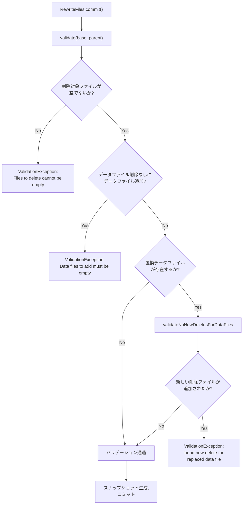
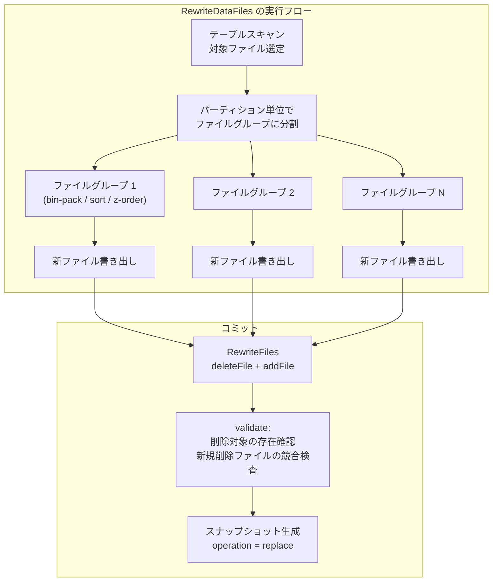
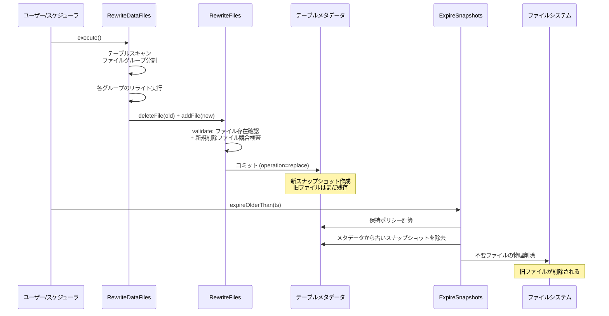

# 第12章 コンパクションとファイルリライト

> **本章で読むソース**
>
> - [`api/src/main/java/org/apache/iceberg/RewriteFiles.java`](https://github.com/apache/iceberg/blob/apache-iceberg-1.11.0/api/src/main/java/org/apache/iceberg/RewriteFiles.java)
> - [`core/src/main/java/org/apache/iceberg/BaseRewriteFiles.java`](https://github.com/apache/iceberg/blob/apache-iceberg-1.11.0/core/src/main/java/org/apache/iceberg/BaseRewriteFiles.java)
> - [`api/src/main/java/org/apache/iceberg/actions/RewriteDataFiles.java`](https://github.com/apache/iceberg/blob/apache-iceberg-1.11.0/api/src/main/java/org/apache/iceberg/actions/RewriteDataFiles.java)
> - [`api/src/main/java/org/apache/iceberg/actions/RewriteManifests.java`](https://github.com/apache/iceberg/blob/apache-iceberg-1.11.0/api/src/main/java/org/apache/iceberg/actions/RewriteManifests.java)
> - [`api/src/main/java/org/apache/iceberg/ExpireSnapshots.java`](https://github.com/apache/iceberg/blob/apache-iceberg-1.11.0/api/src/main/java/org/apache/iceberg/ExpireSnapshots.java)
> - [`core/src/main/java/org/apache/iceberg/RemoveSnapshots.java`](https://github.com/apache/iceberg/blob/apache-iceberg-1.11.0/core/src/main/java/org/apache/iceberg/RemoveSnapshots.java)

## この章の狙い

Iceberg テーブルは追記専用の設計であるため、小さなファイルの蓄積やデータレイアウトの劣化が避けられない。
本章では、データファイルを物理的に書き換える**コンパクション**の仕組みと、不要になったスナップショットを回収する**スナップショット期限切れ**の仕組みを、仕様と参照実装の両面から読み解く。
低レベルの `RewriteFiles` オペレーション、高レベルの `RewriteDataFiles` / `RewriteManifests` アクション、そして `ExpireSnapshots` によるガベージコレクションを順に追う。

## 前提

スナップショット、マニフェストリスト、マニフェストファイル、データファイルの階層構造を理解していること（第2章）。
`SnapshotProducer` によるコミットの楽観的並行制御の仕組みを把握していること。
シーケンス番号と削除ファイルの関係を理解していること。

## 仕様が定める replace オペレーション

Iceberg 仕様はスナップショットの `operation` フィールドに 4 種類の値を定めている。
そのうちコンパクションに対応するのが `replace` である。

仕様の定義を引用する。

> `replace` -- Data and delete files were added and removed without changing table data; i.e., compaction, changing the data file format, or relocating data files.

注目すべきは「テーブルのデータを変えない」という不変条件である。
ファイルのサイズ、レイアウト、フォーマットは変わってよいが、論理的なレコード集合は変化してはならない。
この不変条件を参照実装がどう保証しているかが、本章の中心的なテーマとなる。

参照実装では `DataOperations` クラスが 4 つのオペレーション種別を定数として定義している。

[`api/src/main/java/org/apache/iceberg/DataOperations.java` L28-L38](https://github.com/apache/iceberg/blob/apache-iceberg-1.11.0/api/src/main/java/org/apache/iceberg/DataOperations.java#L28-L38)

```java
public class DataOperations {
  private DataOperations() {}

  /**
   * New data is appended to the table and no data is removed or deleted.
   *
   * <p>This operation is implemented by {@link AppendFiles}.
   */
  public static final String APPEND = "append";

  /**
```

`RewriteFiles` オペレーションはコミット時に `REPLACE` を返す。
これにより、スナップショット期限切れの処理で「このスナップショットはコンパクションであり、新しいデータの追加や論理削除は含まない」と判別できる。

## RewriteFiles インターフェース

**RewriteFiles** はファイル置換のアトミック操作を定義する API インターフェースである。
データファイルと削除ファイルの両方を対象に、「削除するファイルの集合」と「追加するファイルの集合」を蓄積し、1 つのスナップショットとしてコミットする。

[`api/src/main/java/org/apache/iceberg/RewriteFiles.java` L39-L53](https://github.com/apache/iceberg/blob/apache-iceberg-1.11.0/api/src/main/java/org/apache/iceberg/RewriteFiles.java#L39-L53)

```java
public interface RewriteFiles extends SnapshotUpdate<RewriteFiles> {
  /**
   * Remove a data file from the current table state.
   *
   * <p>This rewrite operation may change the size or layout of the data files. When applicable, it
   * is also recommended to discard already deleted records while rewriting data files. However, the
   * set of live data records must never change.
   *
   * @param dataFile a rewritten data file
   * @return this for method chaining
   */
  default RewriteFiles deleteFile(DataFile dataFile) {
    throw new UnsupportedOperationException(
        this.getClass().getName() + " does not implement deleteFile");
  }
```

Javadoc に明記されているとおり、リライト操作はファイルのサイズやレイアウトを変更してよいが、生存レコード（live data records）の集合を変えてはならない。
同様に削除ファイルについても、適用可能な削除レコードの集合を変えてはならないと規定されている。

### シーケンス番号の制御

「RewriteFiles」はシーケンス番号を明示的に制御する 2 つのメソッドを持つ。

[`api/src/main/java/org/apache/iceberg/RewriteFiles.java` L115-L118](https://github.com/apache/iceberg/blob/apache-iceberg-1.11.0/api/src/main/java/org/apache/iceberg/RewriteFiles.java#L115-L118)

```java
  default RewriteFiles addFile(DeleteFile deleteFile, long dataSequenceNumber) {
    throw new UnsupportedOperationException(
        this.getClass().getName() + " does not implement addFile");
  }

  // ... (中略) ...

  default RewriteFiles dataSequenceNumber(long sequenceNumber) {
    throw new UnsupportedOperationException(
        this.getClass().getName() + " does not implement dataSequenceNumber");
  }
```

`dataSequenceNumber` は、リライトで生成されるデータファイルに付与するシーケンス番号を指定する。
通常、新しいスナップショットのコミット時にシーケンス番号が自動採番されるが、コンパクションではこれだと問題が生じる。
コンパクションと等値削除の追加が同時に起きた場合、コンパクション後のファイルに新しいシーケンス番号が付くと、先に追加された等値削除がそのファイルに適用されなくなる。
`dataSequenceNumber` でコンパクション開始時点のシーケンス番号を指定すれば、等値削除との整合性が保たれる。

### バリデーション基点の指定

[`api/src/main/java/org/apache/iceberg/RewriteFiles.java` L177-L186](https://github.com/apache/iceberg/blob/apache-iceberg-1.11.0/api/src/main/java/org/apache/iceberg/RewriteFiles.java#L177-L186)

```java
  /**
   * Set the snapshot ID used in any reads for this operation.
   *
   * <p>Validations will check changes after this snapshot ID. If this is not called, all ancestor
   * snapshots through the table's initial snapshot are validated.
   *
   * @param snapshotId a snapshot ID
   * @return this for method chaining
   */
  RewriteFiles validateFromSnapshot(long snapshotId);
```

`validateFromSnapshot` は、コミット時のバリデーションでどのスナップショット以降の変更を検査対象にするかを指定する。
コンパクション開始時点のスナップショット ID を渡すことで、それ以降に追加された削除ファイルとの競合を検出できる。

## BaseRewriteFiles の実装

**BaseRewriteFiles** は `RewriteFiles` の参照実装であり、`MergingSnapshotProducer` を継承する。

[`core/src/main/java/org/apache/iceberg/BaseRewriteFiles.java` L26-L35](https://github.com/apache/iceberg/blob/apache-iceberg-1.11.0/core/src/main/java/org/apache/iceberg/BaseRewriteFiles.java#L26-L35)

```java
class BaseRewriteFiles extends MergingSnapshotProducer<RewriteFiles> implements RewriteFiles {
  private final DataFileSet replacedDataFiles = DataFileSet.create();
  private Long startingSnapshotId = null;

  BaseRewriteFiles(String tableName, TableOperations ops) {
    super(tableName, ops);

    // replace files must fail if any of the deleted paths is missing and cannot be deleted
    failMissingDeletePaths();
  }
```

コンストラクタで `failMissingDeletePaths()` を呼んでいる点に注目する。
これは `MergingSnapshotProducer` のメソッドで、削除対象のファイルがスナップショット内に存在しない場合にコミットを失敗させる設定である。
仕様が定める「replace 操作は削除するファイルがまだテーブルに存在することを検証しなければならない」という要件の実装に当たる。

### オペレーション種別

[`core/src/main/java/org/apache/iceberg/BaseRewriteFiles.java` L37-L40](https://github.com/apache/iceberg/blob/apache-iceberg-1.11.0/core/src/main/java/org/apache/iceberg/BaseRewriteFiles.java#L37-L40)

```java
  @Override
  protected RewriteFiles self() {
    return this;
  }
```

`operation()` が `REPLACE` を返すことで、生成されるスナップショットのサマリにコンパクションであることが記録される。

### バリデーションロジック

コミット時に呼ばれる `validate` メソッドが本実装の核心である。

[`core/src/main/java/org/apache/iceberg/BaseRewriteFiles.java` L134-L155](https://github.com/apache/iceberg/blob/apache-iceberg-1.11.0/core/src/main/java/org/apache/iceberg/BaseRewriteFiles.java#L134-L155)

```java
  @Override
  protected void validate(TableMetadata base, Snapshot parent) {
    validateReplacedAndAddedFiles();
    if (!replacedDataFiles.isEmpty()) {
      // if there are replaced data files, there cannot be any new row-level deletes for those data
      // files
      validateNoNewDeletesForDataFiles(base, startingSnapshotId, replacedDataFiles, parent);
    }
  }

  private void validateReplacedAndAddedFiles() {
    Preconditions.checkArgument(
        deletesDataFiles() || deletesDeleteFiles(), "Files to delete cannot be empty");

    Preconditions.checkArgument(
        deletesDataFiles() || !addsDataFiles(),
        "Data files to add must be empty because there's no data file to be rewritten");

    Preconditions.checkArgument(
        deletesDeleteFiles() || !addsDeleteFiles(),
        "Delete files to add must be empty because there's no delete file to be rewritten");
  }
```

バリデーションは 2 段階で行われる。

1. **構造的検証**(`validateReplacedAndAddedFiles`): 削除対象が空でないこと、データファイルの削除なしにデータファイルを追加していないこと、削除ファイルの削除なしに削除ファイルを追加していないことを検査する。これにより、「置換」でないファイル追加がリライト操作に紛れ込むことを防ぐ。
2. **並行変更の検証**(`validateNoNewDeletesForDataFiles`): 置換対象のデータファイルに対して、コンパクション開始後に新しい行レベル削除が追加されていないことを検査する。もし別のトランザクションが削除ファイルを追加していた場合、コンパクションで生成したファイルには削除済みレコードが含まれたままになるため、コミットを拒否する。



### 設計上の工夫: シーケンス番号による等値削除との競合回避

`validateNoNewDeletesForDataFiles` の内部実装には、等値削除を検査対象から除外するオプションがある。

`MergingSnapshotProducer` の該当箇所を確認する。

[`core/src/main/java/org/apache/iceberg/MergingSnapshotProducer.java` L519-L551](https://github.com/apache/iceberg/blob/apache-iceberg-1.11.0/core/src/main/java/org/apache/iceberg/MergingSnapshotProducer.java#L519-L551)

```java
  private void validateNoNewDeletesForDataFiles(
      TableMetadata base,
      Long startingSnapshotId,
      Expression dataFilter,
      Iterable<DataFile> dataFiles,
      boolean ignoreEqualityDeletes,
      Snapshot parent) {
    // if there is no current table state, no files have been added
    if (parent == null || base.formatVersion() < 2) {
      return;
    }

    DeleteFileIndex deletes = addedDeleteFiles(base, startingSnapshotId, dataFilter, null, parent);

    long startingSequenceNumber = startingSequenceNumber(base, startingSnapshotId);
    for (DataFile dataFile : dataFiles) {
      // if any delete is found that applies to files written in or before the starting snapshot,
      // fail
      DeleteFile[] deleteFiles = deletes.forDataFile(startingSequenceNumber, dataFile);
      if (ignoreEqualityDeletes) {
        ValidationException.check(
            Arrays.stream(deleteFiles)
                .noneMatch(deleteFile -> deleteFile.content() == FileContent.POSITION_DELETES),
            "Cannot commit, found new position delete for replaced data file: %s",
            dataFile);
      } else {
        ValidationException.check(
            deleteFiles.length == 0,
            "Cannot commit, found new delete for replaced data file: %s",
            dataFile);
      }
    }
  }
```

`ignoreEqualityDeletes` が `true` の場合、位置削除のみを検査し、等値削除は無視する。
これは `BaseRewriteFiles` から呼ばれる際に `newDataFilesDataSequenceNumber != null`（つまり `dataSequenceNumber` が設定されている場合）に `true` となる。

この設計の背景は次のとおりである。
コンパクションで生成されたデータファイルに元ファイルと同じシーケンス番号を設定すれば、等値削除のシーケンス番号がそれより大きい限り自動的に適用される。
したがって等値削除との競合は発生しない。
一方、位置削除はファイルパスと行位置で特定するため、ファイルが物理的に書き換わると無効になる。
そのため位置削除だけは引き続き検査する必要がある。

この仕組みにより、コンパクションと等値削除の追加を同時に実行してもコミット競合を最小限に抑えられる。
大規模テーブルでは長時間のコンパクションと並行して継続的にデータ更新が行われるため、この最適化は実運用上きわめて重要である。

## RewriteDataFiles アクション

**RewriteDataFiles** はデータファイルのリライトを実行する高レベルアクションのインターフェースである。
内部的には `RewriteFiles` を使うが、ファイルグループの分割、リライト戦略の選択、部分的進捗コミットなど、分散処理エンジン向けの機能を追加している。

### リライト戦略

「RewriteDataFiles」は 3 つのリライト戦略を提供する。

[`api/src/main/java/org/apache/iceberg/actions/RewriteDataFiles.java` L155-L157](https://github.com/apache/iceberg/blob/apache-iceberg-1.11.0/api/src/main/java/org/apache/iceberg/actions/RewriteDataFiles.java#L155-L157)

```java
  default RewriteDataFiles binPack() {
    return this;
  }

  // ... (中略) ...

  default RewriteDataFiles sort() {
    throw new UnsupportedOperationException(
        "SORT Rewrite Strategy not implemented for this framework");
  }

  default RewriteDataFiles sort(SortOrder sortOrder) {
    throw new UnsupportedOperationException(
        "SORT Rewrite Strategy not implemented for this framework");
  }

  default RewriteDataFiles zOrder(String... columns) {
    throw new UnsupportedOperationException(
        "Z-ORDER Rewrite Strategy not implemented for this framework");
  }
```

各戦略の特徴は以下のとおりである。

| 戦略 | 目的 | 適用場面 |
|------|------|----------|
| **bin-pack** | 小さなファイルを目標サイズに統合する | ストリーミング取り込み後の小ファイル解消 |
| **sort** | 指定されたソート順序でデータを再配置する | 範囲クエリの性能向上 |
| **z-order** | 複数列を Z 曲線で交互配置する | 複数列への述語プッシュダウン性能の向上 |

`binPack()` はデフォルト実装が `return this` であり、何もしない。
これは bin-pack がデフォルト戦略であることを意味する。
`sort()` と `zOrder()` は `UnsupportedOperationException` を投げるデフォルト実装となっており、各実行エンジン（Spark, Flink など）が独自に実装する。

### ファイルグループとサイズ制御

大規模なパーティションを一度にリライトするとリソースが枯渇するため、「RewriteDataFiles」はパーティションをさらにファイルグループに分割する。

[`api/src/main/java/org/apache/iceberg/actions/RewriteDataFiles.java` L62-L73](https://github.com/apache/iceberg/blob/apache-iceberg-1.11.0/api/src/main/java/org/apache/iceberg/actions/RewriteDataFiles.java#L62-L73)

```java
  /**
   * The entire rewrite operation is broken down into pieces based on partitioning and within
   * partitions based on size into groups. These sub-units of the rewrite are referred to as file
   * groups. The largest amount of data that should be compacted in a single group is controlled by
   * {@link #MAX_FILE_GROUP_SIZE_BYTES}. This helps with breaking down the rewriting of very large
   * partitions which may not be rewritable otherwise due to the resource constraints of the
   * cluster. For example a sort based rewrite may not scale to terabyte sized partitions, those
   * partitions need to be worked on in small subsections to avoid exhaustion of resources.
   *
   * <p>When grouping files, the underlying rewrite strategy will use this value as to limit the
   * files which will be included in a single file group. A group will be processed by a single
   * framework "action". For example, in Spark this means that each group would be rewritten in its
```

デフォルトの最大ファイルグループサイズは 100 GB である。
さらに `MAX_CONCURRENT_FILE_GROUP_REWRITES`（デフォルト 5）で、同時にリライトするファイルグループの上限を制御する。

### 部分的進捗コミット

[`api/src/main/java/org/apache/iceberg/actions/RewriteDataFiles.java` L43-L53](https://github.com/apache/iceberg/blob/apache-iceberg-1.11.0/api/src/main/java/org/apache/iceberg/actions/RewriteDataFiles.java#L43-L53)

```java
  String PARTIAL_PROGRESS_ENABLED = "partial-progress.enabled";

  boolean PARTIAL_PROGRESS_ENABLED_DEFAULT = false;

  /**
   * The maximum amount of Iceberg commits that this rewrite is allowed to produce if partial
   * progress is enabled. This setting has no effect if partial progress is disabled.
   */
  String PARTIAL_PROGRESS_MAX_COMMITS = "partial-progress.max-commits";

  int PARTIAL_PROGRESS_MAX_COMMITS_DEFAULT = 10;
```

`partial-progress.enabled` を `true` にすると、ファイルグループ単位でコミットが行われる。
全体のリライトが完了する前に一部のグループがコミットされるため、一部のグループが失敗しても他のグループの成果は保存される。
ファイルグループは独立にコンパクション可能であるため、この部分コミットによってデータの正しさが損なわれることはない。

### シーケンス番号の自動設定

[`api/src/main/java/org/apache/iceberg/actions/RewriteDataFiles.java` L96-L107](https://github.com/apache/iceberg/blob/apache-iceberg-1.11.0/api/src/main/java/org/apache/iceberg/actions/RewriteDataFiles.java#L96-L107)

```java
  /**
   * If the compaction should use the sequence number of the snapshot at compaction start time for
   * new data files, instead of using the sequence number of the newly produced snapshot.
   *
   * <p>This avoids commit conflicts with updates that add newer equality deletes at a higher
   * sequence number.
   *
   * <p>Defaults to true.
   */
  String USE_STARTING_SEQUENCE_NUMBER = "use-starting-sequence-number";

  boolean USE_STARTING_SEQUENCE_NUMBER_DEFAULT = true;
```

`use-starting-sequence-number` はデフォルトで `true` である。
これにより、前節で説明した `dataSequenceNumber` の仕組みが自動的に有効になり、等値削除との競合を回避する。

### 結果の構造

リライトの結果は `FileGroupRewriteResult` のリストとして返される。

[`api/src/main/java/org/apache/iceberg/actions/RewriteDataFiles.java` L207-L237](https://github.com/apache/iceberg/blob/apache-iceberg-1.11.0/api/src/main/java/org/apache/iceberg/actions/RewriteDataFiles.java#L207-L237)

```java
  interface Result {
    List<FileGroupRewriteResult> rewriteResults();

    default List<FileGroupFailureResult> rewriteFailures() {
      return ImmutableList.of();
    }

    default int addedDataFilesCount() {
      return rewriteResults().stream().mapToInt(FileGroupRewriteResult::addedDataFilesCount).sum();
    }

    default int rewrittenDataFilesCount() {
      return rewriteResults().stream()
          .mapToInt(FileGroupRewriteResult::rewrittenDataFilesCount)
          .sum();
    }
    // ... (中略) ...
  }

  interface FileGroupRewriteResult {
    FileGroupInfo info();

    int addedDataFilesCount();

    int rewrittenDataFilesCount();

    // ... (中略) ...
  }
```

`Result` はリライトされたファイル数、追加されたファイル数、失敗したグループの情報を集約して提供する。
各 `FileGroupRewriteResult` は `FileGroupInfo` を保持し、どのパーティションの何番目のグループかを追跡できる。



## RewriteManifests アクション

**RewriteManifests** はマニフェストファイルの再編成を行うアクションのインターフェースである。
データファイルそのものは書き換えず、マニフェストの統合と再分割のみを行う。

[`api/src/main/java/org/apache/iceberg/actions/RewriteManifests.java` L26-L46](https://github.com/apache/iceberg/blob/apache-iceberg-1.11.0/api/src/main/java/org/apache/iceberg/actions/RewriteManifests.java#L26-L46)

```java
public interface RewriteManifests
    extends SnapshotUpdate<RewriteManifests, RewriteManifests.Result> {
  /**
   * Rewrites manifests for a given spec id.
   *
   * <p>If not set, defaults to the table's default spec ID.
   *
   * @param specId a spec id
   * @return this for method chaining
   */
  RewriteManifests specId(int specId);

  /**
   * Rewrites only manifests that match the given predicate.
   *
   * <p>If not set, all manifests will be rewritten.
   *
   * @param predicate a predicate
   * @return this for method chaining
   */
  RewriteManifests rewriteIf(Predicate<ManifestFile> predicate);
```

### パーティションフィールドによるソート

[`api/src/main/java/org/apache/iceberg/actions/RewriteManifests.java` L48-L65](https://github.com/apache/iceberg/blob/apache-iceberg-1.11.0/api/src/main/java/org/apache/iceberg/actions/RewriteManifests.java#L48-L65)

```java
  /**
   * Rewrite manifests in a given order, based on partition field names
   *
   * <p>Supply an optional set of partition field names to sort the rewritten manifests by. Choosing
   * a frequently queried partition field can reduce planning time by skipping unnecessary
   * manifests.
   *
   * <p>For example, given a table PARTITIONED BY (a, b, c, d), one may wish to rewrite and sort
   * manifests by ('d', 'b') only, based on known query patterns. Rewriting Manifests in this way
   * will yield a manifest_list whose manifest_files point to data files containing common 'd' then
   * 'b' partition values.
   *
   * <p>If not set, manifests will be rewritten in the order of the transforms in the table's
   * partition spec.
   *
   * @param partitionFields Exact transformed column names used for partitioning; not the raw column
   *     names that partitions are derived from. E.G. supply 'data_bucket' and not 'data' for a
   *     bucket(N, data) partition * definition
```

`sortBy` は頻繁にクエリされるパーティションフィールドでマニフェスト内のエントリをソートする。
たとえば `PARTITIONED BY (a, b, c, d)` のテーブルで `d` への述語が多い場合、`d` でソートされたマニフェストにすれば、プランニング時に無関係なマニフェストをスキップできる。
これはマニフェストファイルに記録されるパーティション値の上下限が、含まれるエントリのソート順に依存するためである。
ソート順を選べば、マニフェストのパーティション値の範囲が狭くなり、マニフェスト評価時の刈り込みが効果的になる。

### 結果

[`api/src/main/java/org/apache/iceberg/actions/RewriteManifests.java` L84-L90](https://github.com/apache/iceberg/blob/apache-iceberg-1.11.0/api/src/main/java/org/apache/iceberg/actions/RewriteManifests.java#L84-L90)

```java
  interface Result {
    /** Returns rewritten manifests. */
    Iterable<ManifestFile> rewrittenManifests();

    /** Returns added manifests. */
    Iterable<ManifestFile> addedManifests();
  }
```

結果は「書き換えられたマニフェスト」と「新たに追加されたマニフェスト」の 2 つのリストを返す。
マニフェストのリライトはデータファイルの内容を変えないため、操作前後でテーブルのデータには影響しない。

## ExpireSnapshots によるガベージコレクション

コンパクションで置換されたファイルは、スナップショットが参照している間は物理的に削除できない。
**ExpireSnapshots** は不要になったスナップショットをメタデータから除去し、どのスナップショットからも参照されなくなったファイルを物理削除する。

### API インターフェース

[`api/src/main/java/org/apache/iceberg/ExpireSnapshots.java` L40-L109](https://github.com/apache/iceberg/blob/apache-iceberg-1.11.0/api/src/main/java/org/apache/iceberg/ExpireSnapshots.java#L40-L109)

```java
public interface ExpireSnapshots extends PendingUpdate<List<Snapshot>> {
  // ... (中略) ...

  ExpireSnapshots expireSnapshotId(long snapshotId);

  ExpireSnapshots expireOlderThan(long timestampMillis);

  ExpireSnapshots retainLast(int numSnapshots);

  ExpireSnapshots deleteWith(Consumer<String> deleteFunc);

  ExpireSnapshots executeDeleteWith(ExecutorService executorService);
```

3 つの指定方法を組み合わせてスナップショットの削除範囲を制御する。

- `expireSnapshotId`: 特定のスナップショット ID を明示的に期限切れにする
- `expireOlderThan`: 指定タイムスタンプより古いスナップショットをすべて期限切れにする
- `retainLast`: 現在のスナップショットの最新 N 個の祖先を保持する（`expireOlderThan` より優先される）

### クリーンアップレベル

1.11.0 では `CleanupLevel` 列挙型が導入され、期限切れ時のファイル削除の粒度を制御できるようになった。

[`api/src/main/java/org/apache/iceberg/ExpireSnapshots.java` L42-L49](https://github.com/apache/iceberg/blob/apache-iceberg-1.11.0/api/src/main/java/org/apache/iceberg/ExpireSnapshots.java#L42-L49)

```java
  enum CleanupLevel {
    /** Skip all file cleanup, only remove snapshot metadata. */
    NONE,
    /** Clean up only metadata files (manifests, manifest lists, statistics), retain data files. */
    METADATA_ONLY,
    /** Clean up both metadata and data files (default). */
    ALL
  }
```

`METADATA_ONLY` はデータファイルが複数のテーブルで共有されている場合に有用である。
`NONE` はメタデータの更新のみを行い、ファイル削除は分散フレームワーク経由のアクション API に委ねる場合に使う。

### RemoveSnapshots の実装

参照実装の `RemoveSnapshots` クラスは、仕様が定めるスナップショット保持ポリシーを忠実に実装している。

[`core/src/main/java/org/apache/iceberg/RemoveSnapshots.java` L84-L99](https://github.com/apache/iceberg/blob/apache-iceberg-1.11.0/core/src/main/java/org/apache/iceberg/RemoveSnapshots.java#L84-L99)

```java
  RemoveSnapshots(TableOperations ops) {
    this.ops = ops;
    this.base = ops.current();
    ValidationException.check(
        PropertyUtil.propertyAsBoolean(base.properties(), GC_ENABLED, GC_ENABLED_DEFAULT),
        "Cannot expire snapshots: GC is disabled (deleting files may corrupt other tables)");

    long defaultMaxSnapshotAgeMs =
        PropertyUtil.propertyAsLong(
            base.properties(), MAX_SNAPSHOT_AGE_MS, MAX_SNAPSHOT_AGE_MS_DEFAULT);

    this.now = System.currentTimeMillis();
    this.defaultExpireOlderThan = now - defaultMaxSnapshotAgeMs;
    this.defaultMinNumSnapshots =
        PropertyUtil.propertyAsInt(
            base.properties(), MIN_SNAPSHOTS_TO_KEEP, MIN_SNAPSHOTS_TO_KEEP_DEFAULT);
```

コンストラクタでまず `gc.enabled` プロパティを検査する。
これが `false` の場合、他のテーブルとファイルを共有している可能性があるため、スナップショットの期限切れ自体を拒否する。

### 保持ポリシーの計算

`internalApply` メソッドの保持ポリシー計算ロジックは仕様の手順に沿っている。

[`core/src/main/java/org/apache/iceberg/RemoveSnapshots.java` L196-L272](https://github.com/apache/iceberg/blob/apache-iceberg-1.11.0/core/src/main/java/org/apache/iceberg/RemoveSnapshots.java#L196-L272)

```java
  private TableMetadata internalApply() {
    this.base = ops.refresh();
    // ... (中略) ...
    Set<Long> idsToRetain = Sets.newHashSet();
    Map<String, SnapshotRef> retainedRefs = computeRetainedRefs(base.refs());
    // ... (中略) ...
    idsToRetain.addAll(computeAllBranchSnapshotsToRetain(retainedRefs.values()));
    idsToRetain.addAll(unreferencedSnapshotsToRetain(retainedRefs.values()));

    TableMetadata.Builder updatedMetaBuilder = TableMetadata.buildFrom(base);
    // ... (中略) ...
    base.snapshots().stream()
        .map(Snapshot::snapshotId)
        .filter(snapshot -> !idsToRetain.contains(snapshot))
        .forEach(idsToRemove::add);
    updatedMetaBuilder.removeSnapshots(idsToRemove);
    // ... (中略) ...
    return updatedMetaBuilder.build();
  }
```

保持すべきスナップショットの集合は次の 3 段階で構築される。

1. **参照の保持判定**(`computeRetainedRefs`): main ブランチは常に保持する。それ以外の参照は `max-ref-age-ms` の範囲内であれば保持する。
2. **ブランチの祖先の保持**(`computeAllBranchSnapshotsToRetain`): 各ブランチの祖先を `min-snapshots-to-keep` 個、かつ `max-snapshot-age-ms` 以内であれば保持する。
3. **未参照スナップショットの保持**(`unreferencedSnapshotsToRetain`): どのブランチにも属さないスナップショットでも、タイムスタンプが `max-snapshot-age-ms` 以内であれば保持する。

このロジックは仕様の "Snapshot Retention Policy" の 5 ステップをそのまま実装したものである。

### コミットとファイル削除

[`core/src/main/java/org/apache/iceberg/RemoveSnapshots.java` L355-L377](https://github.com/apache/iceberg/blob/apache-iceberg-1.11.0/core/src/main/java/org/apache/iceberg/RemoveSnapshots.java#L355-L377)

```java
  @Override
  public void commit() {
    Tasks.foreach(ops)
        .retry(base.propertyAsInt(COMMIT_NUM_RETRIES, COMMIT_NUM_RETRIES_DEFAULT))
        .exponentialBackoff(
            base.propertyAsInt(COMMIT_MIN_RETRY_WAIT_MS, COMMIT_MIN_RETRY_WAIT_MS_DEFAULT),
            base.propertyAsInt(COMMIT_MAX_RETRY_WAIT_MS, COMMIT_MAX_RETRY_WAIT_MS_DEFAULT),
            base.propertyAsInt(COMMIT_TOTAL_RETRY_TIME_MS, COMMIT_TOTAL_RETRY_TIME_MS_DEFAULT),
            2.0 /* exponential */)
        .onlyRetryOn(CommitFailedException.class)
        .run(
            item -> {
              TableMetadata updated = internalApply();
              ops.commit(base, updated);
            });
    LOG.info(
        "Committed snapshot changes and prepare to clean up files at level={}",
        cleanupLevel.name());

    if (CleanupLevel.NONE != cleanupLevel && !base.snapshots().isEmpty()) {
      cleanExpiredSnapshots();
    }
  }
```

コミットは楽観的並行制御で行われ、`CommitFailedException` の場合はリトライする。
メタデータのコミットが成功した後、`cleanupLevel` に応じてファイルの物理削除を行う。
メタデータ更新とファイル削除を分離している点が重要で、メタデータのコミットが成功すればファイル削除が途中で失敗しても安全である（次回の期限切れ処理で再試行できる）。

## コンパクションとスナップショット期限切れの連携

コンパクションと「ExpireSnapshots」は連携して動作する。
全体の流れを示す。



1. 「RewriteDataFiles」がテーブルをスキャンし、対象ファイルをファイルグループに分割する
2. 各ファイルグループに対してリライトを実行し、新しいファイルを生成する
3. 「RewriteFiles」経由でアトミックにコミットする。旧ファイルは新しいスナップショットでは参照されなくなるが、古いスナップショットが参照しているため物理ファイルは残る
4. 「ExpireSnapshots」が古いスナップショットを期限切れにすると、旧ファイルがどのスナップショットからも参照されなくなり、物理削除が可能になる

この 2 段階の設計により、コンパクション中のタイムトラベルクエリやインクリメンタル読み取りが安全に動作する。
古いスナップショットが残っている間は、そのスナップショット時点のデータに完全にアクセスできる。

## まとめ

- 仕様は `replace` オペレーションを「テーブルデータを変えずにファイルを置換する」操作として定義する。コンパクション、フォーマット変換、ファイル再配置がこれに該当する
- `RewriteFiles` はファイル置換のアトミック操作を提供する低レベル API である。コミット時に「削除対象ファイルの存在確認」と「新規削除ファイルとの競合検査」を行い、データの一貫性を保証する
- `dataSequenceNumber` の設定により、コンパクション後のデータファイルが元ファイルと同じシーケンス番号を持つようにすることで、等値削除との競合を回避する。これが大規模テーブル運用での並行性を支える設計上の工夫である
- `RewriteDataFiles` はファイルグループ単位の分割、3 種類のリライト戦略（bin-pack, sort, z-order）、部分的進捗コミットを提供する高レベルアクションである
- `RewriteManifests` はデータファイルを変えずにマニフェストを再編成し、クエリプランニングの効率を改善する
- `ExpireSnapshots` は保持ポリシーに基づいてスナップショットを期限切れにし、不要ファイルの物理削除を行う。メタデータのコミットとファイル削除を分離することで、途中失敗への耐性を確保する

## 関連する章

- [第2章 テーブルメタデータとフォーマットバージョン](../part00-overview/02-table-metadata.md)
