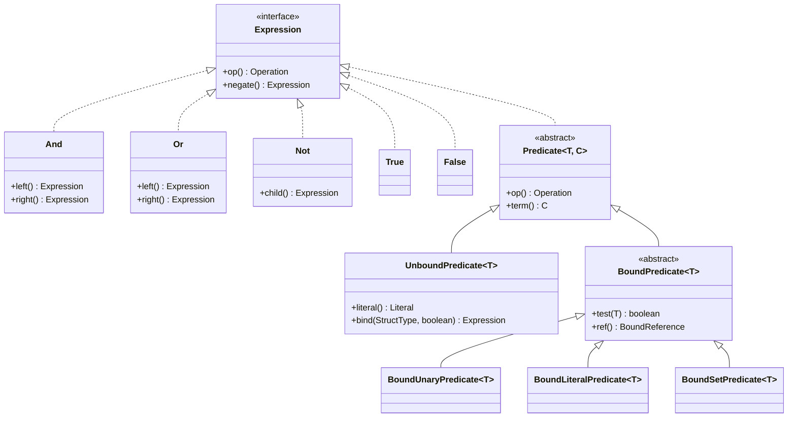
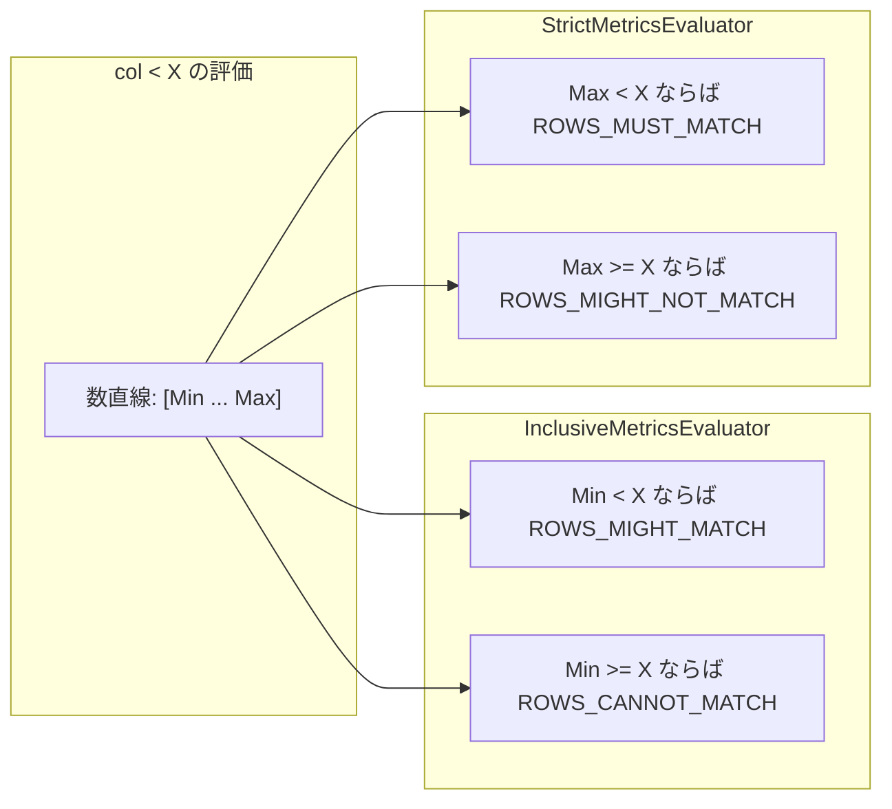

# 第13章 式と述語

> **本章で読むソース**
>
> - [`api/src/main/java/org/apache/iceberg/expressions/Expression.java`](https://github.com/apache/iceberg/blob/apache-iceberg-1.11.0/api/src/main/java/org/apache/iceberg/expressions/Expression.java)
> - [`api/src/main/java/org/apache/iceberg/expressions/Expressions.java`](https://github.com/apache/iceberg/blob/apache-iceberg-1.11.0/api/src/main/java/org/apache/iceberg/expressions/Expressions.java)
> - [`api/src/main/java/org/apache/iceberg/expressions/Binder.java`](https://github.com/apache/iceberg/blob/apache-iceberg-1.11.0/api/src/main/java/org/apache/iceberg/expressions/Binder.java)
> - [`api/src/main/java/org/apache/iceberg/expressions/InclusiveMetricsEvaluator.java`](https://github.com/apache/iceberg/blob/apache-iceberg-1.11.0/api/src/main/java/org/apache/iceberg/expressions/InclusiveMetricsEvaluator.java)
> - [`api/src/main/java/org/apache/iceberg/expressions/StrictMetricsEvaluator.java`](https://github.com/apache/iceberg/blob/apache-iceberg-1.11.0/api/src/main/java/org/apache/iceberg/expressions/StrictMetricsEvaluator.java)
> - [`api/src/main/java/org/apache/iceberg/expressions/ResidualEvaluator.java`](https://github.com/apache/iceberg/blob/apache-iceberg-1.11.0/api/src/main/java/org/apache/iceberg/expressions/ResidualEvaluator.java)

## この章の狙い

Iceberg のスキャン処理は、ユーザーが指定した WHERE 句をメタデータレベルで評価し、不要なデータファイルを読み飛ばすことで大規模テーブルへの問い合わせを高速化する。
本章では、式ツリーの構造、スキーマへのバインディング、ファイルレベルのメトリクス評価、そして残余フィルタの計算という4つのフェーズを、仕様と参照実装の両面から読み解く。

## 前提

スキーマとフィールド ID の仕組み（第3章）、パーティション仕様と変換関数（第5章）、マニフェストファイルが保持するカラムメトリクス（第7章）を理解していること。

## Expression インターフェースと Operation 列挙型

**Expression** は式ツリーのすべてのノードが実装する最上位インターフェースである。
`Serializable` を継承しており、エンジン間でフィルタ式をシリアライズして受け渡せる設計になっている。

[`api/src/main/java/org/apache/iceberg/expressions/Expression.java` L25-L27](https://github.com/apache/iceberg/blob/apache-iceberg-1.11.0/api/src/main/java/org/apache/iceberg/expressions/Expression.java#L25-L27)

```java
/** Represents a boolean expression tree. */
public interface Expression extends Serializable {
  enum Operation {
```

内部列挙型 **Operation** が、式ツリーで使われるすべての操作を定義する。
比較演算（`LT`, `LT_EQ`, `GT`, `GT_EQ`, `EQ`, `NOT_EQ`）、集合演算（`IN`, `NOT_IN`）、NULL/NaN 判定（`IS_NULL`, `NOT_NULL`, `IS_NAN`, `NOT_NAN`）、論理演算（`AND`, `OR`, `NOT`）、文字列演算（`STARTS_WITH`, `NOT_STARTS_WITH`）、そして集約演算（`COUNT`, `COUNT_NULL`, `COUNT_STAR`, `MAX`, `MIN`）が含まれる。

「Operation」には 2 つのメソッドが定義されている。
`negate()` は否定形への変換を返し、`flipLR()` は左右のオペランドを交換したときの等価な演算を返す。

[`api/src/main/java/org/apache/iceberg/expressions/Expression.java` L63-L97](https://github.com/apache/iceberg/blob/apache-iceberg-1.11.0/api/src/main/java/org/apache/iceberg/expressions/Expression.java#L63-L97)

```java
    /** Returns the operation used when this is negated. */
    public Operation negate() {
      switch (this) {
        case IS_NULL:
          return Operation.NOT_NULL;
        case NOT_NULL:
          return Operation.IS_NULL;
        // ... (中略) ...
        case IN:
          return Operation.NOT_IN;
        case NOT_IN:
          return Operation.IN;
        // ... (中略) ...
        default:
          throw new IllegalArgumentException("No negation for operation: " + this);
      }
    }
```

`negate()` が `AND`, `OR`, `NOT`, `TRUE`, `FALSE` に対して例外を投げる点に注意したい。
これらの論理ノードの否定は「Operation」単独では表現できず、ツリー構造の変換（ド・モルガンの法則の適用）が必要となる。
この変換は後述する `RewriteNot` ビジターが担当する。

## 式ツリーのノード構造

式ツリーは次のクラス群で構成される。



論理結合ノードである `And` と `Or` は、ド・モルガンの法則を `negate()` で直接実装している。

[`api/src/main/java/org/apache/iceberg/expressions/And.java` L54-L58](https://github.com/apache/iceberg/blob/apache-iceberg-1.11.0/api/src/main/java/org/apache/iceberg/expressions/And.java#L54-L58)

```java
  @Override
  public Expression negate() {
    // not(and(a, b)) => or(not(a), not(b))
    return Expressions.or(left.negate(), right.negate());
  }
```

`Not` の `negate()` は子式をそのまま返す。
二重否定の除去である。

[`api/src/main/java/org/apache/iceberg/expressions/Not.java` L32-L35](https://github.com/apache/iceberg/blob/apache-iceberg-1.11.0/api/src/main/java/org/apache/iceberg/expressions/Not.java#L32-L35)

```java
  @Override
  public Operation op() {
    return Expression.Operation.NOT;
  }
```

## Predicate の Unbound/Bound 二層構造

**Predicate** はすべての述語の基底クラスであり、演算子（`Operation`）と項（`Term`）を保持する。

[`api/src/main/java/org/apache/iceberg/expressions/Predicate.java` L23-L31](https://github.com/apache/iceberg/blob/apache-iceberg-1.11.0/api/src/main/java/org/apache/iceberg/expressions/Predicate.java#L23-L31)

```java
public abstract class Predicate<T, C extends Term> implements Expression {
  private final Operation op;
  private final C term;

  Predicate(Operation op, C term) {
    Preconditions.checkNotNull(term, "Term cannot be null");
    this.op = op;
    this.term = term;
  }
```

「Predicate」は型パラメータ `C` で項の型を切り替える。
「UnboundPredicate」は `UnboundTerm<T>`（カラム名で参照する未バインド項）を持ち、「BoundPredicate」は `BoundTerm<T>`（フィールド ID で参照するバインド済み項）を持つ。

この二層構造は Iceberg のスキーマ進化に対応するための設計上の工夫である。
ユーザーが `Expressions.equal("name", "Alice")` と書いた時点では、カラム `name` がスキーマのどのフィールド ID に対応するかは未確定である。
「UnboundPredicate」がスキーマ非依存の段階を表現し、「Binder」がスキーマを適用して「BoundPredicate」へ変換する。
スキーマが進化しても、同じ「UnboundPredicate」を新しいスキーマにバインドし直せばよい。

「BoundPredicate」はさらに 3 つのサブクラスに分かれる。

- **BoundUnaryPredicate**: 値を取らない述語（`IS_NULL`, `NOT_NULL`, `IS_NAN`, `NOT_NAN`）
- **BoundLiteralPredicate**: 単一リテラルとの比較（`LT`, `EQ`, `STARTS_WITH` など）
- **BoundSetPredicate**: 値の集合との比較（`IN`, `NOT_IN`）

「BoundPredicate」の `test()` メソッドは実際の行データに対して述語を評価する。
たとえば「BoundLiteralPredicate」の `test()` は次のように実装されている。

[`api/src/main/java/org/apache/iceberg/expressions/BoundLiteralPredicate.java` L66-L69](https://github.com/apache/iceberg/blob/apache-iceberg-1.11.0/api/src/main/java/org/apache/iceberg/expressions/BoundLiteralPredicate.java#L66-L69)

```java
  @Override
  public boolean test(T value) {
    Comparator<T> cmp = literal.comparator();
    switch (op()) {
      case LT:
        return cmp.compare(value, literal.value()) < 0;
      case LT_EQ:
        return cmp.compare(value, literal.value()) <= 0;
      // ... (中略) ...
      case EQ:
        return cmp.compare(value, literal.value()) == 0;
      case NOT_EQ:
        return cmp.compare(value, literal.value()) != 0;
      // ... (中略) ...
      default:
        throw new IllegalStateException("Invalid operation for BoundLiteralPredicate: " + op());
    }
  }
```

## Expressions ファクトリ

**Expressions** クラスはすべての式を生成するスタティックファクトリメソッドを提供する。
ユーザー向け API としてカラム名と値を受け取り、「UnboundPredicate」を返す。

[`api/src/main/java/org/apache/iceberg/expressions/Expressions.java` L173-L175](https://github.com/apache/iceberg/blob/apache-iceberg-1.11.0/api/src/main/java/org/apache/iceberg/expressions/Expressions.java#L173-L175)

```java
  public static <T> UnboundPredicate<T> equal(String name, T value) {
    return new UnboundPredicate<>(Expression.Operation.EQ, ref(name), value);
  }
```

論理結合メソッド `and()`, `or()`, `not()` は構築時に定数畳み込みを行う。
たとえば `and()` は、一方が `alwaysFalse()` であれば即座に `alwaysFalse()` を返す。
一方が `alwaysTrue()` であれば他方をそのまま返す。

[`api/src/main/java/org/apache/iceberg/expressions/Expressions.java` L33-L44](https://github.com/apache/iceberg/blob/apache-iceberg-1.11.0/api/src/main/java/org/apache/iceberg/expressions/Expressions.java#L33-L44)

```java
  public static Expression and(Expression left, Expression right) {
    Preconditions.checkNotNull(left, "Left expression cannot be null.");
    Preconditions.checkNotNull(right, "Right expression cannot be null.");
    if (left == alwaysFalse() || right == alwaysFalse()) {
      return alwaysFalse();
    } else if (left == alwaysTrue()) {
      return right;
    } else if (right == alwaysTrue()) {
      return left;
    }
    return new And(left, right);
  }
```

`not()` には二重否定の除去も組み込まれている。
子式が `Not` であれば、その子をそのまま返す。

[`api/src/main/java/org/apache/iceberg/expressions/Expressions.java` L63-L73](https://github.com/apache/iceberg/blob/apache-iceberg-1.11.0/api/src/main/java/org/apache/iceberg/expressions/Expressions.java#L63-L73)

```java
  public static Expression not(Expression child) {
    Preconditions.checkNotNull(child, "Child expression cannot be null.");
    if (child == alwaysTrue()) {
      return alwaysFalse();
    } else if (child == alwaysFalse()) {
      return alwaysTrue();
    } else if (child instanceof Not) {
      return ((Not) child).child();
    }
    return new Not(child);
  }
```

「Expressions」はパーティション変換付きの項も生成できる。
`bucket()`, `year()`, `truncate()` などのメソッドは `UnboundTransform` を構築し、変換関数を適用した値に対する述語を表現する。

[`api/src/main/java/org/apache/iceberg/expressions/Expressions.java` L75-L79](https://github.com/apache/iceberg/blob/apache-iceberg-1.11.0/api/src/main/java/org/apache/iceberg/expressions/Expressions.java#L75-L79)

```java
  @SuppressWarnings("unchecked")
  public static <T> UnboundTerm<T> bucket(String name, int numBuckets) {
    Transform<?, T> transform = (Transform<?, T>) Transforms.bucket(numBuckets);
    return new UnboundTransform<>(ref(name), transform);
  }
```

## Binder によるスキーマバインディング

**Binder** は「UnboundPredicate」をスキーマに解決して「BoundPredicate」へ変換するクラスである。
`ExpressionVisitor` パターンを使い、式ツリーを後順走査して各ノードをバインドする。

[`api/src/main/java/org/apache/iceberg/expressions/Binder.java` L59-L61](https://github.com/apache/iceberg/blob/apache-iceberg-1.11.0/api/src/main/java/org/apache/iceberg/expressions/Binder.java#L59-L61)

```java
  public static Expression bind(StructType struct, Expression expr, boolean caseSensitive) {
    return ExpressionVisitors.visit(expr, new BindVisitor(struct, caseSensitive));
  }
```

`BindVisitor` の要点は 2 つある。
第一に、すでにバインド済みの述語が見つかった場合は例外を投げる。
部分的にバインドされた式が混在すると評価が不整合になるためである。

[`api/src/main/java/org/apache/iceberg/expressions/Binder.java` L142-L145](https://github.com/apache/iceberg/blob/apache-iceberg-1.11.0/api/src/main/java/org/apache/iceberg/expressions/Binder.java#L142-L145)

```java
    @Override
    public Expression and(Expression leftResult, Expression rightResult) {
      return Expressions.and(leftResult, rightResult);
    }
```

第二に、「UnboundPredicate」の `bind()` に実際のバインディング処理を委譲する。
「UnboundPredicate.bind()」はカラム名をフィールド ID に解決し、リテラルの型変換を行い、さらに簡約化を適用する。

[`api/src/main/java/org/apache/iceberg/expressions/UnboundPredicate.java` L111-L124](https://github.com/apache/iceberg/blob/apache-iceberg-1.11.0/api/src/main/java/org/apache/iceberg/expressions/UnboundPredicate.java#L111-L124)

```java
  @Override
  public Expression bind(StructType struct, boolean caseSensitive) {
    BoundTerm<T> bound = term().bind(struct, caseSensitive);

    if (literals == null) {
      return bindUnaryOperation(struct, bound);
    }

    if (op() == Operation.IN || op() == Operation.NOT_IN) {
      return bindInOperation(bound);
    }

    return bindLiteralOperation(bound);
  }
```

バインディング時の簡約化は重要な最適化である。
たとえば `IS_NULL` を必須フィールドに適用すると `alwaysFalse()` に簡約される。
`IN` 述語で値が 1 つしかない場合は `EQ` に書き換わる。
リテラル値が型の上限を超えると（`aboveMax()`）、演算子に応じて定数式に変換される。

[`api/src/main/java/org/apache/iceberg/expressions/UnboundPredicate.java` L126-L159](https://github.com/apache/iceberg/blob/apache-iceberg-1.11.0/api/src/main/java/org/apache/iceberg/expressions/UnboundPredicate.java#L126-L159)

```java
  private Expression bindUnaryOperation(StructType struct, BoundTerm<T> boundTerm) {
    switch (op()) {
      case IS_NULL:
        if (!boundTerm.producesNull()
            && allAncestorFieldsAreRequired(struct, boundTerm.ref().fieldId())) {
          return Expressions.alwaysFalse();
        } else if (boundTerm.type().equals(Types.UnknownType.get())) {
          return Expressions.alwaysTrue();
        }
        return new BoundUnaryPredicate<>(Operation.IS_NULL, boundTerm);
      // ... (中略) ...
    }
  }
```

`Binder` は `isBound()` メソッドで式がバインド済みかどうかを検査する機能も備えている。
「IsBoundVisitor」はツリー全体を走査し、バインド済みと未バインドの述語が混在していれば例外を投げる。

## RewriteNot による否定の除去

**RewriteNot** は `Not` ノードを式ツリーから除去するビジターである。
`Not` ノードに到達すると、子式の `negate()` を呼んで否定を葉ノードに押し下げる。

[`api/src/main/java/org/apache/iceberg/expressions/RewriteNot.java` L30-L33](https://github.com/apache/iceberg/blob/apache-iceberg-1.11.0/api/src/main/java/org/apache/iceberg/expressions/RewriteNot.java#L30-L33)

```java
  @Override
  public Expression alwaysTrue() {
    return Expressions.alwaysTrue();
  }
```

この処理は後順走査で動作する。
`ExpressionVisitors.visit()` が子ノードを先に評価してから `not()` を呼ぶため、子式はすでに `negate()` 済みの結果を受け取る。
ド・モルガンの法則が再帰的に適用され、`NOT(AND(a, b))` は `OR(NOT_NULL(...), NOT_EQ(...))` のように葉ノードの「Operation」が反転した形に変換される。

この前処理により、後続のメトリクス評価器やパーティション射影は `Not` ノードを考慮する必要がなくなり、実装が大幅に単純化される。

## ExpressionVisitors と短絡評価

**ExpressionVisitors** は式ツリーを走査するためのビジターパターン基盤である。
3 種類のビジター基底クラスを提供する。

1. `ExpressionVisitor<R>`: 汎用の後順走査ビジター
2. `BoundExpressionVisitor<R>`: `BoundReference` 固定のビジター（`StrictMetricsEvaluator` などが使用）
3. `BoundVisitor<R>`: `Bound`（参照、変換、抽出を含む）を受け取るビジター（`InclusiveMetricsEvaluator` が使用）

標準の `visit()` メソッドはすべてのノードを走査する。
一方、`visitEvaluator()` は Boolean 評価に特化した短絡評価を実装している。

[`api/src/main/java/org/apache/iceberg/expressions/ExpressionVisitors.java` L387-L421](https://github.com/apache/iceberg/blob/apache-iceberg-1.11.0/api/src/main/java/org/apache/iceberg/expressions/ExpressionVisitors.java#L387-L421)

```java
  public static Boolean visitEvaluator(Expression expr, ExpressionVisitor<Boolean> visitor) {
    // ... (中略) ...
        case AND:
          And and = (And) expr;
          Boolean andLeftOperand = visitEvaluator(and.left(), visitor);
          if (!andLeftOperand) {
            return visitor.alwaysFalse();
          }
          return visitor.and(Boolean.TRUE, visitEvaluator(and.right(), visitor));
        case OR:
          Or or = (Or) expr;
          Boolean orLeftOperand = visitEvaluator(or.left(), visitor);
          if (orLeftOperand) {
            return visitor.alwaysTrue();
          }
          return visitor.or(Boolean.FALSE, visitEvaluator(or.right(), visitor));
    // ... (中略) ...
  }
```

`AND` の左辺が `false` なら右辺を評価せずに `false` を返し、`OR` の左辺が `true` なら右辺を評価せずに `true` を返す。
メトリクス評価では各述語の評価にバイトバッファのデシリアライズが伴うため、この短絡評価はパフォーマンス上重要である。

## InclusiveMetricsEvaluator

**InclusiveMetricsEvaluator** はデータファイルのカラムメトリクス（null カウント、NaN カウント、下限値、上限値）を使って、そのファイルに条件に合致する行が含まれる可能性があるかどうかを判定する。
「包含的（inclusive）」とは、結果が `true` であればマッチする行が存在する可能性があり、`false` であれば確実に存在しないことを意味する。

コンストラクタで式をバインドし、`Not` を書き換える。

[`api/src/main/java/org/apache/iceberg/expressions/InclusiveMetricsEvaluator.java` L64-L67](https://github.com/apache/iceberg/blob/apache-iceberg-1.11.0/api/src/main/java/org/apache/iceberg/expressions/InclusiveMetricsEvaluator.java#L64-L67)

```java
  public InclusiveMetricsEvaluator(Schema schema, Expression unbound, boolean caseSensitive) {
    StructType struct = schema.asStruct();
    this.expr = Binder.bind(struct, rewriteNot(unbound), caseSensitive);
  }
```

`eval()` は `ContentFile` からメトリクスを取り出し、`visitEvaluator()` で短絡評価付きの走査を行う。

[`api/src/main/java/org/apache/iceberg/expressions/InclusiveMetricsEvaluator.java` L90-L109](https://github.com/apache/iceberg/blob/apache-iceberg-1.11.0/api/src/main/java/org/apache/iceberg/expressions/InclusiveMetricsEvaluator.java#L90-L109)

```java
    private boolean eval(ContentFile<?> file) {
      if (file.recordCount() == 0) {
        return ROWS_CANNOT_MATCH;
      }

      if (file.recordCount() < 0) {
        // we haven't implemented parsing record count from avro file and thus set record count -1
        // when importing avro tables to iceberg tables. This should be updated once we implemented
        // and set correct record count.
        return ROWS_MIGHT_MATCH;
      }

      this.valueCounts = file.valueCounts();
      this.nullCounts = file.nullValueCounts();
      this.nanCounts = file.nanValueCounts();
      this.lowerBounds = file.lowerBounds();
      this.upperBounds = file.upperBounds();

      return ExpressionVisitors.visitEvaluator(expr, this);
    }
```

### 比較述語の評価ロジック

各比較述語は下限と上限を使って区間判定を行う。
`LT`（未満）の場合、ファイルの下限値が条件値以上であれば、すべての行が条件値以上であるため、マッチする行は存在しない。

[`api/src/main/java/org/apache/iceberg/expressions/InclusiveMetricsEvaluator.java` L201-L226](https://github.com/apache/iceberg/blob/apache-iceberg-1.11.0/api/src/main/java/org/apache/iceberg/expressions/InclusiveMetricsEvaluator.java#L201-L226)

```java
    @Override
    public <T> Boolean lt(Bound<T> term, Literal<T> lit) {
      // all terms are null preserving. see #isNullPreserving(Bound)
      int id = term.ref().fieldId();
      if (containsNullsOnly(id) || containsNaNsOnly(id)) {
        return ROWS_CANNOT_MATCH;
      }

      T lower = lowerBound(term);
      if (null == lower || NaNUtil.isNaN(lower)) {
        return ROWS_MIGHT_MATCH;
      }

      // ... (中略) ...
      int cmp = lit.comparator().compare(lower, lit.value());
      if (cmp >= 0) {
        return ROWS_CANNOT_MATCH;
      }

      return ROWS_MIGHT_MATCH;
    }
```

コード中のコメントにある通り、この判定は順序保存変換（order-preserving transform）にも適用できる。
変換関数 `f` が順序を保存するなら、`lower <= a` ならば `f(lower) <= f(a)` が成り立つ。
したがって `f(lower) >= X` ならば `f(a) >= X` であり、`f(a) < X` を満たす行は存在しない。

### IN 述語の評価と上限打ち切り

`IN` 述語の評価では、リテラル集合が 200 件を超える場合にメトリクス評価をスキップする。

[`api/src/main/java/org/apache/iceberg/expressions/InclusiveMetricsEvaluator.java` L56-L56](https://github.com/apache/iceberg/blob/apache-iceberg-1.11.0/api/src/main/java/org/apache/iceberg/expressions/InclusiveMetricsEvaluator.java#L56-L56)

```java
  private static final int IN_PREDICATE_LIMIT = 200;
```

200 件以下の場合は、下限と上限で値集合をフィルタし、残った値がなければ `ROWS_CANNOT_MATCH` を返す。

[`api/src/main/java/org/apache/iceberg/expressions/InclusiveMetricsEvaluator.java` L341-L386](https://github.com/apache/iceberg/blob/apache-iceberg-1.11.0/api/src/main/java/org/apache/iceberg/expressions/InclusiveMetricsEvaluator.java#L341-L386)

```java
    @Override
    public <T> Boolean in(Bound<T> term, Set<T> literalSet) {
      // ... (中略) ...
      if (literals.size() > IN_PREDICATE_LIMIT) {
        return ROWS_MIGHT_MATCH;
      }

      T lower = lowerBound(term);
      // ... (中略) ...
      literals =
          literals.stream()
              .filter(v -> ((BoundTerm<T>) term).comparator().compare(lower, v) <= 0)
              .collect(Collectors.toList());
      if (literals.isEmpty()) {
        return ROWS_CANNOT_MATCH;
      }
      // ... (中略) ...
    }
```

### NOT_EQ と NOT_IN の保守的評価

`NOT_EQ` と `NOT_IN` は本質的にメトリクスだけでは判定が難しい。
下限が 5 で上限が 10 の場合、`!= 7` の行が存在しないとは言えない。
ただし、下限と上限が等しく、NULL も NaN もなければ、ファイル内のすべての値が同一であると判断でき、その値が条件値と一致すれば `ROWS_CANNOT_MATCH` を返せる。

[`api/src/main/java/org/apache/iceberg/expressions/InclusiveMetricsEvaluator.java` L326-L339](https://github.com/apache/iceberg/blob/apache-iceberg-1.11.0/api/src/main/java/org/apache/iceberg/expressions/InclusiveMetricsEvaluator.java#L326-L339)

```java
    @Override
    public <T> Boolean notEq(Bound<T> term, Literal<T> lit) {
      // because the bounds are not necessarily a min or max value, this cannot be answered using
      // them. notEq(col, X) with (X, Y) doesn't guarantee that X is a value in col.
      // However, when min == max and the file has no nulls or NaN values, we can safely prune
      // if that value equals the literal.
      T value = uniqueValue(term);

      if (value != null && lit.comparator().compare(value, lit.value()) == 0) {
        return ROWS_CANNOT_MATCH;
      }

      return ROWS_MIGHT_MATCH;
    }
```

## StrictMetricsEvaluator

**StrictMetricsEvaluator** は「InclusiveMetricsEvaluator」の対になる評価器である。
こちらは厳密（strict）評価であり、`true` を返すのはファイル内のすべての行が条件にマッチする場合に限る。

この評価器は残余フィルタの計算で使われる。
「InclusiveMetricsEvaluator」が「このファイルを読む必要があるか」を判定するのに対し、「StrictMetricsEvaluator」は「このファイルのすべての行がフィルタを満たすか」を判定し、満たす場合はスキャン時の行レベルフィルタリングを省略できる。

[`api/src/main/java/org/apache/iceberg/expressions/StrictMetricsEvaluator.java` L61-L64](https://github.com/apache/iceberg/blob/apache-iceberg-1.11.0/api/src/main/java/org/apache/iceberg/expressions/StrictMetricsEvaluator.java#L61-L64)

```java
  public StrictMetricsEvaluator(Schema schema, Expression unbound, boolean caseSensitive) {
    this.struct = schema.asStruct();
    this.expr = Binder.bind(struct, rewriteNot(unbound), caseSensitive);
  }
```

「InclusiveMetricsEvaluator」と「StrictMetricsEvaluator」の判定ロジックは対称的である。
たとえば `LT` の場合、包含的評価では「下限 < 条件値なら行が存在しうる」と判定するのに対し、厳密評価では「上限 < 条件値ならすべての行がマッチする」と判定する。

[`api/src/main/java/org/apache/iceberg/expressions/StrictMetricsEvaluator.java` L198-L220](https://github.com/apache/iceberg/blob/apache-iceberg-1.11.0/api/src/main/java/org/apache/iceberg/expressions/StrictMetricsEvaluator.java#L198-L220)

```java
    @Override
    public <T> Boolean lt(BoundReference<T> ref, Literal<T> lit) {
      // Rows must match when: <----------Min----Max---X------->
      int id = ref.fieldId();
      // ... (中略) ...
      if (canContainNulls(id) || canContainNaNs(id)) {
        return ROWS_MIGHT_NOT_MATCH;
      }

      if (upperBounds != null && upperBounds.containsKey(id)) {
        T upper = Conversions.fromByteBuffer(ref.type(), upperBounds.get(id));

        int cmp = lit.comparator().compare(upper, lit.value());
        if (cmp < 0) {
          return ROWS_MUST_MATCH;
        }
      }

      return ROWS_MIGHT_NOT_MATCH;
    }
```

重要な違いとして、「StrictMetricsEvaluator」は `BoundExpressionVisitor` を継承しており、変換付きの項（`BoundTransform`）は `handleNonReference()` で `ROWS_MIGHT_NOT_MATCH` を返す。
パーティション変換が適用された述語は、データファイルのカラムメトリクスだけでは厳密判定ができないためである。

[`api/src/main/java/org/apache/iceberg/expressions/StrictMetricsEvaluator.java` L102-L113](https://github.com/apache/iceberg/blob/apache-iceberg-1.11.0/api/src/main/java/org/apache/iceberg/expressions/StrictMetricsEvaluator.java#L102-L113)

```java
    @Override
    public <T> Boolean handleNonReference(Bound<T> term) {
      // If the term in any expression is not a direct reference, assume that rows may not match.
      // ... (中略) ...
      return ROWS_MIGHT_NOT_MATCH;
    }
```

次の図は 2 つの評価器の判定領域を可視化したものである。



## ResidualEvaluator と残余フィルタ

**ResidualEvaluator** はパーティション値を使って式を部分評価し、残余フィルタを計算する。
残余フィルタとは、パーティションレベルでは決定できない述語の部分であり、行レベルでの評価が必要な式である。

Javadoc のコメントが具体例を示している。
テーブルが `day(utc_timestamp)` でパーティションされ、フィルタが `utc_timestamp >= a AND utc_timestamp <= b` の場合、パーティション値 `d` に応じて残余は次の 4 通りに変化する。

1. `d > day(a)` かつ `d < day(b)` の場合: 残余は `alwaysTrue()`（パーティション内の全行がマッチ）
2. `d == day(a)` かつ `d != day(b)` の場合: 残余は `utc_timestamp >= a`
3. `d == day(b)` かつ `d != day(a)` の場合: 残余は `utc_timestamp <= b`
4. `d == day(a) == day(b)` の場合: 残余は元のフィルタ全体

[`api/src/main/java/org/apache/iceberg/expressions/ResidualEvaluator.java` L108-L110](https://github.com/apache/iceberg/blob/apache-iceberg-1.11.0/api/src/main/java/org/apache/iceberg/expressions/ResidualEvaluator.java#L108-L110)

```java
  public Expression residualFor(StructLike partitionData) {
    return new ResidualVisitor().eval(partitionData);
  }
```

「ResidualVisitor」の `predicate()` メソッドが核心部分である。
各述語に対して、パーティションフィールドの変換関数の strict projection と inclusive projection を計算し、パーティション値で評価する。

[`api/src/main/java/org/apache/iceberg/expressions/ResidualEvaluator.java` L218-L223](https://github.com/apache/iceberg/blob/apache-iceberg-1.11.0/api/src/main/java/org/apache/iceberg/expressions/ResidualEvaluator.java#L218-L223)

```java
    @Override
    @SuppressWarnings("unchecked")
    public <T> Expression predicate(BoundPredicate<T> pred) {
      // ... (中略) ...
      List<PartitionField> parts = spec.getFieldsBySourceId(pred.ref().fieldId());
      if (parts == null) {
        return pred; // not associated inclusive a partition field, can't be evaluated
      }

      for (PartitionField part : parts) {

        // checking the strict projection
        UnboundPredicate<?> strictProjection =
            ((Transform<T, ?>) part.transform()).projectStrict(part.name(), pred);
        // ... (中略) ...

        if (strictResult != null && strictResult.op() == Expression.Operation.TRUE) {
          return Expressions.alwaysTrue();
        }

        // checking the inclusive projection
        UnboundPredicate<?> inclusiveProjection =
            ((Transform<T, ?>) part.transform()).project(part.name(), pred);
        // ... (中略) ...

        if (inclusiveResult != null && inclusiveResult.op() == Expression.Operation.FALSE) {
          return Expressions.alwaysFalse();
        }
      }

      return pred;
    }
```

処理の流れは次のとおりである。

1. 述語のソースフィールド ID からパーティションフィールドを特定する
2. strict projection をパーティション型にバインドし、パーティション値で評価する。結果が `TRUE` なら述語は除去できる
3. inclusive projection をパーティション型にバインドし、パーティション値で評価する。結果が `FALSE` なら述語は `alwaysFalse()` に置き換わる
4. どちらも確定しなければ、元の述語をそのまま残す

この二段階の射影により、パーティション値から確定できる述語は除去され、エンジンは残余フィルタだけを行レベルで評価すればよくなる。

## 設計上の工夫: Unbound/Bound 分離と Visitor パターンの組み合わせ

Iceberg の式サブシステムにおける最も重要な設計上の工夫は、Unbound/Bound の二層構造と Visitor パターンの組み合わせである。

Unbound/Bound の分離により、式はスキーマから独立して構築、シリアライズ、保存できる。
ビューのフィルタ式、メタデータストアに永続化されるパーティションフィルタ、異なるスキーマバージョンを持つテーブルへの横断的な問い合わせなど、Open Table Format として多様なスキーマの状況に対応できる。

Visitor パターンにより、式の構造は固定しつつ、評価のセマンティクスだけを切り替えられる。
同じ式ツリーに対して「Binder」はバインディングを、「RewriteNot」は否定除去を、「InclusiveMetricsEvaluator」は包含的評価を、「StrictMetricsEvaluator」は厳密評価を、「ResidualEvaluator」は残余計算を行う。
新しい評価ロジックが必要になっても、式のクラス階層を変更する必要がない。

加えて、`Expressions` ファクトリの定数畳み込み、`visitEvaluator()` の短絡評価、`IN` 述語の上限打ち切り（200 件制限）など、各レイヤーでの実用的な最適化が組み込まれている。
これらにより、大規模テーブルに対する述語プッシュダウンの全パイプラインが、API 層だけで完結する構成になっている。

## まとめ

- **Expression** インターフェースと **Operation** 列挙型が式ツリーの基盤を定める。`negate()` と `flipLR()` が演算の代数的変換を支える
- 式ツリーは `And`, `Or`, `Not` の論理ノードと、`Predicate` の葉ノードで構成される。「Predicate」は `UnboundPredicate`（名前参照）と `BoundPredicate`（ID 参照）の二層構造をとる
- **Expressions** ファクトリは構築時に定数畳み込みと二重否定除去を行い、ツリーを自動的に簡約する
- **Binder** は Visitor パターンで「UnboundPredicate」をスキーマに解決する。バインディング時に型変換、必須フィールドの簡約、単一値 IN の EQ 変換などの最適化を行う
- **RewriteNot** は `Not` ノードを除去してド・モルガンの法則を適用し、後続の評価器の実装を単純化する
- **InclusiveMetricsEvaluator** はファイルのカラムメトリクスから「マッチする行が存在しうるか」を判定する。偽陰性はないが偽陽性はありうる
- **StrictMetricsEvaluator** は「すべての行がマッチするか」を判定する。偽陽性はないが偽陰性はありうる
- **ResidualEvaluator** はパーティション値で式を部分評価し、行レベルで評価が必要な残余フィルタを計算する

## 関連する章

- [第5章 パーティション仕様と変換関数](../part02-partitioning/05-partition-spec.md)
- [第8章 マニフェストファイル](../part03-snapshot/08-manifest-file.md)
- [第14章 プランニングとスキャン](14-planning-and-scan.md)
