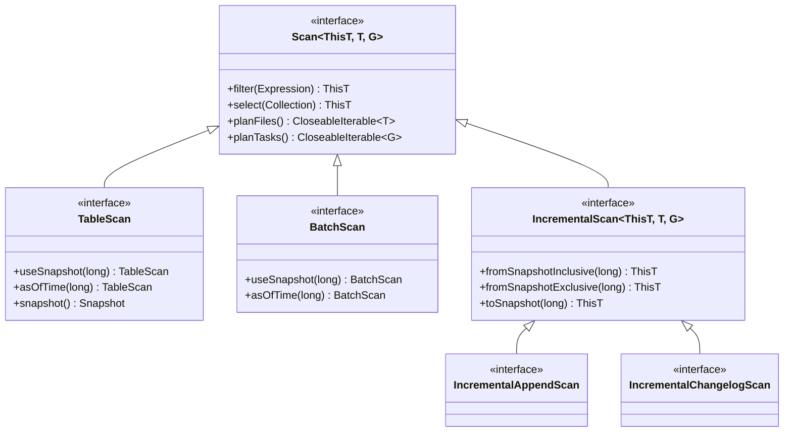
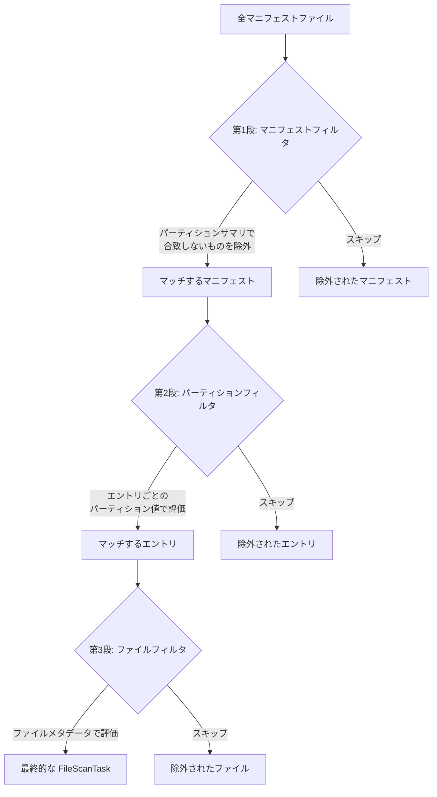

# 第14章 プランニングとスキャン

> **本章で読むソース**
>
> - [`api/src/main/java/org/apache/iceberg/Scan.java`](https://github.com/apache/iceberg/blob/apache-iceberg-1.11.0/api/src/main/java/org/apache/iceberg/Scan.java)
> - [`api/src/main/java/org/apache/iceberg/TableScan.java`](https://github.com/apache/iceberg/blob/apache-iceberg-1.11.0/api/src/main/java/org/apache/iceberg/TableScan.java)
> - [`api/src/main/java/org/apache/iceberg/BatchScan.java`](https://github.com/apache/iceberg/blob/apache-iceberg-1.11.0/api/src/main/java/org/apache/iceberg/BatchScan.java)
> - [`core/src/main/java/org/apache/iceberg/DataTableScan.java`](https://github.com/apache/iceberg/blob/apache-iceberg-1.11.0/core/src/main/java/org/apache/iceberg/DataTableScan.java)
> - [`core/src/main/java/org/apache/iceberg/ManifestGroup.java`](https://github.com/apache/iceberg/blob/apache-iceberg-1.11.0/core/src/main/java/org/apache/iceberg/ManifestGroup.java)
> - [`api/src/main/java/org/apache/iceberg/IncrementalAppendScan.java`](https://github.com/apache/iceberg/blob/apache-iceberg-1.11.0/api/src/main/java/org/apache/iceberg/IncrementalAppendScan.java)
> - [`api/src/main/java/org/apache/iceberg/IncrementalChangelogScan.java`](https://github.com/apache/iceberg/blob/apache-iceberg-1.11.0/api/src/main/java/org/apache/iceberg/IncrementalChangelogScan.java)

## この章の狙い

Iceberg テーブルからデータを読み取るには、まず「どのファイルのどの範囲を読むか」を決める **スキャンプランニング** が必要になる。
本章では、スキャン API の型階層、`ManifestGroup` による 3 段フィルタリング、「FileScanTask」から「CombinedScanTask」への集約、そしてインクリメンタルスキャンの仕組みを理解する。

## 前提

スナップショット、マニフェストリスト、マニフェストファイル、データファイルの階層構造を理解していること。
式 (Expression) とパーティション仕様 (PartitionSpec) の関係、および包含射影 (Inclusive Projection) の考え方を把握していること。

## Scan インターフェースの型階層

Iceberg のスキャン API はジェネリクスを用いた型階層を持つ。
最上位の **Scan** インターフェースが、フィルタリング、列プロジェクション、タスクプランニングの共通メソッドを定義する。

[`api/src/main/java/org/apache/iceberg/Scan.java` L38-L38](https://github.com/apache/iceberg/blob/apache-iceberg-1.11.0/api/src/main/java/org/apache/iceberg/Scan.java#L38-L38)

```java
public interface Scan<ThisT, T extends ScanTask, G extends ScanTaskGroup<T>> {
```

3 つの型パラメータはそれぞれ、メソッドチェーン用の自己型 `ThisT`、タスク型 `T`、タスクグループ型 `G` を表す。
この自己型パターンにより、`filter()` や `select()` の戻り値が具象型に解決される。

「Scan」インターフェースは 2 段階のプランニングメソッドを定義する。

[`api/src/main/java/org/apache/iceberg/Scan.java` L171-L173](https://github.com/apache/iceberg/blob/apache-iceberg-1.11.0/api/src/main/java/org/apache/iceberg/Scan.java#L171-L173)

```java
  CloseableIterable<T> planFiles();

  /**
```

`planFiles()` はファイル単位のタスクを返し、`planTasks()` はファイル分割と結合を経て均衡化されたタスクグループを返す。

下図にスキャン API の型階層を示す。



**TableScan** は `Scan<TableScan, FileScanTask, CombinedScanTask>` を具体化し、特定スナップショットやタイムトラベルを指定するメソッドを追加する。
**BatchScan** も同様の機能を持つが、戻り値の型パラメータが `ScanTask` と `ScanTaskGroup<ScanTask>` に汎化されている。
**IncrementalScan** はスナップショット範囲を指定するためのメソッド群を追加する。

## イミュータブルなスキャンオブジェクト

「Scan」の実装はすべてイミュータブルである。
`filter()` や `select()` のような設定メソッドは、現在のオブジェクトを変更するのではなく、新しいスキャンオブジェクトを返す。

[`core/src/main/java/org/apache/iceberg/BaseScan.java` L209-L212](https://github.com/apache/iceberg/blob/apache-iceberg-1.11.0/core/src/main/java/org/apache/iceberg/BaseScan.java#L209-L212)

```java
  @Override
  public ThisT filter(Expression expr) {
    return newRefinedScan(
        table, schema, context.filterRows(Expressions.and(context.rowFilter(), expr)));
```

`filter()` は既存のフィルタと新しいフィルタを AND で結合し、`newRefinedScan()` で新しいインスタンスを生成する。
この設計により、スキャンオブジェクトはスレッド間で安全に共有できる。
Javadoc にも明示されている。

> Scan objects are immutable and can be shared between threads.

## 列プロジェクションの遅延解決

スキャンの列プロジェクションは `BaseScan.lazyColumnProjection()` で遅延的に解決される。

[`core/src/main/java/org/apache/iceberg/BaseScan.java` L275-L303](https://github.com/apache/iceberg/blob/apache-iceberg-1.11.0/core/src/main/java/org/apache/iceberg/BaseScan.java#L275-L303)

```java
  private static Schema lazyColumnProjection(TableScanContext context, Schema schema) {
    Collection<String> selectedColumns = context.selectedColumns();
    if (selectedColumns != null) {
      Set<Integer> requiredFieldIds = Sets.newHashSet();

      // all of the filter columns are required
      requiredFieldIds.addAll(
          Binder.boundReferences(
              schema.asStruct(),
              Collections.singletonList(context.rowFilter()),
              context.caseSensitive()));

      // all of the projection columns are required
      Set<Integer> selectedIds;
      if (context.caseSensitive()) {
        selectedIds = TypeUtil.getProjectedIds(schema.select(selectedColumns));
      } else {
        selectedIds = TypeUtil.getProjectedIds(schema.caseInsensitiveSelect(selectedColumns));
      }
      requiredFieldIds.addAll(selectedIds);

      return TypeUtil.project(schema, requiredFieldIds);

    } else if (context.projectedSchema() != null) {
      return context.projectedSchema();
    }

    return schema;
  }
```

ここでの設計上の工夫は、フィルタ式で参照されるカラムを自動的にプロジェクションに含める点である。
ユーザーが `select("name")` と指定しつつ `filter(greaterThan("age", 30))` を設定した場合、プロジェクションスキーマには `name` と `age` の両方が含まれる。
フィルタ式が参照するカラムが読まれなければ、残余フィルタ (ResidualEvaluator) を行レベルで評価できなくなるためである。

## SnapshotScan と planFiles の共通処理

**SnapshotScan** は特定スナップショットを対象とするスキャンの基底クラスである。
`planFiles()` はスナップショットの存在チェック、イベント通知、メトリクス計測を行った上で、サブクラスの `doPlanFiles()` に委譲する。

[`core/src/main/java/org/apache/iceberg/SnapshotScan.java` L138-L182](https://github.com/apache/iceberg/blob/apache-iceberg-1.11.0/core/src/main/java/org/apache/iceberg/SnapshotScan.java#L138-L182)

```java
  @Override
  public CloseableIterable<T> planFiles() {
    Snapshot snapshot = snapshot();

    if (snapshot == null) {
      LOG.info("Scanning empty table {}", table());
      return CloseableIterable.empty();
    }

    LOG.info(
        "Scanning table {} snapshot {} created at {} with filter {}",
        table(),
        snapshot.snapshotId(),
        DateTimeUtil.formatTimestampMillis(snapshot.timestampMillis()),
        ExpressionUtil.toSanitizedString(filter()));

    Listeners.notifyAll(new ScanEvent(table().name(), snapshot.snapshotId(), filter(), schema()));
    // ... (中略) ...

    Timer.Timed planningDuration = scanMetrics().totalPlanningDuration().start();

    return CloseableIterable.whenComplete(
        doPlanFiles(),
        () -> {
          planningDuration.stop();
          // ... (中略) ...
          context().metricsReporter().report(scanReport);
        });
  }
```

`CloseableIterable.whenComplete()` により、イテレータがクローズされた時点でプランニング時間の計測を完了し、`ScanReport` をメトリクスレポーターに送信する。
この仕組みにより、プランニングの遅延実行（Lazy Evaluation）とメトリクス計測が両立する。

## DataTableScan: doPlanFiles の実装

**DataTableScan** は通常のテーブルスキャンの実装クラスである。
`doPlanFiles()` でスナップショットからマニフェストを取得し、「ManifestGroup」を構築する。

[`core/src/main/java/org/apache/iceberg/DataTableScan.java` L63-L92](https://github.com/apache/iceberg/blob/apache-iceberg-1.11.0/core/src/main/java/org/apache/iceberg/DataTableScan.java#L63-L92)

```java
  @Override
  public CloseableIterable<FileScanTask> doPlanFiles() {
    Snapshot snapshot = snapshot();

    FileIO io = table().io();
    List<ManifestFile> dataManifests = snapshot.dataManifests(io);
    List<ManifestFile> deleteManifests = snapshot.deleteManifests(io);
    scanMetrics().totalDataManifests().increment((long) dataManifests.size());
    scanMetrics().totalDeleteManifests().increment((long) deleteManifests.size());
    ManifestGroup manifestGroup =
        new ManifestGroup(io, dataManifests, deleteManifests)
            .caseSensitive(isCaseSensitive())
            .select(scanColumns())
            .filterData(filter())
            .schemasById(schemas())
            .specsById(specs())
            .scanMetrics(scanMetrics())
            .ignoreDeleted()
            .columnsToKeepStats(columnsToKeepStats());

    if (shouldIgnoreResiduals()) {
      manifestGroup = manifestGroup.ignoreResiduals();
    }

    if (shouldPlanWithExecutor() && (dataManifests.size() > 1 || deleteManifests.size() > 1)) {
      manifestGroup = manifestGroup.planWith(planExecutor());
    }

    return manifestGroup.planFiles();
  }
```

ここで注目すべき点が 3 つある。

1. データマニフェストと削除マニフェストの両方を「ManifestGroup」に渡している。削除ファイルの索引構築もプランニング時に行われる。
2. `ignoreDeleted()` を呼ぶことで、マニフェスト内の削除済みエントリをスキップする。通常スキャンでは既に削除されたファイルを読む必要がないためである。
3. マニフェストが複数ある場合にのみ並列実行を有効化する。マニフェストが 1 つしかなければ並列化のオーバーヘッドが無駄になるためである。

## ManifestGroup: 3 段フィルタリングの仕組み

**ManifestGroup** はスキャンプランニングの中核であり、マニフェストの走査と 3 段階のフィルタリングを実装する。
この 3 段フィルタリングは、大量のメタデータを効率的に刈り込むための設計上の工夫であり、Iceberg のスキャン性能を支える重要な機構である。

### 第 1 段: マニフェストレベルのフィルタリング

最初の段階では、マニフェストファイルそのものを評価し、フィルタ条件に合致するパーティションを含まないマニフェストをスキップする。
この処理は `entries()` メソッドの冒頭で行われる。

[`core/src/main/java/org/apache/iceberg/ManifestGroup.java` L279-L309](https://github.com/apache/iceberg/blob/apache-iceberg-1.11.0/core/src/main/java/org/apache/iceberg/ManifestGroup.java#L279-L309)

```java
    LoadingCache<Integer, ManifestEvaluator> evalCache =
        specsById == null
            ? null
            : Caffeine.newBuilder()
                .build(
                    specId -> {
                      PartitionSpec spec = specsById.get(specId);
                      return ManifestEvaluator.forPartitionFilter(
                          Expressions.and(
                              partitionFilter,
                              Projections.inclusive(spec, caseSensitive).project(dataFilter)),
                          spec,
                          caseSensitive);
                    });

    // ... (中略) ...

    CloseableIterable<ManifestFile> matchingManifests =
        evalCache == null
            ? closeableDataManifests
            : CloseableIterable.filter(
                scanMetrics.skippedDataManifests(),
                closeableDataManifests,
                manifest -> evalCache.get(manifest.partitionSpecId()).eval(manifest));
```

「ManifestEvaluator」はマニフェストファイルに格納されたパーティションフィールドのサマリ（下限値、上限値、null の有無）を使って評価する。
例えば `WHERE date = '2024-01-15'` というフィルタの場合、パーティション `date` の範囲が `[2024-02-01, 2024-02-28]` のマニフェストはスキップできる。

ここで `Projections.inclusive()` が使われる理由を説明する。
データフィルタ `date = '2024-01-15'` をパーティション式に変換するには、パーティション変換（例えば `month(date)`）を適用する必要がある。
「包含射影」は「元の式にマッチする行があるなら、射影された式もそのパーティションにマッチする」という性質を保証する。
これにより、偽陰性（本来読むべきパーティションを見落とす）が起きないことが保証される。

さらに、`ignoreDeleted` フラグが立っている場合は、追加済みファイルも既存ファイルも持たないマニフェストをスキップする。

[`core/src/main/java/org/apache/iceberg/ManifestGroup.java` L311-L320](https://github.com/apache/iceberg/blob/apache-iceberg-1.11.0/core/src/main/java/org/apache/iceberg/ManifestGroup.java#L311-L320)

```java
    if (ignoreDeleted) {
      // only scan manifests that have entries other than deletes
      // remove any manifests that don't have any existing or added files. if either the added or
      // existing files count is missing, the manifest must be scanned.
      matchingManifests =
          CloseableIterable.filter(
              scanMetrics.skippedDataManifests(),
              matchingManifests,
              manifest -> manifest.hasAddedFiles() || manifest.hasExistingFiles());
    }
```

### 第 2 段: パーティションレベルのフィルタリング

第 1 段を通過したマニフェストの中身を `ManifestReader` で読む際、パーティション値によるフィルタリングが行われる。

[`core/src/main/java/org/apache/iceberg/ManifestGroup.java` L344-L350](https://github.com/apache/iceberg/blob/apache-iceberg-1.11.0/core/src/main/java/org/apache/iceberg/ManifestGroup.java#L344-L350)

```java
                ManifestReader<DataFile> reader =
                    ManifestFiles.read(manifest, io, specsById)
                        .filterRows(dataFilter)
                        .filterPartitions(partitionFilter)
                        .caseSensitive(caseSensitive)
                        .select(columns)
                        .scanMetrics(scanMetrics);
```

`ManifestReader.filterRows()` はデータフィルタをパーティション式に射影し、各マニフェストエントリのパーティション値と照合する。
マニフェストレベルではサマリ（範囲）での判定だったのに対し、ここではエントリごとの正確なパーティション値で判定できるため、より精度の高いフィルタリングが行われる。

### 第 3 段: ファイルレベルのフィルタリング

第 2 段を通過したエントリに対して、ファイルのメタデータ（列の統計情報）によるフィルタリングが行われる。

[`core/src/main/java/org/apache/iceberg/ManifestGroup.java` L294-L299](https://github.com/apache/iceberg/blob/apache-iceberg-1.11.0/core/src/main/java/org/apache/iceberg/ManifestGroup.java#L294-L299)

```java
    Evaluator evaluator;
    if (fileFilter != null && fileFilter != Expressions.alwaysTrue()) {
      evaluator = new Evaluator(DataFile.getType(EMPTY_STRUCT), fileFilter, caseSensitive);
    } else {
      evaluator = null;
    }
```

[`core/src/main/java/org/apache/iceberg/ManifestGroup.java` L367-L373](https://github.com/apache/iceberg/blob/apache-iceberg-1.11.0/core/src/main/java/org/apache/iceberg/ManifestGroup.java#L367-L373)

```java
                if (evaluator != null) {
                  entries =
                      CloseableIterable.filter(
                          scanMetrics.skippedDataFiles(),
                          entries,
                          entry -> evaluator.eval((GenericDataFile) entry.file()));
                }
```

`fileFilter` はデータファイルのメタデータ（例えばファイルパスやファイルサイズ）に対する述語であり、通常のデータフィルタとは異なる。
このフィルタはファイルのプロパティを直接評価する。

### 3 段フィルタリングの全体像

以下の図に 3 段フィルタリングの流れを示す。



大規模テーブルでは数千のマニフェストファイルが存在しうるが、第 1 段のフィルタリングで大半をスキップできる。
マニフェストファイル自体の読み込みは I/O コストが高いため、メタデータ（パーティションサマリ）だけで判定できる第 1 段の効果は大きい。

## Caffeine キャッシュによるパーティション仕様ごとの評価器再利用

「ManifestGroup」は `ManifestEvaluator` と `ResidualEvaluator` を Caffeine の `LoadingCache` でキャッシュする。

[`core/src/main/java/org/apache/iceberg/ManifestGroup.java` L182-L189](https://github.com/apache/iceberg/blob/apache-iceberg-1.11.0/core/src/main/java/org/apache/iceberg/ManifestGroup.java#L182-L189)

```java
    LoadingCache<Integer, ResidualEvaluator> residualCache =
        Caffeine.newBuilder()
            .build(
                specId -> {
                  PartitionSpec spec = specsById.get(specId);
                  Expression filter = ignoreResiduals ? Expressions.alwaysTrue() : dataFilter;
                  return ResidualEvaluator.of(spec, filter, caseSensitive);
                });
```

Iceberg はスキーマ進化に伴いパーティション仕様が変わりうるため、同じテーブル内に複数のパーティション仕様 ID が混在する場合がある。
キャッシュのキーをパーティション仕様 ID とすることで、同じ仕様を持つマニフェスト間で評価器を再利用し、式の射影や評価器の構築コストを償却している。

## FileScanTask の生成

3 段フィルタリングを通過したエントリは `createFileScanTasks()` で「FileScanTask」に変換される。

[`core/src/main/java/org/apache/iceberg/ManifestGroup.java` L393-L405](https://github.com/apache/iceberg/blob/apache-iceberg-1.11.0/core/src/main/java/org/apache/iceberg/ManifestGroup.java#L393-L405)

```java
  private static CloseableIterable<FileScanTask> createFileScanTasks(
      CloseableIterable<ManifestEntry<DataFile>> entries, TaskContext ctx) {
    return CloseableIterable.transform(
        entries,
        entry -> {
          DataFile dataFile =
              ContentFileUtil.copy(entry.file(), ctx.shouldKeepStats(), ctx.columnsToKeepStats());
          DeleteFile[] deleteFiles = ctx.deletes().forEntry(entry);
          ScanMetricsUtil.fileTask(ctx.scanMetrics(), dataFile, deleteFiles);
          return new BaseFileScanTask(
              dataFile, deleteFiles, ctx.schemaAsString(), ctx.specAsString(), ctx.residuals());
        });
  }
```

各エントリに対して以下の処理が行われる。

1. `ContentFileUtil.copy()` でデータファイルのメタデータを防御コピーする。`ManifestReader` はエントリオブジェクトを再利用するため、この防御コピーがなければイテレーション中にデータが上書きされてしまう。
2. `DeleteFileIndex.forEntry()` でこのデータファイルに適用すべき削除ファイルを取得する。シーケンス番号とパーティション値に基づき、対応する位置削除ファイル、等値削除ファイル、削除ベクトルが返される。
3. `BaseFileScanTask` にデータファイル、削除ファイル配列、スキーマ、パーティション仕様、残余フィルタ評価器をまとめて格納する。

## ScanTask と CombinedScanTask

**ScanTask** はスキャンが生成する最小単位のタスクを表すインターフェースである。

[`api/src/main/java/org/apache/iceberg/ScanTask.java` L24-L24](https://github.com/apache/iceberg/blob/apache-iceberg-1.11.0/api/src/main/java/org/apache/iceberg/ScanTask.java#L24-L24)

```java
public interface ScanTask extends Serializable {
```

`Serializable` を実装している理由は、分散処理エンジンがタスクをワーカーノードに転送する必要があるためである。

**FileScanTask** は「ScanTask」を拡張し、データファイルの範囲（開始位置、長さ）と削除ファイルのリストを保持する。

[`api/src/main/java/org/apache/iceberg/FileScanTask.java` L25-L31](https://github.com/apache/iceberg/blob/apache-iceberg-1.11.0/api/src/main/java/org/apache/iceberg/FileScanTask.java#L25-L31)

```java
public interface FileScanTask extends ContentScanTask<DataFile>, SplittableScanTask<FileScanTask> {
  /**
   * A list of {@link DeleteFile delete files} to apply when reading the task's data file.
   *
   * @return a list of delete files to apply
   */
  List<DeleteFile> deletes();
```

**ContentScanTask** は残余フィルタ (residual) を保持する。
パーティション値で部分評価できなかった述語が残余フィルタとなり、実際のデータ行に対して適用される。

[`api/src/main/java/org/apache/iceberg/ContentScanTask.java` L68-L75](https://github.com/apache/iceberg/blob/apache-iceberg-1.11.0/api/src/main/java/org/apache/iceberg/ContentScanTask.java#L68-L75)

```java
  Expression residual();

  @Override
  default long estimatedRowsCount() {
    long splitOffset = (file().splitOffsets() != null) ? file().splitOffsets().get(0) : 0L;
    double scannedFileFraction = ((double) length()) / (file().fileSizeInBytes() - splitOffset);
    return (long) (scannedFileFraction * file().recordCount());
  }
```

**ScanTaskGroup** は複数の「ScanTask」をまとめるインターフェースである。
**CombinedScanTask** は `ScanTaskGroup<FileScanTask>` の具象型であり、複数の「FileScanTask」をグループ化する。

[`api/src/main/java/org/apache/iceberg/CombinedScanTask.java` L24-L35](https://github.com/apache/iceberg/blob/apache-iceberg-1.11.0/api/src/main/java/org/apache/iceberg/CombinedScanTask.java#L24-L35)

```java
public interface CombinedScanTask extends ScanTaskGroup<FileScanTask> {
  /**
   * Return the {@link FileScanTask tasks} in this combined task.
   *
   * @return a Collection of FileScanTask instances.
   */
  Collection<FileScanTask> files();

  @Override
  default Collection<FileScanTask> tasks() {
    return files();
  }
```

## planTasks: ファイル分割とビンパッキング

`BaseTableScan.planTasks()` は `planFiles()` の結果を分割し、均衡化されたタスクグループを生成する。

[`core/src/main/java/org/apache/iceberg/BaseTableScan.java` L42-L49](https://github.com/apache/iceberg/blob/apache-iceberg-1.11.0/core/src/main/java/org/apache/iceberg/BaseTableScan.java#L42-L49)

```java
  @Override
  public CloseableIterable<CombinedScanTask> planTasks() {
    CloseableIterable<FileScanTask> fileScanTasks = planFiles();
    CloseableIterable<FileScanTask> splitFiles =
        TableScanUtil.splitFiles(fileScanTasks, targetSplitSize());
    return TableScanUtil.planTasks(
        splitFiles, targetSplitSize(), splitLookback(), splitOpenFileCost());
  }
```

処理は 2 段階に分かれる。

1. **分割 (Split)**: `targetSplitSize` を超えるファイルを `SplittableScanTask.split()` で複数の「SplitScanTask」に分割する。分割はファイルの `splitOffsets` を利用して行われる。
2. **結合 (Bin Packing)**: 分割されたタスクを `BinPacking.PackingIterable` でビンパッキングし、各ビンのサイズが `targetSplitSize` に近づくようにまとめる。`splitLookback` パラメータは、パッキング時に先読みするタスク数を制御する。

`TableScanUtil.planTasks()` の内部ではビンパッキングの重み関数が定義されている。

[`core/src/main/java/org/apache/iceberg/util/TableScanUtil.java` L98-L102](https://github.com/apache/iceberg/blob/apache-iceberg-1.11.0/core/src/main/java/org/apache/iceberg/util/TableScanUtil.java#L98-L102)

```java
    Function<FileScanTask, Long> weightFunc =
        file ->
            Math.max(
                file.length() + ScanTaskUtil.contentSizeInBytes(file.deletes()),
                (1 + file.deletes().size()) * openFileCost);
```

重みは「データファイルと削除ファイルの合計サイズ」と「ファイルオープンコスト × ファイル数」の大きい方が採用される。
小さなファイルが多数ある場合、ファイルサイズよりもオープンコストの方が支配的になるため、この max 演算によりオープンコストの高い多数のファイルが 1 つのタスクに過剰にまとめられることを防いでいる。

## 並列プランニング

「ManifestGroup」は `planWith()` で `ExecutorService` を受け取り、マニフェストの並列走査を有効にする。

[`core/src/main/java/org/apache/iceberg/ManifestGroup.java` L216-L220](https://github.com/apache/iceberg/blob/apache-iceberg-1.11.0/core/src/main/java/org/apache/iceberg/ManifestGroup.java#L216-L220)

```java
    if (executorService != null) {
      return new ParallelIterable<>(tasks, executorService);
    } else {
      return CloseableIterable.concat(tasks);
    }
```

`ParallelIterable` は各マニフェストの読み取りをワーカースレッドに分散し、結果をキューに集約する。
キューのサイズには上限（デフォルト 30,000 エントリ）が設定されており、メモリ消費を抑制している。

`DataTableScan` 側では、マニフェストが複数ある場合にのみ並列化を有効にする判断を行う。

[`core/src/main/java/org/apache/iceberg/DataTableScan.java` L87-L89](https://github.com/apache/iceberg/blob/apache-iceberg-1.11.0/core/src/main/java/org/apache/iceberg/DataTableScan.java#L87-L89)

```java
    if (shouldPlanWithExecutor() && (dataManifests.size() > 1 || deleteManifests.size() > 1)) {
      manifestGroup = manifestGroup.planWith(planExecutor());
    }
```

## IncrementalAppendScan と IncrementalChangelogScan

「IncrementalScan」インターフェースはスナップショットの範囲を指定するメソッドを定義する。

[`api/src/main/java/org/apache/iceberg/IncrementalScan.java` L34-L34](https://github.com/apache/iceberg/blob/apache-iceberg-1.11.0/api/src/main/java/org/apache/iceberg/IncrementalScan.java#L34-L34)

```java
  ThisT fromSnapshotInclusive(long fromSnapshotId);
```

[`api/src/main/java/org/apache/iceberg/IncrementalScan.java` L61-L61](https://github.com/apache/iceberg/blob/apache-iceberg-1.11.0/api/src/main/java/org/apache/iceberg/IncrementalScan.java#L61-L61)

```java
  ThisT fromSnapshotExclusive(long fromSnapshotId);
```

[`api/src/main/java/org/apache/iceberg/IncrementalScan.java` L87-L87](https://github.com/apache/iceberg/blob/apache-iceberg-1.11.0/api/src/main/java/org/apache/iceberg/IncrementalScan.java#L87-L87)

```java
  ThisT toSnapshot(long toSnapshotId);
```

「IncrementalAppendScan」は追記のみのスナップショットを対象とするインクリメンタルスキャンのマーカーインターフェースである。
「IncrementalChangelogScan」はデータの変更履歴を読み取るためのインクリメンタルスキャンである。

### IncrementalDataTableScan の実装

旧来の `TableScan.appendsBetween()` のインクリメンタルスキャン実装を `IncrementalDataTableScan` が担う。
このクラスは `planFiles()` をオーバーライドし、指定範囲のスナップショットに対応するマニフェストだけを走査する。

[`core/src/main/java/org/apache/iceberg/IncrementalDataTableScan.java` L82-L122](https://github.com/apache/iceberg/blob/apache-iceberg-1.11.0/core/src/main/java/org/apache/iceberg/IncrementalDataTableScan.java#L82-L122)

```java
  @Override
  public CloseableIterable<FileScanTask> planFiles() {
    Long fromSnapshotId = context().fromSnapshotId();
    Long toSnapshotId = context().toSnapshotId();

    List<Snapshot> snapshots = snapshotsWithin(table(), fromSnapshotId, toSnapshotId);
    Set<Long> snapshotIds = Sets.newHashSet(Iterables.transform(snapshots, Snapshot::snapshotId));
    Set<ManifestFile> manifests =
        FluentIterable.from(snapshots)
            .transformAndConcat(snapshot -> snapshot.dataManifests(table().io()))
            .filter(manifestFile -> snapshotIds.contains(manifestFile.snapshotId()))
            .toSet();

    ManifestGroup manifestGroup =
        new ManifestGroup(table().io(), manifests)
            .caseSensitive(isCaseSensitive())
            .select(scanColumns())
            .filterData(filter())
            .filterManifestEntries(
                manifestEntry ->
                    snapshotIds.contains(manifestEntry.snapshotId())
                        && manifestEntry.status() == ManifestEntry.Status.ADDED)
            .schemasById(schemas())
            .specsById(table().specs())
            .ignoreDeleted()
            .columnsToKeepStats(columnsToKeepStats());
    // ... (中略) ...
    return manifestGroup.planFiles();
  }
```

通常スキャンとの違いは 2 つある。

1. `snapshotsWithin()` で対象スナップショットをフィルタリングし、その範囲内のスナップショット ID に紐づくマニフェストだけを収集する。
2. `filterManifestEntries()` でエントリレベルのフィルタを追加し、対象スナップショット内で `ADDED` ステータスのエントリだけを取得する。これにより、対象範囲で新規に追加されたファイルだけが結果に含まれる。

`snapshotsWithin()` は APPEND 操作のスナップショットのみを受け入れ、OVERWRITE 操作を検出すると例外を投げる。

[`core/src/main/java/org/apache/iceberg/IncrementalDataTableScan.java` L130-L146](https://github.com/apache/iceberg/blob/apache-iceberg-1.11.0/core/src/main/java/org/apache/iceberg/IncrementalDataTableScan.java#L130-L146)

```java
  private static List<Snapshot> snapshotsWithin(
      Table table, long fromSnapshotId, long toSnapshotId) {
    List<Snapshot> snapshots = Lists.newArrayList();
    for (Snapshot snapshot :
        SnapshotUtil.ancestorsBetween(toSnapshotId, fromSnapshotId, table::snapshot)) {
      // for now, incremental scan supports only appends
      if (snapshot.operation().equals(DataOperations.APPEND)) {
        snapshots.add(snapshot);
      } else if (snapshot.operation().equals(DataOperations.OVERWRITE)) {
        throw new UnsupportedOperationException(
            String.format(
                "Found %s operation, cannot support incremental data in snapshots (%s, %s]",
                DataOperations.OVERWRITE, fromSnapshotId, toSnapshotId));
      }
    }
    return snapshots;
  }
```

この制約は、上書き操作ではデータの追加と削除が同時に発生するため、「追記だけを読む」というインクリメンタルスキャンの前提と合致しないためである。

## 設計上の工夫: 階層的な刈り込みによるスキャン最適化

本章で読んだコードの中で最も重要な設計上の工夫は、「ManifestGroup」の 3 段フィルタリングである。

Iceberg の仕様はメタデータを階層構造で管理する。
テーブルメタデータ、スナップショット、マニフェストリスト、マニフェストファイル、そしてデータファイルという 5 層の構造である。
「ManifestGroup」はこの階層構造を活用し、上位層で不要なデータを刈り込むことで、下位層の読み取りを削減する。

具体的には、マニフェストファイル内のパーティションサマリ（各パーティションフィールドの下限値と上限値）は数十バイト程度であるのに対し、マニフェストファイルの中身を読むにはファイル I/O が必要になる。
テーブルに 10,000 個のマニフェストがあり、フィルタ条件で 99% を除外できる場合、第 1 段のフィルタリングだけで 9,900 回のファイル読み取りを回避できる。

さらに、パーティション仕様 ID ごとに `ManifestEvaluator` と `ResidualEvaluator` をキャッシュすることで、式の射影と評価器構築のコストをパーティション仕様ごとに 1 回に抑えている。
大規模テーブルでは同じパーティション仕様を共有するマニフェストが多数あるため、このキャッシュの効果は大きい。

## まとめ

- 「Scan」インターフェースはジェネリクスによる自己型パターンを採用し、型安全なメソッドチェーンを実現する。スキャンオブジェクトはイミュータブルであり、設定メソッドは常に新しいインスタンスを返す。
- `planFiles()` はファイル単位のタスクを返し、`planTasks()` はファイル分割とビンパッキングを経て均衡化されたタスクグループを返す。
- 「ManifestGroup」は 3 段フィルタリング（マニフェストレベル、パーティションレベル、ファイルレベル）により、不要なメタデータの読み取りを階層的に回避する。
- 「FileScanTask」はデータファイル、対応する削除ファイル、残余フィルタを保持する。「CombinedScanTask」は複数の「FileScanTask」をグループ化する。
- 「IncrementalDataTableScan」は対象スナップショット範囲内の APPEND 操作で追加されたファイルだけを返す。
- 列プロジェクションはフィルタ式が参照するカラムを自動的に含める。

## 関連する章

- [第13章 式と述語プッシュダウン](./13-expressions-and-predicate-pushdown.md)
- [第15章 削除ファイルとマージオンリード](./15-delete-files-and-merge-on-read.md)
