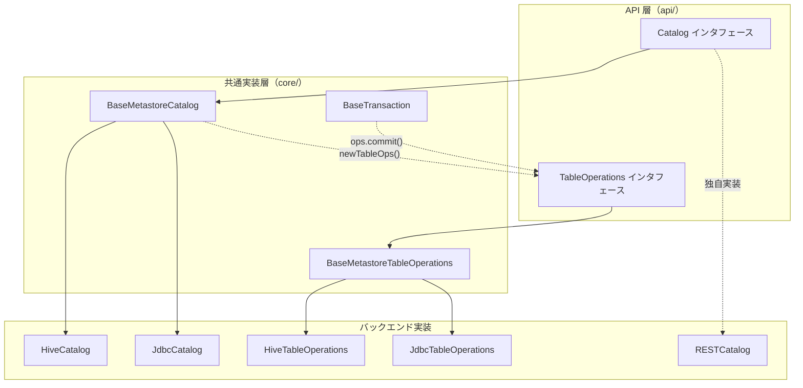
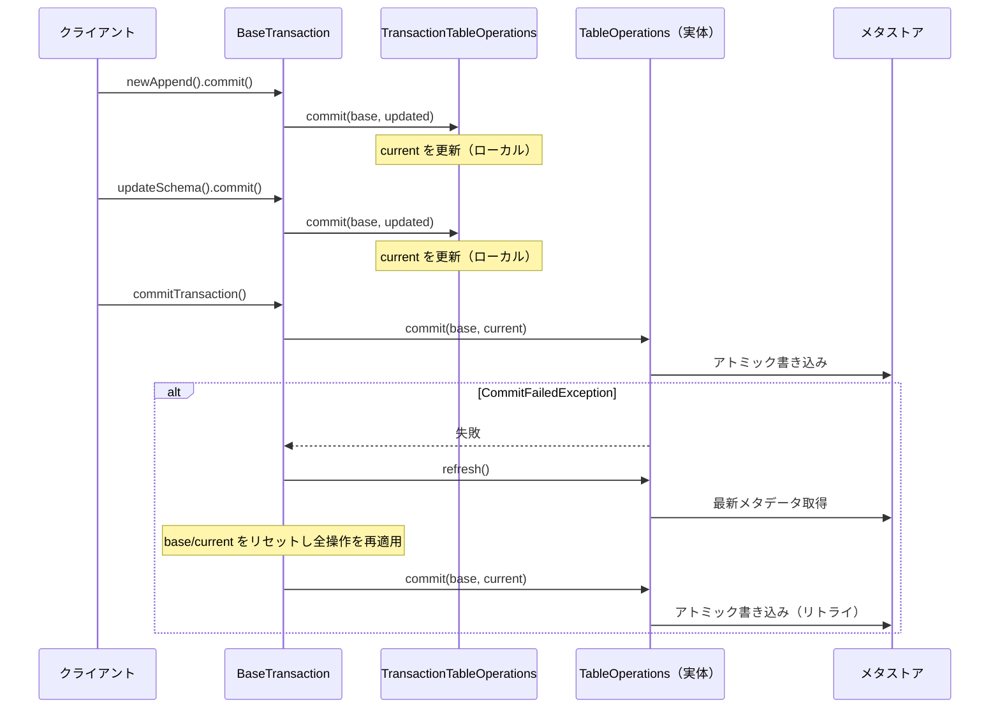

# 第15章 カタログ抽象と TableOperations

> **本章で読むソース**
>
> - [`api/src/main/java/org/apache/iceberg/catalog/Catalog.java`](https://github.com/apache/iceberg/blob/apache-iceberg-1.11.0/api/src/main/java/org/apache/iceberg/catalog/Catalog.java)
> - [`core/src/main/java/org/apache/iceberg/TableOperations.java`](https://github.com/apache/iceberg/blob/apache-iceberg-1.11.0/core/src/main/java/org/apache/iceberg/TableOperations.java)
> - [`core/src/main/java/org/apache/iceberg/BaseMetastoreCatalog.java`](https://github.com/apache/iceberg/blob/apache-iceberg-1.11.0/core/src/main/java/org/apache/iceberg/BaseMetastoreCatalog.java)
> - [`core/src/main/java/org/apache/iceberg/BaseMetastoreTableOperations.java`](https://github.com/apache/iceberg/blob/apache-iceberg-1.11.0/core/src/main/java/org/apache/iceberg/BaseMetastoreTableOperations.java)
> - [`core/src/main/java/org/apache/iceberg/BaseTransaction.java`](https://github.com/apache/iceberg/blob/apache-iceberg-1.11.0/core/src/main/java/org/apache/iceberg/BaseTransaction.java)

## この章の狙い

Iceberg テーブルの作成、読み込み、削除、名前変更を担う**カタログ**層と、メタデータの読み取りとアトミックな更新を担う **TableOperations** の設計を理解する。
カタログ実装が異なっても（REST、Hive、JDBC など）共通の楽観的並行制御がどのように組み込まれているか、そして `BaseTransaction` が複数操作をまとめて一回のコミットに集約する仕組みを把握する。

## 前提

第2章でテーブルメタデータの構造（`TableMetadata` の不変オブジェクト設計とメタデータ JSON ファイルの永続化方式）を理解していること。
第10章で追記や上書きなどのデータ操作が「新しいスナップショットの追加 + メタデータの差し替え」として実行されることを把握していること。

## Catalog インタフェースの全体像

**Catalog** はテーブルのライフサイクル管理を抽象化するインタフェースである。
テーブルの CRUD 操作をバックエンド非依存で定義しており、REST サーバ、Hive Metastore、JDBC データベース、Hadoop ファイルシステムなど、異なるメタストアに対して統一的な API を提供する。

[`api/src/main/java/org/apache/iceberg/catalog/Catalog.java` L33-L39](https://github.com/apache/iceberg/blob/apache-iceberg-1.11.0/api/src/main/java/org/apache/iceberg/catalog/Catalog.java#L33-L39)

```java
public interface Catalog {

  /**
   * Return the name for this catalog.
   *
   * @return this catalog's name
   */
```

インタフェースが定める主要操作は以下の5つである。

| メソッド | 役割 |
|---------|------|
| `listTables(Namespace)` | 指定名前空間のテーブル一覧を返す |
| `createTable(...)` | 新規テーブルを作成し `Table` を返す |
| `loadTable(TableIdentifier)` | 既存テーブルを読み込み `Table` を返す |
| `dropTable(TableIdentifier, boolean)` | テーブルを削除する（`purge` フラグでデータ削除を制御） |
| `renameTable(from, to)` | テーブルの名前を変更する |

### default メソッドによるオーバーロード削減

`createTable` は引数の組み合わせ違いで4つのオーバーロードを持つが、すべて `default` メソッドとして実装されており、最終的に `buildTable(...).create()` に委譲される。

[`api/src/main/java/org/apache/iceberg/catalog/Catalog.java` L64-L76](https://github.com/apache/iceberg/blob/apache-iceberg-1.11.0/api/src/main/java/org/apache/iceberg/catalog/Catalog.java#L64-L76)

```java
  default Table createTable(
      TableIdentifier identifier,
      Schema schema,
      PartitionSpec spec,
      String location,
      Map<String, String> properties) {

    return buildTable(identifier, schema)
        .withPartitionSpec(spec)
        .withLocation(location)
        .withProperties(properties)
        .create();
  }
```

この設計により、カタログ実装側は `buildTable` メソッド1つだけをオーバーライドすればよい。
テーブル作成のバリエーション（パーティション有無、ロケーション指定有無）はすべてビルダーパターンで吸収される。

### tableExists のデフォルト実装

`tableExists` は `loadTable` を呼び出して `NoSuchTableException` を捕捉する実装になっている。

[`api/src/main/java/org/apache/iceberg/catalog/Catalog.java` L279-L286](https://github.com/apache/iceberg/blob/apache-iceberg-1.11.0/api/src/main/java/org/apache/iceberg/catalog/Catalog.java#L279-L286)

```java
  default boolean tableExists(TableIdentifier identifier) {
    try {
      loadTable(identifier);
      return true;
    } catch (NoSuchTableException e) {
      return false;
    }
  }
```

例外制御による存在確認は一見コストが高いように見えるが、カタログ実装ごとの最適化（例えば REST カタログでの HEAD リクエスト）は、この `default` メソッドをオーバーライドすることで実現できる。
インタフェースの側で「正しいが非最適なデフォルト」を提供し、各実装に最適化の余地を残す設計である。

### TableBuilder インタフェース

テーブル作成とトランザクション開始は、内部インタフェースである `TableBuilder` を通じて行われる。

[`api/src/main/java/org/apache/iceberg/catalog/Catalog.java` L401-L412](https://github.com/apache/iceberg/blob/apache-iceberg-1.11.0/api/src/main/java/org/apache/iceberg/catalog/Catalog.java#L401-L412)

```java
  interface TableBuilder {
    /**
     * Sets a partition spec for the table.
     *
     * @param spec a partition spec
     * @return this for method chaining
     */
    TableBuilder withPartitionSpec(PartitionSpec spec);

    /**
     * Sets a sort order for the table.
     *
```

`create()` はテーブルを即時作成し `Table` を返す。
一方 `createTransaction()` や `replaceTransaction()` はテーブル作成や置換を「トランザクション」として返し、呼び出し元がスキーマ変更やプロパティ設定などの追加操作を束ねてから `commitTransaction()` でまとめてコミットできるようにする。

## TableOperations: メタデータアクセスの SPI

**TableOperations** はカタログとテーブルメタデータの間をつなぐ SPI（Service Provider Interface）である。
「カタログ」がテーブルのライフサイクル管理を担うのに対して、「TableOperations」は個々のテーブルに対するメタデータの読み取りとアトミックな更新を担う。

[`core/src/main/java/org/apache/iceberg/TableOperations.java` L28-L91](https://github.com/apache/iceberg/blob/apache-iceberg-1.11.0/core/src/main/java/org/apache/iceberg/TableOperations.java#L28-L91)

```java
public interface TableOperations {

  TableMetadata current();

  TableMetadata refresh();

  void commit(TableMetadata base, TableMetadata metadata);

  FileIO io();
  // ... (中略) ...
  String metadataFileLocation(String fileName);

  LocationProvider locationProvider();
```

3つのコアメソッドの役割は次のとおりである。

| メソッド | 役割 |
|---------|------|
| `current()` | キャッシュされた現在のメタデータを返す（リモート問い合わせなし） |
| `refresh()` | メタストアから最新のメタデータを取得してキャッシュを更新する |
| `commit(base, metadata)` | `base`（変更前）と `metadata`（変更後）を渡し、アトミックに差し替える |

### commit の契約

`commit` メソッドの Javadoc には、実装が守るべき厳密な契約が記されている。

1. `base` が現在のメタデータと一致しなければ上書きを拒否する（楽観的並行制御）
2. アトミックなコミット操作が成功した後は、失敗しうる操作を実行してはならない（成功とコミット失敗の区別がつかなくなるため）
3. コミットの成否が不明な場合は `CommitStateUnknownException` をスローする（ネットワーク分断時などに未コミットファイルの安全な後片付けを保証するため）

この3番目の規定が重要である。
通常の例外はコミット失敗として扱い、未コミットのメタデータファイルを削除できる。
しかし `CommitStateUnknownException` の場合は、コミットが実は成功している可能性があるため、ファイルを削除してはならない。

### temp メソッドによるトランザクション支援

`temp` メソッドは、まだコミットされていないメタデータに基づいた一時的な `TableOperations` を返す。

[`core/src/main/java/org/apache/iceberg/TableOperations.java` L107-L109](https://github.com/apache/iceberg/blob/apache-iceberg-1.11.0/core/src/main/java/org/apache/iceberg/TableOperations.java#L107-L109)

```java
  default TableOperations temp(TableMetadata uncommittedMetadata) {
    return this;
  }
```

トランザクション内で、まだコミットされていないメタデータの状態（例えば変更後のテーブルロケーション）に基づいてメタデータファイルのパスを計算する必要がある場合に使用される。
この一時 `TableOperations` では `refresh()` と `commit()` は呼び出せない。

## カタログと TableOperations の関係

Catalog と TableOperations は、それぞれ異なるレベルの抽象を担う。
以下の図はその関係を示す。



「Catalog」はテーブルの識別子から「TableOperations」を生成するファクトリの役割を持つ。
「BaseMetastoreCatalog」の `newTableOps` 抽象メソッドがこの接続点である。
各カタログ実装は `newTableOps` をオーバーライドして、自身のバックエンドに対応した `TableOperations` を返す。

## BaseMetastoreCatalog: 共通フローの実装

**BaseMetastoreCatalog** は `Catalog` インタフェースの共通ロジックを実装する抽象クラスである。
`loadTable`、`registerTable`、`buildTable` の実装を提供し、バックエンド固有のロジックは2つの抽象メソッドに委譲する。

[`core/src/main/java/org/apache/iceberg/BaseMetastoreCatalog.java` L135-L137](https://github.com/apache/iceberg/blob/apache-iceberg-1.11.0/core/src/main/java/org/apache/iceberg/BaseMetastoreCatalog.java#L135-L137)

```java
  protected abstract TableOperations newTableOps(TableIdentifier tableIdentifier);

  protected abstract String defaultWarehouseLocation(TableIdentifier tableIdentifier);
```

`newTableOps` はテーブル識別子から `TableOperations` を生成する。
`defaultWarehouseLocation` はテーブルのデフォルトパスを返す。
この2つだけをカタログ実装側が定義すれば、テーブルの読み込みから作成、トランザクション管理まで共通フローが動作する。

### loadTable の流れ

[`core/src/main/java/org/apache/iceberg/BaseMetastoreCatalog.java` L45-L67](https://github.com/apache/iceberg/blob/apache-iceberg-1.11.0/core/src/main/java/org/apache/iceberg/BaseMetastoreCatalog.java#L45-L67)

```java
  public Table loadTable(TableIdentifier identifier) {
    Table result;
    if (isValidIdentifier(identifier)) {
      TableOperations ops = newTableOps(identifier);
      if (ops.current() == null) {
        // the identifier may be valid for both tables and metadata tables
        if (isValidMetadataIdentifier(identifier)) {
          result = loadMetadataTable(identifier);

        } else {
          throw new NoSuchTableException("Table does not exist: %s", identifier);
        }

      } else {
        result = new BaseTable(ops, fullTableName(name(), identifier), metricsReporter());
      }

    } else if (isValidMetadataIdentifier(identifier)) {
      result = loadMetadataTable(identifier);

    } else {
      throw new NoSuchTableException("Invalid table identifier: %s", identifier);
    }
```

処理の流れは以下のとおりである。

1. `newTableOps` で「TableOperations」を生成する
2. `ops.current()` を呼び出してメタデータの有無を確認する
3. メタデータが存在すれば `BaseTable` でラップして返す
4. メタデータが存在しなければ、メタデータテーブル（`history`、`snapshots` など仮想テーブル）の可能性を試す
5. どちらにも該当しなければ `NoSuchTableException` をスローする

`ops.current()` が `null` を返すのは、カタログにテーブルのメタデータロケーションが登録されていない場合である。
この時点ではファイルシステム上のメタデータファイルの存在は確認せず、カタログ側のポインタの有無だけで判定する。

### テーブル作成の流れ

`BaseMetastoreCatalogTableBuilder.create()` は、メタデータの生成とコミットを次の手順で行う。

[`core/src/main/java/org/apache/iceberg/BaseMetastoreCatalog.java` L189-L207](https://github.com/apache/iceberg/blob/apache-iceberg-1.11.0/core/src/main/java/org/apache/iceberg/BaseMetastoreCatalog.java#L189-L207)

```java
    public Table create() {
      TableOperations ops = newTableOps(identifier);
      if (ops.current() != null) {
        throw new AlreadyExistsException("Table already exists: %s", identifier);
      }

      String baseLocation = location != null ? location : defaultWarehouseLocation(identifier);
      tableProperties.putAll(tableOverrideProperties());
      TableMetadata metadata =
          TableMetadata.newTableMetadata(schema, spec, sortOrder, baseLocation, tableProperties);

      try {
        ops.commit(null, metadata);
      } catch (CommitFailedException ignored) {
        throw new AlreadyExistsException("Table was created concurrently: %s", identifier);
      }

      return new BaseTable(ops, fullTableName(name(), identifier), metricsReporter());
    }
```

テーブル作成時の `ops.commit(null, metadata)` で、第一引数の `base` が `null` である点に注目する。
`base` が `null` であることは「このコミットはテーブルの新規作成である」ことを示す。
もし別のプロセスが同時に同じテーブルを作成して `CommitFailedException` が発生した場合、`AlreadyExistsException` に変換される。

### カタログレベルのプロパティ制御

「BaseMetastoreCatalogTableBuilder」は、テーブル作成時にカタログレベルのデフォルトプロパティと強制プロパティを自動的に適用する。

[`core/src/main/java/org/apache/iceberg/BaseMetastoreCatalog.java` L266-L273](https://github.com/apache/iceberg/blob/apache-iceberg-1.11.0/core/src/main/java/org/apache/iceberg/BaseMetastoreCatalog.java#L266-L273)

```java
    private Map<String, String> tableDefaultProperties() {
      Map<String, String> tableDefaultProperties =
          PropertyUtil.propertiesWithPrefix(properties(), CatalogProperties.TABLE_DEFAULT_PREFIX);
      // ... (中略) ...
      return tableDefaultProperties;
    }

    private Map<String, String> tableOverrideProperties() {
      Map<String, String> tableOverrideProperties =
          PropertyUtil.propertiesWithPrefix(properties(), CatalogProperties.TABLE_OVERRIDE_PREFIX);
      // ... (中略) ...
      return tableOverrideProperties;
    }
```

`TABLE_DEFAULT_PREFIX` のプロパティはコンストラクタ時にテーブルプロパティへマージされるため、ユーザーが明示的に指定したプロパティで上書きできる。
一方 `TABLE_OVERRIDE_PREFIX` のプロパティは `create()` 時に `putAll` されるため、ユーザー指定値より優先される。
この二段階のプロパティ制御により、組織のガバナンスポリシーをカタログ設定だけで強制できる。

## BaseMetastoreTableOperations: 楽観的並行制御の実装

**BaseMetastoreTableOperations** は「TableOperations」の共通ロジックを実装する抽象クラスである。
メタデータの遅延読み込み、楽観的並行制御によるコミット、メタデータファイルのバージョン管理を提供する。

### メタデータのキャッシュと遅延読み込み

[`core/src/main/java/org/apache/iceberg/BaseMetastoreTableOperations.java` L54-L75](https://github.com/apache/iceberg/blob/apache-iceberg-1.11.0/core/src/main/java/org/apache/iceberg/BaseMetastoreTableOperations.java#L54-L75)

```java
  private TableMetadata currentMetadata = null;
  private String currentMetadataLocation = null;
  private boolean shouldRefresh = true;
  private int version = -1;

  // ... (中略) ...

  @Override
  public TableMetadata current() {
    if (shouldRefresh) {
      return refresh();
    }
    return currentMetadata;
  }
```

`shouldRefresh` フラグにより、`current()` の初回呼び出し時にメタストアから最新メタデータを取得する。
コミット成功後にも `requestRefresh()` で `shouldRefresh` が `true` にセットされ、次の `current()` 呼び出しで最新状態を反映する。
一方、同一操作内での複数回の `current()` 呼び出しではメタストアへの問い合わせを繰り返さない。

### commit メソッドの楽観的並行制御

`commit` は Iceberg の並行制御の中核である。

[`core/src/main/java/org/apache/iceberg/BaseMetastoreTableOperations.java` L109-L135](https://github.com/apache/iceberg/blob/apache-iceberg-1.11.0/core/src/main/java/org/apache/iceberg/BaseMetastoreTableOperations.java#L109-L135)

```java
  public void commit(TableMetadata base, TableMetadata metadata) {
    // if the metadata is already out of date, reject it
    if (base != current()) {
      if (base != null) {
        throw new CommitFailedException("Cannot commit: stale table metadata");
      } else {
        // when current is non-null, the table exists. but when base is null, the commit is trying
        // to create the table
        throw new AlreadyExistsException("Table already exists: %s", tableName());
      }
    }
    // if the metadata is not changed, return early
    if (base == metadata) {
      LOG.info("Nothing to commit.");
      return;
    }

    long start = System.currentTimeMillis();
    doCommit(base, metadata);
    CatalogUtil.deleteRemovedMetadataFiles(io(), base, metadata);
    requestRefresh();
    // ... (中略) ...
  }
```

楽観的並行制御は2段階で構成される。

1. **クライアント側のチェック**（上記 `base != current()` の比較）: 操作開始時に読んだメタデータが現在のメタデータと同一インスタンスであることを参照比較で確認する。`==` 比較（参照の同一性）を使うのは、`TableMetadata` が不変オブジェクトであり、異なるバージョンは必ず異なるインスタンスだからである。
2. **メタストア側のアトミック操作**（`doCommit` 内）: 具体的なアトミック保証はバックエンドごとに異なる。Hive カタログはメタストアのロック、JDBC カタログはデータベースのトランザクション、Hadoop カタログはファイルシステムのアトミックリネームを利用する。

`doCommit` の後に `CatalogUtil.deleteRemovedMetadataFiles` で古いメタデータファイルを削除し、`requestRefresh` で次回の `current()` 呼び出しで最新状態を読むよう設定する。

### メタデータファイルのバージョン管理

新しいメタデータファイルの名前は、バージョン番号と UUID を組み合わせて生成される。

[`core/src/main/java/org/apache/iceberg/BaseMetastoreTableOperations.java` L342-L350](https://github.com/apache/iceberg/blob/apache-iceberg-1.11.0/core/src/main/java/org/apache/iceberg/BaseMetastoreTableOperations.java#L342-L350)

```java
  private String newTableMetadataFilePath(TableMetadata meta, int newVersion) {
    String codecName =
        meta.property(
            TableProperties.METADATA_COMPRESSION, TableProperties.METADATA_COMPRESSION_DEFAULT);
    String fileExtension = TableMetadataParser.getFileExtension(codecName);
    return metadataFileLocation(
        meta,
        String.format(Locale.ROOT, "%05d-%s%s", newVersion, UUID.randomUUID(), fileExtension));
  }
```

ファイル名は `00001-<uuid>.metadata.json` の形式になる。
バージョン番号はゼロ埋め5桁で、人間が時系列を把握しやすくなっている。
UUID を含めることでファイル名の一意性を保証し、S3 のネガティブキャッシュ問題（存在しないキーへの問い合わせ結果がキャッシュされる）を回避する。
この設計のため、`writeNewMetadata` は S3 上で安全な `overwrite` 操作でファイルを書き込む。

### コミット状態の不確実性への対処

ネットワーク分断などでコミットの成否が判別できない場合の対処として、`checkCommitStatus` メソッドが用意されている。

[`core/src/main/java/org/apache/iceberg/BaseMetastoreTableOperations.java` L298-L304](https://github.com/apache/iceberg/blob/apache-iceberg-1.11.0/core/src/main/java/org/apache/iceberg/BaseMetastoreTableOperations.java#L298-L304)

```java
  protected CommitStatus checkCommitStatus(String newMetadataLocation, TableMetadata config) {
    return checkCommitStatus(
        tableName(),
        newMetadataLocation,
        config.properties(),
        () -> checkCurrentMetadataLocation(newMetadataLocation));
  }
```

このメソッドはメタストアを再読み込みし、新しいメタデータロケーションが現在のロケーションまたは過去のロケーション履歴に含まれているかを確認する。
含まれていればコミットは成功していたと判定し、含まれていなくても即座に失敗とはせず `UNKNOWN` を返す。
別のコミッタが先にコミットに成功し、自分のコミットの上に別のメタデータが積まれている可能性があるため、過去のロケーション履歴も検索する必要がある。

## BaseTransaction: 複数操作のアトミックなコミット

**BaseTransaction** は、複数のテーブル操作（スキーマ変更、データ追加、プロパティ更新など）をローカルに蓄積し、`commitTransaction()` で一括コミットする仕組みを提供する。

### トランザクションの種類

[`core/src/main/java/org/apache/iceberg/BaseTransaction.java` L59-L64](https://github.com/apache/iceberg/blob/apache-iceberg-1.11.0/core/src/main/java/org/apache/iceberg/BaseTransaction.java#L59-L64)

```java
  enum TransactionType {
    CREATE_TABLE,
    REPLACE_TABLE,
    CREATE_OR_REPLACE_TABLE,
    SIMPLE
  }
```

4種類のトランザクションがあり、それぞれコミット時の振る舞いが異なる。

| 種類 | 用途 | リトライ |
|------|------|---------|
| `CREATE_TABLE` | テーブル新規作成 | リトライなし（別プロセスが作成済みなら失敗） |
| `REPLACE_TABLE` | テーブルの完全置換 | 指数バックオフ付きリトライ |
| `CREATE_OR_REPLACE_TABLE` | 存在すれば置換、なければ作成 | 指数バックオフ付きリトライ |
| `SIMPLE` | 既存テーブルへの操作のまとめ | 指数バックオフ付きリトライ + 全操作の再適用 |

### TransactionTableOperations: ローカルでの操作蓄積

トランザクション内部では `TransactionTableOperations` が「TableOperations」として振る舞い、各操作の `commit` 呼び出しを実際のメタストアへのコミットではなく、ローカルメタデータの更新に変換する。

[`core/src/main/java/org/apache/iceberg/BaseTransaction.java` L483-L509](https://github.com/apache/iceberg/blob/apache-iceberg-1.11.0/core/src/main/java/org/apache/iceberg/BaseTransaction.java#L483-L509)

```java
  public class TransactionTableOperations implements TableOperations {
    private TableOperations tempOps = ops.temp(current);

    @Override
    public TableMetadata current() {
      return current;
    }

    @Override
    public TableMetadata refresh() {
      return current;
    }

    @Override
    @SuppressWarnings("ConsistentOverrides")
    public void commit(TableMetadata underlyingBase, TableMetadata metadata) {
      if (underlyingBase != current) {
        // trigger a refresh and retry
        throw new CommitFailedException("Table metadata refresh is required");
      }

      BaseTransaction.this.current = metadata;

      this.tempOps = ops.temp(metadata);

      BaseTransaction.this.hasLastOpCommitted = true;
    }
```

`commit` メソッドは実際にメタストアへ書き込まず、`BaseTransaction.this.current` を新しいメタデータで上書きするだけである。
`refresh()` も常に `current`（ローカルに蓄積されたメタデータ）を返す。
これにより、トランザクション内の各操作は「前の操作で更新されたメタデータ」を前提として動作し、操作の連鎖が成立する。

### commitSimpleTransaction: リトライと操作の再適用

`SIMPLE` トランザクションのコミット処理が最も複雑であり、楽観的並行制御の本領が発揮される。

[`core/src/main/java/org/apache/iceberg/BaseTransaction.java` L351-L355](https://github.com/apache/iceberg/blob/apache-iceberg-1.11.0/core/src/main/java/org/apache/iceberg/BaseTransaction.java#L351-L355)

```java
  private void commitSimpleTransaction() {
    // if there were no changes, don't try to commit
    if (base == current) {
      return;
    }

    Set<Long> startingSnapshots =
        base.snapshots().stream().map(Snapshot::snapshotId).collect(Collectors.toSet());
    try {
      Tasks.foreach(ops)
          .retry(base.propertyAsInt(COMMIT_NUM_RETRIES, COMMIT_NUM_RETRIES_DEFAULT))
          .exponentialBackoff(
              // ... (中略) ...
              2.0 /* exponential */)
          .onlyRetryOn(CommitFailedException.class)
          .run(
              underlyingOps -> {
                applyUpdates(underlyingOps);

                underlyingOps.commit(base, current);
              });
    // ... (中略) ...
    }
```

コミットが `CommitFailedException` で失敗した場合、以下の手順でリトライが行われる。

[`core/src/main/java/org/apache/iceberg/BaseTransaction.java` L443-L459](https://github.com/apache/iceberg/blob/apache-iceberg-1.11.0/core/src/main/java/org/apache/iceberg/BaseTransaction.java#L443-L459)

```java
  private void applyUpdates(TableOperations underlyingOps) {
    if (base != underlyingOps.refresh()) {
      // use refreshed the metadata
      this.base = underlyingOps.current();
      this.current = underlyingOps.current();
      for (PendingUpdate update : updates) {
        // re-commit each update in the chain to apply it and update current
        try {
          update.commit();
        } catch (CommitFailedException e) {
          // Cannot pass even with retry due to conflicting metadata changes. So, break the
          // retry-loop.
          throw new PendingUpdateFailedException(e);
        }
      }
    }
  }
```

`applyUpdates` はメタストアから最新メタデータを取得し、`base` と `current` をリセットした上で、蓄積されたすべての操作を最新メタデータに対して再適用する。
操作の再適用中に競合が検出された場合（例えば、別のコミッタが追加したスナップショットと衝突するスキーマ変更）は `PendingUpdateFailedException` でリトライループ全体を中断する。

以下の図はトランザクションのコミットフローを示す。



### テーブル作成トランザクション

`CREATE_TABLE` トランザクションはリトライを行わない。

[`core/src/main/java/org/apache/iceberg/BaseTransaction.java` L274-L296](https://github.com/apache/iceberg/blob/apache-iceberg-1.11.0/core/src/main/java/org/apache/iceberg/BaseTransaction.java#L274-L296)

```java
  private void commitCreateTransaction() {
    // this operation creates the table. if the commit fails, this cannot retry because another
    // process has created the same table.
    try {
      ops.commit(null, current);

    } catch (CommitStateUnknownException e) {
      throw e;

    } catch (RuntimeException e) {
      // the commit failed and no files were committed. clean up each update
      if (!ops.requireStrictCleanup() || e instanceof CleanableFailure) {
        cleanAllUpdates();
      }

      throw e;
    } finally {
      // ... (中略) ...
      deleteUncommittedFiles(deletedFiles);
    }
  }
```

テーブル作成は冪等ではない。
別のプロセスが同じテーブルを先に作成した場合、リトライしても成功する見込みがないため、そのまま例外をスローする。
失敗時は `cleanAllUpdates` でマニフェストファイルなどの中間生成物を削除し、`deleteUncommittedFiles` で未コミットファイルを片付ける。
ただし `CommitStateUnknownException` の場合はクリーンアップを行わない。

## 設計上の工夫: base/metadata 比較による楽観的並行制御

Iceberg のコミットプロトコルにおける最も重要な設計上の工夫は、`commit(base, metadata)` の二引数設計である。

従来の分散システムにおける楽観的並行制御では、バージョン番号やタイムスタンプを使って競合を検出することが多い。
Iceberg はメタデータオブジェクトの参照同一性（`base != current()` の `!=` 演算子）で競合を検出する。
`TableMetadata` は不変オブジェクトであるため、メタデータが更新されるたびに新しいインスタンスが作られ、参照比較だけで「自分が読んだメタデータが最新かどうか」を判定できる。

この設計には3つの利点がある。

1. バージョン番号の管理が不要になる。メタデータファイル名にバージョン番号を含めるのはファイル管理の利便性のためであり、並行制御には使わない。
2. カタログ実装側は `doCommit` で「メタデータロケーションのポインタ差し替え」だけをアトミックに行えばよく、アプリケーションレベルのロック管理から解放される。
3. `base` が `null` の場合は新規作成、`base == metadata` の場合は変更なしと判定でき、操作の種別判定も同じ仕組みで行える。

これにより、ロックフリーのファイルシステム（S3 など）から排他制御を持つメタストア（Hive Metastore など）まで、異なる並行制御特性を持つバックエンドに対して統一的なコミットプロトコルを適用できる。

## まとめ

- 「Catalog」インタフェースはテーブルの CRUD を定義し、`buildTable` を通じた `TableBuilder` パターンでオーバーロードの爆発を回避する
- 「TableOperations」は `current`、`refresh`、`commit` の3メソッドでメタデータのアトミックな読み書きを抽象化する SPI である
- 「BaseMetastoreCatalog」は `newTableOps` と `defaultWarehouseLocation` の2つの抽象メソッドだけを実装すれば動作する共通フローを提供する
- 「BaseMetastoreTableOperations」の `commit` は `base != current()` の参照比較で楽観的並行制御を実現し、バックエンド固有のアトミック操作は `doCommit` に委譲する
- 「BaseTransaction」は操作をローカルに蓄積し、`commitTransaction` で一括コミットする。リトライ時はすべての操作を最新メタデータに対して再適用する
- メタデータファイル名に UUID を含めることで S3 のネガティブキャッシュ問題を回避し、バージョン番号でファイルの時系列を追跡可能にする
- コミット状態が不明な場合は `CommitStateUnknownException` をスローし、未コミットファイルの誤削除を防ぐ

## 関連する章

- [第2章 テーブルメタデータとフォーマットバージョン](../part00-overview/02-table-metadata.md)
- [第10章 追記と上書き](../part04-data-operations/10-append-and-overwrite.md)
- [第16章 REST カタログ](16-rest-catalog.md)
- [第17章 Hive、JDBC、Hadoop カタログ](17-hive-jdbc-hadoop-catalog.md)
