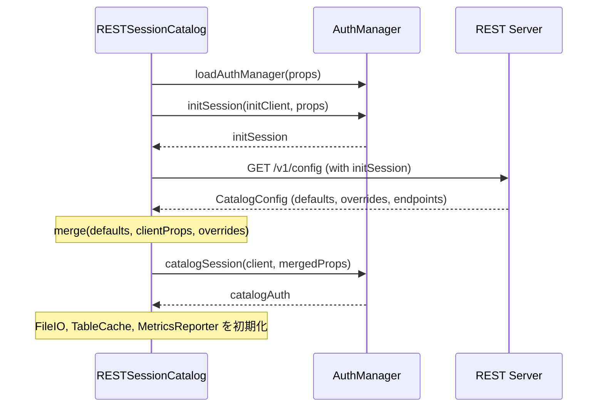
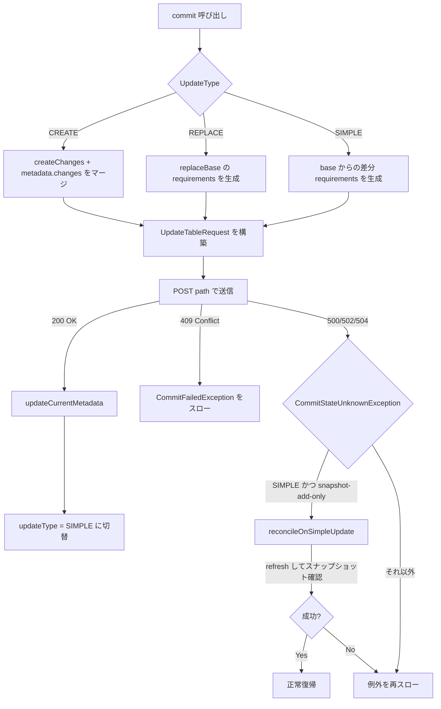

# 第16章 REST カタログ

> **本章で読むソース**
>
> - [`core/src/main/java/org/apache/iceberg/rest/RESTCatalog.java`](https://github.com/apache/iceberg/blob/apache-iceberg-1.11.0/core/src/main/java/org/apache/iceberg/rest/RESTCatalog.java)
> - [`core/src/main/java/org/apache/iceberg/rest/RESTSessionCatalog.java`](https://github.com/apache/iceberg/blob/apache-iceberg-1.11.0/core/src/main/java/org/apache/iceberg/rest/RESTSessionCatalog.java)
> - [`core/src/main/java/org/apache/iceberg/rest/RESTTableOperations.java`](https://github.com/apache/iceberg/blob/apache-iceberg-1.11.0/core/src/main/java/org/apache/iceberg/rest/RESTTableOperations.java)
> - [`open-api/rest-catalog-open-api.yaml`](https://github.com/apache/iceberg/blob/apache-iceberg-1.11.0/open-api/rest-catalog-open-api.yaml)

## この章の狙い

Iceberg が定める REST Catalog API の仕様と、その参照実装である `RESTCatalog` / `RESTSessionCatalog` / `RESTTableOperations` の設計を理解する。
なぜ REST プロトコルが必要なのか、クレデンシャル分離やマルチテナントをどのように実現するか、コミットフローでの楽観的並行制御がどう機能するかを読み解く。

## 前提

第2章のテーブルメタデータ構造と、Iceberg のカタログインターフェース（`Catalog`, `SupportsNamespaces`）の役割を把握していること。
HTTP REST API と OAuth2 の基礎知識があること。

## REST Catalog Protocol の設計思想

Iceberg のカタログ実装は Hive Metastore、JDBC、Hadoop などいくつも存在する。
しかしこれらはいずれも特定のバックエンドに強く結合しており、クラウドサービスとして提供するには不向きだった。
REST Catalog Protocol は、カタログ操作を HTTP エンドポイントとして標準化し、クライアントとサーバの間に明確な契約を設けることで3つの課題を解決する。

1. **マルチテナント**: サーバ側で `prefix` パラメータによってテナントやウェアハウスを分離する。クライアントは自身のプレフィックス配下のリソースだけにアクセスする
2. **クレデンシャル分離**: テーブル読み込み時にサーバがテーブル固有の一時クレデンシャル（ストレージクレデンシャル）を払い出す。クライアントにストレージの永続キーを配布する必要がない
3. **バージョン互換**: サーバが `GET /v1/config` でサポートするエンドポイント一覧を返す。クライアントは未対応のエンドポイントを呼び分けることで、異なるバージョンのサーバと共存できる

## OpenAPI スペックの主要エンドポイント

REST Catalog Protocol は OpenAPI 3.1 で定義されている。
主要なエンドポイントを以下の表に整理する。

| HTTP メソッド | パス | 操作名 | 説明 |
|---|---|---|---|
| GET | `/v1/config` | getConfig | カタログ設定（defaults, overrides, endpoints）を取得 |
| GET | `/v1/{prefix}/namespaces` | listNamespaces | 名前空間の一覧をページネーション付きで取得 |
| POST | `/v1/{prefix}/namespaces` | createNamespace | 名前空間を作成 |
| GET | `/v1/{prefix}/namespaces/{namespace}` | loadNamespaceMetadata | 名前空間のプロパティを取得 |
| DELETE | `/v1/{prefix}/namespaces/{namespace}` | dropNamespace | 名前空間を削除 |
| GET | `/v1/{prefix}/namespaces/{namespace}/tables` | listTables | テーブル一覧を取得 |
| POST | `/v1/{prefix}/namespaces/{namespace}/tables` | createTable | テーブルを作成（stage-create も兼ねる） |
| GET | `/v1/{prefix}/namespaces/{namespace}/tables/{table}` | loadTable | テーブルメタデータとクレデンシャルを取得 |
| POST | `/v1/{prefix}/namespaces/{namespace}/tables/{table}` | updateTable | テーブルにコミットを送信 |
| DELETE | `/v1/{prefix}/namespaces/{namespace}/tables/{table}` | dropTable | テーブルを削除 |
| POST | `/v1/{prefix}/tables/rename` | renameTable | テーブルをリネーム |
| POST | `/v1/{prefix}/transactions/commit` | commitTransaction | 複数テーブルへのアトミックなコミット |

### Config エンドポイントとプロパティのマージ

`GET /v1/config` が返す `CatalogConfig` には3つのフィールドがある。

[`open-api/rest-catalog-open-api.yaml` L2140-L2163](https://github.com/apache/iceberg/blob/apache-iceberg-1.11.0/open-api/rest-catalog-open-api.yaml#L2140-L2163)

```yaml
    CatalogConfig:
      type: object
      description: Server-provided configuration for the catalog.
      required:
        - defaults
        - overrides
      properties:
        overrides:
          type: object
          additionalProperties:
            type: string
          description:
            Properties that should be used to override client configuration; applied after defaults and client configuration.
        defaults:
          type: object
          additionalProperties:
            type: string
          description:
            Properties that should be used as default configuration; applied before client configuration.
        endpoints:
          type: array
          items:
            type: string
          description: A list of endpoints that the server supports. The format of each endpoint must be "<HTTP verb> <resource path from OpenAPI REST spec>".
```

最終的な設定は `defaults -> client props -> overrides` の順に適用される。
サーバがウェアハウスロケーションを overrides で返せば、クライアントが異なる値を持っていても上書きされる。

### LoadTableResult とクレデンシャルの受け渡し

テーブルをロードすると、メタデータに加えて `config` と `storage-credentials` が返る。

[`open-api/rest-catalog-open-api.yaml` L3493-L3512](https://github.com/apache/iceberg/blob/apache-iceberg-1.11.0/open-api/rest-catalog-open-api.yaml#L3493-L3512)

```yaml
    LoadTableResult:
      description: |
        Result used when a table is successfully loaded.


        The table metadata JSON is returned in the `metadata` field. The corresponding file location of table metadata should be returned in the `metadata-location` field, unless the metadata is not yet committed. For example, a create transaction may return metadata that is staged but not committed.
        Clients can check whether metadata has changed by comparing metadata locations after the table has been created.


        The `config` map returns table-specific configuration for the table's resources, including its HTTP client and FileIO. For example, config may contain a specific FileIO implementation class for the table depending on its underlying storage.


        The following configurations should be respected by clients:

        ## General Configurations

        - `token`: Authorization bearer token to use for table requests if OAuth2 security is enabled
        - `scan-planning-mode`: Communicates to clients the supported planning mode. Clients should use this value to fail fast if the supported scanning mode is not available on the client. Valid values:
          - `client`: Clients MUST use client-side scan planning
          - `server`: Clients MUST use server-side scan planning via the `planTableScan` endpoint
```

`config` にはテーブル固有の FileIO 実装クラスやトークンが含まれる。
`storage-credentials` には S3, GCS, ADLS などのストレージへのアクセスに必要な一時的なクレデンシャルが格納される。

### コミットリクエストの構造

テーブルへのコミットは requirements（前提条件）と updates（変更操作）のペアで表現される。

[`open-api/rest-catalog-open-api.yaml` L3700-L3716](https://github.com/apache/iceberg/blob/apache-iceberg-1.11.0/open-api/rest-catalog-open-api.yaml#L3700-L3716)

```yaml
    CommitTableRequest:
      type: object
      required:
        - requirements
        - updates
      properties:
        identifier:
          description: Table identifier to update; must be present for CommitTransactionRequest
          $ref: '#/components/schemas/TableIdentifier'
        requirements:
          type: array
          items:
            $ref: '#/components/schemas/TableRequirement'
        updates:
          type: array
          items:
            $ref: '#/components/schemas/TableUpdate'
```

`requirements` はサーバ側で検証されるアサーションである。
たとえば「main ブランチのスナップショット ID がこの値であること」を要求し、別のクライアントが先にコミットしていれば 409 Conflict で失敗する。
これにより楽観的並行制御が実現される。

## RESTCatalog: 薄いファサード

**RESTCatalog** は `Catalog`, `ViewCatalog`, `SupportsNamespaces` を実装するが、自身はロジックを持たない。
内部で `RESTSessionCatalog` を生成し、固定の `SessionContext` で委譲する薄いファサードである。

[`core/src/main/java/org/apache/iceberg/rest/RESTCatalog.java` L47-L63](https://github.com/apache/iceberg/blob/apache-iceberg-1.11.0/core/src/main/java/org/apache/iceberg/rest/RESTCatalog.java#L47-L63)

```java
public class RESTCatalog
    implements Catalog, ViewCatalog, SupportsNamespaces, Configurable<Object>, Closeable {
  private final RESTSessionCatalog sessionCatalog;
  private final Catalog delegate;
  private final SupportsNamespaces nsDelegate;
  private final SessionCatalog.SessionContext context;
  private final ViewCatalog viewSessionCatalog;

  public RESTCatalog() {
    this(
        SessionCatalog.SessionContext.createEmpty(),
        config ->
            HTTPClient.builder(config)
                .uri(config.get(CatalogProperties.URI))
                .withHeaders(RESTUtil.configHeaders(config))
                .build());
  }

  // ... (中略) ...

  public RESTCatalog(
      SessionCatalog.SessionContext context,
      Function<Map<String, String>, RESTClient> clientBuilder) {
    this.sessionCatalog = newSessionCatalog(clientBuilder);
    this.delegate = sessionCatalog.asCatalog(context);
    this.nsDelegate = (SupportsNamespaces) delegate;
    this.context = context;
    this.viewSessionCatalog = sessionCatalog.asViewCatalog(context);
  }
```

すべてのメソッドは `delegate` または `nsDelegate` へ転送される。
たとえば `loadTable` は次の通りである。

[`core/src/main/java/org/apache/iceberg/rest/RESTCatalog.java` L112-L115](https://github.com/apache/iceberg/blob/apache-iceberg-1.11.0/core/src/main/java/org/apache/iceberg/rest/RESTCatalog.java#L112-L115)

```java
  @Override
  public List<TableIdentifier> listTables(Namespace ns) {
    return delegate.listTables(ns);
  }
```

この分離により、Spark のように独自の `SessionContext` を持つエンジンは `RESTSessionCatalog` を直接使い、セッション単位の認証やキャッシュを活用できる。

## RESTSessionCatalog: プロトコルの中核

**RESTSessionCatalog** が REST Catalog Protocol の実質的な実装である。
1800 行を超えるこのクラスが、初期化、認証、テーブルのロードとコミット、ビュー操作、ページネーションなどを一手に担う。

### 初期化フロー

`initialize` メソッドは以下の順序で初期化を行う。

[`core/src/main/java/org/apache/iceberg/rest/RESTSessionCatalog.java` L195-L289](https://github.com/apache/iceberg/blob/apache-iceberg-1.11.0/core/src/main/java/org/apache/iceberg/rest/RESTSessionCatalog.java#L195-L289)

```java
  @Override
  public void initialize(String name, Map<String, String> unresolved) {
    Preconditions.checkArgument(unresolved != null, "Invalid configuration: null");
    Map<String, String> props = EnvironmentUtil.resolveAll(unresolved);

    this.closeables = new CloseableGroup();

    this.authManager = AuthManagers.loadAuthManager(name, props);
    this.closeables.addCloseable(this.authManager);

    ConfigResponse config;
    try (RESTClient initClient = clientBuilder.apply(props);
        AuthSession initSession = authManager.initSession(initClient, props)) {
      config = fetchConfig(initClient.withAuthSession(initSession), initSession, props);
    } catch (IOException e) {
      throw new UncheckedIOException("Failed to close HTTP client", e);
    }

    Map<String, String> mergedProps = config.merge(props);

    // ... (中略) ...

    this.client = clientBuilder.apply(mergedProps);
    this.closeables.addCloseable(this.client);

    this.paths = ResourcePaths.forCatalogProperties(mergedProps);

    this.catalogAuth = authManager.catalogSession(client, mergedProps);
    this.closeables.addCloseable(this.catalogAuth);

    // ... (中略) ...

    this.io = newFileIO(SessionContext.createEmpty(), mergedProps);

    // ... (中略) ...

    this.tableCache = createTableCache(mergedProps);
    this.closeables.addCloseable(this.tableCache);

    super.initialize(name, mergedProps);
  }
```

初期化は3段階で進む。

1. 一時的な HTTP クライアント（`initClient`）と認証セッション（`initSession`）で `GET /v1/config` を呼び出す
2. サーバから返された設定をクライアント設定にマージし、本番用の HTTP クライアントとカタログレベルの認証セッションを作る
3. FileIO、テーブルキャッシュ、メトリクスレポーターなどを初期化する

一時クライアントは try-with-resources で即座にクローズされるため、認証情報が不必要に保持されない。



### サポートエンドポイントの検出

サーバが `ConfigResponse` で `endpoints` を返した場合、クライアントはその一覧を使う。
返さなかった場合は、後方互換のためにデフォルトのエンドポイントセットを適用する。

[`core/src/main/java/org/apache/iceberg/rest/RESTSessionCatalog.java` L127-L143](https://github.com/apache/iceberg/blob/apache-iceberg-1.11.0/core/src/main/java/org/apache/iceberg/rest/RESTSessionCatalog.java#L127-L143)

```java
  private static final Set<Endpoint> DEFAULT_ENDPOINTS =
      ImmutableSet.<Endpoint>builder()
          .add(Endpoint.V1_LIST_NAMESPACES)
          .add(Endpoint.V1_LOAD_NAMESPACE)
          .add(Endpoint.V1_CREATE_NAMESPACE)
          .add(Endpoint.V1_UPDATE_NAMESPACE)
          .add(Endpoint.V1_DELETE_NAMESPACE)
          .add(Endpoint.V1_LIST_TABLES)
          .add(Endpoint.V1_LOAD_TABLE)
          .add(Endpoint.V1_CREATE_TABLE)
          .add(Endpoint.V1_UPDATE_TABLE)
          .add(Endpoint.V1_DELETE_TABLE)
          .add(Endpoint.V1_RENAME_TABLE)
          .add(Endpoint.V1_REGISTER_TABLE)
          .add(Endpoint.V1_REPORT_METRICS)
          .add(Endpoint.V1_COMMIT_TRANSACTION)
          .build();
```

各操作の実行前に `Endpoint.check(endpoints, ...)` が呼ばれ、サーバが対応していないエンドポイントを呼んだ場合は例外を投げる。
この仕組みにより、サーバの段階的な機能追加とクライアントの後方互換が両立する。

### テーブルのロード

`loadTable` は REST Catalog Protocol の中核的な操作であり、認証、キャッシュ、クレデンシャル分離、スナップショットモードの4つが交差する。

[`core/src/main/java/org/apache/iceberg/rest/RESTSessionCatalog.java` L447-L519](https://github.com/apache/iceberg/blob/apache-iceberg-1.11.0/core/src/main/java/org/apache/iceberg/rest/RESTSessionCatalog.java#L447-L519)

```java
  @Override
  public Table loadTable(SessionContext context, TableIdentifier identifier) {
    Endpoint.check(
        endpoints,
        Endpoint.V1_LOAD_TABLE,
        () ->
            new NoSuchTableException(
                "Unable to load table %s.%s: Server does not support endpoint %s",
                name(), identifier, Endpoint.V1_LOAD_TABLE));

    checkIdentifierIsValid(identifier);

    // ... (中略) ...

    TableWithETag cachedTable = tableCache.getIfPresent(context.sessionId(), identifier);

    try {
      response =
          loadInternal(
              context,
              identifier,
              snapshotMode,
              headersForLoadTable(cachedTable),
              responseHeaders::putAll);

      if (response == null) {
        Preconditions.checkNotNull(cachedTable, "Invalid load table response: null");
        return cachedTable.supplier().get();
      }
      // ... (中略) ...
    } catch (NoSuchTableException original) {
      metadataType = MetadataTableType.from(identifier.name());
      if (metadataType != null) {
        // attempt to load a metadata table using the identifier's namespace as the base table
        // ... (中略) ...
      }
    }
```

処理の流れは以下の通りである。

1. テーブルキャッシュにヒットすれば `If-None-Match` ヘッダに ETag を付けてリクエストする
2. サーバが 304 Not Modified を返した場合（`response == null`）、キャッシュからテーブルを返す
3. テーブルが見つからない場合、メタデータテーブル（`history`, `snapshots` など）として解釈を試みる
4. レスポンスからテーブル固有の認証セッションとクレデンシャルを取り出し、`RESTTableOperations` を構築する

### 設計上の工夫: ETag によるテーブルキャッシュ

REST Catalog の設計上の重要な工夫は、HTTP の ETag / If-None-Match を使ったテーブルメタデータのキャッシュである。
テーブルが頻繁に読み込まれるワークロードでは、毎回メタデータ全体を転送するコストが大きい。

[`core/src/main/java/org/apache/iceberg/rest/RESTSessionCatalog.java` L1553-L1562](https://github.com/apache/iceberg/blob/apache-iceberg-1.11.0/core/src/main/java/org/apache/iceberg/rest/RESTSessionCatalog.java#L1553-L1562)

```java
  private static Map<String, String> headersForLoadTable(TableWithETag tableWithETag) {
    if (tableWithETag == null) {
      return Map.of();
    }

    String eTag = tableWithETag.eTag();
    Preconditions.checkArgument(eTag != null, "Invalid ETag: null");

    return Map.of(HttpHeaders.IF_NONE_MATCH, eTag);
  }
```

サーバが `LoadTableResponse` に ETag ヘッダを付けて返すと、クライアントはそれを Caffeine キャッシュに保存する。
次回の `loadTable` では `If-None-Match` ヘッダを送り、サーバは変更がなければ 304 を返す。
テーブルメタデータは数十 KB から数百 KB に達するため、304 応答によるネットワーク帯域の削減は大規模環境で効果が大きい。

### テーブル作成とステージドクリエイト

テーブル作成には即時作成とステージドクリエイト（`stage-create`）の2つのモードがある。

即時作成では `POST /v1/{prefix}/namespaces/{namespace}/tables` に `stage-create: false` のリクエストを送り、テーブルがサーバ上に確定する。

ステージドクリエイトでは `stage-create: true` を送り、サーバはメタデータを仮生成して返すがテーブルは確定しない。
クライアントはその仮メタデータをもとにトランザクション内でデータを書き込み、最後に `POST .../tables/{table}` でコミットする。
これにより、テーブル作成とデータの初期投入をアトミックに行える（CTAS: Create Table As Select に相当）。

[`core/src/main/java/org/apache/iceberg/rest/RESTSessionCatalog.java` L1113-L1137](https://github.com/apache/iceberg/blob/apache-iceberg-1.11.0/core/src/main/java/org/apache/iceberg/rest/RESTSessionCatalog.java#L1113-L1137)

```java
    private LoadTableResponse stageCreate() {
      propertiesBuilder.putAll(tableOverrideProperties());
      Map<String, String> tableProperties = propertiesBuilder.buildKeepingLast();

      CreateTableRequest request =
          CreateTableRequest.builder()
              .stageCreate()
              .withName(ident.name())
              .withSchema(schema)
              .withPartitionSpec(spec)
              .withWriteOrder(writeOrder)
              .withLocation(location)
              .setProperties(tableProperties)
              .build();

      AuthSession contextualSession = authManager.contextualSession(context, catalogAuth);
      return client
          .withAuthSession(contextualSession)
          .post(
              paths.tables(ident.namespace()),
              request,
              LoadTableResponse.class,
              mutationHeaders,
              ErrorHandlers.tableErrorHandler());
    }
```

## RESTTableOperations: コミットの心臓部

**RESTTableOperations** は `TableOperations` を実装し、REST API 経由でメタデータの読み取りとコミットを行う。

### UpdateType による3つのコミットパス

コミット操作には3つの型がある。

[`core/src/main/java/org/apache/iceberg/rest/RESTTableOperations.java` L50-L54](https://github.com/apache/iceberg/blob/apache-iceberg-1.11.0/core/src/main/java/org/apache/iceberg/rest/RESTTableOperations.java#L50-L54)

```java
  enum UpdateType {
    CREATE,
    REPLACE,
    SIMPLE
  }
```

- `CREATE`: テーブルの新規作成。`base` が null であることを前提とし、`createChanges` に初期メタデータ（UUID 割り当て、スキーマ追加など）が含まれる
- `REPLACE`: テーブルの置換。既存テーブルの `replaceBase` を保持しつつ、新しいメタデータで上書きする
- `SIMPLE`: 通常のコミット。スナップショット追加やプロパティ変更など

### commit メソッドの実装

`commit` メソッドは `UpdateType` に応じて requirements と updates を構築し、`POST` でサーバに送信する。

[`core/src/main/java/org/apache/iceberg/rest/RESTTableOperations.java` L149-L154](https://github.com/apache/iceberg/blob/apache-iceberg-1.11.0/core/src/main/java/org/apache/iceberg/rest/RESTTableOperations.java#L149-L154)

```java
  @Override
  public void commit(TableMetadata base, TableMetadata metadata) {
    Endpoint.check(endpoints, Endpoint.V1_UPDATE_TABLE);
    Consumer<ErrorResponse> errorHandler;
    List<UpdateRequirement> requirements;
    List<MetadataUpdate> updates;
    switch (updateType) {
      case CREATE:
        Preconditions.checkState(
            base == null, "Invalid base metadata for create transaction, expected null: %s", base);
        updates =
            ImmutableList.<MetadataUpdate>builder()
                .addAll(createChanges)
                .addAll(metadata.changes())
                .build();
        requirements = UpdateRequirements.forCreateTable(updates);
        errorHandler = ErrorHandlers.createTableErrorHandler();
        break;

      case REPLACE:
        // ... (中略) ...
        requirements = UpdateRequirements.forReplaceTable(replaceBase, updates);
        errorHandler = ErrorHandlers.tableCommitHandler();
        break;

      case SIMPLE:
        Preconditions.checkState(base != null, "Invalid base metadata: null");
        updates = metadata.changes();
        requirements = UpdateRequirements.forUpdateTable(base, updates);
        errorHandler = ErrorHandlers.tableCommitHandler();
        break;
      // ... (中略) ...
    }

    UpdateTableRequest request = new UpdateTableRequest(requirements, updates);

    LoadTableResponse response;
    try {
      response = client.post(path, request, LoadTableResponse.class, mutationHeaders, errorHandler);
    } catch (CommitStateUnknownException e) {
      if (updateType == UpdateType.SIMPLE && reconcileOnSimpleUpdate(updates, e)) {
        return;
      }
      throw e;
    }

    this.updateType = UpdateType.SIMPLE;

    updateCurrentMetadata(response);
  }
```

コミットが成功するとサーバは更新後のメタデータを返し、クライアントはローカルの `current` を差し替える。
以降のコミットは `SIMPLE` に切り替わる。



### CommitStateUnknown の軽量リコンシリエーション

コミット中にサーバから 500, 502, 504 が返ると `CommitStateUnknownException` が発生する。
コミットが成功したか失敗したかが不明な状態である。

`RESTTableOperations` は `SIMPLE` かつスナップショット追加のみの更新に限り、軽量なリコンシリエーションを試みる。

[`core/src/main/java/org/apache/iceberg/rest/RESTTableOperations.java` L230-L244](https://github.com/apache/iceberg/blob/apache-iceberg-1.11.0/core/src/main/java/org/apache/iceberg/rest/RESTTableOperations.java#L230-L244)

```java
  private boolean reconcileOnSimpleUpdate(
      List<MetadataUpdate> updates, CommitStateUnknownException original) {
    Long expectedSnapshotId = expectedSnapshotIdIfSnapshotAddOnly(updates);
    if (expectedSnapshotId == null) {
      return false;
    }

    try {
      TableMetadata refreshed = refresh();
      return refreshed != null && refreshed.snapshot(expectedSnapshotId) != null;
    } catch (RuntimeException reconEx) {
      original.addSuppressed(reconEx);
      return false;
    }
  }
```

処理の手順は以下の通りである。

1. コミットの更新内容が `AddSnapshot` と `SetSnapshotRef`（main ブランチのみ）だけかを確認する
2. 条件を満たす場合、テーブルメタデータをリフレッシュして、期待するスナップショット ID が存在するか確認する
3. 存在すればコミットは実際には成功していたと判断して正常復帰する
4. スキーマ変更やパーティション仕様の変更など、スナップショット追加以外の操作を含む場合はリコンシリエーションを試みない

この設計により、ネットワークの一時的な障害によるデータ書き込みの不要なリトライを防ぐことができる。

## 認証の階層構造

REST Catalog の認証は3層のセッション構造を持つ。

[`core/src/main/java/org/apache/iceberg/rest/auth/AuthManager.java` L33-L120](https://github.com/apache/iceberg/blob/apache-iceberg-1.11.0/core/src/main/java/org/apache/iceberg/rest/auth/AuthManager.java#L33-L120)

```java
public interface AuthManager extends AutoCloseable {

  default AuthSession initSession(RESTClient initClient, Map<String, String> properties) {
    return catalogSession(initClient, properties);
  }

  AuthSession catalogSession(RESTClient sharedClient, Map<String, String> properties);

  default AuthSession contextualSession(SessionCatalog.SessionContext context, AuthSession parent) {
    return parent;
  }

  default AuthSession tableSession(
      TableIdentifier table, Map<String, String> properties, AuthSession parent) {
    return parent;
  }
  // ... (中略) ...
}
```

| セッション種別 | 生成タイミング | 用途 |
|---|---|---|
| `initSession` | カタログ初期化時 | `/v1/config` の取得のみ。取得後即座にクローズされる |
| `catalogSession` | 初期化完了後 | カタログレベルの操作（名前空間一覧、テーブル一覧など） |
| `contextualSession` | 各操作の実行時 | セッションコンテキスト（ユーザー情報など）に応じた認証 |
| `tableSession` | テーブルロード時 | テーブル固有のクレデンシャル（`LoadTableResponse` の config に含まれるトークンなど） |

認証の種類は `AuthManagers.loadAuthManager` で決定される。

[`core/src/main/java/org/apache/iceberg/rest/auth/AuthManagers.java` L39-L47](https://github.com/apache/iceberg/blob/apache-iceberg-1.11.0/core/src/main/java/org/apache/iceberg/rest/auth/AuthManagers.java#L39-L47)

```java
  public static AuthManager loadAuthManager(String name, Map<String, String> properties) {
    // ... (中略) ...
    String authType;
    if (PropertyUtil.propertyAsBoolean(properties, SIGV4_ENABLED_LEGACY, false)) {
      authType = AuthProperties.AUTH_TYPE_SIGV4;
    } else {
      authType = properties.get(AuthProperties.AUTH_TYPE);
      if (authType == null) {
        boolean hasCredential = properties.containsKey(OAuth2Properties.CREDENTIAL);
        boolean hasToken = properties.containsKey(OAuth2Properties.TOKEN);
        if (hasCredential || hasToken) {
          // ... (中略) ...
          authType = AuthProperties.AUTH_TYPE_OAUTH2;
        } else {
          authType = AuthProperties.AUTH_TYPE_NONE;
        }
      }
    }
```

`credential` または `token` プロパティが設定されていれば OAuth2 が自動的に選択される。
OAuth2 以外にも `basic`, `sigv4`（AWS SigV4）, `google` などの認証方式がサポートされる。

## マルチテーブルアトミックコミット

`commitTransaction` エンドポイントは、複数テーブルへの変更を1つの HTTP リクエストでアトミックにコミットする。

[`core/src/main/java/org/apache/iceberg/rest/RESTSessionCatalog.java` L1365-L1383](https://github.com/apache/iceberg/blob/apache-iceberg-1.11.0/core/src/main/java/org/apache/iceberg/rest/RESTSessionCatalog.java#L1365-L1383)

```java
  public void commitTransaction(SessionContext context, List<TableCommit> commits) {
    Endpoint.check(endpoints, Endpoint.V1_COMMIT_TRANSACTION);
    List<UpdateTableRequest> tableChanges = Lists.newArrayListWithCapacity(commits.size());

    for (TableCommit commit : commits) {
      tableChanges.add(
          UpdateTableRequest.create(commit.identifier(), commit.requirements(), commit.updates()));
    }

    AuthSession contextualSession = authManager.contextualSession(context, catalogAuth);
    client
        .withAuthSession(contextualSession)
        .post(
            paths.commitTransaction(),
            new CommitTransactionRequest(tableChanges),
            null,
            mutationHeaders,
            ErrorHandlers.tableCommitHandler());
  }
```

各テーブルの `requirements` と `updates` を `CommitTransactionRequest` にまとめ、`POST /v1/{prefix}/transactions/commit` に送信する。
サーバはすべてのテーブルの requirements を検証し、全テーブルの更新をアトミックに適用する。
いずれかのテーブルで requirements が満たされなければ、全体がロールバックされて 409 を返す。

## ページネーション

名前空間一覧やテーブル一覧の取得はページネーション対応である。

[`core/src/main/java/org/apache/iceberg/rest/RESTSessionCatalog.java` L305-L336](https://github.com/apache/iceberg/blob/apache-iceberg-1.11.0/core/src/main/java/org/apache/iceberg/rest/RESTSessionCatalog.java#L305-L336)

```java
  @Override
  public List<TableIdentifier> listTables(SessionContext context, Namespace ns) {
    if (!endpoints.contains(Endpoint.V1_LIST_TABLES)) {
      return ImmutableList.of();
    }

    checkNamespaceIsValid(ns);
    Map<String, String> queryParams = Maps.newHashMap();
    ImmutableList.Builder<TableIdentifier> tables = ImmutableList.builder();
    String pageToken = "";
    if (pageSize != null) {
      queryParams.put("pageSize", String.valueOf(pageSize));
    }

    do {
      queryParams.put("pageToken", pageToken);
      AuthSession contextualSession = authManager.contextualSession(context, catalogAuth);
      ListTablesResponse response =
          client
              .withAuthSession(contextualSession)
              .get(
                  paths.tables(ns),
                  queryParams,
                  ListTablesResponse.class,
                  Map.of(),
                  ErrorHandlers.namespaceErrorHandler());
      pageToken = response.nextPageToken();
      tables.addAll(response.identifiers());
    } while (pageToken != null);

    return tables.build();
  }
```

`pageToken` が空文字列で開始され、サーバが `nextPageToken` に `null` を返すまでループする。
`pageSize` はクライアント設定で指定でき、1回のレスポンスに含まれるテーブル数を制御する。

## リソースパスの構築

`ResourcePaths` クラスがエンドポイントの URL パスを組み立てる。

[`core/src/main/java/org/apache/iceberg/rest/ResourcePaths.java` L27-L52](https://github.com/apache/iceberg/blob/apache-iceberg-1.11.0/core/src/main/java/org/apache/iceberg/rest/ResourcePaths.java#L27-L52)

```java
public class ResourcePaths {
  private static final Joiner SLASH = Joiner.on("/").skipNulls();
  private static final String PREFIX = "prefix";
  public static final String V1_NAMESPACES = "/v1/{prefix}/namespaces";
  public static final String V1_NAMESPACE = "/v1/{prefix}/namespaces/{namespace}";
  // ... (中略) ...
  public static final String V1_TABLE = "/v1/{prefix}/namespaces/{namespace}/tables/{table}";
  // ... (中略) ...
  public static final String V1_TRANSACTIONS_COMMIT = "/v1/{prefix}/transactions/commit";
  public static final String V1_VIEWS = "/v1/{prefix}/namespaces/{namespace}/views";
  public static final String V1_VIEW = "/v1/{prefix}/namespaces/{namespace}/views/{view}";
```

`prefix` は `GET /v1/config` の overrides で設定されることが多く、マルチテナント環境ではウェアハウス名やテナント ID が入る。
たとえば `prefix=production` の場合、テーブル一覧は `GET /v1/production/namespaces/db/tables` というパスになる。

## まとめ

- REST Catalog Protocol は OpenAPI 仕様でカタログ操作を標準化し、マルチテナント、クレデンシャル分離、バージョン互換を実現する
- `RESTCatalog` は `RESTSessionCatalog` への薄いファサードであり、セッション対応エンジンは `RESTSessionCatalog` を直接使う
- 初期化は config フェッチ、設定マージ、認証セッション確立の3段階で行われ、一時クライアントは即座にクローズされる
- コミットフローは requirements と updates のペアで楽観的並行制御を実現し、`CommitStateUnknownException` にはスナップショット追加限定の軽量リコンシリエーションを行う
- ETag によるテーブルキャッシュが、メタデータ転送量を削減する設計上の重要な工夫である
- 認証は initSession, catalogSession, contextualSession, tableSession の4層構造を持ち、テーブルごとに異なるストレージクレデンシャルを払い出せる
- `commitTransaction` エンドポイントにより、複数テーブルへのアトミックなコミットをサポートする

## 関連する章

- [第2章 テーブルメタデータとフォーマットバージョン](../part00-overview/02-table-metadata.md)
