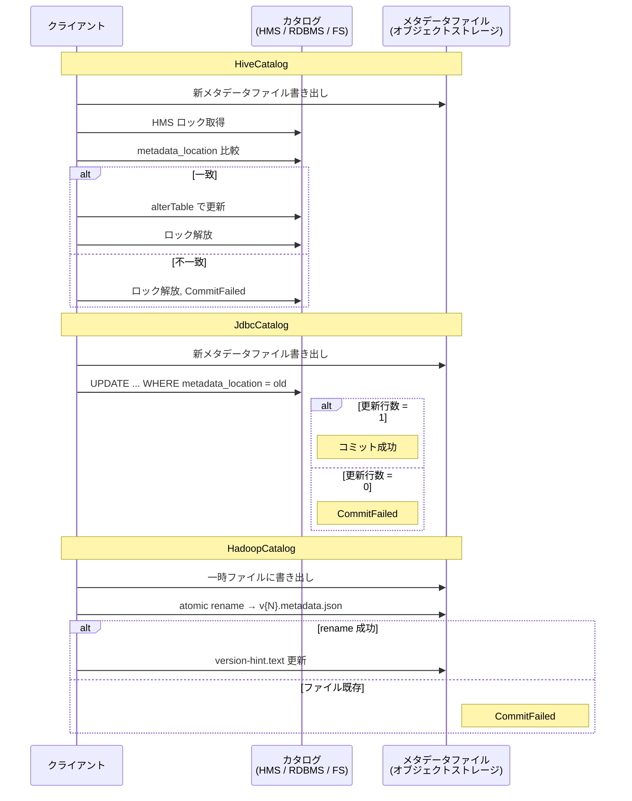

# 第17章 Hive, JDBC, Hadoop カタログ

> **本章で読むソース**
>
> - [`hive-metastore/src/main/java/org/apache/iceberg/hive/HiveCatalog.java`](https://github.com/apache/iceberg/blob/apache-iceberg-1.11.0/hive-metastore/src/main/java/org/apache/iceberg/hive/HiveCatalog.java)
> - [`hive-metastore/src/main/java/org/apache/iceberg/hive/HiveTableOperations.java`](https://github.com/apache/iceberg/blob/apache-iceberg-1.11.0/hive-metastore/src/main/java/org/apache/iceberg/hive/HiveTableOperations.java)
> - [`hive-metastore/src/main/java/org/apache/iceberg/hive/MetastoreLock.java`](https://github.com/apache/iceberg/blob/apache-iceberg-1.11.0/hive-metastore/src/main/java/org/apache/iceberg/hive/MetastoreLock.java)
> - [`core/src/main/java/org/apache/iceberg/jdbc/JdbcCatalog.java`](https://github.com/apache/iceberg/blob/apache-iceberg-1.11.0/core/src/main/java/org/apache/iceberg/jdbc/JdbcCatalog.java)
> - [`core/src/main/java/org/apache/iceberg/jdbc/JdbcTableOperations.java`](https://github.com/apache/iceberg/blob/apache-iceberg-1.11.0/core/src/main/java/org/apache/iceberg/jdbc/JdbcTableOperations.java)
> - [`core/src/main/java/org/apache/iceberg/hadoop/HadoopCatalog.java`](https://github.com/apache/iceberg/blob/apache-iceberg-1.11.0/core/src/main/java/org/apache/iceberg/hadoop/HadoopCatalog.java)
> - [`core/src/main/java/org/apache/iceberg/hadoop/HadoopTableOperations.java`](https://github.com/apache/iceberg/blob/apache-iceberg-1.11.0/core/src/main/java/org/apache/iceberg/hadoop/HadoopTableOperations.java)

## この章の狙い

Iceberg が提供する 3 つのカタログ実装、**HiveCatalog**, **JdbcCatalog**, **HadoopCatalog** のソースコードを読み、テーブルメタデータの保存先と、コミット時の原子性保証の仕組みがそれぞれどう異なるかを理解する。
カタログは Iceberg の仕様において「テーブル名からメタデータファイルの位置を引く」役割を担う唯一の外部依存であり、その設計がテーブル操作の安全性と可用性を決定する。

## 前提

テーブルメタデータ（メタデータファイル、スナップショット、マニフェスト）の階層構造と、楽観的並行制御によるコミットの流れを理解していること。
`TableOperations` インタフェースの `refresh()` と `commit()` の契約を把握していること。

## カタログの役割

Iceberg 仕様はテーブルのメタデータをすべてファイルとして保存する。
カタログの責務は「テーブルの識別子から、最新のメタデータファイルの場所を解決する」ことに限定される。
この薄い抽象化により、カタログの実装をバックエンドによって自由に差し替えられる。

参照実装は以下の 3 つを提供する。

| カタログ | メタデータの格納先 | 原子性保証の手段 |
|---|---|---|
| 「HiveCatalog」 | Hive Metastore（HMS）の Table パラメーター | HMS のテーブルロック |
| 「JdbcCatalog」 | RDBMS の `iceberg_tables` テーブル | SQL の `UPDATE ... WHERE metadata_location = ?` |
| 「HadoopCatalog」 | ファイルシステム上の連番メタデータファイル | ファイルシステムの atomic rename |

3 つとも `Catalog` インタフェースを実装し、テーブルごとに `TableOperations` を返す。
実際のコミットの原子性保証は `TableOperations` 側に実装されている。

## HiveCatalog

### 初期化

「HiveCatalog」は `BaseMetastoreViewCatalog` を継承し、`SupportsNamespaces` と `Configurable` を実装する。
`initialize()` で HMS への接続プール、FileIO、および各種設定を構築する。

[`hive-metastore/src/main/java/org/apache/iceberg/hive/HiveCatalog.java` L103-L143](https://github.com/apache/iceberg/blob/apache-iceberg-1.11.0/hive-metastore/src/main/java/org/apache/iceberg/hive/HiveCatalog.java#L103-L143)

```java
  @Override
  public void initialize(String inputName, Map<String, String> properties) {
    this.catalogProperties = ImmutableMap.copyOf(properties);
    this.name = inputName;
    if (conf == null) {
      LOG.warn("No Hadoop Configuration was set, using the default environment Configuration");
      this.conf = new Configuration();
    }

    if (properties.containsKey(CatalogProperties.URI)) {
      this.conf.set(HiveConf.ConfVars.METASTOREURIS.varname, properties.get(CatalogProperties.URI));
    }
    // ... (中略) ...
    this.clients = new CachedClientPool(conf, properties);
  }
```

`CatalogProperties.URI` で Thrift URI を受け取り、`CachedClientPool` 経由で HMS クライアントの接続プールを作る。
Namespace は HMS の「データベース」に 1 対 1 で対応するため、階層は 1 レベルに制限される。

### テーブル一覧とフィルタリング

`listTables()` は HMS から全テーブル名を取得し、`listAllTables` フラグが false（既定値）の場合は Iceberg テーブルだけに絞り込む。

[`hive-metastore/src/main/java/org/apache/iceberg/hive/HiveCatalog.java` L334-L347](https://github.com/apache/iceberg/blob/apache-iceberg-1.11.0/hive-metastore/src/main/java/org/apache/iceberg/hive/HiveCatalog.java#L334-L347)

```java
  private List<TableIdentifier> listIcebergTables(
      List<String> tableNames, Namespace namespace, String tableTypeProp)
      throws TException, InterruptedException {
    List<Table> tableObjects =
        clients.run(client -> client.getTableObjectsByName(namespace.level(0), tableNames));
    return tableObjects.stream()
        .filter(
            table ->
                table.getParameters() != null
                    && tableTypeProp.equalsIgnoreCase(
                        table.getParameters().get(BaseMetastoreTableOperations.TABLE_TYPE_PROP)))
        .map(table -> TableIdentifier.of(namespace, table.getTableName()))
        .collect(Collectors.toList());
  }
```

HMS のテーブルパラメーター `table_type` が `ICEBERG` であるかどうかで判定する。
HMS 上には Hive テーブルも混在するため、このフィルタリングが必要になる。

### TableOperations の生成

`newTableOps()` は `HiveTableOperations` を返す。

[`hive-metastore/src/main/java/org/apache/iceberg/hive/HiveCatalog.java` L698-L704](https://github.com/apache/iceberg/blob/apache-iceberg-1.11.0/hive-metastore/src/main/java/org/apache/iceberg/hive/HiveCatalog.java#L698-L704)

```java
  @Override
  public TableOperations newTableOps(TableIdentifier tableIdentifier) {
    String dbName = tableIdentifier.namespace().level(0);
    String tableName = tableIdentifier.name();
    return new HiveTableOperations(
        conf, clients, fileIO, keyManagementClient, name, dbName, tableName);
  }
```

### HiveTableOperations のコミット

「HiveTableOperations」のコミットは 3 段階で構成される。
(1) HMS ロックの取得、(2) HMS テーブルパラメーターの更新、(3) ロックの解放。

[`hive-metastore/src/main/java/org/apache/iceberg/hive/HiveTableOperations.java` L240-L254](https://github.com/apache/iceberg/blob/apache-iceberg-1.11.0/hive-metastore/src/main/java/org/apache/iceberg/hive/HiveTableOperations.java#L240-L254)

```java
  @Override
  protected void doCommit(TableMetadata base, TableMetadata metadata) {
    boolean newTable = base == null;
    final TableMetadata tableMetadata;
    encryptionPropsFromMetadata(metadata.properties());
    // ... (中略) ...
    newMetadataLocation = writeNewMetadataIfRequired(newTable, tableMetadata);
    // ... (中略) ...
    HiveLock lock = lockObject(base != null ? base : tableMetadata);
    try {
      lock.lock();

      Table tbl = loadHmsTable();
      // ... (中略) ...
      String metadataLocation = tbl.getParameters().get(METADATA_LOCATION_PROP);
      String baseMetadataLocation = base != null ? base.metadataFileLocation() : null;
      if (!Objects.equals(baseMetadataLocation, metadataLocation)) {
        throw new CommitFailedException(
            "Cannot commit: Base metadata location '%s' is not same as the current table metadata location '%s' for %s.%s",
            baseMetadataLocation, metadataLocation, database, tableName);
      }
```

ロックを取得した状態で、HMS 上の現在の `metadata_location` パラメーターと手元のベースメタデータの場所を比較する。
一致しなければ他のプロセスが先にコミットしており、`CommitFailedException` で失敗する。
一致すれば HMS テーブルパラメーターを新しいメタデータファイルの場所に更新してコミットが成立する。

### ロック機構: MetastoreLock

「HiveCatalog」のコミットの原子性は `MetastoreLock` が保証する。
このロックは 2 層構造になっている。

[`hive-metastore/src/main/java/org/apache/iceberg/hive/MetastoreLock.java` L139-L151](https://github.com/apache/iceberg/blob/apache-iceberg-1.11.0/hive-metastore/src/main/java/org/apache/iceberg/hive/MetastoreLock.java#L139-L151)

```java
  @Override
  public void lock() throws LockException {
    // getting a process-level lock per table to avoid concurrent commit attempts to the same table
    // from the same JVM process, which would result in unnecessary HMS lock acquisition requests
    acquireJvmLock();

    // Getting HMS lock
    hmsLockId = Optional.of(acquireLock());

    // Starting heartbeat for the HMS lock
    heartbeat = new Heartbeat(metaClients, hmsLockId.get(), lockHeartbeatIntervalTime);
    heartbeat.schedule(exitingScheduledExecutorService);
  }
```

第 1 層は JVM 内の `ReentrantLock` である。
同一テーブルへの並行コミットを JVM 内で直列化し、HMS への不要なロック要求を減らす。
第 2 層は HMS の分散ロック（`LockRequest` / `LockResponse`）である。
異なるプロセス間のコミット競合をこのロックが排除する。
ロック取得後はハートビートスレッドが定期的に `checkLock()` を送り、ロックが期限切れにならないよう維持する。

ロック設計の要点は、HMS ロック取得中にハートビートが途切れた場合を `CommitStateUnknownException` として扱う点にある。
コミットが成功したか不明な状態を正しく報告し、上位レイヤーがリトライするか判断できるようにしている。

### HiveLock インタフェースと NoLock

`HiveLock` インタフェースは 3 つのメソッドだけを定義する。

[`hive-metastore/src/main/java/org/apache/iceberg/hive/HiveLock.java` L21-L27](https://github.com/apache/iceberg/blob/apache-iceberg-1.11.0/hive-metastore/src/main/java/org/apache/iceberg/hive/HiveLock.java#L21-L27)

```java
interface HiveLock {
  void lock() throws LockException;

  void ensureActive() throws LockException;

  void unlock();
}
```

`lockObject()` メソッドでは `hiveLockEnabled` プロパティに応じて `MetastoreLock` と `NoLock` を使い分ける。

[`hive-metastore/src/main/java/org/apache/iceberg/hive/HiveTableOperations.java` L610-L617](https://github.com/apache/iceberg/blob/apache-iceberg-1.11.0/hive-metastore/src/main/java/org/apache/iceberg/hive/HiveTableOperations.java#L610-L617)

```java
  @VisibleForTesting
  HiveLock lockObject(TableMetadata metadata) {
    if (hiveLockEnabled(metadata, conf)) {
      return new MetastoreLock(conf, metaClients, catalogName, database, tableName);
    } else {
      return new NoLock();
    }
  }
```

ロックを無効にした場合、コミット時に `baseMetadataLocation` の比較のみで競合を検出する。
HMS の `alterTable` が既に楽観的並行制御を内蔵しているため、ロックなしでも安全性は維持される。

## JdbcCatalog

### 初期化と iceberg_tables テーブル

**JdbcCatalog** は RDBMS をメタデータの格納先として使う。
`initialize()` の中で、JDBC 接続プールを作成し、カタログ管理用の SQL テーブルを自動作成する。

[`core/src/main/java/org/apache/iceberg/jdbc/JdbcCatalog.java` L111-L164](https://github.com/apache/iceberg/blob/apache-iceberg-1.11.0/core/src/main/java/org/apache/iceberg/jdbc/JdbcCatalog.java#L111-L164)

```java
  @Override
  public void initialize(String name, Map<String, String> properties) {
    Preconditions.checkNotNull(properties, "Invalid catalog properties: null");
    String uri = properties.get(CatalogProperties.URI);
    Preconditions.checkNotNull(uri, "JDBC connection URI is required");
    // ... (中略) ...
    if (null != clientPoolBuilder) {
      this.connections = clientPoolBuilder.apply(properties);
    } else {
      this.connections = new JdbcClientPool(uri, properties);
    }
    // ... (中略) ...
    if (initializeCatalogTables) {
      initializeCatalogTables();
    }

    updateSchemaIfRequired();
    // ... (中略) ...
  }
```

`initializeCatalogTables()` は `iceberg_tables` と `iceberg_namespace_properties` の 2 テーブルを作成する。

`iceberg_tables` のスキーマは次の通りである。

[`core/src/main/java/org/apache/iceberg/jdbc/JdbcUtil.java` L128-L149](https://github.com/apache/iceberg/blob/apache-iceberg-1.11.0/core/src/main/java/org/apache/iceberg/jdbc/JdbcUtil.java#L128-L149)

```java
  static final String V0_CREATE_CATALOG_SQL =
      "CREATE TABLE "
          + CATALOG_TABLE_VIEW_NAME
          + "("
          + CATALOG_NAME
          + " VARCHAR(255) NOT NULL,"
          + TABLE_NAMESPACE
          + " VARCHAR(255) NOT NULL,"
          + TABLE_NAME
          + " VARCHAR(255) NOT NULL,"
          + JdbcTableOperations.METADATA_LOCATION_PROP
          + " VARCHAR(1000),"
          + JdbcTableOperations.PREVIOUS_METADATA_LOCATION_PROP
          + " VARCHAR(1000),"
          + "PRIMARY KEY ("
          + CATALOG_NAME
          + ", "
          + TABLE_NAMESPACE
          + ", "
          + TABLE_NAME
          + ")"
          + ")";
```

主キーは `(catalog_name, table_namespace, table_name)` の 3 カラムで構成される。
`metadata_location` カラムが現在のメタデータファイルの場所を保持する。

V1 スキーマでは `iceberg_type` カラムが追加され、テーブルとビューを同一テーブルで管理できるようになる。

[`core/src/main/java/org/apache/iceberg/jdbc/JdbcUtil.java` L150-L151](https://github.com/apache/iceberg/blob/apache-iceberg-1.11.0/core/src/main/java/org/apache/iceberg/jdbc/JdbcUtil.java#L150-L151)

```java
  static final String V1_UPDATE_CATALOG_SQL =
      "ALTER TABLE " + CATALOG_TABLE_VIEW_NAME + " ADD COLUMN " + RECORD_TYPE + " VARCHAR(5)";
```

### JdbcTableOperations のコミット

「JdbcTableOperations」のコミットは、SQL の `UPDATE ... WHERE metadata_location = ?` を使って楽観的並行制御を実現する。

[`core/src/main/java/org/apache/iceberg/jdbc/JdbcTableOperations.java` L102-L144](https://github.com/apache/iceberg/blob/apache-iceberg-1.11.0/core/src/main/java/org/apache/iceberg/jdbc/JdbcTableOperations.java#L102-L144)

```java
  @Override
  public void doCommit(TableMetadata base, TableMetadata metadata) {
    boolean newTable = base == null;
    String newMetadataLocation = writeNewMetadataIfRequired(newTable, metadata);
    try {
      Map<String, String> table =
          JdbcUtil.loadTable(schemaVersion, connections, catalogName, tableIdentifier);

      if (base != null) {
        validateMetadataLocation(table, base);
        String oldMetadataLocation = base.metadataFileLocation();
        // Start atomic update
        LOG.debug("Committing existing table: {}", tableName());
        updateTable(newMetadataLocation, oldMetadataLocation);
      } else {
        // table not exists create it
        LOG.debug("Committing new table: {}", tableName());
        createTable(newMetadataLocation);
      }
    // ... (中略) ...
    }
  }
```

`updateTable()` は更新行数が 1 でなければ `CommitFailedException` を投げる。

[`core/src/main/java/org/apache/iceberg/jdbc/JdbcTableOperations.java` L146-L163](https://github.com/apache/iceberg/blob/apache-iceberg-1.11.0/core/src/main/java/org/apache/iceberg/jdbc/JdbcTableOperations.java#L146-L163)

```java
  private void updateTable(String newMetadataLocation, String oldMetadataLocation)
      throws SQLException, InterruptedException {
    int updatedRecords =
        JdbcUtil.updateTable(
            schemaVersion,
            connections,
            catalogName,
            tableIdentifier,
            newMetadataLocation,
            oldMetadataLocation);

    if (updatedRecords == 1) {
      LOG.debug("Successfully committed to existing table: {}", tableIdentifier);
    } else {
      throw new CommitFailedException(
          "Failed to update table %s from catalog %s", tableIdentifier, catalogName);
    }
  }
```

SQL の `WHERE metadata_location = ?` 句が楽観的並行制御の鍵である。
先に別のプロセスがメタデータの場所を書き換えていた場合、`WHERE` 条件が不一致となり、更新行数が 0 になる。
RDBMS のトランザクション分離レベルがこの比較と更新の原子性を保証するため、明示的なロックは不要になる。
これが「JdbcCatalog」の設計上の工夫である。

### テーブル作成時の安全性

新規テーブル作成時は、主キー制約が重複を防ぐ。

[`core/src/main/java/org/apache/iceberg/jdbc/JdbcTableOperations.java` L165-L198](https://github.com/apache/iceberg/blob/apache-iceberg-1.11.0/core/src/main/java/org/apache/iceberg/jdbc/JdbcTableOperations.java#L165-L198)

```java
  private void createTable(String newMetadataLocation) throws SQLException, InterruptedException {
    Namespace namespace = tableIdentifier.namespace();
    if (PropertyUtil.propertyAsBoolean(catalogProperties, JdbcUtil.STRICT_MODE_PROPERTY, false)
        && !JdbcUtil.namespaceExists(catalogName, connections, namespace)) {
      throw new NoSuchNamespaceException(
          "Cannot create table %s in catalog %s. Namespace %s does not exist",
          tableIdentifier, catalogName, namespace);
    }
    // ... (中略) ...
    if (JdbcUtil.tableExists(schemaVersion, catalogName, connections, tableIdentifier)) {
      throw new AlreadyExistsException("Table already exists: %s", tableIdentifier);
    }
    // ... (中略) ...
  }
```

V1 スキーマではビューとの名前衝突もチェックする。
`INSERT` が主キー違反で失敗した場合は `AlreadyExistsException` に変換する。

## HadoopCatalog

### ファイルシステムベースのカタログ

**HadoopCatalog** は外部サービスに依存せず、ファイルシステム上のディレクトリ構造だけでテーブルを管理する。
テーブル識別子 `db.table` はウェアハウスディレクトリ配下の `db/table` パスに対応する。

[`core/src/main/java/org/apache/iceberg/hadoop/HadoopCatalog.java` L233-L245](https://github.com/apache/iceberg/blob/apache-iceberg-1.11.0/core/src/main/java/org/apache/iceberg/hadoop/HadoopCatalog.java#L233-L245)

```java
  @Override
  protected String defaultWarehouseLocation(TableIdentifier tableIdentifier) {
    String tableName = tableIdentifier.name();
    StringBuilder sb = new StringBuilder();

    sb.append(warehouseLocation).append('/');
    for (String level : tableIdentifier.namespace().levels()) {
      sb.append(level).append('/');
    }
    sb.append(tableName);

    return sb.toString();
  }
```

テーブルの存在判定は、`metadata` サブディレクトリに `.metadata.json` ファイルが存在するかどうかで行う。

[`core/src/main/java/org/apache/iceberg/hadoop/HadoopCatalog.java` L156-L172](https://github.com/apache/iceberg/blob/apache-iceberg-1.11.0/core/src/main/java/org/apache/iceberg/hadoop/HadoopCatalog.java#L156-L172)

```java
  private boolean isTableDir(Path path) {
    Path metadataPath = new Path(path, "metadata");
    // Only the path which contains metadata is the path for table, otherwise it could be
    // still a namespace.
    try {
      return fs.listStatus(metadataPath, TABLE_FILTER).length >= 1;
    } catch (FileNotFoundException e) {
      return false;
    } catch (IOException e) {
      if (shouldSuppressPermissionError(e)) {
        LOG.warn("Unable to list metadata directory {}", metadataPath, e);
        return false;
      } else {
        throw new UncheckedIOException(e);
      }
    }
  }
```

### HadoopTableOperations のコミット

「HadoopTableOperations」のコミットは、ファイルシステムの atomic rename に依存する。

[`core/src/main/java/org/apache/iceberg/hadoop/HadoopTableOperations.java` L130-L172](https://github.com/apache/iceberg/blob/apache-iceberg-1.11.0/core/src/main/java/org/apache/iceberg/hadoop/HadoopTableOperations.java#L130-L172)

```java
  @Override
  public void commit(TableMetadata base, TableMetadata metadata) {
    Pair<Integer, TableMetadata> current = versionAndMetadata();
    if (base != current.second()) {
      throw new CommitFailedException("Cannot commit changes based on stale table metadata");
    }
    // ... (中略) ...
    String codecName =
        metadata.property(
            TableProperties.METADATA_COMPRESSION, TableProperties.METADATA_COMPRESSION_DEFAULT);
    TableMetadataParser.Codec codec = TableMetadataParser.Codec.fromName(codecName);
    String fileExtension = TableMetadataParser.getFileExtension(codec);
    Path tempMetadataFile = metadataPath(UUID.randomUUID() + fileExtension);
    TableMetadataParser.write(metadata, io().newOutputFile(tempMetadataFile.toString()));

    int nextVersion = (current.first() != null ? current.first() : 0) + 1;
    Path finalMetadataFile = metadataFilePath(nextVersion, codec);
    FileSystem fs = getFileSystem(tempMetadataFile, conf);

    // this rename operation is the atomic commit operation
    renameToFinal(fs, tempMetadataFile, finalMetadataFile, nextVersion);

    LOG.info("Committed a new metadata file {}", finalMetadataFile);

    // update the best-effort version pointer
    writeVersionHint(nextVersion);
    // ... (中略) ...
  }
```

コミットの手順は次の通りである。

1. メタデータを UUID 名の一時ファイルに書き出す
2. `v{N}.metadata.json` へ atomic rename する
3. `version-hint.text` にバージョン番号を書き込む

rename が成功すれば、他のプロセスが同じバージョン番号を rename しようとしても既にファイルが存在するため失敗する。

### version-hint.text

`version-hint.text` はテーブルの最新バージョン番号を保持するヒントファイルである。

[`core/src/main/java/org/apache/iceberg/hadoop/HadoopTableOperations.java` L292-L304](https://github.com/apache/iceberg/blob/apache-iceberg-1.11.0/core/src/main/java/org/apache/iceberg/hadoop/HadoopTableOperations.java#L292-L304)

```java
  private void writeVersionHint(int versionToWrite) {
    Path versionHintFile = versionHintFile();
    FileSystem fs = getFileSystem(versionHintFile, conf);

    try {
      Path tempVersionHintFile = metadataPath(UUID.randomUUID() + "-version-hint.temp");
      writeVersionToPath(fs, tempVersionHintFile, versionToWrite);
      fs.delete(versionHintFile, false /* recursive delete */);
      fs.rename(tempVersionHintFile, versionHintFile);
    } catch (IOException e) {
      LOG.warn("Failed to update version hint", e);
    }
  }
```

書き込みに失敗しても例外を握りつぶしているのは、このファイルがあくまで「ヒント」だからである。
`refresh()` では、ヒントが読めない場合にメタデータディレクトリ全体をスキャンして最新バージョンを復元する。

[`core/src/main/java/org/apache/iceberg/hadoop/HadoopTableOperations.java` L312-L351](https://github.com/apache/iceberg/blob/apache-iceberg-1.11.0/core/src/main/java/org/apache/iceberg/hadoop/HadoopTableOperations.java#L312-L351)

```java
  @VisibleForTesting
  int findVersion() {
    Path versionHintFile = versionHintFile();
    FileSystem fs = getFileSystem(versionHintFile, conf);

    try (InputStreamReader fsr =
            new InputStreamReader(fs.open(versionHintFile), StandardCharsets.UTF_8);
        BufferedReader in = new BufferedReader(fsr)) {
      return Integer.parseInt(in.readLine().replace("\n", ""));

    } catch (Exception e) {
      try {
        // ... (中略) ...
        // List the metadata directory to find the version files, and try to recover the max
        // available version
        FileStatus[] files =
            fs.listStatus(
                metadataRoot(), name -> VERSION_PATTERN.matcher(name.getName()).matches());
        int maxVersion = 0;

        for (FileStatus file : files) {
          int currentVersion = version(file.getPath().getName());
          if (currentVersion > maxVersion && getMetadataFile(currentVersion) != null) {
            maxVersion = currentVersion;
          }
        }

        return maxVersion;
      } catch (IOException io) {
        LOG.warn("Error trying to recover the latest version number for {}", versionHintFile, io);
        return 0;
      }
    }
  }
```

さらに `refresh()` では、ヒントで得たバージョンから先に連番ファイルが存在するかを順次チェックし、実際の最新バージョンまで追従する。

[`core/src/main/java/org/apache/iceberg/hadoop/HadoopTableOperations.java` L101-L128](https://github.com/apache/iceberg/blob/apache-iceberg-1.11.0/core/src/main/java/org/apache/iceberg/hadoop/HadoopTableOperations.java#L101-L128)

```java
  @Override
  public TableMetadata refresh() {
    int ver = version != null ? version : findVersion();
    try {
      Path metadataFile = getMetadataFile(ver);
      // ... (中略) ...
      Path nextMetadataFile = getMetadataFile(ver + 1);
      while (nextMetadataFile != null) {
        ver += 1;
        metadataFile = nextMetadataFile;
        nextMetadataFile = getMetadataFile(ver + 1);
      }

      updateVersionAndMetadata(ver, metadataFile.toString());

      this.shouldRefresh = false;
      return currentMetadata;
    } catch (IOException e) {
      throw new RuntimeIOException(e, "Failed to refresh the table");
    }
  }
```

この「ヒントから始めて順次走査する」方式が「HadoopCatalog」の設計上の工夫である。
ヒントファイルの更新は best-effort だが、正確性は連番ファイルの走査で保証する。
ヒントが正確であれば走査は 1 回の存在チェック（次バージョンの不存在確認）で済み、起動時の I/O を最小化できる。

### rename の原子性保証と LockManager

`renameToFinal()` は `LockManager` を使ってファイルレベルのロックを取得し、rename の前に宛先ファイルの存在を確認する。

[`core/src/main/java/org/apache/iceberg/hadoop/HadoopTableOperations.java` L361-L401](https://github.com/apache/iceberg/blob/apache-iceberg-1.11.0/core/src/main/java/org/apache/iceberg/hadoop/HadoopTableOperations.java#L361-L401)

```java
  private void renameToFinal(FileSystem fs, Path src, Path dst, int nextVersion) {
    try {
      if (!lockManager.acquire(dst.toString(), src.toString())) {
        throw new CommitFailedException(
            "Failed to acquire lock on file: %s with owner: %s", dst, src);
      }

      if (fs.exists(dst)) {
        CommitFailedException cfe =
            new CommitFailedException("Version %d already exists: %s", nextVersion, dst);
        RuntimeException re = tryDelete(src);
        if (re != null) {
          cfe.addSuppressed(re);
        }

        throw cfe;
      }

      if (!fs.rename(src, dst)) {
        CommitFailedException cfe =
            new CommitFailedException("Failed to commit changes using rename: %s", dst);
        // ... (中略) ...
        throw cfe;
      }
    } catch (IOException e) {
      // ... (中略) ...
    } finally {
      if (!lockManager.release(dst.toString(), src.toString())) {
        LOG.warn("Failed to release lock on file: {} with owner: {}", dst, src);
      }
    }
  }
```

HDFS のような atomic rename をサポートするファイルシステムでは、`rename` 自体が原子的に宛先ファイルを作成する。
ただし S3 など rename が原子的でないオブジェクトストアでは、`LockManager` の外部実装（DynamoDB ベースなど）を差し込むことで安全性を補完できる。

### 制約事項

「HadoopCatalog」にはいくつかの制約がある。

- `renameTable()` は `UnsupportedOperationException` を投げる
- Namespace のプロパティ設定（`setProperties` / `removeProperties`）をサポートしない
- テーブルの場所をカスタマイズできない（パスがテーブル名で決定される）

これらの制約は、ファイルシステムのディレクトリパスをそのまま識別子として使う設計の帰結である。

## 3 カタログのコミットフロー比較

以下の図は、3 つのカタログにおけるコミットの原子性保証の仕組みを比較する。



## コミット失敗時の安全性

3 つのカタログはコミット失敗のリカバリ戦略も異なる。

「HiveCatalog」はハートビートが途切れた場合に `CommitStateUnknownException` を返す。
コミットが成功したか失敗したか不明な状態をアプリケーションに通知し、メタデータファイルの場所を再確認する機会を与える。
`BaseMetastoreOperations.checkCommitStatus()` が現在の HMS 上の `metadata_location` と新たに書き込んだ場所を比較し、成功か失敗かを事後判定する。

「JdbcCatalog」は RDBMS のトランザクション分離が原子性を保証するため、`UPDATE` の戻り値（更新行数）だけでコミットの成否が判明する。
不明状態が発生しにくい構造になっている。

「HadoopCatalog」は rename の成否がそのままコミットの成否に直結する。
ファイルシステムの rename が原子的でない環境では `LockManager` を差し込む必要がある。
`version-hint.text` の更新に失敗しても、連番ファイルの走査で正しい状態を復元できるため、データが失われることはない。

## まとめ

- 「HiveCatalog」は HMS のテーブルパラメーター `metadata_location` にメタデータファイルの場所を格納する。コミットの原子性は JVM 内ロックと HMS 分散ロックの 2 層で保証する。
- 「JdbcCatalog」は RDBMS の `iceberg_tables` テーブルを使い、`UPDATE ... WHERE metadata_location = ?` による楽観的並行制御でコミットの原子性を保証する。明示的なロックは不要で、RDBMS のトランザクション分離に委ねる。
- 「HadoopCatalog」はファイルシステム上の連番メタデータファイル（`v{N}.metadata.json`）と atomic rename でコミットの原子性を保証する。`version-hint.text` は best-effort のヒントであり、正確性は連番走査で担保する。
- 3 つのカタログはいずれも「メタデータの場所をどこに保存するか」と「更新の原子性をどう保証するか」の 2 点だけが異なり、テーブルメタデータ自体のフォーマットは共通である。

## 関連する章

- 第16章（カタログ API と BaseMetastoreCatalog）: カタログの共通インタフェースと基底クラス
- 第18章（REST カタログ）: HTTP ベースのカタログ実装
- 第10章（追記と上書き）: コミットの楽観的並行制御のリトライループ
