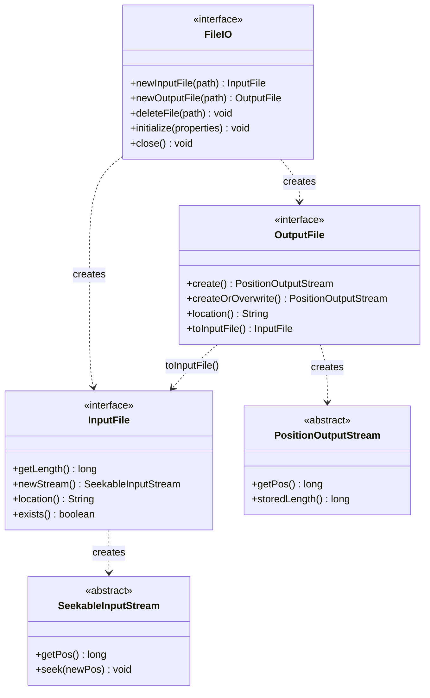
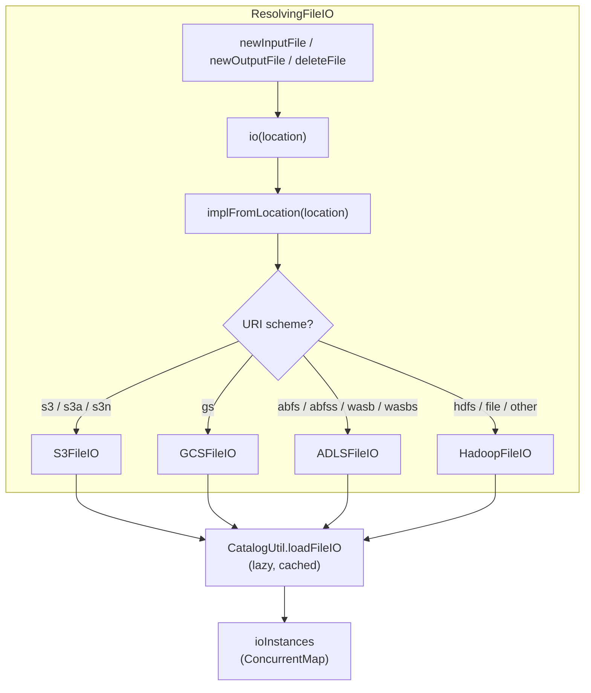

# 第18章 FileIO 抽象とストレージ統合

> **本章で読むソース**
>
> - [`api/src/main/java/org/apache/iceberg/io/FileIO.java`](https://github.com/apache/iceberg/blob/apache-iceberg-1.11.0/api/src/main/java/org/apache/iceberg/io/FileIO.java)
> - [`api/src/main/java/org/apache/iceberg/io/InputFile.java`](https://github.com/apache/iceberg/blob/apache-iceberg-1.11.0/api/src/main/java/org/apache/iceberg/io/InputFile.java)
> - [`api/src/main/java/org/apache/iceberg/io/OutputFile.java`](https://github.com/apache/iceberg/blob/apache-iceberg-1.11.0/api/src/main/java/org/apache/iceberg/io/OutputFile.java)
> - [`core/src/main/java/org/apache/iceberg/io/ResolvingFileIO.java`](https://github.com/apache/iceberg/blob/apache-iceberg-1.11.0/core/src/main/java/org/apache/iceberg/io/ResolvingFileIO.java)
> - [`core/src/main/java/org/apache/iceberg/hadoop/HadoopFileIO.java`](https://github.com/apache/iceberg/blob/apache-iceberg-1.11.0/core/src/main/java/org/apache/iceberg/hadoop/HadoopFileIO.java)

## この章の狙い

Iceberg のテーブルメタデータとデータファイルは、HDFS、S3、GCS、Azure ADLS など多様なストレージに配置される。
本章では、ストレージごとの差異を吸収する **FileIO** インターフェースの設計を読み解き、読み取り用の **InputFile**、書き込み用の **OutputFile** という 2 つの抽象がどのように連携するかを理解する。
さらに、URI スキームに基づいて実装を動的に切り替える **ResolvingFileIO** の仕組みと、Hadoop FileSystem API に委譲する **HadoopFileIO** の実装を追う。

## 前提

カタログがテーブルメタデータのパスを管理し、メタデータファイルやデータファイルのロケーションを文字列として保持する仕組みを把握していること。
Java の `Serializable` と `Closeable` の基本を理解していること。

## FileIO インターフェース

Iceberg がストレージ抽象として定義する最上位のインターフェースが **FileIO** である。
Javadoc には "Pluggable module for reading, writing, and deleting files" と記されている。
テーブルメタデータファイルもデータファイルも、すべてこのインターフェースを通じて読み書きする。

[`api/src/main/java/org/apache/iceberg/io/FileIO.java` L37-L40](https://github.com/apache/iceberg/blob/apache-iceberg-1.11.0/api/src/main/java/org/apache/iceberg/io/FileIO.java#L37-L40)

```java
public interface FileIO extends Serializable, Closeable {

  /** Get a {@link InputFile} instance to read bytes from the file at the given path. */
  InputFile newInputFile(String path);
```

3 つの抽象メソッドだけが「FileIO」の核を成している。

- `newInputFile(String path)` は読み取り用の「InputFile」を返す
- `newOutputFile(String path)` は書き込み用の「OutputFile」を返す
- `deleteFile(String path)` は指定パスのファイルを削除する

[`api/src/main/java/org/apache/iceberg/io/FileIO.java` L83-L87](https://github.com/apache/iceberg/blob/apache-iceberg-1.11.0/api/src/main/java/org/apache/iceberg/io/FileIO.java#L83-L87)

```java
  /** Get a {@link OutputFile} instance to write bytes to the file at the given path. */
  OutputFile newOutputFile(String path);

  /** Delete the file at the given path. */
  void deleteFile(String path);
```

この 3 操作（読む、書く、消す）だけでテーブルのライフサイクルを完結させるのが「FileIO」の設計方針である。

### Serializable であることの意味

「FileIO」が `Serializable` を継承しているのは、分散処理エンジンでの利用を前提としているためである。
たとえば Spark のドライバでカタログから「FileIO」インスタンスを取得し、それをシリアライズしてエグゼキュータへ転送する。
エグゼキュータ側でデシリアライズした「FileIO」が、データファイルへの読み書きを実行する。
この設計により、カタログ接続はドライバに閉じたまま、データアクセスをワーカーへ分散できる。

### 型安全なオーバーロード群

「FileIO」は `newInputFile(String path)` の他に、`DataFile`、`DeleteFile`、`ManifestFile`、`ManifestListFile` を直接受け取るオーバーロードを default メソッドとして提供している。

[`api/src/main/java/org/apache/iceberg/io/FileIO.java` L50-L72](https://github.com/apache/iceberg/blob/apache-iceberg-1.11.0/api/src/main/java/org/apache/iceberg/io/FileIO.java#L50-L72)

```java
  default InputFile newInputFile(DataFile file) {
    Preconditions.checkArgument(
        file.keyMetadata() == null,
        "Cannot decrypt data file: %s (use EncryptingFileIO)",
        file.location());
    return newInputFile(file.location(), file.fileSizeInBytes());
  }

  default InputFile newInputFile(DeleteFile file) {
    Preconditions.checkArgument(
        file.keyMetadata() == null,
        "Cannot decrypt delete file: %s (use EncryptingFileIO)",
        file.location());
    return newInputFile(file.location(), file.fileSizeInBytes());
  }

  default InputFile newInputFile(ManifestFile manifest) {
    Preconditions.checkArgument(
        manifest.keyMetadata() == null,
        "Cannot decrypt manifest: %s (use EncryptingFileIO)",
        manifest.path());
    return newInputFile(manifest.path(), manifest.length());
  }
```

これらのオーバーロードには 2 つの設計意図がある。

第一に、ファイルサイズの事前伝搬である。
`DataFile` や `ManifestFile` はメタデータ内にファイルサイズを保持しているため、`newInputFile(String path, long length)` を呼び出す。
これにより、ストレージへの余分な HEAD リクエスト（ファイルサイズ取得のための）を省略できる。
クラウドオブジェクトストレージでは 1 回の HEAD リクエストが数十ミリ秒かかることがあり、数千ファイルを開く場面では大きな差になる。

第二に、暗号化メタデータの検査である。
`keyMetadata()` が非 null の場合は暗号化が必要であり、通常の「FileIO」では処理できない。
この検査を default メソッドに集約することで、各実装クラスが暗号化チェックを個別に実装する必要がなくなっている。

### 初期化とライフサイクル

「FileIO」のインスタンスは動的にロードされるため、ライフサイクル管理用のメソッドも定義されている。

[`api/src/main/java/org/apache/iceberg/io/FileIO.java` L105-L113](https://github.com/apache/iceberg/blob/apache-iceberg-1.11.0/api/src/main/java/org/apache/iceberg/io/FileIO.java#L105-L113)

```java
  default Map<String, String> properties() {
    throw new UnsupportedOperationException(
        String.format("%s does not expose configuration properties", this.getClass()));
  }

  /**
   * Initialize File IO from catalog properties.
   *
   * @param properties catalog properties
```

`initialize` はカタログプロパティを受け取って実装固有の初期化を実行する。
`close` はリソース解放のために呼ばれる。
どちらも default 実装が空であるため、シンプルな実装はこれらを上書きしなくても動作する。

## InputFile と OutputFile

「FileIO」が生成する「InputFile」と「OutputFile」は、個々のファイルへの読み書きを抽象化するインターフェースである。

### InputFile

[`api/src/main/java/org/apache/iceberg/io/InputFile.java` L30-L38](https://github.com/apache/iceberg/blob/apache-iceberg-1.11.0/api/src/main/java/org/apache/iceberg/io/InputFile.java#L30-L38)

```java
public interface InputFile {
  /**
   * Returns the total length of the file, in bytes
   *
   * @return the total length of the file, in bytes
   * @throws RuntimeIOException If the implementation throws an {@link IOException}
   */
  long getLength();

```

Javadoc には "This class is based on Parquet's InputFile" と記されている。
Parquet の入出力抽象を参考にしつつ、Iceberg 独自の設計として `location()` と `exists()` を追加した形となっている。

4 つのメソッドの役割は以下のとおりである。

- `getLength()` はファイルの全体サイズをバイト単位で返す。コンストラクタでサイズが渡されていればストレージへの問い合わせを省略できる
- `newStream()` は **SeekableInputStream** を返す。Parquet や ORC のカラムナフォーマットは任意のオフセットへのシークを必要とするため、シーク可能なストリームが必須である
- `location()` はファイルの完全修飾パスを文字列で返す
- `exists()` はファイルの存在を確認する

**SeekableInputStream** は `java.io.InputStream` を継承し、`getPos()` と `seek(long)` の 2 メソッドを追加した抽象クラスである。

[`api/src/main/java/org/apache/iceberg/io/SeekableInputStream.java` L30-L34](https://github.com/apache/iceberg/blob/apache-iceberg-1.11.0/api/src/main/java/org/apache/iceberg/io/SeekableInputStream.java#L30-L34)

```java
public abstract class SeekableInputStream extends InputStream {
  /**
   * Return the current position in the InputStream.
   *
   * @return current position in bytes from the start of the stream
```

Parquet のフッターは読み取り時にファイル末尾からシークして読み込む必要がある。
ORC もストライプのインデックスに基づいてファイル内の任意位置を読み取る。
「SeekableInputStream」がこのアクセスパターンを支えている。

### OutputFile

[`api/src/main/java/org/apache/iceberg/io/OutputFile.java` L30-L39](https://github.com/apache/iceberg/blob/apache-iceberg-1.11.0/api/src/main/java/org/apache/iceberg/io/OutputFile.java#L30-L39)

```java
public interface OutputFile {

  /**
   * Create a new file and return a {@link PositionOutputStream} to it.
   *
   * <p>If the file already exists, this will throw an exception.
   *
   * @return an output stream that can report its position
   * @throws AlreadyExistsException If the path already exists
   * @throws RuntimeIOException If the implementation throws an {@link IOException}
```

「OutputFile」は 4 つのメソッドを定義している。

- `create()` はファイルが存在しない場合のみ新規作成する。既に存在すれば `AlreadyExistsException` を投げる
- `createOrOverwrite()` はファイルが存在しても上書きする
- `location()` は書き込み先のパスを返す
- `toInputFile()` は同一ロケーションに対する「InputFile」を返す。ファイルの書き込み直後に読み返す用途（メタデータの書き込みと検証など）で使う

**PositionOutputStream** は `java.io.OutputStream` を継承し、`getPos()` メソッドを追加した抽象クラスである。

[`api/src/main/java/org/apache/iceberg/io/PositionOutputStream.java` L24-L30](https://github.com/apache/iceberg/blob/apache-iceberg-1.11.0/api/src/main/java/org/apache/iceberg/io/PositionOutputStream.java#L24-L30)

```java
public abstract class PositionOutputStream extends OutputStream {
  /**
   * Return the current position in the OutputStream.
   *
   * @return current position in bytes from the start of the stream
   * @throws IOException If the underlying stream throws IOException
   */
```

`getPos()` は現在の書き込み位置を返す。
Parquet や ORC のライターは、行グループやストライプの先頭オフセットをメタデータに記録するため、書き込み途中で現在位置を知る必要がある。
`storedLength()` は暗号化ストリームなど、ストリームの位置と格納サイズが異なる場合に上書きする。

### ストリーム抽象の全体像

「FileIO」を起点とするストリーム抽象の全体像を図に示す。



この設計では「FileIO」がファクトリ、「InputFile」と「OutputFile」が個別ファイルへのハンドル、ストリームが実際のバイト列転送を担う。
3 層の分離により、ストレージ実装は「FileIO」の 3 メソッドだけを差し替えれば動作する。

## 拡張インターフェース群

基本の「FileIO」に加えて、バルク操作やプレフィックス走査を可能にする拡張インターフェースが定義されている。

### SupportsBulkOperations

[`api/src/main/java/org/apache/iceberg/io/SupportsBulkOperations.java` L21-L23](https://github.com/apache/iceberg/blob/apache-iceberg-1.11.0/api/src/main/java/org/apache/iceberg/io/SupportsBulkOperations.java#L21-L23)

```java
public interface SupportsBulkOperations extends FileIO {
  /**
   * Delete the files at the given paths.
```

S3 の `DeleteObjects` API のように、1 回のリクエストで最大 1,000 個のオブジェクトを削除できるストレージがある。
「SupportsBulkOperations」はこのようなバッチ削除を活用するためのインターフェースである。

### SupportsPrefixOperations

[`api/src/main/java/org/apache/iceberg/io/SupportsPrefixOperations.java` L25-L30](https://github.com/apache/iceberg/blob/apache-iceberg-1.11.0/api/src/main/java/org/apache/iceberg/io/SupportsPrefixOperations.java#L25-L30)

```java
public interface SupportsPrefixOperations extends FileIO {

  /**
   * Return an iterable of all files under a prefix.
   *
   * <p>Hierarchical file systems (e.g. HDFS) may impose additional restrictions like the prefix
```

`listPrefix` は指定プレフィックス配下のファイルを列挙し、`deletePrefix` は配下を一括削除する。
スナップショット期限切れ処理やテーブル削除の際に、メタデータディレクトリの一括操作に使われる。

### DelegateFileIO

[`api/src/main/java/org/apache/iceberg/io/DelegateFileIO.java` L25-L25](https://github.com/apache/iceberg/blob/apache-iceberg-1.11.0/api/src/main/java/org/apache/iceberg/io/DelegateFileIO.java#L25-L25)

```java
public interface DelegateFileIO extends FileIO, SupportsPrefixOperations, SupportsBulkOperations {}
```

**DelegateFileIO** は「FileIO」と 2 つの拡張インターフェースを束ねたマーカーインターフェースである。
後述する「ResolvingFileIO」が委譲先として要求するのがこのインターフェースであり、委譲先となる実装はバルク削除とプレフィックス操作の両方をサポートする必要がある。

## ResolvingFileIO によるスキーム別ディスパッチ

**ResolvingFileIO** は、ファイルパスの URI スキームに基づいて適切な「FileIO」実装を動的に選択するルーターである。

### スキームとクラスのマッピング

[`core/src/main/java/org/apache/iceberg/io/ResolvingFileIO.java` L56-L69](https://github.com/apache/iceberg/blob/apache-iceberg-1.11.0/core/src/main/java/org/apache/iceberg/io/ResolvingFileIO.java#L56-L69)

```java
  private static final String FALLBACK_IMPL = "org.apache.iceberg.hadoop.HadoopFileIO";
  private static final String S3_FILE_IO_IMPL = "org.apache.iceberg.aws.s3.S3FileIO";
  private static final String GCS_FILE_IO_IMPL = "org.apache.iceberg.gcp.gcs.GCSFileIO";
  private static final String ADLS_FILE_IO_IMPL = "org.apache.iceberg.azure.adlsv2.ADLSFileIO";
  private static final Map<String, String> SCHEME_TO_FILE_IO =
      ImmutableMap.of(
          "s3", S3_FILE_IO_IMPL,
          "s3a", S3_FILE_IO_IMPL,
          "s3n", S3_FILE_IO_IMPL,
          "gs", GCS_FILE_IO_IMPL,
          "abfs", ADLS_FILE_IO_IMPL,
          "abfss", ADLS_FILE_IO_IMPL,
          "wasb", ADLS_FILE_IO_IMPL,
          "wasbs", ADLS_FILE_IO_IMPL);
```

`SCHEME_TO_FILE_IO` は URI スキームからクラス名への静的マッピングである。
S3 系のスキームは 3 種類（`s3`、`s3a`、`s3n`）すべてが `S3FileIO` に解決される。
Azure 系も `abfs`、`abfss`、`wasb`、`wasbs` の 4 種類が `ADLSFileIO` に統一される。
マッピングに含まれないスキーム（`hdfs` やローカルファイルパスなど）はフォールバックとして `HadoopFileIO` が使われる。

### ディスパッチの流れ

「ResolvingFileIO」の `newInputFile`、`newOutputFile`、`deleteFile` はいずれも `io(location)` を呼んで委譲先を解決してから処理を委譲する。

[`core/src/main/java/org/apache/iceberg/io/ResolvingFileIO.java` L88-L106](https://github.com/apache/iceberg/blob/apache-iceberg-1.11.0/core/src/main/java/org/apache/iceberg/io/ResolvingFileIO.java#L88-L106)

```java
  @Override
  public InputFile newInputFile(String location) {
    return io(location).newInputFile(location);
  }

  @Override
  public InputFile newInputFile(String location, long length) {
    return io(location).newInputFile(location, length);
  }

  @Override
  public OutputFile newOutputFile(String location) {
    return io(location).newOutputFile(location);
  }

  @Override
  public void deleteFile(String location) {
    io(location).deleteFile(location);
  }
```

`io(String location)` メソッドが実際のディスパッチロジックである。

[`core/src/main/java/org/apache/iceberg/io/ResolvingFileIO.java` L165-L232](https://github.com/apache/iceberg/blob/apache-iceberg-1.11.0/core/src/main/java/org/apache/iceberg/io/ResolvingFileIO.java#L165-L232)

```java
  @VisibleForTesting
  DelegateFileIO io(String location) {
    String impl = implFromLocation(location);
    DelegateFileIO io = ioInstances.get(impl);
    if (io != null) {
      // ... (中略) ...
      return io;
    }

    return ioInstances.computeIfAbsent(
        impl,
        key -> {
          Configuration conf = getConf();
          FileIO fileIO;

          try {
            Map<String, String> props = Maps.newHashMap(properties);
            props.put("init-creation-stacktrace", "false");
            fileIO = CatalogUtil.loadFileIO(key, props, conf, storageCredentials);
          } catch (IllegalArgumentException e) {
            if (key.equals(FALLBACK_IMPL)) {
              throw e;
            } else {
              LOG.warn(
                  "Failed to load FileIO implementation: {}, falling back to {}",
                  key,
                  FALLBACK_IMPL,
                  e);
              try {
                fileIO =
                    CatalogUtil.loadFileIO(FALLBACK_IMPL, properties, conf, storageCredentials);
              } catch (IllegalArgumentException suppressed) {
                // ... (中略) ...
                e.addSuppressed(suppressed);
                throw e;
              }
            }
          }

          Preconditions.checkState(
              fileIO instanceof DelegateFileIO,
              "FileIO does not implement DelegateFileIO: " + fileIO.getClass().getName());

          return (DelegateFileIO) fileIO;
        });
  }
```

処理の流れは以下のとおりである。

1. `implFromLocation` で URI スキームからクラス名を決定する
2. `ioInstances`（ConcurrentHashMap）にキャッシュがあればそれを返す
3. キャッシュがなければ `CatalogUtil.loadFileIO` でクラスをリフレクションによりロードし、初期化して返す
4. ロードに失敗した場合は `HadoopFileIO` へフォールバックする
5. ロードした実装が `DelegateFileIO` を実装していなければ例外を投げる

### 設計上の工夫: 遅延ロードとフォールバック

「ResolvingFileIO」には 2 つの設計上の工夫がある。

第一に、実装クラスの遅延ロードである。
`ioInstances` は `ConcurrentMap` であり、`computeIfAbsent` で初回アクセス時にのみインスタンスを生成する。
これにより、S3 のファイルだけを扱うテーブルで GCS 用のライブラリがクラスパスに不要となる。
すべての実装を起動時にロードしていた場合、クラウドプロバイダの SDK が存在しないだけでテーブルを開けなくなってしまう。
遅延ロードはこの問題を回避する。

第二に、フォールバック戦略である。
S3FileIO のロードに失敗した場合でも `HadoopFileIO` へのフォールバックを試みる。
Hadoop の `FileSystem` 抽象は S3A コネクタを通じて S3 にもアクセスできるため、ネイティブ SDK がなくても最低限の動作が可能になる。
ただしフォールバック先の `HadoopFileIO` 自体も失敗した場合は、元の例外に `addSuppressed` で情報を付加して再送出する。

### バルク削除のディスパッチ

「ResolvingFileIO」は `deleteFiles` でもスキーム別ディスパッチを行う。

[`core/src/main/java/org/apache/iceberg/io/ResolvingFileIO.java` L108-L121](https://github.com/apache/iceberg/blob/apache-iceberg-1.11.0/core/src/main/java/org/apache/iceberg/io/ResolvingFileIO.java#L108-L121)

```java
  @Override
  public void deleteFiles(Iterable<String> pathsToDelete) throws BulkDeletionFailureException {
    Iterators.partition(pathsToDelete.iterator(), BATCH_SIZE)
        .forEachRemaining(
            partitioned -> {
              Map<DelegateFileIO, List<String>> pathByFileIO =
                  partitioned.stream().collect(Collectors.groupingBy(this::io));
              for (Map.Entry<DelegateFileIO, List<String>> entries : pathByFileIO.entrySet()) {
                DelegateFileIO io = entries.getKey();
                List<String> filePaths = entries.getValue();
                io.deleteFiles(filePaths);
              }
            });
  }
```

パスのリストを 100,000 件ずつバッチに分割し、各バッチ内でスキーム別にグルーピングしてから委譲先の `deleteFiles` を呼ぶ。
たとえば S3 と HDFS に分散したファイルの一括削除でも、S3 側は `S3FileIO.deleteFiles`（S3 の `DeleteObjects` API を利用）、HDFS 側は `HadoopFileIO.deleteFiles` と、それぞれに最適化された削除を実行できる。

### ディスパッチの全体像



## HadoopFileIO の実装

**HadoopFileIO** は Hadoop の `FileSystem` API を使って「FileIO」を実装するクラスである。
HDFS、ローカルファイルシステム、S3A コネクタなど、Hadoop FileSystem プロバイダが対応するストレージであればすべて利用できる。

### 基本操作

[`core/src/main/java/org/apache/iceberg/hadoop/HadoopFileIO.java` L90-L114](https://github.com/apache/iceberg/blob/apache-iceberg-1.11.0/core/src/main/java/org/apache/iceberg/hadoop/HadoopFileIO.java#L90-L114)

```java
  @Override
  public InputFile newInputFile(String path) {
    return HadoopInputFile.fromLocation(path, getConf());
  }

  @Override
  public InputFile newInputFile(String path, long length) {
    return HadoopInputFile.fromLocation(path, length, getConf());
  }

  @Override
  public OutputFile newOutputFile(String path) {
    return HadoopOutputFile.fromPath(new Path(path), getConf());
  }

  @Override
  public void deleteFile(String path) {
    Path toDelete = new Path(path);
    FileSystem fs = Util.getFs(toDelete, getConf());
    try {
      fs.delete(toDelete, false /* not recursive */);
    } catch (IOException e) {
      throw new RuntimeIOException(e, "Failed to delete file: %s", path);
    }
  }
```

3 つの基本操作はいずれも Hadoop API への薄いラッパーである。
`newInputFile` は `HadoopInputFile.fromLocation` を呼び、パス文字列を `FileSystem` 経由でアクセス可能なオブジェクトに変換する。
`deleteFile` は `fs.delete` を呼び、第 2 引数 `false` で再帰削除を無効にしている。

### HadoopInputFile の遅延サイズ取得

「HadoopFileIO」が生成する `HadoopInputFile` の `getLength()` 実装を見ると、サイズの遅延取得が行われている。

[`core/src/main/java/org/apache/iceberg/hadoop/HadoopInputFile.java` L159-L178](https://github.com/apache/iceberg/blob/apache-iceberg-1.11.0/core/src/main/java/org/apache/iceberg/hadoop/HadoopInputFile.java#L159-L178)

```java
  private FileStatus lazyStat() {
    if (stat == null) {
      try {
        this.stat = fs.getFileStatus(path);
      } catch (FileNotFoundException e) {
        throw new NotFoundException(e, "File does not exist: %s", path);
      } catch (IOException e) {
        throw new RuntimeIOException(e, "Failed to get status for file: %s", path);
      }
    }
    return stat;
  }

  @Override
  public long getLength() {
    if (length == null) {
      this.length = lazyStat().getLen();
    }
    return length;
  }
```

コンストラクタで `length` が渡されていれば `lazyStat()` は呼ばれない。
「FileIO」の型安全なオーバーロードが `fileSizeInBytes()` を渡していることと、ここでのキャッシュは対になっている。
メタデータに記録済みのファイルサイズを「InputFile」まで伝搬させることで、HDFS の `getFileStatus` RPC や S3 の `HeadObject` リクエストを省略するのである。

### HadoopOutputFile の create と createOrOverwrite

[`core/src/main/java/org/apache/iceberg/hadoop/HadoopOutputFile.java` L71-L89](https://github.com/apache/iceberg/blob/apache-iceberg-1.11.0/core/src/main/java/org/apache/iceberg/hadoop/HadoopOutputFile.java#L71-L89)

```java
  @Override
  public PositionOutputStream create() {
    try {
      return HadoopStreams.wrap(fs.create(path, false /* createOrOverwrite */));
    } catch (FileAlreadyExistsException e) {
      throw new AlreadyExistsException(e, "Path already exists: %s", path);
    } catch (IOException e) {
      throw new RuntimeIOException(e, "Failed to create file: %s", path);
    }
  }

  @Override
  public PositionOutputStream createOrOverwrite() {
    try {
      return HadoopStreams.wrap(fs.create(path, true /* createOrOverwrite */));
    } catch (IOException e) {
      throw new RuntimeIOException(e, "Failed to create file: %s", path);
    }
  }
```

`create()` と `createOrOverwrite()` の違いは `fs.create` の第 2 引数（上書き許可フラグ）だけである。
`create()` は上書きを禁止し、同名ファイルが存在すれば例外を投げる。
テーブルメタデータの書き込みでは `create()` を使い、楽観的並行制御のコミットプロトコルにおいて、同一パスへの二重書き込みを検出する。

### 並列バルク削除

「HadoopFileIO」は `deleteFiles` でスレッドプールを利用した並列削除を実装している。

[`core/src/main/java/org/apache/iceberg/hadoop/HadoopFileIO.java` L185-L203](https://github.com/apache/iceberg/blob/apache-iceberg-1.11.0/core/src/main/java/org/apache/iceberg/hadoop/HadoopFileIO.java#L185-L203)

```java
  @Override
  public void deleteFiles(Iterable<String> pathsToDelete) throws BulkDeletionFailureException {
    AtomicInteger failureCount = new AtomicInteger(0);
    Tasks.foreach(pathsToDelete)
        .executeWith(executorService())
        .retry(DELETE_RETRY_ATTEMPTS)
        .stopRetryOn(FileNotFoundException.class)
        .suppressFailureWhenFinished()
        .onFailure(
            (f, e) -> {
              LOG.error("Failure during bulk delete on file: {} ", f, e);
              failureCount.incrementAndGet();
            })
        .run(this::deleteFile);

    if (failureCount.get() != 0) {
      throw new BulkDeletionFailureException(failureCount.get());
    }
  }
```

HDFS には S3 の `DeleteObjects` のようなバッチ削除 API が存在しない。
そのため、個々の `deleteFile` 呼び出しをスレッドプールで並列実行することで、大量ファイルの削除時間を短縮している。
デフォルトのスレッド数は `Runtime.getRuntime().availableProcessors() * 4` である。
`FileNotFoundException` に対してはリトライを停止する（既に削除済みのファイルに対してリトライしても意味がない）が、その他の IO エラーは最大 3 回までリトライする。

### Configuration のシリアライズ

「HadoopFileIO」は分散環境で `Configuration` をシリアライズする必要がある。

[`core/src/main/java/org/apache/iceberg/hadoop/HadoopFileIO.java` L121-L137](https://github.com/apache/iceberg/blob/apache-iceberg-1.11.0/core/src/main/java/org/apache/iceberg/hadoop/HadoopFileIO.java#L121-L137)

```java
  @Override
  public void setConf(Configuration conf) {
    this.hadoopConf = new SerializableConfiguration(conf);
  }

  @Override
  public Configuration getConf() {
    // Create a default hadoopConf as it is required for the object to be valid.
    // E.g. newInputFile would throw NPE with getConf() otherwise.
    if (hadoopConf == null) {
      synchronized (this) {
        if (hadoopConf == null) {
          this.hadoopConf = new SerializableConfiguration(new Configuration());
        }
      }
    }

```

`getConf()` はダブルチェックロッキングで `null` 安全な初期化を行っている。
`hadoopConf` がデシリアライズ後に `null` であっても、デフォルトの `Configuration` で動作を継続できる。

## クラウドストレージ実装の設計

「ResolvingFileIO」のスキームマッピングに登場する S3FileIO、GCSFileIO、ADLSFileIO は、それぞれのクラウド SDK を使った「FileIO」実装である。
これらのクラスは本章の直接のスコープ外であるが、設計上の共通パターンを述べておく。

### ネイティブ SDK の利用

`HadoopFileIO` が `FileSystem` API を経由するのに対し、クラウド実装は各プロバイダの SDK を直接使う。
たとえば `S3FileIO` は AWS SDK の `S3Client` を直接呼び出す。
Hadoop の S3A コネクタを経由するよりも、SDK 直接呼び出しのほうがオーバーヘッドが少なく、バッチ削除や Range GET など SDK 固有の最適化を活用できる。

### ストレージクレデンシャルの伝搬

「ResolvingFileIO」は **SupportsStorageCredentials** インターフェースを実装している。

[`core/src/main/java/org/apache/iceberg/io/SupportsStorageCredentials.java` L27-L32](https://github.com/apache/iceberg/blob/apache-iceberg-1.11.0/core/src/main/java/org/apache/iceberg/io/SupportsStorageCredentials.java#L27-L32)

```java
public interface SupportsStorageCredentials {

  void setCredentials(List<StorageCredential> credentials);

  List<StorageCredential> credentials();
}
```

カタログから取得したストレージクレデンシャル（一時トークンなど）を「FileIO」実装に渡す仕組みである。
「ResolvingFileIO」の `io(location)` メソッド内では、委譲先が `SupportsStorageCredentials` を実装している場合にクレデンシャルを伝搬する。

[`core/src/main/java/org/apache/iceberg/io/ResolvingFileIO.java` L179-L182](https://github.com/apache/iceberg/blob/apache-iceberg-1.11.0/core/src/main/java/org/apache/iceberg/io/ResolvingFileIO.java#L179-L182)

```java
      if (io instanceof SupportsStorageCredentials
          && !((SupportsStorageCredentials) io).credentials().equals(storageCredentials)) {
        ((SupportsStorageCredentials) io).setCredentials(storageCredentials);
      }
```

キャッシュ済みの「FileIO」インスタンスに対しても、クレデンシャルが変更されていれば差し替える。
一時トークンのローテーションに対応する仕組みである。

## CatalogUtil.loadFileIO による動的ロード

「FileIO」のインスタンス化は `CatalogUtil.loadFileIO` に集約されている。

[`core/src/main/java/org/apache/iceberg/CatalogUtil.java` L392-L425](https://github.com/apache/iceberg/blob/apache-iceberg-1.11.0/core/src/main/java/org/apache/iceberg/CatalogUtil.java#L392-L425)

```java
  public static FileIO loadFileIO(
      String impl,
      Map<String, String> properties,
      Object hadoopConf,
      List<StorageCredential> storageCredentials) {
    LOG.info("Loading custom FileIO implementation: {}", impl);
    DynConstructors.Ctor<FileIO> ctor;
    try {
      ctor =
          DynConstructors.builder(FileIO.class)
              .loader(CatalogUtil.class.getClassLoader())
              .impl(impl)
              .buildChecked();
    } catch (NoSuchMethodException e) {
      throw new IllegalArgumentException(
          String.format("Cannot initialize FileIO implementation %s: %s", impl, e.getMessage()), e);
    }

    FileIO fileIO;
    try {
      fileIO = ctor.newInstance();
    } catch (ClassCastException e) {
      throw new IllegalArgumentException(
          String.format("Cannot initialize FileIO, %s does not implement FileIO.", impl), e);
    }

    configureHadoopConf(fileIO, hadoopConf);
    if (fileIO instanceof SupportsStorageCredentials) {
      ((SupportsStorageCredentials) fileIO).setCredentials(storageCredentials);
    }

    fileIO.initialize(properties);
    return fileIO;
  }
```

初期化の手順は以下のとおりである。

1. `DynConstructors` でクラス名からリフレクションにより引数なしコンストラクタを取得する
2. `newInstance()` でインスタンスを生成する
3. `configureHadoopConf` で Hadoop の `Configuration` を注入する（HadoopConfigurable を実装している場合）
4. `SupportsStorageCredentials` を実装していればクレデンシャルを注入する
5. `initialize(properties)` でカタログプロパティを渡して初期化を完了する

この初期化プロトコルにより、「FileIO」実装は引数なしコンストラクタさえ持てば動的にロードできる。
カタログの設定ファイルでクラス名を指定するだけで、新しいストレージバックエンドを追加できる。

## リソースリークの検出

「ResolvingFileIO」は `close()` が呼ばれなかった場合のリソースリークを検出する仕組みを持っている。

[`core/src/main/java/org/apache/iceberg/io/ResolvingFileIO.java` L257-L270](https://github.com/apache/iceberg/blob/apache-iceberg-1.11.0/core/src/main/java/org/apache/iceberg/io/ResolvingFileIO.java#L257-L270)

```java
  @SuppressWarnings({"checkstyle:NoFinalizer", "Finalize", "deprecation"})
  @Override
  protected void finalize() throws Throwable {
    super.finalize();
    if (!isClosed.get()) {
      close();

      if (null != createStack) {
        String trace =
            Joiner.on("\n\t").join(Arrays.copyOfRange(createStack, 1, createStack.length));
        LOG.warn("Unclosed ResolvingFileIO instance created by:\n\t{}", trace);
      }
    }
  }
```

コンストラクタで `Thread.currentThread().getStackTrace()` を記録しておき、`finalize()` 時に `close()` が未呼び出しであれば、生成元のスタックトレースとともに警告ログを出力する。
Java のファイナライザは非推奨であるが、クローズ忘れの検出用途としては依然として有用である。
`@SuppressWarnings` でチェッカーの警告を明示的に抑制しているのは、非推奨であることを承知の上で意図的に使用していることを示している。

## まとめ

- **FileIO** は `newInputFile`、`newOutputFile`、`deleteFile` の 3 メソッドだけでストレージアクセスを抽象化する。`Serializable` であるため、分散処理エンジンのワーカーへ転送できる
- **InputFile** と **OutputFile** はファイル単位のハンドルであり、それぞれ `SeekableInputStream` と `PositionOutputStream` を生成する。カラムナフォーマットが必要とするシーク操作やポジション追跡をストリームレベルで提供する
- 「FileIO」の型安全なオーバーロードは、メタデータに記録済みのファイルサイズを「InputFile」に伝搬させ、ストレージへの余分な問い合わせを省略する
- **DelegateFileIO** はバルク削除とプレフィックス操作を束ねたインターフェースであり、「ResolvingFileIO」の委譲先が満たすべき契約を定める
- **ResolvingFileIO** は URI スキームに基づいて「FileIO」実装を動的にロードする。遅延ロードによりクラスパスにない SDK でもエラーにならず、フォールバック戦略で `HadoopFileIO` への切り替えを試みる
- **HadoopFileIO** は Hadoop FileSystem API を使った参照実装であり、ファイルサイズの遅延取得、スレッドプールによる並列バルク削除、シリアライズ対応の `Configuration` 管理など、実用的な最適化を備えている

## 関連する章

- [第1章 Iceberg とは何か](../part00-overview/01-what-is-iceberg.md)
- [第2章 テーブルメタデータ](../part00-overview/02-table-metadata.md)
- [第12章 コンパクションとファイルリライト](../part04-data-operations/12-compaction-and-rewrite.md)
