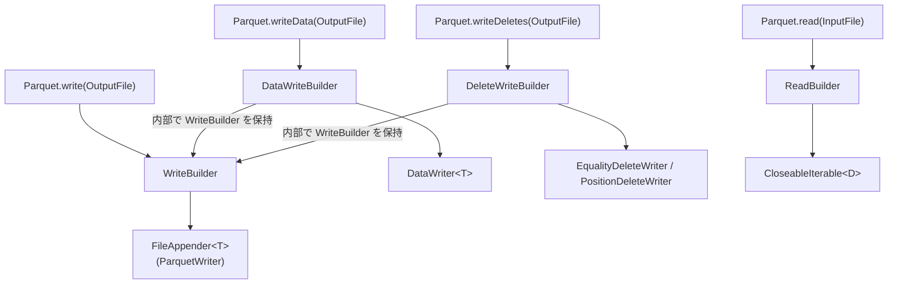
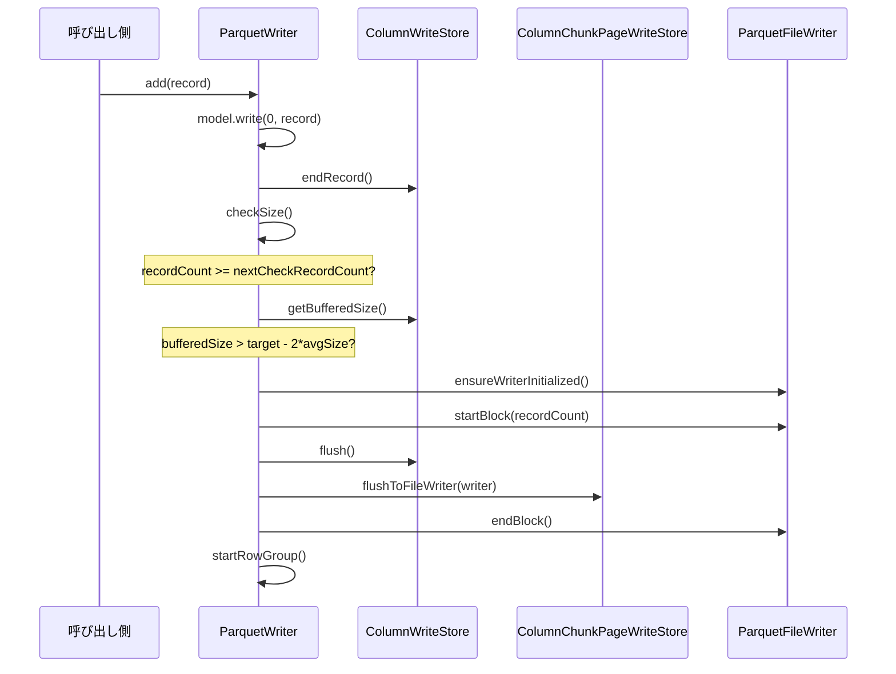
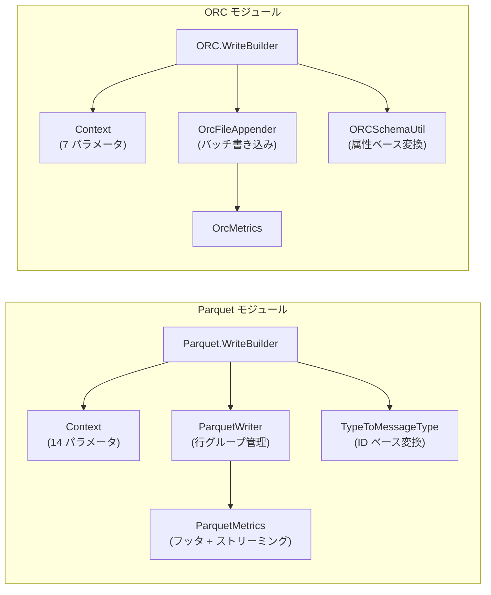

# 第19章 Parquet と ORC の読み書き

> **本章で読むソース**
>
> - [`parquet/src/main/java/org/apache/iceberg/parquet/Parquet.java`](https://github.com/apache/iceberg/blob/apache-iceberg-1.11.0/parquet/src/main/java/org/apache/iceberg/parquet/Parquet.java)
> - [`parquet/src/main/java/org/apache/iceberg/parquet/ParquetWriter.java`](https://github.com/apache/iceberg/blob/apache-iceberg-1.11.0/parquet/src/main/java/org/apache/iceberg/parquet/ParquetWriter.java)
> - [`parquet/src/main/java/org/apache/iceberg/parquet/ParquetSchemaUtil.java`](https://github.com/apache/iceberg/blob/apache-iceberg-1.11.0/parquet/src/main/java/org/apache/iceberg/parquet/ParquetSchemaUtil.java)
> - [`parquet/src/main/java/org/apache/iceberg/parquet/TypeToMessageType.java`](https://github.com/apache/iceberg/blob/apache-iceberg-1.11.0/parquet/src/main/java/org/apache/iceberg/parquet/TypeToMessageType.java)
> - [`parquet/src/main/java/org/apache/iceberg/parquet/ParquetMetrics.java`](https://github.com/apache/iceberg/blob/apache-iceberg-1.11.0/parquet/src/main/java/org/apache/iceberg/parquet/ParquetMetrics.java)
> - [`orc/src/main/java/org/apache/iceberg/orc/ORC.java`](https://github.com/apache/iceberg/blob/apache-iceberg-1.11.0/orc/src/main/java/org/apache/iceberg/orc/ORC.java)
> - [`orc/src/main/java/org/apache/iceberg/orc/ORCSchemaUtil.java`](https://github.com/apache/iceberg/blob/apache-iceberg-1.11.0/orc/src/main/java/org/apache/iceberg/orc/ORCSchemaUtil.java)
> - [`orc/src/main/java/org/apache/iceberg/orc/OrcFileAppender.java`](https://github.com/apache/iceberg/blob/apache-iceberg-1.11.0/orc/src/main/java/org/apache/iceberg/orc/OrcFileAppender.java)

## この章の狙い

Iceberg はファイルフォーマットに依存しない Open Table Format であり、データの物理的な読み書きは Parquet モジュールと ORC モジュールに委譲する。
本章では、両モジュールが提供するビルダーパターンの構造、Iceberg スキーマとフォーマット固有スキーマの変換機構、行グループやストライプの書き込み制御、そしてメトリクス収集の仕組みを読み解く。

## 前提

第3章で Iceberg の型システムとスキーマの構造を把握していること。
第8章でマニフェストファイルにおける列統計(下限値、上限値、null カウント等)の役割を知っていること。
Parquet の行グループ(Row Group)とページ、ORC のストライプとバッチという物理的な書き込み単位の概念を大まかに理解していると読みやすい。

## Parquet モジュールの全体構成

`Parquet` クラスはユーティリティクラスであり、インスタンスを持たない。
ファクトリメソッド `write()` と `read()` を起点に、入れ子のビルダークラスを組み立てる構造になっている。



3 種類の書き込みビルダーはすべて内部に `WriteBuilder` を保持し、ファイル書き込みの設定を共有する。
`DataWriteBuilder` はパーティション仕様とソート順序を追加で保持し、`DeleteWriteBuilder` は削除種別(等値削除か位置削除か)に応じて書き込み関数を切り替える。

## WriteBuilder のビルダーパターン

**WriteBuilder** は Parquet ファイル書き込みのすべてのパラメータを集約する。
エントリポイントは静的メソッド `Parquet.write()` である。

[`parquet/src/main/java/org/apache/iceberg/parquet/Parquet.java` L142-L148](https://github.com/apache/iceberg/blob/apache-iceberg-1.11.0/parquet/src/main/java/org/apache/iceberg/parquet/Parquet.java#L142-L148)

```java
  public static WriteBuilder write(OutputFile file) {
    if (file instanceof EncryptedOutputFile) {
      return write((EncryptedOutputFile) file);
    }

    return new WriteBuilder(file);
  }
```

`OutputFile` が暗号化対応の場合は自動的に暗号化パスへ分岐する。
「WriteBuilder」の主要なメソッドを見てみよう。

[`parquet/src/main/java/org/apache/iceberg/parquet/Parquet.java` L161-L175](https://github.com/apache/iceberg/blob/apache-iceberg-1.11.0/parquet/src/main/java/org/apache/iceberg/parquet/Parquet.java#L161-L175)

```java
  public static class WriteBuilder implements InternalData.WriteBuilder {
    private final OutputFile file;
    private final Configuration conf;
    private final Map<String, String> metadata = Maps.newLinkedHashMap();
    private final Map<String, String> config = Maps.newLinkedHashMap();
    private Schema schema = null;
    private VariantShreddingFunction variantShreddingFunc = null;
    private String name = "table";
    private WriteSupport<?> writeSupport = null;
    private BiFunction<Schema, MessageType, ParquetValueWriter<?>> createWriterFunc = null;
    private MetricsConfig metricsConfig = MetricsConfig.getDefault();
    private ParquetFileWriter.Mode writeMode = ParquetFileWriter.Mode.CREATE;
    private Function<Map<String, String>, Context> createContextFunc = Context::dataContext;
    private ByteBuffer fileEncryptionKey = null;
    private ByteBuffer fileAADPrefix = null;
```

注目すべきフィールドは `createWriterFunc` と `createContextFunc` の 2 つである。
`createWriterFunc` はレコードを Parquet の列ストアに書き込む「ParquetValueWriter」を生成する関数であり、エンジン(Spark, Flink 等)ごとに異なる実装を差し込める。
`createContextFunc` はテーブルプロパティからフォーマット固有の設定値(行グループサイズ、ページサイズ、圧縮コーデック等)を読み取る関数であり、データファイルと削除ファイルで設定体系を切り替える仕組みに使われる。

## データ設定と削除設定の分離: Context パターン

「WriteBuilder」の内部クラス **Context** は、テーブルプロパティの `Map<String, String>` からフォーマット設定を抽出する値オブジェクトである。
`dataContext()` と `deleteContext()` の 2 つのファクトリメソッドを持つ。

[`parquet/src/main/java/org/apache/iceberg/parquet/Parquet.java` L547-L551](https://github.com/apache/iceberg/blob/apache-iceberg-1.11.0/parquet/src/main/java/org/apache/iceberg/parquet/Parquet.java#L547-L551)

```java
      static Context dataContext(Map<String, String> config) {
        int rowGroupSize =
            PropertyUtil.propertyAsInt(
                config, PARQUET_ROW_GROUP_SIZE_BYTES, PARQUET_ROW_GROUP_SIZE_BYTES_DEFAULT);
        Preconditions.checkArgument(rowGroupSize > 0, "Row group size must be > 0");
```

[`parquet/src/main/java/org/apache/iceberg/parquet/Parquet.java` L636-L643](https://github.com/apache/iceberg/blob/apache-iceberg-1.11.0/parquet/src/main/java/org/apache/iceberg/parquet/Parquet.java#L636-L643)

```java
      static Context deleteContext(Map<String, String> config) {
        // default delete config using data config
        Context dataContext = dataContext(config);

        int rowGroupSize =
            PropertyUtil.propertyAsInt(
                config, DELETE_PARQUET_ROW_GROUP_SIZE_BYTES, dataContext.rowGroupSize());
        Preconditions.checkArgument(rowGroupSize > 0, "Row group size must be > 0");
```

「deleteContext」はまず「dataContext」を生成し、そのデフォルト値を引き継いだうえで `DELETE_PARQUET_*` プレフィクス付きのプロパティで上書きする。
この設計により、削除ファイルはデータファイルと異なる行グループサイズや圧縮コーデックを持てる。
削除ファイルは一般にデータファイルより小さいため、行グループサイズを小さくしてメモリ使用量を抑えるといった運用が可能になる。

「Context」が保持する主なパラメータは以下のとおりである。

| パラメータ | 説明 | デフォルト値の出所 |
|---|---|---|
| rowGroupSize | 行グループのバイトサイズ上限 | `PARQUET_ROW_GROUP_SIZE_BYTES_DEFAULT` |
| pageSize | ページのバイトサイズ上限 | `PARQUET_PAGE_SIZE_BYTES_DEFAULT` |
| codec | 圧縮コーデック(ZSTD, SNAPPY 等) | `PARQUET_COMPRESSION_DEFAULT` |
| bloomFilterMaxBytes | Bloom Filter の最大バイト数 | `PARQUET_BLOOM_FILTER_MAX_BYTES_DEFAULT` |
| dictionaryEnabled | 辞書エンコーディングの有効化 | `true` |

## WriteBuilder.build(): 2 つの書き込みパス

`build()` メソッドは `createWriterFunc` の有無で 2 つの異なるパスに分岐する。

[`parquet/src/main/java/org/apache/iceberg/parquet/Parquet.java` L354-L366](https://github.com/apache/iceberg/blob/apache-iceberg-1.11.0/parquet/src/main/java/org/apache/iceberg/parquet/Parquet.java#L354-L366)

```java
    @Override
    public <D> FileAppender<D> build() throws IOException {
      Preconditions.checkNotNull(schema, "Schema is required");
      Preconditions.checkNotNull(name, "Table name is required and cannot be null");

      // add the Iceberg schema to keyValueMetadata
      meta("iceberg.schema", SchemaParser.toJson(schema));

      // Map Iceberg properties to pass down to the Parquet writer
      Context context = createContextFunc.apply(config);

      int rowGroupSize = context.rowGroupSize();
      int pageSize = context.pageSize();
```

最初に `meta("iceberg.schema", ...)` で Iceberg スキーマの JSON 表現を Parquet ファイルのキーバリューメタデータに埋め込む。
これにより、Parquet ファイル単体から Iceberg スキーマを復元できる。

`createWriterFunc` が設定されている場合は Iceberg 独自の `ParquetWriter` を生成する。

[`parquet/src/main/java/org/apache/iceberg/parquet/Parquet.java` L453-L465](https://github.com/apache/iceberg/blob/apache-iceberg-1.11.0/parquet/src/main/java/org/apache/iceberg/parquet/Parquet.java#L453-L465)

```java
        return new org.apache.iceberg.parquet.ParquetWriter<>(
            conf,
            file,
            schema,
            type,
            rowGroupSize,
            metadata,
            createWriterFunc,
            codec,
            parquetProperties,
            metricsConfig,
            writeMode,
            fileEncryptionProperties);
```

`createWriterFunc` が null の場合は、Parquet ライブラリ標準の `ParquetWriter.Builder` をラップした `ParquetWriteBuilder` を使うフォールバックパスに入る。
通常のデータ書き込みでは `createWriterFunc` を設定するため、Iceberg 独自の「ParquetWriter」が使われる。

## Iceberg スキーマから Parquet スキーマへの変換

`WriteBuilder.build()` 内で呼ばれる `ParquetSchemaUtil.convert()` が変換の起点である。

[`parquet/src/main/java/org/apache/iceberg/parquet/ParquetSchemaUtil.java` L48-L50](https://github.com/apache/iceberg/blob/apache-iceberg-1.11.0/parquet/src/main/java/org/apache/iceberg/parquet/ParquetSchemaUtil.java#L48-L50)

```java
  public static MessageType convert(Schema schema, String name) {
    return new TypeToMessageType().convert(schema, name);
  }
```

実際の変換は **TypeToMessageType** クラスが行う。
Iceberg のフィールドを順に走査し、Parquet の `MessageType` を組み立てる。

[`parquet/src/main/java/org/apache/iceberg/parquet/TypeToMessageType.java` L82-L94](https://github.com/apache/iceberg/blob/apache-iceberg-1.11.0/parquet/src/main/java/org/apache/iceberg/parquet/TypeToMessageType.java#L82-L94)

```java
  public MessageType convert(Schema schema, String name) {
    Types.MessageTypeBuilder builder = Types.buildMessage();

    for (NestedField field : schema.columns()) {
      // unknown type is not written to data files
      Type fieldType = field(field);
      if (fieldType != null) {
        builder.addField(fieldType);
      }
    }

    return builder.named(AvroSchemaUtil.makeCompatibleName(name));
  }
```

変換のポイントは、各 Parquet フィールドに Iceberg のフィールド ID を `.id(id)` で付与することである。

[`parquet/src/main/java/org/apache/iceberg/parquet/TypeToMessageType.java` L110-L114](https://github.com/apache/iceberg/blob/apache-iceberg-1.11.0/parquet/src/main/java/org/apache/iceberg/parquet/TypeToMessageType.java#L110-L114)

```java
  public Type field(NestedField field) {
    Type.Repetition repetition =
        field.isOptional() ? Type.Repetition.OPTIONAL : Type.Repetition.REQUIRED;
    int id = field.fieldId();
    String name = field.name();
```

Parquet フィールドには `id` という属性があり、Iceberg はこれをフィールド ID として利用する。
この ID ベースのカラムマッピングが、スキーマ進化時にカラム名の変更やカラムの追加/削除を安全に行える仕組みの基盤となる。
名前ベースのマッピングではカラム名変更時に既存ファイルとの互換性が失われるが、ID ベースであればファイル内のフィールド ID とスキーマのフィールド ID を突き合わせるだけで正しい列を特定できる。

プリミティブ型の変換は型ごとに Parquet の物理型と論理型アノテーションを対応付ける。

[`parquet/src/main/java/org/apache/iceberg/parquet/TypeToMessageType.java` L207-L238](https://github.com/apache/iceberg/blob/apache-iceberg-1.11.0/parquet/src/main/java/org/apache/iceberg/parquet/TypeToMessageType.java#L207-L238)

```java
  public Type primitive(
      PrimitiveType primitive, Type.Repetition repetition, int id, String originalName) {
    String name = AvroSchemaUtil.makeCompatibleName(originalName);
    switch (primitive.typeId()) {
      case BOOLEAN:
        return Types.primitive(BOOLEAN, repetition).id(id).named(name);
      case INTEGER:
        return Types.primitive(INT32, repetition).id(id).named(name);
      case LONG:
        return Types.primitive(INT64, repetition).id(id).named(name);
      // ... (中略) ...
      case TIMESTAMP:
        if (((TimestampType) primitive).shouldAdjustToUTC()) {
          return Types.primitive(INT64, repetition).as(TIMESTAMPTZ_MICROS).id(id).named(name);
        } else {
          return Types.primitive(INT64, repetition).as(TIMESTAMP_MICROS).id(id).named(name);
        }
      // ... (中略) ...
      case STRING:
        return Types.primitive(BINARY, repetition).as(STRING).id(id).named(name);
```

Iceberg の `TIMESTAMP` は Parquet では `INT64` に論理型アノテーション `TIMESTAMP(isAdjustedToUTC=true/false, MICROS)` を付与して表現する。
`STRING` は Parquet の `BINARY` に `STRING` アノテーションを付与する。

逆方向の変換(Parquet から Iceberg)は `ParquetSchemaUtil.convert(MessageType)` が行う。

[`parquet/src/main/java/org/apache/iceberg/parquet/ParquetSchemaUtil.java` L77-L84](https://github.com/apache/iceberg/blob/apache-iceberg-1.11.0/parquet/src/main/java/org/apache/iceberg/parquet/ParquetSchemaUtil.java#L77-L84)

```java
  public static Schema convert(MessageType parquetSchema) {
    // if the Parquet schema does not contain ids, we assign fallback ids to top-level fields
    // all remaining fields will get ids >= 1000 to avoid pruning columns without ids
    MessageType parquetSchemaWithIds =
        hasIds(parquetSchema) ? parquetSchema : addFallbackIds(parquetSchema);
    AtomicInteger nextId = new AtomicInteger(1000);
    return convertInternal(parquetSchemaWithIds, name -> nextId.getAndIncrement());
  }
```

ID を持たない Parquet ファイル(Iceberg 以外で生成されたファイル)を読む場合は、フォールバック ID を割り当てることで互換性を確保する。

## ParquetWriter: 行グループの書き込み制御

Iceberg 独自の **ParquetWriter** は `FileAppender<T>` を実装し、レコード単位の書き込みと行グループの自動フラッシュを管理する。

[`parquet/src/main/java/org/apache/iceberg/parquet/ParquetWriter.java` L45-L69](https://github.com/apache/iceberg/blob/apache-iceberg-1.11.0/parquet/src/main/java/org/apache/iceberg/parquet/ParquetWriter.java#L45-L69)

```java
class ParquetWriter<T> implements FileAppender<T>, Closeable {

  private static final Metrics EMPTY_METRICS = new Metrics(0L, null, null, null, null);

  private final Schema schema;
  private final long targetRowGroupSize;
  private final Map<String, String> metadata;
  private final ParquetProperties props;
  private final CompressionCodecFactory.BytesInputCompressor compressor;
  private final MessageType parquetSchema;
  private final ParquetValueWriter<T> model;
  private final MetricsConfig metricsConfig;
  private final int columnIndexTruncateLength;
  private final ParquetFileWriter.Mode writeMode;
  private final OutputFile output;
  private final Configuration conf;
  private final InternalFileEncryptor fileEncryptor;

  private ColumnChunkPageWriteStore pageStore = null;
  private ColumnWriteStore writeStore;
  private long recordCount = 0;
  private long nextCheckRecordCount = 10;
  private boolean closed;
  private ParquetFileWriter writer;
  private int rowGroupOrdinal;
```

レコードの追加は `add()` メソッドで行い、毎回 `checkSize()` を呼んで行グループのフラッシュ判定を行う。

[`parquet/src/main/java/org/apache/iceberg/parquet/ParquetWriter.java` L135-L141](https://github.com/apache/iceberg/blob/apache-iceberg-1.11.0/parquet/src/main/java/org/apache/iceberg/parquet/ParquetWriter.java#L135-L141)

```java
  @Override
  public void add(T value) {
    recordCount += 1;
    model.write(0, value);
    writeStore.endRecord();
    checkSize();
  }
```

### 設計上の工夫: 適応的なサイズチェック間隔

行グループのフラッシュ判定を毎レコードで行うとオーバーヘッドが大きい。
「ParquetWriter」はバッファサイズのチェック間隔を動的に調整する仕組みを持つ。

[`parquet/src/main/java/org/apache/iceberg/parquet/ParquetWriter.java` L192-L209](https://github.com/apache/iceberg/blob/apache-iceberg-1.11.0/parquet/src/main/java/org/apache/iceberg/parquet/ParquetWriter.java#L192-L209)

```java
  private void checkSize() {
    if (recordCount >= nextCheckRecordCount) {
      long bufferedSize = writeStore.getBufferedSize();
      double avgRecordSize = ((double) bufferedSize) / recordCount;

      if (bufferedSize > (targetRowGroupSize - 2 * avgRecordSize)) {
        flushRowGroup(false);
      } else {
        long remainingSpace = targetRowGroupSize - bufferedSize;
        long remainingRecords = (long) (remainingSpace / avgRecordSize);
        this.nextCheckRecordCount =
            recordCount
                + Math.min(
                    Math.max(remainingRecords / 2, props.getMinRowCountForPageSizeCheck()),
                    props.getMaxRowCountForPageSizeCheck());
      }
    }
  }
```

`nextCheckRecordCount` は次にサイズチェックを実行するレコード数の閾値である。
バッファが「targetRowGroupSize」に近づくと `remainingRecords / 2` で間隔を短くし、まだ余裕がある場合は間隔を広げる。
`MinRowCountForPageSizeCheck` と `MaxRowCountForPageSizeCheck` の範囲内にクランプすることで、極端に頻繁なチェックや極端に稀なチェックを防ぐ。
この適応的な間隔調整により、行グループサイズの精度を保ちつつチェックのオーバーヘッドを最小化している。

フラッシュ処理本体は `flushRowGroup()` である。

[`parquet/src/main/java/org/apache/iceberg/parquet/ParquetWriter.java` L211-L227](https://github.com/apache/iceberg/blob/apache-iceberg-1.11.0/parquet/src/main/java/org/apache/iceberg/parquet/ParquetWriter.java#L211-L227)

```java
  private void flushRowGroup(boolean finished) {
    try {
      if (recordCount > 0) {
        ensureWriterInitialized();
        writer.startBlock(recordCount);
        writeStore.flush();
        pageStore.flushToFileWriter(writer);
        writer.endBlock();
        if (!finished) {
          writeStore.close();
          startRowGroup();
        }
      }
    } catch (IOException e) {
      throw new UncheckedIOException("Failed to flush row group", e);
    }
  }
```

`ensureWriterInitialized()` は遅延初期化パターンで、最初のフラッシュ時にはじめて `ParquetFileWriter` を生成する。
空のファイルを作らないための最適化である。



## Parquet メトリクスの収集

ファイルの書き込み完了後、`ParquetWriter.metrics()` がメトリクスを返す。

[`parquet/src/main/java/org/apache/iceberg/parquet/ParquetWriter.java` L143-L151](https://github.com/apache/iceberg/blob/apache-iceberg-1.11.0/parquet/src/main/java/org/apache/iceberg/parquet/ParquetWriter.java#L143-L151)

```java
  @Override
  public Metrics metrics() {
    Preconditions.checkState(closed, "Cannot return metrics for unclosed writer");
    if (writer != null) {
      return ParquetMetrics.metrics(
          schema, parquetSchema, metricsConfig, writer.getFooter(), model.metrics());
    }
    return EMPTY_METRICS;
  }
```

`writer.getFooter()` は Parquet フッタの `ParquetMetadata` を返し、各列チャンクの統計情報(最小値、最大値、null カウント等)を含む。
`model.metrics()` は書き込み中に `ParquetValueWriter` が収集した NaN カウントなどのストリーミングメトリクスを返す。

**ParquetMetrics** はこの 2 つの情報源を統合し、Iceberg の `Metrics` オブジェクトを構築する。

[`parquet/src/main/java/org/apache/iceberg/parquet/ParquetMetrics.java` L68-L95](https://github.com/apache/iceberg/blob/apache-iceberg-1.11.0/parquet/src/main/java/org/apache/iceberg/parquet/ParquetMetrics.java#L68-L95)

```java
  static Metrics metrics(
      Schema schema,
      MessageType type,
      MetricsConfig metricsConfig,
      ParquetMetadata metadata,
      Stream<FieldMetrics<?>> fields) {
    long rowCount = 0L;
    Map<Integer, Long> columnSizes = Maps.newHashMap();
    Multimap<ColumnPath, ColumnChunkMetaData> columns =
        Multimaps.newMultimap(Maps.newHashMap(), Lists::newArrayList);
    for (BlockMetaData block : metadata.getBlocks()) {
      rowCount += block.getRowCount();
      for (ColumnChunkMetaData column : block.getColumns()) {
        columns.put(column.getPath(), column);

        Type.ID id =
            type.getColumnDescription(column.getPath().toArray()).getPrimitiveType().getId();
        if (null == id) {
          continue;
        }

        int fieldId = id.intValue();
        MetricsModes.MetricsMode mode = MetricsUtil.metricsMode(schema, metricsConfig, fieldId);
        if (mode != MetricsModes.None.get()) {
          columnSizes.put(fieldId, columnSizes.getOrDefault(fieldId, 0L) + column.getTotalSize());
        }
      }
    }
```

メトリクスモードは列ごとに設定可能であり、`None`(収集しない)、`Counts`(カウントのみ)、`Truncate(length)`(上下限値を指定長で切り詰め)、`Full`(完全な上下限値)の 4 段階がある。
Parquet フッタの列チャンクメタデータから ID を抽出し、その ID でメトリクスモードを参照する流れは、ID ベースのカラムマッピングが一貫して使われていることを示している。

収集されたメトリクスは `Metrics` オブジェクトに集約され、マニフェストファイルのエントリに記録される。
これが後の読み取り時に行グループレベルのスキッピング(述語プッシュダウン)を可能にする。

## ORC モジュールの全体構成

ORC モジュールも Parquet と同様の階層構造を持つ。
`ORC` クラスが `WriteBuilder`, `DataWriteBuilder`, `DeleteWriteBuilder`, `ReadBuilder` を提供する。

[`orc/src/main/java/org/apache/iceberg/orc/ORC.java` L110-L118](https://github.com/apache/iceberg/blob/apache-iceberg-1.11.0/orc/src/main/java/org/apache/iceberg/orc/ORC.java#L110-L118)

```java
  public static WriteBuilder write(OutputFile file) {
    return new WriteBuilder(file);
  }

  public static WriteBuilder write(EncryptedOutputFile file) {
    Preconditions.checkState(
        !(file instanceof NativeEncryptionOutputFile), "Native ORC encryption is not supported");
    return new WriteBuilder(file.encryptingOutputFile());
  }
```

Parquet との大きな違いは、ORC ではネイティブ暗号化がサポートされていない点である。
`NativeEncryptionOutputFile` が渡されると例外を投げる。

### ORC の WriteBuilder.build()

ORC の「WriteBuilder」も「Context」パターンでデータ設定と削除設定を分離する。
Parquet との対応関係は以下のとおりである。

| Parquet のパラメータ | ORC の対応パラメータ |
|---|---|
| 行グループサイズ (rowGroupSize) | ストライプサイズ (stripeSize) |
| ページサイズ (pageSize) | (ORC 内部で管理) |
| 圧縮コーデック (codec) | 圧縮種別 (compressionKind) |
| Bloom Filter 設定 | bloomFilterColumns, bloomFilterFpp |
| 辞書エンコーディング | (ORC 内部で自動判定) |

[`orc/src/main/java/org/apache/iceberg/orc/ORC.java` L193-L224](https://github.com/apache/iceberg/blob/apache-iceberg-1.11.0/orc/src/main/java/org/apache/iceberg/orc/ORC.java#L193-L224)

```java
    public <D> FileAppender<D> build() {
      Preconditions.checkNotNull(schema, "Schema is required");

      for (Map.Entry<String, String> entry : config.entrySet()) {
        this.conf.set(entry.getKey(), entry.getValue());
      }

      // ... (中略) ...

      // Map Iceberg properties to pass down to the ORC writer
      Context context = createContextFunc.apply(config);

      OrcConf.STRIPE_SIZE.setLong(conf, context.stripeSize());
      OrcConf.BLOCK_SIZE.setLong(conf, context.blockSize());
      OrcConf.COMPRESS.setString(conf, context.compressionKind().name());
      OrcConf.COMPRESSION_STRATEGY.setString(conf, context.compressionStrategy().name());
      OrcConf.OVERWRITE_OUTPUT_FILE.setBoolean(conf, overwrite);
      OrcConf.BLOOM_FILTER_COLUMNS.setString(conf, context.bloomFilterColumns());
      OrcConf.BLOOM_FILTER_FPP.setDouble(conf, context.bloomFilterFpp());

      return new OrcFileAppender<>(
          schema,
          this.file,
          createWriterFunc,
          conf,
          metadata,
          context.vectorizedRowBatchSize(),
          metricsConfig);
    }
```

Iceberg のテーブルプロパティを ORC の設定(`OrcConf`)に変換したあと、`OrcFileAppender` を生成する。

## Iceberg スキーマから ORC スキーマへの変換

**ORCSchemaUtil** が Iceberg スキーマを ORC の `TypeDescription` に変換する。

[`orc/src/main/java/org/apache/iceberg/orc/ORCSchemaUtil.java` L125-L135](https://github.com/apache/iceberg/blob/apache-iceberg-1.11.0/orc/src/main/java/org/apache/iceberg/orc/ORCSchemaUtil.java#L125-L135)

```java
  public static TypeDescription convert(Schema schema) {
    final TypeDescription root = TypeDescription.createStruct();
    final Types.StructType schemaRoot = schema.asStruct();
    for (Types.NestedField field : schemaRoot.asStructType().fields()) {
      TypeDescription orcColumnType = convert(field.fieldId(), field.type(), field.isRequired());
      if (orcColumnType != null) {
        root.addField(field.name(), orcColumnType);
      }
    }
    return root;
  }
```

ORC は Parquet のようにフィールド ID を直接サポートしない。
そのため Iceberg は `TypeDescription` のカスタム属性として ID を埋め込む。

[`orc/src/main/java/org/apache/iceberg/orc/ORCSchemaUtil.java` L68-L69](https://github.com/apache/iceberg/blob/apache-iceberg-1.11.0/orc/src/main/java/org/apache/iceberg/orc/ORCSchemaUtil.java#L68-L69)

```java
  static final String ICEBERG_ID_ATTRIBUTE = "iceberg.id";
  static final String ICEBERG_REQUIRED_ATTRIBUTE = "iceberg.required";
```

各フィールドの変換時に `orcType.setAttribute(ICEBERG_ID_ATTRIBUTE, ...)` で Iceberg のフィールド ID を付与する。
これは Parquet の `.id(id)` と同等の役割を果たし、スキーマ進化時の列の対応付けに使われる。

ORC では Iceberg の型を表現するために追加の属性も使う。
たとえば `TIME` 型は ORC の `LONG` にマッピングされるが、そのままでは `LONG` と区別できない。

[`orc/src/main/java/org/apache/iceberg/orc/ORCSchemaUtil.java` L149-L152](https://github.com/apache/iceberg/blob/apache-iceberg-1.11.0/orc/src/main/java/org/apache/iceberg/orc/ORCSchemaUtil.java#L149-L152)

```java
      case TIME:
        orcType = TypeDescription.createLong();
        orcType.setAttribute(ICEBERG_LONG_TYPE_ATTRIBUTE, LongType.TIME.toString());
        break;
```

`ICEBERG_LONG_TYPE_ATTRIBUTE` を `TIME` に設定することで、読み取り時に Iceberg の `TIME` 型として正しく復元できる。
同様に `UUID` と `FIXED` はともに ORC の `BINARY` にマッピングされるが、`ICEBERG_BINARY_TYPE_ATTRIBUTE` で区別する。

## OrcFileAppender: バッチ書き込み

ORC の書き込みは Parquet と異なり、`VectorizedRowBatch` を介したバッチ書き込みを行う。

[`orc/src/main/java/org/apache/iceberg/orc/OrcFileAppender.java` L62-L94](https://github.com/apache/iceberg/blob/apache-iceberg-1.11.0/orc/src/main/java/org/apache/iceberg/orc/OrcFileAppender.java#L62-L94)

```java
  OrcFileAppender(
      Schema schema,
      OutputFile file,
      BiFunction<Schema, TypeDescription, OrcRowWriter<?>> createWriterFunc,
      Configuration conf,
      Map<String, byte[]> metadata,
      int batchSize,
      MetricsConfig metricsConfig) {
    // ... (中略) ...
    TypeDescription orcSchema = ORCSchemaUtil.convert(schema);

    this.avgRowByteSize =
        OrcSchemaVisitor.visitSchema(orcSchema, new EstimateOrcAvgWidthVisitor()).stream()
            .reduce(Integer::sum)
            .orElse(0);
    // ... (中略) ...
    this.batch = orcSchema.createRowBatch(this.batchSize);

    OrcFile.WriterOptions options = OrcFile.writerOptions(conf).useUTCTimestamp(true);
    // ... (中略) ...
    options.setSchema(orcSchema);
    this.writer = ORC.newFileWriter(file, options, metadata);
    this.valueWriter = newOrcRowWriter(schema, orcSchema, createWriterFunc);
  }
```

コンストラクタ内で `EstimateOrcAvgWidthVisitor` を使って平均行サイズを見積もる。
この値はファイルサイズの近似計算に使われる。

レコード追加の仕組みは以下のとおりである。

[`orc/src/main/java/org/apache/iceberg/orc/OrcFileAppender.java` L96-L108](https://github.com/apache/iceberg/blob/apache-iceberg-1.11.0/orc/src/main/java/org/apache/iceberg/orc/OrcFileAppender.java#L96-L108)

```java
  @Override
  public void add(D datum) {
    try {
      valueWriter.write(datum, batch);
      if (batch.size == this.batchSize) {
        writer.addRowBatch(batch);
        batch.reset();
      }
    } catch (IOException ioe) {
      throw new UncheckedIOException(
          String.format("Problem writing to ORC file %s", file.location()), ioe);
    }
  }
```

Parquet が 1 レコードずつ列ストアに書き込むのに対し、ORC は `VectorizedRowBatch` が満杯になったタイミングでまとめて書き出す。
ORC ライブラリ自身がストライプ境界を管理するため、Iceberg 側で行グループのフラッシュ判定を行う必要がない。

## Parquet と ORC の DeleteWriteBuilder

削除ファイルの書き込みには等値削除と位置削除の 2 種類がある。
両フォーマットとも `DeleteWriteBuilder` が `buildEqualityWriter()` と `buildPositionWriter()` の 2 つのメソッドを提供し、削除種別に応じたスキーマとメタデータを設定する。

等値削除の場合は行スキーマをそのまま使い、メタデータに `delete-type=equality` と対象フィールド ID 一覧を書き込む。

[`parquet/src/main/java/org/apache/iceberg/parquet/Parquet.java` L1066-L1076](https://github.com/apache/iceberg/blob/apache-iceberg-1.11.0/parquet/src/main/java/org/apache/iceberg/parquet/Parquet.java#L1066-L1076)

```java
      meta("delete-type", "equality");
      meta(
          "delete-field-ids",
          IntStream.of(equalityFieldIds)
              .mapToObj(Objects::toString)
              .collect(Collectors.joining(", ")));

      // the appender uses the row schema without extra columns
      appenderBuilder.schema(rowSchema);
      appenderBuilder.createWriterFunc(createWriterFunc);
      appenderBuilder.createContextFunc(WriteBuilder.Context::deleteContext);
```

位置削除の場合はスキーマを `DeleteSchemaUtil.posDeleteSchema()` でラップし、ファイルパスと行位置のカラムを追加する。
`createContextFunc` に `Context::deleteContext` を設定することで、削除専用のファイルフォーマット設定が適用される。

## ReadBuilder: 読み取りパスの多様性

Parquet の **ReadBuilder** は 3 種類の読み取り関数をサポートする。

1. `createReaderFunc`: 行単位の `ParquetValueReader` を生成する関数
2. `createBatchedReaderFunc`: ベクトル化された `VectorizedReader` を生成する関数
3. `readSupport`: Parquet ライブラリ標準の `ReadSupport` (非推奨)

[`parquet/src/main/java/org/apache/iceberg/parquet/Parquet.java` L1459-L1524](https://github.com/apache/iceberg/blob/apache-iceberg-1.11.0/parquet/src/main/java/org/apache/iceberg/parquet/Parquet.java#L1459-L1524)

```java
      if (batchedReaderFunc != null
          || batchedReaderFuncWithSchema != null
          || readerFunction != null) {
        // ... (中略) ...
        if (batchedFunc != null) {
          return new VectorizedParquetReader<>(
              file,
              schema,
              options,
              batchedFunc,
              mapping,
              filter,
              reuseContainers,
              caseSensitive,
              maxRecordsPerBatch);
        } else {
          Function<MessageType, ParquetValueReader<?>> readBuilder =
              readerFunction
                  .withSchema(schema)
                  .withRootType(rootType)
                  .withCustomTypes(customTypes)
                  .apply();

          return new org.apache.iceberg.parquet.ParquetReader<>(
              file, schema, options, readBuilder, mapping, filter, reuseContainers, caseSensitive);
        }
      }
```

ベクトル化読み取りが設定されていれば `VectorizedParquetReader` を、行単位の読み取り関数が設定されていれば `ParquetReader` を返す。
いずれも設定されていない場合はフォールバックとして Avro ベースの読み取りに入る。

ORC の ReadBuilder も同様に `createReaderFunc`(行単位)と `createBatchedReaderFunc`(バッチ単位)を択一で設定する構造である。

[`orc/src/main/java/org/apache/iceberg/orc/ORC.java` L751-L757](https://github.com/apache/iceberg/blob/apache-iceberg-1.11.0/orc/src/main/java/org/apache/iceberg/orc/ORC.java#L751-L757)

```java
    public ReadBuilder createReaderFunc(Function<TypeDescription, OrcRowReader<?>> readerFunction) {
      Preconditions.checkArgument(
          this.batchedReaderFunc == null,
          "Reader function cannot be set since the batched version is already set");
      this.readerFunc = readerFunction;
      return this;
    }
```

## Parquet と ORC の設計比較



両モジュールは以下の共通設計原則に従っている。

- ビルダーパターンによるファイル I/O の構築(write/read のファクトリメソッドから入れ子ビルダーへ)
- 「Context」パターンによるデータ設定と削除設定の分離
- `createWriterFunc` / `createReaderFunc` による書き込み/読み取り関数の差し替え
- フィールド ID によるスキーマ進化時の列マッピング

相違点は物理フォーマットに起因する。
Parquet は列指向のページ構造を持つため、Iceberg 側で行グループの境界管理と適応的サイズチェックが必要である。
ORC は行指向のベクトル化バッチとストライプ構造を持ち、ストライプ管理は ORC ライブラリに委ねている。

## まとめ

- `Parquet` クラスと `ORC` クラスは、入れ子のビルダー(WriteBuilder, DataWriteBuilder, DeleteWriteBuilder, ReadBuilder)を通じてファイルの読み書きを構成する
- 「Context」パターンにより、データファイルと削除ファイルで異なるフォーマット設定(行グループサイズ、圧縮コーデック等)を適用できる
- Iceberg スキーマから Parquet スキーマへの変換は `TypeToMessageType` が担い、各フィールドに Iceberg のフィールド ID を `.id()` で付与する。ORC では `TypeDescription` のカスタム属性 `iceberg.id` でフィールド ID を埋め込む
- 「ParquetWriter」は適応的なサイズチェック間隔(`nextCheckRecordCount` の動的調整)により、行グループサイズの精度とチェックオーバーヘッドのバランスを取る
- メトリクス収集は Parquet フッタの列チャンク統計と書き込み中のストリーミングメトリクスを統合し、マニフェストファイルの列統計として記録される
- 書き込み関数と読み取り関数の差し替え機構により、Spark や Flink などの計算エンジンが独自のシリアライザ/デシリアライザを注入できる

## 関連する章

- [第3章 型システム](../part01-type-and-schema/03-type-system.md)
- [第4章 スキーマ進化](../part01-type-and-schema/04-schema-evolution.md)
- [第8章 マニフェストファイル](../part03-snapshot/08-manifest-file.md)
- [第11章 行レベル削除](../part04-data-operations/11-row-level-deletes.md)
