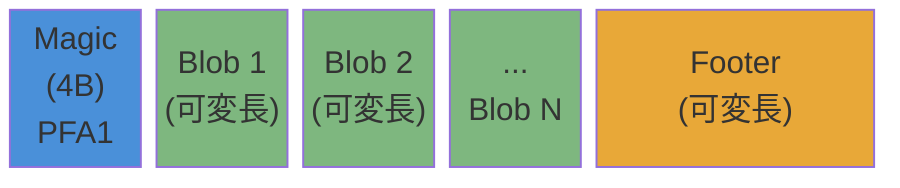
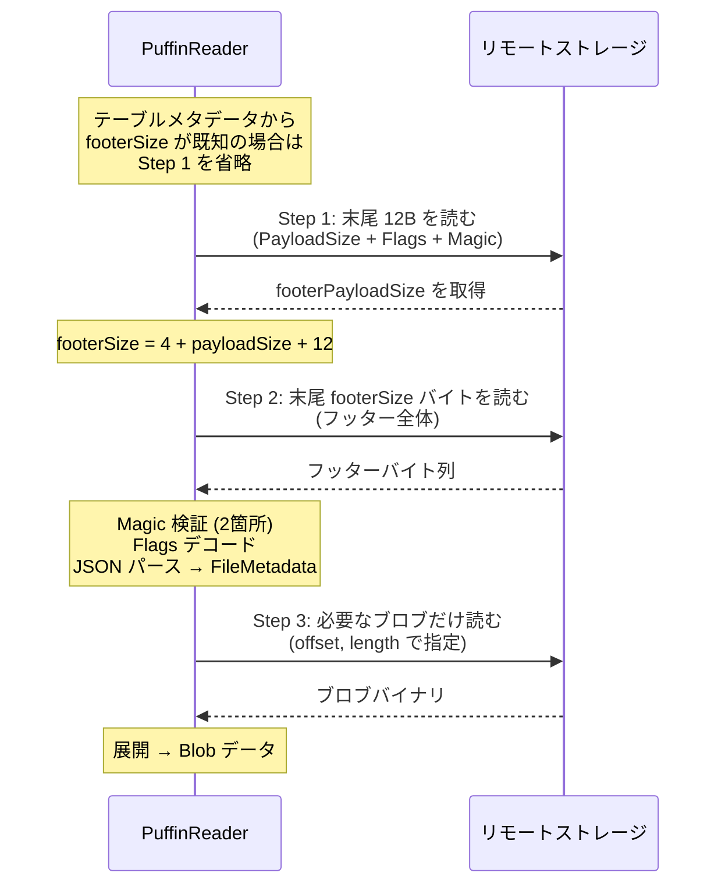

# 第20章 Puffin 統計ファイル

> **本章で読むソース**
>
> - [`format/puffin-spec.md`](https://github.com/apache/iceberg/blob/apache-iceberg-1.11.0/format/puffin-spec.md)
> - [`core/src/main/java/org/apache/iceberg/puffin/PuffinWriter.java`](https://github.com/apache/iceberg/blob/apache-iceberg-1.11.0/core/src/main/java/org/apache/iceberg/puffin/PuffinWriter.java)
> - [`core/src/main/java/org/apache/iceberg/puffin/PuffinReader.java`](https://github.com/apache/iceberg/blob/apache-iceberg-1.11.0/core/src/main/java/org/apache/iceberg/puffin/PuffinReader.java)
> - [`core/src/main/java/org/apache/iceberg/puffin/Blob.java`](https://github.com/apache/iceberg/blob/apache-iceberg-1.11.0/core/src/main/java/org/apache/iceberg/puffin/Blob.java)

## この章の狙い

Iceberg のマニフェストファイルには列ごとの min/max やレコード数などの基本メトリクスが格納されるが、NDV（Number of Distinct Values）推定のようなスケッチ構造体や削除ベクトルのようなバイナリデータは収まらない。
**Puffin** はこうした「マニフェストに入りきらない統計やインデックス」を格納するために設計された独自バイナリフォーマットである。
本章では Puffin の仕様構造を読み解き、参照実装である `PuffinWriter` と `PuffinReader` がフォーマットをどう実現しているかを追う。

## 前提

第8章「マニフェストファイル」で述べたマニフェストの列メトリクス構造を前提とする。
第11章「行レベル更新と削除ファイル」で導入した削除ベクトル（Deletion Vector）も Puffin を利用する。
Iceberg の FileIO 抽象（第18章）を通じてストレージに読み書きされる点も押さえておきたい。

## Puffin フォーマットの概要

Puffin の名前は Atlantic Puffin（ニシツノメドリ、学名 *Fratercula arctica*）に由来する。
仕様上のバージョンは v1 のみが定義されている。

ファイルの全体構造は次のとおりである。

```text
Magic Blob1 Blob2 ... BlobN Footer
```

先頭 4 バイトのマジックナンバーに続いて、1 個以上のブロブ（blob）が連続し、末尾にフッターが付く。
マジックナンバーは `0x50, 0x46, 0x41, 0x31` で、ASCII にすると `PFA1`（Puffin *Fratercula arctica* version 1）を表す。

参照実装ではこの値を `PuffinFormat.getMagic()` で定義している。

[`core/src/main/java/org/apache/iceberg/puffin/PuffinFormat.java` L88-L90](https://github.com/apache/iceberg/blob/apache-iceberg-1.11.0/core/src/main/java/org/apache/iceberg/puffin/PuffinFormat.java#L88-L90)

```java
  static byte[] getMagic() {
    return new byte[] {0x50, 0x46, 0x41, 0x31};
  }
```

マジックナンバーはファイル先頭だけでなくフッター内にも 2 回出現し、合計 3 回ファイルに書かれる。
これにより、リーダーはファイル末尾だけを読んでもフォーマットの健全性を検証できる。

## フッターの構造

フッターは可変長のペイロードと固定長の構造体から成る。

```text
Magic FooterPayload FooterPayloadSize(4B) Flags(4B) Magic
```

仕様のフィールドを整理すると以下のようになる。

| 要素 | サイズ | 説明 |
|------|--------|------|
| Magic | 4 バイト | ファイル先頭と同じ `PFA1` |
| FooterPayload | 可変長 | ブロブメタデータの JSON（圧縮可） |
| FooterPayloadSize | 4 バイト | FooterPayload の長さ（リトルエンディアン） |
| Flags | 4 バイト | ビットフラグ（bit 0: ペイロード圧縮） |
| Magic | 4 バイト | 再び `PFA1` |

Flags の最下位ビットが 1 の場合、FooterPayload は LZ4 フレームで圧縮されている。
参照実装では `Flag.FOOTER_PAYLOAD_COMPRESSED` という enum 値でこのビットを管理する。

[`core/src/main/java/org/apache/iceberg/puffin/PuffinFormat.java` L39-L41](https://github.com/apache/iceberg/blob/apache-iceberg-1.11.0/core/src/main/java/org/apache/iceberg/puffin/PuffinFormat.java#L39-L41)

```java
  enum Flag {
    FOOTER_PAYLOAD_COMPRESSED(0, 0),
  /**/ ;
```

4 バイト整数のリトルエンディアン読み書きも `PuffinFormat` が担う。

[`core/src/main/java/org/apache/iceberg/puffin/PuffinFormat.java` L92-L97](https://github.com/apache/iceberg/blob/apache-iceberg-1.11.0/core/src/main/java/org/apache/iceberg/puffin/PuffinFormat.java#L92-L97)

```java
  static void writeIntegerLittleEndian(OutputStream outputStream, int value) throws IOException {
    outputStream.write(0xFF & value);
    outputStream.write(0xFF & (value >> 8));
    outputStream.write(0xFF & (value >> 16));
    outputStream.write(0xFF & (value >> 24));
  }
```

## Puffin ファイルの全体像（Mermaid 図）




## Blob と BlobMetadata

### Blob クラス

**Blob** は書き込み側で使うデータ転送オブジェクトである。
ブロブの種別、対象フィールド ID のリスト、スナップショット ID、シーケンス番号、バイナリデータ本体、圧縮方式、プロパティを持つ。

[`core/src/main/java/org/apache/iceberg/puffin/Blob.java` L29-L36](https://github.com/apache/iceberg/blob/apache-iceberg-1.11.0/core/src/main/java/org/apache/iceberg/puffin/Blob.java#L29-L36)

```java
public final class Blob {
  private final String type;
  private final List<Integer> inputFields;
  private final long snapshotId;
  private final long sequenceNumber;
  private final ByteBuffer blobData;
  private final PuffinCompressionCodec requestedCompression;
  private final Map<String, String> properties;
```

`type` はブロブの種別を示す文字列である。
仕様で定義されている種別は `StandardBlobTypes` に定数として保持されている。

[`core/src/main/java/org/apache/iceberg/puffin/StandardBlobTypes.java` L28-L31](https://github.com/apache/iceberg/blob/apache-iceberg-1.11.0/core/src/main/java/org/apache/iceberg/puffin/StandardBlobTypes.java#L28-L31)

```java
  public static final String APACHE_DATASKETCHES_THETA_V1 = "apache-datasketches-theta-v1";

  /** A serialized deletion vector according to the Iceberg spec */
  public static final String DV_V1 = "deletion-vector-v1";
```

1.11.0 時点では 2 種類のブロブが定義されている。
`apache-datasketches-theta-v1` は NDV 推定用の Theta スケッチ、`deletion-vector-v1` はフォーマット v3 で導入された削除ベクトルである。

`inputFields` はブロブの計算対象となった列のフィールド ID リストで、順序に意味がある。
Theta スケッチの場合はスケッチ計算の対象列、削除ベクトルの場合は行位置を示す `MetadataColumns.ROW_POSITION` のフィールド ID が入る。

`requestedCompression` は null を許容する。
null の場合は `PuffinWriter` のデフォルト圧縮が適用される。

### BlobMetadata クラス

**BlobMetadata** はフッターに書かれるブロブのメタデータを表す。
「Blob」がバイナリデータ本体を含むのに対し、「BlobMetadata」はファイル内のオフセットと長さで位置を参照する点が異なる。

[`core/src/main/java/org/apache/iceberg/puffin/BlobMetadata.java` L28-L36](https://github.com/apache/iceberg/blob/apache-iceberg-1.11.0/core/src/main/java/org/apache/iceberg/puffin/BlobMetadata.java#L28-L36)

```java
public class BlobMetadata {
  private final String type;
  private final List<Integer> inputFields;
  private final long snapshotId;
  private final long sequenceNumber;
  private final long offset;
  private final long length;
  private final String compressionCodec;
  private final Map<String, String> properties;
```

`offset` と `length` はファイル内でのブロブバイナリの位置と長さ（圧縮後）を示す。
リーダーはフッターの「BlobMetadata」だけを読んで、必要なブロブのみをランダムリードで取得できる。
この設計により、不要なブロブのデコードを回避し、大きな統計ファイルからの選択的読み出しが可能になる。

## FileMetadata と JSON シリアライゼーション

フッターペイロードの JSON は **FileMetadata** を表す。
このクラスはブロブメタデータのリストとファイルレベルのプロパティを持つ。

[`core/src/main/java/org/apache/iceberg/puffin/FileMetadata.java` L27-L29](https://github.com/apache/iceberg/blob/apache-iceberg-1.11.0/core/src/main/java/org/apache/iceberg/puffin/FileMetadata.java#L27-L29)

```java
public class FileMetadata {
  private final List<BlobMetadata> blobs;
  private final Map<String, String> properties;
```

シリアライゼーションは `FileMetadataParser` が担当する。
ブロブごとに `type`、`fields`、`snapshot-id`、`sequence-number`、`offset`、`length` を書き出し、圧縮コーデックとプロパティはオプションで付与する。

[`core/src/main/java/org/apache/iceberg/puffin/FileMetadataParser.java` L93-L114](https://github.com/apache/iceberg/blob/apache-iceberg-1.11.0/core/src/main/java/org/apache/iceberg/puffin/FileMetadataParser.java#L93-L114)

```java
  static void toJson(BlobMetadata blobMetadata, JsonGenerator generator) throws IOException {
    generator.writeStartObject();

    generator.writeStringField(TYPE, blobMetadata.type());

    JsonUtil.writeIntegerArray(FIELDS, blobMetadata.inputFields(), generator);
    generator.writeNumberField(SNAPSHOT_ID, blobMetadata.snapshotId());
    generator.writeNumberField(SEQUENCE_NUMBER, blobMetadata.sequenceNumber());

    generator.writeNumberField(OFFSET, blobMetadata.offset());
    generator.writeNumberField(LENGTH, blobMetadata.length());

    if (blobMetadata.compressionCodec() != null) {
      generator.writeStringField(COMPRESSION_CODEC, blobMetadata.compressionCodec());
    }

    if (!blobMetadata.properties().isEmpty()) {
      JsonUtil.writeStringMap(PROPERTIES, blobMetadata.properties(), generator);
    }

    generator.writeEndObject();
  }
```

ファイルレベルのプロパティには `created-by` を設定することが推奨されている。
参照実装では `StandardPuffinProperties.CREATED_BY_PROPERTY` として定数化されている。

## PuffinWriter の書き込みフロー

**PuffinWriter** は `FileAppender<Blob>` を実装し、Blob を順次書き込む。
`Puffin.write()` から取得する `WriteBuilder` で構築する。

[`core/src/main/java/org/apache/iceberg/puffin/Puffin.java` L40-L85](https://github.com/apache/iceberg/blob/apache-iceberg-1.11.0/core/src/main/java/org/apache/iceberg/puffin/Puffin.java#L40-L85)

```java
  public static class WriteBuilder {
    private final OutputFile outputFile;
    private final Map<String, String> properties = Maps.newLinkedHashMap();
    private boolean compressFooter = false;
    private PuffinCompressionCodec defaultBlobCompression = PuffinCompressionCodec.NONE;
    // ... (中略) ...
    public PuffinWriter build() {
      return new PuffinWriter(outputFile, properties, compressFooter, defaultBlobCompression);
    }
  }
```

ビルダーで設定できる項目は以下の 3 つである。

1. ファイルレベルプロパティ（`created-by` など）
2. フッター圧縮の有無（`compressFooter()`）
3. ブロブのデフォルト圧縮コーデック（`compressBlobs()`）

### write メソッドの詳細

`write()` メソッドがブロブ 1 個分の書き込みを担う。

[`core/src/main/java/org/apache/iceberg/puffin/PuffinWriter.java` L84-L110](https://github.com/apache/iceberg/blob/apache-iceberg-1.11.0/core/src/main/java/org/apache/iceberg/puffin/PuffinWriter.java#L84-L110)

```java
  public BlobMetadata write(Blob blob) {
    Preconditions.checkNotNull(blob, "blob is null");
    checkNotFinished();
    try {
      writeHeaderIfNeeded();
      long fileOffset = outputStream.getPos();
      PuffinCompressionCodec codec =
          MoreObjects.firstNonNull(blob.requestedCompression(), defaultBlobCompression);
      ByteBuffer rawData = PuffinFormat.compress(codec, blob.blobData());
      int length = rawData.remaining();
      IOUtil.writeFully(outputStream, rawData);
      BlobMetadata blobMetadata =
          new BlobMetadata(
              blob.type(),
              blob.inputFields(),
              blob.snapshotId(),
              blob.sequenceNumber(),
              fileOffset,
              length,
              codec.codecName(),
              blob.properties());
      writtenBlobsMetadata.add(blobMetadata);
      return blobMetadata;
    } catch (IOException e) {
      throw new UncheckedIOException(e);
    }
  }
```

処理の流れは次のとおりである。

1. 最初の書き込み時にヘッダー（マジックナンバー 4 バイト）を出力する
2. 現在のストリーム位置を `fileOffset` として記録する
3. ブロブ固有の圧縮設定があればそれを使い、なければデフォルト圧縮を適用する
4. 圧縮後のデータをストリームに書く
5. `BlobMetadata` を生成してリストに追加し、呼び出し元に返す

`writeHeaderIfNeeded()` は冪等で、ヘッダーが既に書かれていればスキップする。
この遅延書き込みにより、ブロブが 0 個の場合でも `finish()` 時に正しいファイルを生成できる。

### finish とフッター書き込み

`finish()` メソッドがフッターを書いてファイルを完成させる。

[`core/src/main/java/org/apache/iceberg/puffin/PuffinWriter.java` L152-L164](https://github.com/apache/iceberg/blob/apache-iceberg-1.11.0/core/src/main/java/org/apache/iceberg/puffin/PuffinWriter.java#L152-L164)

```java
  private void writeFooter() throws IOException {
    FileMetadata fileMetadata = new FileMetadata(writtenBlobsMetadata, properties);
    ByteBuffer footerJson =
        ByteBuffer.wrap(
            FileMetadataParser.toJson(fileMetadata, false).getBytes(StandardCharsets.UTF_8));
    ByteBuffer footerPayload = PuffinFormat.compress(footerCompression, footerJson);
    outputStream.write(MAGIC);
    int footerPayloadLength = footerPayload.remaining();
    IOUtil.writeFully(outputStream, footerPayload);
    PuffinFormat.writeIntegerLittleEndian(outputStream, footerPayloadLength);
    writeFlags();
    outputStream.write(MAGIC);
  }
```

フッターの書き込み順序は仕様どおり、Magic、FooterPayload、FooterPayloadSize、Flags、Magic である。
JSON はコンパクト形式（`pretty=false`）で出力される。
フッター圧縮が有効な場合、デフォルトの圧縮コーデックは LZ4 である（`PuffinFormat.FOOTER_COMPRESSION_CODEC`）。

## PuffinReader の読み取りフロー

**PuffinReader** は `Closeable` を実装し、フッターからメタデータを読み取り、ブロブをランダムリードで取得する。

### フッターサイズの決定

読み取りの第一歩はフッターサイズの特定である。
フッターの固定長部分（PayloadSize + Flags + Magic = 12 バイト）をファイル末尾から読み、そこに記されたペイロードサイズからフッター全体のサイズを逆算する。

[`core/src/main/java/org/apache/iceberg/puffin/PuffinReader.java` L161-L182](https://github.com/apache/iceberg/blob/apache-iceberg-1.11.0/core/src/main/java/org/apache/iceberg/puffin/PuffinReader.java#L161-L182)

```java
  private int footerSize() throws IOException {
    if (knownFooterSize == null) {
      Preconditions.checkState(
          fileSize >= PuffinFormat.FOOTER_STRUCT_LENGTH,
          "Invalid file: file length %s is less tha minimal length of the footer tail %s",
          fileSize,
          PuffinFormat.FOOTER_STRUCT_LENGTH);
      byte[] footerStruct =
          readInput(
              fileSize - PuffinFormat.FOOTER_STRUCT_LENGTH, PuffinFormat.FOOTER_STRUCT_LENGTH);
      checkMagic(footerStruct, PuffinFormat.FOOTER_STRUCT_MAGIC_OFFSET);

      int footerPayloadSize =
          PuffinFormat.readIntegerLittleEndian(
              footerStruct, PuffinFormat.FOOTER_STRUCT_PAYLOAD_SIZE_OFFSET);
      knownFooterSize =
          PuffinFormat.FOOTER_START_MAGIC_LENGTH
              + footerPayloadSize
              + PuffinFormat.FOOTER_STRUCT_LENGTH;
    }
    return knownFooterSize;
  }
```

この手順は 2 回のリモート I/O でフッターを読み終える設計になっている。
1 回目でフッター末尾の固定長部分を読み、2 回目でフッター全体を読む。
ビルダーで `withFooterSize()` を指定すれば、テーブルメタデータに記録された `file-footer-size-in-bytes` を使って 1 回目の I/O を省略できる。

### FileMetadata の復元

`fileMetadata()` メソッドがフッター全体を読み出し、マジックナンバーの検証、フラグのデコード、JSON のパースを行う。

[`core/src/main/java/org/apache/iceberg/puffin/PuffinReader.java` L63-L100](https://github.com/apache/iceberg/blob/apache-iceberg-1.11.0/core/src/main/java/org/apache/iceberg/puffin/PuffinReader.java#L63-L100)

```java
  public FileMetadata fileMetadata() throws IOException {
    if (knownFileMetadata == null) {
      int footerSize = footerSize();
      byte[] footer = readInput(fileSize - footerSize, footerSize);

      checkMagic(footer, PuffinFormat.FOOTER_START_MAGIC_OFFSET);
      int footerStructOffset = footerSize - PuffinFormat.FOOTER_STRUCT_LENGTH;
      checkMagic(footer, footerStructOffset + PuffinFormat.FOOTER_STRUCT_MAGIC_OFFSET);

      PuffinCompressionCodec footerCompression = PuffinCompressionCodec.NONE;
      for (Flag flag : decodeFlags(footer, footerStructOffset)) {
        switch (flag) {
          case FOOTER_PAYLOAD_COMPRESSED:
            footerCompression = PuffinFormat.FOOTER_COMPRESSION_CODEC;
            break;
          default:
            throw new IllegalStateException("Unsupported flag: " + flag);
        }
      }

      int footerPayloadSize =
          PuffinFormat.readIntegerLittleEndian(
              footer, footerStructOffset + PuffinFormat.FOOTER_STRUCT_PAYLOAD_SIZE_OFFSET);
      // ... (中略) ...
      ByteBuffer footerPayload = ByteBuffer.wrap(footer, 4, footerPayloadSize);
      ByteBuffer footerJson = PuffinFormat.decompress(footerCompression, footerPayload);
      this.knownFileMetadata = parseFileMetadata(footerJson);
    }
    return knownFileMetadata;
  }
```

フッター内の 2 箇所のマジックナンバーを検証することで、ファイル破損やフォーマット不一致を早期に検出する。
`knownFileMetadata` にキャッシュするため、複数回の呼び出しでも I/O は 1 度だけである。

### ブロブの選択的読み出し

`readAll()` メソッドは指定されたブロブメタデータのリストに対応するブロブデータを返す。

[`core/src/main/java/org/apache/iceberg/puffin/PuffinReader.java` L123-L149](https://github.com/apache/iceberg/blob/apache-iceberg-1.11.0/core/src/main/java/org/apache/iceberg/puffin/PuffinReader.java#L123-L149)

```java
  public Iterable<Pair<BlobMetadata, ByteBuffer>> readAll(List<BlobMetadata> blobs) {
    if (blobs.isEmpty()) {
      return ImmutableList.of();
    }

    // TODO inspect blob offsets and coalesce read regions close to each other

    return () ->
        blobs.stream()
            .sorted(Comparator.comparingLong(BlobMetadata::offset))
            .map(
                (BlobMetadata blobMetadata) -> {
                  try {
                    input.seek(blobMetadata.offset());
                    byte[] bytes = new byte[Math.toIntExact(blobMetadata.length())];
                    ByteStreams.readFully(input, bytes);
                    ByteBuffer rawData = ByteBuffer.wrap(bytes);
                    PuffinCompressionCodec codec =
                        PuffinCompressionCodec.forName(blobMetadata.compressionCodec());
                    ByteBuffer data = PuffinFormat.decompress(codec, rawData);
                    return Pair.of(blobMetadata, data);
                  } catch (IOException e) {
                    throw new UncheckedIOException(e);
                  }
                })
            .iterator();
  }
```

ここには 2 つの設計上の注目点がある。

第一に、ブロブをオフセット昇順にソートしてからシーケンシャルに読む。
オブジェクトストレージの range read を活用する際、連続した領域へのアクセスは個別のランダムリードより効率がよい。

第二に、TODO コメントにあるとおり、隣接するブロブの読み取り領域を結合（coalesce）する最適化は未実装である。
将来的に、オフセットが近いブロブをまとめて 1 回の I/O で取得することで、リモートストレージへのリクエスト回数を削減できる。

## 圧縮コーデック

仕様は 2 種類の圧縮コーデックを定義している。

[`core/src/main/java/org/apache/iceberg/puffin/PuffinCompressionCodec.java` L29-L38](https://github.com/apache/iceberg/blob/apache-iceberg-1.11.0/core/src/main/java/org/apache/iceberg/puffin/PuffinCompressionCodec.java#L29-L38)

```java
public enum PuffinCompressionCodec {
  /** No compression */
  NONE(null),

  /** LZ4 single compression frame with content size present */
  LZ4("lz4"),

  /** Zstandard single compression frame with content size present */
  ZSTD("zstd"),
/**/ ;
```

いずれも単一フレームで content size を含む形式と規定されている。
LZ4 はフッター圧縮のデフォルトコーデックとして使われる。
ただし 1.11.0 時点では LZ4 の圧縮/展開は未実装（TODO コメントあり）で、Zstd のみがブロブ圧縮として動作する。

`PuffinFormat.compress()` の実装を見ると、LZ4 のケースでは `break` のみで `UnsupportedOperationException` に落ちる。

[`core/src/main/java/org/apache/iceberg/puffin/PuffinFormat.java` L106-L118](https://github.com/apache/iceberg/blob/apache-iceberg-1.11.0/core/src/main/java/org/apache/iceberg/puffin/PuffinFormat.java#L106-L118)

```java
  static ByteBuffer compress(PuffinCompressionCodec codec, ByteBuffer input) {
    switch (codec) {
      case NONE:
        return input.duplicate();
      case LZ4:
        // TODO requires LZ4 frame compressor, e.g.
        // https://github.com/airlift/aircompressor/pull/142
        break;
      case ZSTD:
        return compress(new ZstdCompressor(), input);
    }
    throw new UnsupportedOperationException("Unsupported codec: " + codec);
  }
```

## テーブルメタデータとの統合

Puffin ファイルはテーブルメタデータの `statistics` フィールドを通じてテーブルに紐づく。
仕様上、統計ファイルのメタデータは以下のフィールドを持つ。

| フィールド | 型 | 説明 |
|------------|------|------|
| snapshot-id | long | 統計を紐づけるスナップショットの ID |
| statistics-path | string | Puffin ファイルのパス |
| file-size-in-bytes | long | ファイルサイズ |
| file-footer-size-in-bytes | long | フッター全体のサイズ |
| blob-metadata | list | ブロブメタデータのリスト |

API 側ではこの構造を `StatisticsFile` インタフェースとして定義している。

[`api/src/main/java/org/apache/iceberg/StatisticsFile.java` L30-L47](https://github.com/apache/iceberg/blob/apache-iceberg-1.11.0/api/src/main/java/org/apache/iceberg/StatisticsFile.java#L30-L47)

```java
public interface StatisticsFile {
  /** ID of the Iceberg table's snapshot the statistics file is associated with. */
  long snapshotId();

  /**
   * Returns fully qualified path to the file, suitable for constructing a Hadoop Path. Never null.
   */
  String path();

  /** Size of the file */
  long fileSizeInBytes();

  /** Size of the Puffin footer. */
  long fileFooterSizeInBytes();

  /** List of statistics contained in the file. Never null. */
  List<BlobMetadata> blobMetadata();
}
```

`file-footer-size-in-bytes` をテーブルメタデータに記録しておくことで、リーダーは Puffin ファイルのフッターサイズを事前に知ることができる。
`PuffinReader.ReadBuilder.withFooterSize()` にこの値を渡せば、フッター末尾を読んでサイズを割り出す I/O を 1 回省略できる。
これは S3 のような高レイテンシのオブジェクトストレージで統計ファイルを読む際に効果がある。

## NDV 推定への利用

Puffin のもっとも典型的な用途は、列の NDV 推定値を保持する Theta スケッチの格納である。
ブロブ種別 `apache-datasketches-theta-v1` は Apache DataSketches ライブラリが生成する compact 形式の Theta スケッチをそのまま格納する。

仕様ではブロブの `properties` に `ndv` キーでスケッチから導出した推定値を記録できると定めている。
クエリプランナーはスケッチ本体をデシリアライズしなくても、この `ndv` プロパティだけで列のカーディナリティを概算できる。

Theta スケッチを使うことで、マニフェストの列メトリクス（min/max、null count）だけでは不可能な、集約クエリの結合順序やフィルタ選択性の見積もりが可能になる。

## 削除ベクトルとの関係

フォーマット v3 で導入された削除ベクトル（Deletion Vector）も Puffin ファイルに格納される。
ブロブ種別は `deletion-vector-v1` である。

削除ベクトルの場合、1 つの Puffin ファイルに複数のデータファイルの削除ベクトルをブロブとして格納できる。
各ブロブの `properties` には `referenced-data-file`（対象データファイルのパス）と `cardinality`（削除行数）が必須である。

`BaseDVFileWriter` での利用例を見ると、この仕組みの実際がわかる。

[`core/src/main/java/org/apache/iceberg/deletes/BaseDVFileWriter.java` L173-L186](https://github.com/apache/iceberg/blob/apache-iceberg-1.11.0/core/src/main/java/org/apache/iceberg/deletes/BaseDVFileWriter.java#L173-L186)

```java
  private Blob toBlob(PositionDeleteIndex positions, String path) {
    return new Blob(
        StandardBlobTypes.DV_V1,
        ImmutableList.of(MetadataColumns.ROW_POSITION.fieldId()),
        -1 /* snapshot ID is inherited */,
        -1 /* sequence number is inherited */,
        positions.serialize(),
        null /* uncompressed */,
        ImmutableMap.of(
            REFERENCED_DATA_FILE_KEY,
            path,
            CARDINALITY_KEY,
            String.valueOf(positions.cardinality())));
  }
```

`snapshotId` と `sequenceNumber` に `-1` を設定している点に注目したい。
仕様上、削除ベクトルの Puffin ファイルが作成される時点ではスナップショット ID とシーケンス番号が未確定であるため、`-1` を設定してコミット時に継承させる。

複数の削除ベクトルを 1 つの Puffin ファイルにまとめることで、小さな削除ベクトルが大量に生じた場合でもファイル数の爆発を防いでいる。
各削除ベクトルは `BlobMetadata` の `offset` と `length` で個別にアクセスできるため、データファイル単位の読み出しに支障はない。

## PartitionStatisticsFile との比較

テーブルメタデータには `statistics`（Puffin 形式）のほかに `partition-statistics` フィールドもある。
こちらは Puffin ではなく、Parquet や ORC などテーブルのデータファイルフォーマットで書かれたパーティション統計ファイルを指す。

[`api/src/main/java/org/apache/iceberg/PartitionStatisticsFile.java` L27-L36](https://github.com/apache/iceberg/blob/apache-iceberg-1.11.0/api/src/main/java/org/apache/iceberg/PartitionStatisticsFile.java#L27-L36)

```java
public interface PartitionStatisticsFile {
  /** ID of the Iceberg table's snapshot the partition statistics file is associated with. */
  long snapshotId();

  /** Returns fully qualified path to the file. Never null. */
  String path();

  /** Returns the size of the partition statistics file in bytes. */
  long fileSizeInBytes();
}
```

`PartitionStatisticsFile` には `fileFooterSizeInBytes` や `blobMetadata` がない。
Puffin ではなく通常のデータファイルフォーマットを使うため、Puffin 固有のフッター構造は不要だからである。

パーティション統計には各パーティションのレコード数、ファイル数、合計サイズ、削除レコード数などが含まれ、パーティション単位のクエリ計画に使える。
一方、Puffin の統計は列単位のスケッチやインデックスを扱う。
両者は粒度と目的が異なるため、テーブルメタデータ上も別フィールドとして管理されている。

## 設計上の工夫：末尾読みの 2 段階プロトコル

Puffin フォーマットのもっとも重要な設計上の工夫は、ファイル末尾からの 2 段階読み取りプロトコルである。



S3 や GCS のようなオブジェクトストレージでは、1 リクエストのレイテンシが数十ミリ秒に達する。
Puffin はフッターをファイル末尾に配置することで、まず小さな固定長リードでフッターサイズを割り出し、次にフッター全体を読む、という 2 回の I/O でメタデータを取得する。
テーブルメタデータにフッターサイズが記録されていれば、1 回目の I/O を省略して 1 回で済む。

この末尾配置方式は Parquet のファイルフッターと同じ発想であり、書き込みはストリーミングで先頭から末尾へ、読み取りは末尾から逆順に行うというオブジェクトストレージに適したアクセスパターンを実現している。

## まとめ

- Puffin はマニフェストに格納できない統計やインデックスを保持するバイナリフォーマットである
- ファイル構造は Magic、ブロブ群、フッターの 3 部分から成り、フッターに JSON メタデータが格納される
- `Blob` が書き込みデータ、「BlobMetadata」がフッター上の位置参照であり、リーダーは必要なブロブだけを選択的に読み出せる
- 仕様上のブロブ種別は NDV 推定用の Theta スケッチ（`apache-datasketches-theta-v1`）と削除ベクトル（`deletion-vector-v1`）の 2 つである
- `PuffinWriter` はストリーミング書き込みでブロブを順次追記し、`finish()` でフッターを確定する
- `PuffinReader` はファイル末尾から 2 段階でフッターを読み取り、ブロブをオフセット順にランダムリードする
- テーブルメタデータにフッターサイズを記録することで、リモートストレージでの読み取り I/O を削減する設計になっている
- 「PartitionStatisticsFile」はパーティション粒度の統計を扱い、Puffin とは異なるフォーマットで書かれる

## 関連する章

- [第8章 マニフェストファイル](../part03-snapshot/08-manifest-file.md)
- [第11章 行レベル更新と削除ファイル](../part04-data-operations/11-row-level-deletes.md)
- [第18章 FileIO 抽象とストレージ統合](../part07-file-io/18-file-io.md)
- [第21章 View 仕様](21-view-spec.md)
