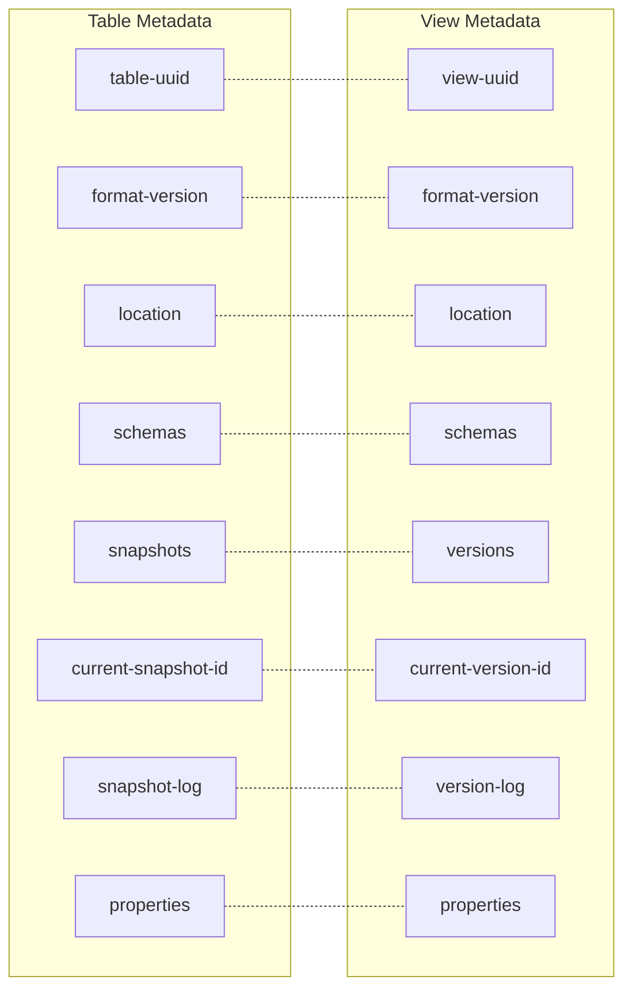
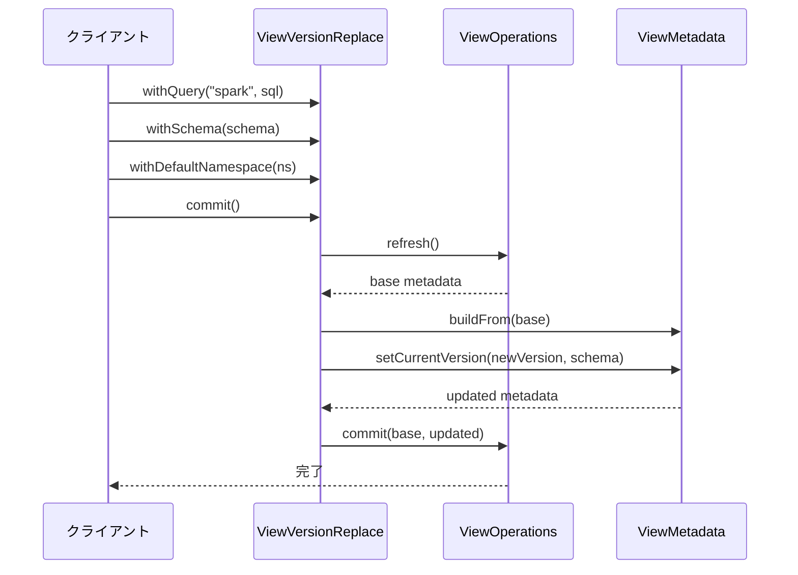

# 第21章 View 仕様

> **本章で読むソース**
>
> - [`api/src/main/java/org/apache/iceberg/view/View.java`](https://github.com/apache/iceberg/blob/apache-iceberg-1.11.0/api/src/main/java/org/apache/iceberg/view/View.java)
> - [`api/src/main/java/org/apache/iceberg/view/ViewVersion.java`](https://github.com/apache/iceberg/blob/apache-iceberg-1.11.0/api/src/main/java/org/apache/iceberg/view/ViewVersion.java)
> - [`core/src/main/java/org/apache/iceberg/view/ViewMetadata.java`](https://github.com/apache/iceberg/blob/apache-iceberg-1.11.0/core/src/main/java/org/apache/iceberg/view/ViewMetadata.java)
> - [`format/view-spec.md`](https://github.com/apache/iceberg/blob/apache-iceberg-1.11.0/format/view-spec.md)

## この章の狙い

Iceberg はテーブルだけでなく、SQL ビューについてもエンジン非依存のメタデータ仕様を定めている。
本章では View 仕様の構造を仕様書と参照実装の両面から読み解き、テーブルメタデータとの構造的な類似性と相違点を理解する。

## 前提

第2章「テーブルメタデータ」で扱ったメタデータファイルの原子的スワップの仕組みを前提とする。
第4章「スキーマ進化」で扱ったスキーマ ID の採番規則も参照する。

## View 仕様が解決する問題

RDBMS では CREATE VIEW でビューを作成できる。
しかしデータレイク環境では、Spark と Trino と Presto がそれぞれ独自の形式でビュー定義を保存するため、あるエンジンで作ったビューを別のエンジンで読むことができない。

Iceberg の View 仕様は、この相互運用性の問題を解決する。
テーブル仕様と同様にメタデータファイルの原子的スワップに基づき、ビュー定義のバージョン管理を標準化した形式で提供する。

仕様書の冒頭に背景が記載されている。

[`format/view-spec.md` L27-L27](https://github.com/apache/iceberg/blob/apache-iceberg-1.11.0/format/view-spec.md#L27-L27)

```markdown
Each compute engine stores the metadata of the view in its proprietary format in the metastore of choice. Thus, views created from one engine can not be read or altered easily from another engine even when engines share the metastore as well as the storage system. This document standardizes the view metadata for ease of sharing the views across engines.
```

## View メタデータの全体構造

View メタデータは JSON ファイルとして永続化される。
テーブルメタデータと同様に、変更のたびに新しいメタデータファイルが生成され、古いファイルをアトミックに置き換える。

仕様が定めるフィールドは以下のとおりである。

| フィールド | 必須 | 説明 |
|---|---|---|
| `view-uuid` | 必須 | ビューを一意に識別する UUID |
| `format-version` | 必須 | フォーマットバージョン(現時点では 1 のみ) |
| `location` | 必須 | メタデータファイルの配置場所を決める基準パス |
| `schemas` | 必須 | ビューが使用するスキーマの一覧 |
| `current-version-id` | 必須 | 現在有効なバージョンの ID |
| `versions` | 必須 | ビューバージョンの一覧 |
| `version-log` | 必須 | `current-version-id` の変更履歴 |
| `properties` | 任意 | ビューのプロパティ(コメントなど) |

テーブルメタデータとの対応関係を図で示す。



テーブルにおけるスナップショットの役割を、ビューではバージョンが担う。
テーブルのスナップショットがデータファイル群への参照を保持するのに対し、ビューのバージョンは SQL テキストとスキーマへの参照を保持する。
この対称性により、カタログの実装はテーブルとビューを同じパターンで管理できる。

## View インタフェース

`View` インタフェースはビューに対する操作の API を定義する。

[`api/src/main/java/org/apache/iceberg/view/View.java` L28-L135](https://github.com/apache/iceberg/blob/apache-iceberg-1.11.0/api/src/main/java/org/apache/iceberg/view/View.java#L28-L135)

```java
public interface View {

  String name();

  Schema schema();

  Map<Integer, Schema> schemas();

  ViewVersion currentVersion();

  Iterable<ViewVersion> versions();

  ViewVersion version(int versionId);

  List<ViewHistoryEntry> history();

  Map<String, String> properties();

  default String location() {
    throw new UnsupportedOperationException("Retrieving a view's location is not supported");
  }

  UpdateViewProperties updateProperties();

  default ReplaceViewVersion replaceVersion() {
    throw new UnsupportedOperationException("Replacing a view's version is not supported");
  }

  // ... (中略) ...

  default SQLViewRepresentation sqlFor(String dialect) {
    throw new UnsupportedOperationException(
        "Resolving a sql with a given dialect is not supported");
  }
}
```

注目すべき点が 3 つある。

第一に、`schema()` と `schemas()` を持ち、テーブルと同じくスキーマの進化に対応している。
ビューの出力列が変わるたびに新しいスキーマが追加され、古いスキーマも保持される。

第二に、`replaceVersion()` がビュー定義の更新手段である。
テーブルの `newAppend()` や `newOverwrite()` に対応するが、ビューではデータ操作ではなく SQL テキストの置き換えが行われる。

第三に、`sqlFor(String dialect)` メソッドにより、エンジンは自分に適した SQL 方言のビュー定義を取得できる。
これがマルチエンジン対応の要となる。

## ViewVersion: ビューのバージョン

**ViewVersion** はある時点でのビュー定義を表す。
テーブルのスナップショットに相当する概念である。

[`api/src/main/java/org/apache/iceberg/view/ViewVersion.java` L32-L57](https://github.com/apache/iceberg/blob/apache-iceberg-1.11.0/api/src/main/java/org/apache/iceberg/view/ViewVersion.java#L32-L57)

```java
public interface ViewVersion {

  /** Return this version's id. Version ids are monotonically increasing */
  int versionId();

  /**
   * Return this version's timestamp.
   *
   * <p>This timestamp is the same as those produced by {@link System#currentTimeMillis()}.
   *
   * @return a long timestamp in milliseconds
   */
  long timestampMillis();

  /**
   * Return the version summary
   *
   * @return a version summary
   */
  Map<String, String> summary();

  /**
   * Return the list of other view representations.
   *
   * <p>May contain SQL view representations for other dialects.
   *
```

「ViewVersion」の各フィールドは仕様書のバージョン定義に対応する。

| フィールド | 型 | 説明 |
|---|---|---|
| `versionId` | `int` | 単調増加するバージョン ID |
| `timestampMillis` | `long` | バージョン作成時のタイムスタンプ |
| `summary` | `Map<String, String>` | エンジン名やバージョンなどのメタ情報 |
| `representations` | `List<ViewRepresentation>` | SQL 定義のリスト(方言ごとに複数可) |
| `schemaId` | `int` | このバージョンの出力スキーマ ID |
| `defaultCatalog` | `String` | SQL 中のカタログ省略時に使用するカタログ |
| `defaultNamespace` | `Namespace` | SQL 中のネームスペース省略時に使用するネームスペース |

`operation()` メソッドは、バージョン ID が 1 なら `"create"`、それ以外なら `"replace"` を返す。
この単純なルールにより、ビューの作成と更新を区別できる。

## ViewRepresentation と SQL 方言

**ViewRepresentation** はビュー定義の表現形式を抽象化するインタフェースである。

[`api/src/main/java/org/apache/iceberg/view/ViewRepresentation.java` L21-L30](https://github.com/apache/iceberg/blob/apache-iceberg-1.11.0/api/src/main/java/org/apache/iceberg/view/ViewRepresentation.java#L21-L30)

```java
public interface ViewRepresentation {

  class Type {
    private Type() {}

    public static final String SQL = "sql";
  }

  String type();
}
```

現時点では `sql` 型のみが定義されている。
仕様の拡張により、将来的に SQL 以外の表現形式を追加できる設計になっている。

**SQLViewRepresentation** は `ViewRepresentation` を拡張し、SQL テキストと方言名を保持する。

[`api/src/main/java/org/apache/iceberg/view/SQLViewRepresentation.java` L22-L34](https://github.com/apache/iceberg/blob/apache-iceberg-1.11.0/api/src/main/java/org/apache/iceberg/view/SQLViewRepresentation.java#L22-L34)

```java
public interface SQLViewRepresentation extends ViewRepresentation {

  @Override
  default String type() {
    return Type.SQL;
  }

  /** The view query SQL text. */
  String sql();

  /** The view query SQL dialect. */
  String dialect();
}
```

1 つの「ViewVersion」は複数の `SQLViewRepresentation` を持てる。
たとえば Spark 方言と Trino 方言の両方で同じビュー定義を格納できる。
ただし、同一方言の SQL は 1 バージョンにつき 1 つだけである。

このマルチ方言対応が View 仕様の中核的な設計判断である。
仕様書の該当箇所を引用する。

[`format/view-spec.md` L115-L115](https://github.com/apache/iceberg/blob/apache-iceberg-1.11.0/format/view-spec.md#L115-L115)

```markdown
A view version can have multiple SQL representations of different dialects, but only one SQL representation per dialect.
```

## ViewMetadata: メタデータの実体

`ViewMetadata` は View メタデータファイルの内容を Java オブジェクトとして表現する。
Immutables ライブラリで不変オブジェクトとして生成される。

[`core/src/main/java/org/apache/iceberg/view/ViewMetadata.java` L47-L85](https://github.com/apache/iceberg/blob/apache-iceberg-1.11.0/core/src/main/java/org/apache/iceberg/view/ViewMetadata.java#L47-L85)

```java
@SuppressWarnings("ImmutablesStyle")
@Value.Immutable(builder = false)
@Value.Style(allParameters = true, visibilityString = "PACKAGE")
public interface ViewMetadata extends Serializable {
  Logger LOG = LoggerFactory.getLogger(ViewMetadata.class);
  int SUPPORTED_VIEW_FORMAT_VERSION = 1;
  int DEFAULT_VIEW_FORMAT_VERSION = 1;

  String uuid();

  int formatVersion();

  String location();

  default Integer currentSchemaId() {
    // fail when accessing the current schema if ViewMetadata was created through the
    // ViewMetadataParser with an invalid schema id
    int currentSchemaId = currentVersion().schemaId();
    Preconditions.checkArgument(
        schemasById().containsKey(currentSchemaId),
        "Cannot find current schema with id %s in schemas: %s",
        currentSchemaId,
        schemasById().keySet());

    return currentSchemaId;
  }

  List<Schema> schemas();

  int currentVersionId();

  List<ViewVersion> versions();

  List<ViewHistoryEntry> history();

  Map<String, String> properties();

  List<MetadataUpdate> changes();

```

テーブルの `TableMetadata` と同じく、UUID、フォーマットバージョン、ロケーション、スキーマ一覧、プロパティを持つ。
テーブルが `snapshots` と `current-snapshot-id` を持つのに対し、ビューは `versions` と `currentVersionId` を持つ。

### 導出フィールドによる高速検索

「ViewMetadata」は `@Value.Derived` アノテーションを使い、リストからマップへの変換を 1 回だけ行う。

[`core/src/main/java/org/apache/iceberg/view/ViewMetadata.java` L105-L123](https://github.com/apache/iceberg/blob/apache-iceberg-1.11.0/core/src/main/java/org/apache/iceberg/view/ViewMetadata.java#L105-L123)

```java
  @Value.Derived
  default Map<Integer, ViewVersion> versionsById() {
    ImmutableMap.Builder<Integer, ViewVersion> builder = ImmutableMap.builder();
    for (ViewVersion version : versions()) {
      builder.put(version.versionId(), version);
    }

    return builder.build();
  }

  @Value.Derived
  default Map<Integer, Schema> schemasById() {
    ImmutableMap.Builder<Integer, Schema> builder = ImmutableMap.builder();
    for (Schema schema : schemas()) {
      builder.put(schema.schemaId(), schema);
    }

    return builder.build();
  }
```

JSON からのデシリアライズ時にはリスト形式で保持し、ID による検索が必要になった時点でマップを構築する。
`@Value.Derived` により、マップは不変オブジェクトの生成時に一度だけ計算され、以後はキャッシュされる。
バージョン数が多い場合でもリニアサーチを避けられる設計である。

## Builder パターンによるメタデータの構築

「ViewMetadata」の `Builder` クラスは、メタデータの段階的な構築と変更追跡を担う。

### 新規構築と既存メタデータからの派生

[`core/src/main/java/org/apache/iceberg/view/ViewMetadata.java` L145-L178](https://github.com/apache/iceberg/blob/apache-iceberg-1.11.0/core/src/main/java/org/apache/iceberg/view/ViewMetadata.java#L145-L178)

```java
  class Builder {
    private static final int INITIAL_SCHEMA_ID = 0;
    private static final int LAST_ADDED = -1;
    private final List<ViewVersion> versions;
    private final List<Schema> schemas;
    private final List<ViewHistoryEntry> history;
    private final Map<String, String> properties;
    private final List<MetadataUpdate> changes;
    private int formatVersion = DEFAULT_VIEW_FORMAT_VERSION;
    private int currentVersionId;
    private String location;
    private String uuid;
    private String metadataLocation;

    // internal change tracking
    private Integer lastAddedVersionId = null;
    private Integer lastAddedSchemaId = null;
    private ViewHistoryEntry historyEntry = null;
    private ViewVersion previousViewVersion = null;

    // indexes
    private final Map<Integer, ViewVersion> versionsById;
    private final Map<Integer, Schema> schemasById;

    private Builder() {
      // ... (中略) ...
    }

    private Builder(ViewMetadata base) {
      this.versions = Lists.newArrayList(base.versions());
      this.versionsById = Maps.newHashMap(base.versionsById());
      this.schemas = Lists.newArrayList(base.schemas());
      this.schemasById = Maps.newHashMap(base.schemasById());
      this.history = Lists.newArrayList(base.history());
      this.properties = Maps.newHashMap(base.properties());
      this.changes = Lists.newArrayList();
      this.formatVersion = base.formatVersion();
      this.currentVersionId = base.currentVersionId();
      this.location = base.location();
      this.uuid = base.uuid();
      this.metadataLocation = null;
      this.previousViewVersion = base.currentVersion();
    }
```

`Builder(ViewMetadata base)` コンストラクタは、既存メタデータのすべてのフィールドをコピーしたうえで `changes` リストを空にする。
これにより、既存メタデータに対する差分だけを `changes` に記録できる。
`previousViewVersion` には現在のバージョンを保存し、後述の方言削除チェックに利用する。

### スキーマの重複排除

スキーマの追加時には、既存のスキーマと内容が同一であれば再利用する。

[`core/src/main/java/org/apache/iceberg/view/ViewMetadata.java` L369-L404](https://github.com/apache/iceberg/blob/apache-iceberg-1.11.0/core/src/main/java/org/apache/iceberg/view/ViewMetadata.java#L369-L404)

```java
    private int addSchemaInternal(Schema schema) {
      int newSchemaId = reuseOrCreateNewSchemaId(schema);
      if (schemasById.containsKey(newSchemaId)) {
        // this schema existed or was already added in the builder
        return newSchemaId;
      }

      Schema newSchema;
      if (newSchemaId != schema.schemaId()) {
        newSchema = new Schema(newSchemaId, schema.columns(), schema.identifierFieldIds());
      } else {
        newSchema = schema;
      }

      schemas.add(newSchema);
      schemasById.put(newSchema.schemaId(), newSchema);
      changes.add(new MetadataUpdate.AddSchema(newSchema));

      this.lastAddedSchemaId = newSchemaId;

      return newSchemaId;
    }

    private int reuseOrCreateNewSchemaId(Schema newSchema) {
      // if the schema already exists, use its id; otherwise use the highest id + 1
      int newSchemaId = INITIAL_SCHEMA_ID;
      for (Schema schema : schemas) {
        if (schema.sameSchema(newSchema)) {
          return schema.schemaId();
        } else if (schema.schemaId() >= newSchemaId) {
          newSchemaId = schema.schemaId() + 1;
        }
      }

      return newSchemaId;
    }
```

`reuseOrCreateNewSchemaId()` は全スキーマを走査し、`sameSchema()` で内容を比較する。
同一スキーマが見つかれば既存の ID を返し、見つからなければ最大 ID + 1 を採番する。
この仕組みにより、ビュー定義を更新しても出力列が変わらなければスキーマが重複して蓄積されない。

テーブルの `TableMetadata.Builder` でもまったく同じパターンが使われている。
仕様全体で ID 採番の方式を統一することで、実装の複雑さを抑えている。

### バージョンの重複排除

バージョンの追加でも同様の重複排除が行われる。

[`core/src/main/java/org/apache/iceberg/view/ViewMetadata.java` L334-L354](https://github.com/apache/iceberg/blob/apache-iceberg-1.11.0/core/src/main/java/org/apache/iceberg/view/ViewMetadata.java#L334-L354)

```java
    private int reuseOrCreateNewViewVersionId(ViewVersion viewVersion) {
      // if the view version already exists, use its id; otherwise use the highest id + 1
      int newVersionId = viewVersion.versionId();
      for (ViewVersion version : versions) {
        if (sameViewVersion(version, viewVersion)) {
          return version.versionId();
        } else if (version.versionId() >= newVersionId) {
          newVersionId = version.versionId() + 1;
        }
      }

      return newVersionId;
    }

    /**
     * Checks whether the given view versions would behave the same while ignoring the view version
     * id, the creation timestamp, and the operation.
     *
     * @param one the view version to compare
     * @param two the view version to compare
     * @return true if the given view versions would behave the same
```

`sameViewVersion()` はバージョン ID、タイムスタンプ、`operation` を比較対象から除外し、意味的に同一かどうかだけを判定する。
同じ SQL を同じスキーマで再登録しても、無駄なバージョンが増えない。

## 設計上の工夫: 方言削除の防止

View 仕様における重要な設計上の工夫は、ビュー更新時に既存の SQL 方言が意図せず削除されることを防ぐガードである。

[`core/src/main/java/org/apache/iceberg/view/ViewMetadata.java` L556-L578](https://github.com/apache/iceberg/blob/apache-iceberg-1.11.0/core/src/main/java/org/apache/iceberg/view/ViewMetadata.java#L556-L578)

```java
    private void checkIfDialectIsDropped(ViewVersion previous, ViewVersion current) {
      Set<String> baseDialects = sqlDialectsFor(previous);
      Set<String> updatedDialects = sqlDialectsFor(current);

      Preconditions.checkState(
          updatedDialects.containsAll(baseDialects),
          "Cannot replace view due to loss of view dialects (%s=false):\nPrevious dialects: %s\nNew dialects: %s",
          ViewProperties.REPLACE_DROP_DIALECT_ALLOWED,
          baseDialects,
          updatedDialects);
    }

    private Set<String> sqlDialectsFor(ViewVersion viewVersion) {
      Set<String> dialects = Sets.newHashSet();
      for (ViewRepresentation repr : viewVersion.representations()) {
        if (repr instanceof SQLViewRepresentation) {
          SQLViewRepresentation sql = (SQLViewRepresentation) repr;
          dialects.add(sql.dialect().toLowerCase(Locale.ROOT));
        }
      }

      return dialects;
    }
```

このチェックは `build()` メソッド内で呼ばれる。
`previousViewVersion`(更新前のバージョン)が持つ方言の集合が、新しいバージョンの方言の集合に含まれることを検証する。

たとえば、Spark 方言と Trino 方言の両方を持つビューを更新するとき、新しいバージョンが Spark 方言だけしか含まなければ、Trino ユーザーはビューを参照できなくなる。
この検証により、マルチエンジン環境でのビューの互換性が保護される。

方言の削除を明示的に許可するには、プロパティ `replace.drop-dialect.allowed` を `true` に設定する。

[`core/src/main/java/org/apache/iceberg/view/ViewProperties.java` L32-L33](https://github.com/apache/iceberg/blob/apache-iceberg-1.11.0/core/src/main/java/org/apache/iceberg/view/ViewProperties.java#L32-L33)

```java
  public static final String REPLACE_DROP_DIALECT_ALLOWED = "replace.drop-dialect.allowed";
  public static final boolean REPLACE_DROP_DIALECT_ALLOWED_DEFAULT = false;
```

デフォルトで `false` であるため、方言の削除は明示的なオプトインを要求する。
安全側に倒した設計である。

## バージョンの有効期限と履歴の管理

「ViewMetadata」の `build()` メソッドは、古いバージョンの自動削除(有効期限切れ)を行う。

[`core/src/main/java/org/apache/iceberg/view/ViewMetadata.java` L461-L497](https://github.com/apache/iceberg/blob/apache-iceberg-1.11.0/core/src/main/java/org/apache/iceberg/view/ViewMetadata.java#L461-L497)

```java
      int historySize =
          PropertyUtil.propertyAsInt(
              properties,
              ViewProperties.VERSION_HISTORY_SIZE,
              ViewProperties.VERSION_HISTORY_SIZE_DEFAULT);

      // ... (中略) ...

      int numVersions =
          ImmutableSet.builder()
              .addAll(
                  changes(MetadataUpdate.AddViewVersion.class)
                      .map(v -> v.viewVersion().versionId())
                      .collect(Collectors.toSet()))
              .add(currentVersionId)
              .build()
              .size();
      int numVersionsToKeep = Math.max(numVersions, historySize);

      List<ViewVersion> retainedVersions;
      List<ViewHistoryEntry> retainedHistory;
      if (versions.size() > numVersionsToKeep) {
        retainedVersions =
            expireVersions(versionsById, numVersionsToKeep, versionsById.get(currentVersionId));
        Set<Integer> retainedVersionIds =
            retainedVersions.stream().map(ViewVersion::versionId).collect(Collectors.toSet());
        retainedHistory = updateHistory(history, retainedVersionIds);
      } else {
        retainedVersions = versions;
        retainedHistory = history;
      }
```

保持するバージョン数は `version.history.num-entries` プロパティで制御され、デフォルトは 10 である。
ただし、今回のビルダーで追加されたバージョンと現在のバージョンは必ず保持される。
これは、コミット直後のメタデータから追加したばかりのバージョンが消えることを防ぐためである。

`expireVersions()` はバージョン ID の降順でソートし、最新のものから優先的に保持する。

[`core/src/main/java/org/apache/iceberg/view/ViewMetadata.java` L513-L535](https://github.com/apache/iceberg/blob/apache-iceberg-1.11.0/core/src/main/java/org/apache/iceberg/view/ViewMetadata.java#L513-L535)

```java
    static List<ViewVersion> expireVersions(
        Map<Integer, ViewVersion> versionsById, int numVersionsToKeep, ViewVersion currentVersion) {
      // version ids are assigned sequentially. keep the latest versions by ID.
      List<Integer> ids = Lists.newArrayList(versionsById.keySet());
      ids.sort(Comparator.reverseOrder());

      List<ViewVersion> retainedVersions = Lists.newArrayList();
      // always retain the current version
      retainedVersions.add(currentVersion);

      for (int idToKeep : ids.subList(0, numVersionsToKeep)) {
        if (retainedVersions.size() == numVersionsToKeep) {
          break;
        }

        ViewVersion version = versionsById.get(idToKeep);
        if (currentVersion.versionId() != version.versionId()) {
          retainedVersions.add(version);
        }
      }

      return retainedVersions;
    }
```

バージョン ID は単調増加するため、ID の降順ソートは時系列の逆順ソートに等しい。
タイムスタンプではなく ID でソートすることで、時刻のずれに影響されない安定した順序が保証される。

## BaseView: 参照実装

`BaseView` は `View` インタフェースの参照実装で、`ViewOperations` を介して「ViewMetadata」にアクセスする。

[`core/src/main/java/org/apache/iceberg/view/BaseView.java` L29-L37](https://github.com/apache/iceberg/blob/apache-iceberg-1.11.0/core/src/main/java/org/apache/iceberg/view/BaseView.java#L29-L37)

```java
public class BaseView implements View, Serializable {

  private final ViewOperations ops;
  private final String name;

  public BaseView(ViewOperations ops, String name) {
    this.ops = ops;
    this.name = name;
  }

  // ... (中略) ...

  @Override
  public Schema schema() {
    return operations().current().schema();
  }

  @Override
  public ViewVersion currentVersion() {
    return operations().current().currentVersion();
  }
```

すべてのメソッドが `operations().current()` を経由して「ViewMetadata」のフィールドを返す。
`ViewOperations.current()` はメタデータのキャッシュを返し、`refresh()` で最新のメタデータファイルを再読み込みする。

`sqlFor()` メソッドの実装は、マルチ方言対応の実際の振る舞いを示している。

[`core/src/main/java/org/apache/iceberg/view/BaseView.java` L113-L130](https://github.com/apache/iceberg/blob/apache-iceberg-1.11.0/core/src/main/java/org/apache/iceberg/view/BaseView.java#L113-L130)

```java
  @Override
  public SQLViewRepresentation sqlFor(String dialect) {
    Preconditions.checkArgument(dialect != null, "Invalid dialect: null");
    Preconditions.checkArgument(!dialect.isEmpty(), "Invalid dialect: (empty string)");
    SQLViewRepresentation closest = null;
    for (ViewRepresentation representation : currentVersion().representations()) {
      if (representation instanceof SQLViewRepresentation) {
        SQLViewRepresentation sqlViewRepresentation = (SQLViewRepresentation) representation;
        if (sqlViewRepresentation.dialect().equalsIgnoreCase(dialect)) {
          return sqlViewRepresentation;
        } else if (closest == null) {
          closest = sqlViewRepresentation;
        }
      }
    }

    return closest;
  }
```

要求された方言と完全一致する SQL 表現があればそれを返す。
一致するものがなければ、最初に見つかった SQL 表現をフォールバックとして返す。
このフォールバック戦略により、未知の方言を持つエンジンでもビューの参照を試みることができる。

## ViewVersionReplace: ビュー更新の流れ

ビュー定義の更新は `ViewVersionReplace` クラスが担う。
ビルダーパターンで SQL テキスト、スキーマ、名前空間を設定し、`commit()` でアトミックに反映する。



`commit()` の実装は、テーブル操作と同じリトライ戦略を使う。

[`core/src/main/java/org/apache/iceberg/view/ViewVersionReplace.java` L88-L104](https://github.com/apache/iceberg/blob/apache-iceberg-1.11.0/core/src/main/java/org/apache/iceberg/view/ViewVersionReplace.java#L88-L104)

```java
  @Override
  public void commit() {
    Tasks.foreach(ops)
        .retry(
            PropertyUtil.propertyAsInt(
                base.properties(), COMMIT_NUM_RETRIES, COMMIT_NUM_RETRIES_DEFAULT))
        .exponentialBackoff(
            PropertyUtil.propertyAsInt(
                base.properties(), COMMIT_MIN_RETRY_WAIT_MS, COMMIT_MIN_RETRY_WAIT_MS_DEFAULT),
            PropertyUtil.propertyAsInt(
                base.properties(), COMMIT_MAX_RETRY_WAIT_MS, COMMIT_MAX_RETRY_WAIT_MS_DEFAULT),
            PropertyUtil.propertyAsInt(
                base.properties(), COMMIT_TOTAL_RETRY_TIME_MS, COMMIT_TOTAL_RETRY_TIME_MS_DEFAULT),
            2.0 /* exponential */)
        .onlyRetryOn(CommitFailedException.class)
        .run(taskOps -> taskOps.commit(base, internalApply()));
  }
```

`CommitFailedException` が発生した場合にのみリトライする。
リトライのたびに `internalApply()` が呼ばれ、最新のメタデータに対して差分を再適用する。
テーブルの楽観的並行制御と同じパターンであり、コミット競合時に変更を失わない仕組みである。

## ViewOperations: メタデータアクセスの SPI

`ViewOperations` はメタデータの読み書きを抽象化する SPI(Service Provider Interface)である。

[`core/src/main/java/org/apache/iceberg/view/ViewOperations.java` L22-L29](https://github.com/apache/iceberg/blob/apache-iceberg-1.11.0/core/src/main/java/org/apache/iceberg/view/ViewOperations.java#L22-L29)

```java
public interface ViewOperations {

  /**
   * Return the currently loaded view metadata, without checking for updates.
   *
   * @return view metadata
   */
  ViewMetadata current();
```

3 つのメソッドだけで構成される最小限の SPI である。
テーブルの `TableOperations` と対称的な設計であり、カタログ実装者は `commit()` にアトミックスワップの保証を実装する。

## ViewProperties: ビューの設定項目

`ViewProperties` クラスはビューの動作を制御するプロパティ定数を定義する。

[`core/src/main/java/org/apache/iceberg/view/ViewProperties.java` L22-L36](https://github.com/apache/iceberg/blob/apache-iceberg-1.11.0/core/src/main/java/org/apache/iceberg/view/ViewProperties.java#L22-L36)

```java
public class ViewProperties {
  public static final String VERSION_HISTORY_SIZE = "version.history.num-entries";
  public static final int VERSION_HISTORY_SIZE_DEFAULT = 10;

  public static final String METADATA_COMPRESSION = "write.metadata.compression-codec";
  public static final String METADATA_COMPRESSION_DEFAULT = "gzip";

  public static final String WRITE_METADATA_LOCATION = "write.metadata.path";

  public static final String COMMENT = "comment";
  public static final String REPLACE_DROP_DIALECT_ALLOWED = "replace.drop-dialect.allowed";
  public static final boolean REPLACE_DROP_DIALECT_ALLOWED_DEFAULT = false;

  private ViewProperties() {}
}
```

| プロパティ | デフォルト | 説明 |
|---|---|---|
| `version.history.num-entries` | 10 | 保持するバージョン数 |
| `write.metadata.compression-codec` | `gzip` | メタデータファイルの圧縮形式 |
| `write.metadata.path` | (なし) | メタデータの書き込み先 |
| `comment` | (なし) | ビューのコメント |
| `replace.drop-dialect.allowed` | `false` | 方言の削除を許可するか |

## View と Table の構造的比較

ここまで読んできた View 仕様を、テーブル仕様と対比して整理する。

| 観点 | Table | View |
|---|---|---|
| メタデータの単位 | `TableMetadata` | `ViewMetadata` |
| 状態の時点管理 | スナップショット(`Snapshot`) | バージョン(`ViewVersion`) |
| データの実体 | データファイル、削除ファイル | SQL テキスト(`ViewRepresentation`) |
| スキーマ管理 | `schemas` + `current-schema-id` | `schemas` + バージョンごとの `schema-id` |
| 変更履歴 | `snapshot-log` | `version-log` |
| 操作の SPI | `TableOperations` | `ViewOperations` |
| コミットの仕組み | メタデータファイルのアトミックスワップ | 同左 |
| リトライ戦略 | 楽観的並行制御 + 指数バックオフ | 同左 |
| 有効期限管理 | スナップショットの expire | バージョンの expire |

View 仕様はテーブル仕様のサブセットとして設計されている。
パーティション、ソート順序、マニフェストファイルなどデータ管理に固有の概念は持たないが、メタデータの管理パターンは共通である。
この設計により、カタログ実装がテーブルとビューを同じ基盤で扱える。

## まとめ

- Iceberg の View 仕様は、SQL ビュー定義のエンジン非依存なバージョン管理を標準化する
- 「ViewVersion」がビューの時点状態を表し、テーブルのスナップショットに対応する
- 1 つのバージョンが複数の SQL 方言を保持でき、マルチエンジン環境での相互運用を実現する
- 方言削除の防止チェックにより、あるエンジンの更新操作が他エンジンのビュー参照を壊すことを防ぐ
- スキーマとバージョンの重複排除により、不要なメタデータの蓄積を抑える
- メタデータのアトミックスワップ、楽観的並行制御、バージョンの有効期限管理など、テーブルと共通の設計パターンを採用している

## 関連する章

- [第2章 テーブルメタデータ](../part00-overview/02-table-metadata.md)
- [第4章 スキーマ進化](../part01-type-and-schema/04-schema-evolution.md)
