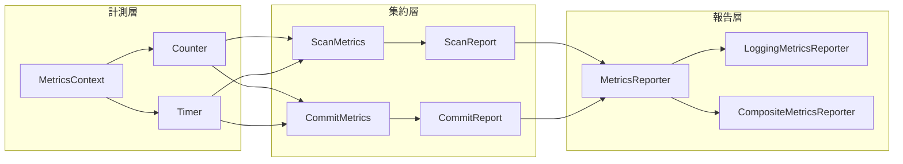
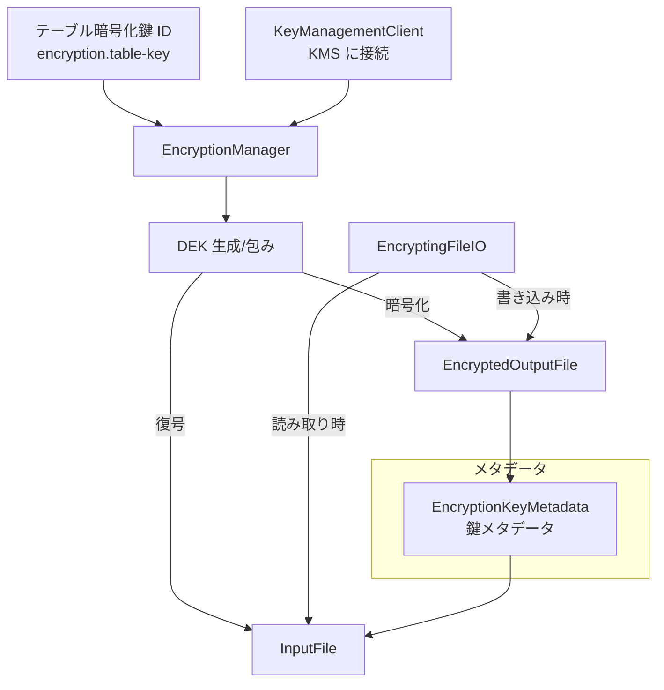

# 第22章 メトリクス、イベント、暗号化

> **本章で読むソース**
>
> - [`api/src/main/java/org/apache/iceberg/metrics/MetricsReport.java`](https://github.com/apache/iceberg/blob/apache-iceberg-1.11.0/api/src/main/java/org/apache/iceberg/metrics/MetricsReport.java)
> - [`api/src/main/java/org/apache/iceberg/metrics/MetricsReporter.java`](https://github.com/apache/iceberg/blob/apache-iceberg-1.11.0/api/src/main/java/org/apache/iceberg/metrics/MetricsReporter.java)
> - [`core/src/main/java/org/apache/iceberg/metrics/ScanReport.java`](https://github.com/apache/iceberg/blob/apache-iceberg-1.11.0/core/src/main/java/org/apache/iceberg/metrics/ScanReport.java)
> - [`core/src/main/java/org/apache/iceberg/metrics/CommitReport.java`](https://github.com/apache/iceberg/blob/apache-iceberg-1.11.0/core/src/main/java/org/apache/iceberg/metrics/CommitReport.java)
> - [`core/src/main/java/org/apache/iceberg/metrics/ScanMetrics.java`](https://github.com/apache/iceberg/blob/apache-iceberg-1.11.0/core/src/main/java/org/apache/iceberg/metrics/ScanMetrics.java)
> - [`core/src/main/java/org/apache/iceberg/metrics/MetricsReporters.java`](https://github.com/apache/iceberg/blob/apache-iceberg-1.11.0/core/src/main/java/org/apache/iceberg/metrics/MetricsReporters.java)
> - [`api/src/main/java/org/apache/iceberg/events/Listeners.java`](https://github.com/apache/iceberg/blob/apache-iceberg-1.11.0/api/src/main/java/org/apache/iceberg/events/Listeners.java)
> - [`api/src/main/java/org/apache/iceberg/events/Listener.java`](https://github.com/apache/iceberg/blob/apache-iceberg-1.11.0/api/src/main/java/org/apache/iceberg/events/Listener.java)
> - [`api/src/main/java/org/apache/iceberg/encryption/EncryptionManager.java`](https://github.com/apache/iceberg/blob/apache-iceberg-1.11.0/api/src/main/java/org/apache/iceberg/encryption/EncryptionManager.java)
> - [`api/src/main/java/org/apache/iceberg/encryption/EncryptingFileIO.java`](https://github.com/apache/iceberg/blob/apache-iceberg-1.11.0/api/src/main/java/org/apache/iceberg/encryption/EncryptingFileIO.java)
> - [`core/src/main/java/org/apache/iceberg/encryption/EncryptionUtil.java`](https://github.com/apache/iceberg/blob/apache-iceberg-1.11.0/core/src/main/java/org/apache/iceberg/encryption/EncryptionUtil.java)

## この章の狙い

Iceberg の操作可観測性を支える 2 つの仕組み、すなわちメトリクス報告とイベント通知を読み解く。
さらにフォーマットバージョン 3 で正式導入されたテーブル暗号化の設計を、鍵管理クライアントからファイル入出力の透過的な暗号化層まで追う。
3 つのサブシステムはいずれもプラグイン可能なインタフェースを軸に設計されており、実装を差し替えるだけでさまざまな運用環境に適合できる。

## 前提

第10章でスナップショット生成の流れ（`SnapshotProducer` のリトライループとコミット）を把握していること。
スキャン計画の基本的な流れ（マニフェストの走査、述語プッシュダウン）を知っていること。
FileIO がファイルの読み書きを抽象化する層であることを理解していること。

## メトリクス報告の全体像

Iceberg のメトリクス報告は 3 層で構成される。

1. **MetricsContext** と、そこから生成される Counter や Timer がスキャンやコミットの各工程で値を記録する
2. 操作完了時に **ScanReport** や **CommitReport** として結果をまとめる
3. **MetricsReporter** に渡して外部へ送出する



## MetricsReport: 空のマーカーインタフェース

**MetricsReport** はメトリクス報告の型階層の頂点に位置するマーカーインタフェースである。

[`api/src/main/java/org/apache/iceberg/metrics/MetricsReport.java` L21-L21](https://github.com/apache/iceberg/blob/apache-iceberg-1.11.0/api/src/main/java/org/apache/iceberg/metrics/MetricsReport.java#L21-L21)

```java
public interface MetricsReport {}
```

メソッドは一つもない。
「ScanReport」と「CommitReport」という 2 つの具象型を型安全に受け渡すための共通親型として機能する。

## MetricsReporter: プラグイン可能な報告先

**MetricsReporter** は `MetricsReport` を受け取って外部へ送出するインタフェースである。

[`api/src/main/java/org/apache/iceberg/metrics/MetricsReporter.java` L25-L34](https://github.com/apache/iceberg/blob/apache-iceberg-1.11.0/api/src/main/java/org/apache/iceberg/metrics/MetricsReporter.java#L25-L34)

```java
@FunctionalInterface
public interface MetricsReporter extends Closeable {

  /**
   * A custom MetricsReporter implementation must have a no-arg constructor, which will be called
   * first. {@link MetricsReporter#initialize(Map properties)} is called to complete the
   * initialization.
   *
   * @param properties properties
   */
```

`@FunctionalInterface` として定義されているため、ラムダ式だけで実装を渡すこともできる。
`initialize` メソッドでカタログのプロパティを受け取る設計になっており、接続先 URL や認証情報を実行時に注入できる。

参照実装の **LoggingMetricsReporter** は SLF4J のログへ出力するだけの実装である。

[`api/src/main/java/org/apache/iceberg/metrics/LoggingMetricsReporter.java` L28-L40](https://github.com/apache/iceberg/blob/apache-iceberg-1.11.0/api/src/main/java/org/apache/iceberg/metrics/LoggingMetricsReporter.java#L28-L40)

```java
public class LoggingMetricsReporter implements MetricsReporter {
  private static final Logger LOG = LoggerFactory.getLogger(LoggingMetricsReporter.class);
  private static final LoggingMetricsReporter INSTANCE = new LoggingMetricsReporter();

  public static LoggingMetricsReporter instance() {
    return INSTANCE;
  }

  @Override
  public void report(MetricsReport report) {
    LOG.info("Received metrics report: {}", report);
  }
}
```

シングルトンパターンを採用しており、`instance()` で取得する。

## MetricsReporters: 複数レポーターの合成

複数の「MetricsReporter」を組み合わせたい場合は **MetricsReporters** ユーティリティを使う。
`combine` メソッドは 2 つのレポーターを `CompositeMetricsReporter` にまとめる。

[`core/src/main/java/org/apache/iceberg/metrics/MetricsReporters.java` L34-L56](https://github.com/apache/iceberg/blob/apache-iceberg-1.11.0/core/src/main/java/org/apache/iceberg/metrics/MetricsReporters.java#L34-L56)

```java
  public static MetricsReporter combine(MetricsReporter first, MetricsReporter second) {
    if (null == first) {
      return second;
    } else if (null == second || first == second) {
      return first;
    }

    Set<MetricsReporter> reporters = Sets.newIdentityHashSet();

    if (first instanceof CompositeMetricsReporter) {
      reporters.addAll(((CompositeMetricsReporter) first).reporters());
    } else {
      reporters.add(first);
    }

    if (second instanceof CompositeMetricsReporter) {
      reporters.addAll(((CompositeMetricsReporter) second).reporters());
    } else {
      reporters.add(second);
    }

    return new CompositeMetricsReporter(reporters);
  }
```

設計上の工夫は、`CompositeMetricsReporter` を受け取った場合に中身をフラットに展開する点にある。
この展開によって `combine` を繰り返しても入れ子にならず、報告時のイテレーション回数が増えない。
`IdentityHashSet` を使うことで、同じインスタンスが重複登録されることも防いでいる。

`CompositeMetricsReporter` の `report` メソッドは各レポーターを順に呼び出し、1 つが例外を投げても残りへの配信を止めない。

[`core/src/main/java/org/apache/iceberg/metrics/MetricsReporters.java` L66-L79](https://github.com/apache/iceberg/blob/apache-iceberg-1.11.0/core/src/main/java/org/apache/iceberg/metrics/MetricsReporters.java#L66-L79)

```java
    @Override
    public void report(MetricsReport report) {
      for (MetricsReporter reporter : reporters) {
        try {
          reporter.report(report);
        } catch (Exception e) {
          LOG.warn(
              "Could not report {} to {}",
              report.getClass().getName(),
              reporter.getClass().getName(),
              e);
        }
      }
    }
```

## MetricsContext と計測プリミティブ

**MetricsContext** は Counter や Timer のファクトリとして機能する。

[`api/src/main/java/org/apache/iceberg/metrics/MetricsContext.java` L127-L137](https://github.com/apache/iceberg/blob/apache-iceberg-1.11.0/api/src/main/java/org/apache/iceberg/metrics/MetricsContext.java#L127-L137)

```java
  default org.apache.iceberg.metrics.Counter counter(String name, Unit unit) {
    throw new UnsupportedOperationException("Counter is not supported.");
  }

  /**
   * Get a named counter using {@link Unit#COUNT}
   *
   * @param name The name of the counter
   * @return a {@link org.apache.iceberg.metrics.Counter} implementation
   */
  default org.apache.iceberg.metrics.Counter counter(String name) {
```

デフォルト実装はすべて `UnsupportedOperationException` を投げる。
これは `MetricsContext` が他のモジュール（Spark 連携など）で独自実装されることを想定した設計であり、メトリクスを収集しない場合は `nullMetrics()` が NOOP 実装を返す。

**DefaultCounter** の実装は `LongAdder` を内部に持つ。

[`api/src/main/java/org/apache/iceberg/metrics/DefaultCounter.java` L48-L57](https://github.com/apache/iceberg/blob/apache-iceberg-1.11.0/api/src/main/java/org/apache/iceberg/metrics/DefaultCounter.java#L48-L57)

```java
  private final LongAdder counter;
  private final MetricsContext.Unit unit;
  // ...(中略)...
  DefaultCounter(MetricsContext.Unit unit) {
    Preconditions.checkArgument(null != unit, "Invalid count unit: null");
    this.unit = unit;
    this.counter = new LongAdder();
  }
```

`AtomicLong` ではなく `LongAdder` を使っている点が設計上の工夫である。
`LongAdder` は内部でセルごとのカウンタを持ち、高競合時にスレッド間の CAS リトライを削減する。
スキャン中に複数スレッドから同時にカウンタをインクリメントしても性能劣化しにくい。

## ScanMetrics: スキャン計測の集約

**ScanMetrics** はスキャン操作に関する計測項目を集約する Immutables ベースの抽象クラスである。

[`core/src/main/java/org/apache/iceberg/metrics/ScanMetrics.java` L25-L43](https://github.com/apache/iceberg/blob/apache-iceberg-1.11.0/core/src/main/java/org/apache/iceberg/metrics/ScanMetrics.java#L25-L43)

```java
@Value.Immutable
public abstract class ScanMetrics {
  public static final String TOTAL_PLANNING_DURATION = "total-planning-duration";
  public static final String RESULT_DATA_FILES = "result-data-files";
  public static final String RESULT_DELETE_FILES = "result-delete-files";
  public static final String SCANNED_DATA_MANIFESTS = "scanned-data-manifests";
  public static final String SCANNED_DELETE_MANIFESTS = "scanned-delete-manifests";
  public static final String TOTAL_DATA_MANIFESTS = "total-data-manifests";
  public static final String TOTAL_DELETE_MANIFESTS = "total-delete-manifests";
  public static final String TOTAL_FILE_SIZE_IN_BYTES = "total-file-size-in-bytes";
  public static final String TOTAL_DELETE_FILE_SIZE_IN_BYTES = "total-delete-file-size-in-bytes";
  public static final String SKIPPED_DATA_MANIFESTS = "skipped-data-manifests";
  public static final String SKIPPED_DELETE_MANIFESTS = "skipped-delete-manifests";
  public static final String SKIPPED_DATA_FILES = "skipped-data-files";
  public static final String SKIPPED_DELETE_FILES = "skipped-delete-files";
  public static final String INDEXED_DELETE_FILES = "indexed-delete-files";
  public static final String EQUALITY_DELETE_FILES = "equality-delete-files";
  public static final String POSITIONAL_DELETE_FILES = "positional-delete-files";
  public static final String DVS = "dvs";
```

各メトリクスの名前は文字列定数として定義されている。
これらの定数が JSON シリアライズ時のキー名としても使われるため、定数を変更すれば互換性が崩れる。
文字列定数を API 層の一部として管理する設計である。

各フィールドは `@Value.Derived` アノテーションにより、`metricsContext()` から遅延生成される。

[`core/src/main/java/org/apache/iceberg/metrics/ScanMetrics.java` L51-L59](https://github.com/apache/iceberg/blob/apache-iceberg-1.11.0/core/src/main/java/org/apache/iceberg/metrics/ScanMetrics.java#L51-L59)

```java
  @Value.Derived
  public Timer totalPlanningDuration() {
    return metricsContext().timer(TOTAL_PLANNING_DURATION, TimeUnit.NANOSECONDS);
  }

  @Value.Derived
  public Counter resultDataFiles() {
    return metricsContext().counter(RESULT_DATA_FILES);
  }
```

17 個のメトリクス名が定義されているが、すべてを個別に生成するのではなく `MetricsContext` のファクトリメソッドに委譲している。
メトリクス実装を差し替えたい場合は `MetricsContext` だけを入れ替えればよい。

## ScanReport: スキャン結果の報告

**ScanReport** は `MetricsReport` を継承し、スキャン操作の結果をまとめる。

[`core/src/main/java/org/apache/iceberg/metrics/ScanReport.java` L27-L45](https://github.com/apache/iceberg/blob/apache-iceberg-1.11.0/core/src/main/java/org/apache/iceberg/metrics/ScanReport.java#L27-L45)

```java
@Value.Immutable
public interface ScanReport extends MetricsReport {

  String tableName();

  long snapshotId();

  Expression filter();

  int schemaId();

  List<Integer> projectedFieldIds();

  List<String> projectedFieldNames();

  ScanMetricsResult scanMetrics();

  Map<String, String> metadata();
}
```

「ScanReport」は「どのテーブルの、どのスナップショットに対して、どんなフィルタとプロジェクションで、どれだけのマニフェストとファイルを処理したか」を 1 つの値オブジェクトに凝縮する。
`filter()` にはサニタイズ済みの式が格納される。
リテラル値を除去することで、メトリクスログにユーザデータが漏れることを防いでいる。

スキャン完了時の報告は `SnapshotScan#planFiles` のコールバック内で行われる。

[`core/src/main/java/org/apache/iceberg/SnapshotScan.java` L159-L181](https://github.com/apache/iceberg/blob/apache-iceberg-1.11.0/core/src/main/java/org/apache/iceberg/SnapshotScan.java#L159-L181)

```java
    Timer.Timed planningDuration = scanMetrics().totalPlanningDuration().start();

    return CloseableIterable.whenComplete(
        doPlanFiles(),
        () -> {
          planningDuration.stop();
          Map<String, String> metadata = Maps.newHashMap(context().options());
          metadata.putAll(EnvironmentContext.get());
          ScanReport scanReport =
              ImmutableScanReport.builder()
                  .schemaId(schema().schemaId())
                  .projectedFieldIds(projectedFieldIds)
                  .projectedFieldNames(projectedFieldNames)
                  .tableName(table().name())
                  .snapshotId(snapshot.snapshotId())
                  .filter(
                      ExpressionUtil.sanitize(
                          schema().asStruct(), filter(), context().caseSensitive()))
                  .scanMetrics(ScanMetricsResult.fromScanMetrics(scanMetrics()))
                  .metadata(metadata)
                  .build();
          context().metricsReporter().report(scanReport);
        });
```

`CloseableIterable.whenComplete` は、結果のイテレーション完了時にコールバックを実行する仕組みである。
スキャン計画の結果がすべて消費された時点でタイマーを止め、「ScanReport」を組み立てて報告する。
`ScanMetricsResult.fromScanMetrics` でミュータブルな「ScanMetrics」からイミュータブルな結果オブジェクトへ変換している。

## CommitReport: コミット結果の報告

**CommitReport** はコミット操作の結果をまとめる。

[`core/src/main/java/org/apache/iceberg/metrics/CommitReport.java` L25-L39](https://github.com/apache/iceberg/blob/apache-iceberg-1.11.0/core/src/main/java/org/apache/iceberg/metrics/CommitReport.java#L25-L39)

```java
@Value.Immutable
public interface CommitReport extends MetricsReport {

  String tableName();

  long snapshotId();

  long sequenceNumber();

  String operation();

  CommitMetricsResult commitMetrics();

  Map<String, String> metadata();
}
```

「CommitReport」には操作種別（`append`, `overwrite` など）とシーケンス番号が含まれる。
コミットのメトリクス結果は **CommitMetricsResult** に格納され、追加/削除されたデータファイル数、レコード数、ファイルサイズなど 28 種類のカウンタを持つ。

コミット完了時の報告は `SnapshotProducer#notifyListeners` で行われる。

[`core/src/main/java/org/apache/iceberg/SnapshotProducer.java` L552-L576](https://github.com/apache/iceberg/blob/apache-iceberg-1.11.0/core/src/main/java/org/apache/iceberg/SnapshotProducer.java#L552-L576)

```java
  private void notifyListeners() {
    try {
      Object event = updateEvent();
      if (event != null) {
        Listeners.notifyAll(event);

        if (event instanceof CreateSnapshotEvent) {
          CreateSnapshotEvent createSnapshotEvent = (CreateSnapshotEvent) event;

          reporter.report(
              ImmutableCommitReport.builder()
                  .tableName(createSnapshotEvent.tableName())
                  .snapshotId(createSnapshotEvent.snapshotId())
                  .operation(createSnapshotEvent.operation())
                  .sequenceNumber(createSnapshotEvent.sequenceNumber())
                  .metadata(EnvironmentContext.get())
                  .commitMetrics(
                      CommitMetricsResult.from(commitMetrics(), createSnapshotEvent.summary()))
                  .build());
        }
      }
    } catch (RuntimeException e) {
      LOG.warn("Failed to notify listeners", e);
    }
  }
```

ここでメトリクス報告とイベント通知の 2 つの仕組みが交差している。
まずイベントバス（`Listeners.notifyAll`）でイベントを配信し、次に「MetricsReporter」へ「CommitReport」を報告する。
例外はキャッチしてログに記録するだけであり、メトリクス報告の失敗がコミット自体を巻き戻すことはない。

## CommitMetricsResult: スナップショットサマリーからの変換

**CommitMetricsResult** は `CommitMetrics`（タイマーとリトライ回数）とスナップショットサマリー（追加/削除ファイル数など）の両方からカウンタ値を構築する。

[`core/src/main/java/org/apache/iceberg/metrics/CommitMetricsResult.java` L168-L216](https://github.com/apache/iceberg/blob/apache-iceberg-1.11.0/core/src/main/java/org/apache/iceberg/metrics/CommitMetricsResult.java#L168-L216)

```java
  static CommitMetricsResult from(
      CommitMetrics commitMetrics, Map<String, String> snapshotSummary) {
    Preconditions.checkArgument(null != commitMetrics, "Invalid commit metrics: null");
    Preconditions.checkArgument(null != snapshotSummary, "Invalid snapshot summary: null");
    return ImmutableCommitMetricsResult.builder()
        .attempts(CounterResult.fromCounter(commitMetrics.attempts()))
        .totalDuration(TimerResult.fromTimer(commitMetrics.totalDuration()))
        .addedDataFiles(counterFrom(snapshotSummary, SnapshotSummary.ADDED_FILES_PROP))
        .removedDataFiles(counterFrom(snapshotSummary, SnapshotSummary.DELETED_FILES_PROP))
        // ... (中略) ...
        .manifestsCreated(counterFrom(snapshotSummary, SnapshotSummary.CREATED_MANIFESTS_COUNT))
        .manifestsReplaced(counterFrom(snapshotSummary, SnapshotSummary.REPLACED_MANIFESTS_COUNT))
        .manifestsKept(counterFrom(snapshotSummary, SnapshotSummary.KEPT_MANIFESTS_COUNT))
        .manifestEntriesProcessed(
            counterFrom(snapshotSummary, SnapshotSummary.PROCESSED_MANIFEST_ENTRY_COUNT))
        .build();
  }
```

スナップショットサマリーは `Map<String, String>` であり、各値を `Long.parseLong` で変換して `CounterResult` に詰め替える。
スナップショットサマリーは既にコミット済みのメタデータに記録されている情報であるため、二重計測を避けつつ既存データを再利用する設計になっている。

## Listeners: 型ベースのイベントバス

**Listeners** クラスはグローバルなイベントバスを提供する。

[`api/src/main/java/org/apache/iceberg/events/Listeners.java` L28-L51](https://github.com/apache/iceberg/blob/apache-iceberg-1.11.0/api/src/main/java/org/apache/iceberg/events/Listeners.java#L28-L51)

```java
public class Listeners {
  private Listeners() {}

  private static final Map<Class<?>, Queue<Listener<?>>> LISTENERS = Maps.newConcurrentMap();

  public static <E> void register(Listener<E> listener, Class<E> eventType) {
    Queue<Listener<?>> list =
        LISTENERS.computeIfAbsent(eventType, k -> new ConcurrentLinkedQueue<>());
    list.add(listener);
  }

  @SuppressWarnings("unchecked")
  public static <E> void notifyAll(E event) {
    Preconditions.checkNotNull(event, "Cannot notify listeners for a null event.");

    Queue<Listener<?>> list = LISTENERS.get(event.getClass());
    if (list != null) {
      for (Listener<?> value : list) {
        Listener<E> listener = (Listener<E>) value;
        listener.notify(event);
      }
    }
  }
}
```

設計上の工夫は、イベントクラスの `Class` オブジェクトをキーにしたディスパッチである。
`register` でリスナーを登録する際にイベント型を明示し、`notifyAll` では `event.getClass()` でキーを引く。
この仕組みにより、継承階層を走査せず O(1) のルックアップでリスナー群を取得できる。

内部の `ConcurrentLinkedQueue` はロックフリーなキュー実装であり、登録と通知が異なるスレッドから同時に行われても安全に動作する。
外側の `ConcurrentHashMap`（`Maps.newConcurrentMap`）と合わせて、ロックを一切取らずにスレッド安全性を実現している。

**Listener** インタフェースは 1 メソッドのみである。

[`api/src/main/java/org/apache/iceberg/events/Listener.java` L22-L24](https://github.com/apache/iceberg/blob/apache-iceberg-1.11.0/api/src/main/java/org/apache/iceberg/events/Listener.java#L22-L24)

```java
public interface Listener<E> {
  void notify(E event);
}
```

## イベントの種類

Iceberg が定義するイベントは 3 種類である。

**ScanEvent** はテーブルスキャンの計画時に発火する。

[`api/src/main/java/org/apache/iceberg/events/ScanEvent.java` L25-L53](https://github.com/apache/iceberg/blob/apache-iceberg-1.11.0/api/src/main/java/org/apache/iceberg/events/ScanEvent.java#L25-L53)

```java
public final class ScanEvent {
  private final String tableName;
  private final long snapshotId;
  private final Expression filter;
  private final Schema projection;

  public ScanEvent(String tableName, long snapshotId, Expression filter, Schema projection) {
    this.tableName = tableName;
    this.snapshotId = snapshotId;
    this.filter = filter;
    this.projection = projection;
  }
  // ... (中略) ...
}
```

**IncrementalScanEvent** はインクリメンタルスキャン（差分スキャン）の計画時に発火する。
`fromSnapshotId` と `toSnapshotId` で差分の範囲を示す。

[`api/src/main/java/org/apache/iceberg/events/IncrementalScanEvent.java` L25-L46](https://github.com/apache/iceberg/blob/apache-iceberg-1.11.0/api/src/main/java/org/apache/iceberg/events/IncrementalScanEvent.java#L25-L46)

```java
public final class IncrementalScanEvent {
  private final String tableName;
  private final long fromSnapshotId;
  private final long toSnapshotId;
  private final Expression filter;
  private final Schema projection;
  private final boolean fromSnapshotInclusive;

  public IncrementalScanEvent(
      String tableName,
      long fromSnapshotId,
      long toSnapshotId,
      Expression filter,
      Schema projection,
      boolean fromSnapshotInclusive) {
    this.tableName = tableName;
    this.fromSnapshotId = fromSnapshotId;
    this.toSnapshotId = toSnapshotId;
    this.filter = filter;
    this.projection = projection;
    this.fromSnapshotInclusive = fromSnapshotInclusive;
  }
```

**CreateSnapshotEvent** はスナップショット生成の完了時に発火する。

[`core/src/main/java/org/apache/iceberg/events/CreateSnapshotEvent.java` L23-L62](https://github.com/apache/iceberg/blob/apache-iceberg-1.11.0/core/src/main/java/org/apache/iceberg/events/CreateSnapshotEvent.java#L23-L62)

```java
public final class CreateSnapshotEvent {
  private final String tableName;
  private final String operation;
  private final long snapshotId;
  private final long sequenceNumber;
  private final Map<String, String> summary;

  public CreateSnapshotEvent(
      String tableName,
      String operation,
      long snapshotId,
      long sequenceNumber,
      Map<String, String> summary) {
    this.tableName = tableName;
    this.operation = operation;
    this.snapshotId = snapshotId;
    this.sequenceNumber = sequenceNumber;
    this.summary = summary;
  }
  // ... (中略) ...
}
```

3 つのイベントはいずれも `final` クラスであり、継承は許されない。
イベントの型がそのままディスパッチキーになるため、サブクラスを作ると `Listeners` のルックアップが意図通りに動かなくなる。
`final` にすることでこの問題を設計レベルで封じている。

## メトリクスとイベントの使い分け

メトリクス報告（MetricsReporter）とイベント通知（Listeners）は似た仕組みに見えるが、役割が異なる。

| 特性 | MetricsReporter | Listeners |
|------|----------------|-----------|
| 登録単位 | テーブルごと（カタログが注入） | グローバル（JVM 全体） |
| 通知タイミング | 操作完了後 | 操作の計画時/完了時 |
| ペイロード | 構造化された計測値 | 操作のコンテキスト情報 |
| 用途 | 可観測性、ダッシュボード | 監査ログ、CDC |
| 解除 | close() で解放 | 解除 API なし |

「Listeners」はリスナーの解除 API を持たないため、JVM のライフサイクルと結びついた用途に向いている。
一方「MetricsReporter」はカタログが生成と破棄を管理するため、テーブルのライフサイクルに追従できる。

## 暗号化の設計

Iceberg 仕様のフォーマットバージョン 3 では、テーブル暗号化が導入された。
暗号化はエンベロープ暗号化の構成を取る。
テーブルプロパティ `encryption.table-key` でマスター鍵の ID を指定し、各ファイルはファイル固有の DEK（Data Encryption Key）で暗号化される。
DEK はマスター鍵で包んで（wrap して）メタデータに記録する。



## EncryptionManager: 暗号化/復号の抽象

**EncryptionManager** はファイル単位の暗号化と復号を抽象化するインタフェースである。

[`api/src/main/java/org/apache/iceberg/encryption/EncryptionManager.java` L32-L45](https://github.com/apache/iceberg/blob/apache-iceberg-1.11.0/api/src/main/java/org/apache/iceberg/encryption/EncryptionManager.java#L32-L45)

```java
public interface EncryptionManager extends Serializable {

  /**
   * Given an {@link EncryptedInputFile#encryptedInputFile()} representing the raw encrypted bytes
   * from the underlying file system, and given metadata about how the file was encrypted via {@link
   * EncryptedInputFile#keyMetadata()}, return an {@link InputFile} that returns decrypted input
   * streams.
   */
  InputFile decrypt(EncryptedInputFile encrypted);

  /**
   * Variant of {@link #decrypt(EncryptedInputFile)} that provides a sequence of files that all need
   * to be decrypted in a single context.
   *
```

`Serializable` を実装する理由は、Spark のようなエンジンがワーカーノードへインスタンスを転送する必要があるためである。

`decrypt` のバッチ版と `encrypt` のバッチ版は `default` メソッドとして 1 件ずつの処理に委譲する。
実装クラスはこれをオーバーライドして、鍵の一括取得（KMS への一括リクエスト）に最適化できる。
この設計により、単純な実装とバッチ最適化の両立を 1 つのインタフェースで実現している。

## EncryptionKeyMetadata: 鍵メタデータの型付きラッパー

**EncryptionKeyMetadata** は暗号化鍵に関するメタデータのバイト列を型付きで保持する。

[`api/src/main/java/org/apache/iceberg/encryption/EncryptionKeyMetadata.java` L29-L51](https://github.com/apache/iceberg/blob/apache-iceberg-1.11.0/api/src/main/java/org/apache/iceberg/encryption/EncryptionKeyMetadata.java#L29-L51)

```java
public interface EncryptionKeyMetadata {

  EncryptionKeyMetadata EMPTY =
      new EncryptionKeyMetadata() {
        @Override
        public ByteBuffer buffer() {
          return null;
        }

        @Override
        public EncryptionKeyMetadata copy() {
          return this;
        }
      };

  static EncryptionKeyMetadata empty() {
    return EMPTY;
  }

  /** Opaque blob representing metadata about a file's encryption key. */
  ByteBuffer buffer();

  EncryptionKeyMetadata copy();
```

`ByteBuffer` を直接渡す代わりに専用の型で包むことで、暗号化鍵メタデータと他の `ByteBuffer` を取り違えることを防ぐ。
`EMPTY` シングルトンは非暗号化テーブルで使われる。
`buffer()` が `null` を返すことで「暗号化されていない」ことを表す。

## PlaintextEncryptionManager: 非暗号化テーブルのデフォルト

暗号化が無効なテーブルでは **PlaintextEncryptionManager** が使われる。

[`core/src/main/java/org/apache/iceberg/encryption/PlaintextEncryptionManager.java` L26-L48](https://github.com/apache/iceberg/blob/apache-iceberg-1.11.0/core/src/main/java/org/apache/iceberg/encryption/PlaintextEncryptionManager.java#L26-L48)

```java
public class PlaintextEncryptionManager implements EncryptionManager {
  private static final EncryptionManager INSTANCE = new PlaintextEncryptionManager();
  private static final Logger LOG = LoggerFactory.getLogger(PlaintextEncryptionManager.class);

  private PlaintextEncryptionManager() {}

  public static EncryptionManager instance() {
    return INSTANCE;
  }

  @Override
  public InputFile decrypt(EncryptedInputFile encrypted) {
    if (encrypted.keyMetadata().buffer() != null) {
      LOG.warn("File encryption key metadata is present, but no encryption has been configured.");
    }
    return encrypted.encryptedInputFile();
  }

  @Override
  public EncryptedOutputFile encrypt(OutputFile rawOutput) {
    return EncryptedFiles.encryptedOutput(rawOutput, EncryptionKeyMetadata.empty());
  }
}
```

`decrypt` は暗号化バイト列をそのまま返す。
鍵メタデータが存在するのに暗号化が未設定の場合は警告ログを出す。
`encrypt` は生の出力ファイルに空のキーメタデータを付けて返すだけである。

## EncryptingFileIO: 暗号化を透過的に組み込む FileIO

**EncryptingFileIO** は通常の FileIO と「EncryptionManager」を組み合わせ、暗号化を透過的に処理するラッパーである。

[`api/src/main/java/org/apache/iceberg/encryption/EncryptingFileIO.java` L40-L64](https://github.com/apache/iceberg/blob/apache-iceberg-1.11.0/api/src/main/java/org/apache/iceberg/encryption/EncryptingFileIO.java#L40-L64)

```java
public class EncryptingFileIO implements FileIO, Serializable {
  public static EncryptingFileIO combine(FileIO io, EncryptionManager em) {
    if (io instanceof EncryptingFileIO) {
      EncryptingFileIO encryptingIO = (EncryptingFileIO) io;
      if (encryptingIO.em == em) {
        return encryptingIO;
      }

      return combine(encryptingIO.io, em);
    }

    if (io instanceof SupportsPrefixOperations) {
      return new WithSupportsPrefixOperations((SupportsPrefixOperations) io, em);
    } else {
      return new EncryptingFileIO(io, em);
    }
  }

  private final FileIO io;
  private final EncryptionManager em;

  EncryptingFileIO(FileIO io, EncryptionManager em) {
    this.io = io;
    this.em = em;
  }
```

`combine` ファクトリメソッドは既に `EncryptingFileIO` でラップ済みの場合に二重ラップを防ぐ。
また `SupportsPrefixOperations` を実装した FileIO の場合は、プレフィックス操作の機能を保持するサブクラスで包む。

読み取り時は `ContentFile` に鍵メタデータが付いているかで暗号化/非暗号化を判定する。

[`api/src/main/java/org/apache/iceberg/encryption/EncryptingFileIO.java` L101-L107](https://github.com/apache/iceberg/blob/apache-iceberg-1.11.0/api/src/main/java/org/apache/iceberg/encryption/EncryptingFileIO.java#L101-L107)

```java
  private InputFile newInputFile(ContentFile<?> file) {
    if (file.keyMetadata() != null) {
      return newDecryptingInputFile(file.location(), file.fileSizeInBytes(), file.keyMetadata());
    } else {
      return newInputFile(file.location(), file.fileSizeInBytes());
    }
  }
```

鍵メタデータの有無だけで分岐する設計であるため、暗号化テーブルと非暗号化テーブルを同じコードパスで扱える。

バッチ復号の `bulkDecrypt` メソッドは「EncryptionManager」のバッチ版 `decrypt` を呼び出す。

[`api/src/main/java/org/apache/iceberg/encryption/EncryptingFileIO.java` L66-L75](https://github.com/apache/iceberg/blob/apache-iceberg-1.11.0/api/src/main/java/org/apache/iceberg/encryption/EncryptingFileIO.java#L66-L75)

```java
  public Map<String, InputFile> bulkDecrypt(Iterable<? extends ContentFile<?>> files) {
    Iterable<InputFile> decrypted = em.decrypt(Iterables.transform(files, this::wrap));

    ImmutableMap.Builder<String, InputFile> builder = ImmutableMap.builder();
    for (InputFile in : decrypted) {
      builder.put(in.location(), in);
    }

    return builder.buildKeepingLast();
  }
```

## KeyManagementClient: KMS との接続

**KeyManagementClient** は鍵管理サービス（KMS）との通信を抽象化する。

[`core/src/main/java/org/apache/iceberg/encryption/KeyManagementClient.java` L27-L44](https://github.com/apache/iceberg/blob/apache-iceberg-1.11.0/core/src/main/java/org/apache/iceberg/encryption/KeyManagementClient.java#L27-L44)

```java
public interface KeyManagementClient extends Serializable, Closeable {

  /**
   * Wrap a secret key, using a wrapping/master key which is stored in KMS and referenced by an ID.
   * Wrapping means encryption of the secret key with the master key, and adding optional
   * KMS-specific metadata that allows the KMS to decrypt the secret key in an unwrapping call.
   *
   * @param key a secret key being wrapped
   * @param wrappingKeyId a key ID that represents a wrapping key stored in KMS
   * @return wrapped key material
   */
  ByteBuffer wrapKey(ByteBuffer key, String wrappingKeyId);

  /**
   * Some KMS systems support generation of secret keys inside the KMS server.
   *
   * @return true if KMS server supports key generation and KeyManagementClient implementation is
   *     interested to leverage this capability. Otherwise, return false - Iceberg will then
```

`wrapKey` は DEK をマスター鍵で包み、`unwrapKey` は包まれた DEK を復元する。
KMS がサーバー側鍵生成をサポートする場合は `supportsKeyGeneration()` で `true` を返し、`generateKey` で KMS 内部で DEK を生成して包んだ結果を返す。
サポートしない場合は Iceberg がローカルで `SecureRandom` を使って DEK を生成し、`wrapKey` で包む。

## EncryptionUtil: 暗号化マネージャの生成

**EncryptionUtil** はテーブルプロパティとカタログプロパティから暗号化関連オブジェクトを生成するユーティリティである。

[`core/src/main/java/org/apache/iceberg/encryption/EncryptionUtil.java` L101-L123](https://github.com/apache/iceberg/blob/apache-iceberg-1.11.0/core/src/main/java/org/apache/iceberg/encryption/EncryptionUtil.java#L101-L123)

```java
  public static EncryptionManager createEncryptionManager(
      List<EncryptedKey> keys, Map<String, String> tableProperties, KeyManagementClient kmsClient) {
    Preconditions.checkArgument(kmsClient != null, "Invalid KMS client: null");
    String tableKeyId = tableProperties.get(TableProperties.ENCRYPTION_TABLE_KEY);

    if (null == tableKeyId) {
      // Unencrypted table
      return PlaintextEncryptionManager.instance();
    }

    int dataKeyLength =
        PropertyUtil.propertyAsInt(
            tableProperties,
            TableProperties.ENCRYPTION_DEK_LENGTH,
            TableProperties.ENCRYPTION_DEK_LENGTH_DEFAULT);

    Preconditions.checkState(
        dataKeyLength == 16 || dataKeyLength == 24 || dataKeyLength == 32,
        "Invalid data key length: %s (must be 16, 24, or 32)",
        dataKeyLength);

    return new StandardEncryptionManager(keys, tableKeyId, dataKeyLength, kmsClient);
  }
```

`encryption.table-key` が未設定の場合は「PlaintextEncryptionManager」を返す。
設定されている場合は DEK の長さ（16, 24, 32 バイト、つまり AES-128, AES-192, AES-256 に対応）を検証し、`StandardEncryptionManager` を構築する。

KMS クライアントの生成は `createKmsClient` で行う。

[`core/src/main/java/org/apache/iceberg/encryption/EncryptionUtil.java` L47-L68](https://github.com/apache/iceberg/blob/apache-iceberg-1.11.0/core/src/main/java/org/apache/iceberg/encryption/EncryptionUtil.java#L47-L68)

```java
  public static KeyManagementClient createKmsClient(Map<String, String> catalogProperties) {
    String kmsType = catalogProperties.get(CatalogProperties.ENCRYPTION_KMS_TYPE);
    String kmsImpl = catalogProperties.get(CatalogProperties.ENCRYPTION_KMS_IMPL);

    Preconditions.checkArgument(
        kmsType == null || kmsImpl == null,
        "Cannot set both KMS type (%s) and KMS impl (%s)",
        kmsType,
        kmsImpl);

    if (kmsType != null) {
      kmsImpl =
          switch (kmsType.toLowerCase(Locale.ROOT)) {
            case CatalogProperties.ENCRYPTION_KMS_TYPE_AWS ->
                CatalogProperties.ENCRYPTION_KMS_IMPL_AWS;
            case CatalogProperties.ENCRYPTION_KMS_TYPE_AZURE ->
                CatalogProperties.ENCRYPTION_KMS_IMPL_AZURE;
            case CatalogProperties.ENCRYPTION_KMS_TYPE_GCP ->
                CatalogProperties.ENCRYPTION_KMS_IMPL_GCP;
            default -> throw new IllegalStateException("Unsupported KMS type: " + kmsType);
          };
    }
```

`kms-type` でプロバイダ名（`aws`, `azure`, `gcp`）を指定するか、`kms-impl` でクラス名を直接指定する。
両方を同時に設定することは禁止されている。
`DynConstructors` を使った動的インスタンス化により、KMS 実装クラスへのコンパイル時依存を避けている。

## フォーマットバージョンとの関係

暗号化はフォーマットバージョン 3 以降でのみ使用できる。

[`core/src/main/java/org/apache/iceberg/encryption/EncryptionUtil.java` L205-L217](https://github.com/apache/iceberg/blob/apache-iceberg-1.11.0/core/src/main/java/org/apache/iceberg/encryption/EncryptionUtil.java#L205-L217)

```java
  public static void checkCompatibility(Map<String, String> tableProperties, int formatVersion) {
    if (formatVersion >= 3) {
      return;
    }

    Set<String> encryptionProperties =
        Sets.intersection(ENCRYPTION_TABLE_PROPERTIES, tableProperties.keySet());
    Preconditions.checkArgument(
        encryptionProperties.isEmpty(),
        "Invalid properties for v%s: %s",
        formatVersion,
        encryptionProperties);
  }
```

バージョン 1 や 2 のテーブルに暗号化プロパティ（`encryption.table-key`, `encryption.dek-length`）を設定しようとすると例外が発生する。
暗号化テーブルのメタデータ構造（`encryption-keys` リスト、マニフェストリストの `key-id` フィールド）はバージョン 3 で仕様に追加されたものであり、古いバージョンのリーダーが誤って平文として読むことを防ぐガードである。

## まとめ

- **MetricsReport** はマーカーインタフェースであり、「ScanReport」と「CommitReport」の 2 種類がある
- **MetricsReporter** は `@FunctionalInterface` として設計され、ラムダ式やカスタム実装を柔軟に差し込める
- **MetricsReporters** の `combine` は `CompositeMetricsReporter` をフラットに展開し、入れ子を防ぐ
- **DefaultCounter** は `LongAdder` を使い、高競合時のスレッド間干渉を抑える
- **Listeners** はイベント型の `Class` オブジェクトをキーにした O(1) ディスパッチを行う
- イベントクラスは `final` にすることで、型ベースのディスパッチが壊れることを防ぐ
- メトリクス報告の失敗はコミットやスキャンの結果に影響しない
- 暗号化はエンベロープ暗号化方式を採用し、**EncryptionManager** がファイル単位の暗号化/復号を抽象化する
- **EncryptingFileIO** は鍵メタデータの有無で暗号化/非暗号化を透過的に切り替える
- **KeyManagementClient** は KMS 接続を抽象化し、AWS, Azure, GCP の実装を動的にロードできる
- 暗号化はフォーマットバージョン 3 以降でのみ有効であり、古いバージョンへの誤設定はガードされる

## 関連する章

- [第10章 追記と上書き](../part04-data-operations/10-append-and-overwrite.md): `SnapshotProducer` でのメトリクス報告とイベント通知の発火元
- [第8章 マニフェストファイル](../part03-snapshot/08-manifest-file.md): マニフェストの `key_metadata` フィールドと暗号化の関係
- [第9章 マニフェストリスト](../part03-snapshot/09-manifest-list.md): マニフェストリストの `key-id` フィールド
