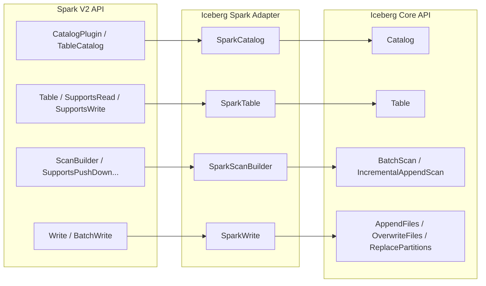

# 第23章 Spark 連携

> **本章で読むソース**
>
> - [`spark/v3.5/spark/src/main/java/org/apache/iceberg/spark/SparkCatalog.java`](https://github.com/apache/iceberg/blob/apache-iceberg-1.11.0/spark/v3.5/spark/src/main/java/org/apache/iceberg/spark/SparkCatalog.java)
> - [`spark/v3.5/spark/src/main/java/org/apache/iceberg/spark/SparkSessionCatalog.java`](https://github.com/apache/iceberg/blob/apache-iceberg-1.11.0/spark/v3.5/spark/src/main/java/org/apache/iceberg/spark/SparkSessionCatalog.java)
> - [`spark/v3.5/spark/src/main/java/org/apache/iceberg/spark/source/SparkTable.java`](https://github.com/apache/iceberg/blob/apache-iceberg-1.11.0/spark/v3.5/spark/src/main/java/org/apache/iceberg/spark/source/SparkTable.java)
> - [`spark/v3.5/spark/src/main/java/org/apache/iceberg/spark/source/SparkScanBuilder.java`](https://github.com/apache/iceberg/blob/apache-iceberg-1.11.0/spark/v3.5/spark/src/main/java/org/apache/iceberg/spark/source/SparkScanBuilder.java)
> - [`spark/v3.5/spark/src/main/java/org/apache/iceberg/spark/source/SparkWrite.java`](https://github.com/apache/iceberg/blob/apache-iceberg-1.11.0/spark/v3.5/spark/src/main/java/org/apache/iceberg/spark/source/SparkWrite.java)
> - [`spark/v3.5/spark/src/main/java/org/apache/iceberg/spark/source/SparkBatch.java`](https://github.com/apache/iceberg/blob/apache-iceberg-1.11.0/spark/v3.5/spark/src/main/java/org/apache/iceberg/spark/source/SparkBatch.java)
> - [`spark/v3.5/spark/src/main/java/org/apache/iceberg/spark/SparkReadConf.java`](https://github.com/apache/iceberg/blob/apache-iceberg-1.11.0/spark/v3.5/spark/src/main/java/org/apache/iceberg/spark/SparkReadConf.java)
> - [`spark/v3.5/spark/src/main/java/org/apache/iceberg/spark/SparkWriteConf.java`](https://github.com/apache/iceberg/blob/apache-iceberg-1.11.0/spark/v3.5/spark/src/main/java/org/apache/iceberg/spark/SparkWriteConf.java)

## この章の狙い

Spark は Iceberg テーブルを操作するもっとも広く使われるエンジンである。
本章では、Spark の DataSource V2 API と Iceberg core API の橋渡しを担うアダプタ層の設計を読む。
カタログ、テーブル、スキャン、書き込みの各レイヤで Spark 側インタフェースと Iceberg 側インタフェースがどう対応しているかを理解し、エンジン固有コードを core から分離するための設計上の工夫を把握する。

## 前提

第14章でスキャン API の型階層（`Scan`, `BatchScan`, `IncrementalAppendScan`）と `planFiles()` / `planTasks()` によるプランニングの仕組みを理解していること。
第15章でカタログ抽象（`Catalog`, `TableOperations`）と楽観的並行制御の仕組みを理解していること。
第10章で `AppendFiles`, `OverwriteFiles`, `ReplacePartitions` などのデータ操作 API を把握していること。

## マルチバージョン対応のディレクトリ構成

Iceberg の Spark モジュールは `spark/` ディレクトリ配下にバージョンごとのサブディレクトリを持つ。
1.11.0 では `v3.4`, `v3.5`, `v4.0`, `v4.1` の4バージョンが存在する。

各バージョンディレクトリの中身はほぼ同一のクラス群だが、Spark のマイナーバージョン間で変わる V2 API の差異を吸収している。
本章では v3.5 を代表として引用する。
以降のコード引用のパスはすべて `spark/v3.5/spark/src/main/java/` 以下を指す。

## Spark V2 DataSource API と Iceberg の全体像

Spark 3.x の DataSource V2 API は、カタログ、テーブル、読み取り、書き込みの4階層をプラグイン可能なインタフェースとして定義する。
Iceberg の Spark モジュールは、各階層に対して1つのアダプタクラスを配置し、Spark 側の呼び出しを Iceberg core API に委譲する。



この対称的なマッピングが、Iceberg の Spark 連携における設計の要である。
Spark のインタフェース階層と Iceberg core のインタフェース階層が一対一に対応しているため、各アダプタクラスの責務が明確になり、core 側の変更がアダプタの特定クラスだけに影響する構造を実現している。

## SparkCatalog と SparkSessionCatalog

### SparkCatalog の役割

**SparkCatalog** は Iceberg core の `Catalog` を Spark の `TableCatalog` として公開するアダプタである。
`BaseCatalog` を継承し、`StagingTableCatalog`, `ProcedureCatalog`, `SupportsNamespaces`, `ViewCatalog` を実装する。

[`spark/v3.5/spark/src/main/java/org/apache/iceberg/spark/SparkCatalog.java` L123-L123](https://github.com/apache/iceberg/blob/apache-iceberg-1.11.0/spark/v3.5/spark/src/main/java/org/apache/iceberg/spark/SparkCatalog.java#L123-L123)

```java
public class SparkCatalog extends BaseCatalog {
```

`BaseCatalog` 自体は `StagingTableCatalog`, `ProcedureCatalog`, `SupportsNamespaces`, `HasIcebergCatalog`, `SupportsFunctions`, `ViewCatalog` を多重に実装する抽象クラスであり、ストアドプロシージャの読み込みや組み込み関数の解決など、Iceberg 固有の付加機能を共通化している。

[`spark/v3.5/spark/src/main/java/org/apache/iceberg/spark/BaseCatalog.java` L34-L41](https://github.com/apache/iceberg/blob/apache-iceberg-1.11.0/spark/v3.5/spark/src/main/java/org/apache/iceberg/spark/BaseCatalog.java#L34-L41)

```java
abstract class BaseCatalog
    implements StagingTableCatalog,
        ProcedureCatalog,
        SupportsNamespaces,
        HasIcebergCatalog,
        SupportsFunctions,
        ViewCatalog,
        SupportsReplaceView {
```

### 初期化と CachingCatalog

`initialize()` メソッドでは、`buildIcebergCatalog()` で core の `Catalog` を構築し、キャッシュが有効な場合は `CachingCatalog.wrap()` で包む。

[`spark/v3.5/spark/src/main/java/org/apache/iceberg/spark/SparkCatalog.java` L748-L783](https://github.com/apache/iceberg/blob/apache-iceberg-1.11.0/spark/v3.5/spark/src/main/java/org/apache/iceberg/spark/SparkCatalog.java#L748-L783)

```java
  @Override
  public final void initialize(String name, CaseInsensitiveStringMap options) {
    super.initialize(name, options);

    this.cacheEnabled =
        PropertyUtil.propertyAsBoolean(
            options, CatalogProperties.CACHE_ENABLED, CatalogProperties.CACHE_ENABLED_DEFAULT);
    // ... (中略) ...
    Catalog catalog = buildIcebergCatalog(name, options);

    this.catalogName = name;
    SparkSession sparkSession = SparkSession.active();
    this.tables =
        new HadoopTables(SparkUtil.hadoopConfCatalogOverrides(SparkSession.active(), name));
    this.icebergCatalog =
        cacheEnabled
            ? CachingCatalog.wrap(catalog, cacheCaseSensitive, cacheExpirationIntervalMs)
            : catalog;
```

core の `Catalog` が `SupportsNamespaces` を実装していれば、それも `asNamespaceCatalog` フィールドに保持する。
同様に `ViewCatalog` を実装していれば `asViewCatalog` に保持する。
Spark 側のネームスペース操作やビュー操作はこれらのフィールドに委譲される。

### テーブル読み込みとタイムトラベル

`loadTable()` は3つのオーバーロードを持つ。
引数なしの基本形はテーブルの最新スナップショットを返す。
バージョン文字列を受け取る形式は、スナップショット ID またはブランチ/タグの参照名を解決する。
タイムスタンプを受け取る形式は、`SnapshotUtil.snapshotIdAsOfTime()` で該当するスナップショットを特定する。

[`spark/v3.5/spark/src/main/java/org/apache/iceberg/spark/SparkCatalog.java` L167-L174](https://github.com/apache/iceberg/blob/apache-iceberg-1.11.0/spark/v3.5/spark/src/main/java/org/apache/iceberg/spark/SparkCatalog.java#L167-L174)

```java
  @Override
  public Table loadTable(Identifier ident) throws NoSuchTableException {
    try {
      return load(ident);
    } catch (org.apache.iceberg.exceptions.NoSuchTableException e) {
      throw new NoSuchTableException(ident);
    }
  }
```

いずれの場合も、最終的に `SparkTable` のコンストラクタにスナップショット ID やブランチ名を渡すことでタイムトラベルを実現している。
Spark の例外型（`NoSuchTableException` など）と Iceberg の例外型は名前が同じだが別のクラスであり、catch ブロックで変換している点も注目に値する。

### SparkSessionCatalog との使い分け

**SparkSessionCatalog** は `CatalogExtension` を実装し、Spark のデフォルトカタログ（`spark_catalog`）を置き換える用途で使う。
内部に `SparkCatalog`（Iceberg 用）と、Spark のセッションカタログ（非 Iceberg テーブル用）の2つを保持する。

[`spark/v3.5/spark/src/main/java/org/apache/iceberg/spark/SparkSessionCatalog.java` L63-L65](https://github.com/apache/iceberg/blob/apache-iceberg-1.11.0/spark/v3.5/spark/src/main/java/org/apache/iceberg/spark/SparkSessionCatalog.java#L63-L65)

```java
public class SparkSessionCatalog<
        T extends TableCatalog & FunctionCatalog & SupportsNamespaces & ViewCatalog>
    extends BaseCatalog implements CatalogExtension {
```

`loadTable()` ではまず Iceberg カタログでの読み込みを試み、失敗したらセッションカタログにフォールバックする。

[`spark/v3.5/spark/src/main/java/org/apache/iceberg/spark/SparkSessionCatalog.java` L143-L150](https://github.com/apache/iceberg/blob/apache-iceberg-1.11.0/spark/v3.5/spark/src/main/java/org/apache/iceberg/spark/SparkSessionCatalog.java#L143-L150)

```java
  @Override
  public Table loadTable(Identifier ident) throws NoSuchTableException {
    try {
      return icebergCatalog.loadTable(ident);
    } catch (NoSuchTableException e) {
      return getSessionCatalog().loadTable(ident);
    }
  }
```

`createTable()` では `provider` プロパティで Iceberg テーブルか非 Iceberg テーブルかを判定する。
`provider` が `null` か `"iceberg"` の場合は Iceberg カタログへ、それ以外はセッションカタログへ委譲する。
さらに `parquet-enabled`, `avro-enabled`, `orc-enabled` オプションで Parquet/Avro/ORC テーブルも Iceberg として作成する設定が可能である。

[`spark/v3.5/spark/src/main/java/org/apache/iceberg/spark/SparkSessionCatalog.java` L378-L390](https://github.com/apache/iceberg/blob/apache-iceberg-1.11.0/spark/v3.5/spark/src/main/java/org/apache/iceberg/spark/SparkSessionCatalog.java#L378-L390)

```java
  private boolean useIceberg(String provider) {
    if (provider == null || "iceberg".equalsIgnoreCase(provider)) {
      return true;
    } else if (createParquetAsIceberg && "parquet".equalsIgnoreCase(provider)) {
      return true;
    } else if (createAvroAsIceberg && "avro".equalsIgnoreCase(provider)) {
      return true;
    } else if (createOrcAsIceberg && "orc".equalsIgnoreCase(provider)) {
      return true;
    }

    return false;
  }
```

この設計により、既存の Hive テーブルとの共存が保たれる。
「SparkCatalog」は Iceberg 専用の名前付きカタログとして登録する場合に使い、「SparkSessionCatalog」はデフォルトカタログを Iceberg 対応にしつつ非 Iceberg テーブルも扱いたい場合に使う。

## SparkTable: テーブルのアダプタ

**SparkTable** は Iceberg core の `Table` を Spark の `Table` として公開するアダプタである。
5つの Spark インタフェースを実装する。

[`spark/v3.5/spark/src/main/java/org/apache/iceberg/spark/source/SparkTable.java` L89-L95](https://github.com/apache/iceberg/blob/apache-iceberg-1.11.0/spark/v3.5/spark/src/main/java/org/apache/iceberg/spark/source/SparkTable.java#L89-L95)

```java
public class SparkTable
    implements org.apache.spark.sql.connector.catalog.Table,
        SupportsRead,
        SupportsWrite,
        SupportsDeleteV2,
        SupportsRowLevelOperations,
        SupportsMetadataColumns {
```

| Spark インタフェース | 役割 |
|---------------------|------|
| `Table` | テーブルのスキーマ、パーティショニング、ケーパビリティの報告 |
| `SupportsRead` | `newScanBuilder()` で読み取りパイプラインを生成 |
| `SupportsWrite` | `newWriteBuilder()` で書き込みパイプラインを生成 |
| `SupportsDeleteV2` | `canDeleteWhere()` / `deleteWhere()` でメタデータ削除を実行 |
| `SupportsRowLevelOperations` | 行単位の UPDATE/DELETE/MERGE 操作を実行 |

### capabilities() の宣言

`capabilities()` メソッドは、このテーブルが対応する操作をフラグの集合で Spark に通知する。

[`spark/v3.5/spark/src/main/java/org/apache/iceberg/spark/source/SparkTable.java` L108-L115](https://github.com/apache/iceberg/blob/apache-iceberg-1.11.0/spark/v3.5/spark/src/main/java/org/apache/iceberg/spark/source/SparkTable.java#L108-L115)

```java
  private static final Set<TableCapability> CAPABILITIES =
      ImmutableSet.of(
          TableCapability.BATCH_READ,
          TableCapability.BATCH_WRITE,
          TableCapability.MICRO_BATCH_READ,
          TableCapability.STREAMING_WRITE,
          TableCapability.OVERWRITE_BY_FILTER,
          TableCapability.OVERWRITE_DYNAMIC);
```

テーブルプロパティ `write.spark.accept-any-schema` が有効な場合は、`ACCEPT_ANY_SCHEMA` が追加される。
これはスキーマ進化との連携で、書き込み時にスキーマの厳密な一致を要求しないモードを実現する。

### newScanBuilder() と newWriteBuilder()

「SparkTable」はファクトリメソッドで読み書きの起点を生成する。

[`spark/v3.5/spark/src/main/java/org/apache/iceberg/spark/source/SparkTable.java` L289-L303](https://github.com/apache/iceberg/blob/apache-iceberg-1.11.0/spark/v3.5/spark/src/main/java/org/apache/iceberg/spark/source/SparkTable.java#L289-L303)

```java
  @Override
  public ScanBuilder newScanBuilder(CaseInsensitiveStringMap options) {
    if (options.containsKey(SparkReadOptions.SCAN_TASK_SET_ID)) {
      return new SparkStagedScanBuilder(sparkSession(), icebergTable, options);
    }

    if (refreshEagerly) {
      icebergTable.refresh();
    }

    CaseInsensitiveStringMap scanOptions =
        branch != null ? options : addSnapshotId(options, snapshotId);
    return new SparkScanBuilder(
        sparkSession(), icebergTable, branch, snapshotSchema(), scanOptions);
  }
```

`refreshEagerly` フラグはキャッシュが無効な場合に `true` になり、読み取り前にメタデータを最新化する。
キャッシュが有効な場合はキャッシュの有効期限内で古いメタデータを返しうるが、そのぶんメタストアへのリクエストが減る。

## SparkScanBuilder: スキャン構築と述語プッシュダウン

**SparkScanBuilder** は Spark の `ScanBuilder` を実装し、6つのプッシュダウン用インタフェースを合わせ持つ。

[`spark/v3.5/spark/src/main/java/org/apache/iceberg/spark/source/SparkScanBuilder.java` L84-L90](https://github.com/apache/iceberg/blob/apache-iceberg-1.11.0/spark/v3.5/spark/src/main/java/org/apache/iceberg/spark/source/SparkScanBuilder.java#L84-L90)

```java
public class SparkScanBuilder
    implements ScanBuilder,
        SupportsPushDownAggregates,
        SupportsPushDownV2Filters,
        SupportsPushDownRequiredColumns,
        SupportsReportStatistics,
        SupportsPushDownLimit {
```

### 述語プッシュダウンの3分類

`pushPredicates()` メソッドは、Spark から受け取ったフィルタ述語を3種類に分類する。

[`spark/v3.5/spark/src/main/java/org/apache/iceberg/spark/source/SparkScanBuilder.java` L150-L195](https://github.com/apache/iceberg/blob/apache-iceberg-1.11.0/spark/v3.5/spark/src/main/java/org/apache/iceberg/spark/source/SparkScanBuilder.java#L150-L195)

```java
  @Override
  public Predicate[] pushPredicates(Predicate[] predicates) {
    // there are 3 kinds of filters:
    // (1) filters that can be pushed down completely and don't have to evaluated by Spark
    //     (e.g. filters that select entire partitions)
    // (2) filters that can be pushed down partially and require record-level filtering in Spark
    //     (e.g. filters that may select some but not necessarily all rows in a file)
    // (3) filters that can't be pushed down at all and have to be evaluated by Spark
    //     (e.g. unsupported filters)
    // filters (1) and (2) are used prune files during job planning in Iceberg
    // filters (2) and (3) form a set of post scan filters and must be evaluated by Spark

    List<Expression> expressions = Lists.newArrayListWithExpectedSize(predicates.length);
    List<Predicate> pushableFilters = Lists.newArrayListWithExpectedSize(predicates.length);
    List<Predicate> postScanFilters = Lists.newArrayListWithExpectedSize(predicates.length);

    for (Predicate predicate : predicates) {
      try {
        Expression expr = SparkV2Filters.convert(predicate);

        if (expr != null) {
          // try binding the expression to ensure it can be pushed down
          Binder.bind(schema.asStruct(), expr, caseSensitive);
          expressions.add(expr);
          pushableFilters.add(predicate);
        }

        if (expr == null
            || unpartitioned()
            || !ExpressionUtil.selectsPartitions(expr, table, caseSensitive)) {
          postScanFilters.add(predicate);
        } else {
          LOG.info("Evaluating completely on Iceberg side: {}", predicate);
        }
      // ... (中略) ...
    }

    this.filterExpressions = expressions;
    this.pushedPredicates = pushableFilters.toArray(new Predicate[0]);

    return postScanFilters.toArray(new Predicate[0]);
  }
```

| 分類 | 条件 | 扱い |
|------|------|------|
| (1) 完全プッシュダウン | パーティション全体を選択する述語 | Iceberg 側のみで評価、Spark 側では不要 |
| (2) 部分プッシュダウン | Iceberg 式に変換可能だが、ファイル内全行を選択するとは限らない | Iceberg でファイルを刈り込み、Spark でレコード単位フィルタも実行 |
| (3) プッシュダウン不可 | Iceberg 式に変換できない | Spark 側のみで評価 |

変換には `SparkV2Filters.convert()` を使い、Spark の `Predicate` を Iceberg の `Expression` に変換する。
変換結果を `Binder.bind()` でスキーマに束縛し、成功したものだけをプッシュダウン対象とする。
`ExpressionUtil.selectsPartitions()` が `true` を返す述語はパーティション全体を選択するため、Spark 側での再評価が不要になる。

### 列プルーニング

`pruneColumns()` は Spark が要求する列のみにスキーマを絞り込む。
メタデータ列（`_spec_id`, `_partition`, `_file`, `_pos` など）はフィルタして別途 `metaColumns` リストに保持する。

[`spark/v3.5/spark/src/main/java/org/apache/iceberg/spark/source/SparkScanBuilder.java` L328-L346](https://github.com/apache/iceberg/blob/apache-iceberg-1.11.0/spark/v3.5/spark/src/main/java/org/apache/iceberg/spark/source/SparkScanBuilder.java#L328-L346)

```java
  @Override
  public void pruneColumns(StructType requestedSchema) {
    StructType requestedProjection =
        new StructType(
            Stream.of(requestedSchema.fields())
                .filter(field -> MetadataColumns.nonMetadataColumn(field.name()))
                .toArray(StructField[]::new));

    // the projection should include all columns that will be returned, including those only used in
    // filters
    this.schema =
        SparkSchemaUtil.prune(schema, requestedProjection, filterExpression(), caseSensitive);

    Stream.of(requestedSchema.fields())
        .map(StructField::name)
        .filter(MetadataColumns::isMetadataColumn)
        .distinct()
        .forEach(metaColumns::add);
  }
```

`SparkSchemaUtil.prune()` は要求列に加えて、フィルタ式で参照される列も保持する。
これにより、WHERE 句で使われるがSELECT に含まれない列も確実にスキャン対象になる。

### BatchScan と IncrementalAppendScan の使い分け

`buildIcebergBatchScan()` は設定オプションに応じて2種類のスキャンを構築する。

[`spark/v3.5/spark/src/main/java/org/apache/iceberg/spark/source/SparkScanBuilder.java` L461-L465](https://github.com/apache/iceberg/blob/apache-iceberg-1.11.0/spark/v3.5/spark/src/main/java/org/apache/iceberg/spark/source/SparkScanBuilder.java#L461-L465)

```java
    if (startSnapshotId != null) {
      return buildIncrementalAppendScan(startSnapshotId, endSnapshotId, withStats, expectedSchema);
    } else {
      return buildBatchScan(snapshotId, asOfTimestamp, branch, tag, withStats, expectedSchema);
    }
```

`start-snapshot-id` が設定されていれば `IncrementalAppendScan` を構築し、差分読み取りを行う。
それ以外は `BatchScan` を使い、スナップショット ID、タイムスタンプ、ブランチ、タグの指定に応じてスキャン対象を絞り込む。

### 集約プッシュダウン

`SupportsPushDownAggregates` の実装として、`COUNT`, `MIN`, `MAX` などの集約をマニフェストのメトリクス（下限値、上限値、レコード数）だけで計算できるかを判定する。
条件が満たされれば、データファイルを一切読まずに集約結果を返す `SparkLocalScan` を構築する。

[`spark/v3.5/spark/src/main/java/org/apache/iceberg/spark/source/SparkScanBuilder.java` L201-L204](https://github.com/apache/iceberg/blob/apache-iceberg-1.11.0/spark/v3.5/spark/src/main/java/org/apache/iceberg/spark/source/SparkScanBuilder.java#L201-L204)

```java
  @Override
  public boolean pushAggregation(Aggregation aggregation) {
    if (!canPushDownAggregation(aggregation)) {
      return false;
    }
    // ... (中略) ...
    try (CloseableIterable<FileScanTask> fileScanTasks = scan.planFiles()) {
      for (FileScanTask task : fileScanTasks) {
        if (!task.deletes().isEmpty()) {
          LOG.info("Skipping aggregate pushdown: detected row level deletes");
          return false;
        }

        aggregateEvaluator.update(task.file());
      }
    } catch (IOException e) {
      LOG.info("Skipping aggregate pushdown: ", e);
      return false;
    }
    // ... (中略) ...
    localScan =
        new SparkLocalScan(table, pushedAggregateSchema, pushedAggregateRows, filterExpressions);

    return true;
  }
```

行単位の削除ファイルが存在する場合、メトリクスだけでは正確な集約値を算出できないためプッシュダウンを断念する。
GROUP BY を含む集約も現時点ではプッシュダウン対象外である。

## SparkWrite: 書き込みパイプライン

### 書き込みモードの選択

**SparkWrite** は `Write` と `RequiresDistributionAndOrdering` を実装する抽象クラスである。
書き込みモードに応じた内部クラスを返すファクトリメソッド群を持つ。

[`spark/v3.5/spark/src/main/java/org/apache/iceberg/spark/source/SparkWrite.java` L163-L189](https://github.com/apache/iceberg/blob/apache-iceberg-1.11.0/spark/v3.5/spark/src/main/java/org/apache/iceberg/spark/source/SparkWrite.java#L163-L189)

```java
  BatchWrite asBatchAppend() {
    return new BatchAppend();
  }

  BatchWrite asDynamicOverwrite() {
    return new DynamicOverwrite();
  }

  BatchWrite asOverwriteByFilter(Expression overwriteExpr) {
    return new OverwriteByFilter(overwriteExpr);
  }

  BatchWrite asCopyOnWriteOperation(SparkCopyOnWriteScan scan, IsolationLevel isolationLevel) {
    return new CopyOnWriteOperation(scan, isolationLevel);
  }

  BatchWrite asRewrite(String fileSetID) {
    return new RewriteFiles(fileSetID);
  }

  StreamingWrite asStreamingAppend() {
    return new StreamingAppend();
  }

  StreamingWrite asStreamingOverwrite() {
    return new StreamingOverwrite();
  }
```

これらのファクトリメソッドは `SparkWriteBuilder.build()` の中で呼び出される。
`SparkWriteBuilder` は `SupportsDynamicOverwrite` と `SupportsOverwriteV2` を実装し、Spark のオプティマイザが呼ぶ `overwriteDynamicPartitions()` や `overwrite(predicates)` でモードフラグを設定する。

[`spark/v3.5/spark/src/main/java/org/apache/iceberg/spark/source/SparkWriteBuilder.java` L120-L182](https://github.com/apache/iceberg/blob/apache-iceberg-1.11.0/spark/v3.5/spark/src/main/java/org/apache/iceberg/spark/source/SparkWriteBuilder.java#L120-L182)

```java
  @Override
  public Write build() {
    // ... (中略) ...
    return new SparkWrite(
        spark, table, writeConf, writeInfo, appId, writeSchema, dsSchema, writeRequirements()) {

      @Override
      public BatchWrite toBatch() {
        if (rewrittenFileSetId != null) {
          return asRewrite(rewrittenFileSetId);
        } else if (overwriteByFilter) {
          return asOverwriteByFilter(overwriteExpr);
        } else if (overwriteDynamic) {
          return asDynamicOverwrite();
        } else if (overwriteFiles) {
          return asCopyOnWriteOperation(copyOnWriteScan, copyOnWriteIsolationLevel);
        } else {
          return asBatchAppend();
        }
      }
      // ... (中略) ...
    };
  }
```

各モードと Iceberg core API の対応は以下の通りである。

| モード | Iceberg core API | 用途 |
|--------|-----------------|------|
| `BatchAppend` | `AppendFiles` | 通常の INSERT |
| `DynamicOverwrite` | `ReplacePartitions` | INSERT OVERWRITE（動的パーティション上書き） |
| `OverwriteByFilter` | `OverwriteFiles` | INSERT OVERWRITE（フィルタ条件による上書き） |
| `CopyOnWriteOperation` | `OverwriteFiles` | UPDATE/DELETE/MERGE の copy-on-write |
| `RewriteFiles` | なし（ステージングのみ） | コンパクション用ファイル書き換え |

### WriterFactory とタスク分散書き込み

Executor 上でデータファイルを書き込む `WriterFactory` は、テーブルメタデータを `Broadcast` で各 Executor に配布する。

[`spark/v3.5/spark/src/main/java/org/apache/iceberg/spark/source/SparkWrite.java` L192-L208](https://github.com/apache/iceberg/blob/apache-iceberg-1.11.0/spark/v3.5/spark/src/main/java/org/apache/iceberg/spark/source/SparkWrite.java#L192-L208)

```java
  private WriterFactory createWriterFactory() {
    // broadcast the table metadata as the writer factory will be sent to executors
    Broadcast<Table> tableBroadcast =
        sparkContext.broadcast(SerializableTableWithSize.copyOf(table));
    int sortOrderId = writeConf.outputSortOrderId(writeRequirements);
    return new WriterFactory(
        tableBroadcast,
        queryId,
        format,
        outputSpecId,
        targetFileSize,
        writeSchema,
        dsSchema,
        useFanoutWriter,
        writeProperties,
        sortOrderId);
  }
```

`WriterFactory.createWriter()` は、テーブルがパーティション化されているかどうかで異なるライターを返す。

[`spark/v3.5/spark/src/main/java/org/apache/iceberg/spark/source/SparkWrite.java` L727-L740](https://github.com/apache/iceberg/blob/apache-iceberg-1.11.0/spark/v3.5/spark/src/main/java/org/apache/iceberg/spark/source/SparkWrite.java#L727-L740)

```java
      if (spec.isUnpartitioned()) {
        return new UnpartitionedDataWriter(writerFactory, fileFactory, io, spec, targetFileSize);

      } else {
        return new PartitionedDataWriter(
            writerFactory,
            fileFactory,
            io,
            spec,
            writeSchema,
            dsSchema,
            targetFileSize,
            useFanoutWriter);
      }
```

パーティション化テーブルの場合、`useFanoutWriter` フラグに応じて `FanoutDataWriter`（複数パーティションを同時に書き込む）か `ClusteredDataWriter`（同一パーティションのレコードが連続して到着する前提で書き込む）を選択する。

### コミットと WAP

`commitOperation()` は全モード共通のコミット処理である。
WAP（Write-Audit-Publish）が有効な場合は、スナップショットをステージングし、手動で publish するまで可視化しない。

[`spark/v3.5/spark/src/main/java/org/apache/iceberg/spark/source/SparkWrite.java` L210-L244](https://github.com/apache/iceberg/blob/apache-iceberg-1.11.0/spark/v3.5/spark/src/main/java/org/apache/iceberg/spark/source/SparkWrite.java#L210-L244)

```java
  private void commitOperation(SnapshotUpdate<?> operation, String description) {
    LOG.info("Committing {} to table {}", description, table);
    if (applicationId != null) {
      operation.set("spark.app.id", applicationId);
    }
    // ... (中略) ...
    if (wapEnabled && wapId != null) {
      // write-audit-publish is enabled for this table and job
      // stage the changes without changing the current snapshot
      operation.set(SnapshotSummary.STAGED_WAP_ID_PROP, wapId);
      operation.stageOnly();
    }

    if (branch != null) {
      operation.toBranch(branch);
    }

    try {
      long start = System.currentTimeMillis();
      operation.commit(); // abort is automatically called if this fails
      long duration = System.currentTimeMillis() - start;
      LOG.info("Committed in {} ms", duration);
    } catch (Exception e) {
      cleanupOnAbort = e instanceof CleanableFailure;
      throw e;
    }
  }
```

コミットが失敗した場合、例外が `CleanableFailure` であれば書き込み済みファイルをクリーンアップし、そうでなければスキップする。
これは楽観的並行制御のリトライでは再利用できない古いファイルを残さないための仕組みである。

## SparkBatch: 入力パーティションの生成

**SparkBatch** は Spark の `Batch` インタフェースを実装し、`planInputPartitions()` でタスクグループから入力パーティションの配列を生成する。

[`spark/v3.5/spark/src/main/java/org/apache/iceberg/spark/source/SparkBatch.java` L86-L113](https://github.com/apache/iceberg/blob/apache-iceberg-1.11.0/spark/v3.5/spark/src/main/java/org/apache/iceberg/spark/source/SparkBatch.java#L86-L113)

```java
  @Override
  public InputPartition[] planInputPartitions() {
    // broadcast the table metadata as input partitions will be sent to executors
    Broadcast<Table> tableBroadcast =
        sparkContext.broadcast(SerializableTableWithSize.copyOf(table));
    Broadcast<FileIO> fileIOBroadcast =
        sparkContext.broadcast(SerializableFileIOWithSize.wrap(fileIO.get()));
    String expectedSchemaString = SchemaParser.toJson(expectedSchema);
    String[][] locations = computePreferredLocations();

    InputPartition[] partitions = new InputPartition[taskGroups.size()];

    for (int index = 0; index < taskGroups.size(); index++) {
      partitions[index] =
          new SparkInputPartition(
              groupingKeyType,
              taskGroups.get(index),
              tableBroadcast,
              fileIOBroadcast,
              branch,
              expectedSchemaString,
              caseSensitive,
              locations != null ? locations[index] : SparkPlanningUtil.NO_LOCATION_PREFERENCE,
              cacheDeleteFilesOnExecutors);
    }

    return partitions;
  }
```

テーブルメタデータと FileIO を `Broadcast` でシリアライズし、各 Executor に送る。
スキーマは JSON 文字列に変換して送る。
これらの情報があれば、Executor はデータファイルのパスと読み取り方法を完全に復元できる。

### データ局所性の最適化

`computePreferredLocations()` は3つのモードで優先ロケーションを決定する。

[`spark/v3.5/spark/src/main/java/org/apache/iceberg/spark/source/SparkBatch.java` L115-L127](https://github.com/apache/iceberg/blob/apache-iceberg-1.11.0/spark/v3.5/spark/src/main/java/org/apache/iceberg/spark/source/SparkBatch.java#L115-L127)

```java
  private String[][] computePreferredLocations() {
    if (localityEnabled) {
      return SparkPlanningUtil.fetchBlockLocations(fileIO.get(), taskGroups);

    } else if (executorCacheLocalityEnabled) {
      List<String> executorLocations = SparkUtil.executorLocations();
      if (!executorLocations.isEmpty()) {
        return SparkPlanningUtil.assignExecutors(taskGroups, executorLocations);
      }
    }

    return null;
  }
```

HDFS 上のデータに対してはブロックロケーション情報を取得してデータ局所性を活用する。
オブジェクトストレージ（S3, GCS など）ではブロック位置の概念がないため、代わりに Executor キャッシュ局所性（特定タスクグループを常に同じ Executor に割り当てる）を使い、ファイルキャッシュの効率を高める。

### リーダーファクトリの選択

`createReaderFactory()` では、ベクトル化読み取りが有効かどうかでリーダーを切り替える。
Parquet のベクトル化読み取りにはプリミティブ型のみという制約があり、ORC のベクトル化読み取りには削除ファイルが存在しないという制約がある。

[`spark/v3.5/spark/src/main/java/org/apache/iceberg/spark/source/SparkBatch.java` L129-L140](https://github.com/apache/iceberg/blob/apache-iceberg-1.11.0/spark/v3.5/spark/src/main/java/org/apache/iceberg/spark/source/SparkBatch.java#L129-L140)

```java
  @Override
  public PartitionReaderFactory createReaderFactory() {
    if (useParquetBatchReads()) {
      return new SparkColumnarReaderFactory(parquetBatchReadConf());

    } else if (useOrcBatchReads()) {
      return new SparkColumnarReaderFactory(orcBatchReadConf());

    } else {
      return new SparkRowReaderFactory();
    }
  }
```

## SparkReadConf と SparkWriteConf: 設定の三層構造

読み取りと書き込みの設定はそれぞれ **SparkReadConf** と **SparkWriteConf** に集約される。
どちらも同じ優先順位モデルを採用している。

1. 読み取り/書き込みオプション（DataFrame API やSQLのオプション句）
2. Spark セッション設定（`spark.sql.iceberg.*`）
3. テーブルプロパティ（`tblproperties`）

[`spark/v3.5/spark/src/main/java/org/apache/iceberg/spark/SparkReadConf.java` L35-L45](https://github.com/apache/iceberg/blob/apache-iceberg-1.11.0/spark/v3.5/spark/src/main/java/org/apache/iceberg/spark/SparkReadConf.java#L35-L45)

```java
/**
 * A class for common Iceberg configs for Spark reads.
 *
 * <p>If a config is set at multiple levels, the following order of precedence is used (top to
 * bottom):
 *
 * <ol>
 *   <li>Read options
 *   <li>Session configuration
 *   <li>Table metadata
 * </ol>
```

この三層構造を実現しているのが `SparkConfParser` である。
各設定項目はビルダーパターンで `.option()`, `.sessionConf()`, `.tableProperty()`, `.defaultValue()` をチェインし、最初に見つかった値を返す。

たとえば Parquet ベクトル化読み取りの設定は、読み取りオプション、セッション設定、テーブルプロパティの3箇所を順に探索する。

[`spark/v3.5/spark/src/main/java/org/apache/iceberg/spark/SparkReadConf.java` L156-L164](https://github.com/apache/iceberg/blob/apache-iceberg-1.11.0/spark/v3.5/spark/src/main/java/org/apache/iceberg/spark/SparkReadConf.java#L156-L164)

```java
  public boolean parquetVectorizationEnabled() {
    return confParser
        .booleanConf()
        .option(SparkReadOptions.VECTORIZATION_ENABLED)
        .sessionConf(SparkSQLProperties.VECTORIZATION_ENABLED)
        .tableProperty(TableProperties.PARQUET_VECTORIZATION_ENABLED)
        .defaultValue(TableProperties.PARQUET_VECTORIZATION_ENABLED_DEFAULT)
        .parse();
  }
```

### SparkWriteConf: 分散モードの決定

「SparkWriteConf」は書き込み時のデータ分散方式（distribution mode）を決定する。
テーブルがソート済みなら RANGE、パーティション化されていれば HASH、いずれでもなければ NONE を既定とする。

[`spark/v3.5/spark/src/main/java/org/apache/iceberg/spark/SparkWriteConf.java` L331-L339](https://github.com/apache/iceberg/blob/apache-iceberg-1.11.0/spark/v3.5/spark/src/main/java/org/apache/iceberg/spark/SparkWriteConf.java#L331-L339)

```java
  private DistributionMode defaultWriteDistributionMode() {
    if (table.sortOrder().isSorted()) {
      return RANGE;
    } else if (table.spec().isPartitioned()) {
      return HASH;
    } else {
      return NONE;
    }
  }
```

RANGE 分散ではパーティションキーとソートキーに基づいて Spark のシャッフルが発生するため、書き込まれるデータファイルは物理的に整列される。
HASH 分散ではパーティションキーだけで分散するため、同一パーティションのデータが同じタスクに集約される。
これは `ClusteredDataWriter` が同一パーティションのレコードの連続到着を前提とする設計と対応している。

## 設計上の工夫: 対称的なインタフェースマッピング

本章で見たアダプタ層の設計には、一貫した構造的な工夫がある。
Spark V2 API の各インタフェースに対して Iceberg core API の対応するインタフェースが一つずつ存在し、アダプタクラスがその間の変換だけを担当する。

この設計が有効な理由は、責務の分離による保守性の高さにある。
Spark 側で新しい API が追加されたとき（たとえば `SupportsPushDownLimit` の追加）、変更はアダプタクラスの一箇所に閉じ、core 側のスキャン API には手を加えずに済む。
逆に、Iceberg core に新しいスキャン種別（`IncrementalChangelogScan` など）が追加された場合も、アダプタの中でスキャン構築ロジックを分岐するだけで対応できる。

マルチバージョン対応のディレクトリ構成もこの設計を補強している。
各 Spark バージョン間で異なるのはアダプタ層のコードだけであり、core 側のコードは共通である。
バージョンごとにディレクトリを分けることで、あるバージョン向けの変更が他のバージョンに影響しない構造を確保している。

## まとめ

- **SparkCatalog** は Iceberg core の `Catalog` を Spark の `TableCatalog` / `StagingTableCatalog` に橋渡しする。「SparkSessionCatalog」は既存の Hive テーブルとの共存を実現するフォールバック付きの拡張版である。
- **SparkTable** は1つのクラスで `SupportsRead`, `SupportsWrite`, `SupportsDeleteV2`, `SupportsRowLevelOperations`, `SupportsMetadataColumns` の5つの Spark インタフェースを実装し、読み書き削除の全パイプラインへの起点となる。
- **SparkScanBuilder** は述語プッシュダウンを3分類し、パーティション全体を選択する述語は Spark 側での再評価を省く。集約プッシュダウンによりメトリクスだけで `COUNT`/`MIN`/`MAX` を算出する最適化も行う。
- **SparkWrite** は書き込みモードに応じて `AppendFiles`, `OverwriteFiles`, `ReplacePartitions` を使い分ける。Executor 上の `WriterFactory` はテーブルメタデータを `Broadcast` で受け取り、パーティション有無に応じて `FanoutDataWriter` か `ClusteredDataWriter` を選択する。
- **SparkBatch** はタスクグループからSpark の `InputPartition` 配列を生成し、テーブルメタデータと FileIO を `Broadcast` で Executor に配布する。
- **SparkReadConf** と **SparkWriteConf** は、読み取り/書き込みオプション、セッション設定、テーブルプロパティの三層を `SparkConfParser` で統一的に探索する。
- Spark V2 API と Iceberg core API の対称的な一対一マッピングが、各アダプタの責務を明確にし、マルチバージョン対応とエンジン追加を容易にしている。

## 関連する章

- [第14章 プランニングとスキャン](../part05-scan/14-planning-and-scan.md)
- [第15章 カタログ抽象と TableOperations](../part06-catalog/15-catalog-abstraction.md)
- [第10章 追記と上書き](../part04-data-operations/10-append-and-overwrite.md)
- [第11章 行単位の削除](../part04-data-operations/11-row-level-deletes.md)
- [第19章 Parquet と ORC](../part07-file-io/19-parquet-and-orc.md)
