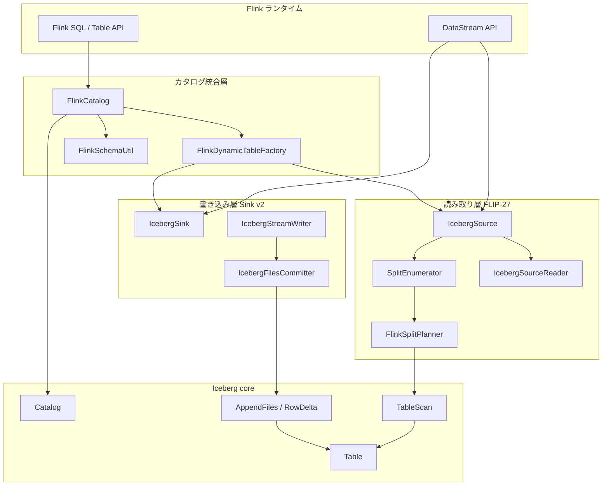
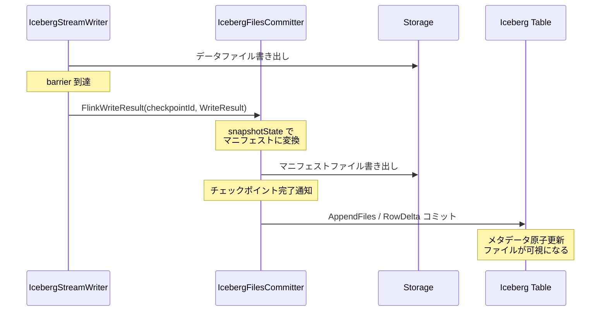

# 第24章 Flink 連携

> **本章で読むソース**
>
> - [`flink/v1.20/flink/src/main/java/org/apache/iceberg/flink/FlinkCatalog.java`](https://github.com/apache/iceberg/blob/apache-iceberg-1.11.0/flink/v1.20/flink/src/main/java/org/apache/iceberg/flink/FlinkCatalog.java)
> - [`flink/v1.20/flink/src/main/java/org/apache/iceberg/flink/FlinkDynamicTableFactory.java`](https://github.com/apache/iceberg/blob/apache-iceberg-1.11.0/flink/v1.20/flink/src/main/java/org/apache/iceberg/flink/FlinkDynamicTableFactory.java)
> - [`flink/v1.20/flink/src/main/java/org/apache/iceberg/flink/source/IcebergSource.java`](https://github.com/apache/iceberg/blob/apache-iceberg-1.11.0/flink/v1.20/flink/src/main/java/org/apache/iceberg/flink/source/IcebergSource.java)
> - [`flink/v1.20/flink/src/main/java/org/apache/iceberg/flink/source/FlinkSplitPlanner.java`](https://github.com/apache/iceberg/blob/apache-iceberg-1.11.0/flink/v1.20/flink/src/main/java/org/apache/iceberg/flink/source/FlinkSplitPlanner.java)
> - [`flink/v1.20/flink/src/main/java/org/apache/iceberg/flink/source/enumerator/ContinuousIcebergEnumerator.java`](https://github.com/apache/iceberg/blob/apache-iceberg-1.11.0/flink/v1.20/flink/src/main/java/org/apache/iceberg/flink/source/enumerator/ContinuousIcebergEnumerator.java)
> - [`flink/v1.20/flink/src/main/java/org/apache/iceberg/flink/source/reader/IcebergSourceReader.java`](https://github.com/apache/iceberg/blob/apache-iceberg-1.11.0/flink/v1.20/flink/src/main/java/org/apache/iceberg/flink/source/reader/IcebergSourceReader.java)
> - [`flink/v1.20/flink/src/main/java/org/apache/iceberg/flink/sink/IcebergSink.java`](https://github.com/apache/iceberg/blob/apache-iceberg-1.11.0/flink/v1.20/flink/src/main/java/org/apache/iceberg/flink/sink/IcebergSink.java)
> - [`flink/v1.20/flink/src/main/java/org/apache/iceberg/flink/sink/IcebergFilesCommitter.java`](https://github.com/apache/iceberg/blob/apache-iceberg-1.11.0/flink/v1.20/flink/src/main/java/org/apache/iceberg/flink/sink/IcebergFilesCommitter.java)
> - [`flink/v1.20/flink/src/main/java/org/apache/iceberg/flink/sink/IcebergStreamWriter.java`](https://github.com/apache/iceberg/blob/apache-iceberg-1.11.0/flink/v1.20/flink/src/main/java/org/apache/iceberg/flink/sink/IcebergStreamWriter.java)

## この章の狙い

Flink から Iceberg テーブルを読み書きする連携モジュールの内部設計を読み解く。
カタログ統合、FLIP-27 Source API による読み取り、Sink v2 API による書き込みの 3 層を追い、Flink のチェックポイント機構を利用して exactly-once セマンティクスを実現する仕組みを理解する。

## 前提

第15章でカタログ抽象（`Catalog` インタフェース、`Namespace`、`TableIdentifier`）を把握していること。
第14章でスキャン計画（`TableScan`、`CombinedScanTask`、`IncrementalAppendScan`）の流れを知っていること。
第10章でスナップショットコミット（`AppendFiles`、`RowDelta`）の仕組みを理解していること。
Flink のチェックポイントバリア、`Source` / `Sink` v2 API の概念（SplitEnumerator、SourceReader、Committer）について基本的な知識があること。

## 全体アーキテクチャ

Iceberg の Flink 連携は大きく 3 つの層で構成される。

1. **カタログ統合層**: `FlinkCatalog` が Iceberg の `Catalog` を Flink の `AbstractCatalog` としてラップし、DDL 操作とスキーマ変換を担う
2. **読み取り層**: `IcebergSource` が FLIP-27 Source API を実装し、SplitEnumerator と SourceReader の分離設計でバッチとストリーミングの両方に対応する
3. **書き込み層**: `IcebergSink` が Sink v2 API を実装し、Writer と Committer の 2 段パイプラインでチェックポイント連動の exactly-once 書き込みを実現する



## FlinkCatalog: カタログの橋渡し

**FlinkCatalog** は Flink の `AbstractCatalog` を継承し、Iceberg の `Catalog` をラップするアダプタである。
Flink SQL で `CREATE CATALOG` を実行すると `FlinkCatalog` が生成され、DDL とテーブル解決はこのクラスを経由する。
実行時の SELECT/INSERT は `FlinkDynamicTableFactory` が `IcebergTableSource`/`IcebergTableSink` を生成して処理する。

### コンストラクタと CachingCatalog

コンストラクタでは `CatalogLoader` から Iceberg カタログをロードし、キャッシュが有効であれば `CachingCatalog` でラップする。

[`flink/v1.20/flink/src/main/java/org/apache/iceberg/flink/FlinkCatalog.java` L104-L128](https://github.com/apache/iceberg/blob/apache-iceberg-1.11.0/flink/v1.20/flink/src/main/java/org/apache/iceberg/flink/FlinkCatalog.java#L104-L128)

```java
  public FlinkCatalog(
      String catalogName,
      String defaultDatabase,
      Namespace baseNamespace,
      CatalogLoader catalogLoader,
      Map<String, String> catalogProps,
      boolean cacheEnabled,
      long cacheExpirationIntervalMs) {
    super(catalogName, defaultDatabase);
    this.catalogLoader = catalogLoader;
    this.catalogProps = catalogProps;
    this.baseNamespace = baseNamespace;
    this.cacheEnabled = cacheEnabled;

    Catalog originalCatalog = catalogLoader.loadCatalog();
    icebergCatalog =
        cacheEnabled
            ? CachingCatalog.wrap(originalCatalog, cacheExpirationIntervalMs)
            : originalCatalog;
    asNamespaceCatalog =
        originalCatalog instanceof SupportsNamespaces ? (SupportsNamespaces) originalCatalog : null;
    closeable = originalCatalog instanceof Closeable ? (Closeable) originalCatalog : null;

    FlinkEnvironmentContext.init();
  }
```

`baseNamespace` はカタログレベルで固定される名前空間の接頭辞であり、Flink のデータベース名がその次のレベルとして追加される。
たとえば `baseNamespace` が `production` のとき、Flink データベース `analytics` は Iceberg 名前空間 `production.analytics` にマッピングされる。

### 名前空間の変換

`toIdentifier` メソッドが Flink の `ObjectPath`（データベース名 + テーブル名）を Iceberg の `TableIdentifier` に変換する。
テーブル名に `$` が含まれる場合はメタデータテーブル（`table$history` など）として解釈される。

[`flink/v1.20/flink/src/main/java/org/apache/iceberg/flink/FlinkCatalog.java` L156-L170](https://github.com/apache/iceberg/blob/apache-iceberg-1.11.0/flink/v1.20/flink/src/main/java/org/apache/iceberg/flink/FlinkCatalog.java#L156-L170)

```java
  TableIdentifier toIdentifier(ObjectPath path) {
    String objectName = path.getObjectName();
    List<String> tableName = Splitter.on('$').splitToList(objectName);

    if (tableName.size() == 1) {
      return TableIdentifier.of(
          appendLevel(baseNamespace, path.getDatabaseName()), path.getObjectName());
    } else if (tableName.size() == 2 && MetadataTableType.from(tableName.get(1)) != null) {
      return TableIdentifier.of(
          appendLevel(appendLevel(baseNamespace, path.getDatabaseName()), tableName.get(0)),
          tableName.get(1));
    } else {
      throw new IllegalArgumentException("Illegal table name:" + objectName);
    }
  }
```

### スキーマ変換

テーブル作成時には `FlinkSchemaUtil.convert` が Flink の `ResolvedSchema` を Iceberg の `Schema` に変換する。
型のマッピングは 1 対 1 ではなく、一部の型は精度を失う。
たとえば Flink の `VarCharType` と `CharType` は共に Iceberg の `StringType` に変換され、Flink の `TimeType` はマイクロ秒精度の Iceberg `TimeType` に変換される。

[`flink/v1.20/flink/src/main/java/org/apache/iceberg/flink/FlinkCatalog.java` L433-L461](https://github.com/apache/iceberg/blob/apache-iceberg-1.11.0/flink/v1.20/flink/src/main/java/org/apache/iceberg/flink/FlinkCatalog.java#L433-L461)

```java
  void createIcebergTable(ObjectPath tablePath, ResolvedCatalogTable table, boolean ignoreIfExists)
      throws CatalogException, TableAlreadyExistException {
    validateFlinkTable(table);

    Schema icebergSchema = FlinkSchemaUtil.convert(table.getResolvedSchema());
    PartitionSpec spec = toPartitionSpec(table.getPartitionKeys(), icebergSchema);
    // ... (中略) ...
    try {
      icebergCatalog.createTable(
          toIdentifier(tablePath), icebergSchema, spec, location, properties.build());
    } catch (AlreadyExistsException e) {
      if (!ignoreIfExists) {
        throw new TableAlreadyExistException(getName(), tablePath, e);
      }
    }
  }
```

逆方向の変換では `toCatalogTableWithProps` が Iceberg テーブルのスキーマとパーティション情報を Flink の `CatalogTable` に変換して返す。

[`flink/v1.20/flink/src/main/java/org/apache/iceberg/flink/FlinkCatalog.java` L658-L673](https://github.com/apache/iceberg/blob/apache-iceberg-1.11.0/flink/v1.20/flink/src/main/java/org/apache/iceberg/flink/FlinkCatalog.java#L658-L673)

```java
  static CatalogTable toCatalogTableWithProps(Table table, Map<String, String> props) {
    ResolvedSchema resolvedSchema = FlinkSchemaUtil.toResolvedSchema(table.schema());
    List<String> partitionKeys = toPartitionKeys(table.spec(), table.schema());

    // NOTE: We can not create a IcebergCatalogTable extends CatalogTable, because Flink optimizer
    // may use DefaultCatalogTable to copy a new catalog table.
    // Let's re-loading table from Iceberg catalog when creating source/sink operators.
    return CatalogTable.newBuilder()
        .schema(
            org.apache.flink.table.api.Schema.newBuilder()
                .fromResolvedSchema(resolvedSchema)
                .build())
        .partitionKeys(partitionKeys)
        .options(props)
        .build();
  }
```

### FlinkDynamicTableFactory との連携

`FlinkCatalog` は `getFactory` メソッドで `FlinkDynamicTableFactory` を返す。
Flink SQL が `SELECT` や `INSERT` を実行すると、このファクトリが呼び出されて `IcebergTableSource` または `IcebergTableSink` を生成する。

[`flink/v1.20/flink/src/main/java/org/apache/iceberg/flink/FlinkCatalog.java` L679-L682](https://github.com/apache/iceberg/blob/apache-iceberg-1.11.0/flink/v1.20/flink/src/main/java/org/apache/iceberg/flink/FlinkCatalog.java#L679-L682)

```java
  @Override
  public Optional<Factory> getFactory() {
    return Optional.of(new FlinkDynamicTableFactory(this));
  }
```

`FlinkDynamicTableFactory` は `DynamicTableSourceFactory` と `DynamicTableSinkFactory` の両方を実装しており、`createDynamicTableSource` でソースを、`createDynamicTableSink` でシンクを生成する。
ファクトリ識別子は `"iceberg"` である。

[`flink/v1.20/flink/src/main/java/org/apache/iceberg/flink/FlinkDynamicTableFactory.java` L46-L48](https://github.com/apache/iceberg/blob/apache-iceberg-1.11.0/flink/v1.20/flink/src/main/java/org/apache/iceberg/flink/FlinkDynamicTableFactory.java#L46-L48)

```java
public class FlinkDynamicTableFactory
    implements DynamicTableSinkFactory, DynamicTableSourceFactory {
  static final String FACTORY_IDENTIFIER = "iceberg";
```

## IcebergSource: FLIP-27 Source API による読み取り

**IcebergSource** は Flink の FLIP-27 Source API（`Source<T, IcebergSourceSplit, IcebergEnumeratorState>`）を実装する。
FLIP-27 は SplitEnumerator（コーディネータ側でスプリットを生成）と SourceReader（タスク側でデータを読む）を明確に分離した設計であり、Iceberg のスナップショットベースのスプリット計画と相性がよい。

### バッチとストリーミングの切り替え

`IcebergSource` は `ScanContext` の `isStreaming` フラグに応じてバッチとストリーミングを切り替える。
`getBoundedness` メソッドがその判定を返す。

[`flink/v1.20/flink/src/main/java/org/apache/iceberg/flink/source/IcebergSource.java` L172-L175](https://github.com/apache/iceberg/blob/apache-iceberg-1.11.0/flink/v1.20/flink/src/main/java/org/apache/iceberg/flink/source/IcebergSource.java#L172-L175)

```java
  @Override
  public Boundedness getBoundedness() {
    return scanContext.isStreaming() ? Boundedness.CONTINUOUS_UNBOUNDED : Boundedness.BOUNDED;
  }
```

### SplitEnumerator の生成

`createEnumerator` メソッドはモードに応じて異なる Enumerator を生成する。
ストリーミングモードでは「ContinuousIcebergEnumerator」を、バッチモードでは「StaticIcebergEnumerator」を返す。

[`flink/v1.20/flink/src/main/java/org/apache/iceberg/flink/source/IcebergSource.java` L207-L236](https://github.com/apache/iceberg/blob/apache-iceberg-1.11.0/flink/v1.20/flink/src/main/java/org/apache/iceberg/flink/source/IcebergSource.java#L207-L236)

```java
  private SplitEnumerator<IcebergSourceSplit, IcebergEnumeratorState> createEnumerator(
      SplitEnumeratorContext<IcebergSourceSplit> enumContext,
      @Nullable IcebergEnumeratorState enumState) {
    SplitAssigner assigner;
    if (enumState == null) {
      assigner = assignerFactory.createAssigner();
    } else {
      LOG.info(
          "Iceberg source restored {} splits from state for table {}",
          enumState.pendingSplits().size(),
          tableName);
      assigner = assignerFactory.createAssigner(enumState.pendingSplits());
    }
    if (scanContext.isStreaming()) {
      ContinuousSplitPlanner splitPlanner =
          new ContinuousSplitPlannerImpl(tableLoader, scanContext, planningThreadName());
      return new ContinuousIcebergEnumerator(
          enumContext, assigner, scanContext, splitPlanner, enumState);
    } else {
      if (enumState == null) {
        // Only do scan planning if nothing is restored from checkpoint state
        List<IcebergSourceSplit> splits = planSplitsForBatch(planningThreadName());
        assigner.onDiscoveredSplits(splits);
        // clear the cached splits after enumerator creation as they won't be needed anymore
        this.batchSplits = null;
      }

      return new StaticIcebergEnumerator(enumContext, assigner);
    }
  }
```

バッチモードの `StaticIcebergEnumerator` は起動時に一度だけスプリットを列挙し、`shouldWaitForMoreSplits` が `false` を返すため、全スプリットの処理完了でジョブが終了する。
ストリーミングモードの「ContinuousIcebergEnumerator」は定期的に新しいスナップショットをポーリングし、増分スキャンで新たなスプリットを生成し続ける。

### バッチスプリットのキャッシュ

バッチモードではスプリット計画が 2 つのコードパスから呼ばれる可能性がある。
並列度の推定時（`inferParallelism`）と Enumerator の生成時である。
二重計画を避けるため、`planSplitsForBatch` メソッドは結果を `volatile` フィールドにキャッシュする。

[`flink/v1.20/flink/src/main/java/org/apache/iceberg/flink/source/IcebergSource.java` L145-L170](https://github.com/apache/iceberg/blob/apache-iceberg-1.11.0/flink/v1.20/flink/src/main/java/org/apache/iceberg/flink/source/IcebergSource.java#L145-L170)

```java
  /**
   * Cache the enumerated splits for batch execution to avoid double planning as there are two code
   * paths obtaining splits: (1) infer parallelism (2) enumerator creation.
   */
  private List<IcebergSourceSplit> planSplitsForBatch(String threadName) {
    if (batchSplits != null) {
      return batchSplits;
    }

    ExecutorService workerPool =
        ThreadPools.newFixedThreadPool(threadName, scanContext.planParallelism());
    try (TableLoader loader = tableLoader.clone()) {
      loader.open();
      this.batchSplits =
          FlinkSplitPlanner.planIcebergSourceSplits(loader.loadTable(), scanContext, workerPool);
      // ... (中略) ...
      return batchSplits;
    } catch (IOException e) {
      throw new UncheckedIOException("Failed to close table loader", e);
    } finally {
      workerPool.shutdown();
    }
  }
```

## FlinkSplitPlanner: スプリット生成の詳細

**FlinkSplitPlanner** は Iceberg のスキャン API を呼び出し、`CombinedScanTask` を `IcebergSourceSplit` に変換するユーティリティクラスである。
`planTasks` メソッドは `ScanContext` の設定に応じてバッチスキャンと増分スキャンを切り替える。

### スキャンモードの判定

`checkScanMode` メソッドは `startSnapshotId`、`endSnapshotId`、`startTag`、`endTag` のいずれかが設定されていれば `INCREMENTAL_APPEND_SCAN` を、そうでなければ `BATCH` を返す。

[`flink/v1.20/flink/src/main/java/org/apache/iceberg/flink/source/FlinkSplitPlanner.java` L146-L156](https://github.com/apache/iceberg/blob/apache-iceberg-1.11.0/flink/v1.20/flink/src/main/java/org/apache/iceberg/flink/source/FlinkSplitPlanner.java#L146-L156)

```java
  @VisibleForTesting
  static ScanMode checkScanMode(ScanContext context) {
    if (context.startSnapshotId() != null
        || context.endSnapshotId() != null
        || context.startTag() != null
        || context.endTag() != null) {
      return ScanMode.INCREMENTAL_APPEND_SCAN;
    } else {
      return ScanMode.BATCH;
    }
  }
```

### 増分スキャンの実行

増分モードでは `IncrementalAppendScan` を使い、2 つのスナップショット間に追加されたデータファイルだけをスキャンする。
`fromSnapshotExclusive` で開始スナップショットを排他的に指定し、`toSnapshot` で終了スナップショットを指定する。

[`flink/v1.20/flink/src/main/java/org/apache/iceberg/flink/source/FlinkSplitPlanner.java` L84-L138](https://github.com/apache/iceberg/blob/apache-iceberg-1.11.0/flink/v1.20/flink/src/main/java/org/apache/iceberg/flink/source/FlinkSplitPlanner.java#L84-L138)

```java
  static CloseableIterable<CombinedScanTask> planTasks(
      Table table, ScanContext context, ExecutorService workerPool) {
    ScanMode scanMode = checkScanMode(context);
    if (scanMode == ScanMode.INCREMENTAL_APPEND_SCAN) {
      IncrementalAppendScan scan = table.newIncrementalAppendScan();
      scan = refineScanWithBaseConfigs(scan, context, workerPool);

      if (context.startTag() != null) {
        // ... (中略) ...
        scan = scan.fromSnapshotExclusive(table.snapshot(context.startTag()).snapshotId());
      }

      if (context.startSnapshotId() != null) {
        // ... (中略) ...
        scan = scan.fromSnapshotExclusive(context.startSnapshotId());
      }
      // ... (中略) ...
      return scan.planTasks();
    } else {
      TableScan scan = table.newScan();
      scan = refineScanWithBaseConfigs(scan, context, workerPool);
      // ... (中略) ...
      return scan.planTasks();
    }
  }
```

### 共通設定の適用

`refineScanWithBaseConfigs` メソッドは大文字小文字の区別、列プロジェクション、スプリットサイズ、フィルタ式などの共通設定をスキャンに適用する。
この共通化により、バッチスキャンと増分スキャンで同じ最適化パラメータが使われる。

[`flink/v1.20/flink/src/main/java/org/apache/iceberg/flink/source/FlinkSplitPlanner.java` L159-L188](https://github.com/apache/iceberg/blob/apache-iceberg-1.11.0/flink/v1.20/flink/src/main/java/org/apache/iceberg/flink/source/FlinkSplitPlanner.java#L159-L188)

```java
  private static <T extends Scan<T, FileScanTask, CombinedScanTask>> T refineScanWithBaseConfigs(
      T scan, ScanContext context, ExecutorService workerPool) {
    T refinedScan =
        scan.caseSensitive(context.caseSensitive()).project(context.project()).planWith(workerPool);
    // ... (中略) ...
    refinedScan = refinedScan.option(TableProperties.SPLIT_SIZE, context.splitSize().toString());

    if (context.filters() != null) {
      for (Expression filter : context.filters()) {
        refinedScan = refinedScan.filter(filter);
      }
    }

    return refinedScan;
  }
```

## ContinuousIcebergEnumerator: ストリーミングモードの心臓部

**ContinuousIcebergEnumerator** はストリーミングモードの SplitEnumerator であり、定期的に Iceberg テーブルの新しいスナップショットをポーリングし、増分スキャンでスプリットを生成する。

### 定期ポーリング

`start` メソッドで `callAsync` を使い、`monitorInterval` ごとに `discoverSplits` を非同期実行する。

[`flink/v1.20/flink/src/main/java/org/apache/iceberg/flink/source/enumerator/ContinuousIcebergEnumerator.java` L91-L99](https://github.com/apache/iceberg/blob/apache-iceberg-1.11.0/flink/v1.20/flink/src/main/java/org/apache/iceberg/flink/source/enumerator/ContinuousIcebergEnumerator.java#L91-L99)

```java
  @Override
  public void start() {
    super.start();
    enumeratorContext.callAsync(
        this::discoverSplits,
        this::processDiscoveredSplits,
        0L,
        scanContext.monitorInterval().toMillis());
  }
```

### スプリット発見のスロットリング

`discoverSplits` メソッドは IO スレッドプールで実行される。
`SplitAssigner` に未処理のスプリットが大量に残っている場合、`EnumerationHistory` がスプリット発見を一時停止する判断を行う。
これにより、下流の処理が追いつかないとき無駄にメモリを消費することを防ぐ。

[`flink/v1.20/flink/src/main/java/org/apache/iceberg/flink/source/enumerator/ContinuousIcebergEnumerator.java` L118-L130](https://github.com/apache/iceberg/blob/apache-iceberg-1.11.0/flink/v1.20/flink/src/main/java/org/apache/iceberg/flink/source/enumerator/ContinuousIcebergEnumerator.java#L118-L130)

```java
  /** This method is executed in an IO thread pool. */
  private ContinuousEnumerationResult discoverSplits() {
    int pendingSplitCountFromAssigner = assigner.pendingSplitCount();
    if (enumerationHistory.shouldPauseSplitDiscovery(pendingSplitCountFromAssigner)) {
      // If the assigner already has many pending splits, it is better to pause split discovery.
      // Otherwise, eagerly discovering more splits will just increase assigner memory footprint
      // and enumerator checkpoint state size.
      LOG.info(
          "Pause split discovery as the assigner already has too many pending splits: {}",
          pendingSplitCountFromAssigner);
      return new ContinuousEnumerationResult(
          Collections.emptyList(), enumeratorPosition.get(), enumeratorPosition.get());
    } else {
```

### 楽観的な位置更新

`processDiscoveredSplits` メソッドはコーディネータスレッドで実行される。
短い `splitDiscoveryInterval` や IO スレッドプールの混雑により、複数の `discoverSplits` が同じ開始位置で同時に実行される可能性がある。
この問題を CAS（compare-and-swap）的なチェックで防いでいる。
返却された `fromPosition` が現在の `enumeratorPosition` と一致しない場合、その結果は破棄される。

[`flink/v1.20/flink/src/main/java/org/apache/iceberg/flink/source/enumerator/ContinuousIcebergEnumerator.java` L135-L187](https://github.com/apache/iceberg/blob/apache-iceberg-1.11.0/flink/v1.20/flink/src/main/java/org/apache/iceberg/flink/source/enumerator/ContinuousIcebergEnumerator.java#L135-L187)

```java
  /** This method is executed in a single coordinator thread. */
  private void processDiscoveredSplits(ContinuousEnumerationResult result, Throwable error) {
    if (error == null) {
      consecutiveFailures = 0;
      if (!Objects.equals(result.fromPosition(), enumeratorPosition.get())) {
        // Multiple discoverSplits() may be triggered with the same starting snapshot to the I/O
        // thread pool. E.g., the splitDiscoveryInterval is very short (like 10 ms in some unit
        // tests) or the thread pool is busy and multiple discovery actions are executed
        // concurrently. Discovery result should only be accepted if the starting position
        // matches the enumerator position (like compare-and-swap).
        LOG.info(
            "Skip {} discovered splits because the scan starting position doesn't match "
                + "the current enumerator position: enumerator position = {}, scan starting position = {}",
            result.splits().size(),
            enumeratorPosition.get(),
            result.fromPosition());
      } else {
        // ... (中略) ...
        if (!result.splits().isEmpty()) {
          assigner.onDiscoveredSplits(result.splits());
          enumerationHistory.add(result.splits().size());
        }
        enumeratorPosition.set(result.toPosition());
      }
    } else {
      consecutiveFailures++;
      if (scanContext.maxAllowedPlanningFailures() < 0
          || consecutiveFailures <= scanContext.maxAllowedPlanningFailures()) {
        LOG.error("Failed to discover new splits", error);
      } else {
        throw new RuntimeException("Failed to discover new splits", error);
      }
    }
  }
```

### ContinuousSplitPlannerImpl と増分発見

`ContinuousSplitPlannerImpl` は `ContinuousSplitPlanner` インタフェースの実装であり、テーブルをリフレッシュして最新のスナップショットを確認し、前回の位置から増分スキャンを行う。
`maxPlanningSnapshotCount` により、一度に処理するスナップショット数を制限できる。

[`flink/v1.20/flink/src/main/java/org/apache/iceberg/flink/source/enumerator/ContinuousSplitPlannerImpl.java` L105-L144](https://github.com/apache/iceberg/blob/apache-iceberg-1.11.0/flink/v1.20/flink/src/main/java/org/apache/iceberg/flink/source/enumerator/ContinuousSplitPlannerImpl.java#L105-L144)

```java
  private ContinuousEnumerationResult discoverIncrementalSplits(
      IcebergEnumeratorPosition lastPosition) {
    Snapshot currentSnapshot =
        scanContext.branch() != null
            ? table.snapshot(scanContext.branch())
            : table.currentSnapshot();

    if (currentSnapshot == null) {
      // ... (中略) ...
    } else if (lastPosition.snapshotId() != null
        && currentSnapshot.snapshotId() == lastPosition.snapshotId()) {
      LOG.info("Current table snapshot is already enumerated: {}", currentSnapshot.snapshotId());
      return new ContinuousEnumerationResult(Collections.emptyList(), lastPosition, lastPosition);
    } else {
      Long lastConsumedSnapshotId = lastPosition.snapshotId();
      Snapshot toSnapshotInclusive =
          toSnapshotInclusive(
              lastConsumedSnapshotId, currentSnapshot, scanContext.maxPlanningSnapshotCount());
      IcebergEnumeratorPosition newPosition =
          IcebergEnumeratorPosition.of(
              toSnapshotInclusive.snapshotId(), toSnapshotInclusive.timestampMillis());
      ScanContext incrementalScan =
          scanContext.copyWithAppendsBetween(
              lastPosition.snapshotId(), toSnapshotInclusive.snapshotId());
      List<IcebergSourceSplit> splits =
          FlinkSplitPlanner.planIcebergSourceSplits(table, incrementalScan, workerPool);
      return new ContinuousEnumerationResult(splits, lastPosition, newPosition);
    }
  }
```

## IcebergSourceReader: データの読み取り

**IcebergSourceReader** は `SingleThreadMultiplexSourceReaderBase` を継承し、単一スレッドで複数のスプリットを順番に読む。
スプリット完了時に `SplitRequestEvent` をコーディネータに送り、次のスプリットを要求する。

[`flink/v1.20/flink/src/main/java/org/apache/iceberg/flink/source/reader/IcebergSourceReader.java` L33-L77](https://github.com/apache/iceberg/blob/apache-iceberg-1.11.0/flink/v1.20/flink/src/main/java/org/apache/iceberg/flink/source/reader/IcebergSourceReader.java#L33-L77)

```java
public class IcebergSourceReader<T>
    extends SingleThreadMultiplexSourceReaderBase<
        RecordAndPosition<T>, T, IcebergSourceSplit, IcebergSourceSplit> {

  public IcebergSourceReader(
      SerializableRecordEmitter<T> emitter,
      IcebergSourceReaderMetrics metrics,
      ReaderFunction<T> readerFunction,
      SerializableComparator<IcebergSourceSplit> splitComparator,
      SourceReaderContext context) {
    super(
        () -> new IcebergSourceSplitReader<>(metrics, readerFunction, splitComparator, context),
        emitter,
        context.getConfiguration(),
        context);
  }

  @Override
  public void start() {
    // We request a split only if we did not get splits during the checkpoint restore.
    // Otherwise, reader restarts will keep requesting more and more splits.
    if (getNumberOfCurrentlyAssignedSplits() == 0) {
      requestSplit(Collections.emptyList());
    }
  }

  @Override
  protected void onSplitFinished(Map<String, IcebergSourceSplit> finishedSplitIds) {
    requestSplit(Lists.newArrayList(finishedSplitIds.keySet()));
  }
  // ... (中略) ...
  private void requestSplit(Collection<String> finishedSplitIds) {
    context.sendSourceEventToCoordinator(new SplitRequestEvent(finishedSplitIds));
  }
}
```

起動時にチェックポイントから復元されたスプリットがなければ、空のリストとともにスプリット要求を送る。
チェックポイント復元時にはすでにスプリットが割り当てられているため、重複要求を防いでいる。

## IcebergSink: Sink v2 API による書き込み

**IcebergSink** は Flink の Sink v2 API を実装し、複数のフック型インタフェースでパイプラインをカスタマイズする。

[`flink/v1.20/flink/src/main/java/org/apache/iceberg/flink/sink/IcebergSink.java` L144-L150](https://github.com/apache/iceberg/blob/apache-iceberg-1.11.0/flink/v1.20/flink/src/main/java/org/apache/iceberg/flink/sink/IcebergSink.java#L144-L150)

```java
public class IcebergSink
    implements Sink<RowData>,
        SupportsPreWriteTopology<RowData>,
        SupportsCommitter<IcebergCommittable>,
        SupportsPreCommitTopology<WriteResult, IcebergCommittable>,
        SupportsPostCommitTopology<IcebergCommittable>,
        SupportsConcurrentExecutionAttempts {
```

各インタフェースの役割は次のとおりである。

- `SupportsPreWriteTopology`: データ分散モード（None, Hash, Range）に応じた再分配トポロジを Writer の前に挿入する
- `Sink.createWriter`: 各サブタスクでデータファイルを書く `IcebergSinkWriter` を生成する
- `SupportsPreCommitTopology`: 複数の Writer が生成した `WriteResult` を単一の `IcebergCommittable` に集約する `IcebergWriteAggregator` を配置する
- `SupportsCommitter`: 集約された `IcebergCommittable` を受け取り、Iceberg テーブルにコミットする `IcebergCommitter` を生成する
- `SupportsPostCommitTopology`: コミット後のメンテナンス（コンパクション、スナップショット期限切れ、孤立ファイル削除）のトポロジを配置する

### データ分散

`addPreWriteTopology` は `distributeDataStream` を呼び、テーブルの `DistributionMode` に応じてデータを再分配する。
`HASH` モードではパーティションキーまたは等値フィールドによる `keyBy` を行い、同じパーティションのデータが同一 Writer に送られるようにする。
`RANGE` モードではデータ統計を収集してレンジパーティショナで均等に分散する。

### PreCommit による集約

`addPreCommitTopology` は Writer の出力を `global()` で単一サブタスクに集め、`IcebergWriteAggregator` で集約する。
並列度を 1 に固定することで、コミッタが1つのサブタスクだけで Iceberg コミットを実行するようにしている。

[`flink/v1.20/flink/src/main/java/org/apache/iceberg/flink/sink/IcebergSink.java` L306-L309](https://github.com/apache/iceberg/blob/apache-iceberg-1.11.0/flink/v1.20/flink/src/main/java/org/apache/iceberg/flink/sink/IcebergSink.java#L306-L309)

```java
  @Override
  public DataStream<CommittableMessage<IcebergCommittable>> addPreCommitTopology(
      DataStream<CommittableMessage<WriteResult>> writeResults) {
    // ... (中略) ...
    // global forces all output records send to subtask 0 of the downstream committer operator.
    // This is to ensure commit only happen in one committer subtask.
    return writeResults
        .global()
        .transform(preCommitAggregatorUid, typeInformation, new IcebergWriteAggregator(tableLoader))
        .uid(preCommitAggregatorUid)
        .setParallelism(1)
        .setMaxParallelism(1)
        .global();
  }
```

## IcebergStreamWriter: データファイルの書き出し

**IcebergStreamWriter** は旧 API（DataStream Sink API）で使われる Writer オペレータであり、`OneInputStreamOperator` を実装する。
レコードを受け取り `TaskWriter` に書き込み、チェックポイントバリアの到達時にファイルをフラッシュする。

### チェックポイントバリアでのフラッシュ

`prepareSnapshotPreBarrier` がチェックポイントバリア受信時に呼ばれ、現在の `TaskWriter` を完了して `WriteResult` を下流に送出する。
その後、新しい `TaskWriter` を生成して次のチェックポイント区間のデータを受け入れる。

[`flink/v1.20/flink/src/main/java/org/apache/iceberg/flink/sink/IcebergStreamWriter.java` L65-L69](https://github.com/apache/iceberg/blob/apache-iceberg-1.11.0/flink/v1.20/flink/src/main/java/org/apache/iceberg/flink/sink/IcebergStreamWriter.java#L65-L69)

```java
  @Override
  public void prepareSnapshotPreBarrier(long checkpointId) throws Exception {
    flush(checkpointId);
    this.writer = taskWriterFactory.create();
  }
```

### フラッシュ処理

`flush` メソッドは `TaskWriter.complete()` で全ファイルを確定させ、`FlinkWriteResult` として下流のコミッタに送る。
重要な点として、`flush` 後に `writer` を `null` に設定し、`endInput` と `prepareSnapshotPreBarrier` の二重フラッシュを防いでいる。

[`flink/v1.20/flink/src/main/java/org/apache/iceberg/flink/sink/IcebergStreamWriter.java` L105-L120](https://github.com/apache/iceberg/blob/apache-iceberg-1.11.0/flink/v1.20/flink/src/main/java/org/apache/iceberg/flink/sink/IcebergStreamWriter.java#L105-L120)

```java
  /** close all open files and emit files to downstream committer operator */
  private void flush(long checkpointId) throws IOException {
    if (writer == null) {
      return;
    }

    long startNano = System.nanoTime();
    WriteResult result = writer.complete();
    writerMetrics.updateFlushResult(result);
    output.collect(new StreamRecord<>(new FlinkWriteResult(checkpointId, result)));
    writerMetrics.flushDuration(TimeUnit.NANOSECONDS.toMillis(System.nanoTime() - startNano));

    // Set writer to null to prevent duplicate flushes in the corner case of
    // prepareSnapshotPreBarrier happening after endInput.
    writer = null;
  }
```

## IcebergFilesCommitter: チェックポイント連動のコミット

**IcebergFilesCommitter** は旧 API における Committer オペレータであり、チェックポイントの完了通知を受けて Iceberg テーブルにコミットを実行する。
Flink の exactly-once 保証の要となるコンポーネントである。

### 状態管理

コミッタは 2 つの状態を管理する。

1. `dataFilesPerCheckpoint`: チェックポイント ID をキーとし、シリアライズされたマニフェストデータを値とする `NavigableMap`。各チェックポイントで Writer から受け取った `WriteResult` をマニフェストファイルに書き出してバイト列として保持する
2. `jobIdState`: Flink ジョブ ID を保持する。ジョブの再起動時に、以前のジョブのコミット済みチェックポイント ID を復元するために使う

[`flink/v1.20/flink/src/main/java/org/apache/iceberg/flink/sink/IcebergFilesCommitter.java` L87-L99](https://github.com/apache/iceberg/blob/apache-iceberg-1.11.0/flink/v1.20/flink/src/main/java/org/apache/iceberg/flink/sink/IcebergFilesCommitter.java#L87-L99)

```java
  // A sorted map to maintain the completed data files for each pending checkpointId (which have not
  // been committed to iceberg table). We need a sorted map here because there's possible that few
  // checkpoints snapshot failed, for example: the 1st checkpoint have 2 data files <1, <file0,
  // file1>>, the 2st checkpoint have 1 data files <2, <file3>>. Snapshot for checkpoint#1
  // interrupted because of network/disk failure etc, while we don't expect any data loss in iceberg
  // table. So we keep the finished files <1, <file0, file1>> in memory and retry to commit iceberg
  // table when the next checkpoint happen.
  private final NavigableMap<Long, byte[]> dataFilesPerCheckpoint = Maps.newTreeMap();

  // The completed files cache for current checkpoint. Once the snapshot barrier received, it will
  // be flushed to the 'dataFilesPerCheckpoint'.
  private final Map<Long, List<WriteResult>> writeResultsSinceLastSnapshot = Maps.newHashMap();
  private final String branch;
```

### 障害復旧

`initializeState` メソッドはチェックポイントからの復元時に、前のジョブの `maxCommittedCheckpointId` を Iceberg テーブルのスナップショットメタデータから取得する。
その ID より後のチェックポイントに紐づく未コミットファイルがあれば、復元時に一括コミットする。

[`flink/v1.20/flink/src/main/java/org/apache/iceberg/flink/sink/IcebergFilesCommitter.java` L167-L200](https://github.com/apache/iceberg/blob/apache-iceberg-1.11.0/flink/v1.20/flink/src/main/java/org/apache/iceberg/flink/sink/IcebergFilesCommitter.java#L167-L200)

```java
    if (context.isRestored()) {
      Iterable<String> jobIdIterable = jobIdState.get();
      // ... (中略) ...
      String restoredFlinkJobId = jobIdIterable.iterator().next();
      // ... (中略) ...
      this.maxCommittedCheckpointId =
          SinkUtil.getMaxCommittedCheckpointId(table, restoredFlinkJobId, operatorUniqueId, branch);

      NavigableMap<Long, byte[]> uncommittedDataFiles =
          Maps.newTreeMap(checkpointsState.get().iterator().next())
              .tailMap(maxCommittedCheckpointId, false);
      if (!uncommittedDataFiles.isEmpty()) {
        // Committed all uncommitted data files from the old flink job to iceberg table.
        long maxUncommittedCheckpointId = uncommittedDataFiles.lastKey();
        commitUpToCheckpoint(
            uncommittedDataFiles, restoredFlinkJobId, operatorUniqueId, maxUncommittedCheckpointId);
      }
    }
```

### チェックポイント完了時のコミット

`notifyCheckpointComplete` がチェックポイント完了の通知を受けると、`commitUpToCheckpoint` を呼んで対象チェックポイントまでの全ファイルを Iceberg テーブルにコミットする。
チェックポイント ID は単調増加であるため、通知の到着順序が前後しても `maxCommittedCheckpointId` との比較で重複コミットを防ぐ。

[`flink/v1.20/flink/src/main/java/org/apache/iceberg/flink/sink/IcebergFilesCommitter.java` L227-L251](https://github.com/apache/iceberg/blob/apache-iceberg-1.11.0/flink/v1.20/flink/src/main/java/org/apache/iceberg/flink/sink/IcebergFilesCommitter.java#L227-L251)

```java
  @Override
  public void notifyCheckpointComplete(long checkpointId) throws Exception {
    super.notifyCheckpointComplete(checkpointId);
    // It's possible that we have the following events:
    //   1. snapshotState(ckpId);
    //   2. snapshotState(ckpId+1);
    //   3. notifyCheckpointComplete(ckpId+1);
    //   4. notifyCheckpointComplete(ckpId);
    // For step#4, we don't need to commit iceberg table again because in step#3 we've committed all
    // the files,
    // Besides, we need to maintain the max-committed-checkpoint-id to be increasing.
    if (checkpointId > maxCommittedCheckpointId) {
      LOG.info("Checkpoint {} completed. Attempting commit.", checkpointId);
      commitUpToCheckpoint(dataFilesPerCheckpoint, flinkJobId, operatorUniqueId, checkpointId);
      this.maxCommittedCheckpointId = checkpointId;
    } else {
      LOG.info(
          "Skipping committing checkpoint {}. {} is already committed.",
          checkpointId,
          maxCommittedCheckpointId);
    }

    // reload the table in case new configuration is needed
    this.table = tableLoader.loadTable();
  }
```

### コミット操作の使い分け

`commitDeltaTxn` メソッドは削除ファイルの有無によってコミット操作を使い分ける。
削除ファイルがなければ `AppendFiles`（フォーマット v1 互換）を使い、削除ファイルがあればチェックポイントごとに個別の `RowDelta`（フォーマット v2 互換）を実行する。
チェックポイントをまたぐ結果を 1 つのトランザクションにまとめないのは、等値削除ファイルのセマンティクスを正しく保つためである。

[`flink/v1.20/flink/src/main/java/org/apache/iceberg/flink/sink/IcebergFilesCommitter.java` L329-L368](https://github.com/apache/iceberg/blob/apache-iceberg-1.11.0/flink/v1.20/flink/src/main/java/org/apache/iceberg/flink/sink/IcebergFilesCommitter.java#L329-L368)

```java
  private void commitDeltaTxn(
      NavigableMap<Long, WriteResult> pendingResults,
      CommitSummary summary,
      String newFlinkJobId,
      String operatorId,
      long checkpointId) {
    if (summary.deleteFilesCount() == 0) {
      // To be compatible with iceberg format V1.
      AppendFiles appendFiles = table.newAppend().scanManifestsWith(workerPool);
      for (WriteResult result : pendingResults.values()) {
        // ... (中略) ...
        Arrays.stream(result.dataFiles()).forEach(appendFiles::appendFile);
      }
      commitOperation(appendFiles, summary, "append", newFlinkJobId, operatorId, checkpointId);
    } else {
      // To be compatible with iceberg format V2.
      for (Map.Entry<Long, WriteResult> e : pendingResults.entrySet()) {
        // We don't commit the merged result into a single transaction because for the sequential
        // transaction txn1 and txn2, the equality-delete files of txn2 are required to be applied
        // to data files from txn1. Committing the merged one will lead to the incorrect delete
        // semantic.
        WriteResult result = e.getValue();
        RowDelta rowDelta = table.newRowDelta().scanManifestsWith(workerPool);
        Arrays.stream(result.dataFiles()).forEach(rowDelta::addRows);
        Arrays.stream(result.deleteFiles()).forEach(rowDelta::addDeletes);
        commitOperation(rowDelta, summary, "rowDelta", newFlinkJobId, operatorId, e.getKey());
      }
    }
  }
```

### コミットメタデータの記録

各コミット操作は `MAX_COMMITTED_CHECKPOINT_ID`、`FLINK_JOB_ID`、`OPERATOR_ID` をスナップショットプロパティに記録する。
この情報がジョブ再起動時の復旧点の特定に使われる。

[`flink/v1.20/flink/src/main/java/org/apache/iceberg/flink/sink/IcebergFilesCommitter.java` L370-L403](https://github.com/apache/iceberg/blob/apache-iceberg-1.11.0/flink/v1.20/flink/src/main/java/org/apache/iceberg/flink/sink/IcebergFilesCommitter.java#L370-L403)

```java
  private void commitOperation(
      SnapshotUpdate<?> operation,
      CommitSummary summary,
      String description,
      String newFlinkJobId,
      String operatorId,
      long checkpointId) {
    // ... (中略) ...
    snapshotProperties.forEach(operation::set);
    operation.set(MAX_COMMITTED_CHECKPOINT_ID, Long.toString(checkpointId));
    operation.set(FLINK_JOB_ID, newFlinkJobId);
    operation.set(OPERATOR_ID, operatorId);
    operation.toBranch(branch);

    long startNano = System.nanoTime();
    operation.commit(); // abort is automatically called if this fails.
    // ... (中略) ...
  }
```

## 設計上の工夫: チェックポイントによる exactly-once の実現

Flink と Iceberg の連携で最も巧みな設計は、Flink のチェックポイント機構と Iceberg のスナップショットアトミシティを組み合わせた exactly-once セマンティクスの実現である。

書き込みパイプラインの exactly-once は次の 3 つの性質と前提条件に依存している。

前提として、チェックポイントごとに単一の `IcebergCommittable` が生成されること、遅延チェックポイントが存在しないこと、同一の branch/job/operator/checkpoint の組み合わせを複数の Writer が同時に生成しないことが必要である。

1. **先行書き込み**: Writer はチェックポイントバリアの到達前にデータファイルをストレージに書き出す。ファイルはこの時点ではどのスナップショットにも属さず、テーブルからは不可視である
2. **アトミックコミット**: チェックポイントが完了した時点で Committer が Iceberg の `AppendFiles` や `RowDelta` を実行する。Iceberg のコミットはメタデータファイルの原子的な置き換えであるため、全ファイルが一度に可視になるか、失敗すればテーブルメタデータには反映されず読み取り側からは見えない
3. **べき等な復旧**: 障害発生時は Flink がチェックポイントから状態を復元する。Committer は `maxCommittedCheckpointId` を参照し、すでにコミット済みのチェックポイントを再コミットしない。未コミットのチェックポイントだけが復旧処理でコミットされる

この設計により、Flink 側の状態と Iceberg テーブルの内容は常に一貫した状態に収束する。
中間状態のデータファイルはストレージに残る可能性があるが、テーブルメタデータには登録されないため読み取り側には影響しない。
孤立ファイルは Iceberg の `ExpireSnapshots` や `DeleteOrphanFiles` で定期的に清掃できる。



## マルチバージョン対応の設計

Iceberg 1.11.0 のソースツリーでは `flink/v1.20`、`flink/v2.0`、`flink/v2.1` の 3 つのバージョン別ディレクトリが存在する。
各ディレクトリは同一パッケージ構造を持ち、Flink API のバージョン差異を吸収する。
共通ロジック（スキーマ変換、スプリット計画など）はバージョンに依存しない層に配置され、バージョン固有の部分（互換性ユーティリティなど）は `FlinkCompatibilityUtil` のようなクラスで抽象化されている。

## まとめ

- 「FlinkCatalog」は Iceberg の `Catalog` を Flink の `AbstractCatalog` としてラップし、`baseNamespace` による名前空間マッピングとスキーマの双方向変換を行う
- 「IcebergSource」は FLIP-27 Source API を実装し、バッチモードでは「StaticIcebergEnumerator」が一度だけスプリットを列挙し、ストリーミングモードでは「ContinuousIcebergEnumerator」が定期ポーリングで増分スキャンを行う
- 「FlinkSplitPlanner」は `IncrementalAppendScan` を使ってスナップショット差分からスプリットを生成する
- 「ContinuousIcebergEnumerator」は CAS 的なチェックで並行するスプリット発見の競合を防ぎ、`EnumerationHistory` によるスロットリングでメモリ圧迫を回避する
- 「IcebergSink」は Sink v2 API の PreWrite、Writer、PreCommit、Committer、PostCommit の 5 段階のフックを活用してパイプラインを構築する
- 「IcebergStreamWriter」はチェックポイントバリアの到達時にデータファイルをフラッシュし、`writer` の `null` 設定で二重フラッシュを防ぐ
- 「IcebergFilesCommitter」はチェックポイント ID の単調増加性を利用したべき等コミットで exactly-once セマンティクスを実現する
- 等値削除ファイルがある場合、チェックポイントごとに個別の `RowDelta` を実行することで削除セマンティクスの正確性を保証する

## 関連する章

- [第14章 プランニングとスキャン](../part05-scan/14-planning-and-scan.md): `TableScan` と `IncrementalAppendScan` の内部設計
- [第15章 カタログ抽象](../part06-catalog/15-catalog-abstraction.md): `Catalog` インタフェースと名前空間の設計
- [第10章 Append と Overwrite](../part04-data-operations/10-append-and-overwrite.md): `AppendFiles` によるコミットの仕組み
- [第11章 行レベル削除](../part04-data-operations/11-row-level-deletes.md): `RowDelta` と等値削除ファイルの設計
