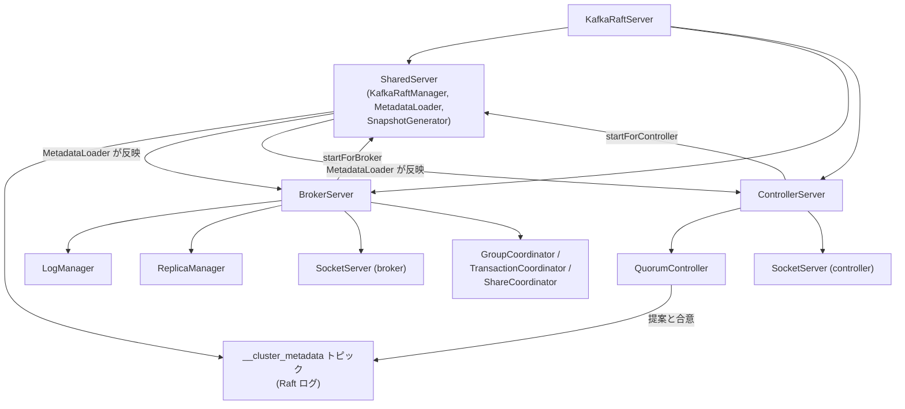

# 第1章 Kafka のアーキテクチャと KRaft 時代のブローカー起動

> **本章で読むソース**
>
> - [`core/src/main/scala/kafka/server/KafkaRaftServer.scala`](https://github.com/apache/kafka/blob/4.3.1/core/src/main/scala/kafka/server/KafkaRaftServer.scala)
> - [`core/src/main/scala/kafka/server/SharedServer.scala`](https://github.com/apache/kafka/blob/4.3.1/core/src/main/scala/kafka/server/SharedServer.scala)
> - [`core/src/main/scala/kafka/server/BrokerServer.scala`](https://github.com/apache/kafka/blob/4.3.1/core/src/main/scala/kafka/server/BrokerServer.scala)
> - [`core/src/main/scala/kafka/server/ControllerServer.scala`](https://github.com/apache/kafka/blob/4.3.1/core/src/main/scala/kafka/server/ControllerServer.scala)
> - [`server/src/main/java/org/apache/kafka/server/ProcessRole.java`](https://github.com/apache/kafka/blob/4.3.1/server/src/main/java/org/apache/kafka/server/ProcessRole.java)

## この章の狙い

Kafka 4.x はメタデータ管理から ZooKeeper を完全に取り除き、**KRaft**（Kafka Raft）と呼ぶ自前の Raft 実装でクラスタメタデータを管理する。
本章では、1台のプロセスが起動してからリクエストを受け付けられる状態になるまでに、どのサブシステムがどの順序で組み立てられるかを追う。
以後の章はいずれかのサブシステムを深掘りする構成になるため、本章はその地図の役割を持つ。

## 前提

読者は分散システムにおけるリーダー選出とレプリケーションの基礎、および JVM プロセスの起動シーケンスという概念に馴染みがあることを前提とする。
Kafka 固有の用語（パーティション、レプリカ、ISR）は本書の用語集に従って表記する。

## KRaft がクラスタメタデータをどう管理するか

Kafka 3.x までは、トピック一覧やパーティションの割り当て、ACL といったクラスタメタデータを ZooKeeper に格納していた。
ブローカーはメタデータを読み書きするたびに ZooKeeper との通信が発生し、ZooKeeper 自体も別プロセス群として運用しなければならなかった。

KRaft はこの構造を置き換える。
クラスタメタデータの変更を `__cluster_metadata` という名前の内部トピックに対するレコードとして表現し、そのトピックを Kafka 自身の Raft 実装でレプリケーションする。
ブローカーやコントローラーは、この内部トピックを他の一般トピックと同じログ機構で読み進め、レコードを1件ずつ適用してメタデータの状態を再構築する。
`KafkaRaftServer` オブジェクトは、この内部トピックの名前とパーティション番号を次のように定義している。

[`core/src/main/scala/kafka/server/KafkaRaftServer.scala L115-L118`](https://github.com/apache/kafka/blob/4.3.1/core/src/main/scala/kafka/server/KafkaRaftServer.scala#L115-L118)

```scala
object KafkaRaftServer {
  val MetadataTopic = Topic.CLUSTER_METADATA_TOPIC_NAME
  val MetadataPartition = Topic.CLUSTER_METADATA_TOPIC_PARTITION
  val MetadataTopicId = Uuid.METADATA_TOPIC_ID
```

## プロセスロールと `process.roles`

KRaft クラスタを構成するノードは、`process.roles` 設定で自分の役割を宣言する。
役割は次の2種類であり、`ProcessRole` という列挙型で表現される。

[`server/src/main/java/org/apache/kafka/server/ProcessRole.java L20-L23`](https://github.com/apache/kafka/blob/4.3.1/server/src/main/java/org/apache/kafka/server/ProcessRole.java#L20-L23)

```java
public enum ProcessRole {
    BrokerRole("broker"),
    ControllerRole("controller");
```

**ブローカー**役割はプロデューサーやコンシューマーからのリクエストを受け付け、パーティションのレプリカを保持する役割である。
**コントローラー**役割はクラスタメタデータの変更を提案し、Raft のクォーラムメンバーとして合意形成に参加する役割である。

小規模なクラスタでは、同じ設定ファイルで両方の役割を宣言し、1つの JVM プロセスに `BrokerServer` と `ControllerServer` を同居させる**組み合わせモード**（combined mode）を使うことが多い。
`KafkaRaftServer` はこの組み合わせを次のように構築する。

[`core/src/main/scala/kafka/server/KafkaRaftServer.scala L74-L88`](https://github.com/apache/kafka/blob/4.3.1/core/src/main/scala/kafka/server/KafkaRaftServer.scala#L74-L88)

```scala
  private val broker: Option[BrokerServer] = if (config.processRoles.contains(ProcessRole.BrokerRole)) {
    Some(new BrokerServer(sharedServer))
  } else {
    None
  }

  private val controller: Option[ControllerServer] = if (config.processRoles.contains(ProcessRole.ControllerRole)) {
    Some(new ControllerServer(
      sharedServer,
      KafkaRaftServer.configSchema,
      bootstrapMetadata,
    ))
  } else {
    None
  }
```

`broker` と `controller` はいずれも `Option` であり、設定に含まれない役割は単に `None` になる。
同じクラスが役割の有無に応じて生成対象を変えることで、専用モード（broker 単独、controller 単独）と組み合わせモードを1つの起動パスで扱える。

両者は `sharedServer` という単一のインスタンスを共有して構築される。
`SharedServer` は Raft クライアントやメタデータローダーなど、ブローカーとコントローラーの双方が必要とするコンポーネントをまとめて保持するクラスである。

## SharedServer が仲介する Raft とメタデータの反映

`SharedServer` のクラスコメントは、その役割を次のように説明している。

[`core/src/main/scala/kafka/server/SharedServer.scala L81-L94`](https://github.com/apache/kafka/blob/4.3.1/core/src/main/scala/kafka/server/SharedServer.scala#L81-L94)

```scala
/**
 * The SharedServer manages the components which are shared between the BrokerServer and
 * ControllerServer. These shared components include the Raft manager, snapshot generator,
 * and metadata loader. A KRaft server running in combined mode as both a broker and a controller
 * will still contain only a single SharedServer instance.
 *
 * The SharedServer will be started as soon as either the broker or the controller needs it,
 * via the appropriate function (startForBroker or startForController). Similarly, it will be
 * stopped as soon as neither the broker nor the controller need it, via stopForBroker or
 * stopForController. One way of thinking about this is that both the broker and the controller
 * could hold a "reference" to this class, and we don't truly stop it until both have dropped
 * their reference. We opted to use two booleans here rather than a reference count in order to
 * make debugging easier and reduce the chance of resource leaks.
 */
```

`SharedServer` は `usedByBroker` と `usedByController` という2個のブール値で参照状態を管理する。
`startForBroker` と `startForController` はどちらも「まだ誰にも使われていなければ実際に起動する」という条件分岐を経て、自分が使っている事実だけをフラグに記録する。

[`core/src/main/scala/kafka/server/SharedServer.scala L142-L170`](https://github.com/apache/kafka/blob/4.3.1/core/src/main/scala/kafka/server/SharedServer.scala#L142-L170)

```scala
  def startForBroker(): Unit = synchronized {
    if (!isUsed()) {
      start(Endpoints.empty())
    }
    usedByBroker = true
  }

  /**
   * The start function called by the controller.
   */
  def startForController(listenerInfo: ListenerInfo): Unit = synchronized {
    if (!isUsed()) {
      val endpoints = Endpoints.fromInetSocketAddresses(
        listenerInfo
          .listeners()
          .asScala
          .map { case (listenerName, endpoint) =>
            (
              ListenerName.normalised(listenerName),
              InetSocketAddress.createUnresolved(endpoint.host(), endpoint.port())
            )
          }
          .toMap
          .asJava
      )
      start(endpoints)
    }
    usedByController = true
  }
```

組み合わせモードでは `ControllerServer.startup()` が先に呼ばれるため、`SharedServer.start()` の実体はコントローラー側から一度だけ実行され、ブローカー側の `startForBroker()` は「すでに使われている」と判定してフラグの更新だけを行う。
`start()` の内部では `KafkaRaftManager` を生成して Raft クライアントを起動し、続けて `MetadataLoader` を組み立てて Raft クライアントに登録する。

[`core/src/main/scala/kafka/server/SharedServer.scala L291-L356`](https://github.com/apache/kafka/blob/4.3.1/core/src/main/scala/kafka/server/SharedServer.scala#L291-L356)

```scala
        val _raftManager = new KafkaRaftManager[ApiMessageAndVersion](
          clusterId,
          sharedServerConfig,
          metaPropsEnsemble.logDirProps.get(metaPropsEnsemble.metadataLogDir.get).directoryId.get,
          new MetadataRecordSerde,
          KafkaRaftServer.MetadataPartition,
          KafkaRaftServer.MetadataTopicId,
          time,
          metrics,
          externalKRaftMetrics,
          Some(s"kafka-${sharedServerConfig.nodeId}-raft"), // No dash expected at the end
          controllerQuorumVotersFuture,
          bootstrapServers,
          listenerEndpoints,
          raftManagerFaultHandler
        )
        raftManager = _raftManager
        _raftManager.startup()

        // ... (中略) ...
        val loaderBuilder = new MetadataLoader.Builder().
          setNodeId(nodeId).
          setTime(time).
          setThreadNamePrefix(s"kafka-${sharedServerConfig.nodeId}-").
          setFaultHandler(metadataLoaderFaultHandler).
          setHighWaterMarkAccessor(() => _raftManager.client.highWatermark()).
          setMetrics(metadataLoaderMetrics).
          setSupportedConfigChecker(supportedConfigChecker)
        loader = loaderBuilder.build()
        // ... (中略) ...
        _raftManager.client.register(loader)
```

`MetadataLoader` は Raft クライアントに登録された時点からコールバックを受け取り、`__cluster_metadata` トピックに書き込まれたレコードを順番に読み出す。
`BrokerServer` と `ControllerServer` は、この `loader` に対してそれぞれ**メタデータパブリッシャー**（`MetadataPublisher`）を登録することで、Raft ログの再生結果を自分のインメモリ状態（トピック一覧、ISR、クォータ設定など）へ反映させる。

## ブローカー起動シーケンスの俯瞰

`BrokerServer.startup()` は、ネットワーク層より前にログとレプリケーションの基盤を組み立て、最後にソケットを開く順序で進む。
まず `LogManager` を生成するが、この時点ではまだ `startup()` を呼ばない。

[`core/src/main/scala/kafka/server/BrokerServer.scala L211-L219`](https://github.com/apache/kafka/blob/4.3.1/core/src/main/scala/kafka/server/BrokerServer.scala#L211-L219)

```scala
      // Create log manager, but don't start it because we need to delay any potential unclean shutdown log recovery
      // until we catch up on the metadata log and have up-to-date topic and broker configs.
      logManager = LogManager(config,
        sharedServer.metaPropsEnsemble.errorLogDirs().asScala.toSeq,
        metadataCache,
        kafkaScheduler,
        time,
        brokerTopicStats,
        logDirFailureChannel)
```

コメントが示すとおり、ログの復旧処理をメタデータ反映より先に走らせると、まだ最新でないトピック設定やブローカー設定のもとで復旧してしまう恐れがある。
そのため `LogManager` の実際の起動は、後段でメタデータへの追随が完了してから行われる。

続けて `SocketServer` を生成する。
ここでも同様に、認証情報のロードより前にリクエスト処理を始めないよう、アクセプタスレッドの起動とリクエスト処理の有効化を分離している。

[`core/src/main/scala/kafka/server/BrokerServer.scala L271-L280`](https://github.com/apache/kafka/blob/4.3.1/core/src/main/scala/kafka/server/BrokerServer.scala#L271-L280)

```scala
      // Create and start the socket server acceptor threads so that the bound port is known.
      // Delay starting processors until the end of the initialization sequence to ensure
      // that credentials have been loaded before processing authentications.
      socketServer = new SocketServer(config,
        metrics,
        time,
        credentialProvider,
        apiVersionManager,
        sharedServer.socketFactory,
        connectionDisconnectListeners)
```

この後、`ReplicaManager`、`GroupCoordinator`、`TransactionCoordinator`、`ShareCoordinator` といったコーディネーター群が順に組み立てられる。

[`core/src/main/scala/kafka/server/BrokerServer.scala L347-L364`](https://github.com/apache/kafka/blob/4.3.1/core/src/main/scala/kafka/server/BrokerServer.scala#L347-L364)

```scala
      this._replicaManager = new ReplicaManager(
        config = config,
        metrics = metrics,
        time = time,
        scheduler = kafkaScheduler,
        logManager = logManager,
        remoteLogManager = remoteLogManagerOpt,
        quotaManagers = quotaManagers,
        metadataCache = metadataCache,
        logDirFailureChannel = logDirFailureChannel,
        alterPartitionManager = alterPartitionManager,
        brokerTopicStats = brokerTopicStats,
        delayedRemoteFetchPurgatoryParam = None,
        brokerEpochSupplier = () => lifecycleManager.brokerEpoch,
        addPartitionsToTxnManager = Some(addPartitionsToTxnManager),
        directoryEventHandler = directoryEventHandler,
        defaultActionQueue = defaultActionQueue
      )
```

`ReplicaManager` はレプリケーションの中核であり、`LogManager` を経由してパーティションのログを読み書きし、`AlterPartitionManager` を通じて ISR の変更をコントローラーに伝える。
その後 `KafkaApis`（リクエストを実際に処理するディスパッチャ）と、それを動かすリクエストハンドラプールが組み立てられる。

すべてのコンポーネントが揃った段階で、`BrokerMetadataPublisher` を含む一連のメタデータパブリッシャーを `sharedServer.loader` にインストールする。

[`core/src/main/scala/kafka/server/BrokerServer.scala L554-L557`](https://github.com/apache/kafka/blob/4.3.1/core/src/main/scala/kafka/server/BrokerServer.scala#L554-L557)

```scala
      // Install all the metadata publishers.
      FutureUtils.waitWithLogging(logger.underlying, logIdent,
        "the broker metadata publishers to be installed",
        sharedServer.loader.installPublishers(metadataPublishers), startupDeadline, time)
```

インストール後、ブローカーはコントローラーに登録され（`BrokerLifecycleManager`）、メタデータログの高水準マーク（High Watermark）まで読み進んでから初回のメタデータ反映を待つ。

[`core/src/main/scala/kafka/server/BrokerServer.scala L566-L573`](https://github.com/apache/kafka/blob/4.3.1/core/src/main/scala/kafka/server/BrokerServer.scala#L566-L573)

```scala
      // Wait for the first metadata update to be published. Metadata updates are not published
      // until we read at least up to the high water mark of the cluster metadata partition.
      // Usually, we publish the initial metadata before lifecycleManager.initialCatchUpFuture
      // is completed, so this check is not necessary. But this is a simple check to make
      // completely sure.
      FutureUtils.waitWithLogging(logger.underlying, logIdent,
        "the initial broker metadata update to be published",
        brokerMetadataPublisher.firstPublishFuture , startupDeadline, time)
```

この待ち合わせを終えて初めて、ブローカーは「フェンス解除可能」（unfence）な状態へ遷移し、`socketServer.enableRequestProcessing()` によって実際にクライアントからの接続を受け付け始める。
起動の最後には、リモートログマネージャー（有効化している場合）へ準備完了を通知する。

## コントローラー起動シーケンスの俯瞰

`ControllerServer.startup()` はブローカーと似た構造を持つが、中心となるコンポーネントは Raft ログへの書き込みを担う `QuorumController` である。
まず `SocketServer` を生成して待受ポートを確定し、続けて `sharedServer.startForController(listenerInfo)` を呼び出して `SharedServer` を起動する。

[`core/src/main/scala/kafka/server/ControllerServer.scala L175-L199`](https://github.com/apache/kafka/blob/4.3.1/core/src/main/scala/kafka/server/ControllerServer.scala#L175-L199)

```scala
      socketServer = new SocketServer(config,
        metrics,
        time,
        credentialProvider,
        apiVersionManager,
        sharedServer.socketFactory)

      val listenerInfo = ListenerInfo
        .create(config.effectiveAdvertisedControllerListeners.asJava)
        .withWildcardHostnamesResolved()
        .withEphemeralPortsCorrected(name => socketServer.boundPort(new ListenerName(name)))
      socketServerFirstBoundPortFuture.complete(listenerInfo.firstListener().port())

      // ... (中略) ...

      sharedServer.startForController(listenerInfo)
```

`KafkaRaftServer.startup()` はコントローラーをブローカーより先に起動するようコメントで明示しており、これは組み合わせモードにおいて `SharedServer` の実際の起動をコントローラー側の呼び出しで発生させ、Raft クライアントにコントローラーのリスナー情報を渡すためである。

[`core/src/main/scala/kafka/server/KafkaRaftServer.scala L90-L98`](https://github.com/apache/kafka/blob/4.3.1/core/src/main/scala/kafka/server/KafkaRaftServer.scala#L90-L98)

```scala
  override def startup(): Unit = {
    Mx4jLoader.maybeLoad()
    // Controller component must be started before the broker component so that
    // the controller endpoints are passed to the KRaft manager
    controller.foreach(_.startup())
    broker.foreach(_.startup())
    AppInfoParser.registerAppInfo(Server.MetricsPrefix, config.brokerId.toString, metrics, time.milliseconds())
    info(KafkaBroker.STARTED_MESSAGE)
  }
```

`SharedServer` の起動に続いて `QuorumController` が組み立てられる。
`QuorumController.Builder` には Raft クライアント、クォーラムの構成（`QuorumFeatures`）、デフォルトのレプリケーション係数やパーティション数、リーダー不均衡の自動是正間隔などが設定される。

[`core/src/main/scala/kafka/server/ControllerServer.scala L235-L263`](https://github.com/apache/kafka/blob/4.3.1/core/src/main/scala/kafka/server/ControllerServer.scala#L235-L263)

```scala
        new QuorumController.Builder(config.nodeId, sharedServer.clusterId).
          setTime(time).
          setThreadNamePrefix(s"quorum-controller-${config.nodeId}-").
          setConfigSchema(configSchema).
          setRaftClient(raftManager.client).
          setQuorumFeatures(quorumFeatures).
          setDefaultReplicationFactor(config.defaultReplicationFactor.toShort).
          setDefaultNumPartitions(config.numPartitions.intValue()).
          setSessionTimeoutNs(TimeUnit.NANOSECONDS.convert(config.brokerSessionTimeoutMs.longValue(),
            TimeUnit.MILLISECONDS)).
          setLeaderImbalanceCheckIntervalNs(leaderImbalanceCheckIntervalNs).
          setMaxIdleIntervalNs(maxIdleIntervalNs).
          setMetrics(quorumControllerMetrics).
          setCreateTopicPolicy(createTopicPolicy.toJava).
          setAlterConfigPolicy(alterConfigPolicy.toJava).
          setConfigurationValidator(new ControllerConfigurationValidator(sharedServer.brokerConfig)).
          setSupportedConfigChecker(sharedServer.supportedConfigChecker).
          setStaticConfig(config.originals).
          setBootstrapMetadata(bootstrapMetadata).
          setFatalFaultHandler(sharedServer.fatalQuorumControllerFaultHandler).
          setNonFatalFaultHandler(sharedServer.nonFatalQuorumControllerFaultHandler).
          // ... (中略) ...
      }
      controller = controllerBuilder.build()
```

以後、コントローラー宛のリクエストを処理する `ControllerApis` と、そのリクエストハンドラプールが組み立てられ、`KRaftMetadataCachePublisher` や `AclPublisher` などのメタデータパブリッシャー群が `sharedServer.loader` にインストールされる。
ブローカーとコントローラーは、同じ Raft ログを別々のパブリッシャー集合で受け取り、それぞれ自分の役割に必要な部分だけをインメモリ状態に反映する。

## 全体構成の可視化



図が示すとおり、`BrokerServer` と `ControllerServer` は互いを直接参照しない。
両者は `SharedServer` が保持する Raft ログとメタデータローダーだけを共有し、それぞれ独立にパブリッシャーを登録して自分の状態を組み立てる。

## まとめ

Kafka 4.x は ZooKeeper との往復をなくし、クラスタメタデータの変更を `__cluster_metadata` トピックへのレコード書き込みとして扱う。
ブローカーとコントローラーはこの Raft ログをそれぞれのメタデータパブリッシャーで再生することで、状態を構築する。
`process.roles` によって役割を宣言する設計により、`KafkaRaftServer` は1つの起動パスで専用モードと組み合わせモードの両方を扱い、`SharedServer` が両者に共通する Raft マネージャーとメタデータローダーを仲介する。
ブローカー側は `LogManager` の復旧処理とソケットのリクエスト処理開始をメタデータへの追随完了まで遅らせ、コントローラー側は `QuorumController` を通じてメタデータ変更の提案そのものを担う。

## 関連する章

- [第2章 SocketServer](../part01-network/02-socketserver.md)
- [第17章 KafkaRaftClient](../part05-kraft/17-raft-client.md)
- [第18章 QuorumController](../part05-kraft/18-quorum-controller.md)
