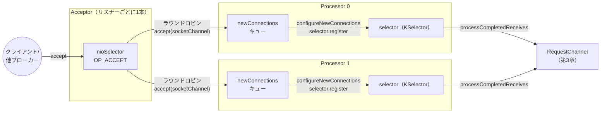

# 第2章 SocketServer とリアクター（Acceptor と Processor）

> **本章で読むソース**
>
> - [`core/src/main/scala/kafka/network/SocketServer.scala`](https://github.com/apache/kafka/blob/4.3.1/core/src/main/scala/kafka/network/SocketServer.scala)

## この章の狙い

ブローカーはクライアントやほかのブローカーから、常に大量の TCP 接続を受け付ける。
本章では、その受け口である`SocketServer`が、接続の受け付けとリクエストの読み取りをどのようにスレッド間で分担しているかを読む。
`Acceptor`と`Processor`という2種類のスレッドが連携する構造を追い、接続がどのように割り当てられ、リクエストがどこまで運ばれて次章の`RequestChannel`に渡るかを確認する。

## 前提

Java NIO の`Selector`は、複数のソケットチャネルの読み書き可能状態を1スレッドでまとめて監視する仕組みである。
`SocketServer.scala`のクラス冒頭コメントは、ブローカーのスレッドモデルを次のように要約している。

[`core/src/main/scala/kafka/network/SocketServer.scala L60-L70`](https://github.com/apache/kafka/blob/4.3.1/core/src/main/scala/kafka/network/SocketServer.scala#L60-L70)

```scala
/**
 * Handles new connections, requests and responses to and from broker.
 * Kafka supports two types of request planes :
 *  - data-plane :
 *    - Handles requests from clients and other brokers in the cluster.
 *    - The threading model is
 *      1 Acceptor thread per listener, that handles new connections.
 *      It is possible to configure multiple data-planes by specifying multiple "," separated endpoints for "listeners" in KafkaConfig.
 *      Acceptor has N Processor threads that each have their own selector and read requests from sockets
 *      M Handler threads that handle requests and produce responses back to the processor threads for writing.
 */
```

リスナー（`listeners`設定に列挙されたエンドポイント）ごとに1本の`Acceptor`スレッドが起動し、その配下に複数の`Processor`スレッドがぶら下がる。
`Acceptor`は新規接続の受け付けだけを担当し、受け付けた接続を`Processor`に配って以後の読み書きを任せる。
この役割分担が、1 Acceptor + 複数 Processor という**リアクターパターン**である。

## リスナーの種類とプロセッサーの生成

4.3.1 は KRaft 専用であり、ブローカー用のリスナーとコントローラー用のリスナーを`ListenerType`で区別する。

[`core/src/main/scala/kafka/network/SocketServer.scala L142-L150`](https://github.com/apache/kafka/blob/4.3.1/core/src/main/scala/kafka/network/SocketServer.scala#L142-L150)

```scala
  // Create acceptors and processors for the statically configured endpoints when the
  // SocketServer is constructed. Note that this just opens the ports and creates the data
  // structures. It does not start the acceptors and processors or their associated JVM
  // threads.
  if (apiVersionManager.listenerType.equals(ListenerType.CONTROLLER)) {
    config.controllerListeners.foreach(createDataPlaneAcceptorAndProcessors)
  } else {
    config.dataPlaneListeners.foreach(createDataPlaneAcceptorAndProcessors)
  }
```

`apiVersionManager.listenerType`がコントローラープロセスであれば`config.controllerListeners`を、ブローカープロセスであれば`config.dataPlaneListeners`を使う。
本書はこの区別を**data-plane**と呼ぶ。
どちらの場合も生成される`Acceptor`と`Processor`の実装は共通であり、`createDataPlaneAcceptorAndProcessors`が呼ばれる。

[`core/src/main/scala/kafka/network/SocketServer.scala L213-L226`](https://github.com/apache/kafka/blob/4.3.1/core/src/main/scala/kafka/network/SocketServer.scala#L213-L226)

```scala
  private def createDataPlaneAcceptorAndProcessors(endpoint: Endpoint): Unit = synchronized {
    if (stopped) {
      throw new RuntimeException("Can't create new data plane acceptor and processors: SocketServer is stopped.")
    }
    val listenerName =  ListenerName.normalised(endpoint.listener)
    val parsedConfigs = config.valuesFromThisConfigWithPrefixOverride(listenerName.configPrefix)
    connectionQuotas.addListener(config, listenerName)
    val isPrivilegedListener = config.interBrokerListenerName == listenerName
    val dataPlaneAcceptor = createDataPlaneAcceptor(endpoint, isPrivilegedListener, dataPlaneRequestChannel)
    config.addReconfigurable(dataPlaneAcceptor)
    dataPlaneAcceptor.configure(parsedConfigs)
    dataPlaneAcceptors.put(endpoint, dataPlaneAcceptor)
    info(s"Created data-plane acceptor and processors for endpoint : ${listenerName}")
  }
```

エンドポイントごとに`connectionQuotas`へリスナーを登録し、`DataPlaneAcceptor`を1つ生成して`dataPlaneAcceptors`マップに保持する。
`isPrivilegedListener`は、そのリスナーがブローカー間通信用のリスナー（`inter.broker.listener.name`）と一致するかどうかを示すフラグであり、`Processor`が`RequestContext`を組み立てる際に転送要求の扱いを決めるのに使われる。

## Acceptor がソケットを受け付ける

`Acceptor`は自前の NIO `Selector`を持ち、`OP_ACCEPT`イベントだけを監視する。

[`core/src/main/scala/kafka/network/SocketServer.scala L620-L658`](https://github.com/apache/kafka/blob/4.3.1/core/src/main/scala/kafka/network/SocketServer.scala#L620-L658)

```scala
  /**
   * Listen for new connections and assign accepted connections to processors using round-robin.
   */
  private def acceptNewConnections(): Unit = {
    val ready = nioSelector.select(500)
    if (ready > 0) {
      val keys = nioSelector.selectedKeys()
      val iter = keys.iterator()
      while (iter.hasNext && shouldRun.get()) {
        try {
          val key = iter.next
          iter.remove()

          if (key.isAcceptable) {
            accept(key).foreach { socketChannel =>
              // Assign the channel to the next processor (using round-robin) to which the
              // channel can be added without blocking. If newConnections queue is full on
              // all processors, block until the last one is able to accept a connection.
              var retriesLeft = synchronized(processors.length)
              var processor: Processor = null
              do {
                retriesLeft -= 1
                processor = synchronized {
                  // adjust the index (if necessary) and retrieve the processor atomically for
                  // correct behaviour in case the number of processors is reduced dynamically
                  currentProcessorIndex = currentProcessorIndex % processors.length
                  processors(currentProcessorIndex)
                }
                currentProcessorIndex += 1
              } while (!assignNewConnection(socketChannel, processor, retriesLeft == 0))
            }
          } else
            throw new IllegalStateException("Unrecognized key state for acceptor thread.")
        } catch {
          case e: Throwable => error("Error while accepting connection", e)
        }
      }
    }
  }
```

500ミリ秒のタイムアウト付きで`select`し、`OP_ACCEPT`が発火したキーごとに`accept(key)`で`SocketChannel`を取り出す。
その後、`currentProcessorIndex`を`processors`の要素数で割った余りに使い、次に割り当てる`Processor`を**ラウンドロビン**で選ぶ。
選んだ`Processor`の受付キューが満杯で`assignNewConnection`が`false`を返すと、`currentProcessorIndex`を進めて次の`Processor`を試す。
`retriesLeft`が0になる、つまり全`Processor`を1周してもキューに空きがなければ、最後の`assignNewConnection`呼び出しで`mayBlock = true`を渡し、空きができるまでブロックして確実に受け渡す。

`accept(key)`自身は、接続数の上限（`connectionQuotas.inc`）に達していないかを確認したうえでチャネルを`configureAcceptedSocketChannel`に渡す。

[`core/src/main/scala/kafka/network/SocketServer.scala L663-L687`](https://github.com/apache/kafka/blob/4.3.1/core/src/main/scala/kafka/network/SocketServer.scala#L663-L687)

```scala
  private def accept(key: SelectionKey): Option[SocketChannel] = {
    val serverSocketChannel = key.channel().asInstanceOf[ServerSocketChannel]
    val socketChannel = serverSocketChannel.accept()
    val listenerName = ListenerName.normalised(endPoint.listener)
    try {
      connectionQuotas.inc(listenerName, socketChannel.socket.getInetAddress, blockedPercentMeter)
      configureAcceptedSocketChannel(socketChannel)
      Some(socketChannel)
    } catch {
      case e: TooManyConnectionsException =>
        info(s"Rejected connection from ${e.ip}, address already has the configured maximum of ${e.count} connections.")
        connectionQuotas.closeChannel(this, listenerName, socketChannel)
        None
      case e: ConnectionThrottledException =>
        val ip = socketChannel.socket.getInetAddress
        debug(s"Delaying closing of connection from $ip for ${e.throttleTimeMs} ms")
        val endThrottleTimeMs = e.startThrottleTimeMs + e.throttleTimeMs
        throttledSockets += DelayedCloseSocket(socketChannel, endThrottleTimeMs)
        None
      case e: IOException =>
        error(s"Encountered an error while configuring the connection, closing it.", e)
        connectionQuotas.closeChannel(this, listenerName, socketChannel)
        None
    }
  }
```

上限を超えた接続元には`TooManyConnectionsException`が発生し、その場でチャネルを閉じて拒絶する。
1 IP あたりの接続生成レート（`ConnectionThrottledException`）に違反した接続は即座には閉じず、`throttledSockets`という優先度付きキューに積んで、スロットリング時間が経過してから`closeThrottledConnections`が閉じる。
接続を即座に拒否せず一定時間だけ遅延させることで、クライアントが再接続を無限に連射する事態を防いでいる。

`Processor`への割り当ては`assignNewConnection`が仲介する。

[`core/src/main/scala/kafka/network/SocketServer.scala L709-L718`](https://github.com/apache/kafka/blob/4.3.1/core/src/main/scala/kafka/network/SocketServer.scala#L709-L718)

```scala
  private def assignNewConnection(socketChannel: SocketChannel, processor: Processor, mayBlock: Boolean): Boolean = {
    if (processor.accept(socketChannel, mayBlock, blockedPercentMeter)) {
      debug(s"Accepted connection from ${socketChannel.socket.getRemoteSocketAddress} on" +
        s" ${socketChannel.socket.getLocalSocketAddress} and assigned it to processor ${processor.id}," +
        s" sendBufferSize [actual|requested]: [${socketChannel.socket.getSendBufferSize}|$sendBufferSize]" +
        s" recvBufferSize [actual|requested]: [${socketChannel.socket.getReceiveBufferSize}|$recvBufferSize]")
      true
    } else
      false
  }
```

`processor.accept`が呼ぶのは、`Processor`側の受付キュー`newConnections`への`offer`である。
`Acceptor`はこのキューに`SocketChannel`を渡すだけで、実際にチャネルを`Selector`へ登録する作業は`Processor`自身のスレッドが行う。

## Processor がリクエストを読み取る

`Processor`は接続ごとに専用の`Selector`を持つのではなく、担当する全接続をまとめて1つの`KSelector`（`org.apache.kafka.common.network.Selector`）で多重化する。

[`core/src/main/scala/kafka/network/SocketServer.scala L849-L861`](https://github.com/apache/kafka/blob/4.3.1/core/src/main/scala/kafka/network/SocketServer.scala#L849-L861)

```scala
  private[network] val selector = createSelector(
    ChannelBuilders.serverChannelBuilder(
      listenerName,
      listenerName == config.interBrokerListenerName,
      securityProtocol,
      config,
      credentialProvider.credentialCache,
      credentialProvider.tokenCache,
      time,
      logContext,
      version => apiVersionManager.apiVersionResponse(0, version < 4)
    )
  )
```

`Acceptor`からキューに積まれた接続を実際に登録し、リクエストの読み書きを進めるメインループが`run`である。

[`core/src/main/scala/kafka/network/SocketServer.scala L889-L916`](https://github.com/apache/kafka/blob/4.3.1/core/src/main/scala/kafka/network/SocketServer.scala#L889-L916)

```scala
  override def run(): Unit = {
    try {
      while (shouldRun.get()) {
        try {
          // setup any new connections that have been queued up
          configureNewConnections()
          // register any new responses for writing
          processNewResponses()
          poll()
          processCompletedReceives()
          processCompletedSends()
          processDisconnected()
          closeExcessConnections()
        } catch {
          // We catch all the throwables here to prevent the processor thread from exiting. We do this because
          // letting a processor exit might cause a bigger impact on the broker. This behavior might need to be
          // reviewed if we see an exception that needs the entire broker to stop. Usually the exceptions thrown would
          // be either associated with a specific socket channel or a bad request. These exceptions are caught and
          // processed by the individual methods above which close the failing channel and continue processing other
          // channels. So this catch block should only ever see ControlThrowables.
          case e: Throwable => processException("Processor got uncaught exception.", e)
        }
      }
    } finally {
      debug(s"Closing selector - processor $id")
      Utils.swallow(this.logger.underlying, Level.ERROR, () => closeAll())
    }
  }
```

1周のループは、新規接続の登録、送信済みレスポンスの後始末、`poll`によるイベント多重化、受信完了と送信完了と切断の処理、そして接続数超過時のチャネル整理という6段階を順に回す。
例外は`ControlThrowable`以外すべてこの`try`節でキャッチし、1つのチャネルで起きた異常が`Processor`スレッド全体を落とさないようにしている。

新規接続の登録は`configureNewConnections`が行う。

[`core/src/main/scala/kafka/network/SocketServer.scala L1163-L1185`](https://github.com/apache/kafka/blob/4.3.1/core/src/main/scala/kafka/network/SocketServer.scala#L1163-L1185)

```scala
  /**
   * Register any new connections that have been queued up. The number of connections processed
   * in each iteration is limited to ensure that traffic and connection close notifications of
   * existing channels are handled promptly.
   */
  private def configureNewConnections(): Unit = {
    var connectionsProcessed = 0
    while (connectionsProcessed < connectionQueueSize && !newConnections.isEmpty) {
      val channel = newConnections.poll()
      try {
        debug(s"Processor $id listening to new connection from ${channel.socket.getRemoteSocketAddress}")
        selector.register(connectionId(channel.socket), channel)
        connectionsProcessed += 1
      } catch {
        // We explicitly catch all exceptions and close the socket to avoid a socket leak.
        case e: Throwable =>
          val remoteAddress = channel.socket.getRemoteSocketAddress
          // need to close the channel here to avoid a socket leak.
          connectionQuotas.closeChannel(this, listenerName, channel)
          processException(s"Processor $id closed connection from $remoteAddress", e)
      }
    }
  }
```

1周あたりに登録する接続数を`connectionQueueSize`（既定値`20`、`Processor.ConnectionQueueSize`）で打ち切る。
新規接続の登録に際限をつけず`newConnections`を空になるまで処理してしまうと、大量の接続が同時に来た瞬間だけ既存接続の読み書きが後回しになり、レイテンシが偏る。
1周あたりの登録数に上限を設けることで、新規接続の受け入れと既存接続の応答性を交互に確保している。

読み取り済みのリクエストは`processCompletedReceives`が`RequestChannel`へ渡す。

[`core/src/main/scala/kafka/network/SocketServer.scala L1002-L1044`](https://github.com/apache/kafka/blob/4.3.1/core/src/main/scala/kafka/network/SocketServer.scala#L1002-L1044)

```scala
  private def processCompletedReceives(): Unit = {
    selector.completedReceives.forEach { receive =>
      var header: RequestHeader = null
      var req: RequestChannel.Request = null
      try {
        openOrClosingChannel(receive.source) match {
          case Some(channel) =>
            header = parseRequestHeader(apiVersionManager, receive.payload)
            if (header.apiKey == ApiKeys.SASL_HANDSHAKE && channel.maybeBeginServerReauthentication(receive,
              () => time.nanoseconds()))
              trace(s"Begin re-authentication: $channel")
            else {
              val nowNanos = time.nanoseconds()
              if (channel.serverAuthenticationSessionExpired(nowNanos)) {
                // be sure to decrease connection count and drop any in-flight responses
                debug(s"Disconnecting expired channel: $channel : $header")
                close(channel.id)
                receive.close() // return buffer to memory pool
                expiredConnectionsKilledCount.record(null, 1, 0)
              } else {
                val connectionId = receive.source
                val context = new RequestContext(header, connectionId, channel.socketAddress, Optional.of(channel.socketPort()),
                  channel.principal, listenerName, securityProtocol, channel.channelMetadataRegistry.clientInformation,
                  isPrivilegedListener, channel.principalSerde)

                req = new RequestChannel.Request(processor = id, context = context,
                  startTimeNanos = nowNanos, memoryPool, receive.payload, requestChannel.metrics, None)

                // KIP-511: ApiVersionsRequest is intercepted here to catch the client software name
                // and version. It is done here to avoid wiring things up to the api layer.
                if (header.apiKey == ApiKeys.API_VERSIONS) {
                  val apiVersionsRequest = req.body[ApiVersionsRequest]
                  if (apiVersionsRequest.isValid) {
                    channel.channelMetadataRegistry.registerClientInformation(new ClientInformation(
                      apiVersionsRequest.data.clientSoftwareName,
                      apiVersionsRequest.data.clientSoftwareVersion))
                  }
                }
                requestChannel.sendRequest(req)
                selector.mute(connectionId)
                handleChannelMuteEvent(connectionId, ChannelMuteEvent.REQUEST_RECEIVED)
              }
            }
          case None =>
            // This should never happen since completed receives are processed immediately after `poll()`
            throw new IllegalStateException(s"Channel ${receive.source} removed from selector before processing completed receive")
        }
      } catch {
        // note that even though we got an exception, we can assume that receive.source is valid.
        // Issues with constructing a valid receive object were handled earlier
        case e: Throwable =>
          if (header == null || req == null) {
             receive.close() // return buffer to memory pool
          }
          processChannelException(receive.source, s"Exception while processing request from ${receive.source}", e)
      }
    }
    selector.clearCompletedReceives()
  }
```

`selector.completedReceives`で取得できる、読み終わったバイト列を`parseRequestHeader`でヘッダとして解釈し、`RequestContext`と`RequestChannel.Request`を組み立てて`requestChannel.sendRequest(req)`で第3章の`RequestChannel`へ橋渡しする。
その直後に`selector.mute(connectionId)`で当該チャネルの読み取りを止める点が要である。
1つの接続から次のリクエストを読み取るのは、現在のリクエストに対するレスポンスが返り終わってからにする、つまり1接続内でリクエストの処理順序を保証するための仕組みであり、`processNewResponses`が`NoOpResponse`や`SendResponse`を処理する際に`tryUnmuteChannel`で解除される。

## Acceptor と Processor と RequestChannel の関係

ここまでの流れを図にする。



`Acceptor`は接続の受け付けとラウンドロビンの割り当てだけを行い、実際の読み書きは各`Processor`が自分の`newConnections`キューと`selector`で完結させる。
両者の間を橋渡しするのはキューだけであり、`Acceptor`のスレッドが`Processor`内部の状態へ直接触れることはない。

## 最適化の工夫

`Processor`ごとに独立した`KSelector`を持たせている構造そのものが、本章で扱う最大の最適化である。
仮に全接続を1つの`Selector`で受け持つ設計にすると、CPU コア数を増やしても1本のスレッドがイベント多重化の処理を捌ききれず、コア数に応じたスループット向上が頭打ちになる。
`Processor`の数をリスナーごとに`num.network.threads`で設定できるようにし、各`Processor`が自分の`selector`を単独で`poll`することで、複数の CPU コアがそれぞれ別の接続集合を並行して処理できる。
接続をどの`Processor`に渡すかを`Acceptor`が一度決めてしまえば、以後その接続の読み書きは他の`Processor`のロックと競合しない。
ラウンドロビン割り当ては、この接続の粘着性（同じ接続は同じ`Processor`が扱い続ける性質）を保ちながら、`Processor`間の負荷をならす役割を果たしている。

## まとめ

`SocketServer`は、リスナーごとに1本の`Acceptor`スレッドと、その配下に複数の`Processor`スレッドを配置するリアクター構成でブローカーのネットワーク層を実装している。
`Acceptor`は`OP_ACCEPT`だけを監視して新規接続を受け付け、`newConnections`というキューを介してラウンドロビンで`Processor`に橋渡しする。
`Processor`は自身専用の`KSelector`で担当接続を多重化し、読み取ったリクエストを`RequestContext`に包んで`RequestChannel.sendRequest`に渡したあと、レスポンスが返るまでそのチャネルの読み取りを`mute`する。
`Processor`ごとに`Selector`を分離する構造が、複数 CPU コアを使ったスループットの向上を支えている。

## 関連する章

- 第3章 [RequestChannel と KafkaRequestHandler](03-request-pipeline.md) では、`requestChannel.sendRequest`で渡された`RequestChannel.Request`をハンドラースレッドがどう取り出し、処理するかを読む。
- 第4章 [KafkaApis](04-kafkaapis.md) では、ハンドラーが取り出したリクエストをAPIごとにどう処理するかを読む。
