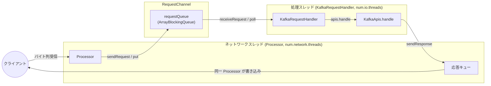

# 第3章 RequestChannel と KafkaRequestHandler の処理パイプライン

> **本章で読むソース**
>
> - [`core/src/main/scala/kafka/network/RequestChannel.scala`](https://github.com/apache/kafka/blob/4.3.1/core/src/main/scala/kafka/network/RequestChannel.scala)
> - [`core/src/main/scala/kafka/server/KafkaRequestHandler.scala`](https://github.com/apache/kafka/blob/4.3.1/core/src/main/scala/kafka/server/KafkaRequestHandler.scala)

## この章の狙い

第2章では、`SocketServer` の `Processor` が TCP ソケットからバイト列を読み書きするネットワークスレッドであることを見た。
`Processor` はリクエストを読み終えても、その場でトピックのメタデータを引いたり、ログに書き込んだりはしない。
そうした処理はブローカーの本体である `KafkaApis` に委ねられ、`Processor` は次の接続の読み書きに戻る。

本章では、ネットワークスレッドと処理スレッドを橋渡しする `RequestChannel` のキュー、そのキューから取り出して `KafkaApis` を呼び出す `KafkaRequestHandler` のループを読む。
両者を合わせて、リクエストが受信されてから応答が送信されるまでの一巡を追う。

## 前提

`Processor` はコネクションごとにノンブロッキングな `Selector` を1つ持ち、複数のコネクションを1スレッドで多重化する。
これに対して `KafkaRequestHandler` は固定数のスレッドプールであり、1リクエストの処理中はそのスレッドを占有する。
性質の異なる2種類のスレッドを疎結合にする層が `RequestChannel` である。

## RequestChannel.Request とタイムスタンプ

`RequestChannel.Request` は、1件のリクエストの実体と、その処理時間を計測するための一連のタイムスタンプを持つクラスである。

[`core/src/main/scala/kafka/network/RequestChannel.scala L64-L83`](https://github.com/apache/kafka/blob/4.3.1/core/src/main/scala/kafka/network/RequestChannel.scala#L64-L83)

```scala
  class Request(val processor: Int,
                val context: RequestContext,
                val startTimeNanos: Long,
                val memoryPool: MemoryPool,
                @volatile var buffer: ByteBuffer,
                metrics: RequestChannelMetrics,
                val envelope: Option[RequestChannel.Request] = None) extends BaseRequest {
    // These need to be volatile because the readers are in the network thread and the writers are in the request
    // handler threads or the purgatory threads
    @volatile var requestDequeueTimeNanos: Long = -1L
    @volatile var apiLocalCompleteTimeNanos: Long = -1L
    @volatile var responseCompleteTimeNanos: Long = -1L
    @volatile var responseDequeueTimeNanos: Long = -1L
    @volatile var messageConversionsTimeNanos: Long = 0L
    @volatile var apiThrottleTimeMs: Long = 0L
    @volatile var temporaryMemoryBytes: Long = 0L
    @volatile var recordNetworkThreadTimeCallback: Option[java.util.function.Consumer[java.lang.Long]] = None
    @volatile var callbackRequestDequeueTimeNanos: Option[Long] = None
    @volatile var callbackRequestCompleteTimeNanos: Option[Long] = None
```

コメントにあるとおり、これらのフィールドはネットワークスレッド（`Processor`）とリクエストハンドラースレッドの双方から読み書きされる。
`Request` インスタンス自体が2種類のスレッドの間で受け渡される共有オブジェクトであるため、フィールドは`@volatile`で宣言され、書き込みが即座に他スレッドから見えるようにしてある。

`startTimeNanos` はキューに投入される直前の時刻であり、`requestDequeueTimeNanos` はリクエストハンドラーがキューから取り出した時刻である。
両者の差が、後述するキュー内での滞留時間になる。

## requestQueue によるキュー投入と取り出し

`RequestChannel` は固定長の`ArrayBlockingQueue`を1つ持ち、これが`Processor`群と`KafkaRequestHandler`群の唯一の合流点になる。

[`core/src/main/scala/kafka/network/RequestChannel.scala L353-L355`](https://github.com/apache/kafka/blob/4.3.1/core/src/main/scala/kafka/network/RequestChannel.scala#L353-L355)

```scala
  private val requestQueue = new ArrayBlockingQueue[BaseRequest](queueSize)
  private val processors = new ConcurrentHashMap[Int, Processor]()
  private val callbackQueue = new ArrayBlockingQueue[BaseRequest](queueSize)
```

`Processor`はリクエストを読み終えると`sendRequest`を呼ぶ。

[`core/src/main/scala/kafka/network/RequestChannel.scala L378-L381`](https://github.com/apache/kafka/blob/4.3.1/core/src/main/scala/kafka/network/RequestChannel.scala#L378-L381)

```scala
  /** Send a request to be handled, potentially blocking until there is room in the queue for the request */
  def sendRequest(request: RequestChannel.Request): Unit = {
    requestQueue.put(request)
  }
```

`put`は容量`queueSize`に達している間はブロックする。
つまり`requestQueue`が満杯であれば、それを埋めたコネクションを担当する`Processor`はここで止まり、他のコネクションの読み書きも進められなくなる。
これは`queueSize`（`queued.max.requests`設定に対応する）の設計上の帰結であり、キューの詰まりがネットワークスレッドにまで波及しうることを意味する。

2種類のスレッドが`requestQueue`と応答キューを挟んで疎結合になる様子を図に示す。



取り出し側の`KafkaRequestHandler`は`receiveRequest`を呼ぶ。

[`core/src/main/scala/kafka/network/RequestChannel.scala L461-L479`](https://github.com/apache/kafka/blob/4.3.1/core/src/main/scala/kafka/network/RequestChannel.scala#L461-L479)

```scala
  /** Get the next request or block until specified time has elapsed
   *  Check the callback queue and execute first if present since these
   *  requests have already waited in line. */
  def receiveRequest(timeout: Long): RequestChannel.BaseRequest = {
    val callbackRequest = callbackQueue.poll()
    if (callbackRequest != null)
      callbackRequest
    else {
      val request = requestQueue.poll(timeout, TimeUnit.MILLISECONDS)
      request match {
        case WakeupRequest => callbackQueue.poll()
        case _ => request
      }
    }
  }

  /** Get the next request or block until there is one */
  def receiveRequest(): RequestChannel.BaseRequest =
    requestQueue.take()
```

`callbackQueue`は、パージトリー（第16章で扱う遅延処理の仕組み）などで一度中断した処理を、後から任意のリクエストハンドラースレッドへ再スケジュールするための別キューである。
`receiveRequest`はまず`callbackQueue`を優先してポーリングする。
コメントにあるとおり、コールバックは「すでに列に並んで待った」リクエストの続きであるため、新規リクエストより先に処理する。

## KafkaRequestHandler の実行ループ

`KafkaRequestHandler`は`Runnable`であり、スレッドプール内の1本のスレッドに対応する。
`run`メソッドは`stopped`になるまで無限ループし、`receiveRequest`でキューから1件取り出しては処理する。

[`core/src/main/scala/kafka/server/KafkaRequestHandler.scala L105-L121`](https://github.com/apache/kafka/blob/4.3.1/core/src/main/scala/kafka/server/KafkaRequestHandler.scala#L105-L121)

```scala
  def run(): Unit = {
    threadRequestChannel.set(requestChannel)
    while (!stopped) {
      // We use a single meter for aggregate idle percentage for the thread pool.
      // Since meter is calculated as total_recorded_value / time_window and
      // time_window is independent of the number of threads, each recorded idle
      // time should be discounted by # threads.
      val startSelectTime = time.nanoseconds

      val req = requestChannel.receiveRequest(300)
      val endTime = time.nanoseconds
      val idleTime = endTime - startSelectTime
      // Per-pool idle ratio uses the pool's own thread count as denominator
      poolIdleMeter.mark(idleTime / poolHandlerThreads.get)
      // Aggregate idle ratio uses the total threads across all pools as denominator
      aggregateIdleMeter.mark(idleTime / aggregateThreads.get)
```

タイムアウト300ミリ秒で`receiveRequest`を呼び、戻るまでの経過時間を`idleTime`として計測している。
これは、リクエストが来ずに待っていた時間をスレッドの遊休率として`RequestHandlerAvgIdlePercent`系メトリクスに反映するためであり、待機自体はここでは単なる`poll`のタイムアウトに過ぎない。

取り出した`req`の種類ごとに分岐し、通常のリクエストは次のように処理される。

[`core/src/main/scala/kafka/server/KafkaRequestHandler.scala L158-L172`](https://github.com/apache/kafka/blob/4.3.1/core/src/main/scala/kafka/server/KafkaRequestHandler.scala#L158-L172)

```scala
        case request: RequestChannel.Request =>
          try {
            request.requestDequeueTimeNanos = endTime
            trace(s"Kafka request handler $id on broker $brokerId handling request $request")
            threadCurrentRequest.set(request)
            apis.handle(request, requestLocal)
          } catch {
            case e: FatalExitError =>
              completeShutdown()
              Exit.exit(e.statusCode)
            case e: Throwable => error("Exception when handling request", e)
          } finally {
            threadCurrentRequest.remove()
            request.releaseBuffer()
          }
```

`requestDequeueTimeNanos`をここで記録したあと、`apis.handle`を呼び出す。
`apis`は`ApiRequestHandler`型であり、実体は第4章で扱う`KafkaApis`である。
`KafkaRequestHandler`自身はリクエストの中身をいっさい解釈せず、キューから取り出して`KafkaApis`に渡す仲介役に徹している。

`ShutdownRequest`を受け取ったスレッドは`completeShutdown`を呼んで`return`し、ループを抜ける。
`CallbackRequest`は、パージトリーなどで完了した非同期処理の続きを、任意の空いているリクエストハンドラースレッド上で実行するためのものである。
`apis.handle`ではなく`callback.fun(requestLocal)`を直接呼び出す点が異なる。

## 応答がネットワークスレッドへ戻る経路

`KafkaApis.handle`の内部で応答が組み立てられると、`RequestChannel.sendResponse`が呼ばれる。

[`core/src/main/scala/kafka/network/RequestChannel.scala L419-L459`](https://github.com/apache/kafka/blob/4.3.1/core/src/main/scala/kafka/network/RequestChannel.scala#L419-L459)

```scala
  /** Send a response back to the socket server to be sent over the network */
  private[network] def sendResponse(response: RequestChannel.Response): Unit = {
    if (isTraceEnabled) {
      val requestHeader = response.request.headerForLoggingOrThrottling()
      val message = response match {
        case sendResponse: SendResponse =>
          s"Sending ${requestHeader.apiKey} response to client ${requestHeader.clientId} of ${sendResponse.responseSend.size} bytes."
        case _: NoOpResponse =>
          s"Not sending ${requestHeader.apiKey} response to client ${requestHeader.clientId} as it's not required."
        case _: CloseConnectionResponse =>
          s"Closing connection for client ${requestHeader.clientId} due to error during ${requestHeader.apiKey}."
        case _: StartThrottlingResponse =>
          s"Notifying channel throttling has started for client ${requestHeader.clientId} for ${requestHeader.apiKey}"
        case _: EndThrottlingResponse =>
          s"Notifying channel throttling has ended for client ${requestHeader.clientId} for ${requestHeader.apiKey}"
      }
      trace(message)
    }

    response match {
      // We should only send one of the following per request
      case _: SendResponse | _: NoOpResponse | _: CloseConnectionResponse =>
        val request = response.request
        val timeNanos = time.nanoseconds()
        request.responseCompleteTimeNanos = timeNanos
        if (request.apiLocalCompleteTimeNanos == -1L)
          request.apiLocalCompleteTimeNanos = timeNanos
        // If this callback was executed after KafkaApis returned we will need to adjust the callback completion time here.
        if (request.callbackRequestDequeueTimeNanos.isDefined && request.callbackRequestCompleteTimeNanos.isEmpty)
          request.callbackRequestCompleteTimeNanos = Some(time.nanoseconds())
      // For a given request, these may happen in addition to one in the previous section, skip updating the metrics
      case _: StartThrottlingResponse | _: EndThrottlingResponse => ()
    }

    val processor = processors.get(response.processor)
    // The processor may be null if it was shutdown. In this case, the connections
    // are closed, so the response is dropped.
    if (processor != null) {
      processor.enqueueResponse(response)
    }
  }
```

`response.processor`は、その応答がどの`Processor`から来たリクエストへの返答かを示す番号であり、`Request`生成時にすでに埋め込まれている（前掲L64の`processor: Int`）。
`sendResponse`は`responseCompleteTimeNanos`を記録したあと、`processors`マップからその番号の`Processor`を引き当てて`enqueueResponse`を呼ぶ。
これにより応答は、受信したときと同じ`Processor`の応答キューに戻り、そのネットワークスレッドがソケットへの書き込みを担当する。
リクエストとその応答は必ず同一の`Processor`が受け持ち、別のネットワークスレッドに引き渡されることはない。

`processor`が`null`になるのは、対象の`Processor`がすでにシャットダウンしている場合であり、コメントのとおりコネクション自体が閉じられているため応答は単に捨てられる。

## 時間メトリクスの構成

`Request.updateRequestMetrics`は、蓄積された各タイムスタンプの差分から、リクエスト1件の生涯を複数の区間に分解する。

[`core/src/main/scala/kafka/network/RequestChannel.scala L213-L220`](https://github.com/apache/kafka/blob/4.3.1/core/src/main/scala/kafka/network/RequestChannel.scala#L213-L220)

```scala
      val requestQueueTimeMs = nanosToMs(requestDequeueTimeNanos - startTimeNanos)
      val callbackRequestTimeNanos = callbackRequestCompleteTimeNanos.getOrElse(0L) - callbackRequestDequeueTimeNanos.getOrElse(0L)
      val apiLocalTimeMs = nanosToMs(apiLocalCompleteTimeNanos - requestDequeueTimeNanos + callbackRequestTimeNanos)
      val apiRemoteTimeMs = nanosToMs(responseCompleteTimeNanos - apiLocalCompleteTimeNanos - callbackRequestTimeNanos)
      val responseQueueTimeMs = nanosToMs(responseDequeueTimeNanos - responseCompleteTimeNanos)
      val responseSendTimeMs = nanosToMs(endTimeNanos - responseDequeueTimeNanos)
```

`requestQueueTimeMs`は`startTimeNanos`（`Processor`が読み終えてキューに入れた時刻）から`requestDequeueTimeNanos`（ハンドラーが取り出した時刻）までであり、まさに`requestQueue`での滞留時間である。
`apiLocalTimeMs`は`KafkaApis.handle`が同期的に処理した時間、`apiRemoteTimeMs`はレプリケーション応答待ちなどでリクエストが遅延実行（パージトリーへの登録）に回った時間にあたる。
`responseQueueTimeMs`は応答が`Processor`の応答キューで待った時間であり、`responseSendTimeMs`は実際にソケットへ書き込むまでの時間である。

これらは`RequestQueueTimeMs`や`ResponseQueueTimeMs`といった名前でJMXメトリクスに公開される。
リクエストキューでの滞留が長ければ処理スレッド側の不足、応答キューでの滞留が長ければネットワークスレッド側の詰まりというように、遅延の発生箇所をキュー単位で切り分けられる。

## スレッドプールのサイズと伸縮

`KafkaRequestHandlerPool`は、指定した本数の`KafkaRequestHandler`を生成してデーモンスレッドとして起動する。

[`core/src/main/scala/kafka/server/KafkaRequestHandler.scala L252-L272`](https://github.com/apache/kafka/blob/4.3.1/core/src/main/scala/kafka/server/KafkaRequestHandler.scala#L252-L272)

```scala
  val runnables = new mutable.ArrayBuffer[KafkaRequestHandler](numThreads)
  for (i <- 0 until numThreads) {
    createHandler(i)
  }

  private def createHandler(id: Int): Unit = {
    runnables += new KafkaRequestHandler(
      id,
      brokerId,
      aggregateIdleMeter,
      aggregateThreads,
      perPoolIdleMeter,
      threadPoolSize,
      requestChannel,
      apis,
      time,
      nodeName
    )
    aggregateThreads.getAndIncrement()
    KafkaThread.daemon("data-plane-kafka-request-handler-" + id, runnables(id)).start()
  }
```

`numThreads`は`num.io.threads`設定に対応する。
全スレッドが同じ`requestQueue`を`receiveRequest`で奪い合う構成であるため、スレッド数を増やせば同時に処理できるリクエスト数が増える一方、CPUバウンドな処理が支配的な環境ではコンテキストスイッチの増加で頭打ちになる。

このプールは実行中にリサイズもできる。

[`core/src/main/scala/kafka/server/KafkaRequestHandler.scala L279-L292`](https://github.com/apache/kafka/blob/4.3.1/core/src/main/scala/kafka/server/KafkaRequestHandler.scala#L279-L292)

```scala
  def resizeThreadPool(newSize: Int): Unit = synchronized {
    val currentSize = threadPoolSize.get
    info(s"Resizing request handler thread pool size from $currentSize to $newSize")
    if (newSize > currentSize) {
      for (i <- currentSize until newSize) {
        createHandler(i)
      }
    } else if (newSize < currentSize) {
      for (i <- 1 to (currentSize - newSize)) {
        deleteHandler(currentSize - i)
      }
    }
    threadPoolSize.set(newSize)
  }
```

スレッドを追加するときは新規に`KafkaRequestHandler`を生成して起動するだけでよいが、減らすときは末尾のスレッドに対して`stop`を呼び、そのスレッドの`run`ループが次の`receiveRequest`から戻ったところで自然に終了するのを待つ形になる。
`requestQueue`という単一の合流点を挟んでいるからこそ、動作中のリクエストを中断させずにスレッド数だけを増減できる。

## 最適化の工夫

この章で最も重要な設計上の工夫は、`requestQueue`という単一の`ArrayBlockingQueue`でネットワークスレッドと処理スレッドを分離している点にある。

`Processor`はリクエストを読み終えたら`sendRequest`でキューに積むだけで次のI/O多重化に戻り、`KafkaApis.handle`の実行時間がどれだけ長くても、その`Processor`自身はブロックされない（キューが満杯になったときに限り`put`でブロックする）。
逆に、あるコネクションのクライアントがレスポンスの受信を怠ってTCP送信バッファを詰まらせても、それは対応する`Processor`の応答キュー止まりであり、他のコネクションを担当する`Processor`や、リクエストを処理中の`KafkaRequestHandler`には影響しない。
ネットワークI/Oとリクエスト処理という性質の異なる2つの負荷を、それぞれ独立したスレッド数（`num.network.threads`と`num.io.threads`）で調整できるのは、両者の間にこのキューを挟んで結合を切っているからである。

## まとめ

`RequestChannel`は、`Processor`が生成した`Request`を`requestQueue`に積み、`KafkaRequestHandler`がそこから取り出して`KafkaApis`に渡す仲介層である。
応答は`sendResponse`によって、受信時と同じ`Processor`の応答キューへ戻される。
`Request`に刻まれる複数のタイムスタンプは、キューでの滞留とAPI処理そのものを区別してメトリクス化し、遅延の発生箇所を切り分ける手がかりになる。
`KafkaRequestHandlerPool`はこのキューを介するがゆえに、稼働中でもスレッド数を安全に増減できる。

## 関連する章

- [第2章 SocketServer](02-socketserver.md)
- [第4章 KafkaApis](04-kafkaapis.md)
</content>
