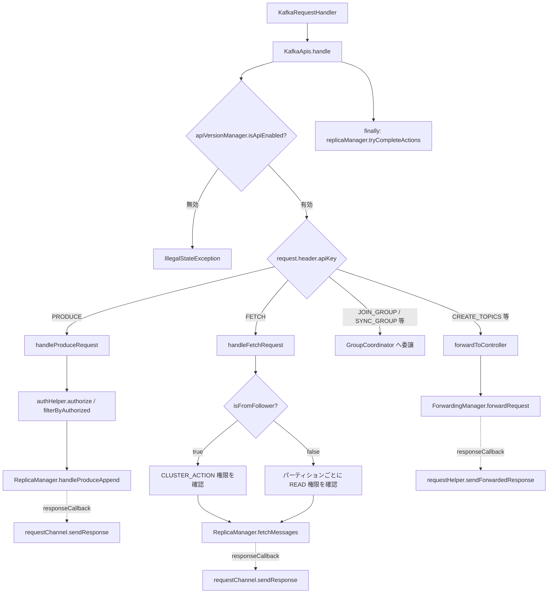

# 第4章 KafkaApis による API ディスパッチ

> **本章で読むソース**
>
> - [`core/src/main/scala/kafka/server/KafkaApis.scala`](https://github.com/apache/kafka/blob/4.3.1/core/src/main/scala/kafka/server/KafkaApis.scala)
> - [`core/src/main/scala/kafka/server/RequestHandlerHelper.scala`](https://github.com/apache/kafka/blob/4.3.1/core/src/main/scala/kafka/server/RequestHandlerHelper.scala)

## この章の狙い

第3章では、`KafkaRequestHandler` が `RequestChannel` のリクエストキューからリクエストを取り出し、`ApiRequestHandler.handle` を呼び出すところまでを追った。

本章では、その呼び出し先である`KafkaApis`を読む。

`KafkaApis`は、`ApiKeys`で識別されるおよそ60種類のリクエストすべてを受け止め、対応する処理へ振り分ける単一の窓口である。

Produce と Fetch という代表的な2つのリクエストを例に、認可からレプリカへの委譲、応答送信までの一連の流れを具体的に確認する。

## 前提

`KafkaApis`のコンストラクタは、認可を担う`AuthHelper`、応答の送信と調整を担う`RequestHandlerHelper`、そしてレプリケーションを担う`ReplicaManager`やコンシューマーグループの調整を担う`GroupCoordinator`など、ブローカーが持つ主要コンポーネントへの参照をまとめて受け取る。

[`core/src/main/scala/kafka/server/KafkaApis.scala L90-L113`](https://github.com/apache/kafka/blob/4.3.1/core/src/main/scala/kafka/server/KafkaApis.scala#L90-L113)

```scala
class KafkaApis(val requestChannel: RequestChannel,
                val forwardingManager: ForwardingManager,
                val replicaManager: ReplicaManager,
                val groupCoordinator: GroupCoordinator,
                val txnCoordinator: TransactionCoordinator,
                val shareCoordinator: ShareCoordinator,
                val autoTopicCreationManager: AutoTopicCreationManager,
                val brokerId: Int,
                val config: KafkaConfig,
                val configRepository: ConfigRepository,
                val metadataCache: MetadataCache,
                val metrics: Metrics,
                val authorizerPlugin: Option[Plugin[Authorizer]],
                val quotas: QuotaManagers,
                val fetchManager: FetchManager,
                val sharePartitionManager: SharePartitionManager,
                brokerTopicStats: BrokerTopicStats,
                val clusterId: String,
                time: Time,
                val tokenManager: DelegationTokenManager,
                val apiVersionManager: ApiVersionManager,
                val clientMetricsManager: ClientMetricsManager,
                val groupConfigManager: GroupConfigManager
) extends ApiRequestHandler with Logging {
```

つまり`KafkaApis`自身は状態をほとんど持たず、各コンポーネントへ処理を委譲するための配線役に徹している。

この設計により、リクエストの種類ごとの分岐ロジックと、各サブシステムの実処理とが分離され、`KafkaApis`を読むだけでどのリクエストがどのコンポーネントに委譲されるかを一望できる。

## handle メソッドの dispatch 構造

`ApiRequestHandler`が定義するインターフェースメソッド`handle`が、`KafkaApis`における唯一のエントリポイントである。

[`core/src/main/scala/kafka/server/KafkaApis.scala L152-L264`](https://github.com/apache/kafka/blob/4.3.1/core/src/main/scala/kafka/server/KafkaApis.scala#L152-L264)

```scala
override def handle(request: RequestChannel.Request, requestLocal: RequestLocal): Unit = {
    def handleError(e: Throwable): Unit = {
      error(s"Unexpected error handling request ${request.requestDesc(true)} " +
        s"with context ${request.context}", e)
      requestHelper.handleError(request, e)
    }

    try {
      trace(s"Handling request:${request.requestDesc(true)} from connection ${request.context.connectionId};" +
        s"securityProtocol:${request.context.securityProtocol},principal:${request.context.principal}")

      if (!apiVersionManager.isApiEnabled(request.header.apiKey, request.header.apiVersion)) {
        // The socket server will reject APIs which are not exposed in this scope and close the connection
        // before handing them to the request handler, so this path should not be exercised in practice
        throw new IllegalStateException(s"API ${request.header.apiKey} with version ${request.header.apiVersion} is not enabled")
      }

      request.header.apiKey match {
        case ApiKeys.PRODUCE => handleProduceRequest(request, requestLocal)
        case ApiKeys.FETCH => handleFetchRequest(request)
        // ... (中略、ApiKeys の種類分だけ case が続く) ...
        case ApiKeys.CREATE_TOPICS => forwardToController(request)
        // ... (中略) ...
        case _ => throw new IllegalStateException(s"No handler for request api key ${request.header.apiKey}")
      }
    } catch {
      case e: FatalExitError => throw e
      case e: Throwable => handleError(e)
    } finally {
      // try to complete delayed action. In order to avoid conflicting locking, the actions to complete delayed requests
      // are kept in a queue. We add the logic to check the ReplicaManager queue at the end of KafkaApis.handle() and the
      // expiration thread for certain delayed operations (e.g. DelayedJoin)
      // Delayed fetches are also completed by ReplicaFetcherThread.
      replicaManager.tryCompleteActions()
      // The local completion time may be set while processing the request. Only record it if it's unset.
      if (request.apiLocalCompleteTimeNanos < 0)
        request.apiLocalCompleteTimeNanos = time.nanoseconds
    }
  }
```

`handle`は次の3段階で構成される。

まず、`apiVersionManager.isApiEnabled`で、そのブローカーが今のプロセスロール（ブローカー専用かコントローラー兼務か）でこの API バージョンを提供しているかを確認する。

次に、`request.header.apiKey`を鍵にした巨大な`match`式で、`ApiKeys.PRODUCE`なら`handleProduceRequest`、`ApiKeys.CREATE_TOPICS`なら`forwardToController`のように、個別のハンドラメソッドへ振り分ける。

最後に`finally`ブロックで、`ReplicaManager`が抱える遅延処理（Purgatoryに保留されたリクエスト）を完了させる試みを行う。

この`match`式には、`forwardToController`という共通の委譲先が繰り返し登場する。

`CREATE_TOPICS`や`DELETE_TOPICS`のようにメタデータを変更するリクエストは、ブローカー自身では処理せず、クラスタの単一の意思決定者である**コントローラー**へ転送される。

[`core/src/main/scala/kafka/server/KafkaApis.scala L131-L140`](https://github.com/apache/kafka/blob/4.3.1/core/src/main/scala/kafka/server/KafkaApis.scala#L131-L140)

```scala
private def forwardToController(request: RequestChannel.Request): Unit = {
    def responseCallback(responseOpt: Option[AbstractResponse]): Unit = {
      responseOpt match {
        case Some(response) => requestHelper.sendForwardedResponse(request, response)
        case None => handleInvalidVersionsDuringForwarding(request)
      }
    }

    forwardingManager.forwardRequest(request, responseCallback)
  }
```

`forwardToController`は`ForwardingManager`へリクエストを渡し、応答が返ってきたときに呼ばれるコールバックだけを登録して即座に戻る。

処理を`ReplicaManager`へ委譲する Produce や Fetch と、`ForwardingManager`経由でコントローラーへ委譲する管理系リクエストとで、委譲先が異なる点は区別しておく。

前者はブローカー自身がデータプレーンの処理主体であり、後者はコントローラーがメタデータの単一の書き込み主体だからである。

## Produce リクエストの処理

`handleProduceRequest`は、認可とバリデーションを済ませたパーティションだけを`ReplicaManager`へ渡し、書き込みが完了した時点でコールバックから応答を送るという構成を取る。

[`core/src/main/scala/kafka/server/KafkaApis.scala L396-L558`](https://github.com/apache/kafka/blob/4.3.1/core/src/main/scala/kafka/server/KafkaApis.scala#L396-L558)

```scala
def handleProduceRequest(request: RequestChannel.Request, requestLocal: RequestLocal): Unit = {
    val produceRequest = request.body[ProduceRequest]

    if (RequestUtils.hasTransactionalRecords(produceRequest)) {
      val isAuthorizedTransactional = produceRequest.transactionalId != null &&
        authHelper.authorize(request.context, WRITE, TRANSACTIONAL_ID, produceRequest.transactionalId)
      if (!isAuthorizedTransactional) {
        requestHelper.sendErrorResponseMaybeThrottle(request, Errors.TRANSACTIONAL_ID_AUTHORIZATION_FAILED.exception)
        return
      }
    }
    // ... (中略、トピックごとにパーティションを列挙し topicIdToPartitionData へ積む) ...
    // cache the result to avoid redundant authorization calls
    val authorizedTopics = authHelper.filterByAuthorized(request.context, WRITE, TOPIC, topicIdToPartitionData)(_._1.topic)

    topicIdToPartitionData.foreach { case (topicIdPartition, partition) =>
      val memoryRecords = partition.records.asInstanceOf[MemoryRecords]
      if (!authorizedTopics.contains(topicIdPartition.topic))
        unauthorizedTopicResponses += topicIdPartition -> new PartitionResponse(Errors.TOPIC_AUTHORIZATION_FAILED)
      else if (!metadataCache.contains(topicIdPartition.topicPartition))
        nonExistingTopicResponses += topicIdPartition -> new PartitionResponse(Errors.UNKNOWN_TOPIC_OR_PARTITION)
      else
        try {
          ProduceRequest.validateRecords(request.header.apiVersion, memoryRecords)
          authorizedRequestInfo += (topicIdPartition -> memoryRecords)
        } catch {
          case e: ApiException =>
            invalidRequestResponses += topicIdPartition -> new PartitionResponse(Errors.forException(e))
        }
    }
    // ... (中略、sendResponseCallback と processingStatsCallback の定義) ...
    if (authorizedRequestInfo.isEmpty)
      sendResponseCallback(Map.empty)
    else {
      val internalTopicsAllowed = request.header.clientId == "__admin_client"
      val transactionSupportedOperation = AddPartitionsToTxnManager.produceRequestVersionToTransactionSupportedOperation(request.header.apiVersion())
      // call the replica manager to append messages to the replicas
      replicaManager.handleProduceAppend(
        timeout = produceRequest.timeout.toLong,
        requiredAcks = produceRequest.acks,
        internalTopicsAllowed = internalTopicsAllowed,
        transactionalId = produceRequest.transactionalId,
        entriesPerPartition = authorizedRequestInfo,
        responseCallback = sendResponseCallback,
        recordValidationStatsCallback = processingStatsCallback,
        requestLocal = requestLocal,
        transactionSupportedOperation = transactionSupportedOperation)

      // if the request is put into the purgatory, it will have a held reference and hence cannot be garbage collected;
      // hence we clear its data here in order to let GC reclaim its memory since it is already appended to log
      produceRequest.clearPartitionRecords()
    }
  }
```

処理の流れは次の4段階に分けられる。

第一に、トランザクショナルな書き込みであれば`TRANSACTIONAL_ID`に対する`WRITE`権限を確認する。

第二に、リクエストに含まれる各パーティションに対して`TOPIC`単位の`WRITE`権限を`authHelper.filterByAuthorized`でまとめて確認し、権限のないパーティション、存在しないパーティション、レコード形式が不正なパーティションをあらかじめ振り分けて`unauthorizedTopicResponses`などのマップへ退避させる。

第三に、残った`authorizedRequestInfo`（認可済みで書き込み可能なパーティションの集合）だけを`replicaManager.handleProduceAppend`に渡す。

第四に、`ReplicaManager`側での書き込みが完了すると`sendResponseCallback`が呼ばれ、退避しておいた認可エラーなどを`mergedResponseStatus`としてマージしたうえで、クォータによるスロットリングを適用して応答を送信する。

この`authorizedRequestInfo`が空の場合に`sendResponseCallback(Map.empty)`を直接呼ぶ分岐は、全パーティションが認可エラーだった場合に`ReplicaManager`を経由せず即座にエラー応答を返すための短絡路である。

## Fetch リクエストの処理

`handleFetchRequest`も認可、委譲、コールバック応答という骨格は`handleProduceRequest`と共通するが、認可の分岐がフォロワーからのフェッチとコンシューマーからのフェッチとで異なる。

[`core/src/main/scala/kafka/server/KafkaApis.scala L563-L776`](https://github.com/apache/kafka/blob/4.3.1/core/src/main/scala/kafka/server/KafkaApis.scala#L563-L776)

```scala
def handleFetchRequest(request: RequestChannel.Request): Unit = {
    // ... (中略、fetchRequest のパースと fetchContext の生成) ...
    val erroneous = mutable.ArrayBuffer[(TopicIdPartition, FetchResponseData.PartitionData)]()
    val interesting = mutable.ArrayBuffer[(TopicIdPartition, FetchRequest.PartitionData)]()
    if (fetchRequest.isFromFollower) {
      // The follower must have ClusterAction on ClusterResource in order to fetch partition data.
      if (authHelper.authorize(request.context, CLUSTER_ACTION, CLUSTER, CLUSTER_NAME)) {
        fetchContext.foreachPartition { (topicIdPartition, data) =>
          if (topicIdPartition.topic == null)
            erroneous += topicIdPartition -> FetchResponse.partitionResponse(topicIdPartition, Errors.UNKNOWN_TOPIC_ID)
          else if (!metadataCache.contains(topicIdPartition.topicPartition))
            erroneous += topicIdPartition -> FetchResponse.partitionResponse(topicIdPartition, Errors.UNKNOWN_TOPIC_OR_PARTITION)
          else
            interesting += topicIdPartition -> data
        }
      } else {
        fetchContext.foreachPartition { (topicIdPartition, _) =>
          erroneous += topicIdPartition -> FetchResponse.partitionResponse(topicIdPartition, Errors.TOPIC_AUTHORIZATION_FAILED)
        }
      }
    } else {
      // Regular Kafka consumers need READ permission on each partition they are fetching.
      val partitionDatas = new mutable.ArrayBuffer[(TopicIdPartition, FetchRequest.PartitionData)]
      fetchContext.foreachPartition { (topicIdPartition, partitionData) =>
        if (topicIdPartition.topic == null)
          erroneous += topicIdPartition -> FetchResponse.partitionResponse(topicIdPartition, Errors.UNKNOWN_TOPIC_ID)
        else
          partitionDatas += topicIdPartition -> partitionData
      }
      val authorizedTopics = authHelper.filterByAuthorized(request.context, READ, TOPIC, partitionDatas)(_._1.topicPartition.topic)
      partitionDatas.foreach { case (topicIdPartition, data) =>
        if (!authorizedTopics.contains(topicIdPartition.topic))
          erroneous += topicIdPartition -> FetchResponse.partitionResponse(topicIdPartition, Errors.TOPIC_AUTHORIZATION_FAILED)
        else if (!metadataCache.contains(topicIdPartition.topicPartition))
          erroneous += topicIdPartition -> FetchResponse.partitionResponse(topicIdPartition, Errors.UNKNOWN_TOPIC_OR_PARTITION)
        else
          interesting += topicIdPartition -> data
      }
    }
    // ... (中略、processResponseCallback の定義) ...
    if (interesting.isEmpty) {
      processResponseCallback(Seq.empty)
    } else {
      // ... (中略、fetchMaxBytes などクォータに基づくパラメータ計算) ...
      val params = new FetchParams(
        fetchRequest.replicaId,
        fetchRequest.replicaEpoch,
        fetchRequest.maxWait,
        fetchMinBytes,
        fetchMaxBytes,
        FetchIsolation.of(fetchRequest),
        clientMetadata
      )

      // call the replica manager to fetch messages from the local replica
      replicaManager.fetchMessages(
        params = params,
        fetchInfos = interesting,
        quota = replicationQuota(fetchRequest),
        responseCallback = processResponseCallback,
      )
    }
  }
```

`fetchRequest.isFromFollower`の値によって、必要な権限がまったく異なる。

フォロワーレプリカからのフェッチであれば、クラスタ全体に対する`CLUSTER_ACTION`権限だけを1回確認すればよい（レプリケーションはブローカー間の内部通信であり、トピックごとの読み取り権限とは性質が異なるため）。

一方、通常のコンシューマーからのフェッチであれば、要求された各パーティションが属する`TOPIC`ごとに`READ`権限を確認する。

権限のあるパーティションと存在するパーティションだけが`interesting`に集められ、`replicaManager.fetchMessages`に渡される。

`ReplicaManager`側での読み取りが完了すると`processResponseCallback`が呼ばれ、フォロワー向けとコンシューマー向けとで異なるクォータ（`quotas.leader`と`quotas.fetch`）を適用したうえで応答を送信する。

## apiVersion の互換性

Kafka のプロトコルは、クライアントとブローカーのバージョンが異なっていても通信できるよう、リクエストごとに複数のバージョンを許容する。

`handleFetchRequest`冒頭では、この`versionId`を使ってレスポンスの組み立て方を変えている。

[`core/src/main/scala/kafka/server/KafkaApis.scala L622-L632`](https://github.com/apache/kafka/blob/4.3.1/core/src/main/scala/kafka/server/KafkaApis.scala#L622-L632)

```scala
    def maybeDownConvertStorageError(error: Errors): Errors = {
      // If consumer sends FetchRequest V5 or earlier, the client library is not guaranteed to recognize the error code
      // for KafkaStorageException. In this case the client library will translate KafkaStorageException to
      // UnknownServerException which is not retriable. We can ensure that consumer will update metadata and retry
      // by converting the KafkaStorageException to NotLeaderOrFollowerException in the response if FetchRequest version <= 5
      if (error == Errors.KAFKA_STORAGE_ERROR && versionId <= 5) {
        Errors.NOT_LEADER_OR_FOLLOWER
      } else {
        error
      }
    }
```

古いバージョンのクライアントが認識できないエラーコードを、そのバージョンでも解釈できる別のエラーコードへ読み替えている。

同様に`versionId >= 16`であれば応答に現在のリーダー情報を含めるなど、`handle`に入る前段階の`apiVersionManager.isApiEnabled`によるバージョン単位の有効/無効判定だけでなく、各ハンドラの内部でもバージョンごとの分岐が随所にある。

## 最適化の工夫：コールバックによる応答の非同期化

`handleProduceRequest`も`handleFetchRequest`も、`ReplicaManager`への委譲メソッドを呼んだ直後にメソッド本体を終えている。

書き込みやレプリケーションの完了を待たずに`KafkaApis.handle`が戻る点が、この設計の核心である。

`ReplicaManager.handleProduceAppend`や`fetchMessages`は、必要な`acks`を持つレプリカへの複製が完了する、あるいは`fetchMinBytes`に達するデータが揃うまで、リクエストを**Purgatory**（第16章）に保留することがある。

もしこの完了を`KafkaRequestHandler`のスレッドが同期的に待つ設計であれば、そのスレッドは保留期間中ずっと1つのリクエストに占有され、限られた数のリクエストハンドラスレッドが他のリクエストを処理できなくなる。

`KafkaApis`は`sendResponseCallback`や`processResponseCallback`という関数を`ReplicaManager`に渡し、完了時にその関数を呼んでもらう形にすることで、リクエストハンドラスレッドを即座に呼び出し元へ返す。

Purgatory に保留された処理は、遅延操作を管理する別のスレッドや、レプリケーションの進行を検知した`ReplicaFetcherThread`側から完了させられ、`handle`の`finally`節にある`replicaManager.tryCompleteActions()`がその完了を確実に拾い上げる。

## Mermaid 図



## まとめ

`KafkaApis`は、`ApiKeys`ごとに分岐する巨大な`match`式を通じて、Kafka プロトコルの全リクエストを単一の入口で受け止める。

Produce と Fetch では、認可チェックで対象パーティションを絞り込んだのち、実処理を`ReplicaManager`へ委譲し、その完了をコールバックで受け取って応答を送る、という共通のパターンが見られる。

このコールバックによる非同期化こそが、少数のリクエストハンドラスレッドで多数の未完了リクエストを同時に抱えられる理由である。

管理系のリクエストは`ForwardingManager`を介してコントローラーへ転送され、`KafkaApis`自身はブローカーローカルな処理とコントローラーへの委譲とを`handle`の分岐だけで使い分ける。

## 関連する章

- [第3章 リクエストパイプライン](03-request-pipeline.md)
- [第14章 ReplicaManager](../part04-replication/14-replicamanager.md)
- [第21章 Group Coordinator](../part06-consumer/21-group-coordinator.md)
